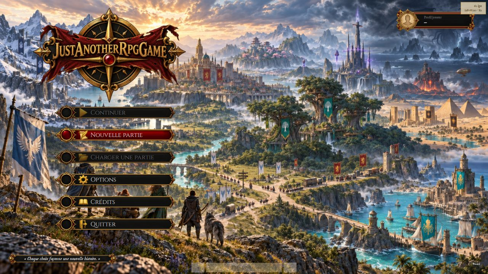
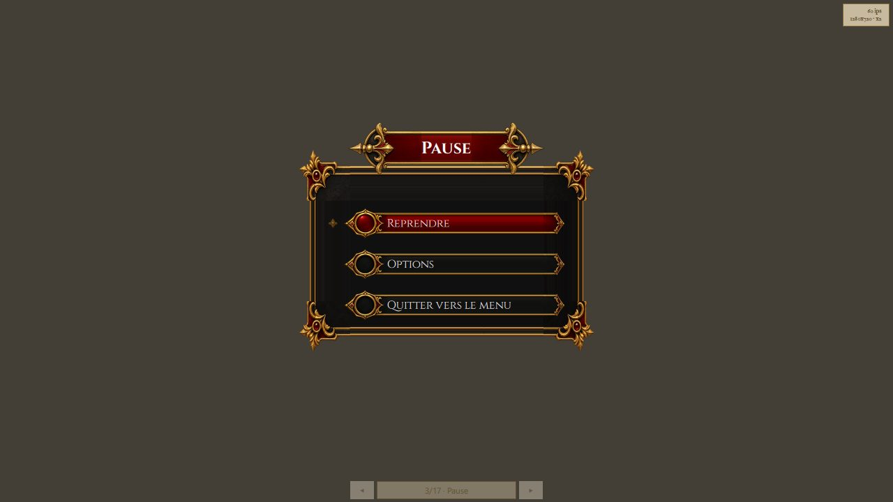

# Jouer

Ce guide s'adresse aux **joueurs** : naviguer dans les menus, régler le jeu, et savoir ce que la
version d'aujourd'hui donne à faire.

> **À lire en premier — le monde est en cours de reconstruction.** Le jeu a quitté le pixel art pour
> la 2D haute définition (`LOT-101`), et cette bascule a commencé par **vider** les cartes et les
> images qui en dépendaient (`LOT-102`). Il n'y a donc, pour l'instant, **aucune carte livrée** :
> « Nouvelle partie » ouvre l'écran de jeu, qui affiche *« La ville de départ ne s'ouvre pas »*.
> Tout ce qui suit sur les menus, les écrans et les réglages est en revanche bien là, et se
> manipule. Les deux quartiers et le donjon de la démo reviennent avec la version `0.0.1`
> ([la planification](../../../Planning/README.md) dit où elle en est).

## Le menu principal

Six entrées, navigables aux flèches **↑**/**↓** (ou à la souris) et validées par **Entrée** (ou
clic) : **Continuer** et **Charger une partie** (grisées tant que la sauvegarde n'existe pas),
**Nouvelle partie**, **Options**, **Crédits**, **Quitter**. Une manette **XInput** navigue aussi
dans les menus.

## Parcourir le monde

| Action | Clavier |
|--------|---------|
| Se déplacer | **↑ ↓ ← →**, **Z Q S D** ou **W A S D** |
| Interagir (parler, ouvrir) | **E** ou **Espace** |
| Mettre en pause | **Échap** |

Le déplacement est libre, en huit directions. On passe d'une carte à l'autre en marchant sur ses
**portails**, et parler à un personnage ouvre un **dialogue**.

Cette capture est le meilleur résumé de l'état du jeu : **le châssis est fini, le contenu revient**.
Les cadres, les jauges et le bandeau sont ceux qui serviront ; ils attendent une carte à afficher.

Les boutons du bandeau ouvrent l'inventaire, le journal, la **carte** (monde, région, ville) et les
options. Ces écrans-là s'ouvrent et se parcourent dès maintenant.

La carte a trois niveaux — le monde, une région, le plan d'une ville — et l'on descend de l'un à
l'autre par un repère. On ne s'y déplace pas : elle sert à s'orienter.

## Combattre

Le combat se joue au tour par tour, sur une grille, et la souris comme la manette pilotent le même
curseur que le clavier. Les règles, l'adversaire et l'interface sont écrits et éprouvés ; ce qui
manque est l'**endroit** où se battre — on y entre en parlant au héraut du Colisée, donc par une
carte, et les cartes reviennent avec la démo `0.0.1`. Les commandes ci-dessous sont celles qui
serviront alors.

| Action | Clavier |
|--------|---------|
| Déplacer le curseur | **↑ ↓ ← →** |
| Confirmer (déplacement, cible) | **Entrée** |
| Changer de cible | **Tab** / **Maj+Tab** |
| Changer d'action | **Page suivante** / **Page précédente**, ou **1** à **9** |
| Revenir en arrière | **Retour arrière** |
| Finir son tour | **Espace** |
| Quitter l'arène | **Échap** |

Avant de confirmer, le curseur annonce ce que coûtera le geste et le jet qu'il faudra atteindre :
la prévisualisation **est** le calcul, pas une estimation.

## Pause

**Échap** en cours de partie ouvre la **pause** : rien n'avance derrière l'écran. Trois choix :
**Reprendre**, **Options**, **Quitter vers le menu**.

## Le menu d'options

Accessible depuis le menu principal, la pause ou le bandeau. Trois onglets : **Général** (langue du
jeu, journaux de session), **Graphismes** (plein écran, synchronisation verticale — appliquée au
prochain lancement —, compteur de diagnostic) et **Audio** (volume général). **Appliquer** retient
les réglages, **Annuler** les abandonne, **Par défaut** les rétablit.

> **Note** — Le réglage du volume atteint réellement le moteur audio, même si le jeu ne joue encore
> aucun son : le câblage est en place, les bruitages viendront avec le contenu. Aucun réglage
> affiché ici n'est inopérant — le jeu s'interdit d'en montrer un qui ne ferait rien.

## Votre partie, et où elle vit

Trois dossiers sont créés à côté de l'exécutable, et ne partent jamais ailleurs :

| Dossier | Ce qu'il contient |
|---|---|
| `Logs/` | le journal de la session, à joindre à un rapport de problème |
| `Crashes/` | le rapport technique écrit si le jeu se termine anormalement |
| les réglages | conservés d'un lancement à l'autre, avec la langue choisie |

Rien n'est envoyé nulle part : le jeu ne communique avec aucun serveur.
