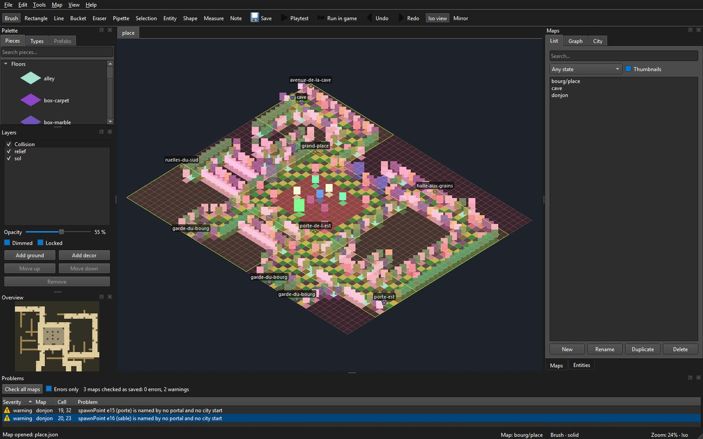

# Faire une carte dans l'éditeur

> Guide d'usage de l'auteur, écrit au [LOT-EDITOR-06](../../../Planning/versions/v0.0.0/v0.0.0-fondation/lots/LOT-EDITOR-06-fin-des-scripts.md). Depuis ce lot,
> **l'éditeur fait foi** pour les cartes faites à la main (décision D4) : aucun script ne les écrit
> plus. Le fonctionnement interne de l'outil est dans [Éditeur de niveaux](../guide-editeur.md) ; ses commandes, dans le
> README du module, `Source/Editor/README.md`.

Une carte se fait en sept temps : la créer avec son lieu, poser le sol, dresser le relief, placer
l'entrée, poser les entités, l'essayer, l'enregistrer et la contrôler. Exemple suivi : une petite
échoppe de Martpart, 12 × 8 cases.

## 0. Ouvrir l'éditeur sur le dépôt

Construire (`scripts/build.ps1`), puis lancer `build\ninja\bin\LevelEditor.exe`. L'éditeur ouvre
les données de **l'arbre des sources qui l'a construit** — `Source/Elements` —, et non la copie
que la construction refait à côté de l'exécutable : ce qu'on enregistre arrive dans le dépôt, et la
construction suivante ne l'écrase pas. Le titre de la fenêtre dit quel dossier est ouvert ;
`--data <dossier>` en ouvre un autre.



Six panneaux, qu'on retrouvera tout au long de cette page : **Palette** (les pièces),
**Layers** (les couches), le **canevas** au centre, **Maps** (les cartes du dépôt),
**Entities · Inspector** (ce qu'on a posé) et **Problems** (ce qui cloche). Ils se déplacent, se
détachent et se referment ; la disposition est retenue d'une session à l'autre.

## 1. Créer la carte, avec son lieu

Panneau **Maps**, onglet *List*, bouton **New** : un nom (`echoppe`), une taille en cases, un
**lieu** — la planche dont la carte prendra ses pièces (`martpart`, `coliseum`…) — et un
**modèle**. Sans modèle, la carte naît comme les cartes livrées : une couche de sol `sol` qui
nomme le lieu, une couche de décor `relief`, et une collision déduite où tout, encore vide,
arrête la vue — sauf l'entrée, au coin bas gauche, posée sur une case de terre. Avec un modèle
(`LOT-EDITOR-08`) — **Interior**, **Street**, **Arena** —, elle naît avec sa taille, ses murs et
son entrée déjà posés ; choisir le modèle reprend sa taille, qu'on peut encore changer, et ce
qu'il ne couvre pas reste plein. Double-cliquer la carte dans la liste l'ouvre.

Sans lieu (« none »), on peint des types en couleurs sur une grille unique : c'est le repli des
cartes générées, pas la façon de faire une carte du jeu.

Une carte d'un quartier va dans un sous-dossier (`capital/…`) : la créer, puis la renommer
`capital/echoppe` (**Rename**, ci-dessous) ; le fichier change de dossier.

## 2. Poser le sol

Panneau **Palette**, onglet *Pieces* : la planche du lieu, groupée par classe, avec une recherche.
Une pièce de sol va d'elle-même sur la couche `sol`. Les outils, à leur touche :

| Touche | Outil | Pour |
|---|---|---|
| `R` | rectangle | le sol d'une pièce, d'une rue, d'une place |
| `B` | pinceau | les variantes de pavé, une case à la fois |
| `G` | seau | remplir une surface d'un seul sol |
| `L` | ligne | une rangée droite |
| `E` | gomme | retirer une pièce entière, emprise comprise |
| `I`, ou `Alt` + clic | pipette | reprendre la pièce d'une case |

Un geste, du clic au relâchement, se défait d'un `Ctrl+Z`. La collision suit chaque geste : une case
qui reçoit un sol devient franchissable.

## 3. Dresser le relief

Toujours dans *Pieces* : murs, fenêtres, portes, angles, lanternes, étals. Une pièce debout va sur
`relief`. Une pièce **large** (une devanture, un grand étal) occupe deux cases, depuis la case où
on la pose ; poser une pièce sur une emprise déjà prise retire celle qui y était. Le **miroir**
(`M`, par la case survolée) pose la jumelle de chaque pièce de l'autre côté d'un axe : une façade
symétrique se dresse d'un seul trait.

**F9** bascule entre l'isométrie (ce que le jeu montrera) et la vue à plat, où l'on lit les types
et la collision ; **F8** rend le relief transparent pour voir le sol dessous.

## 4. Placer l'entrée

Panneau **Layers** : choisir la couche *Collision*, puis dans *Palette*, onglet *Types*, le
marqueur **Entry**, et cliquer la case où le héros apparaît. Une carte n'a qu'une entrée : la
reposer la déplace. Peindre la collision ailleurs **force** la case ; la gomme la rend à la
déduction. On ne force qu'en dernier recours : une case forcée ne suit plus les pièces.

## 5. Poser les entités

Outil **Entité** (`O`), puis une famille dans la liste *Place* du panneau **Entities** : un PNJ
(son dialogue, sa figurine), un coffre, un point d'arrivée (`spawnPoint`, nommé), un portail
(`portal` : la carte visée et le point d'arrivée de l'autre côté), une zone de combat qu'on tire
d'un coin à l'autre.
L'inspecteur propose les valeurs que les catalogues connaissent ; ses avertissements disent ce qui
manque, et une zone de combat donne son verdict tactique pendant qu'on la tire. Une entité reçoit
un identifiant (`e12`) qu'elle garde : les quêtes la citeront par `carte#e12`.

Pour relier deux cartes, le plus court est le **graphe du monde** (ci-dessous) : il pose les deux
paires d'un geste. À la main, poser un portail et un point d'arrivée de chaque côté.

## 6. Essayer

**P** lance l'essai immédiat depuis l'entrée, **Shift+P** depuis la case survolée : on marche, on
passe les portails, sans quitter la fenêtre. C'est l'outil de la marche et des portails.

Pour le **vrai jeu**, *Map* › *Run in game* (**F5**) lance `JustAnotherRpgGame` sur la carte
ouverte : il s'ouvre directement dessus, sans passer par ses menus, avec ses dialogues, ses écrans
et son rendu. **Maj+F5** part de la case survolée ; **Ctrl+F5** ouvre d'abord un dialogue où l'on
choisit la case de départ et les **drapeaux de monde** à poser — la même carte avant et après une
quête.

Ce qui est joué, ce sont les **brouillons** de tous les onglets ouverts, écrits dans un dossier
temporaire hors du dépôt : la retouche qu'on vient de faire se voit sans enregistrer, et la carte
d'à côté aussi quand on passe son portail. Deux choses restent celles de la dernière
construction : les **catalogues** du jeu (dialogues, rencontres, figurines, villes, assets) et son
propre `Levels/` pour les cartes qu'aucun onglet ne porte. Un essai n'enregistre rien, et fermer
l'éditeur ferme le jeu.

Le canevas montre la carte **comme le jeu la jouera** : mêmes pièces, même ordre de dessin, même
projection. Ce n'est pas une vue d'édition qui ressemblerait au jeu — c'est le même code de
composition, ce qui interdit à l'éditeur de vous montrer quelque chose que le jeu démentira.


## 7. Enregistrer, contrôler, publier

`Ctrl+S` enregistre, après validation : une carte que le jeu refuserait ne s'écrit pas. Puis, dans
un terminal à la racine du dépôt :

```
build\ninja\bin\LevelEditor.exe --check
build\ninja\bin\LevelEditor.exe --render echoppe --scale 0.5 --output echoppe.png
```

`--check` contrôle **toutes** les cartes — format, pièces, collision, identifiants, puis ce qui se
joue : références des entités, rencontres, cases utiles hors d'atteinte, portails sans retour,
clés de traduction — et c'est ce que la CI exige. Dans la fenêtre, le même contrôle remplit le
panneau **Problems**, en bas : au lancement, à chaque enregistrement, et par *Map › Check all
maps*. Un double-clic sur un constat ouvre sa carte, sélectionne l'entité et cerne la case en
magenta. Le panneau lit les cartes **enregistrées** ; les avertissements en direct de la carte
ouverte restent dans le panneau *Entities*.

Le nom d'une carte n'est pas du texte mais une clé, `map.<identifiant>.name` : « New » l'écrit
dans `Source/Elements/Localization/fr.lang` et `en.lang` avec le nom tapé ; il reste à y mettre
le vrai nom, dans chaque langue. `--render` rend la carte en PNG, comme elle rendra dans la PR : la CI publie le
rendu de chaque carte qu'une PR change (artefact `map-renders`). La carte se relit alors en diff :
le fichier est canonique, une retouche ne change que ses cases.

## Retoucher en masse, sans la souris

Ce que la main fait se rejoue par fichier : `LevelEditor --apply gestes.json` appelle les mêmes
fonctions que les outils, dans le même ordre, et ne touche pas au fichier si un geste est refusé.
C'est la façon de faire une retouche relue en diff, ou de répéter un geste sur plusieurs cartes.
Les trois retouches du `LOT-EDITOR-06` en sont des exemples
(`Planning/versions/v0.0.0/v0.0.0-fondation/annexes/LOT-EDITOR-06-fin-des-scripts/retouches/`), le format est décrit dans
`Source/Editor/Logic/GestureScript.h`.

## Répéter ce qu'on a composé : tampons et préfabriqués

Une échoppe, un étal, une cour se composent une fois (`LOT-EDITOR-08`) :

- Outil **Sélection** (`S`), tirer autour de ce qu'on veut reprendre, puis `Ctrl+C`. Le **tampon**
  emporte tout : les types de chaque couche, les pièces qui y sont ancrées — entières, le
  rectangle s'agrandissant jusqu'à leur emprise —, les entités et les cases de collision forcées.
  La barre d'état dit ce qu'il porte (`3 × 2 · 2 pieces · 1 entity`).
- `Ctrl+V` le pose, coin haut gauche sur la case survolée, **en un pas** : un `Ctrl+Z` défait tout.
  Chaque entité posée reçoit un identifiant neuf ; l'entrée, elle, n'est jamais emportée.
  `Ctrl+Maj+V` pose le **reflet** du tampon : il passe de w × h à h × w et chaque pièce prend sa
  jumelle, comme le miroir du pinceau.
- Un tampon **remplace** ce qu'il couvre, cases vides comprises : serrer la sélection.
- `Ctrl+Maj+S` (*Edit* › *Save selection as prefab…*) l'enregistre comme **préfabriqué** du lieu,
  sous un nom de minuscules, de chiffres, de tirets et de tirets bas. L'onglet **Prefabs** de la
  palette montre alors la bibliothèque du lieu, chacun avec une vignette rendue de son propre
  contenu ; le choisir arme le tampon, `Ctrl+V` le pose. Les préfabriqués sont des fichiers, dans
  `Source/Elements/Editor/Prefabs/<lieu>/` : on les renomme et on les supprime à l'explorateur.
- Sans fenêtre : `LevelEditor --list-prefabs` et
  `LevelEditor --save-prefab capital/martpart etal --from 21,24 --to 21,24`.

## Renommer, remplacer, changer de planche

Un nom qui change ne casse rien (`LOT-EDITOR-14`) :

- **Rename** (panneau *Maps* ou menu *File*) prend l'identifiant complet, dossier compris
  (`capital/echoppe`). Portails, variantes, villes et la clé du nom dans chaque catalogue suivent,
  l'annexe des notes aussi. Une boîte montre d'abord tout ce qui sera récrit.
- Menu *Map* : **Who cites this map?**, **Who cites the selected entity?** listent les citations ;
  un double-clic y mène. **Rename entity id…** et **Rename arrival point…** renomment l'entité
  sélectionnée et ce qui la cite.
- **Replace piece…** remplace une pièce par une autre de la planche, sur la carte ouverte (en un
  pas, `Ctrl+Z` le défait) ou sur toutes les cartes qui la posent.
- **Change sheet…** fait passer la carte à une autre planche : chaque pièce va à son homonyme, et
  la table du dialogue donne les autres ; on ne valide qu'une table sans trou. Un pas, lui aussi.

Tout ce qui récrit d'autres fichiers demande d'abord d'enregistrer la carte ouverte, et un refus
(nom pris, carte illisible, pièce sans correspondant) n'écrit rien. Les mêmes commandes existent
sans fenêtre : `--rename-map`, `--rename-arrival`, `--rename-id`, `--who-cites`,
`--replace-piece`, `--change-scene` (voir `Source/Editor/README.md`).

## Plusieurs cartes à la fois, et le monde autour (`LOT-EDITOR-09`)

- **Les cartes s'ouvrent en onglets.** Chacune garde son brouillon, son historique, son cadrage et
  sa sauvegarde automatique ; l'onglet porte le nom court de la carte, suivi d'une étoile tant
  qu'elle est modifiée. Ouvrir une carte déjà ouverte revient à son onglet. *File* › *Close tab*
  (`Ctrl+W`) ferme celui du dessus — le dernier reste, et fermer un onglet modifié demande d'abord
  quoi faire de son brouillon.
- **Relier deux cartes d'un geste.** Panneau *Maps*, onglet **Graph** : tirer d'une carte à une
  autre. L'éditeur montre ce qu'il va écrire — sur chacune, le portail qui mène à l'autre et le
  point d'arrivée que l'autre cite (`from-martpart`) —, puis l'écrit. La paire se pose au plus
  près de l'entrée, sur des cases libres et atteignables : `P` traverse aussitôt, dans les deux
  sens, et l'outil **Entité** déplace ensuite la porte où on la veut. Sans fenêtre :
  `LevelEditor --link-maps capital/martpart coliseum`.
- **Voir une ville par quartiers.** Onglet **City** : le plan peint de la ville, les cadres de ses
  quartiers, leur nom ; un quartier tireté n'a pas (encore) sa carte, ou n'est qu'une porte
  gardée. Double-cliquer un quartier ouvre sa carte dans son onglet.
- **Dire ce qu'est une carte.** *Map* › **Map properties…** montre son lieu (la planche ; en
  changer, c'est *Change sheet…*), et édite sa **région**, son **ambiance** — deux propriétés de
  la carte, enregistrées avec elle, que le jeu lira — et son **état** : générée, retouchée, finie.
  L'état est une note d'auteur : il va dans l'annexe `<carte>.editor.json`.
- **Voir où en est le monde.** Dans la liste des cartes, l'état paraît à côté du nom, le menu
  déroulant filtre par état, et **Thumbnails** montre chaque carte en vignette — le même rendu que
  `--render`.

## Ce qui ne se fait pas encore dans l'éditeur

- Engager un **combat** depuis une carte d'exploration : le jeu ne le branche pas encore
  ([LOT-27](../../../Planning/vision/archives/feuille-de-route-jeu.md#lot-27)). *Run in game* ouvre bien les dialogues ; une rencontre ne
  déclenche rien.
- Semer une forêt ou une prairie sans perdre les retouches : `LOT-168` du planning (`LOT-EDITOR-11`, qui pilotait un générateur, est abandonné).
