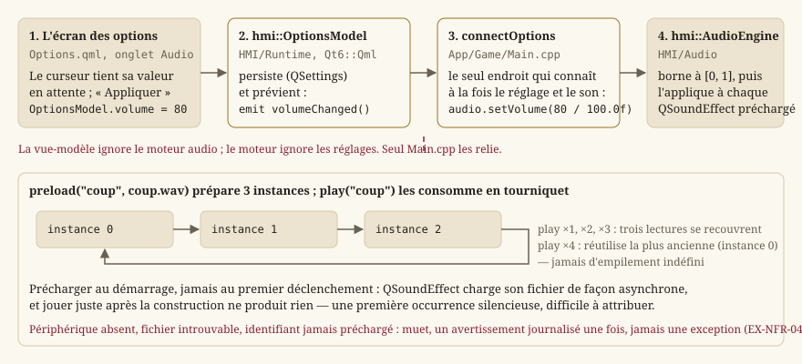

# Audio

Cette page explique comment le jeu produit du son : le socle de lecture (`hmi::AudioEngine`), le
réglage de volume qui le pilote depuis l'écran des options, et le provisionnement de Qt
Multimedia. Le périmètre de code est `Source/HMI/Audio` — un en-tête, une implémentation — et
l'unique endroit qui le relie au reste, `Source/App/Game/Main.cpp`.

> **Note** — Le jeu ne livre aujourd'hui **aucun bruitage** : le socle existe, le volume l'atteint,
> mais aucun son n'est encore préchargé ni joué. La page décrit donc un mécanisme complet et testé,
> dont le contenu viendra avec les lots qui en ont besoin. C'est volontaire : le socle a été écrit
> quand la frontière `Core`/`HMI` se posait, pas quand le premier bruitage a été demandé.

## Pourquoi une page pour si peu de code

Parce que l'audio est l'endroit où la règle d'architecture du projet est la plus facile à enfreindre
sans s'en rendre compte. Un coup d'épée « fait du bruit » : la tentation est d'appeler le son depuis
la fonction qui résout l'attaque — c'est-à-dire depuis `Core`. Le jour où cela arrive, la
simulation cesse d'être testable sans périphérique audio, et le déterminisme n'est plus vérifiable
en tête d'une machine de CI sans carte son.

## La règle d'or, une fois de plus

`Core` **expose des transitions d'état** ; c'est `HMI` qui décide qu'une transition fait du bruit.
Exactement la même séparation que pour le rendu ([Rendu 2D : de la scène à l'écran](guide-rendu.md))
— et pour la même raison : la simulation reste pure, déterministe et testable **sans périphérique
audio** (`EX-NFR-010`, `EX-ARCH-012`, `EX-REN-047`). Aucun fichier de `Core/` n'inclut Qt, ni ne
sait qu'un son existe.

Concrètement, la règle se tient d'elle-même : `Core` ne connaît aucun type de cette page, et le
contrôle `check_ui_layers.py` refuse une inclusion de Qt dans `Core`
([Build, tests et intégration continue](guide-outils.md)). Ce n'est donc pas une discipline à
retenir, c'est une erreur de compilation puis un échec de CI.

## Le socle : `hmi::AudioEngine`

`Source/HMI/Audio/AudioEngine.h` enveloppe `QSoundEffect` (Qt Multimedia), le composant Qt conçu
précisément pour des échantillons courts à faible latence — le cas d'usage exact d'un bruitage,
par opposition à `QMediaPlayer`, pensé pour la musique, dont la latence et le coût de mise en route
sont bien plus élevés. Jouer un claquement de porte avec `QMediaPlayer` s'entend : le son arrive
après le geste.

La classe est **non copiable et non déplaçable** : elle possède des `QSoundEffect` et un
périphérique ouvert, et la destruction arrête proprement les lectures en cours (RAII,
`EX-NFR-041`). Un moteur audio qu'on duplique par mégarde jouerait deux fois le même son, ou
fermerait le périphérique d'un autre.

### `hmi::AudioEngine::AudioEngine`

Deux constructeurs :

| Constructeur | Ce qu'il fait |
|---|---|
| `AudioEngine()` | Ouvre le périphérique de sortie par défaut (`QMediaDevices::defaultAudioOutput()`). Aucun périphérique → le moteur passe en état **muet** et journalise **un** avertissement. |
| `AudioEngine(ForceMuted::Yes)` | Construit un moteur déjà muet **sans toucher au périphérique réel**. |

Le second existe pour une raison précise : le comportement « pas de son » doit être **vérifiable**,
et il ne le serait pas s'il fallait, pour le tester, une machine sans carte son. Une machine de CI
peut en avoir une, ou pas, selon l'image ; un test qui dépend de ce détail échoue un jour sans que
le code ait changé. L'étiquette rend l'état testable à volonté.

Dans tous les cas, **aucune exception ne franchit cette frontière** (`EX-NFR-040`). L'absence de son
n'est pas une panne : c'est un mode de fonctionnement dégradé dans lequel le jeu reste pleinement
jouable.

### `hmi::AudioEngine::muted`

Vrai si le moteur ne produira aucun son — périphérique absent, ou état forcé pour les tests. C'est
la seule façon pour l'appelant de savoir qu'il joue dans le vide ; `play` ne le lui dira pas, par
construction.

### `hmi::AudioEngine::preload`

`preload(id, fichier)` associe un **identifiant logique** (`"coup"`) à un fichier WAV. Trois points
de son contrat ne se devinent pas :

1. **Il faut l'appeler au démarrage, jamais au premier déclenchement.** `QSoundEffect` charge son
   fichier de façon **asynchrone** : jouer immédiatement après construction ne produit rien. Un
   préchargement paresseux donnerait donc une **première occurrence silencieuse** — et les suivantes
   audibles. C'est un défaut particulièrement pénible à attribuer, parce qu'il disparaît dès qu'on
   cherche à le reproduire.
2. **Un fichier absent ne fait pas échouer l'appel.** La lecture ultérieure de cet identifiant
   restera simplement silencieuse, avec son avertissement journalisé.
3. **Il prépare `MAX_INSTANCES_PER_EVENT` (3) instances identiques**, pas une seule — voir le
   tourniquet ci-dessous.

Un second appel avec le même identifiant **remplace** la réserve précédente.

### `hmi::AudioEngine::play`

`play(id)` joue l'échantillon, et ne fait **rien** — sans erreur pour l'appelant — si le moteur est
muet, si l'identifiant n'a jamais été préchargé, ou si le fichier n'a pas pu être chargé.

Le point intéressant est le **tourniquet**. Un même son déclenché en rafale — trois coups d'épée en
une seconde — poserait, avec une seule instance de `QSoundEffect`, le problème classique : le
deuxième déclenchement **interrompt** le premier, ce qui s'entend comme un hachage. La solution
naïve inverse — créer une instance par déclenchement — empile indéfiniment des lectures
superposées, et sature aussi bien le mélangeur que la mémoire sur un son déclenché en boucle par un
bug.

La réserve de trois instances consommées en rotation tient les deux bouts : jusqu'à trois lectures
se **recouvrent** proprement, et la quatrième réutilise la plus ancienne — celle qui est la plus
près d'être terminée, donc celle dont l'interruption s'entend le moins.

### `hmi::AudioEngine::setVolume` et `volume`

Le volume est **borné à `[0, 1]`** : hors de cet intervalle, il est ramené à l'extrémité la plus
proche plutôt que propagé tel quel. Une valeur négative ou explosée ne doit jamais atteindre
`QSoundEffect` — et la source de ces valeurs n'est pas hypothétique, c'est un réglage persisté qu'un
fichier de configuration édité à la main peut rendre absurde.

Le réglage s'applique **immédiatement à tous les échantillons déjà préchargés**, et non au prochain
préchargement : baisser le son pendant qu'un bruit dure doit s'entendre tout de suite.

## Le volume : de l'écran des options au moteur

Le moteur vit dans l'application du jeu (`Source/App/Game/Main.cpp`), pas dans la vue-modèle des
options : ce n'est pas à un écran de réglages de posséder le son du jeu. La figure ci-dessus montre
les quatre maillons ; l'essentiel tient dans ce que chacun **ignore** :

- `Options.qml` ne connaît que `hmi::OptionsModel` — un écran ne pilote jamais un moteur ;
- `hmi::OptionsModel` persiste la valeur et émet `volumeChanged()`, sans savoir qu'un son existe ;
- `connectOptions` est le **seul** endroit qui connaît à la fois le réglage et le moteur : il lit le
  volume au démarrage, puis le réapplique à chaque signal ;
- `hmi::AudioEngine` reçoit un nombre, et ignore d'où il vient.

Conséquence pratique : le curseur atteint réellement le moteur (`EX-REN-048`, `EX-IHM-083`) **même
tant qu'aucun son n'est joué**, ce qui permet de vérifier le câblage aujourd'hui, avant qu'il n'y ait
quoi que ce soit à entendre. Un réglage qu'on ne peut pas éprouver est un réglage dont on découvre
qu'il ne marche pas le jour où il devrait (`EX-IHM-072`).

## Provisionnement : Qt Multimedia

`Qt6::Multimedia` est un **composant additionnel** de Qt, pas une bibliothèque tierce : il figure
dans `find_package(Qt6 ... COMPONENTS ... Multimedia ...)` de `Source/CMakeLists.txt`, avec la
même garde que `Widgets`/`Gui` (absent → cibles Qt ignorées, configuration jamais cassée,
`EX-BUILD-010`). Provisionné en CI par `modules: qtmultimedia` dans l'action
`.github/actions/setup-qt` ; en local, via le composant `Multimedia` de l'installateur Qt officiel
ou `aqtinstall -m qtmultimedia`.

`windeployqt` (`POST_BUILD`) déploie `Qt6Multimedia.dll` et ses greffons (`multimedia/`) à côté de
l'exécutable — vérifié **explicitement** en CI (`ci.yml`). La vérification n'est pas de la
défiance : un build local réussi ne prouve rien sur le zip publié, où c'est justement un greffon
oublié qui rend le jeu muet chez celui qui le télécharge, et nulle part ailleurs.

## Ce qu'il restera à décider

Le socle ne tranche volontairement pas deux questions, parce qu'elles n'ont de bonne réponse
qu'avec du contenu sous la main :

- **La musique.** `QSoundEffect` ne convient pas à une piste longue ; elle demandera `QMediaPlayer`,
  donc un second chemin, et un second volume dans les options.
- **Qui déclenche.** `HMI` observe aujourd'hui les transitions de `Core` ; reste à choisir *où*
  exactement — la vue-modèle, ou la surface de rendu qui voit déjà passer l'animation.

## Voir aussi
- `hmi::AudioEngine`, `hmi::OptionsModel`.
- [Rendu 2D : de la scène à l'écran](guide-rendu.md) — la même séparation `Core`/`HMI` appliquée à l'image.
- [Écrans, navigation et boucle de jeu](guide-ecrans.md) — l'écran des options, d'où vient le volume.
- [Build, tests et intégration continue](guide-outils.md) — le contrôle qui interdit Qt dans `Core`.
