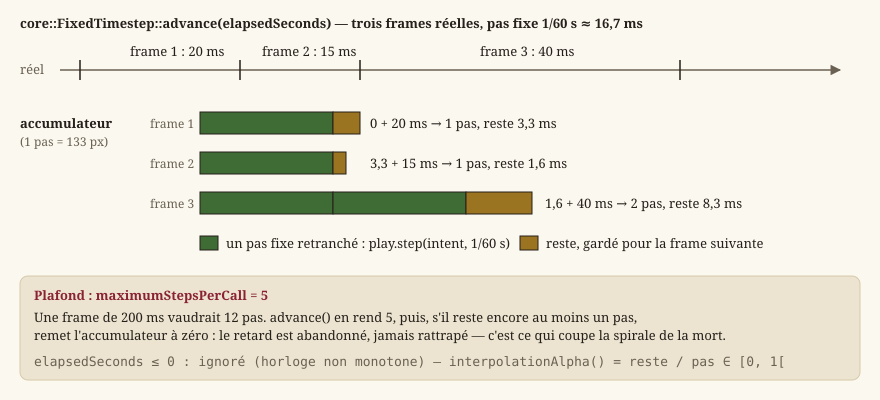

# Boucle de jeu et pas de temps fixe

Cette page part de zéro : elle explique ce qu'est une boucle de jeu pour qui n'en a jamais écrit,
puis détaille comment ce moteur la construit. Le périmètre de code est `Source/Core/Time` — un
seul en-tête, `FixedTimestep.h` — et les deux endroits de `HMI` qui s'en servent ou en tiennent
lieu.

## Qu'est-ce qu'une boucle de jeu ?

Une application classique (un formulaire, un outil en ligne de commande) est **passive** : elle
attend un événement (clic, entrée clavier, requête réseau) puis réagit, et ne fait rien entre deux
événements. Un jeu vidéo, lui, doit donner l'illusion d'un monde **vivant** en continu : un
personnage continue de marcher tant que la touche reste enfoncée, sans nouvel événement. Il faut
donc une boucle qui tourne **en permanence**, tant que le jeu est ouvert, et qui à chaque tour :

1. **lit** les entrées disponibles (clavier, souris, fenêtre) ;
2. **fait avancer** l'état du jeu (« mettre à jour la logique ») ;
3. **dessine** l'état courant à l'écran (« rendre ») ;
4. **affiche** l'image dessinée (« présenter »).

Un tour de cette boucle correspond à une **frame** (image). Un jeu qui tourne à 60 *frames per
second* (FPS) exécute ces quatre étapes 60 fois par seconde, soit un tour toutes les ~16,7 ms. Dans
ce moteur, Qt possède la boucle d'événements ; la logique et le rendu s'y branchent de deux façons
([IHM Qt — deux applications, deux technologies](guide-ihm-qt.md)) :

- dans le **jeu**, `hmi::WorldModel` avance l'exploration sur un `QTimer` de précision
  (`hmi::WorldModel::STEP_MILLISECONDS`, 16 ms), et la surface de rendu (`hmi::WorldViewportItem`)
  redessine quand la scène a changé ;
- dans l'**essai immédiat** de l'éditeur, `hmi::EditorViewport` avance sur un `QTimer` de 16 ms ;
  chaque tir mesure le temps écoulé, avance la simulation par pas fixes, puis recompose et peint.

## Le piège du framerate variable

La difficulté est que la durée réelle d'une frame **varie** : selon la machine, la charge du
système, ou une fenêtre minimisée un instant, une frame peut durer 16 ms ou 200 ms. Une écriture
naïve de la mise à jour ressemblerait à :

```cpp
while (running) {
    float deltaTime = measureTimeSinceLastFrame();  // variable, imprévisible
    update(deltaTime);                               // avance la simulation de deltaTime
    render();
}
```

Ici, un personnage qui marche se déplacerait de `vitesse × deltaTime` à chaque frame. Sur une
machine rapide (deltaTime petit), la marche avancerait par petits pas fréquents ; sur une machine
lente (deltaTime grand), par grands pas rares. Le résultat numérique final **diffère** selon la
vitesse de la machine : mêmes entrées, trajectoires différentes. Deux conséquences concrètes :

- **le jeu n'est pas reproductible** : un test automatisé qui rejoue une séquence d'entrées peut
  obtenir un résultat différent d'une exécution à l'autre, ou d'une machine à l'autre ;
- **le ressenti change avec la machine** : le héros ne s'arrête pas au même endroit contre un
  mur, et un grand pas peut sauter par-dessus un obstacle fin quand `deltaTime` grandit.

C'est ce défaut que le **pas de temps fixe** élimine.

## Le principe du pas de temps fixe

Idée : au lieu de faire avancer la logique de la durée réelle (variable) de la frame, on la fait
avancer par **incréments constants**, par exemple toujours 1/60 s. Le nombre d'incréments à
exécuter à chaque frame dépend du temps réel écoulé, mais **chaque incrément individuel** voit
toujours exactement la même durée. La logique de jeu (l'exploration) ne connaît donc
**jamais** de `deltaTime` variable — seulement des pas identiques et répétés — ce qui garantit le
**déterminisme** : mêmes entrées → **exactement** la même trajectoire, quelle que soit la vitesse
de la machine (`EX-NFR-002`, `EX-ARCH-030`). C'est indispensable pour des tests reproductibles et
pour un ressenti de jeu stable.

Le rendu, lui, n'a pas besoin de cette contrainte : dessiner une fois de plus ou de moins par
seconde ne casse aucun invariant logique. Il reste donc cadencé sur le temps réel, une fois par
frame — c'est le **découplage** entre logique (fixe) et rendu (variable).

## L'accumulateur : `core::FixedTimestep`

Le mécanisme qui convertit un temps réel variable en un nombre entier de pas fixes s'appelle un
**accumulateur**. Principe :

1. à chaque frame, on **ajoute** le temps réel écoulé à un compteur (`_accumulator`) ;
2. tant que ce compteur contient **au moins** un pas fixe complet, on **retranche** un pas fixe du
   compteur et on compte un pas à exécuter ;
3. ce qui **reste** dans le compteur (moins d'un pas fixe) est conservé pour la frame suivante — il
   ne se perd jamais, sinon les erreurs d'arrondi s'accumuleraient et la simulation dériverait.



La classe ne **mesure pas** le temps elle-même : elle n'a aucune dépendance système, le temps réel
écoulé lui est passé en paramètre. C'est ce qui la rend testable en isolation — un test lui donne
des durées choisies et vérifie le nombre de pas rendus, sans horloge, sans attente.

### `core::FixedTimestep::FixedTimestep`

Le constructeur prend deux paramètres, tous deux avec une valeur par défaut :

| Paramètre | Défaut | Rôle |
|---|---|---|
| `fixedDeltaSeconds` | `1/60` s | Durée d'un pas de simulation. C'est la valeur que reçoit **toute** la logique. |
| `maximumStepsPerCall` | `5` | Plafond du nombre de pas rendus par appel à `advance()` — la protection contre la spirale de la mort, ci-dessous. |

L'accumulateur part à zéro : le premier appel à `advance()` ne rend un pas que si le temps écoulé
transmis atteint déjà un pas complet.

### `core::FixedTimestep::advance`

`advance(elapsedSeconds)` implémente exactement le mécanisme décrit plus haut et renvoie le nombre
de pas à exécuter :

```cpp
core::FixedTimestep clock;               // pas fixe par défaut : 1/60 s
const int steps = clock.advance(elapsedSeconds);
for (int i = 0; i < steps; ++i) {
    play.step(intent, clock.fixedDeltaSeconds());  // toujours 1/60 s, jamais elapsedSeconds
}
render();  // une seule fois, quel que soit le nombre de pas
```

Trois détails de son contrat méritent d'être connus, parce qu'ils ne se devinent pas :

- un temps écoulé **négatif ou nul est ignoré** : l'accumulateur n'avance pas, aucun pas n'est
  rendu. Une horloge non monotone (rare, mais observée sur certaines machines après une mise en
  veille) ne fait donc jamais **reculer** la simulation ;
- le nombre de pas rendus est **plafonné** par `maximumStepsPerCall` ;
- si le plafond est atteint **et** qu'il reste encore au moins un pas complet dans l'accumulateur,
  celui-ci est **remis à zéro** : le retard non rattrapé est abandonné, pas reporté. Sans cette
  remise à zéro, le plafond ne ferait qu'étaler la rafale sur plusieurs frames, et la spirale
  décrite plus bas resterait possible.

C'est, à peu de chose près, `hmi::EditorViewport::stepPlaytest` : l'essai immédiat fait avancer
un `hmi::WorldPlay` (la même exploration que le jeu) de `steps` pas, puis dessine. Le jeu, lui, se
passe d'accumulateur : son `QTimer` tire déjà à intervalle fixe, et chaque tir est un pas de
`STEP_MILLISECONDS` — un retard du minuteur décale le pas dans le temps réel, jamais sa durée
simulée.

### `core::FixedTimestep::fixedDeltaSeconds`

Renvoie la durée d'un pas, telle que passée au constructeur. C'est la **seule** durée que la
logique doit recevoir : la passer plutôt qu'écrire `1.0f / 60.0f` à chaque site d'appel garantit
qu'un cadenceur construit avec un autre pas (un test à 1/30 s, par exemple) reste cohérent partout.

### Exemple chiffré

Avec un pas fixe de 1/60 s (≈ 0,01667 s) :

| Frame | Temps réel écoulé | Accumulateur avant | Accumulateur après | Pas exécutés |
|-------|--------------------|---------------------|----------------------|--------------|
| 1     | 0,020 s            | 0,000 s              | 0,003 s               | 1            |
| 2     | 0,015 s            | 0,003 s              | 0,018 s → 0,001 s     | 1            |
| 3     | 0,040 s            | 0,001 s              | 0,041 s → 0,008 s     | 2            |

À la frame 3, le temps réel écoulé (0,040 s) dépasse deux pas fixes (2 × 1/60 ≈ 0,033 s) : la
boucle exécute **deux** mises à jour logiques avant de rendre une seule image. C'est normal et
voulu — le rendu peut « sauter » plusieurs pas de simulation sans jamais désynchroniser la logique.

### La « spirale de la mort »

Si une frame est anormalement longue (fenêtre déplacée, point d'arrêt du débogueur, machine
gelée un instant), le temps écoulé peut représenter des **dizaines** de pas fixes d'un coup.
Exécuter tous ces pas d'affilée prend du temps réel, ce qui retarde la frame suivante, qui devra à
son tour rattraper encore plus de pas — un cercle vicieux appelé la **spirale de la mort**
(*spiral of death*), qui peut figer le jeu indéfiniment. `FixedTimestep` s'en protège avec
`maximumStepsPerCall` : le nombre de pas renvoyé par `advance()` est **plafonné** (5 par défaut)
et le surplus est **abandonné** — la simulation « perd » du temps réel dans un cas extrême plutôt
que de bloquer. Un joueur qui revient d'une minimisation retrouve un héros immobile là où il
l'avait laissé, pas un héros qui rejoue une minute de marche en accéléré.

### `core::FixedTimestep::interpolationAlpha`

Après avoir consommé tous les pas fixes disponibles, il peut rester une fraction de pas dans
l'accumulateur (entre 0 et 1 pas). `interpolationAlpha()` l'expose comme un facteur dans `[0, 1[`
(`reste / pas`), qui permettrait au rendu d'**interpoler** entre la position du pas précédent et
celle du pas courant, pour lisser le mouvement quand le rendu tourne plus vite que la simulation.
Aucun rendu ne s'en sert aujourd'hui : l'image montre la dernière position simulée. La valeur
existe parce qu'elle ne coûte rien et qu'un jour où le rendu dépassera 60 Hz sur une marche visible,
c'est la première chose qu'on voudra.

### Les frames sans pas de simulation et les entrées

Quand le rendu dépasse 60 Hz, certaines frames réelles n'exécutent **aucun** pas fixe (`steps == 0`)
— l'accumulateur n'a pas encore atteint un pas complet. Ces frames dessinent quand même (le rendu
est découplé). Elles imposent en revanche une précaution sur les **entrées** : un appui capturé sur
une telle frame doit **survivre** jusqu'à ce qu'un pas de simulation le lise, au lieu d'être effacé
par la frame suivante. C'est pourquoi l'essai immédiat note la demande d'interaction (`E`/Espace)
dans un drapeau que **le premier pas consommé** remet à zéro, et non la frame de rendu — voir
[Entrées et actions logiques](guide-entrees.md). Sans cette précaution, à 144 Hz environ deux appuis sur trois seraient perdus.

## Conséquence pratique pour tout le code de simulation

**Toute** la logique de jeu (`core::ExplorationSession::update`, appelée par `hmi::WorldPlay::step`)
reçoit un pas constant et **jamais** le temps réel. C'est pour cela que les tests peuvent appeler
`update(..., 1.0f/60.0f)` en boucle, sans horloge ni minuteur : c'est **exactement** ce que fait le
jeu en exécution normale, pas une approximation. Un système qui lirait le temps réel directement
romprait cette garantie et deviendrait, par construction, non déterministe et difficile à tester.

> **Note** — Le même principe gouverne le hasard : `core::DeterministicRandom` ne lit jamais
> l'horloge, il reçoit une graine ([Mathématiques du moteur](guide-maths.md)). Temps et hasard
> sont les deux seules sources de non-reproductibilité d'une simulation ; le moteur les injecte
> toutes deux de l'extérieur.

Ce qui vit au **temps réel**, et non au pas fixe, est par construction hors de la simulation :
l'animation des figurines de l'arène (`hmi::ArenaAnimationDriver::advance`, cadencée par la frame
de rendu) fait vivre l'image sans rien décider du combat, qui reste au tour par tour dans `Core`.

## Voir aussi
- `core::FixedTimestep`.
- `hmi::WorldModel` (pas du jeu), `hmi::EditorViewport` (essai immédiat), `hmi::WorldPlay`.
- [IHM Qt — deux applications, deux technologies](guide-ihm-qt.md), [Écrans, navigation et boucle de jeu](guide-ecrans.md) (navigation).
- [ECS : entités, composants, systèmes](guide-ecs.md) — les entités que la logique manipule, et `core::World::update` qui reçoit ce pas.
- [Mathématiques du moteur](guide-maths.md) — le hasard déterministe, l'autre moitié de la reproductibilité.
- [`exigences-non-fonctionnelles.md`](../Specification/exigences-non-fonctionnelles.md) — le déterminisme exigé (`EX-NFR-002`).
