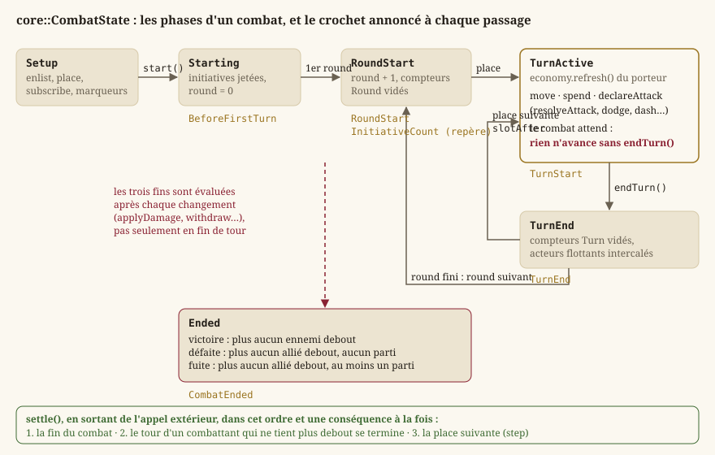
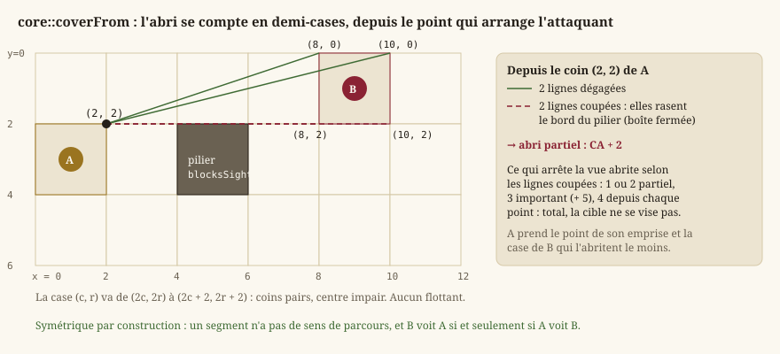
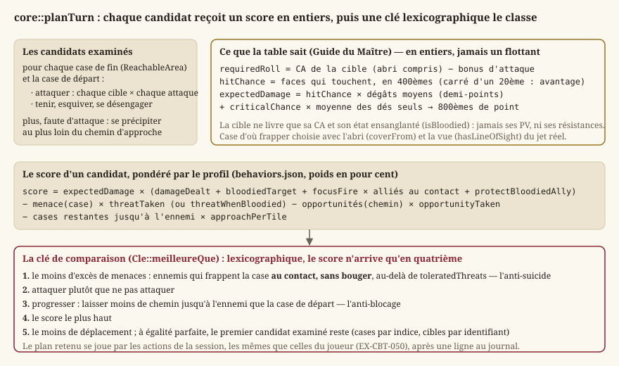
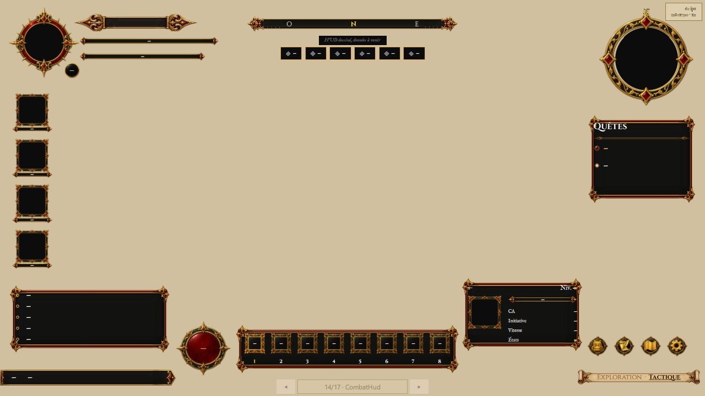

# Combat tactique

Le combat est la moitié « au tour par tour » du jeu : le temps s'arrête, chacun joue à son rang,
et l'espace se compte en cases. Tout ce qui le décide vit dans `Source/Core/Combat/` — dix-huit
en-têtes de `Core` pur, sans Qt ni GPU (`EX-NFR-010`), que cette page parcourt dans l'ordre d'un
combat : le montage d'une rencontre, la grille, l'initiative, le tour et son économie, le
déplacement, l'attaque et les dégâts, la géométrie (portée, ligne de vue, abri, zones, tenaille),
la prévisualisation, l'IA, puis l'arène du Colisée qui est aujourd'hui le seul lieu où ce combat
se joue. Ce que l'écran en montre est renvoyé à [Rendu 2D](guide-rendu.md) et
[Écrans](guide-ecrans.md) ; les règles du d20 lui-même, à [Règles d20](guide-regles.md).


## Définitions

### Un combat tactique au tour par tour

Dans un jeu de rôle « à la d20 », un combat n'est pas une simulation continue mais une suite de
**rounds** : pendant un round, chaque combattant joue **un tour**, dans un ordre fixé au début du
combat par un jet d'**initiative**. Un tour offre une **économie d'actions** — une action, une
action bonus, une réaction et un déplacement (`EX-CBT-011`) — et se termine quand celui qui joue
le décide (`EX-CBT-012`). Le combat prend fin quand l'un des deux **camps** n'a plus personne
debout, ou que le camp du joueur a rompu le contact.

L'espace est une **grille** de cases carrées de 1,5 m (`EX-REG-051`), dérivée de la couche de
collision de la carte d'exploration : le combat se joue **au même endroit**, seul le temps change
(`EX-CBT-001`). Une créature occupe une **emprise** carrée de une à quatre cases de côté selon sa
taille ; un déplacement se paie en cases, sur un chemin qui contourne les murs (`EX-CBT-020`) ;
une attaque suppose d'être à **portée** et, pour une attaque à distance, d'avoir une **ligne de
vue** (`EX-CBT-021`, `EX-CBT-022`). C'est le programme d'`EX-VIS-004`, et la [spécification du
combat](../Specification/combat.md) en détaille chaque terme.

### Ce que le dossier contient

| En-tête | Ce qu'il porte | Lot |
|---|---|---|
| `Encounter.h`, `CombatTransition.h` | la rencontre (qui, en quelle formation) et l'aller-retour exploration ↔ combat | `LOT-18` |
| `TacticalTerrain.h` | le verdict de l'éditeur : la rencontre tient-elle sur le terrain ? | `LOT-11`, `LOT-EDITOR-07` |
| `BattleGrid.h`, `Pathfinding.h` | la grille (obstacles, emprises, objets, zones) et le déplacement par budget | `LOT-19` |
| `TurnOrder.h`, `ActionEconomy.h`, `CombatCounters.h`, `CombatState.h` | l'initiative, les ressources du tour, les mémoires à portée, la machine à états | `LOT-20` |
| `Attack.h`, `Damage.h` | le jet d'attaque amendable et le pipeline de dégâts | `LOT-21` |
| `LineOfSight.h`, `AreaOfEffect.h` | ligne de vue, abri, zones d'effet | `LOT-22` |
| `EnemyAi.h`, `Flanking.h` | l'IA tactique et la prise en tenaille | `LOT-23` |
| `CombatPreview.h` | ce que l'écran montre avant que le joueur ne s'engage | `LOT-24` |
| `Arena.h`, `IsoProjection.h` | le Colisée : session rejouable, et la projection isométrique de sa grille | `LOT-50` |

Chaque en-tête cite la page du Manuel des Joueurs ou du Guide du Maître qui fonde ses règles, et
nomme ce qu'il **décide** au-delà du livre : cette page reprend ces décisions, sans recopier les
fiches de lots qui les ont tranchées.

## Le montage : de la rencontre à la grille

### La rencontre : qui, et en quelle formation (`Encounter.h`)

Une `core::Encounter` dit **qui** se dresse et **comment** (`combatants`, une liste de
`core::EncounterCombatant`), jamais **où** : chaque combattant porte un identifiant de créature du
bestiaire (`LOT-33`) et un décalage en cases par rapport au **déclencheur** (`columnOffset`,
`rowOffset`). Une rencontre écrite une fois se joue donc partout où un déclencheur la pose, en
gardant sa formation ; des coordonnées absolues auraient fait apparaître les mêmes gobelins au
même endroit de toute carte, ou hors de la carte. Le drapeau `escapable` — vrai par défaut — est
une décision de **contenu** : un combat de scénario dont on ne fuit pas s'écrit dans la donnée,
et l'inverse enfermerait le joueur dans toute rencontre qu'un auteur aurait oublié de renseigner.

- `core::loadEncounters(dossier)` lit un fichier JSON par rencontre (`Rpg/encounters/`), triés par
  nom, et rend un `core::EncounterCatalog` : les rencontres lues, et les erreurs nommées. Une
  rencontre **sans combattant** est refusée : elle se déclencherait et se terminerait aussitôt par
  une victoire, en posant son drapeau — l'ennemi disparaîtrait sans combat et rien ne le dirait.
- `core::EncounterCatalog::find(id)` rend la rencontre, ou `nullptr`.
- `core::placeCombatants(rencontre, déclencheur)` est **pure** : elle rend la liste des cases
  voulues (`core::CombatantPlacement`) sans consulter ni carte ni collision. C'est au montage de
  refuser celles qui tombent dans un mur, et il ne peut le faire que s'il les reçoit toutes.

### L'aller-retour exploration ↔ combat (`CombatTransition.h`)

`EX-CBT-001` veut un passage **explicite et réversible**, et le `LOT-18` l'a voulu **pur** : rien
de ce qui décide n'est dans un widget, ce qui rend l'aller-retour vérifiable sans fenêtre.

- `core::ExplorationSnapshot` est ce qu'on met de côté : la position du personnage, son
  **orientation** (`EX-EXP-004`) et la caméra. Il ne porte **pas** les points de vie — ils sont
  précisément ce que le combat a changé, et les restituer annulerait le combat — ni les ennemis
  vaincus, qui ne se restituent pas mais s'**acquièrent**. `captured` reste faux tant que rien n'a
  été relevé : restituer un instantané vide téléporterait le personnage à l'origine de la carte.
- `core::CombatOutcome` nomme les trois issues : `Victory`, `Flight`, `Defeat`.
- `core::EncounterRun` est la rencontre **engagée** : l'instantané, l'identifiant, les placements
  calculés, `escapable` recopié, et `defeatFlagKey` — la clé de drapeau de monde qu'une victoire
  posera, vide pour une zone de rencontre qui doit pouvoir se reproduire.
- `core::beginEncounter(rencontre, instantané, déclencheur, clé)` construit ce `EncounterRun` ;
  `core::endEncounter(run, issue, drapeaux)` rend l'instantané à restituer et, **seulement en cas
  de victoire**, pose le drapeau. Une fuite ou une défaite ne marquent rien : sinon fuir suffirait
  à nettoyer une carte, et le défaut ne se verrait pas — une carte qui se vide ressemble à une
  progression.
- `core::encounterAlreadyCleared(drapeaux, clé)` répond **non** pour une clé vide : l'inverse
  désactiverait toutes les zones de rencontre du jeu dès le premier combat gagné.
- `core::encounterTriggerFor(entité, carte)` lit une entité `encounter` de la carte comme un
  `core::EncounterTrigger`. Deux natures, distinguées par la **donnée** et non par le type : un
  ennemi **posé** reçoit une clé fabriquée par `core::keyForEntity` (jamais écrite à la main, sinon
  deux ennemis finiraient par la partager) ; une **zone** (`respawns: true`) n'en a pas. Un
  déclencheur qui ne nomme aucune rencontre n'en est pas un.

Côté exploration, `core::ExplorationSession` produit un `ExplorationEventKind::Encounter` quand le
héros interagit avec un tel déclencheur ([Monde et exploration](guide-monde.md)) ; c'est
l'appelant qui monte alors le combat. Le mode `hmi::CombatMode` du `LOT-18`, qui gelait les passes
de l'ancienne exploration, n'existe plus (`LOT-88`, `LOT-102`) : dans le jeu Qt Quick, le seul
combat ouvert est celui du Colisée, et brancher une rencontre de carte reste dû au `LOT-27`.

### Le terrain est-il jouable ? (`TacticalTerrain.h`)

Comme le combat se joue sur la carte d'exploration, une rencontre posée dans un couloir d'une case
ne se découvrirait qu'en jeu. `core::analyzeEncounterTerrain(collision, entités, catalogue,
bestiaire)` le dit à l'auteur au moment où il pose : pour chaque entité `encounter` dont la
rencontre est connue, un `core::EncounterTerrain` — les placements voulus, la zone atteignable
autour du déclencheur, le nombre de cases exigé, et les problèmes (`core::TacticalIssue`, des
codes `core::TacticalIssueCode` et jamais du texte, `EX-NFR-011`). Les combattants sont posés sur
une `core::BattleGrid` par `place`, **dans l'ordre de la formation**, exactement comme le fera le
montage : un avertissement de l'éditeur et un refus au montage ne peuvent pas diverger. Trois
constantes sont des décisions nommées, réglables : `TACTICAL_PARTY_SIZE` (4, le groupe pour
lequel le Guide calibre ses rencontres), `TACTICAL_AREA_RADIUS` (6 cases, ce qu'un combattant de
taille M parcourt en un tour) et `TACTICAL_CELLS_PER_COMBATANT` (4 : se tenir, et manœuvrer).
L'éditeur l'appelle dans son contrôle du contenu (`LOT-EDITOR-07`,
[Éditeur de niveaux](guide-editeur.md)).

### La grille (`BattleGrid.h`)

`core::BattleGrid` répond à une seule question, « peut-on se tenir ici ? », et à rien d'autre :
elle ne calcule aucun chemin, ne connaît aucun camp, n'a pas d'altitude.

- `core::CombatantId` est un type **fort**, pas un `int` : la grille ne sait rien de ce qu'est un
  combattant, elle retient sa place ; c'est `core::CombatState` qui attribue les identifiants, et
  un entier nu se serait confondu avec un indice de case à la première signature qui prend les
  deux.
- `core::footprintSide(taille)` traduit la table des tailles du Manuel : 1 case jusqu'à M, 2 × 2
  pour G, 3 × 3 pour TG, 4 × 4 pour Gig. Une très petite créature occupe une case entière là où le
  livre en tolère quatre : c'est le critère du `LOT-19` — deux créatures ne partagent jamais une
  case —, à rouvrir par une exception nommée si un contenu le réclame.
- `core::Locomotion` (`Walk`, `Fly`) : **l'altitude est un attribut, jamais une géométrie**. La
  grille n'a pas de hauteur ; un volant franchit les obstacles **au sol** (eau profonde, falaise)
  et ignore le terrain difficile, mais pas la matière pleine — la grille de collision ne distingue
  pas un muret d'un rempart —, et occupe sa case comme tout autre.
- `core::Cover` : les trois abris du Manuel et l'absence d'abri, ordonnés du moins au plus
  protecteur, parce que « seul celui qui protège le plus est pris en compte » et que comparer deux
  abris est ce que cette règle demande.
- `core::GridObject` : une toile, une barricade, posée sur une case. Elle a des points de vie
  (le corpus en donne), un `blocksMovement`, un abri déclaré (`cover`, jamais déduit de `kind`, que
  la grille n'interprète pas) et des `damageTraits` — une porte de fer ne craint pas le poison.
- `core::PlacementResult` : `Placed`, `OutOfBounds`, `Obstructed`, `Occupied`, `InvalidCombatant`.

Les constructeurs recopient la grille de collision de la carte — `core::Level::tileMap()`, ou une
grille dérivée comme une zone de combat découpée — parce qu'une copie ne peut pas changer sous un
tour en cours ; les obstacles n'ont **jamais** d'autre source (`EX-CBT-001`). Avec un `Level`, ils
relèvent aussi les **zones** : les cases non vides d'une couche à propriétés libres
(`EX-LVL-018`), et les entités `zone` (rectangle ou cases peintes, `core::zoneCells`). La grille
n'interprète qu'une propriété, `difficultTerrain` — vraie seulement pour le booléen `true`, un `1`
ou un `"oui"` étant une faute de saisie qu'il ne faut pas transformer en règle.

| Fonction | Rôle |
|---|---|
| `inBounds`, `width`, `height` | les bornes. |
| `isObstructed(case, locomotion)` | matière pleine, objet bloquant, et — au sol seulement — eau profonde et falaise. Hors carte : plein, pour qu'un appelant qui oublie la borne se heurte à un mur plutôt que de lire hors du tableau. |
| `isDifficult(case)`, `setDifficult` | le coût double d'entrée ; modifiable en combat (un séisme, un sort). |
| `blocksSight(case)` | ce qui arrête la **vue** : matière pleine ou objet à abri total. L'eau et la falaise arrêtent la marche, pas le regard ; hors carte, faux. |
| `objectCoverAt`, `objectAt`, `placeObject`, `damageObject` | les objets : posés sur une case ouverte et libre, détruits à 0 PV — la case redevient franchissable. |
| `zonesAt(case)` | les propriétés de toutes les zones qui couvrent la case, dans l'ordre des couches puis des entités ; les autres règles de zone sont lues par qui en a l'usage (`LOT-50`, `LOT-81`). |
| `place(id, ancre, côté, locomotion)` | pose une emprise. **Refuse plutôt que de corriger** : une case voulue qui tombe dans un mur est une information pour le montage, et la déplacer d'office cacherait une formation mal écrite. Un marcheur ne se pose pas sur l'eau profonde ; un volant, si. |
| `moveTo(id, ancre)` | déplace une emprise déjà posée, sans vérifier ni chemin ni budget (l'appelant l'a fait par `ReachableArea`) ; une créature de 2 × 2 qui avance d'une case recouvre la moitié de son ancienne emprise et ne se gêne pas elle-même. |
| `remove`, `occupantAt`, `positionOf`, `sideOf`, `combatants` | l'occupation, par identifiant croissant — les conteneurs sont ordonnés pour qu'un parcours donne le même ordre d'une partie à l'autre. |
| `canStand(ancre, côté, soi, locomotion)`, `isClear` | l'emprise tient-elle : bornes, obstacles, et — pour `canStand` — aucun autre combattant que soi. |

### Enrôler et poser : `core::CombatState::enlist` et `core::mountEncounter`

Un combattant entre dans le combat sous la forme d'un `core::CombatantProfile` — ni fiche ni bloc
de bestiaire, mais ce que le combat doit savoir : nom, camp, PV, Dextérité et modificateur
d'initiative, budget de déplacement, locomotion, taille, classe d'armure, affinités aux dégâts, et
`floating` pour un acteur hors de l'ordre. `core::profileFor(fiche)` et `core::profileFor(créature)`
le construisent : c'est ce qui garde la machine indifférente à « qui est le joueur ». Une créature
vole si sa vitesse de vol dépasse sa vitesse de marche ; une fiche est de taille M tant qu'elle
n'en porte pas. La **classe d'armure** y est recalculée depuis ses sources au moment de la
construction (`EX-CBT-030`) et jamais tenue à jour à la main : ce qui la change en combat — un
abri, une posture — s'ajoute au jet, pas à ce nombre.

`enlist(profil, ancre)` n'est permis qu'en phase `Setup` et attribue les identifiants **dans
l'ordre des enrôlements**, à partir de 1 : c'est l'ordre de la **donnée**, dernier critère de
départage de l'initiative. Un placement refusé n'enrôle personne et ne consomme aucun identifiant.
`core::mountEncounter(combat, run, bestiaire, groupe)` enchaîne : `setEscapable` recopié de la
rencontre, le groupe (`core::PartyMember`) puis les créatures, et rend un `core::EncounterMount` —
alliés, ennemis, et chaque `core::MountRefusal` avec sa raison (`placement` vide pour une créature
inconnue du bestiaire). Un combattant refusé n'est pas enrôlé : sans case, il ne combat pas.

## Le cycle d'un combat



### L'initiative (`TurnOrder.h`)

L'initiative est un test de Dextérité, jeté **une fois** à `start` (`EX-CBT-010`) : l'ordre ne bouge
plus, même si la Dextérité d'un combattant change ensuite — tout ce qui sert au départage est
**recopié** dans l'`core::InitiativeEntry` au moment du jet.

- `core::CombatSide` : `Allies`, `Enemies`. Deux camps et **aucun héros** : rien dans l'ordre ni
  dans la machine ne distingue « le » joueur, ce qui fera du groupe (`LOT-29`) un ajout et non une
  refonte.
- `core::actsBefore(a, b)` est la règle de départage, écrite parce que le jeu n'a pas de MD et
  qu'`EX-CBT-010` interdit de s'en remettre à l'ordre en mémoire : le total le plus haut, puis le
  modificateur d'initiative, puis la Dextérité, puis **les alliés avant les ennemis** (la part du MD
  « entre un monstre et un personnage », tranchée en faveur du joueur), puis l'identifiant le plus
  petit. La relance d'un d20, que le livre laisse au MD, est **écartée** : un tirage de plus
  consommerait la suite aléatoire, et l'ordre dépendrait du *nombre* d'égalités survenues.
- `core::InitiativeMarker` : un repère fixe qui n'est pas un combattant — actions de repaire au
  rang 20, renforts au rang 0. Il **perd toujours** l'égalité contre un combattant ; deux repères
  de même rang se rangent par nom.
- `core::TurnSlot` : une **place** du round, combattant ou repère, qui porte tout ce qui la range.
  Une place reste comparable après que son combattant a quitté l'ordre — ce qui permet de calculer
  la suivante quand le combattant actif vient de fuir. `slotBefore` compare deux places.
- `core::TurnOrder` : `add`, `remove`, `addMarker` (refusé pour un doublon rang + nom), `contains`,
  `find`, `entries`, `markers`, et les deux qui font tourner le round : `firstSlot` et
  `slotAfter(place)`. Le curseur est une place, pas un indice : un renfort allonge l'ordre, un
  fuyard le raccourcit, et un indice sauterait un tour ou en rejouerait un. Un renfort rangé après
  la place courante joue ce round-ci, rangé avant, au round suivant — ce que dit le livre, sans cas
  particulier.

### La machine à états (`CombatState.h`)

`core::CombatState` tient un seul état nommé (`core::CombatPhase`) plutôt que des drapeaux épars
dont une combinaison sur deux n'aurait pas de sens : `Setup` (on enrôle), `Starting` (initiatives
jetées, premier round pas commencé — la fenêtre d'avant le premier tour), `RoundStart`,
`TurnActive` (un combattant joue et le combat **attend**), `TurnEnd`, `Ended`. Elle n'est ni
copiable ni déplaçable : les `core::Mover` qu'elle construit et les abonnés la désignent par son
adresse.

**Les crochets.** `core::CombatHook` nomme onze points d'insertion — `BeforeFirstTurn`,
`RoundStart`, `InitiativeCount`, `TurnStart`, `TurnEnd`, `AttackDeclared`, `DamageTaken`,
`CombatantDowned`, `CombatantJoined`, `CombatantLeft`, `CombatEnded`. Aucun n'avait de
consommateur au `LOT-20` et tous en auront un : les livres de Tanares placent une capacité à
chacun de ces instants, et les poser après coup aurait coûté une refonte. Un abonné
(`core::CombatListener`) reçoit un `core::CombatEvent` — round, combattant, cible, nom du repère,
et pour les dégâts les PV avant et après, le maximum, l'excédent et le drapeau critique — et
l'état **mutable** : il peut infliger des dégâts, faire entrer un renfort, octroyer une ressource.
Il ne peut pas **terminer un tour** : la fin d'un tour est la décision de celui qui joue
(`EX-CBT-012`). `core::crossedBelow(événement, n, d)` dit qu'un seuil a été **franchi** (« sous
50 % » s'écrit `(e, 1, 2)`), pas seulement qu'on est dessous : une créature déjà sous la moitié qui
reprend un coup ne redéclenche pas sa *Battle Fury*.

**Les conséquences en cascade.** Un abonné peut changer l'état pendant qu'on l'avertit. Ces
conséquences ne sont **jamais** tirées au milieu d'une annonce : la classe interne `Operation`
tient la profondeur d'appel, et `settle` règle tout en sortant de l'appel **extérieur**, une
conséquence à la fois et dans un ordre fixe — la fin du combat, puis le tour d'un combattant qui ne
tient plus debout, puis la place suivante. Sans cette discipline, un renfort appelé au repère
« renforts » aurait ouvert son tour pendant l'annonce du repère, et deux abonnés du même crochet
auraient vu deux états différents. `start` et `endTurn` sont refusés depuis un abonné.

**Les trois fins**, évaluées après **chaque** changement et non en fin de tour — un combat gagné par
une attaque d'opportunité pendant le tour d'un ennemi est gagné tout de suite : **victoire** si
plus aucun ennemi n'est debout (à terre, ou parti — un ennemi en fuite n'est plus « engagé »,
`EX-CBT-001`) ; **défaite** si plus aucun allié n'est debout et qu'aucun n'est parti ; **fuite** si
plus aucun allié n'est debout et qu'au moins un est parti — ceux qui restent à terre derrière lui
sont l'affaire de l'agonie (`LOT-72`). Si un même changement abat les deux camps, la défaite
l'emporte.

Les fonctions, dans l'ordre d'un combat :

| Fonction | Rôle et invariants |
|---|---|
| `enlist`, `addInitiativeMarker`, `setEscapable`, `subscribe` | le montage (ci-dessus). Deux abonnés d'un même crochet sont avertis dans l'ordre de l'abonnement ; un abonné qui s'abonne pendant une annonce ne l'est que pour la suivante. |
| `start(random)` | jette l'initiative de chacun par identifiant croissant (à graine égale, les mêmes dés tombent sur les mêmes combattants), sauf des acteurs flottants ; annonce `BeforeFirstTurn`, puis ouvre le premier round. Faux hors `Setup`. |
| `phase`, `round`, `activeCombatant`, `turnOrder`, `outcome`, `escapable`, `find`, `combatants`, `grid` | la lecture ; `round` vaut 0 avant le premier ; `grid()` mutable existe pour ce qui change la grille en combat (terrain difficile créé, objet détruit). |
| `counters()` | les `core::ScopedCounters` du combat : la portée `Turn` est vidée à chaque fin de tour, `Round` à chaque début de round, `Turn`, `Round` et `Encounter` à la fin ; `Day` jamais. |
| `economy(id)` | l'économie d'un combattant, pour dépenser une réaction **hors** de son tour ou octroyer une ressource. |
| `spend(ressource, n)` | dépense sur le combattant actif ; faux sans tour ou sans reste. |
| `reachableArea()` | la `core::ReachableArea` du combattant actif sur **ce qui reste** de son déplacement ; vide sans tour ou s'il n'est pas placé. |
| `move(destination)` | suit `pathTo`, paie le coût, déplace l'emprise ; `core::MoveOutcome` dit `Moved`, `NoActiveTurn`, `NotPlaced` ou `Unreachable`. Le déplacement se **fractionne** : trois cases, une attaque, trois cases. |
| `endTurn()` | termine **explicitement** le tour ; annonce `TurnEnd`, vide `Turn`, puis la machine cherche la place suivante. |
| `interject(id)` | un acteur **flottant** (*Law of Time*, `CombatantProfile::floating`) demande à jouer avant le prochain tour, une fois par round ; s'il ne choisit pas, il joue en fin de round — un acteur indécis ne perd pas son tour. |
| `declareAttack(attaquant, cible)` | annonce `AttackDeclared` avant tout jet : la fenêtre où une posture répond à l'intention. Refusé si l'un des deux n'est pas debout — une cible à terre n'est pas attaquable. |
| `join(profil, ancre, random)`, `joinAtInitiative(profil, ancre, rang)` | un renfort, en cours de combat, au jet ou à une initiative imposée (« au rang 0 ») ; annonce `CombatantJoined`. |
| `withdraw(id)` | la sortie : quitte la grille et l'ordre, sans retour ; `NotEscapable` pour un allié d'une rencontre dont on ne fuit pas. Un combattant qui sort pendant son tour voit son tour terminé, `TurnEnd` annoncé quand même — les actions légendaires ne distinguent pas un tour fini d'un tour interrompu. |
| `applyDamage(id, n)`, `applyDamage(span)` | la **dernière** étape du pipeline (`LOT-21`) : borne à 0, met à terre, annonce `DamageTaken` puis `CombatantDowned`. La version à salve n'évalue l'issue **qu'une fois** : une boule de feu qui abat le dernier allié et le dernier ennemi est une défaite, pas une victoire ou une défaite selon l'ordre des cibles. |
| `heal(id, n)` | rend des PV sans dépasser le maximum, relève un combattant à terre ; les réserves ne se soignent pas. |
| `grantReserve(id, réserve)`, `reserves(id)` | une réserve qui ne se cumule pas remplace celle de même source si elle est plus grande, et est ignorée sinon. |
| `moverFor(id)` | le `core::Mover` du combattant, droit de passage compris : on traverse un allié, et un ennemi seulement à **deux catégories de taille** d'écart (Manuel, « Se déplacer au milieu d'autres créatures »). |

Un combattant à terre (`core::CombatantStatus::Down`) garde sa place et ses tours sont **passés** ;
relevé, il rejoue à sa place. `Withdrawn` a quitté la grille et l'ordre. Les jets contre la mort,
l'inconscience et la mort instantanée (`EX-CBT-040`, `EX-CBT-041`) sont au `LOT-72`, qui lira
l'excédent et le critique que `CombatEvent` rapporte déjà.

### L'économie d'action (`ActionEconomy.h`)

`core::ActionEconomy` est une **liste** de `core::ActionResource` (`id`, `perTurn`, `remaining`),
pas trois booléens : le Manuel donne quatre ressources (`ACTION_RESOURCE`, `BONUS_ACTION_RESOURCE`,
`REACTION_RESOURCE`, `MOVEMENT_RESOURCE` en cases) et les livres de Tanares en ajoutent — la
*Heroic Action* des Marques Héroïques (`HEROIC_ACTION_RESOURCE`, `LOT-50`) est une **troisième
économie d'action**, et une capacité octroie une réaction à un allié. Une ressource de plus est un
appel à `declare`.

- `standard(mouvement)` : l'économie du Manuel, tout disponible.
- `declare(id, parTour)` : déclare, ou change ce qu'un tour restaure, et remplit. Une ressource
  déjà déclarée garde sa place : l'ordre est celui de la première déclaration, stable d'une partie
  à l'autre.
- `has`, `remaining` ; `spend(id, n)` : faux, et **rien n'est dépensé**, si la ressource est inconnue,
  s'il n'en reste pas assez ou si `n` n'est pas positif — on ne paie pas une case de terrain
  difficile à moitié.
- `grant(id, n)` : un octroi au-delà de `perTurn`, valable jusqu'à la dépense ou au prochain début de
  tour du porteur ; une ressource inconnue est déclarée avec un `perTurn` nul, le temps de
  l'octroi. C'est ainsi que *se précipiter* double le déplacement du tour.
- `refresh()` : le début du tour du porteur, et **rien d'autre** (`EX-CBT-011`). Restaurer la
  réaction en fin de tour ferait qu'une réaction dépensée pendant le tour d'un ennemi reviendrait
  avant qu'il ait fini, et une attaque d'opportunité se jouerait deux fois dans le même round.

### Les mémoires à portée (`CombatCounters.h`)

« Une fois par tour », « par rencontre », « immunisé 24 heures » : ce sont des compteurs que les
capacités des livres supposent. `core::ScopedCounters` (`increment`, `value`, `clear(portée)`)
range des compteurs nommés par `core::CounterScope` (`Turn`, `Round`, `Encounter`, `Day`) et par
**porteur** — une chaîne, pas un `CombatantId`, parce qu'un compteur « par jour » survit au combat
et que l'identifiant ne vit qu'une rencontre. `Turn` se compte pendant **n'importe quel** tour : une
attaque sournoise portée par une réaction pendant le tour d'un ennemi en consomme l'usage.
`core::ImmunityLedger` (`grant`, `isImmune`, `expire`) tient les immunités par **couple** (créature,
source) — la même créature reste sensible à un autre dragon — avec une **échéance** en secondes de
jeu (`IMMUNITY_DAY_SECONDS`), que l'horloge du `LOT-70` fournira ; le registre ne lit aucune horloge.

## Le déplacement (`Pathfinding.h`)

Le Manuel, « Jouer sur un quadrillage », fixe trois faits : entrer dans une case coûte **1, même en
diagonale** ; une case de terrain difficile coûte **2**, et il faut de quoi la payer ; on ne passe
pas en diagonale par le **coin** d'un mur. La case d'une créature qu'on traverse coûte aussi double,
en vol comme au sol — c'est la créature qui gêne, pas le sol. Un parcours en largeur à quatre
voisins et coût uniforme ne sait exprimer aucun des trois ; le calcul est donc un **Dijkstra sur
les huit voisins** (algorithme de plus court chemin à coûts positifs), et le coin d'un mur se juge
comme en vol : seule la matière qui remplit l'espace l'interdit, longer une mare en diagonale est
permis.

- `core::movementBudget(mètres)` divise par 1,5 (`EX-REG-051`) et **tronque** : le livre dépense la
  vitesse « par segments de 1,50 mètre », et un segment entamé n'en est pas un — arrondir au plus
  proche ferait gagner une case à qui porte trop. Une tolérance d'un millième empêche l'inverse
  (5,9999 après une soustraction de flottants). Les surcharges prennent une fiche
  (`speedMeters`) ou une créature et sa locomotion (0 pour qui ne vole pas).
- `core::Mover` : qui se déplace, comment, et à travers qui (`canPassThrough`). Le combattant doit
  être **placé** : départ et emprise sont lus de la grille, jamais recopiés, pour qu'une requête ne
  parte pas d'une case déjà quittée. Vide, `canPassThrough` ne laisse traverser personne — le parti
  prudent.
- `core::Path` : les cases franchies, départ exclu, arrivée incluse, et le coût.
- `core::ReachableArea(grille, mover, budget)` explore à la construction et ne relit plus la grille.
  `costTo(ancre)` est défini aussi pour une case qu'on **traverse** sans pouvoir s'y arrêter ;
  `canEndAt(ancre)` dit qu'on peut y **finir** (dans le budget, place libre, jamais le départ) ;
  `destinations()` les liste par indice croissant — ce que l'écran surligne (`EX-CBT-020`) ;
  `pathTo(ancre)` rend le chemin, ou rien. Une case difficile à une case du bout du budget reste
  hors de portée, pas « à moitié » atteinte.
- `core::findPath(grille, mover, destination)` : le même calcul en A* (Dijkstra guidé par une
  estimation, ici la distance de Tchebychev, cohérente puisque chaque pas coûte au moins 1), sans
  limite de budget, pour qui planifie au-delà du tour — l'IA qui marche vers une cible lointaine.

**Le départage est une règle, pas un hasard.** Deux chemins de même coût existent presque toujours,
et il fallait une règle qui tienne les deux algorithmes d'accord : parmi les prédécesseurs qui
atteignent une case à son meilleur coût — l'exploration les retient **tous**, un bit par voisin —,
la remontée retient **le plus proche de la droite qui joint le départ à l'arrivée**, et à égalité
celui d'indice de case le plus petit. La règle se définit sur le graphe, pas sur l'ordre
d'exploration ; le chemin ne monte donc pas pour redescendre, et c'est lui que la prévisualisation
dessine. Pour que l'A* voie tous ces prédécesseurs, il ne s'arrête pas à la première sortie de la
destination : un test sur deux cents cartes à graine fixe échoue si l'on rétablit l'arrêt précoce.

## L'attaque (`Attack.h`)

Le Manuel, chapitre 9, « Effectuer une attaque » : choisir une cible à distance d'attaque,
déterminer les modificateurs, résoudre — le d20 puis les dés de dégâts. Un 20 naturel touche
« peu importe les modificateurs ou la CA » et fait un critique ; un 1 rate ; le critique double
**les dés**, pas les modificateurs (`EX-CBT-031`).

### Les profils

- `core::AttackProfile` : ce qu'un combattant sait frapper — `label` tel que le journal l'écrit,
  `kind` (`core::AttackKind::Melee` ou `Ranged`), des `modifiers` qui portent **leur origine**
  (« Force +3 », « maîtrise +2 », `EX-REG-003`), des clauses de dégâts typées, l'allonge `reach` en
  cases, les portées `range` (`core::AttackRange`, normale et maximale, en cases arrondies vers le
  bas — une portée ne dépasse jamais ce que le texte promet) et le seuil critique.
- `core::attacksFor(créature)` tire les attaques d'un bloc de bestiaire : chaque action à bonus
  d'attaque et dégâts. Une action **avec** allonge est au contact (en cases, arrondie, au moins 1 :
  une nuée à 0 m frappe au contact, deux créatures ne partageant jamais une case) ; **sans**
  allonge, à distance, à la portée que le bloc structure depuis le `LOT-22` ; les deux, deux
  attaques. Une action dont les dégâts ne sont pas typés est **refusée et nommée**
  (`core::CreatureAttacks::refused`) : jamais un type par défaut (`EX-CBT-032`).
- `core::weaponAttackFor(fiche, arme, maîtrise, maîtrisée)` : Force au contact, Dextérité à
  distance, la meilleure des deux en finesse (`core::weaponAttackAbility`, écrit une seule fois), le
  bonus de maîtrise si l'arme est maîtrisée, le même modificateur aux dégâts ; à mains nues, 1 +
  Force en contondant. La propriété `reach` porte l'allonge à 2 cases.
- `core::thrownAttackFor(fiche, arme, …)` : une arme `thrown` lancée, même caractéristique qu'au
  contact, attaque à distance à la portée de l'arme ; vide pour une arme sans cette propriété.

### Cibler

- `core::gridDistance(combat, a, b)` et `gridDistanceFrom(combat, a, ancreA, b)` : la distance en
  cases **emprises comprises** — 1 pour deux emprises adjacentes, diagonale comprise. Un ogre de
  2 × 2 touche à 1 tout ce qui borde son emprise, pas seulement son ancre.
- `core::inReach(combat, attaquant, cible, profil)` : l'allonge au contact ; la portée maximale à
  distance, ou le contact seul si la portée est inconnue.
- `core::checkTarget(…)` rend un `core::TargetCheck` : `NotOnGrid`, `OutOfReach`, `TotalCover` (aucun
  segment dégagé, `core::hasLineOfSight`), `Valid`. Au corps à corps aussi : frapper par le coin
  commun de deux murs est aussi impossible que de s'y faufiler.
- `core::attackCircumstances(…)` : ce que la **grille** sait dire des sources d'avantage et de
  désavantage (`core::AttackCircumstances`, des chaînes nommées) — le tir au contact d'un ennemi
  debout **qui vous voit**, et la longue portée. L'abri n'est pas une circonstance mais un changement
  de CA.

### Un jet qui est un objet

Les livres de Tanares lisent le d20 brut, le relancent avant la résolution, ajoutent un modificateur
après avoir vu le total, substituent un résultat stocké. Rien de cela ne s'écrit si le jet est un
entier rendu par une fonction. `core::AttackRoll` est donc un objet — attaquant, cible, CA visée
(abri compris, `cover`), seuil critique, sources d'avantage et de désavantage, le `core::CheckResult`
du jet, la liste des `amendments` que le journal écrit, puis `hit` et `critical` une fois figés — que
trois instants (`core::AttackRollStage`) reçoivent, par `core::AttackHooks::insert` : `BeforeRoll`
(ajouter une source, un bonus, changer la CA), `DiceRolled` (lire les dés bruts, `reroll`,
`substitute`), `BeforeOutcome` (`addModifier` après avoir vu le total). `applyCover(niveau)` pose
l'abri **une fois** : un abri égal ou moindre ne change rien, un meilleur remplace le bonus au lieu
de s'y ajouter (+2 puis +5, jamais +7), `Total` est sans effet parce qu'il n'est pas un bonus mais
une cible qu'on ne vise pas. `recompute` recalcule dé retenu et total.

`core::rollAttack(demande, crochets, random)` déroule les trois étapes : la posture se déduit des
**nombres** de sources (`core::rollStance`, `EX-REG-002`), un ou deux d20 tombent, chaque étape
recalcule, et l'issue n'est figée qu'après la dernière — un 1 naturel rate, un dé retenu au moins
égal au seuil critique touche et est critique, sinon le total se compare à la CA. Le même point
d'insertion rend les tests écrivables : un « 20 naturel » y est un greffon qui substitue le dé, pas
une graine cherchée à la main.

### Résoudre dans le combat

`core::resolveAttack(combat, attaquant, cible, profil, random, contexte)` : déclare
(`CombatHook::AttackDeclared`), assemble les circonstances de la grille et celles du
`core::AttackContext` (l'appelant sait ce que la grille ignore : une esquive, une tenaille), pose
l'abri de `core::coverBetween` **avant le premier greffon** `BeforeRoll`, jette, et si l'attaque
touche, lance les dégâts (`core::rollDamage`) et les fait traverser le pipeline du contexte jusqu'à
`applyDamage`. Elle ne dépense **aucune** ressource — l'action *attaquer* dépense l'action, une
attaque d'opportunité la réaction, et seul l'appelant sait laquelle il joue — et ne vérifie ni la
portée ni la vue, pour la même raison. Vide si l'attaque ne peut pas être déclarée.

`core::AttackOutcome` en est le compte rendu, et `describe()` son entrée de journal (`EX-REG-003`) :
« attaque A -> B (Épée longue) : d20 (avantage : 14, 7 ; prise en tenaille) [abri partiel : CA 15
-> 17] = 14 + 3 (Force) + 2 (maitrise) = 19 contre CA 17 : touche ; degats 1d8+3 = 9 tranchant ;
resistance (tranchant) 9 -> 4 ; PV 20 -> 16 ». « 7 + 3 = 10 contre CA 15 : raté » est une
information ; « tu as raté » n'en est pas une.

## Les dégâts (`Damage.h`)

Retirer des points de vie est la **dernière** chose que font des dégâts. Avant, ils ont une
source, un type qu'une capacité peut convertir, une cible qui y résiste, et des réserves qui les
absorbent ; un entier qui descend ne laisserait aucune place où greffer les capacités des livres.
Le pipeline a donc cinq étapes **nommées** (`core::DamageStage`), dans un ordre fixe, chacune point
d'insertion :

| Étape | Ce que le moteur y fait | Ce qui s'y greffe |
|---|---|---|
| `Source` | rien | poser un drapeau (arme bénie devenue magique) |
| `Conversion` | rien | changer le type |
| `Resistances` | immunité, puis résistance (moitié, arrondie à l'inférieur), puis vulnérabilité (double) | une réduction fixe, **avant** — « la résistance puis la vulnérabilité s'appliquent après tous les autres modificateurs » |
| `Reserves` | points de vie temporaires et réserves, la plus récente d'abord | un transfert (*Life Link*) |
| `HitPoints` | la perte, bornée à 0, en une salve | rien : c'est la fin |

- `core::DamageFlag` (`Magical`, `Silvered`, `Adamantine`, `Spell`, `IgnoresResistance`,
  `IgnoresReserves`) dit ce qu'une source **est** au-delà de son type — un loup-garou résiste aux
  dégâts tranchants **non argentés** — ou ce qu'elle passe outre.
- `core::DamageAffinity` (`type`, `kind` parmi `core::DamageAffinityKind`, `bypassedBy`) et
  `core::DamageTraits::applies` : « résistance aux dégâts contondants non magiques » s'écrit
  `{Bludgeoning, Resistance, Magical}`. `core::damageTraitsFor(créature)` traduit les listes nues du
  SRD en affinités sans contournement : la condition reste dans le texte tant que la donnée ne
  l'écrit pas (`EX-CNT-031`).
- `core::DamageClause` (dés, type, drapeaux) est ce qu'une attaque porte **avant** les dés ; une
  morsure venimeuse en a deux. `core::rollDamage(clauses, critique, random)` lance chaque clause en
  `core::RolledDamage` : au critique, **deux fois plus de dés, le même modificateur**
  (`EX-CBT-031`) ; le total n'est jamais négatif.
- `core::HitPointReserve` : les PV sont une **pile** de réserves avant l'entier — points de vie
  temporaires (`TEMPORARY_HIT_POINTS`, non cumulables : le moteur garde la plus grande), armure
  ablative, PV mis en commun. Les soins ne les rendent pas ; elles absorbent encore à 0 PV sans
  relever personne.
- `core::DamageWork` est ce qu'un greffon (`core::DamageListener`) reçoit, **modifiable** : les
  portions en cours (`core::DamagePortion`), l'absorbé, la perte, et la `trace` de
  `core::DamageStep` que `adjust` alimente pour que le journal dise « résistance : 10 → 5 » et non un
  5 sorti de nulle part.
- `core::DamagePipeline::apply(combat, salve)` fait traverser une salve de `core::DamageRequest` et
  la termine en **un** `applyDamage(span)` : l'issue ne dépend pas de l'ordre des cibles. Chaque
  `core::DamageReport` porte les PV avant et après et l'**excédent** au-delà de 0 — l'exemple du
  Manuel, le clerc à 6 PV sur 12 qui en subit 18, tombe avec un excédent de 12 : la mort instantanée
  que le `LOT-72` en tirera. `applyToStructure(grille, case, dégâts)` fait de même pour un
  `core::GridObject`, sans réserves, et le détruit par `damageObject`.
- `core::damageTypeLabel` et `core::damageStageName` : les noms du journal, dans la langue du
  Manuel, sans défaut silencieux.

## Portée, ligne de vue et abri (`LineOfSight.h`)

Le Manuel dit qu'un mur, un arbre, une créature abritent ; que l'abri partiel donne +2 à la CA,
l'important +5, le total interdit de viser ; que les abris ne s'additionnent pas. Il ne dit pas
**comment** mesurer ces fractions de corps sur un quadrillage. Le `LOT-22` prend la méthode du
Guide du Maître : depuis un coin de l'emprise de l'attaquant, tracer des lignes vers les quatre
coins d'une case de la cible, et compter celles qu'un obstacle coupe.



**La symétrie, par construction.** Le défaut classique est un tracé qui **avance** case par case
depuis A et s'arrête au premier obstacle : parti de B, il ne passe pas par les mêmes cases, et le
joueur le découvre en tirant sur un ennemi qui ne peut pas riposter. Ici rien n'avance : la
question est « ce **segment** coupe-t-il cette case ? », en arithmétique **entière exacte** sur des
points en demi-cases — chaque axe donne l'intervalle des paramètres où le segment est dans la boîte,
et l'intersection se compare en fractions. Un segment n'a pas de sens de parcours ; A voit B si et
seulement si B voit A, et un test le vérifie sur vingt grilles générées (plus de 25 000 segments).

- `core::GridPoint` : un point en **demi-cases**, la case (c, r) allant de (2c, 2r) à (2c + 2,
  2r + 2) — coins pairs (`core::cornerOf`), centre impair (`core::centerOf`). Tout point qu'une règle
  nomme s'écrit en entiers, et aucun calcul de vue n'a besoin d'un flottant.
- `core::Footprint` : une emprise, ancre et côté. `core::coverBonus` (0, +2, +5, 0 pour le total qui
  n'est pas un bonus) et `core::coverLabel` (« abri partiel »…).
- `core::isSightClear(grille, a, b)` : rien n'arrête la vue sur le segment, extrémités exceptées
  (un tir part d'un coin de sa propre case, qui touche souvent un mur sans que le mur soit sur le
  chemin). Ce qui arrête la vue (`blocksSight`) coupe un segment qui **touche** sa boîte, bord et
  coin compris : raser la face d'un mur ne permet pas de voir au travers, et le coin commun de deux
  murs en diagonale arrête le regard comme il arrête le pas — une règle d'extrémité, elle-même
  symétrique, rattrape le segment qui **part** de ce coin.
- `core::hasLineOfSight(grille, a, b)` : un segment dégagé relie un point de grille de l'une à un
  point de l'autre — **tous** les points de l'emprise, pas seulement ses quatre coins, ce qui garde
  la relation symétrique pour une grande créature dont une case intérieure regarde par une
  meurtrière. La surcharge sur `CombatState` prend deux combattants.
- `core::coverFrom(grille, attaquant, cible, corps)` compte **trois familles** séparément, puis les
  compare, parce que les abris ne s'additionnent pas : ce qui arrête la vue abrite **selon les lignes
  coupées** (1 ou 2 partiel, 3 important, 4 total) ; un objet à abri important (la herse) donne
  `ThreeQuarters` dès qu'il coupe une ligne ; une créature interposée, amie ou ennemie, ou un objet
  à abri partiel donnent `Half` de même — compter leurs lignes n'aurait pas de sens, une herse d'une
  case n'en coupe jamais plus de deux. Un mur qui coupe deux lignes et un allié qui coupe les deux
  autres font un abri partiel, pas un abri total. L'attaquant prend le point et la case qui
  l'arrangent ; `Cover::Total` équivaut exactement à `!hasLineOfSight`.
- `core::coverFromPoint(grille, origine, cible, corps)` : le même compte depuis un **point** —
  l'origine d'une zone —, l'abri qui s'ajoutera à une sauvegarde de Dextérité contre une boule de
  feu, avec les sorts.
- `core::coverBetween(combat, attaquant, cible)` : entre deux combattants, tous les autres placés
  faisant corps — un combattant à terre reste sur la grille et abrite encore. `Total` si l'un des
  deux n'est pas sur la grille.

L'eau profonde et la falaise n'arrêtent pas la vue ; un volant se voit et se vise sur la même
grille. « Voir », c'est ici la ligne de vue : la lumière, les sens et les ténèbres n'ont pas encore
de modèle.

## Les zones d'effet (`AreaOfEffect.h`)

Chapitre 10, « Zones d'effet » : chaque zone a un **point d'origine**, l'effet s'étend en lignes
droites depuis ce point, et seul un abri total bloque ces lignes. Puis cinq formes
(`core::AreaShape`) : le **cône**, dont la largeur en un point égale la distance à l'origine ; le
**cube**, origine sur une face ; le **cylindre**, origine au centre de sa base ; la **ligne**,
longueur et largeur ; la **sphère**, un rayon. Le Manuel ne dit pas quelles cases une forme
couvre : une case est dans la zone si la forme en couvre **au moins la moitié** — la règle du Guide
du Maître pour les zones circulaires, étendue aux autres formes plutôt que d'en inventer une par
forme. La surface se calcule exactement : cône, cube et ligne sont des polygones découpés par la
case (Sutherland-Hodgman), un disque s'intègre analytiquement ; une case couverte à 50 % pile est
dedans.


- `core::AreaOfEffect` : la forme, `origin` en demi-cases (un coin de case pour une boule de feu
  lancée sur une intersection, le milieu d'une arête pour un souffle, un centre pour une aura),
  `toward` — le point vers lequel s'étendent cône, cube et ligne ; confondu avec l'origine, la zone
  est vide —, `size` (rayon, longueur ou arête) et `width` (ligne). « L'origine n'est pas incluse »
  dans un cône tombe de la géométrie : parti du bord d'une créature, il ne couvre rien de sa case.
- `core::areaTilesFromMeters(mètres)` : 6 m font 4 cases, arrondi **vers le bas** ; vide pour une
  taille nulle.
- `core::areaTemplate(zone, colonnes, lignes)` : le gabarit seul, sans obstacle, par ligne puis
  colonne.
- `core::affectedCells(grille, zone)` : le gabarit moins les cases qu'aucun segment dégagé
  (`isSightClear`) ne relie de l'origine à l'un de leurs quatre coins — le même compte que l'abri
  total — et moins les cases qui arrêtent elles-mêmes la vue : l'effet s'y heurte.
- `core::combatantsInArea(combat, zone)` : les combattants dont une case au moins est atteinte, par
  identifiant croissant.

Sans hauteur (`core::Locomotion`), un cylindre est son disque ; les deux formes restent parce que le
Manuel les distingue et qu'un sort les nomme. Les sorts qui emploient ces zones, et le déplacement
de l'origine derrière un obstacle, arrivent avec les classes (`LOT-25`, `LOT-35`).

## La prise en tenaille (`Flanking.h`)

Règle **optionnelle** du Guide du Maître (chapitre 8) : deux créatures adjacentes à un ennemi, sur
des côtés ou des angles opposés de son emplacement, le prennent en tenaille et gagnent l'avantage
au corps à corps ; en cas de doute, « tracez une ligne entre les centres ». Le moteur tranche
**toujours** par la ligne des centres : c'est la seule des deux formulations qui se calcule sans
interprétation. Les centres sont des points impairs, les bords des points pairs ; la ligne « passe
par deux côtés opposés » si elle touche le bord gauche **et** le bord droit, ou le haut **et** le
bas, coins compris — ce qui couvre les angles opposés. Tout reste entier.

- `core::crossesOppositeSides(a, b, cible)` : la géométrie seule.
- `core::isFlankedFrom(combat, attaquant, ancreSupposée, cible)` : chacun des deux debout, adjacent
  (distance 1, emprises comprises) et voyant la cible ; une case de l'emprise de l'un et une de
  l'autre alignées par leurs centres sur deux côtés opposés — une grande créature prend en tenaille
  « tant que l'une de ses cases remplit les conditions ». L'ancre supposée sert l'IA, qui juge une
  case avant d'y aller.
- `core::isFlanked(combat, attaquant, cible)` : la même règle, l'attaquant à sa place.

C'est la **donnée de l'arène** qui active la règle (`core::Arena::flanking`, faux par défaut — une
règle optionnelle s'active, elle ne se présume pas) ; activée pour l'Arène du Futur, le banc d'essai
du combat.

## La prévisualisation (`CombatPreview.h`)

Une prévisualisation qui calcule à part finit par diverger du jet : l'écran promet 55 %, et le
journal écrit une CA que l'écran n'a jamais montrée. Tout passe donc par **les fonctions du jet
réel** — `checkTarget`, `attackCircumstances` et `core::ArenaSession::circumstancesAgainst`,
`coverBetween`, `rollStance` — et par le jet requis du Guide (`core::hitChance`), comme pour l'IA ;
un test compare la prévisualisation au jet que la session jette ensuite. Ce qu'elle ne peut pas
savoir : ce qu'un greffon `BeforeRoll` changera, et les dés — les seconds sont le jeu.

- `core::AttackPreview` : le `TargetCheck`, l'attaque, la CA abri compris, l'abri, le jet requis, la
  posture et ses sources, la chance en quatre-centièmes (`hitPercent` l'arrondit en pour cent) et
  l'espérance de dégâts. `core::previewAttack(session, cible, indice)` la calcule pour le combattant
  actif ; `core::firstValidAttack(session, cible)` rend la première attaque qui peut viser — celle
  que le geste « attaquer » choisit quand le joueur n'en a pas désigné.
- `core::MovePreview` et `core::previewMove(session, destination)` : le chemin de `pathTo` (celui que
  `move` suivra), le déplacement restant, et **qui frapperait en chemin**
  (`core::ArenaSession::previewOpportunities`), choix du joueur et politique de l'IA compris.

C'est ce que `hmi::ArenaModel` expose en lignes lisibles (`preview`, `pathCells`), et ce qui fait
d'`EX-IHM-003` et de la moitié « montrées avant que le joueur ne s'engage » d'`EX-CBT-020` une
donnée du `Core` (`LOT-24`).

## L'IA tactique (`EnemyAi.h`)

Le Guide du Maître, chapitre 8 (PDF p. 247-255, la source désignée pour le `LOT-23`), ne donne
**aucune tactique** aux monstres : il dit au MD ce qu'il sait et comment il compte. L'IA est le MD
qui joue les monstres, et elle prend exactement cela — dans les mêmes actions que le joueur, avec
les mêmes informations (`EX-CBT-050`) : pas d'action réservée, pas de connaissance de ce que la
ligne de vue lui refuse. Ce que le Guide ne dit pas — les **poids** — est une donnée
(`Source/Elements/Rpg/rules/behaviors.json`, `EX-VIS-007`), pas une constante.



### Ce que la table sait

- `core::isBloodied(profil)` : moins de la moitié des PV. L'IA lit **l'état ensanglanté** de ses
  adversaires, jamais leurs PV : deux cibles à 20/20 et 11/20 ont le même score au point près.
- `core::requiredRoll(CA, bonus)` : « Gérer les foules » — le résultat minimal au d20 est la CA
  moins le bonus d'attaque (`core::attackBonusOf`, la somme des modificateurs).
- `core::hitChance(requis, posture, seuilCritique)` en **quatre-centièmes** (`CHANCE_SCALE`) : un 1
  rate, un 20 touche ; avec l'avantage on rate si les deux dés ratent, avec le désavantage on touche
  si les deux touchent — le carré d'un vingtième. `core::criticalChance` de même.
- `core::expectedDamage(profil, CA, posture)` en **huit-centièmes** de point : chance × dégâts
  moyens (en demi-points) + chance de critique × moyenne des dés seuls — « ajoutez-les aux dégâts
  moyens ». Les résistances n'y entrent pas : la table ne les connaît pas avant de les avoir vues.

Aucun flottant : deux exécutions, deux compilateurs, deux modes de construction donnent le même
tour ; les cases se parcourent par indice croissant, les cibles par identifiant croissant, une
égalité garde le premier candidat.

### Les profils

`core::BehaviorProfile` : des poids en pour cent — `damageDealt`, `bloodiedTarget` (achever),
`focusFire` (par allié au contact de la cible : la meute), `protectBloodiedAlly` (dégager un allié
ensanglanté : le soutien), `threatTaken` et `threatWhenBloodied`, `opportunityTaken`,
`approachPerTile` — et des règles : `toleratedThreats` (au plus 2), `opportunityMaximumRoll` (le
jet requis au-delà duquel on laisse passer un fuyard : le prudent ne frappe pas ce qu'il ne
toucherait qu'à 16), `dodgeWhenThreatened`, `retreatAfterAttack`. Cinq profils sont livrés :
agressif, prudent, soutien, archer, meute — la meute parce que dix créatures du bestiaire portent
*Tactique de groupe*, dont le mécanisme viendra avec les créatures de Tanares (`LOT-46`).

- `core::loadBehaviors(fichier)` rend le `core::BehaviorCatalog` (profils, règles d'attribution
  `core::BehaviorAssignment`, profil par défaut, erreurs : doublon, profil inconnu, attribution
  sans condition).
- `core::behaviorFor(créature, catalogue)` : la première règle qui désigne la créature — par un
  trait du bloc, par identifiant, ou par le **goût du tir** (une attaque à distance à portée connue
  au moins aussi forte qu'au contact : le singe, dont le rocher frappe plus fort que le poing, est
  archer) — sinon le profil par défaut.

### Décider, puis jouer

`core::planTurn(session, acteur, profil)` examine **toutes** les cases où finir le déplacement et la
case de départ, et pour chacune : les **attaques** possibles (chaque cible debout à portée et en
vue, chaque attaque — l'espérance contre la CA de la cible et son abri, dans la posture que la case
donne : tenaille, longue portée, tir au contact, esquive de la cible) ; la **menace**, l'espérance
des coups que les ennemis peuvent porter sur cette case au prochain round, en marchant jusqu'au
contact ou à distance depuis leur portée plus leur vitesse — sans l'abri, dont le compte doublait
le coût d'un tour pour une nuance de deux points ; les **attaques d'opportunité** que le chemin
provoque, telles que l'arène les jouera. Sans attaque possible, elle compare **s'avancer** vers
l'ennemi le plus proche (`findPath`), **se précipiter** au plus loin de ce chemin, **esquiver** si
le profil le veut et qu'on la menace, **se désengager** si le chemin provoque une opportunité. Le
résultat est un `core::TurnPlan` : où aller, quoi faire (`core::TurnAction`), contre qui, le jet
requis, les menaces immédiates, le score, et la ligne de journal qui dit la décision.

Deux garde-fous sont des **clés** de comparaison, pas des poids, parce que les poids ne suffisent
pas — une case qui prend en tenaille un ennemi ensanglanté rapporte plus que trois menaces faibles
ne coûtent :

- **le suicide** : le nombre d'ennemis qui peuvent frapper la case de fin **au contact, sans
  bouger**, au-delà de `toleratedThreats`, passe avant tout. Seules les attaques de contact
  comptent : un tireur couvre toute l'arène, et le compter interdirait d'approcher — il pèse dans la
  menace ;
- **le blocage** : une IA qui peut attaquer attaque ; une IA qui ne le peut pas **progresse** —
  laisse moins de chemin jusqu'à l'ennemi que sa case de départ —, et c'est une clé avant le score,
  sans quoi la menace d'un round entier la tiendrait hors de portée à jamais (défaut vu au Colisée,
  corrigé après livraison). Le dernier critère est le moins de déplacement : sans lui, le repli
  après attaque filait au coin haut-gauche de la salle.

`core::playTurn(session, catalogue)` joue le plan du combattant actif par les actions de la
session, **les mêmes que celles du joueur** — `disengage`, `move`, `attack`, `dash` puis `move`,
`dodge` —, écrit la décision au journal avant de la jouer, recule après avoir frappé si le profil
le veut (vers une case strictement moins menacée, la moins loin à menace égale), et **termine le
tour**, qu'il ait servi ou non ; une attaque d'opportunité qui abat l'IA en chemin met fin au sien.
`core::shouldTakeOpportunity(session, réacteur, fuyard, profil)` prend l'opportunité si la première
attaque de contact a un jet requis au plus égal à `opportunityMaximumRoll` ;
`core::aiOpportunityPolicy(catalogue)` en fait la politique d'une session — chaque combattant à
profil décide, les autres prennent tout. Un test génère trente salles et joue chaque combat par
l'IA des deux côtés : tous atteignent leur issue.

## L'arène : le Colisée (`Arena.h`)

Les Arènes de Tanares sont une institution du monde : deux camps y règlent un litige par leurs
champions, **sans mort**, sous la protection d'un rituel de Marque Héroïque. C'est ce qui en fait le
banc d'essai naturel du combat — un affrontement s'y rejoue indéfiniment, et c'est la fiction qui
l'explique. `core::ArenaSession` est le premier objet du jeu qui **tient** un `core::CombatState`
(`LOT-50`) ; « Nouvelle partie » ouvre l'arène tant qu'aucune autre carte n'est jouable.

### La donnée

- `core::Arena` : une arène telle que la donnée la décrit — région et lieu de l'atlas (`LOT-37`),
  `map` (vide si elle n'a pas encore de carte), `zone` (le nom de sa **zone de combat**,
  `core::CombatZone`, `LOT-09` : le Colisée est un lieu, et l'on ne se bat que sur son sable ;
  `core::cropLevelToZone` donne à la session une carte qui n'est que la zone), `lethal` (faux par
  défaut : la règle des Arènes), `heroicMark`, `flanking`. Les variantes du Sourcebook — l'Arène du
  Futur non létale, Feargus la létale, le duel de baguettes — sont des données, pas des modes.
  `core::loadArenas(dossier)` et `core::ArenaCatalog::find`.
- `core::HeroicMark` et `core::loadHeroicMarks` : les huit rôles tabulés par le Sourcebook (Bruiser,
  Brute, Commander…), l'étiquette contre laquelle les classes vérifieront que chacune remplit le sien.
- `core::ArenaEntryPoint` et `core::arenaEntryPoints(carte)` : les entités `arenaEntry` de la carte
  (`ARENA_ENTRY_ENTITY_TYPE`, propriétés `side` et `rank`), rangées par camp, rang, puis position —
  l'ordre de la donnée, jamais celui de la mémoire. Une entrée sans camp lisible est ignorée.
- `core::ArenaContestant` (profil, attaques, case demandée ou non, Marque, profil de comportement —
  vide pour un combattant que le joueur commande) et `core::ArenaBout` (les concurrents, la graine,
  `lethal`, `heroicMark`, `flanking`).

Le contenu livré ayant été retiré au `LOT-102`, les arènes et leur carte viennent aujourd'hui de la
racine d'essai (`Source/Test/Fixtures/GameData/World/arena/`) ; le jeu les cherchera à côté de
l'exécutable quand la Capitale en livrera.

### La session

| Fonction | Rôle |
|---|---|
| `ArenaSession(carte)` | garde la carte pour chaque rejeu ; la grille est `BattleGrid(carte)`. |
| `mount(bout)` | une session neuve à la graine de la composition ; enrôle chaque concurrent à sa case ou au **prochain point d'entrée libre** de son camp ; un septième allié sur six entrées est refusé `OutOfBounds` — la carte n'a plus de place, et le dire vaut mieux que le poser dans un mur. Le rituel de Marque déclare `heroicAction` à chacun. Rend un `core::ArenaMount`. |
| `start()` | jette l'initiative et l'écrit au journal. `replay()` remonte la même composition à la même graine, journal vidé : **une seule** suite aléatoire (`core::DeterministicRandom`) sert l'initiative, les attaques et les dégâts, et deux exécutions donnent le même journal — comparer deux versions d'une mécanique, c'est comparer deux journaux (`EX-NFR-002`). |
| `combat()`, `level()`, `bout()`, `attacks(id)`, `attackHooks()`, `damagePipeline()`, `journal()`, `outcome()` | la lecture, et les deux points où une capacité se greffe. |
| `attack(cible, indice)` | l'action *attaquer* : vérifie la cible (ni soi, ni un allié, ni à terre), `checkTarget`, l'action restante, dépense l'action, résout par `resolveAttack`. `core::ArenaAttack` porte le `core::ArenaActionResult` (`Done`, `NoActiveTurn`, `NoAction`, `OutOfReach`, `TotalCover`, `InvalidTarget`, `NoAttack`) et l'issue. |
| `dodge()`, `disengage()`, `dash()` | les actions du Manuel : esquiver (désavantage aux attaques contre soi jusqu'au début de son prochain tour, si la cible **voit** l'attaquant), se désengager (plus d'attaque d'opportunité jusqu'à la fin du tour), se précipiter (un `grant` de déplacement égal à sa vitesse). Se précipiter manquait au joueur : l'IA en avait besoin pour traverser une grande salle, et `EX-CBT-050` interdit une action réservée aux monstres. |
| `move(destination)` | le déplacement, avec les **attaques d'opportunité** : quand le chemin sort de l'allonge d'une créature hostile debout, qui a sa réaction et **voit** le fuyard depuis la case qu'il quitte (`provokes`, un seul prédicat partagé avec la prévisualisation), elle frappe de sa première attaque de contact et dépense sa réaction. Le déplacement s'arrête à la dernière case où l'on peut se tenir avant la sortie — jamais sur un allié qu'on traverse —, les attaques se jouent par identifiant croissant, et le déplacement reprend si le combattant tient debout. |
| `setOpportunityPolicy`, `setTakesOpportunities(id, bool)`, `takesOpportunities` | qui décide d'une opportunité : la politique (l'IA), et le choix du joueur de **laisser passer**, fait **avant** que l'ennemi ne bouge, comme on tient une réaction prête — suspendre le tour d'une IA pour poser la question ferait d'un tour une suite de fenêtres. Le choix survit au rejeu. |
| `previewOpportunities(destination)`, `circumstancesAgainst(…)`, `isDodging`, `behaviorOf` | ce que la prévisualisation et l'IA lisent ; `note(ligne)` ajoute une décision au journal. |
| `endTurn()`, `withdraw()` | la fin du tour, et la sortie du combattant actif. |

La session s'abonne à dix crochets pour écrire le journal — « round 2 », « debut du tour Loup #3 »,
« a terre … », « issue : victoire » — et, à `CombatEnded`, relève tout le monde (`restoreAll`), sauf
dans une arène létale : personne ne meurt dans une Arène. La ligne d'une attaque se **réserve**
après la déclaration et avant les dés, et se remplit une fois l'attaque résolue : la chute, l'issue
et la Marque qu'elle déclenche s'écrivent après elle, dans l'ordre où c'est arrivé.

### La projection isométrique (`IsoProjection.h`)

`core::IsoProjection` traduit une case de la grille de combat en sa place dans le **monde**
(`EX-ARCH-020`, `EX-ARCH-021`), et retour — dans `Core`, sans Qt, pour se vérifier en test
unitaire (`EX-ARCH-012`). Une case (c, r) occupe le carré [c, c + 1[ × [r, r + 1[ en coordonnées
continues, et la projection est affine :

```
monde.x = originX + L/2 + (gc − gr) · L/2
monde.y = originY       + (gc + gr) · H/2
```

où L est la largeur du losange (`ARENA_TILE_WIDTH_UNITS` par défaut : une tuile de la planche du
Colisée, 86 px, à sa taille native au zoom 1) et H = 0,62 L sa hauteur (`ARENA_DIAMOND_RATIO`,
l'angle des tuiles de la planche, pas le 2:1 classique). Le coin de grille (c, r) tombe sur le
sommet haut du losange de la case ; une bande de `ARENA_WALL_RISE · L` est réservée en haut pour
les murs du fond. Le cadrage — centrer, faire tenir dans la surface — n'est pas l'affaire de la
projection mais de la caméra (`hmi::Camera2D`, [Rendu 2D](guide-rendu.md)).

- `columns`, `rows`, `tileWidth`, `tileHeight`, `wallHeight`, `diagonals` (`columns + rows`, au
  moins 1 : une grille vide garde une scène non dégénérée), `sceneSize`, `origin`.
- `gridToWorld(point)` et son inverse exact `worldToGrid` ; `tileToWorld(case)`, le centre du
  losange — l'ancrage d'une pièce posée sur la case ; `tileBounds(case)`, la boîte L × H d'où ce que
  la case porte déborde vers le haut ; `worldToTile(point)`, la case dont le losange contient un
  point (un point sur une arête appartient à la case de plus grande colonne ou ligne : les losanges
  pavent sans trou ni recouvrement) ; `contains` ; `depth(case)` = `column + row`, une pièce de
  profondeur plus grande passant devant sans autre tri.

### À l'écran

Ce que l'écran fait de la session est l'affaire d'autres pages ; en voici seulement les prises.
`hmi::ArenaModel` (`Source/HMI/Runtime/`) est la vue-modèle du Colisée : elle tient la session et
les catalogues, ne décide **rien** — chaque geste devient un appel à la session, et l'affichage est
relu de la machine après chaque geste. Elle expose la composition, la grille (`fighters`,
`reachableCells` — les PV d'un ennemi restent secrets : ensanglanté, à terre, ou rien), le curseur
de ciblage et sa prévisualisation (`LOT-24`, clavier et manette), l'ordre d'initiative et le
journal ; `playAiTurns` joue les tours des combattants à profil par `core::playTurn`.
`hmi::ArenaViewportItem` est la surface QRhi qui dessine la session en projection isométrique, à
partir d'un instantané en valeurs pris dans `synchronize` ; `hmi::composeArenaScene` et
`hmi::ArenaSceneRenderer` en font la composition et la passe de rendu (`LOT-86`,
[Rendu 2D](guide-rendu.md)) ; l'écran `Arena` et son ouverture depuis le menu sont dans
[Écrans, navigation et boucle de jeu](guide-ecrans.md).



Depuis le `LOT-118`, ce que l'écran fait d'un combat est **commun** au Colisée et à la carte :
`hmi::CombatModel` tient la session, le curseur, les actions du tour, les gestes du joueur et les
tours de l'IA ; `hmi::ArenaModel` n'y ajoute que la composition des deux camps et la carte
d'arène. Le HUD de combat sur la carte (`CombatHudForm`) est ouvert par le combat sur la carte,
ci-dessous.

## Le combat sur la carte (`MapEncounter.h`, `LOT-118`)

Une rencontre engagée pendant l'exploration se joue **sur place** : la carte se fige, la grille
paraît, le combat se joue, l'exploration reprend. Trois questions, trois réponses :

### Où ? (`core::prepareMapEncounter`)

Sur la **zone de combat** de la carte qui contient le déclencheur — le PNJ dont le dialogue
engage le combat (`startEncounter`), l'entité `encounter` — ; à défaut, celle qui contient le
héros ; à défaut, refus : un combat se joue sur une zone que l'éditeur a posée et contrôlée,
jamais sur une fenêtre inventée autour du héros. La carte est découpée à cette zone
(`core::cropLevelToZone`) : c'est la grille tactique, dont les cases sont celles de la zone
(`core::mapToZone`, `core::zoneToMap`). Le héros garde sa case si elle est dans la zone et libre ;
chaque combattant garde celle que sa formation lui donne (`core::placeCombatants`) si elle est
libre, sinon la case libre la plus proche — et une place déplacée se **note** au journal.

### Qui ? (`hmi::EncounterModel`, `hmi::CombatContestants`)

`hmi::EncounterModel` (`Source/HMI/Runtime/`), singleton comme la partie, monte la rencontre sur
la carte courante (`hmi::WorldModel::current`) : le héros de la démo comme au Colisée
(`hmi::heroContestant`), chaque créature de la rencontre avec ses attaques et son profil d'IA
(`hmi::creatureContestant`), sur une `core::ArenaSession` **létale**, sans Marque, fuyable si la
rencontre le dit. Les gestes sont ceux de `hmi::CombatModel` ; l'écran `CombatHud.qml` les câble
aux mêmes touches que le Colisée, par-dessus la surface de rendu de l'exploration
(`WorldViewport`), dont le calque tactique (`TacticalLayer`) se cale sur le cadrage, décalé de
l'origine de la zone (`zoneColumn`, `zoneRow`).

### Comment cela se voit ? (`hmi::CombatCueTrack`)

La session est instantanée : un tour de l'IA — approche, attaque, repli — se joue en un appel,
et dessiner la grille telle quelle montre des combattants qui **se téléportent**. La file des
mouvements (`Source/HMI/Game/CombatCues.h`) reçoit les faits au moment où ils se produisent —
un pas et son chemin (`core::ArenaSession::setMoveObserver`), une attaque déclarée, un coup
encaissé, une chute (`core::CombatHook`) — et les **rejoue** à la vitesse du monde : la marche à
deux cases par seconde, une action le temps de sa bande, le coup qui porte au milieu du geste. Tant
qu'elle joue, `busy` est vrai et les gestes attendent ; les tours de l'IA se jouent un par un,
chacun après que le précédent s'est vu. À chaque pas, le modèle publie les figurines des
combattants dans `hmi::WorldModel` (`setCombatFigures`) : la carte gelée les dessine par le même
pipeline que l'exploration, bandes `attack`, `hit`, `death` (figées sur leur dernière image,
`SceneTexture::loop`) et `cast` comprises. Un combattant sans figurine prend son mannequin
(`hmi::FigureResolver`, `LOT-145`).

### Les issues

`outcome` se publie quand le combat a une issue et que la file l'a montrée : `victory`, `defeat`,
`flight`. `leave()` rend l'exploration par `core::endEncounter` — seule une victoire acquiert le
drapeau —, laisse le héros **où le combat l'a laissé** (la carte est le champ de bataille) et
dégèle la carte. Une **défaite** ne passe pas par là : dès qu'elle est publiée, le HUD ouvre
l'écran de mort (`LOT-119`) sans quitter la rencontre, pour que la scène du combat reste visible
sous son voile ; c'est l'écran de mort qui quitte la rencontre et finit la partie
(`hmi::WorldModel::endGame`).

## Voir aussi

- `core::BattleGrid`, `core::CombatantId`, `core::Locomotion`, `core::Cover`, `core::GridObject`,
  `core::ReachableArea`, `core::findPath`, `core::Mover`, `core::movementBudget`.
- `core::TurnOrder`, `core::actsBefore`, `core::CombatState`, `core::CombatHook`,
  `core::ActionEconomy`, `core::ScopedCounters`, `core::mountEncounter`.
- `core::AttackProfile`, `core::AttackRoll`, `core::rollAttack`, `core::resolveAttack`,
  `core::DamagePipeline`, `core::rollDamage`.
- `core::isSightClear`, `core::hasLineOfSight`, `core::coverFrom`, `core::areaTemplate`,
  `core::affectedCells`, `core::isFlanked`, `core::previewAttack`, `core::previewMove`.
- `core::prepareMapEncounter`, `core::MapEncounterSetup`, `hmi::EncounterModel`,
  `hmi::CombatModel`, `hmi::CombatCueTrack`, `hmi::FigureResolver`.
- `core::planTurn`, `core::playTurn`, `core::expectedDamage`, `core::ArenaSession`,
  `core::IsoProjection`, `core::CombatZone`.
- `hmi::ArenaModel`, `hmi::ArenaViewportItem` — la présentation du Colisée.
- [Règles d20 et personnages](guide-regles.md) — le jet, la fiche, l'inventaire que les profils
  d'attaque lisent.
- [Monde et exploration](guide-monde.md) — la session d'exploration qui rencontre un déclencheur,
  et la zone de combat d'une carte.
- [Niveaux](guide-niveaux.md) — la grille de collision dont la grille de combat est la copie.
- [Rendu 2D](guide-rendu.md), [Écrans](guide-ecrans.md) — ce que l'écran du Colisée fait de la
  session.
- [Éditeur de niveaux](guide-editeur.md) — le contrôle du contenu qui appelle
  `core::analyzeEncounterTerrain`.
- [`combat.md`](../Specification/combat.md), [`regles-d20.md`](../Specification/regles-d20.md) — les
  exigences que cette page cite.
