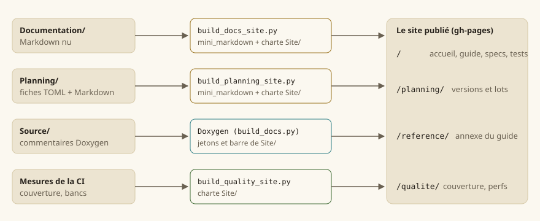

# Écrire la documentation

Cette page dit comment la documentation est **faite**, et donc comment y ajouter une page sans rien
casser. Elle vaut pour le guide, les spécifications et la planification : les trois s'écrivent au
même format et se rendent par le même moteur.

## Le principe : du Markdown nu, un seul moteur

Une page est un fichier Markdown **lisible tel quel** dans le dépôt et sur la forge : pas une
commande Doxygen, des liens relatifs ordinaires. Le site n'ajoute que la mise en forme.



| Partie du site | Source | Générateur |
|---|---|---|
| Accueil, guide, spécifications, cahier de test | `Documentation/` | `Documentation/outils/build_docs_site.py` |
| Planification (versions, lots, référentiels) | `Planning/` | `Planning/outils/build_planning_site.py` |
| Qualité (couverture, performances) | mesures de la CI | `scripts/docs/build_quality_site.py` |
| Référence du code — l'annexe du guide | commentaires de `Source/` | Doxygen, par `scripts/docs/build_docs.py` |

Les deux premiers partagent le moteur Markdown (`Planning/outils/mini_markdown.py`, sans
dépendance) ; les quatre partagent la charte de `Site/` — aucune couleur ne s'écrit ailleurs que
dans `Site/tokens.css`.

> **Note** — Avant la refonte, toutes ces pages passaient par Doxygen (`@page`, `@subpage`,
> `@ref`, `\anchor`). Doxygen ne lit plus que le code : une commande Doxygen restée dans une page
> fait échouer `lint_docs.py`.

## Où ranger une page

| Je veux écrire… | Je crée… | Et je la cite dans… |
|---|---|---|
| une page du guide | `Documentation/Guide/guide-<sujet>.md` | le plan de `Guide/README.md` |
| une page du manuel | `Documentation/Guide/Manuel/<sujet>.md` | `Guide/Manuel/README.md` |
| une spécification | `Documentation/Specification/<sujet>.md` | la liste de `Specification/README.md` |
| un lot | `Planning/versions/<version>/lots/LOT-NNN-<objet>.md` | rien : le site le trouve |

L'**ordre de lecture** d'une partie est celui où son `README.md` cite ses pages ; le menu latéral
et les liens « précédent / suivant » en découlent. Une page que rien ne cite est une erreur de lint
(*page orpheline*). Le cahier de test ne s'écrit pas : il est engendré
(`scripts/docs/generate_cahier_test.py`).

## Les conventions d'écriture

### Titres et ancres

Un seul titre `#` par page : c'est son nom dans le menu. Les titres `##` forment le sommaire de la
page. Une ancre se déduit du titre ; pour une ancre **stable**, que d'autres pages citent, l'écrire :

```
## Le rendu déterministe {#rendu-deterministe}
```

### Liens

Toujours **relatifs**, vers le fichier source — le site les réécrit :

```
[la boucle de jeu](guide-boucle.md)                          une page voisine
[EX-CBT-020](../Specification/combat.md#EX-CBT-020)          une ancre d'une autre partie
[LOT-128](../../Planning/versions/v0.1.0/v0.0.1-demo/lots/LOT-128-cartes-maquettes.md)
[`Level.h`](../../Source/Core/Levels/Level.h)                un fichier du dépôt : ouvert sur la forge
```

Trois choses se relient **toutes seules** quand elles sont écrites en code :

| Écrit | Devient un lien vers |
|---|---|
| `` `EX-CBT-020` `` | la déclaration de l'exigence, dans sa spécification |
| `` `LOT-128` ``, `` `LOT-19` ``, `` `LOT-EDITOR-03` `` | la fiche du lot, dans la planification |
| `` `core::BattleGrid` ``, `` `hmi::Camera2D::zoom` `` | le symbole, dans la référence du code |

### Exigences

Une exigence se **déclare** par une puce qui s'ouvre sur son identifiant en gras, dans une page de
`Documentation/Specification/` — et nulle part ailleurs :

```
- **EX-CBT-020** — Le déplacement d'un tour est borné par une portée en cases…
```

`scripts/checks/lint_exigences.py` vérifie qu'elle est déclarée une fois, et citée au moins une fois
ailleurs ; `--next` donne le prochain numéro libre. Le site en tire l'[index des
exigences](../Specification/README.md), avec le code et les tests qui citent chacune.

### Figures, captures et maquettes

Une image **seule dans son paragraphe** devient une figure, légendée par son texte alternatif —
qui doit donc dire ce qu'on regarde, pas « capture 3 » :

```

```

| Nature | Dossier | Fabrication |
|---|---|---|
| Capture du jeu ou de l'éditeur | `Guide/captures/` | `python Documentation/outils/capture_screens.py --bin build/ninja/bin` — jamais à la main : une capture se refait |
| Schéma, diagramme | `Guide/figures/`, `Specification/figures/` | SVG écrit à la main |
| Maquette d'écran (ce que l'écran **doit** être) | `Specification/maquettes/` | SVG écrit à la main ; les maquettes peintes de la charte v2 restent dans les annexes du `LOT-87` |

Un SVG porte son propre fond (il s'affiche aussi en thème sombre) et n'emploie que la palette de la
charte : ivoire `#fbf8f0`, sable `#ece4d1`, filet `#d6c9a8`, encre `#25201a`, gris `#6a6152`,
or `#9a7420`, bourgogne `#8a2233`, vert `#3f6b34`, eau `#2f7f86`.

> **Attention** — Aucune image du corpus (livres de Tanares) ne s'affiche ni ne se décalque dans la
> documentation. Une maquette est un dessin d'intention, fait ici.

### Encadrés

Une citation qui s'ouvre sur `**Note**`, `**Attention**` ou `**Astuce**` devient un encadré coloré.
Les autres citations restent des citations.

### Ce que le moteur ne rend pas

Le moteur est volontairement réduit : titres, paragraphes, listes (imbriquées, numérotées, à cocher),
tableaux, blocs de code, citations, filets, gras, italique, code, liens, images, et les balises
`<br>`, `<kbd>`, `<sub>`, `<sup>`. Pas de HTML libre, pas de notes de bas de page, pas de formule :
une formule s'écrit en bloc de code ou se dessine.

## Documenter le code

La référence se tire des commentaires Doxygen de `Source/`. Chaque symbole public porte au moins un
`@brief` ; une fonction, ses `@param` et son `@return` :

```cpp
/**
 * @brief Cases atteignables depuis @p origine avec @p budget cases de déplacement.
 * @param origine Case de départ, dans la grille.
 * @param budget Déplacement restant, en cases.
 * @return L'aire atteignable ; vide si @p origine est hors grille.
 */
```

La génération échoue au **moindre avertissement** : un `@param` oublié casse la CI. Le guide, lui,
explique *pourquoi* et *comment les pièces s'assemblent* — il ne recopie pas la référence, il y
renvoie.

## Vérifier avant de pousser

```
python Documentation/outils/lint_docs.py          # liens, ancres, pages orphelines, lots cités
python scripts/checks/lint_exigences.py                  # exigences déclarées une fois, citées
python scripts/docs/generate_cahier_test.py --check    # cahier de test à jour
python Planning/outils/lint_planning.py           # fiches de lots
python scripts/docs/build_docs.py                      # la référence du code (Doxygen, sans avertissement)
python Documentation/outils/build_docs_site.py --out build/site                       # les pages
python Planning/outils/build_planning_site.py --out build/site/planning --docs-url ../
```

`uv run scripts/check.py` rejoue d'un coup tous les contrôles du job de lint de la CI. Le site se
lit ensuite en ouvrant `build/site/index.html` ; la recherche demande un serveur local
(`python -m http.server -d build/site`).

## La publication

`docs.yml` publie à chaque poussée sur `main` : les pages à la racine, la référence sous
`reference/`, la planification sous `planning/`, la qualité sous `qualite/`. La branche `gh-pages`
est remplacée en entier : rien ne s'y édite.
