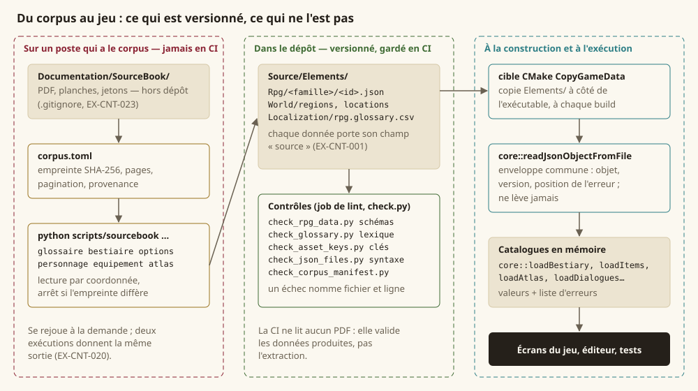
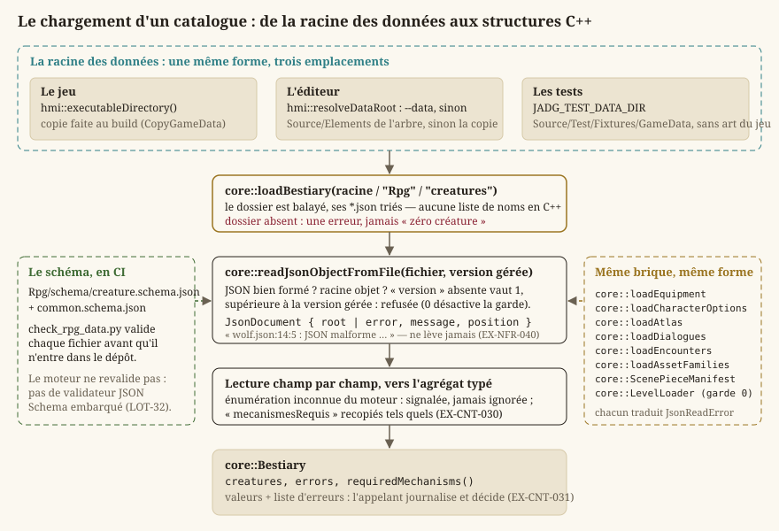
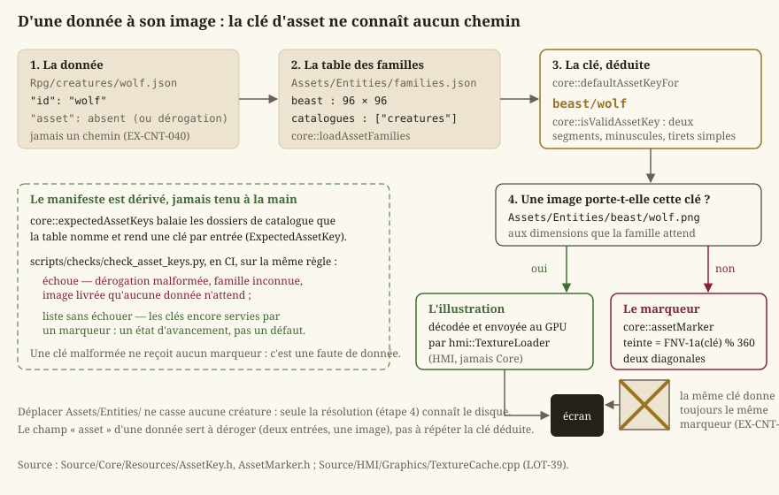
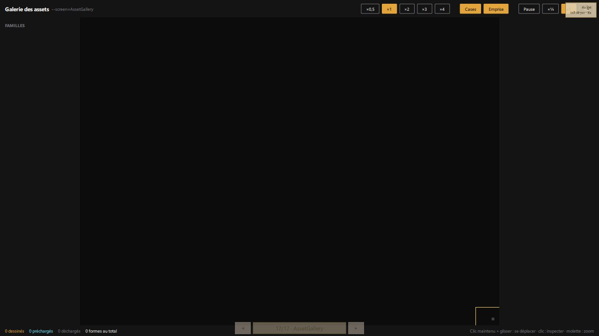
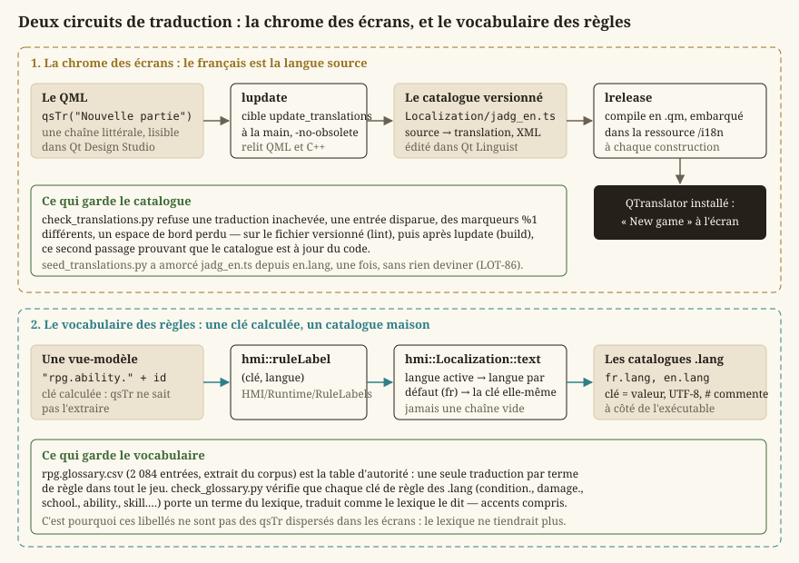

# Données, corpus et ressources

Le jeu visé est un bac à sable dans un univers complet : treize régions, des dizaines d'espèces et
de classes, des centaines de créatures. Aucune de ces valeurs ne vit dans du C++ — ni en constante,
ni en `switch`, ni en table codée en dur (`EX-VIS-007`). Tout est **donnée** : des fichiers JSON
sous `Source/Elements/`, produits depuis les livres du corpus par une chaîne d'extraction, validés
par des schémas en intégration continue, et lus au démarrage par une brique de lecture unique.
Cette page suit ce chemin de bout en bout : ce que sont ces données, d'où elles viennent, comment
le moteur les charge, comment une donnée trouve son image, et comment un texte trouve sa langue.

Le périmètre est celui de `Source/Core/Data/` (la brique de lecture), `Source/Core/Resources/`
(clés d'assets, marqueurs, manifeste des pièces), `Source/Elements/` (les données elles-mêmes),
`scripts/sourcebook/` (l'extraction du corpus), les scripts `scripts/check_*.py` qui gardent les
données, et `Source/HMI/Localization/` (les textes). Ce que **contiennent** les catalogues — une
créature, une arme, une règle — est l'affaire de [Règles d20 et personnages](guide-regles.md) et de
[Combat tactique](guide-combat.md) ; ici, on parle de la **filière** qui les produit, les valide et
les sert.

## Définitions

Le lecteur connaît C++ ; il ne connaît pas forcément le vocabulaire d'un moteur de jeu piloté par
les données. Six mots reviennent partout dans cette page.

- Un **catalogue de données** est un dossier de fichiers JSON, **un fichier par entrée**
  (`Rpg/creatures/wolf.json`), lu en entier au démarrage et transformé en un agrégat C++ typé
  (`core::Bestiary`). Un catalogue ne porte pas de code : il déclare des valeurs, et le moteur les
  joue. Ce qu'il ne sait pas jouer, il le dit (`EX-CNT-031`) plutôt que de le taire.
- Un **schéma** (JSON Schema) est le **contrat** d'une famille de données : quels champs, de quel
  type, dans quelles bornes, avec quelles énumérations fermées. Il vit dans `Rpg/schema/` et se
  vérifie en intégration continue, **pas** à l'exécution (`EX-CNT-010`).
- Une **clé d'asset** est la façon dont une donnée désigne son illustration : `beast/wolf`, jamais
  un chemin de fichier (`EX-CNT-040`). La clé est stable ; l'endroit où vit l'image ne l'est pas.
- Un **manifeste** est un fichier de **format** qui décrit ce qu'un dossier d'assets contient — la
  liste des pièces d'une planche, les cartes peintes et leur empreinte, les familles d'assets et
  leurs dimensions. Un manifeste porte un `version` ; une entrée de catalogue n'en porte pas.
- La **chaîne d'extraction** est l'outil Python (`scripts/sourcebook/`) qui lit les PDF du corpus —
  les livres de règles et de Tanares, hors dépôt — et écrit les catalogues. Elle est
  **reproductible** : deux exécutions donnent le même fichier (`EX-CNT-020`).
- La **localisation** est la résolution d'un texte d'interface dans la langue du joueur. Le projet
  en a deux circuits : la chrome des écrans, traduite par Qt (`qsTr`, `.ts`, `.qm`), et le
  vocabulaire des règles, résolu par clé dans un catalogue maison (`.lang`, `hmi::Localization`).

## La règle : rien du corpus ne s'affiche, tout s'extrait en données

Le projet est privé et sans diffusion ; les licences du corpus ne contraignent pas l'usage de son
**vocabulaire** ni de ses **valeurs**. Elles ne sont pas supprimées pour autant : elles sont
endormies, et se réveilleraient le jour d'une publication. Deux disciplines gardent cette porte
ouverte.

**Chaque donnée dit d'où elle vient.** Le champ `source` — `srd`, `tanares`, `phb-fr` ou
`original` — est obligatoire au schéma (`EX-CNT-001`, `EX-CNT-002`). Le jour où la question
« qu'est-ce qui devrait sauter ? » se pose, elle se répond par une requête sur ce champ, pas par une
relecture de milliers de fichiers.

**Aucune image du corpus n'entre dans le dépôt.** Le plan de la capitale, la carte du monde, les
planches des livres sont des œuvres : le jeu ne les affiche pas et ne les décalque pas
(`EX-IHM-076`). Le `LOT-94` a retiré les deux dernières images du corpus qui y étaient et a confié
à `check_ui_assets.py` le soin de refuser toute provenance autre que `produced` ; les cartes de
l'écran « Carte » sont **peintes par l'auteur** et gardées par `check_map_assets.py`. La chaîne
d'extraction sait rendre une région de page en PNG (`EX-CNT-022`), mais cette capacité sert à
**regarder** une référence sur un poste, jamais à produire un asset.

Le corpus lui-même (`Documentation/SourceBook/`, environ 280 Mo de PDF) et le texte intermédiaire
que l'extraction en tire ne sont **pas versionnés** (`EX-CNT-023`) : le premier pèse trop pour un
dépôt et se compresse mal, le second est un cache. Seules les **données finales** le sont, et ce
sont elles que l'intégration continue valide. La CI ne lit aucun PDF ; `check_glossary.py`
vérifie même que le `.gitignore` exclut bien le corpus, parce que cette exclusion avait vécu un
temps comme modification locale non commise d'un seul poste.

## Où vivent les données : `Source/Elements/`

`Source/Elements/` est la racine de tout ce qui n'est pas du code. Chaque sous-dossier est copié à
côté de l'exécutable à chaque construction par la cible CMake `CopyGameData` (déclarée dans
[`Source/HMI/CMakeLists.txt`](../../Source/HMI/CMakeLists.txt)), si bien que le jeu, l'éditeur et
les tests retrouvent la même forme d'arborescence quel que soit l'endroit d'où ils lisent.

| Dossier | Contenu | Produit par |
|---|---|---|
| `Rpg/<famille>/<id>.json` | les catalogues du jeu de rôle : `creatures` (94), `items` (125), `weapons` (37), `armors` (13), `species` (22), `backgrounds` (13), `classes` (4, provisoires), `feats` (42), `skills` (18), `languages` (16), `rules` (7), `encounters`, `characters` | la chaîne d'extraction (`LOT-33`, `LOT-34`, `LOT-36`, `LOT-43`) ; quelques fichiers `original` écrits à la main |
| `Rpg/schema/*.schema.json` | 28 schémas, dont `common.schema.json` que tous réutilisent | à la main (`LOT-32`, puis chaque lot qui ajoute une famille) |
| `World/regions`, `World/locations` | l'atlas : 13 régions, 107 lieux | `sourcebook atlas` (`LOT-37`) |
| `World/cities`, `World/dialogues` | les plans de ville et les graphes de dialogue | à la main et par l'éditeur |
| `Levels/<région>/<ville>/<zone>.json` | les cartes (format v4) | l'éditeur, et lui seul ([Niveaux](guide-niveaux.md)) |
| `Assets/` | images et polices : `Common/`, `Regions/`, `Entities/`, `Maps/`, `UI/`, `Fonts/`, chacun avec son manifeste | les ateliers, jamais à la main |
| `Maps/world-maps.json` | les positions relevées sur les cartes peintes : ancre d'une région, cadre, lieux, quartiers | relevé par Ctrl+clic dans l'écran « Carte » (`LOT-94`) |
| `Localization/` | `fr.lang`, `en.lang`, `jadg_en.ts`, `rpg.glossary.csv` | à la main, Qt Linguist, `sourcebook glossaire` |
| `Editor/Templates/` | trois modèles de carte vide | `LOT-EDITOR-08` |
| `Credits/credits.json` | l'écran des crédits | à la main |

Deux conventions traversent tous les catalogues. Les **identifiants** sont en anglais, en
*kebab-case* ASCII (`giant-eagle`, `saber-toothed-tiger`), jamais renommés : c'est la clé par
laquelle une donnée en désigne une autre, et une créature qui cite la langue `elvish` doit la
trouver au catalogue des langues — `check_rpg_data.py` le vérifie. Les **unités internes** sont
uniques : prix en pièces de cuivre, poids en grammes, entiers tous les deux ; la conversion se fait
à l'extraction, et l'affichage reste une affaire de présentation.

### La racine des données à l'exécution

Trois programmes lisent cette arborescence, et chacun la trouve différemment — c'est le premier
point à connaître quand une donnée « n'est pas là ».

- **Le jeu** lit à côté de son exécutable (`hmi::executableDirectory()`), donc la **copie** que
  `CopyGameData` refait à chaque build. Modifier un fichier de cette copie ne change rien au dépôt,
  et la construction suivante l'écrase.
- **L'éditeur** fait foi pour les cartes : `hmi::resolveDataRoot` (`Source/Editor/Logic/DataRoot.h`)
  prend la valeur de `--data` si la ligne de commande en donne une, sinon le `Source/Elements` de
  l'arbre des sources qui l'a construit, sinon la copie. L'arbre des sources est reconnu à la
  **présence** de son dossier `Levels/`, pas à son contenu — et comme Git ne garde pas un dossier
  vide, c'est `Levels/README.md` qui tient ce dossier dans le dépôt (`LOT-123`).
- **Les tests** lisent `Source/Test/Fixtures/GameData`, exposé par la macro `JADG_TEST_DATA_DIR`
  (`Source/Test/CMakeLists.txt`). Cette racine a la forme de `Source/Elements/` mais **sans un seul
  asset ni une seule carte du jeu** : une place de ville, une caverne, un donjon, deux planches de
  lieu en aplats, une figurine par famille, une région, un dialogue. Les tests y prouvent des
  **mécanismes** — un manifeste se lit, une pièce se résout, un portail se traverse — qui doivent
  survivre à n'importe quel contenu du jour ; la table rase du `LOT-102` aurait sinon emporté ces
  tests avec l'art qu'elle retirait. L'éditeur a de même `Source/Test/Fixtures/EditorData`, trois
  cartes et une planche synthétique, pour ses propres tests sur une base vide (`LOT-123`).

> **Attention** — Une donnée qui manque dans la copie de construction ne se corrige pas dans la
> copie : elle se corrige dans `Source/Elements/`, puis on reconstruit. Le seul outil qui écrit
> directement dans `Source/Elements/` est l'éditeur, pour les cartes et les clés de traduction
> qu'elles créent.

## La brique de lecture : `core::JsonDocument`

Avant le `LOT-79`, le dépôt comptait six réimplémentations de « lire un fichier JSON » — catalogues
d'animations, de sons, de palettes, chargeur de niveaux… — qui répétaient la même séquence
(parser, vérifier que la racine est un objet, lire un champ de version absent valant 1, refuser une
version supérieure) et redéfinissaient chacune ses catégories d'échec. Aucune ne disait **où**
était l'erreur : `nlohmann::json` ne rapporte qu'un décalage en octets, et les six le jetaient. La
filière données allait ajouter une quinzaine de lecteurs ; `EX-CNT-012` exige qu'ils passent tous
par une brique unique. C'est `Source/Core/Data/JsonDocument.h`.

### Les types

`core::JsonReadError` porte les **cinq catégories** d'échec, une seule fois pour tout le dépôt :
`None`, `FileNotFound` (fichier absent ou illisible), `ParseError` (JSON malformé, ou racine qui
n'est pas un objet), `UnsupportedVersion` (numéro supérieur à ce que le lecteur sait lire) et
`MalformedStructure` (champ absent, type incorrect). Chaque lecteur qui garde sa propre énumération
publique la traduit depuis celle-ci par un `switch` exhaustif **sans `default`** : ajouter une
catégorie d'un côté fait échouer la compilation plutôt que de tomber dans un cas par défaut.

`core::TextPosition` est une ligne et une colonne comptées à partir de 1, `{0, 0}` si inconnues.
`core::positionOf(texte, décalage)` convertit le décalage d'octets de `nlohmann` en cette position,
en comptant les retours à la ligne qui précèdent l'octet fautif. C'est la seule différence visible
à l'usage entre avant et après le `LOT-79`, et elle est décisive : « JSON malformé » ne se corrige
pas, « `sounds.json:12:5` » si (`EX-CNT-010`).

`core::JsonDocument` est le résultat : l'arbre parsé `root` **ou** la description de l'échec
(`error`, `message`, `position`), jamais les deux ; `version` est la version lue ; `ok()` dit si la
lecture a abouti.

### `core::readJsonObject` et `core::readJsonObjectFromFile`

`readJsonObject(json, supportedVersion, origin, versionField)` lit **l'enveloppe commune** d'un
document depuis du texte déjà en mémoire :

1. il parse en laissant l'exception de `nlohmann` se produire **à l'intérieur** de la brique — le
   mode non lançant renverrait « document rejeté » sans dire où —, la capture pour en extraire la
   position, et n'en laisse aucune franchir la frontière (`EX-NFR-040`). Une seconde garde attrape
   un texte bien formé que `nlohmann` ne sait pas représenter (`1e400` lève `out_of_range`, sans
   position) : le fuzzing de nuit l'avait trouvé ;
2. il refuse une racine qui n'est pas un objet ;
3. il lit le champ de version (`"version"` par défaut ; `versionField` permet un autre nom). **Absent,
   il vaut 1** : un catalogue écrit avant que son format ne se versionne reste lisible sans réécrire
   les fichiers existants. Non entier, c'est `MalformedStructure` ;
4. si `supportedVersion > 0` et que la version lue lui est supérieure, c'est `UnsupportedVersion` :
   un fichier plus récent que le jeu contient par définition ce que le jeu ne sait pas interpréter,
   et le lire au mieux produirait un jeu silencieusement faux. **`supportedVersion = 0` désactive la
   garde** pour l'appelant qui porte la sienne avec sa propre catégorie d'échec — le chargeur de
   niveaux, dont `core::LevelValidationError::UnsupportedFormatVersion` préexistait.

`origin` est le nom à faire figurer dans les messages (« manifest.json ») ; le préfixe
`fichier:ligne:colonne : ` se réduit à ce qui est connu.

`readJsonObjectFromFile(path, supportedVersion, versionField)` lit d'abord le fichier, produit
`FileNotFound` s'il est absent ou illisible, puis délègue à `readJsonObject` avec le nom du fichier
pour origine. Un fichier absent n'est **pas** un document vide : c'est à l'appelant de décider
qu'un catalogue absent est un état de départ légitime, et cette décision ne peut pas être prise
dans la brique.

La brique expose l'arbre `nlohmann::json` à ses appelants ; la bibliothèque est donc une
dépendance **publique** de `Core`. L'alternative — une façade typée par-dessus — aurait été un
second modèle d'arbre à maintenir pour ne rien gagner d'observable. La lecture d'un catalogue reste
malgré tout **confinée aux `.cpp`** des chargeurs : le reste du moteur ne voit que des agrégats
typés.

### Comment un chargeur s'en sert

Tous les chargeurs de catalogue ont la même forme, et `core::loadBestiary`
(`Source/Core/Rpg/Bestiary.cpp`) en est le modèle :

- le **dossier est balayé** et ses `.json` triés : une liste de quatre-vingt-quatorze noms écrite en
  C++ serait une seconde source de vérité, et la première créature ajoutée en sortirait invisible ;
- un dossier **absent** produit une erreur, jamais « zéro créature » : les deux se ressemblent à
  l'exécution, et confondre « pas installé » avec « aucune entrée » fait chercher le défaut du
  mauvais côté pendant longtemps ;
- chaque fichier passe par `readJsonObjectFromFile` **sans garde de version** (une entrée de
  catalogue n'est pas un document de format), et un échec de la brique s'ajoute tel quel à la liste
  d'erreurs — le message porte déjà le fichier et la ligne ;
- la lecture champ par champ remplit l'agrégat ; une valeur d'énumération inconnue du moteur est
  **signalée**, jamais ignorée (`EX-CNT-011`) ; les `mecanismesRequis` déclarés par la donnée sont
  recopiés tels quels ;
- le résultat est **valeurs plus liste d'erreurs** (`core::Bestiary::errors`,
  `core::EquipmentCatalog::errors`, `core::Atlas::errors`…), et `requiredMechanisms()` rend l'union
  des mécanismes que les données exigent : c'est l'état d'avancement consultable qu'`EX-CNT-031`
  demande, pas une erreur fatale. L'appelant — `hmi::ArenaModel::loadCatalogs`,
  `hmi::WorldMapModel`, `hmi::DialogueModel`… — journalise les erreurs et décide.

Les chargeurs qui suivent cette forme : `core::loadBestiary`, `core::loadEquipment`,
`core::loadCharacterOptions`, `core::loadAtlas`, `core::loadDialogues`, `core::loadEncounters`,
`core::loadAssetFamilies`, `core::ScenePieceManifest::loadFromFile`, `core::LevelLoader` ; côté
IHM, les catalogues d'animations et d'apparence. Le moteur **ne revalide pas** les schémas à
l'exécution : embarquer un validateur JSON Schema coûterait une dépendance pour recontrôler ce qui
l'a été avant d'entrer dans le dépôt (`LOT-32`). Ce que le chargeur vérifie, c'est ce que le
schéma ne peut pas dire — une référence vers une autre entrée, une énumération du moteur.

## Les schémas : le contrat avant les données

Le `LOT-32` a livré les schémas alors qu'il n'existait **aucune donnée** à valider. L'ordre compte :
un contrat écrit après coup se contente de décrire ce qui a été produit, y compris ses défauts.
Chaque famille a son schéma (`creature.schema.json`, `weapon.schema.json`, `region.schema.json`…),
déduit du nom de son dossier par `check_rpg_data.py`, et tous réutilisent
[`common.schema.json`](../../Source/Elements/Rpg/schema/common.schema.json), qui porte ce qu'une
définition écrite deux fois ferait diverger :

| Définition | Ce qu'elle impose | Pourquoi |
|---|---|---|
| `id` | kebab-case ASCII, 2 à 96 caractères | la clé par laquelle une donnée en désigne une autre ; 96 parce qu'un identifiant de lieu est composé (région + lieu, `LOT-37`) |
| `source` | `srd`, `tanares`, `phb-fr`, `original` — **requis** | `EX-CNT-001`, `EX-CNT-002` |
| `status` | `provisoire`, `raison`, `retraitSi` — les trois requis ensemble | une donnée provisoire non marquée devient permanente par accident ; le critère de retrait s'écrit d'avance (`EX-CNT-032`) |
| `mecanismesRequis` | liste d'identifiants, sans doublon | ce que la donnée exige du moteur (`EX-CNT-030`) |
| `assetKey` | `famille/identifiant`, la **même** expression que `core::isValidAssetKey` | la donnée refusée à la validation est exactement celle que le moteur refuse |
| `damageType`, `condition`, `magicSchool` | énumérations fermées : 13, 15 et 8 valeurs | tenues d'accord avec le C++ et le lexique (voir plus bas) |
| dés | expression régulière `1d8`, `2d6+3`, `4` | un `1d8` devenu `ld8` à l'OCR est invisible à la relecture et fatal à l'exécution |

Trois choix de conception valent pour tous les schémas. **`additionalProperties: false`
partout** : sans lui, `weigthGrams` au lieu de `weightGrams` passe sans un mot, et l'arme pèse
zéro. **Un schéma décompose, il ne calcule pas** : la classe d'armure d'une armure est donnée en
base, contribution de Dextérité et plafond, jamais en formule textuelle — une formule dans une
donnée est du code déguisé. **Le socle commun s'applique par `allOf`** et le `required` de chaque
famille ne le répète pas, sinon un champ manquant se signalait deux fois.

### Le triangle moteur, contrat, lexique

Trois artefacts nomment les mêmes treize types de dégâts, quinze états et huit écoles : le moteur
(`core::DamageType`, `core::Condition`, `core::MagicSchool`), le contrat (`common.schema.json`) et
le lexique (`rpg.glossary.csv`). Rien ne les tient d'accord tout seuls, et une divergence est
silencieuse : le JSON déclare `psychique`, le C++ ne connaît que `Psychic`, la valeur tombe dans le
cas par défaut, et le sort cesse de faire des dégâts. Chaque arête est donc contrôlée **une fois** :

| Arête | Contrôlée par |
|---|---|
| moteur ↔ contrat | `test_rpg_enums.cpp` (`ctest`) lit le schéma livré et compare aux noms produits par le C++ |
| contrat ↔ lexique | `check_rpg_data.py` (CI) : les valeurs du schéma sont les termes anglais du lexique sous la catégorie correspondante |
| moteur ↔ lexique | aucun : par transitivité — un troisième contrôle serait bruyant, et le jour où deux échouent on ne saurait plus lequel dit vrai |

Les cardinaux 13, 15 et 8 sont en outre écrits dans un test : ils viennent des règles du jeu, pas
du corpus, et le test de coïncidence resterait vert si les deux côtés perdaient la même valeur.

## Les clés d'assets et les marqueurs : `Source/Core/Resources/`

Le `LOT-39` a posé la plomberie qui fait tourner le jeu **complet** — trois cents entrées
affichables — avant qu'une seule illustration ne soit produite. Deux en-têtes la portent, sans Qt
ni GPU (`EX-ARCH-001`).

### `AssetKey.h` : ce qu'une clé est, et d'où elle vient

`core::AssetFamilyDefinition` décrit une **famille** d'assets d'entité : son nom (`beast`, `item`,
`species`…), les dimensions en pixels que ses images doivent avoir, et les dossiers de catalogue
dont **chaque entrée** attend une illustration de cette famille. Ces définitions sont **lues** dans
[`Assets/Entities/families.json`](../../Source/Elements/Assets/Entities/families.json), jamais
énumérées en C++ : le vocabulaire grandira — sorts, PNJ, quartiers de guilde — et une énumération
fermée obligerait chaque lot à recompiler pour ajouter une famille. Sept familles à ce jour :
`beast` (96 × 96, jeton rond de table virtuelle), `item`, `weapon`, `armor` (48 × 48, icônes
d'inventaire), `species`, `background`, `class` (128 × 128, portraits et emblèmes de la création de
personnage). Compétences, langues et dons n'attendent aucune image et n'y figurent pas.

`core::AssetFamilyTable` est la table chargée — `families` et `errors` —, avec `find(nom)` et
`ok()`. `core::loadAssetFamilies(fichier)` la lit par la brique commune avec une **garde de
version** (la table est un document de format) ; une famille sans nom valide ou **sans dimensions**
est refusée, parce qu'une famille muette rendrait le contrat de dimensions inopérant pour toute une
famille sans que rien ne le signale ; un fichier sans aucune famille est une erreur.

`core::isValidAssetKey(clé)` dit si une chaîne respecte la syntaxe d'une clé : **exactement deux
segments** séparés par `/`, chacun en minuscules, chiffres et tirets simples, ni en tête ni en
queue. `beast/wolf/token` est refusé : un troisième segment serait un chemin qui ne dit pas son
nom, et c'est précisément ce qu'`EX-CNT-040` écarte. `core::parseAssetKey` décompose en
`core::AssetKey { family, id }`, ou rend `std::nullopt` — jamais une clé devinée.

`core::defaultAssetKeyFor(famille, id)` rend la clé **par défaut** d'une entrée, `famille/id`, ou
une chaîne vide si l'un des deux ne peut pas former un segment. C'est la règle qui évite trois
cents lignes recopiées et la première faute de frappe qui donnerait une créature sans image sans
que rien ne l'explique : une créature `wolf.json` attend `beast/wolf` **sans rien écrire**. Le
champ `asset` d'une donnée sert à **déroger** — deux entrées qui partagent une illustration —, pas
à répéter.

`core::expectedAssetKeys(rpgDir, familles, erreurs)` énumère les clés qu'attendent les catalogues :
pour chaque famille, pour chaque dossier qu'elle nomme, pour chaque fichier, une
`core::ExpectedAssetKey` — la clé, sa famille, le fichier qui l'attend et si la donnée a dérogé.
Le manifeste est ainsi **dérivé** à chaque appel, jamais commis : un fichier tenu à la main
divergerait du catalogue au premier ajout de créature, et c'est la copie oubliée qu'on lit six mois
plus tard. Seules les clés **orphelines** entrent dans `erreurs` — une dérogation malformée, ou
qui nomme une famille inconnue — parce qu'une clé sans image n'est pas un défaut mais un état
d'avancement (`EX-CNT-041`).

### `AssetMarker.h` : ce qui tient lieu d'image

`core::MarkerColor` est une couleur RVBA sur quatre octets ; `core::MarkerImage` ses pixels,
`width × height`, ligne par ligne depuis le haut, avec `isEmpty()` et `at(x, y)`. Aucune
dépendance au rendu : `HMI` convertit en texture (`hmi::TextureCache::markerTexture`).

`core::assetMarker(clé, largeur, hauteur)` peint le marqueur d'une clé. Sans marqueur, trois cents
entrées s'afficheraient comme des trous et la production graphique deviendrait un préalable
bloquant ; avec, elle devient un **remplacement progressif**, une image à la fois, et le jeu ne
cesse jamais d'être jouable. Trois propriétés sont voulues :

- **déterministe** : la même clé donne toujours le même marqueur. Un marqueur tiré au hasard
  changerait à chaque lancement, deux captures du même combat différeraient, et un test ne
  pourrait rien en dire. La teinte est `hachage(clé) % 360`, à saturation et valeur fixes ;
- **manifestement un marqueur** : deux diagonales barrent la vignette, d'épaisseur proportionnelle
  à sa taille (deux pixels se voient sur 48 et disparaissent sur 128), pour qu'on ne le prenne
  jamais pour une illustration définitive livrée un peu vite ;
- **refusé à une clé malformée** : l'image rendue est vide. Lui donner un marqueur la ferait passer
  pour une entrée en attente d'illustration, alors qu'elle est une faute de donnée que
  `expectedAssetKeys` signale.

`core::stableAssetHash(clé)` est le hachage FNV-1a 32 bits dont la teinte dérive. Il est écrit
dans le projet plutôt qu'emprunté à `std::hash`, dont la valeur n'est **pas** garantie d'une
plateforme ou d'une version de bibliothèque à l'autre : le marqueur d'un loup changerait de teinte
au changement de compilateur — une régression invisible en développement et visible chez le
joueur. Il est exposé pour être testé.

> **Note** — Il n'y a pas de `ResourceManager` unique dans `Core`. Un gestionnaire de textures
> obligerait `Core` à connaître le GPU (`EX-ARCH-010`) ; la gestion des ressources vit du côté qui
> les possède — les textures dans `HMI/Graphics` (`hmi::TextureLoader`, `hmi::TextureCache`), les
> cartes dans `Core/Levels`. `EX-ARCH-080` a été amendée en conséquence, et le `README.md` de
> `Source/Core/Resources/` le rappelle.

### Où vit l'image, et qui la trouve

`beast/wolf` se sert dans `Assets/Entities/beast/wolf.png`, aux dimensions que la famille attend.
Seule cette résolution — dans `HMI` — connaît le disque : déplacer le dossier ne casse aucune
créature, il ne casse que l'endroit où on regarde. `scripts/checks/check_asset_keys.py` applique la même
règle en CI (voir plus bas) et échoue aussi sur une **image livrée qu'aucune donnée n'attend** :
elle ne serait jamais affichée.

## Le manifeste des pièces d'un lieu : `core::ScenePieceManifest`

Une carte se dessine avec les **pièces** d'une planche de lieu — un sol, un mur, une façade —, et
l'atelier des textures (`LOT-92`) écrit à côté des images de chaque lieu un `manifest.json` qui dit
de chaque pièce sa classe, son emprise, son ancre, sa taille et son miroir. Jusqu'au
`LOT-EDITOR-02`, seule la galerie des assets le lisait, dans `HMI` : aucune règle de carte ne
pouvait s'appuyer sur l'emprise d'une pièce. La lecture est descendue dans `Core`
(`Source/Core/Resources/ScenePieceManifest.h`) pour que le moteur en déduise l'occupation et la
collision (`LOT-EDITOR-12`, `core::deriveCollision`) ; `HMI` n'en garde que les images.

Le manifeste nomme une pièce par une **clé d'atelier** (`scene/martpart/wall-left`) ; une carte ne
connaît que le **nom court** (`wall-left`), celui que la table d'apparence et l'assignation de
texture écrivent. Le lecteur rend les deux.

- `core::ScenePieceClass` : `Floor` (un losange de sol), `Tall` (une pièce debout d'une case :
  mur, porte, torche), `Wide` (plusieurs cases : façade, étal, gradin), `Other` — une classe que ce
  lecteur ne connaît pas est **gardée par son nom**, jamais refusée. `core::parseScenePieceClass`
  fait la correspondance.
- `core::PieceTactical` : ce qu'une pièce **oppose** à qui passe, du plus faible au plus fort —
  `Open` (passe), `Difficult` (gêne), `Cover` (abri), `Obstacle` (arrête le pas : une fosse, on voit
  par-dessus), `Solid` (arrête la vue : un mur). Sur une case que plusieurs pièces couvrent, la plus
  forte l'emporte. `Difficult` et `Cover` ne sont pas encore joués depuis une pièce ; l'éditeur le
  signale. `core::pieceTacticalName` et `core::parsePieceTactical` font la correspondance avec les
  noms du manifeste (`open`, `difficult`, `cover`, `obstacle`, `solid`), le second rendant
  `std::nullopt` pour un nom inconnu.
- `core::ScenePiece` : `name` (court), `key` (atelier), `file` (relatif au dossier du lieu),
  `pieceClass` et `className`, `footprintColumns`/`footprintRows` (au moins 1 × 1, rendus par
  `footprint()`), `width`/`height` (0 si non donnés), `anchorX`/`anchorY` (le sommet haut du losange
  de l'emprise, −1 si non donnés), `mirrorOf` (le nom court de la pièce dont celle-ci est le miroir,
  l'image miroir étant livrée telle quelle), `tactical` et `aliases` (les anciens noms sous lesquels
  une carte peut encore la citer : une planche réextraite qui renomme une pièce ne casse aucune
  carte).
- `core::ScenePieceManifest::loadFromString` et `loadFromFile` lisent par la brique commune avec
  `FORMAT_VERSION = 1` et rendent un `core::ScenePieceManifestResult` — le manifeste, une
  `core::ScenePieceManifestError` (les cinq catégories, traduites depuis `core::JsonReadError`) et
  un message. Un manifeste sans objet `textures` est `MalformedStructure` ; une entrée **sans
  `file`** est ignorée plutôt que fatale, pour que les autres pièces restent utilisables. Faute de
  `tactical`, un sol passe et une pièce debout arrête la vue : c'est ce que valent les murs et
  façades que les planches livrent.
- `place()` rend le lieu (`disposition` du manifeste), `pieces()` les pièces dans l'ordre du
  fichier, `find(nom)` la pièce de ce nom court ou dont c'est un ancien nom — **le nom courant
  l'emporte toujours** sur un alias, pour qu'une pièce renommée puis remplacée par une nouvelle du
  même nom ne détourne pas les cartes qui citent la nouvelle. `core::scenePieceShortName` rend ce
  qui suit la dernière barre d'une clé d'atelier.

## Les autres manifestes de `Source/Elements/`

Chaque famille d'assets porte un manifeste, et « un dossier, un manifeste » est une règle de
l'arborescence depuis le `LOT-102` : un fichier qu'aucun manifeste ne cite fait échouer la CI.

| Manifeste | Ce qu'il déclare | Gardé par |
|---|---|---|
| `Assets/Entities/families.json` | les familles d'entité, leurs dimensions, leurs catalogues | `core::loadAssetFamilies`, `check_asset_keys.py` |
| `Assets/<niveau>/Scene/manifest.json`, `Common/<famille>/manifest.json` | les pièces d'une planche (`textures`), le lieu (`disposition`), la case de référence (`tile`) | `core::ScenePieceManifest`, la galerie |
| `Assets/Regions/<région>/region.json` | l'identité d'une région : case, cadres de figure, palette, crédits | `LOT-105` |
| `Assets/Maps/manifest.json` | les cartes peintes par l'auteur : fichier, niveau (monde, région, ville), provenance `author`, taille 1920 × 1080, empreinte SHA-256 | `check_map_assets.py` |
| `Maps/world-maps.json` | sur ces cartes, en fractions de la largeur et de la hauteur : l'ancre et le cadre de chaque région, ses lieux, ses quartiers | `check_map_assets.py`, `hmi::WorldMapModel` |
| `Assets/UI/illustrations.json` | les illustrations d'interface **produites** : clé du cahier, prompt, date, empreinte | `check_ui_assets.py` |
| `scripts/sourcebook/corpus.toml` | les documents du corpus (voir plus bas) | `check_corpus_manifest.py` |

Le `Assets/README.md` dit où un asset **va** : au niveau le plus bas qui couvre tous ses usages —
`Common/` pour ce qui existe partout, `Regions/<région>/Common/` pour l'identité d'une région,
`Regions/<région>/<ville>/<zone>/` pour ce qu'on ne voit que là. Un asset naît propre et **monte
par promotion**, jamais copié ; le moteur résout une clé du plus propre au plus commun. Les
sources — masters, planches de référence — vivent hors dépôt (`Tools/AssetsHD/`) ; seul l'asset
installé entre.

## La galerie des assets

Tout asset graphique livré doit paraître dans la **galerie des assets**, l'écran de débug
`--screen=AssetGallery` (`EX-CNT-042`) : un modèle ajouté y montre toutes ses formes et toutes ses
animations, disposées dans leur emprise, sans rien câbler d'autre que ses fichiers et son
manifeste. Vérifier un asset dans une scène de jeu ne montre que ce que la scène utilise, dans la
pose où elle l'utilise ; à mesure que les ateliers produisent, c'est la galerie qui dit ce qui
existe.

Les images qui ne sont **pas** des assets à montrer en sont exclues par une règle **nommée** dans le
code, `hmi::assetGalleryExcludes` : l'interface (`UI/`), les cartes plein écran de l'écran « Carte »
(`Maps/`) et les polices (`Fonts/`). `hmi::assetGalleryUnlisted` rend toute autre image que la
galerie ne montre pas, et un test bloquant échoue si cette liste n'est pas vide. Une famille
nouvelle, que la galerie ne sait pas encore lire, s'y ajoute dans le même changement que ses
premiers fichiers.

## La chaîne d'extraction du corpus : `scripts/sourcebook/`

Les données viennent de PDF — huit livres et neuf ressources de table virtuelle, environ 1 200
pages — par une chaîne outillée qui n'est pas un script jetable : elle se rejoue à chaque correction
du corpus. Rien de tout cela ne tourne en CI, où les PDF ne sont pas et ne seront pas
(`EX-CNT-023`). Elle se lance par `py -3.13 scripts/sourcebook <commande>` sur un poste qui a le
corpus, et dépend de **PyMuPDF** — la seule bibliothèque qui donne accès aux coordonnées de mots
dont tout le reste dépend.

### `corpus.toml` et `corpus.py` : le manifeste du corpus

[`corpus.toml`](../../scripts/sourcebook/corpus.toml) est versionné à côté de l'outil, et non à côté
des documents qu'il décrit, puisque ceux-ci ne le sont pas. Il porte, par document, quatre choses
qui répondent chacune à une panne observée : `sha256`, parce que remplacer un PDF par une autre
édition décale toutes les pages sans qu'aucun message ne le dise ; `pages`, second garde-fou lisible
par un humain ; `pagination` (`simple`, `double`, `aucune`) et `decalage`, parce que les deux livres
Tanares sont paginés en **double page** — une page PDF en porte deux côte à côte, et un sommaire
qui annonce « p. 100 » désigne la page PDF 50 ; `provenance` (`srd`, `tanares`, `phb-fr`),
reportée telle quelle dans le champ `source` de chaque donnée produite. Depuis les ressources de
table virtuelle, `type` distingue un `pdf`, une `image` seule et une `collection` — un dossier de
fichiers de même nature, dont l'empreinte porte sur la liste triée « nom:empreinte » de ses membres
plutôt que sur un fichier.

`corpus.py` lit ce manifeste et ne connaît rien du contenu des PDF. `Document` est une entrée :
`verifier()` lève `CorpusError` si le document est absent, si une collection n'a pas le compte de
fichiers annoncé, ou si l'empreinte réelle (`empreinte_reelle()`, calculée par blocs) diffère.
L'erreur est **toujours fatale, jamais rattrapée** : la rattraper reviendrait à produire les données
décalées qu'`EX-CNT-020` interdit. `index_pdf(page_imprimee)` et `pages_imprimees(index)` font la
correspondance dans les deux sens, en tenant compte de la double page. `Corpus.charger()` lit le
TOML (bibliothèque standard, `tomllib`), vérifie sa version et chaque champ requis ; `corpus[cle]`
rend un document ou nomme ceux qui existent.

### `extraction.py` : lire une page

`Extracteur(document)` ouvre un PDF **après en avoir vérifié l'empreinte** — un extracteur construit
est un extracteur dont on sait qu'il lit le bon document — et refuse un document qui n'est pas un
PDF. Trois constats du corpus y sont câblés, et non laissés à la discipline de l'appelant :

- `texte(index, moitie, region, tri)` rend le texte d'une page, d'une moitié ou d'une région en
  ordre de lecture. Il convient au corps de texte, **jamais à un tableau**. `tri=False` garde l'ordre
  du document, ce qu'il faut sur une page à deux colonnes où le tri par ordonnée entrelacerait les
  colonnes.
- `tableau(index, moitie, region, ecart_colonne, bornes)` extrait un tableau **par regroupement des
  mots selon leur coordonnée** (`EX-CNT-021`) : les lignes par chevauchement vertical des boîtes de
  mots, les colonnes par profil de projection horizontale sur **toute** la région — ce qui empêche
  une ligne courte de redéfinir les colonnes pour elle seule, la panne exacte du mode en flux, qui
  sur la table des armes attribue le poids et le prix à l'arme de la ligne suivante. Une cellule
  vide reste vide. `bornes` impose les séparations pour le seul cas que la projection ne tranche
  pas : deux colonnes qui se touchent parce que l'entrée la plus longue de l'une mord sur l'autre.
  `mots()` rend les mots avec leurs coordonnées.
- `lignes(index, moitie, region)` rend les lignes **avec leur typographie** — `Ligne` et ses
  `Fragment` (texte, police, corps, abscisses, `gras`). C'est le grain sur lequel repose toute
  l'extraction des blocs de statistiques : un titre en gras y est une donnée, et le mode texte perd
  des espaces que le fragment conserve (`Vueaiguisée`). Une ligne dessinée deux fois au même point
  n'est rendue qu'une fois : le *Player's Guide* compose ses titres en double, remplissage et trait.
- `image(index, region, moitie, ppp)` rend une région en PNG **par rendu** (`EX-CNT-022`), jamais par
  extraction du flux brut, qui produit sur ce corpus des zones de bruit vert et cyan. Le rendu
  embarque tout ce qui est dessiné, texte compris : `regions_candidates()` propose donc les
  emplacements des objets image en signalant ceux qui recouvrent du texte, et l'humain recadre.
- `rectangle()` calcule la zone de travail (page, moitié d'une double page, région), et refuse une
  moitié sur un document qui n'est pas en double page ; `statistiques()` compte pages, caractères
  et images pour l'inventaire.

Le **cache** disque (`--cache`) est indexé par l'empreinte du document : il ne peut pas servir une
réponse issue d'une autre édition, et deux exécutions donnent la même sortie avec ou sans lui.

### `mise_en_page.py` et `catalogues.py` : ce que les modules partagent

`mise_en_page.py` porte la grille à deux colonnes des documents aidedd, **mesurée une seule fois** :
la gouttière `[287, 309]` points, l'interligne qui sépare deux paragraphes (11,2 pt à l'intérieur,
15,2 pt et plus entre deux, sans valeur intermédiaire sur 1 258 intervalles), et le regroupement en
paragraphes. `verifier_gouttiere()` recontrôle page par page que le blanc central est bien blanc :
le jour où une édition le déplace, la coupe échoue au lieu de produire des blocs où une moitié de
paragraphe appartient au voisin. `bande_blanche()` et `colonnes_de_page()` **mesurent** la
gouttière quand elle bouge — le *Manuel des Joueurs* est un scan — et rendent une seule colonne
quand il n'y en a pas.

`catalogues.py` relit les catalogues **déjà livrés** pour que le lot suivant s'y raccroche : depuis
le mot français du livre, retrouver l'identifiant anglais du catalogue. `identifiant(nom)` fait le
*kebab-case* ASCII ; `catalogue_francais()` indexe un dossier par toutes ses graphies (« Tromperie /
Supercherie ») ; `index_avec_lexique()` empile le catalogue (qui fait foi), puis le lexique, puis les
alias du livre tranchés au `LOT-43` (« elfe » pour « elfique »), sans qu'une source plus tardive ne
remplace une plus ancienne. Deux modules qui referaient ce rapprochement chacun de leur côté n'en
couvriraient pas les mêmes cas, et la divergence ne se verrait que par une chouette géante muette
en elfique.

### `glossaire.py` : la table d'autorité

Le lexique bilingue est la **première** sortie de la chaîne, parce qu'il en est le gisement le plus
simple — texte natif, deux colonnes, une entrée par ligne — et qu'un outil qui n'a rien extrait est
un outil dont on ne sait rien. Il produit
[`rpg.glossary.csv`](../../Source/Elements/Localization/rpg.glossary.csv) : 2 084 entrées
`anglais;français;catégorie`. Ce n'est pas une traduction d'interface, c'est une **table
d'autorité** — une seule traduction par terme de règle dans tout le jeu, sans quoi *saving throw*
devient « jet de sauvegarde » dans la fiche, « JdS » dans le journal et « sauvegarde » dans
l'infobulle.

`lignes_utiles()` retire l'habillage et lit les deux colonnes dans l'ordre ; `assembler_entrees()`
recolle les 153 lignes de continuation (une ligne sans `=` prolonge la précédente) ; `decouper()`
lit `anglais = français ; catégorie` ; `construire()` ajoute les **compléments attestés** des
*Basic Rules* — les huit écoles de magie nues, `exhaustion` comme quinzième état, la propriété
`special` —, chacun déclarant la page où il est attesté et vérifié sur cette page avant d'être
écrit ; `ecrire_csv()` rend une chaîne comparable, ce qui permet à `glossaire --verifier` d'échouer
si le fichier versionné n'est plus ce que le corpus produit. La clé d'unicité est le couple
**(anglais, catégorie)** : `light` vaut « légère » comme propriété d'arme et « Lumière » comme sort,
et dédupliquer sur l'anglais seul en écrasait un des deux en silence.

### Les modules de catalogue

Chaque module produit une famille, choisit sa source pour une raison écrite dans son en-tête, et
porte ses propres **contrôles qui arrêtent la génération** : une extraction incomplète ne livre
jamais un catalogue amputé, parce qu'un catalogue de 93 créatures se charge, se valide et se joue
exactement comme un de 94.

| Module | Commande | Source | Sortie | Ce qui arrête la génération |
|---|---|---|---|---|
| `bestiaire.py` (`LOT-33`) | `sourcebook bestiaire` | `Animaux.pdf` | 94 créatures | le sommaire (94 noms) et le corps (94 titres) doivent coïncider nom pour nom ; gouttière re-vérifiée ; six caractéristiques et sept étiquettes exigées |
| `equipement.py` (`LOT-34`) | `sourcebook equipement` | *Basic Rules* | 37 armes, 13 armures, 125 objets | le nombre de rangées tiré de chaque table déclarée ; un tiret vaut *absent*, jamais zéro |
| `personnage.py` (`LOT-36`) | `sourcebook personnage` | *Basic Rules*, *Manuel des Joueurs*, *Player's Guide* | 22 espèces, 13 historiques, 4 classes provisoires | une augmentation présente des deux côtés et différente ; une espèce sans taille ni vitesse est écartée et dite |
| `options.py` (`LOT-43`) | `sourcebook options` | *Basic Rules*, *Manuel des Joueurs*, lexique | 18 compétences, 16 langues, 42 dons, multiclassage, difficulté, expérience | cardinal de chaque catalogue ; une divergence de la table d'emplacements qui ne serait pas un `1` effacé par l'OCR |
| `atlas.py` (`LOT-37`) | `sourcebook atlas` | *Tanares Sourcebook*, ch. 5 | 13 régions, leurs lieux | voisinage symétrique, tout voisin existe, graphe connexe (`EX-CNT-062`) ; cardinal de lieux par région |

Trois idées reviennent d'un module à l'autre. **La typographie porte la structure** : le bestiaire
reconnaît un nom de créature à sa police et son corps, un trait à son premier fragment gras, un
paragraphe d'ambiance à une autre police — sept discriminants mesurés sur trente pages, jamais une
intuition. **Un scan se lit par recoupement, pas par relecture** : l'OCR du *Manuel des Joueurs*
efface les cellules valant `1`, et la table du multiclassage est prise sur la progression du
magicien des *Basic Rules* puis confrontée cellule à cellule ; les augmentations raciales sont
lues dans le bloc et dans la table de la page 12, et doivent coïncider. **Ce que le schéma ne peut
pas dire n'est ni jeté ni élargi en silence** : une résistance conditionnelle reste dans un trait
et la créature déclare le mécanisme `resistance-conditionnelle` ; une augmentation « au choix »
déclare `augmentation-de-caracteristique-au-choix` ; le moteur les liste au chargement
(`EX-CNT-030`, `EX-CNT-031`). Les alias d'un livre (« Sangdragon » pour « drakéide », « Sorcier »
pour l'occultiste) sont **déclarés** dans une table avec leur raison, parce que le lexique est
généré et qu'une correction à la main y serait effacée.

### La ligne de commande

`__main__.py` expose `info` (les documents et leur pagination), `verifier` (les empreintes ;
`--regenerer` affiche celles à reporter au manifeste), `stats`, `texte`, `tableau`, `image`,
`regions`, puis les commandes de production `glossaire`, `options`, `bestiaire`, `personnage`,
`equipement`, `atlas`. Toute commande commence par vérifier l'empreinte, et ce n'est pas
contournable. Une page se désigne par `--page` (index PDF) ou `--page-imprimee` ; `--moitie
gauche|droite` découpe une double page ; `--region x0,y0,x1,y1` cible une zone en points PDF. Les
commandes de production impriment leurs **signalements** — ce que le livre dit et que le catalogue
ne sait pas porter, une case que le livre laisse vide, les cellules rétablies par recoupement — parce
que les taire reviendrait à choisir à la place du lecteur.

## Les contrôles en CI

La CI ne lit aucun PDF : elle valide les **données produites**, pas l'extraction. Chaque contrôle
est un script Python sans dépendance ou presque, appelé par le job de lint (`uv run scripts/check.py`
les rejoue tous en local, voir [Build, tests et intégration continue](guide-outils.md)). Plusieurs
s'**auto-testent** avant de se prononcer : un contrôle sans entrée est vert par vacuité, et personne
ne sait s'il fonctionne — c'est la panne du `LOT-78`, où une règle de lint contenait un caractère
invisible qui l'empêchait de jamais correspondre.

| Script | Ce qu'il vérifie | Échoue sur | Liste sans échouer |
|---|---|---|---|
| [`check_rpg_data.py`](../../scripts/checks/check_rpg_data.py) | les schémas eux-mêmes sont valides (un schéma mal formé accepte tout) ; chaque fichier de `Rpg/` et `World/` respecte le schéma de son dossier ; les énumérations fermées coïncident avec le lexique ; toute langue citée existe ; l'atlas est connexe et symétrique ; chaque quartier d'une ville mène quelque part ; auto-test sur `scripts/fixtures/rpg/` (3 fixtures valides, 10 invalides) | une violation, avec **fichier et ligne** — la ligne est retrouvée en cherchant les clés du chemin d'erreur dans le texte brut | les données **provisoires**, groupées par motif (`EX-CNT-032`) |
| [`check_asset_keys.py`](../../scripts/checks/check_asset_keys.py) | les clés d'entité, par la même expression que `common.schema.json` et `core::isValidAssetKey` ; les figurines de monstres (`Assets/Monsters/`, bandes et `.anim.json` aux dimensions du gabarit) | une clé orpheline ; une image livrée qu'aucune donnée n'attend | les clés encore servies par un marqueur (`EX-CNT-041`) |
| [`check_json_files.py`](../../scripts/checks/check_json_files.py) | tout `.json` suivi : JSON valide, **pas de clé en double** (la seconde écrase la première en silence), pas de BOM, retour à la ligne final ; aussi en hook pre-commit | l'un de ces défauts ; deux fixtures volontairement invalides sont nommées | — |
| [`check_corpus_manifest.py`](../../scripts/checks/check_corpus_manifest.py) | `corpus.toml` est bien formé et son contrôle d'empreinte fonctionne, sur un corpus fictif écrit dans un dossier temporaire (collection comprise) | un champ manquant, une pagination inconnue, un type mal orthographié | — |
| [`check_glossary.py`](../../scripts/checks/check_glossary.py) | le corpus est exclu du dépôt ; le lexique est bien formé (aucun doublon de couple, ensembles fermés au complet : 8, 15, 13) ; chaque **clé de règle** des `.lang` (`condition.`, `damage.`, `school.`, `weapon_property.`, `ability.`, `skill.`…) porte un terme du lexique traduit comme il le dit — casse ignorée, **accents significatifs** ; auto-test sur six catalogues fictifs | une divergence | — |
| [`check_map_assets.py`](../../scripts/checks/check_map_assets.py) | `Assets/Maps/manifest.json` : provenance `author`, 1920 × 1080, empreinte et taille exactes, aucune image hors manifeste ; `world-maps.json` cite des images, régions et lieux qui existent | tout écart ; `--write` réécrit tailles et empreintes | — |
| [`check_ui_assets.py`](../../scripts/checks/check_ui_assets.py) | `Assets/UI/illustrations.json` : provenance `produced` uniquement, empreinte, dimensions, aucune image orpheline, tout nom de fichier cité par le QML est déclaré, toute pièce du cahier est livrée ou déclarée `pending`, la table d'`Artwork.qml` suit le manifeste | tout écart, dont une image du corpus revenue dans le dépôt | — |
| [`check_translations.py`](../../scripts/checks/check_translations.py) | `jadg_en.ts` (voir la localisation) | une traduction inachevée, une entrée disparue, des marqueurs `%1` différents, un espace de bord perdu | — |

À ces contrôles s'ajoutent, côté C++, `test_rpg_enums.cpp` (le triangle) et les tests de chargeurs
qui rejouent des profils **recopiés à la main du PDF** contre le catalogue **livré** — jamais une
fixture, dont une copie cesse de prouver quoi que ce soit le jour où la génération change.

## La localisation

Le jeu a deux circuits de traduction, et il faut savoir lequel sert un texte donné pour trouver où
le corriger.

### La chrome des écrans : `qsTr`, `lupdate`, `.ts`, `.qm`

Les écrans du jeu (Qt Quick) écrivent leurs textes **en français dans le fichier QML** —
`qsTr("Nouvelle partie")` — plutôt que par une clé : c'est ce qui permet à la conception de juger
une mise en page dans Qt Design Studio, où une clé technique ne se lit pas. Le français est donc
la **langue source** et n'a pas de catalogue ; sans traducteur installé, `qsTr` rend sa source.

La cible CMake `update_translations`, lancée **à la main** (et non à chaque construction, parce que
voir le fichier bouger sous soi rend toute relecture pénible), fait relire par `lupdate` les trois
cibles qui portent du texte — les formulaires, les jumeaux de câblage et les vues-modèles — et met à
jour [`jadg_en.ts`](../../Source/Elements/Localization/jadg_en.ts), le catalogue anglais versionné
(248 messages), avec `-no-obsolete` : une chaîne retirée du code quitte le catalogue au lieu d'y
rester en `vanished`, où elle ferait croire le catalogue plus complet qu'il n'est. `lrelease`
compile ce `.ts` en `.qm`, embarqué dans la ressource `/i18n` à chaque construction, et le jeu
installe le `QTranslator`. `LinguistTools` est **optionnel** : absent, le jeu se construit et parle
français, et le message de configuration dit pourquoi.

`check_translations.py` garde ce catalogue à deux moments : sur le fichier versionné dans le job de
lint, et après `lupdate` dans le job de construction — ce second passage prouve que le catalogue est
**à jour du code**, puisqu'une chaîne nouvelle y apparaîtrait inachevée. `seed_translations.py` a
servi une fois, au `LOT-86`, à amorcer `jadg_en.ts` depuis `en.lang` : pour chaque source
française, il cherchait la clé dont `fr.lang` portait exactement ce texte et prenait la traduction
d'`en.lang` ; il ne devinait rien, une source sans correspondance restant `unfinished`. Depuis, les
traductions se maintiennent dans Qt Linguist, un outil de traducteur.

Les boîtes de dialogue standard de Qt ont leur propre catalogue : `app::installQtTranslations`
charge `qtbase_<langue>.qm` depuis le dossier `Translations` déposé à côté de l'exécutable, sinon
depuis l'installation Qt, et journalise s'il n'en trouve pas.

### Le vocabulaire des règles : `hmi::Localization` et les `.lang`

Certains libellés ne peuvent pas passer par `qsTr` : leur clé est **calculée** (`"rpg.ability."` +
l'identifiant que le modèle rend), et `qsTr` exige une chaîne littérale pour que `lupdate` l'extraie
sans exécuter le programme. Ce n'est pas qu'une contrainte technique : ces termes sont un
**lexique**, et `rpg.glossary.csv` garantit une seule traduction par terme de règle dans tout le
jeu — les disperser en littéraux dans les écrans casserait cette garantie. Ils passent par
`hmi::ruleLabel(clé, langue)` (`Source/HMI/Runtime/RuleLabels.h`), qui rend le libellé traduit ou
**la clé elle-même** si le catalogue ne la porte pas — jamais une chaîne vide, qui donnerait un
écran troué sans dire pourquoi ; `hmi::activeLanguage()` rend la langue des réglages (« fr » par
défaut). Les dialogues et le nom des cartes (`map.<identifiant>.name`, une clé que chaque catalogue
doit porter, `EX-EDIT-081`) suivent le même chemin.

Ces clés vivent dans `fr.lang` et `en.lang` (`Source/Elements/Localization/`, copiés à côté de
l'exécutable) : une paire `clé = valeur` par ligne, UTF-8, lignes vides et lignes en `#` ignorées,
seul le **premier** `=` séparant la clé de la valeur (`EX-REN-033`). Ajouter une langue, c'est
ajouter un fichier. `hmi::Localization` (`Source/HMI/Localization/Localization.h`) les sert :

- `parseCatalog(contenu)` analyse un texte `clé = valeur` en table, sans toucher au disque — c'est
  ce qui rend la classe testable avec des tables injectées ;
- `setDefaultCatalog(langue, table)` fixe la langue **par défaut** (la source de repli) et l'active
  dessus ; `setActiveCatalog(langue, table)` fixe la langue **active** ;
- `loadDefaultLanguage(langue)` et `loadLanguage(langue)` font de même depuis
  `<dossier>/<langue>.lang`, et rendent `false` — récupérable — si le fichier est absent ou
  illisible ; la langue active précédente est alors conservée ;
- `text(clé)` résout dans un ordre **déterministe** : la langue active, puis la langue par défaut,
  puis la clé elle-même. Une clé oubliée dans une traduction réapparaît dans la langue par défaut ;
  une clé inconnue s'affiche telle quelle, ce qui la fait repérer sans planter (`EX-NFR-040`) ;
- `activeLanguage()` rend l'identifiant de la langue active.

`check_glossary.py` ferme la boucle : toute clé de règle de ces catalogues doit porter un terme du
lexique, traduit comme le lexique le dit. L'éditeur, outil interne, ne lit rien de tout cela : il
écrit ses textes en anglais dans le code (`LOT-EDITOR-01`).

## Voir aussi

- `core::JsonDocument`, `core::JsonReadError`, `core::TextPosition`, `core::readJsonObject`,
  `core::readJsonObjectFromFile`, `core::positionOf` — la brique de lecture.
- `core::AssetFamilyDefinition`, `core::AssetFamilyTable`, `core::loadAssetFamilies`,
  `core::AssetKey`, `core::isValidAssetKey`, `core::parseAssetKey`, `core::defaultAssetKeyFor`,
  `core::ExpectedAssetKey`, `core::expectedAssetKeys`, `core::MarkerImage`, `core::assetMarker`,
  `core::stableAssetHash` — clés et marqueurs.
- `core::ScenePieceManifest`, `core::ScenePiece`, `core::PieceTactical`, `core::ScenePieceClass` —
  le manifeste des pièces.
- `core::loadBestiary`, `core::loadEquipment`, `core::loadCharacterOptions`, `core::loadAtlas`,
  `core::loadDialogues`, `core::loadEncounters` — les chargeurs qui suivent la même forme.
- `hmi::Localization`, `hmi::ruleLabel`, `hmi::resolveDataRoot`, `hmi::assetGalleryExcludes`.
- [`contenu.md`](../Specification/contenu.md) — les exigences de la filière données (`EX-CNT-*`).
- [`niveaux.md`](../Specification/niveaux.md) — le format de carte, lu par la même brique.
- [Niveaux : modèle, couches, entités, chargement](guide-niveaux.md) — le chargeur de cartes, qui
  porte sa propre garde de version.
- [Règles d20 et personnages](guide-regles.md) et [Combat tactique](guide-combat.md) — ce que
  contiennent les catalogues et comment le moteur les joue.
- [Rendu 2D : de la scène à l'écran](guide-rendu.md) — les textures, du côté qui les possède.
- [Éditeur de niveaux](guide-editeur.md) — le seul outil qui écrit dans `Source/Elements/`.
- [Build, tests et intégration continue](guide-outils.md) — le job de lint qui rejoue les contrôles.
- Les fiches `LOT-79`, `LOT-32`, `LOT-30`, `LOT-33`, `LOT-34`, `LOT-36`, `LOT-37`, `LOT-43`,
  `LOT-39` — les décisions de la filière, dans l'ordre où elles ont été prises.
