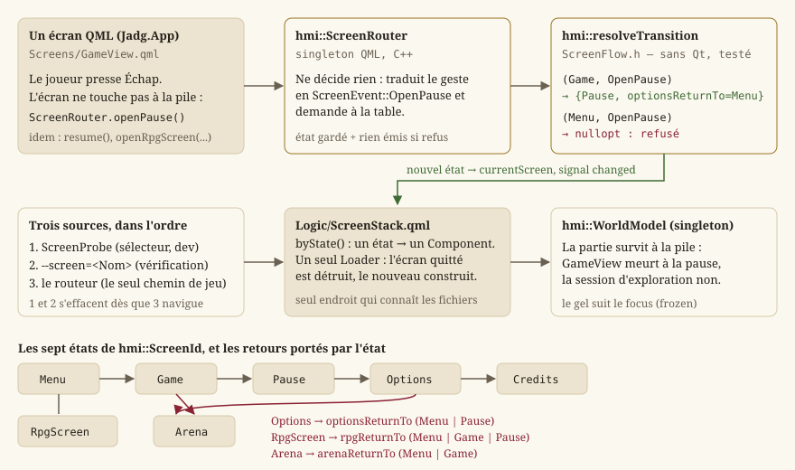
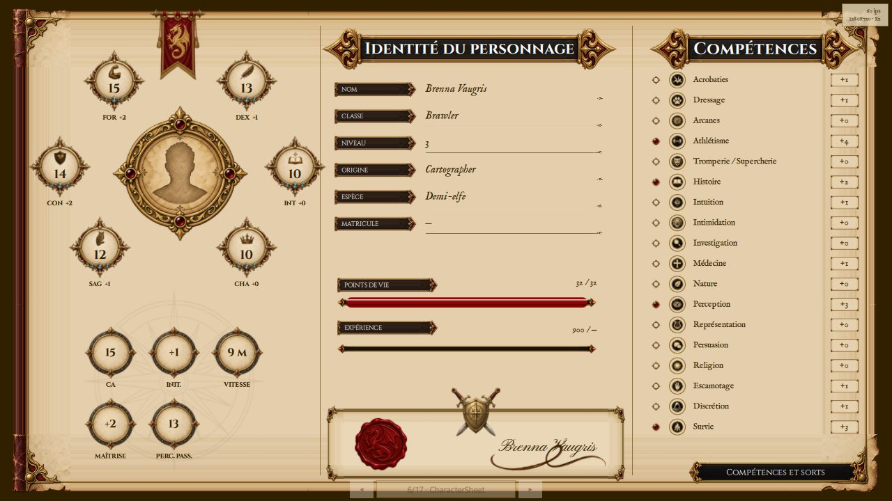

# Écrans, navigation et boucle de jeu

Cette page explique comment le jeu passe du menu à la carte, à la pause, aux options, aux écrans
du RPG ou au Colisée, et ce que la ligne de commande peut imposer à ce parcours. Les écrans sont
des fichiers QML ([IHM Qt — deux applications, deux technologies](guide-ihm-qt.md)) ; la **table
de transitions** qui décide où l'on peut aller est, elle, du C++ pur, testé sans fenêtre, que
`hmi::ScreenRouter` se contente d'appeler pour le compte du QML. L'éditeur de niveaux est un
binaire séparé ([Éditeur de niveaux](guide-editeur.md)) : aucun chemin du jeu n'y mène.

Périmètre de la page : `Source/HMI/Presentation/ScreenFlow.h` et `RpgScreens.h`,
`Source/HMI/Runtime/ScreenRouter.h`, `Source/HMI/Game/WorldPlay.h` et `LaunchOptions.h`, et les
fichiers de câblage `Source/App/Game/Qml/Main.qml`, `Logic/ScreenStack.qml`, `Logic/ScreenProbe.qml`.

## Ce qu'est une machine à états d'écrans

Un jeu n'affiche qu'**un** écran à la fois, et tous ne se joignent pas depuis partout : on ouvre
la pause depuis la carte, pas depuis le menu ; on revient des options là d'où on les a ouvertes.
La façon la plus sûre d'écrire cela est une **machine à états finis** : un ensemble d'états (les
écrans), un ensemble d'événements (ce que le joueur demande), et une **table** qui dit, pour chaque
couple état × événement, le nouvel état — ou rien, si le geste n'a pas de sens ici.

Le moteur sépare cette table de tout ce qui l'affiche : la table est une fonction pure, sans Qt ;
le routeur Qt l'appelle ; la **pile d'écrans** QML traduit l'état en fichier affiché. Trois
couches, trois responsabilités, et la première se teste sans ouvrir une fenêtre (`EX-NFR-010`).



## La machine à états : `hmi::ScreenFlow`

`Source/HMI/Presentation/ScreenFlow.h` porte la navigation comme une **table pure**, sans
dépendance Qt — même patron que `hmi::panelForTool` dans l'éditeur. Un seul point d'entrée :

- `hmi::resolveTransition(current, event)` — résout un `hmi::ScreenEvent` depuis l'état courant
  (`hmi::ScreenState`) vers le nouvel état, ou `std::nullopt` si la transition est **interdite**
  depuis cet écran. L'appelant garde alors son état inchangé : jamais de bascule silencieuse
  (`EX-GP-041`). La fonction est `noexcept` et ne lit que ses arguments.

`hmi::ScreenId` compte neuf états : `Menu`, `Game` (la carte qu'on parcourt), `Options`, `Pause`,
`Credits`, `RpgScreen` (l'un des écrans du RPG — fiche, inventaire, carte… —, dont
`RpgScreens.h` tient la liste), `Arena` (le Colisée, `LOT-50`), et les deux écrans de fin du
`LOT-119`, `Death` (l'écran de mort) et `DemoEnd` (« Fin de la démo »). L'arène est un écran de
premier niveau, comme `Game`, parce que c'est un **mode du jeu** et non un écran qui se consulte
pendant une partie ; les écrans de fin aussi, parce qu'ils **ferment** la partie.

`hmi::ScreenEvent` compte quinze événements : `OpenMenu`, `OpenGame`, `OpenOptions`,
`CloseOptions`, `OpenPause`, `ResumePause`, `QuitPauseToMenu`, `OpenCredits`, `CloseCredits`,
`OpenRpgScreen`, `CloseRpgScreen`, `OpenArena`, `CloseArena`, `OpenDeath`, `OpenDemoEnd`. Un seul `OpenRpgScreen` sert les
neuf écrans du RPG, et un seul `OpenOptions` sert le menu et la pause.

### La table, telle que le code l'écrit

| Depuis | Événement admis | Vers |
|---|---|---|
| `Menu` | `OpenGame`, `OpenOptions`, `OpenCredits`, `OpenRpgScreen`, `OpenArena`, `OpenMenu` | `Game`, `Options`, `Credits`, `RpgScreen`, `Arena`, `Menu` |
| `Game` | `OpenPause`, `OpenRpgScreen`, `OpenArena`, `OpenMenu`, `OpenDeath`, `OpenDemoEnd` | `Pause`, `RpgScreen`, `Arena`, `Menu`, `Death`, `DemoEnd` |
| `Pause` | `ResumePause`, `QuitPauseToMenu`, `OpenOptions`, `OpenRpgScreen` | `Game`, `Menu`, `Options`, `RpgScreen` |
| `Options` | `CloseOptions` | `optionsReturnTo` (`Menu` ou `Pause`) |
| `Credits` | `CloseCredits` | `Menu` |
| `RpgScreen` | `CloseRpgScreen`, `OpenDeath`, `OpenDemoEnd` | `rpgReturnTo` (`Menu`, `Game` ou `Pause`), `Death`, `DemoEnd` |
| `Arena` | `CloseArena`, `OpenMenu` | `arenaReturnTo` (`Menu` ou `Game`), `Menu` |
| `Death` | `OpenGame`, `OpenMenu` | `Game` (« Recommencer »), `Menu` |
| `DemoEnd` | `OpenCredits`, `OpenMenu` | `Credits`, `Menu` |

Tout ce qui n'est pas dans cette table est refusé. `OpenGame` depuis la pause, par exemple,
n'existe pas : reprendre est `ResumePause`, et cette distinction est ce qui permet de tester que
la reprise revient bien sur la **même** partie.

### La provenance est un attribut de l'état

`hmi::ScreenState` porte l'écran courant **et** trois retours : `optionsReturnTo` dit si
`CloseOptions` revient au menu ou à la pause, `rpgReturnTo` d'où un écran du RPG a été ouvert,
`arenaReturnTo` si le Colisée revient au menu ou à la carte (quand le héraut y envoie, `LOT-09`).
Jamais une variable « écran précédent » posée à côté de la machine : une telle variable devrait
être mise à jour par chaque appelant, et l'un d'eux finirait par l'oublier. Ici, la table écrit le
retour en même temps que l'état, et `operator==` sur la structure entière rend chaque transition
vérifiable d'une égalité.

Invariant : après toute transition, les retours non pertinents sont **remis** à `Menu` — un état
n'emporte jamais une provenance périmée d'un cycle précédent.

## Les écrans du RPG : `hmi::RpgScreens`

`Source/HMI/Presentation/RpgScreens.h` est le catalogue des écrans que le RPG consulte pendant
une partie (`LOT-68`, `EX-IHM-090`), logique pure comme `ScreenFlow`.

- `hmi::RpgScreenId` — les neuf écrans, dans l'ordre du **cycle** de navigation :
  `CharacterSheet`, `Skills`, `Inventory`, `QuestJournal`, `WorldMap`, `Dialogue`, `Merchant`,
  `Company`, `CombatHud`. `hmi::RPG_SCREEN_COUNT` vaut 9.
- `hmi::RpgSuperposition` — `PausesGame` (la simulation est suspendue tant que l'écran est ouvert)
  ou `WhileWalking` (on le consulte en marchant). La règle est portée par la **description** de
  l'écran, jamais par le code qui l'ouvre (`EX-IHM-091`) : une règle décidée à l'ouverture se
  contredirait d'un point d'appel à l'autre. Seuls la carte du monde et l'ATH de combat se lisent
  en marchant.
- `hmi::RpgBlockKind`, `hmi::RpgField`, `hmi::RpgContentBlock`, `hmi::RpgScreenLayout` — l'**ossature**
  d'un écran en données : deux colonnes de blocs, chaque bloc d'un des sept genres (`Fields`,
  `Grid`, `List`, `Prose`, `Portrait`, `Track`, `ActionBar`). Un `RpgField` associe une clé de
  libellé à un **identifiant de valeur** (`valueId`) — le contrat par lequel un écran se remplit :
  `hmi::characterSheetValues` produit une table indexée par ces identifiants, et un test vérifie
  qu'aucun des deux côtés n'en invente un que l'autre ignore.
- `hmi::RpgScreenDescriptor` — l'identité complète d'un écran : `objectName`, `titleKey`,
  `superposition`, `layout`.
- `hmi::rpgScreens()` — la table entière, dans l'ordre du cycle ; `hmi::rpgScreenDescriptor(id)`
  — une entrée.
- `hmi::nextRpgScreen(id)` / `hmi::previousRpgScreen(id)` — le cycle : du dernier on revient au
  premier. C'est ce qui permet d'atteindre n'importe quel écran depuis n'importe quel autre sans
  repasser par le menu (`EX-IHM-090`), au geste des gâchettes de la manette.
- `hmi::pausesGame(id)` — `true` si l'écran suspend la simulation.

Depuis le `LOT-86`, les écrans sont dessinés en QML (`Source/Ui/Screens/*Form.ui.qml`), et le
rendu générique par widgets que ce fichier décrivait n'existe plus. La table reste la **source de
vérité** de deux choses que le QML ne décide pas : quel écran suspend le jeu, et quels
identifiants de valeur un écran attend — ce que `hmi::CharacterSheetModel` publie, et ce que les
tests de `test_rpg_screens.cpp` contrôlent.



## Le routeur et la pile d'écrans

`hmi::ScreenRouter` (`Source/HMI/Runtime/ScreenRouter.h`) est un singleton QML. Il **ne décide
rien** : chaque méthode appelle `resolveTransition`, garde l'état courant si la transition est
refusée, et publie sinon `currentScreen` et `currentRpgScreen` par le signal `changed`. Rien n'est
émis pour un geste refusé : l'interface ne doit pas se rafraîchir pour ce que la table n'autorise
pas.

| Méthode `Q_INVOKABLE` | Événement joué | Remarque |
|---|---|---|
| `hmi::ScreenRouter::openMenu` | `OpenMenu` | |
| `hmi::ScreenRouter::openGame` | `OpenGame` | « Nouvelle partie » |
| `hmi::ScreenRouter::openOptions` / `closeOptions` | `OpenOptions` / `CloseOptions` | retour selon `optionsReturnTo` |
| `hmi::ScreenRouter::openPause` / `resume` / `quitToMenu` | `OpenPause` / `ResumePause` / `QuitPauseToMenu` | |
| `hmi::ScreenRouter::openCredits` / `closeCredits` | `OpenCredits` / `CloseCredits` | |
| `hmi::ScreenRouter::openArena` / `closeArena` | `OpenArena` / `CloseArena` | retour selon `arenaReturnTo` |
| `hmi::ScreenRouter::openDeath` | `OpenDeath` | le héros est tombé (`LOT-119`) |
| `hmi::ScreenRouter::openDemoEnd(ending)` | `OpenDemoEnd` | transporte la voie (`ending`, `endingText`) |
| `hmi::ScreenRouter::openRpgScreen(screen)` / `closeRpgScreen` | `OpenRpgScreen` / `CloseRpgScreen` | retient aussi **lequel** |
| `hmi::ScreenRouter::openDialogue(dialogueId)` | `OpenRpgScreen` sur `Dialogue` | transporte l'identifiant |
| `hmi::ScreenRouter::nextRpgScreen` / `previousRpgScreen` | aucun | change `currentRpgScreen` dans le cycle, sans repasser par la table |

Deux propriétés de plus : `dialogueId`, le dialogue que l'écran de dialogue doit jouer — c'est la
carte qui le nomme en ouvrant la conversation du PNJ visé (`LOT-09`), et l'écran n'a plus de
dialogue écrit en dur ; et `developerBuild`, constante, vraie dans un binaire de développement et
fausse dans un binaire livré. Les énumérations `ScreenRouter::Screen` et `ScreenRouter::RpgScreen`
reprennent `hmi::ScreenId` et `hmi::RpgScreenId`, exposées à QML par `Q_ENUM`.

Le routeur publie un **état**, jamais un nom de fichier : la correspondance entre état et écran
vit en QML, dans `Source/App/Game/Qml/Logic/ScreenStack.qml`. Chaque écran y est enveloppé dans
un `Component`, construit par un `Loader` seulement une fois choisi — les écrans ne vivent jamais
tous en même temps. Trois sources décident du composant, dans cet ordre : le sélecteur de
développement s'il a servi, puis `--screen=`, puis le routeur (`byState()`). Des composants typés
et non des chemins construits : un écran renommé fait échouer `qmllint`, pas le jeu.

Aucun écran ne bascule lui-même vers un autre en manipulant la pile : il appelle le routeur
(`ScreenRouter.openPause()` depuis la vue de jeu sur <kbd>Échap</kbd>, `ScreenRouter.resume()`
depuis la pause…), et la pile suit.


### Les outils de vérification, et pourquoi ils ne sont pas des chemins de jeu

`--screen=<Nom>` ouvre un écran directement, et `Logic/ScreenProbe.qml` fait de même en cours
d'exécution : deux boutons posés en bas de la fenêtre font défiler les dix-sept noms de
`ScreenStack.screenNames` (les quinze écrans, la galerie des briques `Gallery` et la galerie des
assets `AssetGallery`, qui ne sont pas des écrans du jeu). Ils existent parce que plusieurs écrans
sont dessinés mais pas encore alimentés — sans eux, ils ne seraient atteignables par aucun chemin
de jeu, et ne se vérifieraient donc pas.

Le sélecteur se lie à `ScreenRouter.developerBuild` et **n'existe pas** dans un binaire livré,
garanti par la construction ; et il **rend la main au routeur** dès que le jeu navigue de
lui-même (`Connections` sur `ScreenRouter.changed`). Sans cela, l'écran choisi restait épinglé :
<kbd>Échap</kbd> ne fermait plus rien, et la navigation aurait paru cassée par l'outil censé
permettre de la vérifier.

Le **menu de développement** (<kbd>F9</kbd>, `Tools/DevMenu.qml`) passe par le même sélecteur pour
ouvrir un écran, et y ajoute la carte, le combat, le gel et les journaux, en cours de partie. Tous
les outils de ce genre sont réunis dans [Outils de développement du
jeu](guide-outils-developpement.md).

## La vue de jeu et la session qui lui survit

`Screens/GameView.qml` pose la surface de rendu QRhi (`WorldViewport`, [Rendu 2D : de la scène à
l'écran](guide-rendu.md)) sur le singleton `hmi::WorldModel`, qui porte la **session
d'exploration** (`core::ExplorationSession`) à travers `hmi::WorldPlay`. La session est un
singleton précisément parce que la pile **détruit** la vue de jeu quand un autre écran la
remplace : une session possédée par l'écran mourrait avec lui, et l'on reviendrait de la pause, du
dialogue ou du sable sur une carte neuve, héros à la porte. `GameView` ne lance donc
`WorldModel.startNewGame()` que si aucune carte n'est chargée.

Le **gel** suit le focus : ce qui recouvre la vue de jeu (dialogue, Colisée, pause, écran du RPG)
lui prend le focus, et la vue relâche alors les directions tenues ; le dialogue pose en plus
`WorldModel.frozen`. Un seul chemin pour tous les écrans plutôt qu'un par écran. Quel écran du
RPG suspend la simulation est dit par `hmi::pausesGame`, pas par la table de transitions, qui ne
connaît pas ces écrans un par un.

### `hmi::WorldPlay` : la mise en scène partagée avec l'éditeur

`Source/HMI/Game/WorldPlay.h` réunit ce qu'il faut pour **parcourir** une carte et la **dessiner**,
sans Qt : une `core::ExplorationSession`, la table d'apparence du lieu (`hmi::PlaceAppearance`,
résolue par `hmi::PlaceAppearance::loadForPlace` le long de l'arborescence des lieux, `LOT-124` :
la carte nomme son lieu par un chemin, `central-empire/capital/arenarea/arena-of-fate`, et les
tables `appearance.json` rangées à côté des manifestes se lisent à chaque niveau —
`Regions/<chemin>/Scene`, le `Common/Scene` de la ville, celui de la région, puis le monde —, la
table **la plus propre** l'emportant pour chaque type de tuile ; une carte sans lieu se joue en
maquette, avec les seules figurines du monde) et les figurines qu'on pose dessus. Le jeu
(`hmi::WorldModel`) et l'essai immédiat de l'éditeur (`hmi::EditorViewport`, `EX-EDIT-055`) le
partagent : deux copies de cette mise en scène divergeraient au premier réglage, et l'essai
montrerait une carte que le jeu ne montre pas — exactement ce qu'un essai ne doit jamais faire.

- `hmi::WorldPlay::WorldPlay(loader, assetsDirectory)` — reçoit le chargeur de cartes
  (`core::WorldTravel::directoryLoader` en jeu ; en essai, un chargeur qui sert d'abord le
  brouillon) et le dossier des assets. Pas de `QObject`, pas d'horloge : chaque appelant garde
  sa cadence et ses signaux.
- `hmi::WorldPlay::enter(mapId, arrival)` — entre sur une carte au point d'arrivée nommé (vide :
  l'entrée de la carte), recharge la table d'apparence du lieu ; `false` si la carte ne s'ouvre
  pas, la session dit pourquoi.
- `hmi::WorldPlay::step(intent, seconds)` — un pas de simulation avec l'intention du joueur
  (`core::ExplorationIntent`) ; rend un `hmi::WorldPlayStep` : les événements de la session,
  `heroMoved` (la caméra suit) et `sceneChanged` (la scène doit être recomposée : carte changée,
  ou bande de figurine du héros basculée entre `idle` et `walk`).
- `hmi::WorldPlay::figures()` — les figurines de la carte courante, les PNJ puis le héros, qui
  passe devant ; `hmi::WorldPlay::snapshot()` — l'instantané en valeurs que
  `hmi::WorldSceneRenderer` dessine, vide hors carte ; `hmi::WorldPlay::diamondRatio()` — le
  rapport du losange isométrique du lieu.
- `hmi::WorldPlay::heroFigure()` / `setHeroFigure` — la figurine du héros
  (`WorldPlay::DEFAULT_HERO_FIGURE`, `Common/Characters/Heroes/brawler` : le Brawler pré-tiré,
  héros de la démo, `LOT-112`, tant que la création de personnage n'en nomme pas une autre) ;
  `hmi::WorldPlay::heroFacing()` — son orientation, `None` si sa figurine n'a pas de bandes
  orientées ; `hmi::WorldPlay::session()` — la session, en lecture ou en écriture.

## Pause

<kbd>Échap</kbd> sur la vue de jeu ouvre l'écran de pause (`Screens/Pause.qml`) : *Reprendre*,
*Options*, *Quitter vers le menu*. Clavier et pointeur pilotent le même `currentIndex` ;
<kbd>Échap</kbd> y reprend la partie. Les options ouvertes depuis la pause y reviennent
(`optionsReturnTo`), et reprendre ramène sur la carte là où on l'avait laissée — la session n'a
pas bougé (`EX-IHM-004`).


## Ce que la ligne de commande impose : `hmi::LaunchOptions`

`Source/HMI/Game/LaunchOptions.h` porte les deux moitiés de l'**essai complet** de l'éditeur
(`LOT-EDITOR-10`) : l'éditeur **écrit** la ligne de commande du jeu, le jeu la **relit**. Les
écrire chacune de son côté ferait diverger la virgule de `--at=` du point-virgule de `--levels=`
au premier ajout, et le défaut ne se verrait qu'à l'essai suivant. Sans Qt : les deux applications
n'ont en commun que `HmiLib`.

- `hmi::GameLaunchOptions` — la carte (`mapId`), le point d'arrivée (`arrival`), la case où poser
  le héros (`cell`), les drapeaux de monde posés avant le premier pas (`flags` : la carte après
  une quête, sans la jouer) et les dossiers de cartes, **dans l'ordre** (`levelDirectories`, le
  premier étant celui des brouillons).
- `hmi::gameLaunchArguments(options)` — la ligne de commande, sans le programme. Seul ce qui est
  renseigné paraît : une carte sans case ne produit pas de `--at=` vide, que le jeu aurait à
  distinguer d'une absence.
- `hmi::parseStartCell(value)` — la case de `--at=<colonne>,<ligne>`, ou `std::nullopt` si la
  valeur n'est pas deux entiers positifs séparés par une virgule : le jeu s'ouvre quand même, à
  l'entrée de la carte (`EX-NFR-040`).
- `hmi::parseWorldFlags(value)` — les drapeaux de `--flags=a,b,c`, dans l'ordre, sans les vides ni
  les doublons. Un élément peut s'écrire `drapeau=valeur` pour un drapeau à valeurs qu'une quête
  déclare (`LOT-116`) : la fonction le transporte tel quel, c'est `hmi::WorldModel::setStartFlags`
  qui sépare au `=` et passe par `core::WorldFlags::setValue` — une valeur refusée est journalisée,
  jamais fatale.
- `hmi::parseLevelDirectories(value)` — les dossiers de `--levels=<dossier>;<dossier>`. Le
  séparateur est `hmi::LAUNCH_PATH_SEPARATOR` (`;`) et non la virgule de
  `hmi::LAUNCH_LIST_SEPARATOR` : une virgule couperait un chemin qui en porte une, et le
  deux-points est pris par la lettre de lecteur sous Windows.

Côté jeu (`Source/App/Game/Main.cpp`), `--map=<carte>[@<arrivée>]` remplace la carte où
« Nouvelle partie » ouvre (`hmi::WorldModel::setStartOverride`), `--levels=` pose les brouillons
devant les cartes du binaire (`setLevelDirectories`, **avant** tout le reste : la session est
refaite), `--at=` et `--flags=` disent où et dans quel état (`setStartCell`, `setStartFlags`), et
`--hero-figure=<dossier>` remplace la figurine du héros (`hmi::WorldModel::setHeroFigure`, un
dossier depuis `Assets/`, comme `WorldPlay::DEFAULT_HERO_FIGURE`) — pour voir une figurine de
l'atelier marcher sans attendre la création de personnage. Le jeu s'ouvre alors sur l'écran que
le **routeur** désigne — pas un écran forcé —, si bien que dialogue, pause et Colisée fonctionnent
pendant l'essai. Ces options n'existent que dans un build de développement, et toutes
s'accrochent à `--map=` : sans carte imposée, aucune n'est lue. `--hero-figure=` n'a pas de champ
dans `hmi::GameLaunchOptions` : l'éditeur ne la passe pas, elle se tape à la main.

`--data=<racine>` (`LOT-118`) va plus loin que `--levels=` : le jeu lit **tout son contenu** —
cartes, assets, monde, dialogues, rencontres, créatures, libellés des cartes et des dialogues —
sous cette racine (`hmi::dataDirectory`), comme l'éditeur l'ouvre avec `LevelEditor --data`. Les
règles, les fiches et les traductions du jeu restent à côté de l'exécutable. C'est ainsi que se
joue la racine d'essai, et le combat sur la carte avec elle :

```
JustAnotherRpgGame.exe --data=Source/Test/Fixtures/GameData --map=donjon@sable --at=24,19
```

Le héros paraît devant le maître d'arène d'essai (24, 20), dans la zone « salle » ; `E` lui parle,
« Qu'on les lâche » engage les rats sur la carte.

L'écran « Carte » lit de même quatre options, en QML (`Screens/WorldMap.qml`, `LOT-96`) : ouvert
avec `--map-region=<région>`, il montre la région ; avec `--map-city=<lieu>` la ville, puis
`--map-district=<quartier>` le quartier et `--map-block=<îlot>` l'îlot — chaque niveau supposant le
précédent, et un identifiant inconnu arrêtant la descente là où elle est. C'est ce qui permet de
vérifier ou de capturer une vue sans la parcourir.

## Ce que le `LOT-67` a retiré

Ce guide décrivait, jusqu'au `LOT-67`, trois mécanismes de plus : un **écran de fin de niveau**,
une **sélection de niveau** et une **progression persistée** au tableau. Les trois supposaient une
séquence ordonnée de tableaux, que le jeu n'a pas — et ils ont été retirés avec elle, code,
écrans et exigences (`EX-LVL-010` à `EX-LVL-015`, `EX-IHM-005`, `EX-GP-030` à `EX-GP-032`,
consignées « retirées » dans leur spécification plutôt que supprimées ; `EX-GP-040`, `EX-IHM-003`
et `EX-IHM-004`, elles, sont **refondues** — elles avaient un objet au-delà du niveau discret).

Le passage d'une carte à l'autre est le **graphe de cartes** du `LOT-09` (`core::WorldGraph`,
`core::WorldTravel`, [Monde et exploration](guide-monde.md)). Ce qu'on retrouve en revenant sera
la **sauvegarde** du `LOT-150` (`0.0.3`), et « Continuer » reviendra au menu avec elle — pas avant : une
entrée de menu qui ne mène nulle part coûte plus de confiance qu'elle n'apporte d'information
(`EX-IHM-072`). C'est pourquoi « Continuer » et « Charger une partie » sont grisées sur la capture
du menu.

## Où ça s'insère dans la boucle

L'**event loop Qt** (`QGuiApplication::exec`) possède la navigation. La simulation de la carte
avance à **pas fixe** dans `hmi::WorldModel` : un `QTimer` précis de
`WorldModel::STEP_MILLISECONDS` (16 ms) appelle le pas, qui transmet l'intention courante
(direction tenue, interaction demandée) à `hmi::WorldPlay::step` avec une durée constante — jamais
le temps réel écoulé. Le déplacement est un **état de touches**, pas une suite de pas : traduire
chaque `onPressed` en un pas ferait dépendre la vitesse du taux de répétition du clavier. Le
rendu, lui, est cadencé par le graphe de scène Qt Quick ; le détail est dans [IHM Qt — deux
applications, deux technologies](guide-ihm-qt.md) et [Boucle de jeu et pas de temps
fixe](guide-boucle.md).

## Voir aussi

- `hmi::ScreenRouter`, `hmi::WorldModel`, `hmi::WorldPlay`, `hmi::GameLaunchOptions`.
- `hmi::ScreenId`, `hmi::ScreenEvent`, `hmi::ScreenState`, `hmi::resolveTransition`,
  `hmi::RpgScreenId`, `hmi::RpgScreenDescriptor`, `hmi::pausesGame`.
- [IHM Qt — deux applications, deux technologies](guide-ihm-qt.md) — le socle Qt Quick : modules
  QML, vues-modèles, surface de rendu QRhi.
- [Entrées et actions logiques](guide-entrees.md) — le clavier et la manette dans les écrans.
- [Monde et exploration](guide-monde.md) — la session d'exploration, les portails, les dialogues.
- [Outils de développement du jeu](guide-outils-developpement.md) — le menu <kbd>F9</kbd>, le
  sélecteur, toutes les options de la ligne de commande en une table.
- [Éditeur de niveaux](guide-editeur.md) — l'essai immédiat et l'essai complet, qui réutilisent
  `hmi::WorldPlay` et `hmi::LaunchOptions`.
- [Boucle de jeu et pas de temps fixe](guide-boucle.md) — le pas fixe.
- [Spécification IHM](../Specification/interface-ihm.md), [Gameplay](../Specification/gameplay.md)
  — le *quoi* et le *pourquoi* (`EX-GP-041`, `EX-IHM-090`, `EX-IHM-091`).
