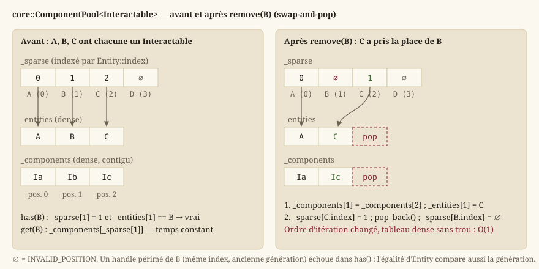

# ECS : entités, composants, systèmes

Cette page explique le patron d'architecture **Entity-Component-System**
([ECS](https://en.wikipedia.org/wiki/Entity_component_system) ⧉) depuis ses principes, puis détaille
l'implémentation maison de `Source/Core/Ecs` : le handle d'entité, le gestionnaire de cycle de vie,
le stockage en *sparse set*, les vues, la façade `World`, et les cinq composants que le moteur
définit — y compris le clip d'animation, qui est une donnée et non une logique.

## Le problème que l'ECS résout

Dans un moteur orienté objet « classique », on modéliserait naturellement un personnage par une
classe `Character` héritant de `GameObject`, avec des méthodes comme `update()`, `render()`,
`takeDamage()`. Très vite, ce modèle par héritage devient un obstacle dans un jeu :

- un PNJ a besoin d'une position, d'un visuel, d'une fiche de personnage et d'être sollicitable ;
  un coffre a besoin d'une position, d'un visuel et d'être sollicitable, mais pas de fiche ; un
  décor animé n'a besoin que d'une position et d'un visuel. L'héritage simple ne capture pas ces
  combinaisons : on finit avec une hiérarchie de classes profonde, ou des interfaces vides à
  implémenter « pour la forme » ;
- ajouter un comportement à une seule sorte d'objet (par exemple, rendre les coffres
  destructibles) oblige à modifier une classe existante ou à multiplier les sous-classes ;
- itérer sur « tous les objets sollicitables » demande de parcourir des objets hétérogènes en
  testant leur type dynamiquement, ce qui est lent et fragile.

L'ECS répond en **séparant radicalement** trois notions que l'orienté objet mélange dans une seule
classe :

- **Entité** : juste un **identifiant**. Aucune donnée, aucun comportement — un numéro qui désigne
  « une chose qui existe dans le monde ».
- **Composant** : une **donnée pure**, sans aucune méthode de logique (`EX-ARCH-011`) — par exemple
  une position (`core::Transform`), un visuel (`core::Sprite`), un état d'animation
  (`core::Animation`), une cible d'interaction (`core::Interactable`) ou le lien vers une fiche de
  personnage (`core::RpgActor`). Un composant répond à la question « **quelle donnée** ? », jamais
  « que fait cette donnée ? ».
- **Système** : la **logique**, qui parcourt toutes les entités possédant un certain ensemble de
  composants et les fait évoluer — par exemple une logique qui désigne, parmi les entités
  `Interactable`, celle que le personnage vise.

Un PNJ n'est alors qu'une entité qui **possède** les composants `Transform`, `Sprite`,
`Interactable` et `RpgActor` — une **combinaison** de données, pas une classe dédiée. Un coffre est
une entité avec `Transform`, `Sprite` et `Interactable`, mais sans `RpgActor`. Ajouter un
comportement à un sous-ensemble d'entités revient à écrire un nouveau système qui parcourt les
composants pertinents, sans toucher au reste. La règle d'or à retenir : **les données vivent dans
les composants, la logique vit dans les systèmes** ; un composant ne contient jamais de
comportement, un système ne stocke jamais d'état de jeu à demeure (il le lit/écrit dans les
composants, qui restent la seule source de vérité).

## L'entité : `core::Entity`

Une entité (`core::Entity`) est un **handle générationnel** : une paire `{index, generation}`, deux
entiers 32 bits non signés (`core::Entity::Index`, `core::Entity::Generation`).

- `index` est la position de l'entité dans les tableaux internes — c'est ce qui permet un accès en
  temps constant.
- `generation` est un compteur qui protège contre un piège classique : quand une entité est
  détruite, son `index` est **recyclé** (réutilisé pour une future entité, plutôt que de croître
  indéfiniment). Sans précaution, un ancien handle vers l'entité détruite désignerait alors, par
  accident, la **nouvelle** entité qui a récupéré le même `index` — un bug silencieux et difficile à
  diagnostiquer, où du code croit encore manipuler l'ancien personnage. En incrémentant
  `generation` à chaque recyclage d'`index`, un handle périmé (ancienne génération) ne correspond
  **plus** à l'entité courante (nouvelle génération) : la comparaison `operator==` compare les deux
  champs, donc `has()`/`getComponent()` rejettent proprement un handle obsolète au lieu de renvoyer
  les données d'une entité sans rapport.

Deux valeurs conventionnelles complètent le type : `core::Entity::INVALID_INDEX` (tous les bits à
1) est l'index qu'aucune entité vivante ne porte, et `core::INVALID_ENTITY` est le handle
`{INVALID_INDEX, 0}` — ce qu'une fonction renvoie pour dire « aucune entité », plutôt qu'un
`std::optional<Entity>` qui alourdirait chaque comparaison. Un `Entity` construit par défaut vaut
`INVALID_ENTITY`.

Une entité, à elle seule, ne « fait » rien : elle ne devient un personnage, un décor ou un
coffre que par les composants qu'on lui attache.

## Le cycle de vie : `core::EntityManager`

`core::EntityManager` est la classe qui **crée, détruit et valide** les handles. Le `World` la
possède et la cache : le code applicatif ne l'appelle jamais directement, mais comprendre ce
qu'elle garantit explique le comportement de `World::createEntity` et `World::destroyEntity`.

Elle tient trois tableaux, tous indexés par `Entity::index` : la **génération courante** de chaque
index, un **drapeau de vie** par index, et une **liste libre** des index rendus par une destruction.

- `core::EntityManager::create` — renvoie un handle **vivant**, distinct de toute entité vivante.
  S'il existe un index dans la liste libre, il est repris avec la génération qui lui a été
  attribuée à sa libération ; sinon un nouvel index est ouvert en fin de tableau. Temps constant
  amorti, aucune allocation par entité.
- `core::EntityManager::destroy` — marque l'index mort, **incrémente sa génération** et le pousse
  dans la liste libre. Sans effet si le handle n'est pas vivant (déjà détruit, ou périmé) : détruire
  deux fois n'est pas une erreur, et un handle périmé ne peut pas tuer par accident l'entité qui
  a repris son index.
- `core::EntityManager::isAlive` — vrai si l'index est marqué vivant **et** que la génération du
  handle est la génération courante. C'est le test que tout accès aux composants fait en amont.
- `core::EntityManager::aliveCount` — le nombre d'entités vivantes, tenu à jour à chaque création et
  destruction ; utile aux tests et aux diagnostics, jamais parcouru.

**Pourquoi une liste libre.** Sans recyclage, chaque entité créée pendant une partie (un projectile,
un PNJ d'une carte quittée) laisserait un index derrière elle et les tableaux — ceux du gestionnaire
comme le tableau creux de chaque pool — grandiraient sans borne. Le recyclage borne la mémoire au
nombre **maximal d'entités simultanées**, et la génération rend ce recyclage sûr.

## Le `core::World`

`core::World` est le point d'entrée unique de la simulation : il possède les entités (par son
`EntityManager`), les composants (une pool par type) et les systèmes. Il **possède** toutes ses
ressources (RAII) : aucun état global, aucune connaissance du rendu — la dépendance `HMI → Core`
reste à sens unique (`EX-ARCH-010`).

- `core::World::createEntity` / `core::World::destroyEntity` — cycle de vie d'une entité ; la
  destruction retire automatiquement **tous** ses composants, dans **toutes** les pools (voir
  `IComponentPool` ci-dessous, qui existe précisément pour rendre cela possible sans connaître
  chaque type de composant à l'avance), puis rend l'index au gestionnaire. Sans effet sur une
  entité qui n'est pas vivante.
- `core::World::isAlive` — délègue à `EntityManager::isAlive`.
- `core::World::addComponent` — attache une **copie** de la valeur à l'entité. Précondition,
  vérifiée par `JADG_ASSERT` : l'entité est vivante et n'a pas encore ce type de composant.
- `core::World::hasComponent` — vrai si une pool de ce type existe **et** contient l'entité ; ne
  crée jamais de pool (la fonction est `const`), ce qui la rend sans effet de bord même pour un
  type jamais vu.
- `core::World::getComponent` — référence en lecture-écriture sur le composant ; précondition
  `hasComponent`. La référence n'est valable que jusqu'au prochain `addComponent` ou
  `removeComponent` du même type (voir le *swap-and-pop*).
- `core::World::removeComponent` — retire le composant d'un type d'une entité ; précondition
  `hasComponent`.
- `core::World::view` — une **vue** sur les entités possédant **tous** les composants listés
  (détail ci-dessous).
- `core::World::addSystem`, `core::World::update`, `core::World::systemCount` — l'orchestration
  des systèmes, en dernière section.

Chaque type de composant obtient sa propre pool, créée **à la demande** au premier
`addComponent<T>` (ou au premier `view<…, T, …>`) : le `World` ne connaît pas à l'avance la liste
des types de composants qui existeront, il les découvre à l'usage, avec `std::type_index` comme
clé d'un `unordered_map`. Ce choix évite toute liste centrale de types à tenir à jour — ajouter un
composant, c'est déclarer une `struct`, rien d'autre.

## Le stockage : sparse set (`core::ComponentPool`)

Le besoin est double et a priori contradictoire :

- **itérer vite** sur tous les composants d'un type (par exemple, tous les `Transform`), ce qui
  demande un tableau **contigu** en mémoire (pas de trous) pour profiter du cache du processeur ;
- **accéder vite** au composant d'une entité précise (« quel est le `Transform` de l'entité 42 ? »),
  ce qui demande normalement un tableau indexé directement par `index`, quitte à laisser des trous
  pour les entités qui n'ont pas ce composant.

Le [sparse set](https://research.swtch.com/sparse) ⧉ concilie les deux avec **deux tableaux** :

- un tableau **dense** (`_components`) : les composants, **sans aucun trou**, dans l'ordre où ils
  ont été ajoutés — c'est lui que les systèmes parcourent ; un tableau `_entities` parallèle retient
  quelle entité possède chaque composant dense ;
- un tableau **creux** (`_sparse`), indexé directement par `Entity::index` : pour chaque entité
  potentielle, il donne la **position** de son composant dans le tableau dense (ou une valeur
  sentinelle `core::ComponentPool::INVALID_POSITION` si elle n'a pas ce composant). Ce tableau peut
  avoir des trous — peu importe, on n'itère jamais dessus, on ne fait que le lire à un index précis.



### L'interface type-effacée : `core::IComponentPool`

Le `World` range des pools de types **différents** dans un même conteneur. Il lui faut donc une
interface commune, sans paramètre de type : `core::IComponentPool`, qui ne déclare qu'une
opération, `core::IComponentPool::removeIfPresent(entity)` — « retire le composant de cette entité
s'il y en a un, et dis-moi si tu l'as fait ». C'est la seule chose que le `World` a besoin de faire
sans connaître le type : quand une entité meurt, il appelle `removeIfPresent` sur **chaque** pool.
Tout le reste (ajout, accès, itération) passe par la pool typée, retrouvée par `std::type_index`.

### L'API de `core::ComponentPool<T>`

| Fonction | Rôle | Précondition et coût |
|---|---|---|
| `core::ComponentPool::add(entity, component)` | Copie le composant en fin de tableau dense et enregistre sa position dans le tableau creux, agrandi si l'index dépasse sa taille. | L'entité n'a pas ce composant (`JADG_ASSERT`). O(1) amorti. |
| `core::ComponentPool::remove(entity)` | *Swap-and-pop*, ci-dessous. | L'entité a ce composant. O(1). |
| `core::ComponentPool::removeIfPresent(entity)` | `remove` sans précondition ; renvoie `false` si l'entité n'avait rien. | Aucune. O(1). |
| `core::ComponentPool::has(entity)` | Index dans les bornes du creux, position valide, **et** entité stockée égale (génération comprise). | Aucune. O(1). |
| `core::ComponentPool::get(entity)` | Référence (mutable ou constante) sur le composant, par le creux. | `has(entity)`. O(1). |
| `core::ComponentPool::size`, `core::ComponentPool::empty` | Taille du tableau dense — c'est ce que la vue compare pour choisir sa pool pilote. | — |
| `core::ComponentPool::entities`, `core::ComponentPool::components` | Les deux tableaux denses, en lecture seule, dans le même ordre : `entities()[i]` possède `components()[i]`. | — |

`has()` teste l'égalité **complète** du handle stocké et non seulement la validité de la position :
c'est là que la génération joue. Un handle périmé a le même index qu'une entité vivante qui a peut-
être ce composant ; la position lue dans le creux serait valide, mais l'entité stockée à cette
position a une autre génération, donc `has()` répond `false`.

### Ajout et suppression : *swap-and-pop*

`add(entity, component)` ajoute simplement en fin de tableau dense et enregistre sa position dans
le tableau creux — coût **O(1)**.

`remove(entity)` est plus subtil : retirer un élément **au milieu** d'un tableau dense en décalant
tout ce qui suit coûterait **O(n)**. La technique du ***swap-and-pop*** l'évite :

1. on repère la position `removed` du composant à retirer dans le tableau dense ;
2. on **écrase** cette position avec le **dernier** élément du tableau (`_components[removed] =
   _components[last]`), pour l'entité et le composant ;
3. on met à jour le tableau creux de l'entité **déplacée** (celle qui était en dernière position)
   pour qu'il pointe désormais vers `removed` ;
4. on retranche le dernier élément (`pop_back`) — devenu un doublon — et on marque l'entité retirée
   `INVALID_POSITION` dans le creux.

Résultat : le tableau dense reste **sans trou** en coût **O(1)**, au prix de changer l'**ordre**
d'itération (l'élément déplacé change de position). Comme les systèmes ne dépendent jamais de cet
ordre, ce n'est jamais un problème.

### Exemple pas à pas

Imaginons trois entités `A`, `B`, `C` ayant chacune un composant `Interactable`, dans cet ordre
d'insertion : dense = `[Ia, Ib, Ic]`, entités = `[A, B, C]`. On retire le composant de `B`
(position 1) :

1. `removed = 1`, `last = 2` ;
2. `_components[1] = _components[2]` → dense devient `[Ia, Ic, Ic]` ; `_entities[1] = C` ;
3. le tableau creux de `C` est mis à jour : il pointe maintenant vers la position 1 ;
4. `pop_back()` → dense final = `[Ia, Ic]`, entités = `[A, C]`.

`C` a « pris la place » de `B` dans le tableau dense — l'itération reste dense et rapide, et
`get(C)` continue de fonctionner grâce au tableau creux mis à jour.

> **Attention** — Conséquence pour qui écrit un système : une référence obtenue par `get()` (ou
> dans une vue) est invalidée par tout `add()` ou `remove()` **ultérieur sur la même pool** (le
> tableau dense peut réallouer ou déplacer ses éléments). Ne jamais conserver une telle référence
> au-delà de telles opérations.

## Les vues : `core::View`

Un système a typiquement besoin d'itérer sur « toutes les entités qui ont **à la fois** tel et tel
composant » (par exemple `Transform` **et** `Interactable` pour les objets sollicitables posés sur
la carte). `World::view<A, B, …>()` construit une `core::View` qui **joint** les pools demandées et
n'expose que l'**intersection** — les entités présentes dans **toutes**. Les types demandés sont
supposés **distincts** : `view<Transform, Transform>` n'a pas de sens et n'est pas défendu.

Pour rester efficace, la vue ne parcourt pas la pool la plus grande en testant les autres : elle
choisit comme « pilote » la **plus petite** des pools demandées (celle avec le moins de composants,
comparées par `size()`) et ne teste l'appartenance aux autres pools que pour les entités de ce
pilote. Le coût de l'itération est ainsi borné par la **plus petite** population parmi les types
demandés, jamais par la plus grande — l'intersection ne peut de toute façon pas être plus grande
que son plus petit opérande. Le choix est refait à chaque parcours : une vue n'a pas d'état, elle
ne tient que des pointeurs sur les pools.

Deux syntaxes équivalentes :

```cpp
for (auto [entity, transform, sprite] : world.view<Transform, Sprite>()) {
    transform.scale = {2.0f, 2.0f};
}

// équivalent, forme fonctionnelle :
world.view<Transform, Sprite>().each(
    [](core::Entity, core::Transform& t, core::Sprite&) { t.scale = {2.0f, 2.0f}; });
```

- `core::View::each(function)` — appelle `function(entity, composants&...)` pour chaque entité
  retenue. C'est la forme la plus directe et la moins coûteuse.
- `core::View::begin` / `core::View::end` — renvoient un `core::View::Iterator`, un itérateur
  avant qui, déréférencé, donne un `std::tuple<Entity, Components&...>` — d'où la liaison
  structurée `auto [entity, a, b]`. L'itérateur avance dans le tableau pilote et **saute** les
  entités absentes d'une autre pool (`skipToMatch`) ; sa construction se positionne déjà sur la
  première entité valide, si bien qu'une vue vide donne `begin() == end()` sans détour.

C'est **exactement** le motif d'un système : une vue, une lambda, la logique de mise à jour.

> **Attention** — Contrat d'itération : à l'intérieur d'un `each` ou d'une boucle sur une vue, on
> ne modifie que la **valeur** des composants obtenus. Ajouter/retirer un composant ou détruire une
> entité **pendant** l'itération invaliderait la vue (les pools sous-jacentes peuvent bouger, cf.
> *swap-and-pop* ci-dessus) — ce type de modification structurelle doit être différé après
> l'itération.

## Les systèmes et l'ordre d'exécution

`core::ISystem` est l'interface d'un système : une seule méthode,
`core::ISystem::update(world, fixedDelta)`, qui reçoit le monde (pour y ouvrir des vues) et la durée
du pas — **constante**, jamais le temps réel ([Boucle de jeu et pas de temps fixe](guide-boucle.md)).
Un système ne détient aucun état de simulation : tout ce qu'il calcule s'écrit dans des composants.

`core::World::addSystem(std::unique_ptr<ISystem>)` enregistre un système, dont le `World` prend
possession ; `core::World::update(fixedDelta)` exécute **tous** les systèmes enregistrés, **dans
l'ordre d'enregistrement**, une fois par pas de temps fixe ; `core::World::systemCount` en donne le
nombre. Cet ordre est significatif et fait partie du contrat de déterminisme (`EX-NFR-002`,
`EX-ARCH-030`) : deux systèmes qui lisent et écrivent les mêmes composants doivent s'exécuter dans
un ordre stable pour produire toujours le même résultat.

Aucun système n'est enregistré aujourd'hui : le mécanisme est en place, mais la logique qui
existe n'en a pas eu besoin. Le monde se peuple par `core::spawnMapEntities`, qui crée **une
entité par entité de carte** (`core::MapEntity`, [Niveaux : modèle, couches, entités, chargement](guide-niveaux.md))
— un `Transform` à sa case, et un `Interactable` si son type figure dans
`core::knownInteractableKinds` (coffre, panneau, PNJ…). Une logique qui a besoin de données que
l'`ISystem` générique ne transporte pas (la grille de la carte, l'orientation du personnage, les
drapeaux de monde) prend alors la forme d'une **fonction libre** à signature dédiée, comme
`core::findInteractionTarget`. Le principe reste identique : la logique lit des composants et n'en
garde aucun état.

## Les composants du moteur

Cinq composants vivent dans `Source/Core/Ecs/Components`. Tous sont des agrégats sans logique
(`EX-ARCH-011`) ; les deux fonctions membres qui existent (`isConsumable`, `hasSheet`) sont des
lectures d'un champ, pas des comportements.

### `core::Transform` — où, à quelle échelle, dans quel sens

| Champ | Défaut | Sens |
|---|---|---|
| `position` (`core::Vector2`) | `(0, 0)` | Position du repère de l'entité en **unités monde** — une case = une unité, origine haut-gauche, Y vers le bas (`EX-ARCH-020`). |
| `scale` | `(1, 1)` | Facteurs d'échelle horizontal et vertical ; 1 = taille nominale. |
| `rotation` | `0` | En **radians**, la convention native de `std::sin`/`std::cos` ([Mathématiques du moteur](guide-maths.md)). |

### `core::Sprite` — quoi dessiner

Un `Sprite` dit **quelle région d'un atlas** dessiner, dans quelle couche et avec quelle teinte —
et rien de plus : aucune ressource GPU, aucun chemin de fichier (`EX-ARCH-012`). Deux types
auxiliaires l'accompagnent :

- `core::AtlasRegion` — un rectangle `x, y, width, height` en **pixels de texture**, origine
  haut-gauche. En pixels et non en coordonnées normalisées `[0, 1]`, parce que `Core` ne connaît
  pas la taille de l'atlas : la normalisation est l'affaire du rendu, qui la connaît.
- `core::Color` — quatre `float` `r, g, b, a` dans `[0, 1]`, blanc opaque par défaut : la teinte
  neutre, qui laisse la texture inchangée.

`core::Sprite::layer` est un entier : une valeur plus grande se dessine **au-dessus**. La taille à
l'écran ne figure pas ici — elle découle du `Transform` et de l'échelle du rendu
([Rendu 2D : de la scène à l'écran](guide-rendu.md)).

### `core::Animation`, `core::AnimationClip` et `core::ClipSet` — l'animation comme donnée

Un moteur animé a besoin de savoir, pour chaque entité animée, **quelle image** montrer maintenant.
Le moteur sépare la **description** d'une animation (une suite d'images et leur durée : le clip) de
l'**état** d'une entité dans cette animation (le composant).

`core::AnimationClip` est un clip : un `name` (unique dans son jeu : « idle », « opening »), la
suite `frames` des indices d'images dans la spritesheet, la `frameDuration` en secondes (`0`, ou une
seule image : pose figée, jamais animée), et sa fin — `core::ClipEndMode::Loop` revient à la
première image (`EX-REN-012`) ; `core::ClipEndMode::OneShot` s'arrête à la dernière et bascule sur
le clip nommé par `nextClip` (vide ou inconnu : on reste sur la dernière image, jamais une erreur).
C'est une **donnée pure** : ni spritesheet, ni taille d'image, ni fichier — la traduction en région
de texture appartient à `HMI`. Un `enum` figé des clips aurait fait de `Core` un catalogue
d'apparences à modifier à chaque objet animé (`EX-ARCH-012`) ; une `struct` chargée depuis un
fichier `nom-asset.anim.json` ne le demande pas.

`core::ClipSet` est un jeu de clips nommés — l'unité que décrit un fichier `.anim.json` :

- `core::ClipSet::addClip` — ajoute un clip ; un clip du même nom qu'un clip présent le remplace ;
- `core::ClipSet::indexOf(name)` — l'index du clip, ou `-1` s'il n'existe pas. Le nom se résout en
  index **une fois**, à la sélection ; la progression au pas fixe ne compare jamais de chaîne,
  même pour des centaines de tuiles animées ;
- `core::ClipSet::clipCount` ;
- `core::ClipSet::clipAt(index)` — accès **sûr** (`EX-NFR-040`) : un index hors bornes retombe sur
  le premier clip, et un jeu **vide** rend un clip par défaut (nom vide, une image d'indice 0,
  figé). L'appelant peut toujours lire un clip sans avoir vérifié `clipCount()`.

`core::Animation` est le composant d'état : `clips`, un `std::shared_ptr<const ClipSet>` (partagé
et **immuable** : toutes les tuiles d'eau d'une carte pointent le même jeu sans le dupliquer ;
`nullptr` = aucun jeu, cas que tout lecteur tolère), `clipIndex` (déjà résolu par `indexOf`),
`frameIndex` (dans le clip, borné à `frames`) et `elapsed` (secondes écoulées depuis le passage à
cette image). Le clip courant est une **projection** de l'état de simulation — l'action en cours
d'un combattant —, jamais une source de vérité supplémentaire.

> **Note** — Les commentaires du code nomment un `AnimationSystem` : il n'existe pas dans `Core`
> aujourd'hui. Ce qui fait avancer une animation vit dans `HMI`, au temps réel du rendu
> (`hmi::CombatCueTrack` pour les bandes que les figurines rejouent en combat,
> `hmi::AnimationCatalog` pour la traduction en région de texture). Le composant et le clip, eux, restent dans `Core` pour le jour
> où une animation devra suivre le pas fixe.

### `core::Interactable` — ce qu'on peut solliciter

Marque une entité comme **cible d'interaction** et porte de quoi la désigner, sans dire ce que
l'interaction **fait** : un coffre, un panneau et un PNJ portent le même composant et se
distinguent par leur `type`, chaîne libre que le gameplay interprète — la même règle que
`core::MapEntity`, reprise ici pour qu'aucune énumération fermée n'oblige chaque lot suivant à
modifier ce fichier.

| Champ | Sens |
|---|---|
| `type` | `"chest"`, `"sign"`, `"npc"`, `"portal"`… |
| `position` (`core::GridPosition`) | La **case** de l'entité, en plus du `Transform` : l'interaction raisonne en cases (« la case devant le personnage »), et la retrouver depuis une position flottante demanderait une division dont l'arrondi déciderait du résultat aux frontières. |
| `consumedFlag` | Clé du drapeau de monde qui dit si l'interaction a **déjà eu lieu** ; vide pour ce qu'on sollicite indéfiniment (panneau, PNJ), renseignée pour ce qui ne se prend qu'une fois (coffre). Fabriquée par `core::keyForEntity`. |
| `promptKey` | Clé de localisation de l'invite affichée à portée — une **clé**, jamais un texte : `Core` n'écrit pas de français. Vide si rien n'est annoncé. |

`core::Interactable::isConsumable` vaut `!consumedFlag.empty()`.

### `core::RpgActor` — le lien vers une fiche

Relie une entité à sa fiche de personnage par un **indice** dans le registre du monde
(`sheetIndex`), et non par la fiche elle-même. La raison de taille (une fiche porte des chaînes et
des ensembles que le système de déplacement ne lit jamais) compte moins que celle-ci : **une fiche
n'appartient pas à une entité**. Un personnage garde la sienne quand il change de carte et que son
entité est détruite puis recréée (`LOT-09`) ; loger la fiche dans le composant lierait la vie de
l'une à celle de l'autre.

`core::RpgActor::INDICE_ABSENT` distingue une entité **sans fiche** (un décor animé) d'une entité
dont la fiche serait la première du registre — les confondre ferait attaquer un tonneau avec les
caractéristiques du héros. `core::RpgActor::hasSheet` teste cette sentinelle.

## Journaliser dans l'ECS

`Core/Ecs/EcsLog.h` fournit `ECS_LOG_TRACE`, `ECS_LOG_INFO`, `ECS_LOG_WARNING` et `ECS_LOG_ERROR`,
la catégorie `"Ecs"` du journal ([Journalisation et assertions](guide-journalisation.md)). L'ECS
s'exécute à chaque pas : ces macros se réservent aux événements rares (enregistrement d'un système,
mise en place d'un monde), jamais à une opération par entité ou par pas. Les préconditions, elles,
sont des `JADG_ASSERT` : une violation est un bug, pas un événement à consigner.

## Voir aussi
- `core::World`, `core::Entity`, `core::INVALID_ENTITY`, `core::EntityManager`,
  `core::IComponentPool`, `core::ComponentPool`, `core::View`.
- `core::ISystem`, `core::spawnMapEntities`, `core::findInteractionTarget`.
- `core::Transform`, `core::Sprite`, `core::AtlasRegion`, `core::Color`, `core::Animation`,
  `core::AnimationClip`, `core::ClipSet`, `core::Interactable`, `core::RpgActor`.
- [Mathématiques du moteur](guide-maths.md) (les types de données des composants), [Niveaux : modèle, couches, entités, chargement](guide-niveaux.md) (les entités de carte dont naissent les entités de l'ECS).
- [Boucle de jeu et pas de temps fixe](guide-boucle.md) — le pas que `World::update` reçoit.
- [`architecture.md`](../Specification/architecture.md) — les exigences d'architecture (`EX-ARCH-010`, `EX-ARCH-011`, `EX-ARCH-012`).
