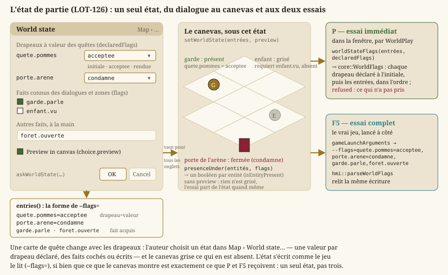
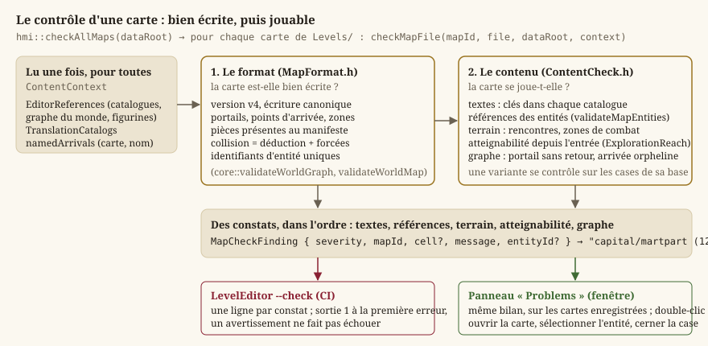
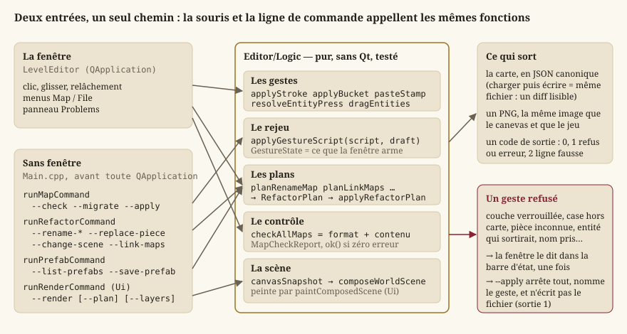
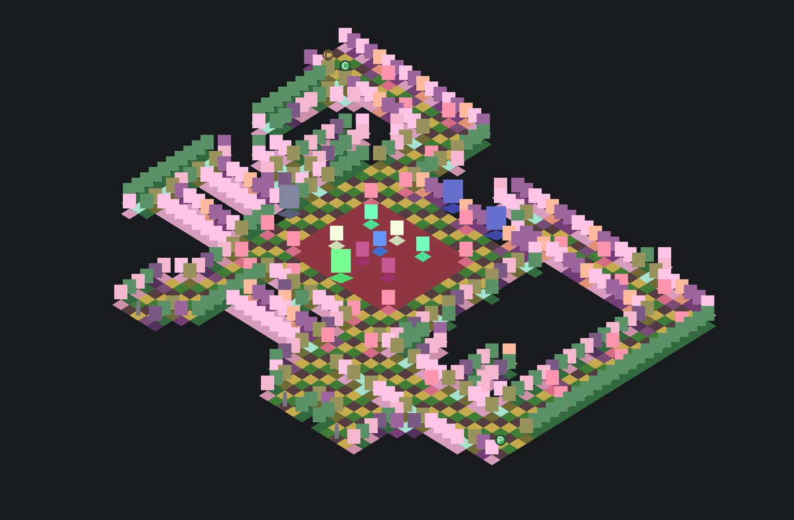
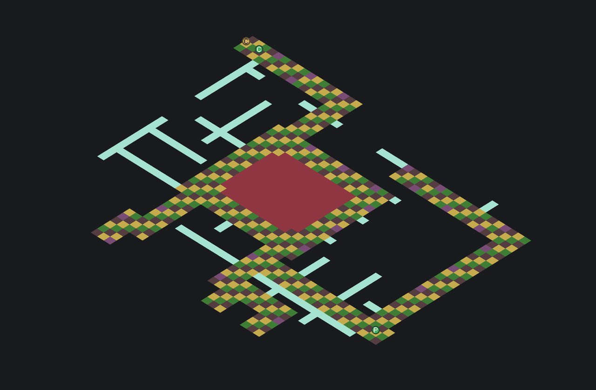
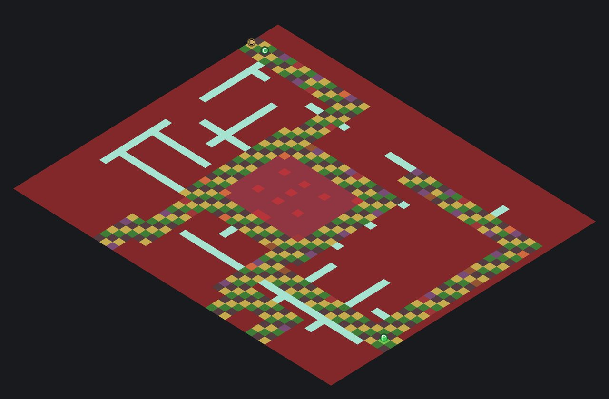
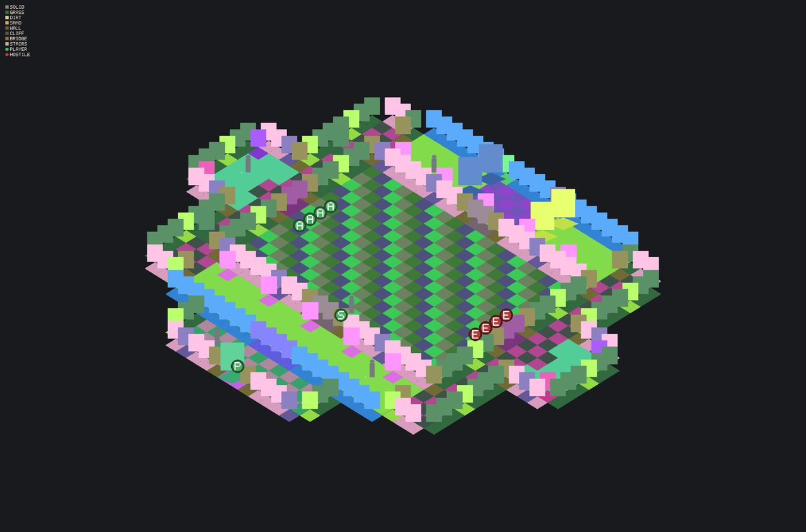

# Éditeur de niveaux

> **Binaire séparé depuis le `LOT-86`** (`LevelEditor`), **module à part depuis le
> `LOT-EDITOR-01`** (`Source/Editor`). Il n'héberge aucun écran du jeu, qui vit en Qt Quick dans
> `JustAnotherRpgGame` : sa fenêtre s'ouvre directement sur une carte, et son widget central est le
> canevas. C'est un outil interne : style Fusion, textes anglais écrits dans le code, widgets
> construits en code. Son programme fut la
> [feuille de route de l'éditeur](../../Planning/vision/archives/feuille-de-route-editeur.md),
> close le 21 septembre 2026 ; ses lots à venir sont la filière `editeur` du
> [planning](../../Planning/README.md) (`LOT-123` à `LOT-127`, `LOT-168`).

Cette page explique comment l'éditeur transforme le modèle de carte de [Niveaux : modèle,
couches, entités, chargement](guide-niveaux.md) en un **outil de création de contenu**, sans
écrire un second moteur. Elle traite chaque en-tête de `Source/Editor/Logic` (la logique pure,
sans Qt, testée dans `Source/Test/Unit/Editor`) et de `Source/Editor/Ui` (les widgets), sous-système
par sous-système : le brouillon et ses fichiers, les gestes et les outils, le canevas et sa
peinture, les entités, le monde, le contrôle du contenu, le mode sans fenêtre, enfin la fenêtre et
ses panneaux. Tout ce qui est écrit ici vit dans l'espace de noms `hmi`, sauf le brouillon lui-même
(`core::LevelDraft`) : le module dépend de `Core` et de la composition de scène, et **rien ne
dépend de lui** — ni le jeu, ni `HmiLib`.

## Le problème : éditer une carte sans (re)coder le moteur

`core::Level` est **immuable** une fois construit : ses champs sont posés au constructeur, sans
mutateur. C'est un choix délibéré — une carte **en cours de jeu** ne doit jamais changer de forme
sous les pieds du joueur. Mais un **éditeur** fait exactement l'inverse : poser une pièce, la
retirer, déplacer l'entrée sont des opérations répétées des dizaines de fois par minute.
Réutiliser `Level` pour l'édition obligerait soit à le rendre mutable (fragilisant l'invariant
« une carte chargée est valide »), soit à dupliquer sa logique dans un second type — ce que
`EX-EDIT-010` interdit.

La solution : un type **distinct**, `core::LevelDraft`, qui porte toute la mutabilité et ne
redevient un `Level` **validé** qu'au moment décisif (l'enregistrement ou l'essai), en repassant
par le chemin de validation existant. Autour de lui, l'éditeur applique cinq règles, celles de la
feuille de route, que chaque section retrouve :

1. **Le brouillon est la seule source.** Le canevas en est le seul propriétaire ; les panneaux
   demandent, il applique.
2. **Tout ce qui a une règle est pur et testé** dans `Logic/` ; l'IHM ne fait que l'afficher.
3. **Un geste, un pas.** Du clic au relâchement, un geste se défait d'un seul `Ctrl+Z`
   (`core::GestureScope`, `EX-EDIT-066`).
4. **La souris et la ligne de commande appellent les mêmes fonctions**, dans le même ordre
   (`EX-EDIT-074`).
5. **Aucun travail perdu** : sauvegarde automatique, garde du fichier sur disque, historique
   plafonné (`EX-EDIT-056` à `EX-EDIT-058`).

## Le brouillon : `core::LevelDraft`

`LevelDraft` reprend les données d'un `Level` (nom, grille de tuiles, entrée, couches, entités,
propriétés de carte) et expose des **mutateurs** : `paintTile` et `paintRegion` sur la grille
racine, `setEntry`, `resize` ; `addLayer`, `removeLayer`, `renameLayer`, `moveLayer`,
`setLayerKind`, `setLayerProperty`, `paintLayerTile`, `paintLayerRegion` sur les couches
visuelles ; `placePiece`, `placePieceRegion`, `eraseLayerRegion`, `unforceCollision`,
`replacePieces`, `changeScene` sur les pièces ; `placeEntity`, `moveEntity`, `replaceEntity`,
`removeEntity`, `setEntityProperty`, `removeEntityProperty` sur les entités ; `setProperty` et
`setName` sur la carte. Trois invariants structurent tout le reste de la page :

- **La collision se déduit des pièces, sauf là où la main l'a forcée** (décision D10 du format
  v4, `LOT-EDITOR-12`). Le brouillon reçoit le manifeste des pièces du lieu
  (`core::LevelDraft::setPieceManifest`) ; à chaque geste, il recalcule la collision des cases
  touchées (`core::deriveCollision`) et, si la grille écrite s'en écarte, la case devient
  **forcée** (`core::LevelDraft::forcedCollision`, `isCollisionForced`). Le jeu, lui, lit la carte
  sans manifeste : ce que le fichier dit est ce qui se joue.
- **`toLevel()` ne réimplémente aucune règle de validation.** Il sérialise le brouillon
  (`toJson`, par `core::LevelWriter`) puis le fait passer par `core::LevelLoader::loadFromString`
  — le **même** chemin qu'un fichier lu sur disque. Un brouillon incomplet produit exactement le
  message d'un fichier mal formé (`EX-LVL-004`).
- **Un geste est un pas d'annulation.** `beginGesture` / `endGesture`, portés par le garde
  `core::GestureScope`, regroupent toutes les mutations d'un geste sous **un** instantané ;
  `undo`, `redo`, `canUndo`, `canRedo`, `undoDepth` parcourent un historique **linéaire**, plafonné
  à `core::LevelDraft::UNDO_HISTORY_LIMIT` pas (200, `EX-EDIT-058`). Chaque état porte une
  **révision** (`core::LevelDraft::revision`) : une mutation en donne une neuve, `undo` et `redo`
  rendent celle de l'état restauré. C'est elle qui dit si la carte est modifiée.

Le choix d'un **instantané complet** plutôt que d'un enregistrement différentiel est délibéré :
un différentiel demande une logique d'inversion propre à chaque mutation (annuler un
redimensionnement n'est pas l'inverse symétrique de le refaire) ; les cartes restent de taille
modeste, copier l'état entier est assez rapide, et la garantie « l'état restitué est identique à
l'octet près » est bien plus simple à établir.

Deux requêtes **pures** servent la fenêtre sans qu'elle ait à rederiver une règle :
`core::LevelDraft::wouldResizeDropContent(largeur, hauteur)` dit si un redimensionnement perdrait
l'entrée, une entité ou une pièce, **sans rien modifier** (`EX-EDIT-010`) ;
`core::LevelDraft::entityAt` donne l'entité d'une case. `nextEntityId` est le prochain identifiant
`e<n>` que le brouillon donnera : un identifiant, une fois donné, n'est jamais réemployé
(décision D8).

## Le brouillon et ses fichiers

### Où sont les données : `DataRoot.h`

Jusqu'au `LOT-EDITOR-06`, la fenêtre ouvrait les cartes **à côté de l'exécutable**, dans la copie
que la construction refait à chaque fois : ce qu'on enregistrait n'atteignait jamais le dépôt.
L'éditeur faisant foi pour les cartes (décision D4, `EX-EDIT-078`), il ouvre désormais **l'arbre
des sources** qui l'a construit.

- `hmi::resolveDataRoot(arguments, dossierExécutable, sourceData)` choisit, dans l'ordre : la
  valeur de `--data` ; sinon `Source/Elements` de l'arbre des sources, s'il existe sur ce poste ;
  sinon le dossier de l'exécutable. Ce qui fait reconnaître l'arbre des sources est la
  **présence** de `Levels/`, pas son contenu : un dossier sans aucune carte est légitime
  (`LOT-123`, table rase du `LOT-102`), et c'est `Levels/README.md` qui le tient dans le dépôt.
- `hmi::setEditorDataRoot` et `hmi::editorDataRoot` fixent et rendent cette racine, une fois, au
  lancement : `Levels/`, `Assets/`, `World/`, `Localization/`, `Editor/` y vivent.

### Créer, renommer, dupliquer, supprimer : `LevelFileOperations.h`, `LevelNameValidation.h`

`hmi::LevelFileOperations(levelsDir, levelsRoot)` est la couche **pure** des opérations de fichier
(`EX-IHM-021`) ; chaque opération rend un `hmi::FileOperationResult` — succès avec le chemin, ou
échec avec un message, jamais d'exception (`EX-NFR-040`). Le type est déclaré à part
(`FileOperationResult.h`) parce qu'il appartient à plusieurs modules ; il expose `ok()` en
**méthode**, comme `core::LevelLoadResult`, pour qu'un lecteur n'ait pas à se souvenir duquel il
parle.

- `list()` : les fichiers `.json` du dossier, triés.
- `create(nom, largeur, hauteur, lieu, modèle)` : une carte minimale valide, entrée au coin bas
  gauche. **Sans lieu**, une grille unique vide. **Avec un lieu** (`EX-EDIT-077`), la carte naît
  comme les cartes livrées : une couche de sol `sol` qui nomme le lieu (propriété `scene`), une
  couche de décor `relief`, et la collision déduite — tout est vide, donc tout arrête la vue, sauf
  l'entrée, qui reçoit un sol. **Avec un modèle** (`hmi::MapTemplate`, `EX-EDIT-087`), ce sont ses
  couches qui naissent, son tampon qui est posé et son entrée qui est mise. Le nom de la carte est
  la clé `map.<identifiant>.name` (`EX-EDIT-081`), que chaque catalogue de traduction reçoit avec
  le nom tapé pour texte.
- `rename(source, nouveauNom)` : le renommage **propagé** de `hmi::planRenameMap`
  (`LOT-EDITOR-14`) — portails, variantes, villes et clé du nom suivent ; refusé sans rien écrire
  si une carte du projet est illisible ou si le nom est pris.
- `duplicate(source)` : sous un nom unique (« … (copie) », « … (copie 2) »…), la copie ayant sa
  propre clé aux traductions de l'original.
- `remove(source)` : supprime le fichier.

`hmi::isValidLevelName` refuse un nom vide ou contenant un caractère interdit par le système de
fichiers Windows (liste **noire** minimale : les accents restent permis, `EX-EDIT-009`) ;
`hmi::trimLevelName` retire les espaces de bord du nom réellement employé.

### Le nom d'une carte est une clé : `MapTexts.h`

Une carte ne porte que deux textes que le jeu affiche : son **nom** et le nom de ses **îlots**
(`cityBlock`, clé `city_block.<nom>`, préfixe `hmi::CITY_BLOCK_KEY_PREFIX`). Le nom est lui-même
une clé, `map.<identifiant>.name`, les barres obliques devenant des points
(`hmi::mapNameKey("capital/martpart")` → `map.capital.martpart.name`) : décision de l'auteur du
19 septembre 2026, prise au `LOT-EDITOR-07`. Les catalogues sont les `<langue>.lang` de
`hmi::localizationDirectory(dataRoot)`, lus par `hmi::loadTranslationCatalogs` (langue → clé →
texte, type `hmi::TranslationCatalogs`). `hmi::languagesMissing(catalogues, clé)` dit quelles
langues n'ont pas une clé — ce que le contrôle du contenu relève. `hmi::addTranslation(dossier,
clé, texte, copierDe)` ajoute `clé = …` à la fin de chaque catalogue qui ne l'a pas : le texte de
`copierDe` s'il l'a (une carte renommée garde ses traductions), sinon le même texte partout, un
nom propre que l'auteur traduira ; un catalogue qui a déjà la clé n'est pas touché.
`hmi::nameMapInCatalogs` enchaîne les deux pour une carte et rend la clé.

### L'annexe d'auteur : `EditorSidecar.h`

Ce que l'éditeur garde pour l'auteur et que le jeu ne lit jamais vit dans `<carte>.editor.json`, à
côté de la carte (`hmi::sidecarPath`, `hmi::isSidecarFile` pour qu'aucune liste ne la prenne pour
une carte ; `LOT-EDITOR-04`, `EX-EDIT-068`). `hmi::EditorSidecar` porte :

- les **notes** (`hmi::AuthorNote`, une au plus par case, triées ligne par ligne) —
  `hmi::noteAt`, `hmi::setNote` (un texte vide retire la note) ;
- l'**état** de la carte (`hmi::MapState`, `LOT-EDITOR-09`, `EX-EDIT-092`) : `Unset`,
  `Generated`, `Blockout` (maquettée, `LOT-128`), `Retouched`, `Finished` ; `hmi::mapStateKey`,
  `hmi::mapStateFromKey`, `hmi::mapStateLabel` et `hmi::knownMapStates` le nomment dans le fichier,
  à l'écran et dans les filtres. L'état est une note d'auteur, pas une donnée de jeu ;
- les clés **inconnues**, gardées telles quelles et réécrites : un éditeur plus ancien ne perd pas
  ce qu'un plus récent a écrit.

`hmi::parseSidecar` et `hmi::readSidecar` lisent avec tolérance (une note mal formée est ignorée,
un texte qui n'est pas un objet rend une annexe vide et un avertissement, jamais d'exception) ;
`hmi::sidecarJson` rend le texte canonique et `hmi::writeSidecar` l'écrit — ou **retire** le fichier
d'une annexe vide (`EditorSidecar::empty`). Les notes n'entrent ni dans l'historique d'annulation ni
dans l'indicateur de modification : elles s'écrivent dès qu'on les change.

### Aucun travail perdu : `Autosave.h`, `DiskGuard.h`

**Planter.** Deux secondes après le dernier geste, un brouillon modifié est écrit dans
`%LOCALAPPDATA%\JustAnotherRpgGame\Editor\autosave` (`EX-EDIT-056`), jamais à côté de la carte :
une sauvegarde automatique n'est pas un enregistrement, et le dossier des cartes est versionné.
`hmi::AutosaveRecord` porte l'identifiant de la carte, son fichier et le brouillon en JSON **non
validé** (un brouillon incomplet se sauvegarde aussi) ; `hmi::autosaveFileName` aplatit les
sous-dossiers (`capital~martpart.autosave.json`), `hmi::serializeAutosave` et `hmi::parseAutosave`
font l'aller-retour au format `hmi::AUTOSAVE_FORMAT` (un fichier d'une autre version est ignoré,
jamais effacé). `hmi::AutosaveStore` est le dossier : `write` passe par un fichier temporaire
renommé ensuite (un plantage pendant l'écriture laisse l'ancien brouillon intact), `pending` liste
les brouillons en attente, `discard` retire celui d'une carte, et `keepAside(carte, étiquette,
horodatage, contenu)` met une version de côté sous `conflicts/` — rien n'est jamais perdu.
`LevelEditor --crash-test` plante juste après la première sauvegarde automatique : c'est la façon
d'éprouver la reprise.

**Voir sa carte changer sur disque** (`EX-EDIT-057`). Un script la régénère, un `git checkout` la
remplace. L'éditeur retient l'**empreinte** du fichier qu'il a lu ou écrit (`hmi::FileFingerprint`
: existence, taille, condensé du contenu — le contenu, pas la date : un fichier réécrit à
l'identique n'est pas un changement) par `hmi::fingerprintFile` ou `hmi::fingerprintOf`.
`hmi::compareFingerprints` rend un `hmi::DiskChange` (`None`, `Modified`, `Deleted`) et
`hmi::reactToDiskChange(changement, brouillonModifié)` la réaction (`hmi::DiskReaction`) :
`ReloadQuietly` si le brouillon est intact, `AskReloadOrKeep` s'il est modifié (l'autre version
est mise de côté avant tout), `WarnDeleted` si le fichier a disparu (l'enregistrement le
recréera). La fenêtre vérifie quand le fichier est signalé changé, quand elle reprend la main et
avant chaque enregistrement.

## Les gestes et les outils

### L'outil actif : `EditorTool.h`, `PanelFocus.h`

`hmi::EditorTool` compte onze outils (`hmi::EDITOR_TOOL_COUNT`), choisis par la barre d'outils ou
leur touche (`EX-EDIT-014`, `EX-EDIT-066`). Les outils **du peintre** — `Paint` (`B`),
`Rectangle` (`R`), `Line` (`L`), `Bucket` (`G`) — posent le pinceau armé ;
`hmi::paintsWithBrush(outil)` les reconnaît. `Eraser` (`E`) gomme quel que soit le pinceau ;
`Pipette` (`I`, ou `Alt` + clic depuis tout outil) prend le pinceau de ce qu'on voit, puis rend la
main à l'outil du peintre d'avant ; `Selection` (`S`) définit une zone qu'on copie, colle ou gomme ;
`Entity` (`O`) pose, sélectionne, déplace et retire les entités ; `Shape` (`Z`) peint une zone et
trace un trajet ; `Measure` (`D`) mesure en cases et en pieds ; `Note` (`N`) épingle une note.
Changer d'outil **pendant** un glisser l'annule plutôt que de l'appliquer à moitié.

`hmi::panelForTool(outil)` dit quel panneau un outil met en avant, d'après une table
(`hmi::panelFocusCatalog`, entrées `hmi::PanelFocusEntry`, panneaux `hmi::PanelId`) : `MainWindow`
ne fait que la suivre, sans condition écrite en dur — aujourd'hui, seul l'outil Entité a un
panneau dédié.

### Ce que pose un coup de pinceau : `BrushGesture.h`

`hmi::CanvasBrush` est le pinceau armé : sa nature (`hmi::BrushKind` — `Type`, `Piece`,
`Eraser`), le type de tuile, la pièce et si elle est un sol ; `hmi::brushLabel` le dit pour la
barre d'état. `hmi::applyBrush(brouillon, pinceau, coucheActive, réglages, premier, dernier,
prolonge)` applique le pinceau à un rectangle de cases, bornes incluses, en **un** pas — ou rien
(`LOT-EDITOR-03`, `EX-EDIT-064`, `EX-EDIT-065`) :

- un **type** se peint sur la couche active (la collision ou une couche visuelle) ;
- une **pièce** va sur **sa** couche, quelle que soit la couche active — un sol sur la première
  couche de sol, le reste sur la première de décor (`hmi::pieceTargetLayer`) ; elle écrit sa pièce,
  le type de sa case d'ancrage et la collision de son emprise ;
- la **gomme** vise la couche active : sur une couche visuelle, elle retire la pièce entière qui
  couvre la case, ou son type ; sur la collision, elle **libère** les cases forcées, qui reprennent
  la déduction.

Une couche verrouillée refuse tout geste (`EX-EDIT-061`). `prolonge` dit que le geste continue un
glisser : une pièce ne se repose pas sur une case que la même pièce couvre déjà, sans quoi glisser
un étal 2 × 1 le décalerait d'une case à chaque pas. Le résultat, `hmi::BrushResult`, dit si le
brouillon a changé et, sinon, pourquoi le geste est refusé (en anglais, pour la barre d'état).
`hmi::paintTypeBlock` peint un bloc de types `[ligne][colonne]` en un pas — le collage d'une
sélection de types.

### Les outils du peintre : `PaintTools.h`

Chaque outil est une **fonction pure** qui calcule les cases qu'il touche ou ce qu'il lit, puis le
geste passe par `applyBrush`, case par case, dans un seul `core::GestureScope`
(`LOT-EDITOR-04`, `EX-EDIT-066`, `EX-EDIT-067`, `EX-EDIT-069`) :

- `hmi::applyStroke(brouillon, pinceau, couche, réglages, cases, prolonge, contexte)` — le trait
  du pinceau et de la gomme, reflets compris ;
- `hmi::applyRectangleStroke` — le rectangle, reflet compris (le rectangle reflété pave au pas de
  l'emprise de la jumelle) ;
- `hmi::lineCells(de, à)` — les cases d'une ligne, Bresenham à huit voisins, dans l'ordre du
  tracé ;
- `hmi::floodRegion(brouillon, couche, graine)` — la région du seau : les cases reliées par un
  côté qui portent **le même contenu** (type et pièce sur une couche visuelle — une case couverte
  par une pièce large n'est égale qu'aux cases de *cette* pièce ; le type seul sur la collision) ;
  `hmi::applyBucket` la remplit, mais ne pose que des pièces d'une case, une pièce large
  débordant de la région ;
- `hmi::brushTargetLayer` — la couche que vise un pinceau (celle de la pièce, sinon l'active) ;
- `hmi::pickBrush(brouillon, couche, case, table)` — la pipette : la collision active, c'est son
  type ; sinon la couche active d'abord, puis les autres de l'avant vers l'arrière, la pièce qui
  couvre la case (son ancre pour une pièce large), à défaut le type ; rend un `hmi::PickedBrush`
  (le pinceau et la couche où il a été lu) ou rien ;
- `hmi::pieceBrush(table, pièce, sol)` — le pinceau d'une pièce choisie dans la palette ;
- `hmi::measureBetween(de, à)` — une `hmi::Measure` : écart en colonnes et lignes, distance en
  cases (une diagonale coûte une case, comme au combat, `core::ReachableArea`) et en pieds
  (`hmi::FEET_PER_CELL`, cinq : la règle du Manuel des Joueurs) ; `hmi::measureLabel` la rend
  lisible, `7 × 4 · 6 cells = 30 ft`.

**Le miroir.** Il reflète chaque geste de l'autre côté d'un **axe vertical de l'écran iso**. En
cases, c'est la diagonale `colonne − ligne = k` (`hmi::MirrorAxis`, `hmi::mirrorAxisThrough(case)`,
`hmi::mirrorCell`) : la case (c, r) a pour reflet (r + k, c − k), une emprise de c × r devient
r × c. C'est le seul miroir que les planches connaissent : une pièce et sa **jumelle** (`mirrorOf`
du manifeste, `wall-left` et `wall-right`) sont l'image l'une de l'autre dans ce miroir-là ;
`hmi::mirrorPieceName(manifeste, pièce)` la donne, ou la pièce elle-même sans jumelle. Un geste qui
**chevauche son reflet** ne se reflète pas : le reflet écraserait ce qu'on vient de poser. Le
miroir voyage dans le `hmi::StrokeContext` de chaque geste, avec la table du lieu.

### Tampons et préfabriqués : `Stamps.h`

Un tampon (`hmi::Stamp`) est un rectangle de carte **complet** : les types de chaque couche
visuelle (`hmi::StampLayer`), les pièces qui y sont ancrées (`hmi::StampPiece`, en coordonnées
relatives), les entités qui s'y tiennent (**sans identifiant**, décision D8 : chaque pose en donne
un neuf), et les cases forcées (`hmi::StampForcedCell`) ; `LOT-EDITOR-08`, `EX-EDIT-085`,
`EX-EDIT-086`.

- `hmi::cutStamp(brouillon, premier, dernier)` découpe. **Une pièce est prise entière ou pas du
  tout** : elle l'est si son ancre est dans le rectangle, qui s'agrandit alors jusqu'à contenir son
  emprise. Une entité est prise si sa case est dans le rectangle, avec sa forme entière. L'entrée
  n'est jamais prise : elle est unique.
- `hmi::pasteStamp(brouillon, tampon, case, réglages)` pose, coin haut gauche sur la case, en
  **un** geste. Un tampon **remplace** ce qu'il couvre, cases vides comprises : la seule règle qui
  rende une pose prévisible. Une couche du tampon va à la couche de même nom, à défaut à la
  première de même rôle, à défaut la pose est refusée ; ce qui déborde est découpé aux bords.
  `hmi::StampPasteResult` donne les rangs des entités posées, que la fenêtre sélectionne ensuite.
- `hmi::mirrorStamp(tampon, manifeste)` reflète dans **son propre** miroir (la diagonale de son coin
  haut gauche) : w × h devient h × w et chaque pièce prend sa jumelle. Le miroir armé du canevas ne
  s'applique pas à une pose.
- `hmi::stampLabel` : `3 × 2 · 2 pieces · 1 entity`, pour la barre d'état.

La **bibliothèque** est faite de fichiers : `hmi::stampToJson` / `hmi::stampFromJson` (format
`hmi::PREFAB_FORMAT`, `hmi::PREFAB_VERSION`), `hmi::writePrefab`, `hmi::readPrefab`,
`hmi::isValidPrefabName` (minuscules ASCII, chiffres, tirets et tirets bas : un nom de fichier sûr
sur tout poste). Depuis le `LOT-124`, un préfabriqué ne se range plus **par lieu** mais **par
niveau** de l'arbre des lieux ([l'arborescence des lieux](guide-donnees.md#arborescence-lieux)) :
`hmi::prefabsDir(dataRoot, niveau)` est `Editor/Prefabs/<niveau>/`, où le niveau est un préfixe
de chemin (`central-empire/capital`), vide pour le monde. `hmi::prefabLevel(tampon, catalogue)`
choisit ce niveau — **le plus bas qui voit toutes ses pièces**, c'est-à-dire le niveau le plus
propre d'où vient l'une d'elles (règle 1 de l'arborescence) : un tampon fait du seul kit de la
Capitale se range sous `central-empire/capital` et sert à tous ses quartiers ; un tampon sans pièce,
ou dont une pièce est inconnue du catalogue, reste au lieu de sa carte.
`hmi::availablePrefabs(dataRoot, lieu)` rend ce qu'un lieu peut poser, en `hmi::PrefabEntry` (le
nom, et le niveau qui le range) : les siens et ceux de chacun de ses niveaux communs jusqu'au monde,
un préfabriqué propre masquant un commun de même nom ; `hmi::prefabNames` en donne les noms, et
`readPrefab` relit le sien, à défaut celui du plus propre de ses niveaux communs. Un préfabriqué
garde ses **étages** (`hmi::StampLayer::floor`, `LOT-129`) : un toit reste un toit une fois posé. Un **modèle de carte** (`hmi::MapTemplate`, format `hmi::MAP_TEMPLATE_FORMAT`,
`EX-EDIT-087`) est ce dont part une carte neuve : ses couches (`hmi::MapTemplateLayer`, l'une
portant `scene`), sa taille, son entrée et un tampon ; il ne nomme **aucune pièce**, puisqu'une
pièce n'existe que dans la planche d'un lieu. `hmi::mapTemplates(dataRoot)` lit
`Editor/Templates/*.json` (`hmi::mapTemplateFromJson`) ; `hmi::checkEditorLibrary` relève les
préfabriqués et modèles illisibles (`hmi::LibraryFinding`) pour `--check`. `hmi::runPrefabCommand`
est l'entrée sans fenêtre : `--list-prefabs [lieu…]`, `--save-prefab <carte> <nom> --from <c,r>
--to <c,r>` — c'est ainsi que se fabrique un préfabriqué livré.

## Le canevas et sa peinture

### Deux vues, un repère de cases : `CanvasPicking.h`

Le canevas (`hmi::EditorViewport`, `LOT-EDITOR-02`) montre **le lieu tel qu'on le jouera**, en
isométrie ; `F9` bascule vers la **vue à plat**, une case par unité et les types en couleurs
(`hmi::CanvasView` : `Iso`, `Flat` — décision D1). Le canevas ne connaît qu'une chose de la vue :
les fonctions de pointage ; tout le reste parle en cases (`EX-EDIT-060`).

- `hmi::isoGridPoint(projection, point, élévation)` — le point de grille **continu** sous un point
  du monde ; `hmi::pickIsoCell` la case dont le **losange** contient le point, ou rien hors
  grille ; `hmi::clampedIsoCell` la ramène dans la grille (glisser hors de la carte borne au bord).
  On pointe le losange d'une case, **jamais l'image qui la couvre** : un clic sur le haut d'un mur
  désigne la case derrière — c'est ce qui rend le pointage prévisible sous un relief haut.
- `hmi::pickFlatCell`, `hmi::clampedFlatCell` — de même à plat (`std::floor`).
- `hmi::isoCellDiamond(projection, case, élévation)` — les quatre sommets du losange, pour peindre
  le quadrillage, les masques et les contours.
- `hmi::isoCellsCovering(projection, rectangle)` et `hmi::flatCellsCovering` — les cases qu'un
  rectangle du monde peut couper (`hmi::CellRange`, bornes incluses, `empty`, `contains`) :
  conservateur, il ne manque aucune case visible et n'en compte que quelques-unes de trop.

L'élévation est un paramètre dès maintenant (décision D11 : le format v4 réserve une `elevation`
par case ; `hmi::ELEVATION_STEP_DIAMONDS`) — ni le jeu ni l'éditeur ne s'en servent, ils passent 0.

### La même scène que le jeu : `CanvasScene.h`

Le canevas compose le brouillon par les fonctions **mêmes** du jeu (`hmi::composeWorldScene`,
[Rendu 2D : de la scène à l'écran](guide-rendu.md)), dans la cible `SceneComposition` sans Qt ni
GPU (`EX-EDIT-059`) : `hmi::canvasSnapshot(brouillon, table)` n'ajoute que ce que l'éditeur
choisit de montrer — les PNJ par leur figurine, sans le héros —, et le brouillon **n'a pas à être
valide**. Un test compare sa liste de primitives à celle du jeu.

La composition fond les couches en **bandes** de dessin : le sol (`RenderLayer::Tile`), le relief
(`RenderLayer::Object`), les figurines (`RenderLayer::Player`). Masquer, griser ou régler l'opacité
d'une couche agit sur sa bande : `hmi::isoBandOpacity(couches, réglages, active, transparence)`
rend une `hmi::IsoBandOpacity` (`floors`, `relief`, `figures`, `collision`, et `storeys` — un
réglage par étage, du premier au dernier, `core::MAX_STOREY_FLOOR` au plus, chacun réglé par sa
couche : depuis le `LOT-129`, les étages se montrent ou se cachent **un à un**, pour voir le
rez-de-chaussée sous un toit), et `hmi::bandOpacity(bandes, calque)` l'opacité d'une primitive. Les reliefs **en transparence**
(`F8`, `hmi::SEE_THROUGH_RELIEF_OPACITY`) laissent voir ce qu'on pointe derrière un mur ; le masque
de collision (`hmi::COLLISION_MASK_OPACITY`) ne se montre en iso que quand on peint la collision —
ailleurs il couvrirait le lieu qu'on vient voir. `hmi::formationFigures(terrain, figurines)` donne
les figurines de la formation d'une rencontre, chaque combattant sur sa case par la figurine de
l'atelier des monstres (`Monsters/<créature>`, `LOT-93`, `EX-EDIT-071`) ; `hmi::cellPieces` dit
les pièces d'une case pour la barre d'état (`street · wall-left`).

### Peindre sans GPU : `ScenePainter.h`, `SceneImages.h`

Le jeu soumet la scène composée à `hmi::SpriteBatch` ; l'éditeur la parcourt ici, quad par quad,
dans le **même ordre** (décision D2). `hmi::paintComposedScene(peintre, scène, visible, opacité)`
peint la liste dans un `QPainter` dont la transformation porte déjà le cadrage, en sautant toute
primitive hors du rectangle visible ; `hmi::QuadOpacity` est l'opacité supplémentaire décidée par
l'appelant (calques masqués, grisés, reliefs en transparence ; 0 ou moins, la primitive n'est pas
peinte). Ce qui compte pour ressembler au jeu, et qui est fait comme le GPU le fait : la région
d'image tirée des UV, l'opacité, la rotation autour du centre, et le **lissage** — depuis le
`LOT-125`, l'art peint se lit en **bilinéaire sur le niveau réduit** que l'échelle demande
(`hmi::SceneImage::level`, l'image réduite de moitié à chaque niveau, calculée à la première
demande), parce que `QPainter` n'a pas de mipmaps : réduire une pièce de 256 px à 30, même en
bilinéaire, ne lirait qu'un texel sur huit et crénellerait. Les images **engendrées** (marqueurs,
jetons, atlas, damier, aplats) restent au plus proche, comme en jeu, et n'ont que leur niveau 0.
La parité exacte avec le GPU n'est plus promise — il mêle deux niveaux, le peintre n'en lit qu'un —
et `test_scene_painter.cpp` en écrit les seuils, mesurés. Une différence assumée : la teinte RVB
d'un quad texturé n'est pas appliquée (le jeu ne teinte aucune pièce) ; un quad à teinte unie
(`hmi::SceneImages::solid`) et un `hmi::PolyQuad` (`LOT-128`) se peignent en aplat. `hmi::cameraTransform(caméra)` donne la transformation d'un
cadrage du jeu, `hmi::renderComposedScene(scène, caméra, largeur, hauteur, fond)` rend hors écran
— l'image que le jeu dessinerait ; la comparaison avec le rendu GPU en est la preuve.

`hmi::SceneImages(dossierAssets)` est le cache des images, en `QImage` : le pendant, pour
`QPainter`, du chargement de `hmi::WorldSceneRenderer`, **mêmes règles dans le même ordre** — un
chemin se résout en image lue sur disque ; à défaut, une figurine prend son marqueur
(`hmi::figureMarkerKey`) ; à défaut, le damier (`EX-NFR-040`). `ensure(chemins)` charge ce qui ne
l'est pas encore (une seule tentative par chemin), `textures()` rend les textures adressées par
chemin, `atlas()` et `tileColor(type)` l'atlas procédural des types (la vue à plat), `marker(clé)`
le marqueur d'une clé d'asset (`LOT-39`), `image(chemin)` une image à la demande. L'identité de
texture que la composition manipule (`hmi::TextureHandle`) est ici l'adresse d'un `QImage` que ce
cache possède — `hmi::sceneImageOf` et `hmi::sceneImageHandle` convertissent —, dans des
`std::map` dont les éléments ne bougent pas quand on en ajoute : une adresse donnée à une scène
composée reste valide tant que le cache vit.

Depuis le `LOT-125`, ce cache est **partagé** et **borné**. Une pièce HD pèse seize fois une pièce
de l'ancienne planche : sans borne, un kit coûtait des centaines de mébioctets, et chaque onglet,
chaque vignette le rechargeait. `hmi::SceneImages::shared(dossierAssets)` rend l'instance unique
d'un dossier d'assets, que les onglets, les vignettes de la liste des cartes, celles des
préfabriqués et `--render` se partagent tant que l'un d'eux la tient (même fil, celui de
l'interface). Les pixels de l'art peint, niveaux réduits compris, tiennent dans
`SCENE_IMAGES_DEFAULT_BUDGET_BYTES` — **256 Mio** — quel que soit le nombre d'onglets : au-delà,
la pièce la moins récemment peinte est **évincée** et relue sur disque à la peinture suivante ;
l'identité d'une image ne meurt pas avec ses pixels, et ses dimensions restent connues — la
composition n'en lit pas d'autre. Seules les images engendrées, de quelques kibioctets, restent
hors budget ; un kit de zone n'ayant pas de budget de poids, c'est cette borne, et non le poids
installé, qui tient la mémoire. Le **cadre** du canevas, des vignettes et de `--render` se mesure
sur ce qui est peint (`hmi::composedSceneBounds(scène, base)` : chaque primitive compte, reliefs et
figurines qui montent au-dessus de leur case compris), et non sur une marge d'un losange : une
pièce de quatre cases de haut n'y est jamais rognée. Pour `--render`, l'**échelle 1 est la carte
vue à 1080p** — une case de 100 pixels, celle du jeu en plein écran (`hmi::worldTilePixels`), 2 à
2160p —, et l'image ne dépasse jamais `hmi::MAP_RENDER_MAX_SIDE`, 8 192 pixels de côté : au-delà,
l'échelle se réduit pour y tenir.

### La vue à plat : `DraftRenderer.h`

`hmi::DraftRenderer(textures)` compose le brouillon **à plat** : une couleur par type
(`hmi::maquetteColor`), les couches visuelles dans leur ordre, la collision en masque teinté par
catégorie, puis les entités par leur marqueur de famille. Cette vue ne cherche pas à ressembler au
jeu : elle montre ce qu'on édite, le type de chaque case. `compose(brouillon, visible, grille,
surbrillance, entités)` rend une `hmi::ComposedScene` unique, en unités de case, où les aides
d'édition portent le calque `RenderLayer::EditorOverlay` — au-dessus du reste par construction,
inspectable sans GPU (`EX-NFR-004`) ; `setLayerView` prend les réglages des couches, `lastScene`
rend la dernière composition. `hmi::DraftTextures` nomme les textures en identités opaques (atlas
et sa taille, teinte unie, marqueurs) ; `hmi::DraftEntityOverlay` dit l'entité sélectionnée et les
terrains de rencontre à superposer.

### Les couches telles qu'on les montre : `LayerView.h`

`hmi::LayerSlot` désigne une couche : un rang de `core::LevelDraft::layers()`, ou `std::nullopt`
pour la **grille racine** — la collision, ou la grille unique d'une carte sans couche visuelle.
`hmi::layerRows(couches)` donne les lignes du panneau dans l'ordre de dessin (`hmi::LayerRow` :
la grille racine d'abord, dont le rôle est `Collision` dès qu'une couche visuelle existe, `Legacy`
sinon — ce qui dit à l'auteur si ce qu'il peint là se voit en jeu) ; `hmi::validActiveLayer` ramène
la couche active sur la grille racine si elle ne désigne plus rien, à réappliquer après toute
mutation. `hmi::LayerViewState` porte visibilité, opacité, grisé (`hmi::DIMMED_LAYER_OPACITY`) et
verrou de chaque couche (`hmi::LayerDisplay`, `effectiveOpacity`) — une **aide d'édition**, jamais
une propriété de la carte : rien n'est annulable, rien n'est enregistré. Les réglages suivent le
**rang** des couches, pas leur identité (le format n'en a pas d'autre) ; `swap` accompagne un
déplacement fait depuis le panneau ; `display(slot, aDesCouchesVisuelles)` montre la collision
par-dessus à `hmi::DEFAULT_COLLISION_OVERLAY_OPACITY` tant que l'auteur n'a pas choisi.

### Le canevas lui-même : `EditorViewport.h`

`hmi::EditorViewport` est une `QGraphicsView` et **un seul élément peint** (décision D2), qui
implémente `hmi::EditContextTarget` (`EditContextTarget.h`) : l'interface par laquelle `MainWindow`
dispatche Undo, Redo, Copy et Paste sans appeler le canevas directement (`EX-IHM-062`) — un second
contexte d'édition s'y brancherait sans réécrire ce point. Ses responsabilités, par groupe :

- **Le pinceau** : `setActiveTile` (type), `setActivePiece(pièce, sol)` (la pièce va sur sa couche,
  qui devient active), `brush`, `setMirror`, `mirror`, `pieceCatalog` (le catalogue du lieu),
  `placeDirectory`, `place`, `hoveredCellForced`, `setTool`, `activeTool`, `measureText`.
- **Le fichier** : `save` (valide d'abord, `EX-EDIT-007` ; un refus n'écrit rien et le motif part
  par `statusMessage`), `openLevel`, `isDirty` (la révision n'est plus celle de la dernière
  ouverture ou du dernier enregistrement), `mapId`, `levelPath`, `draftJson`, `restoreDraft`
  (reprise d'une sauvegarde automatique : le brouillon reste marqué modifié), `diskChange`,
  `acceptDiskVersion`, `replacePieces`, `changeScene` (en un pas, `LOT-EDITOR-14`).
- **L'essai immédiat** : `startPlaytest(depuis)` joue le brouillon avec le moteur du jeu
  (`EX-EDIT-008`, `EX-EDIT-055`) ; `startPlaytestHere` depuis la case survolée ; `playtesting`.
- **Les notes, les propriétés, l'état** : `sidecar`, `setNote`, `hoveredNote` ; `setMapProperty`
  et `setMapProperties` (région, ambiance — `EX-EDIT-091`, un pas d'annulation) ; `setMapState`
  (dans l'annexe, hors historique).
- **L'annulation et le tampon** : `undo`, `redo`, `canUndo`, `canRedo`, `copy`, `paste`,
  `canCopy`, `canPaste`, `pasteMirroredClipboard`, `setClipboardStamp` (un préfabriqué armé),
  `clipboardStamp`, `selectionStamp`.
- **La vue** : `toggleGrid` (`F10`), `resetCamera` (`0`), `setCanvasView` / `canvasView`,
  `setSeeThroughRelief` / `seeThroughRelief`, `tileColor`, `hoveredPieces`,
  `visibleGridCorners` (les quatre coins de la partie visible, pour la mini-carte),
  `centerOnGridPoint`, `revealCell` (centre et cerne la case d'un constat), `resizeLevel`,
  `wouldResizeDrop`, `levelWidth`, `levelHeight`, `draft`, `hoveredCell`, `zoom`.
- **Les couches et les entités** : `setActiveLayer` / `activeLayer`, `layerView`,
  `setMapLayerVisible` / `Opacity` / `Dimmed` / `Locked`, `addMapLayer`, `removeMapLayer`,
  `moveMapLayer`, `renameMapLayer` ; `setEditorReferences`, `setEntityKindToPlace`,
  `selectEntity`, `setEntitySelection(rangs, principale)`, `selectedEntity` (celle que
  l'inspecteur montre : la dernière prise), `selectedEntities`, `setEntityProperty`,
  `removeEntity`, `removeSelectedEntities` (en un pas), `combatZones` (les verdicts,
  `core::analyzeCombatZones`), `diagnostics`, `entityReferenceContext`.
- **La peinture** : `paintCanvas(peintre, exposé)`, appelé par l'élément unique.

Ses signaux disent aux panneaux quoi relire : `draftChanged` (après toute mutation),
`activeLayerChanged`, `layerViewChanged`, `entitySelectionChanged`, `statusMessage`,
`toolChanged`, `hoveredCellChanged`, `zoomChanged`, `framingChanged` (la mini-carte suit),
`canvasViewChanged`, `brushPicked` (la palette montre ce que la pipette a pris), `noteRequested`
(la fenêtre demande le texte), `toolStateChanged` (la barre d'état relit).

**Deux états, jamais mêlés.** En édition, le brouillon est la seule source. En essai, la carte est
jouée par `hmi::WorldPlay` et composée comme dans le jeu, caméra sur le héros — la **même** mise
en scène que le jeu, partagée avec `hmi::WorldModel` (`EX-EDIT-055`). `startPlaytest` valide le
brouillon et donne à `WorldPlay` un chargeur qui sert **d'abord le brouillon** sous l'identifiant
de sa carte, puis toute autre carte depuis le disque : aucun fichier temporaire, et un portail qui
ramène ici retrouve le brouillon. Le canevas lit lui-même le clavier avec les touches du jeu ;
l'éditeur n'ouvre ni dialogue ni combat, ce que le jeu ferait est annoncé dans la barre d'état. Le
`LevelDraft` et son historique ne sont, à aucun moment, touchés.

### La mini-carte : `MiniMap.h`

Dans la vue iso agrandie, on ne voit qu'un quartier d'une carte de 48 × 40 cases. `hmi::MiniMap`
(dock « Overview », `EX-EDIT-061`) montre toute la carte à plat, un pixel par case, par la
**matière** de chaque case (le type de la première couche de sol, à défaut la grille racine), fonce
ce qui arrête le pas, et dessine le cadre de la vue — un losange en iso, puisque l'écran y est
tourné par rapport à la grille. `setDraft` refait l'image, `setVisibleCorners` prend les quatre
coins que `EditorViewport::visibleGridCorners` donne, et un clic émet `centerRequested(point)`
que `centerOnGridPoint` honore.

## Les entités

### Par leur forme, jamais par leur type : `EntityShapes.h`

Tout part de la **forme** que la famille déclare (`core::EntityKind::shape`) : une famille
nouvelle reçoit poignées, tracé et déplacement sans une ligne d'éditeur (`LOT-EDITOR-05`,
`EX-EDIT-070`, `EX-EDIT-072`) ; une famille inconnue est un point (`hmi::entityShape`). Chaque
fonction rend l'entité **modifiée** sans toucher au brouillon : le canevas l'y écrit par
`core::LevelDraft::replaceEntity`, en un pas, et montre la même valeur en aperçu.

- Le rectangle : `hmi::CellRect` (origine, colonnes, lignes, au moins 1 × 1, `last`,
  `contains`), `hmi::rectangleBetween(a, b)`, `hmi::entityRectangle` (une forme `Rectangle`, ou
  une `Area` sans case peinte ; taille lue dans `width` et `height`), `hmi::withRectangle`.
- Les cases occupées : `hmi::entityCells` — sa case pour un point, toutes celles de son rectangle,
  ses cases peintes, ou ses points de passage.
- Les poignées : `hmi::HandleKind` (huit directions et `Waypoint`), `hmi::EntityHandle`,
  `hmi::entityHandles` (un rectangle en a huit, les milieux omis quand ils tomberaient sur un
  coin ; un trajet une par point ; un point et une zone peinte aucune), `hmi::handleAt`,
  `hmi::resizeRectangle(rect, poignée, case)` — un coin déplace ses deux côtés, un milieu le sien ;
  tirer au-delà du côté opposé retourne le rectangle, qui garde au moins une case.
- La zone peinte (décision D13) : `hmi::paintArea(entité, cases, ajouter)` — une zone rectangle
  devient peinte à sa première retouche ; les cases restent triées et sans doublon, pour un diff
  stable ; la case de l'entité reste une case de la zone.
- Le trajet : `hmi::withWaypointAdded`, `hmi::withWaypointMoved` (le premier point emporte la
  case de l'entité), `hmi::withWaypointRemoved` (tel quel s'il ne reste qu'un point).
- Le déplacement : `hmi::translatedEntity(entité, colonnes, lignes, largeur, hauteur)` — rien si
  une case sortirait de la carte.
- Le choix sous le curseur : `hmi::pickEntity(entités, case, sélection)` rend un
  `hmi::EntityPick` — dans l'ordre, une poignée d'une entité sélectionnée, puis une entité dont
  c'est la case ou un point de passage (la dernière posée d'abord, celle qu'on voit au-dessus),
  enfin le **corps** d'une forme qui couvre la case, la plus petite d'abord : un îlot en couvre
  des centaines, et un clic dans une zone posée dedans doit la prendre, elle.
- Les libellés et la liste : `hmi::entityLabel` (`core::EntityKind::labelProperty`),
  `hmi::entityFigure` (`figureProperty`), `hmi::filterEntities(entités, filtre)` (type,
  identifiant et chaque valeur texte, sans égard à la casse), `hmi::toggledSelection`.

### Les gestes des outils Entité et Forme : `EntityGesture.h`

Un geste se résout en deux temps. À l'appui, `hmi::resolveEntityPress(brouillon, case, sélection,
familleÀPoser, modificateurs)` dit ce que la case désigne (`hmi::EntityGestureDecision`,
`hmi::EntityGestureAction`) : `Grab` (prendre, et sélectionner), `Toggle` (`Maj` : basculer dans
la sélection), `Deselect`, `Place` (une entité ponctuelle), `Draw` (tirer une entité à forme),
`Ignore`. Poser **sur** une entité demande `Ctrl` (`hmi::EntityPressModifiers::force`), sans quoi
un clic pour la sélectionner en empilerait une seconde ; le corps d'une forme, lui, n'empêche pas
de poser — on pose les entrées d'arène dans la zone de combat. Pendant le glisser et au
relâchement, `hmi::dragEntities(glisser, entités, jusquà, largeur, hauteur)` dit ce que le geste
**ferait** (`hmi::EntityDrag` : `Move`, `Reshape`, `Draw` ; `hmi::EntityDragResult` : entités
remplacées, entité posée, refus) : le canevas en montre l'aperçu, puis l'écrit au relâchement par
`hmi::applyEntityDrag(brouillon, résultat)`, en un seul `core::GestureScope`
(`hmi::EntityDragApplied`). Un déplacement de groupe bouge tout ou rien : une entité qui sortirait
de la carte le refuse en entier.

L'outil **Forme** retouche l'entité sélectionnée : `hmi::resolveShapePress(entité, case, retirer)`
rend `PaintCells` ou `EraseCells` (`Ctrl`) pour une zone, `AppendWaypoint`, `GrabWaypoint` ou
`RemoveWaypoint` pour un trajet, `Ignore` pour un rectangle que le jeu lit tel quel (zone de combat,
îlot), qui garde ses poignées. `hmi::placeEntityOfKind(brouillon, famille, case)` pose une entité
neuve aux propriétés par défaut (`core::makeEntity`) ; `hmi::removeEntities` retire une liste de
rangs en un geste, du dernier au premier — un retrait ne décale pas les rangs qui restent.

### Ce que le panneau propose et vérifie : `EntityReferences.h`, `EditorDiagnostics.h`

`hmi::EditorReferences` sont les catalogues que les entités citent, lus une fois à l'ouverture
puis à la demande (`hmi::loadEditorReferences(racine)`) : les dialogues **acceptés** au chargement
(un dialogue refusé ne se propose pas : le poser produirait un PNJ muet), les rencontres, le
bestiaire (pour l'emprise des créatures), le graphe du monde, les figurines des ateliers
(`Assets/Npc/manifest.json`, puis `Monsters/<slug>`), les drapeaux qu'un dialogue pose, les
lieux de l'atlas, les objets. Un dossier absent donne un catalogue vide, jamais une exception
(`EX-NFR-040`). `hmi::referenceContext(références, carteÉditée, entitésDuBrouillon)` construit le
contexte de validation en prenant les points d'arrivée de la carte éditée **dans le brouillon** :
un portail vers un point qu'on vient de poser ne doit pas être signalé cassé.
`hmi::entityRef(carte, id)` forme `carte#id` (décision D8) ; `hmi::entityChoices(spec, entité,
contexte)` donne les valeurs qu'un champ de choix propose — pour un point d'arrivée, ceux de la
carte que `targetMap` de la même entité nomme.

Le `Core` rend des codes (`EX-NFR-011`) ; `hmi::editorDiagnostics(entités, problèmes, terrains,
zones)` les dit une fois, en anglais (`hmi::EditorDiagnostic`, famille `Reference` ou `Terrain`),
par `hmi::entityIssueTemplate` et `hmi::tacticalIssueTemplate` — les références, puis le terrain
des rencontres (`LOT-11`), puis les zones de combat (`LOT-EDITOR-05`) : une zone avertit si elle ne
se joue pas (vide, hors carte, sans case libre), une entrée d'arène si elle n'est dans aucune zone.
`hmi::combatZoneSummary(zone)` est le verdict d'une zone en une ligne pour l'inspecteur :
`sable: 20 x 14, 230 free cells of 280, 8 arena entries inside, 0 outside.`

### Le panneau : `EntityPanel.h`

`hmi::EntityPanel` reflète et demande ; le canevas applique. Son formulaire est **dérivé** de
`core::knownEntityKinds` : une famille ou une propriété ajoutée à la table y paraît sans toucher
au panneau, avec le contrôle que sa nature appelle (liste, texte, entier borné, case à cocher) ;
une propriété que la table ne déclare pas est montrée sans contrôle, transportée et non éditée
(`EX-EDIT-011`). `refresh(brouillon, sélection, principale, contexte, diagnostics, verdict)`
reconstruit liste, formulaire et avertissements — le formulaire seulement si l'entité, ses
propriétés ou les choix ont changé : un coup de pinceau ailleurs ne doit pas effacer un nom en
cours de saisie. `kindToPlace` dit la famille que l'outil pose ; les signaux `kindToPlaceChanged`,
`entitySelected`, `entitiesSelected(rangs, principale)`, `propertyChanged`, `removeRequested`
partent vers la fenêtre.

## L'état de partie : `WorldState.h` {#etat-de-partie}

Une carte de quête change avec les drapeaux : le garde et l'enfant paraissent sous
`quete.pommes = acceptee`, la porte de l'arène se ferme sous `condamne`. Éditer une telle carte en
ne voyant que « tout à la fois » ne dit rien de ce que le joueur verra ; et l'essayer depuis un
état neuf oblige à rejouer la quête à chaque essai. Le `LOT-126` donne à l'éditeur un **état de
partie** : des faits acquis et une valeur par drapeau déclaré, que l'auteur choisit dans
*Map › World state…*. Le canevas **grise** ce qui est absent sous cet état, et les deux essais —
l'essai immédiat (`P`) et l'essai complet dans le vrai jeu (`F5`) — en partent.
[`WorldState.h`](../../Source/Editor/Logic/WorldState.h) porte la logique, pure ;
[`WorldStateEditor.h`](../../Source/Editor/Ui/WorldStateEditor.h) le widget.

L'état s'écrit **comme la ligne de commande du jeu le lit** (`--flags=`, `hmi::parseWorldFlags`) :
`fait` pour un fait acquis, `drapeau=valeur` pour un drapeau qu'une quête déclare. Une seule
forme, donc, de l'éditeur au jeu : ce que le canevas montre est exactement ce que l'essai reçoit.

- `hmi::parseWorldStateEntry(entrée)` lit une entrée en `hmi::WorldStateEntry` — `a` donne
  `{a}`, `a=b` donne `{a, b}` ; `hmi::worldStateValue(entrées, drapeau)` rend la valeur qu'un
  état donne à un drapeau, s'il lui en donne une.
- `hmi::worldStateFlags(entrées, déclarés)` construit les `core::WorldFlags` de l'état : d'abord
  chaque drapeau que les quêtes déclarent (`hmi::EditorReferences::declaredFlags`, les
  `core::QuestFlag` dans l'ordre des quêtes) à sa **valeur initiale**, puis chaque entrée dans
  l'ordre. Le résultat, `hmi::WorldStateFlags`, porte les drapeaux et les entrées **refusées** —
  une valeur hors de la déclaration, un fait posé sur un drapeau déclaré, ce que
  `core::WorldFlags::set` refuse — parce qu'un état qui contient une faute doit le dire, pas jouer
  autre chose en silence.
- `hmi::presenceUnder(entités, drapeaux)` dit, pour chaque entité de la carte, si elle est
  présente sous ces drapeaux (`core::isEntityPresent`, la règle même du jeu) : c'est la liste que
  le canevas lit pour griser.

`hmi::WorldStateEditor(drapeauxConnus, déclarés, entrées)` est le sélecteur, un `QWidget` qui sert
**deux** fenêtres — « Run in game… » (l'état de l'essai complet) et « World state… » (celui sous
lequel le canevas montre la carte, que l'essai immédiat reprend) — pour qu'il n'y ait pas deux
façons de composer un état : une liste de choix par drapeau déclaré (les valeurs de sa quête, à
l'initiale par défaut), les faits connus des dialogues, quêtes et déclencheurs de zone
(`hmi::EditorReferences::flags`) à cocher, et un champ pour ceux qu'on écrit à la main ;
`entries()` rend les valeurs qui diffèrent de l'initiale, puis les faits cochés, puis les faits
écrits. `hmi::askWorldState(parent, drapeauxConnus, déclarés, courant)` ouvre le dialogue
« World state… » et rend un `hmi::WorldStateChoice` — les entrées, et `preview`, vrai si le canevas
doit griser ce que l'état rend absent — ou `std::nullopt` si l'auteur renonce.
`hmi::MainWindow::openWorldStateDialog` le pose et `hmi::MainWindow::applyWorldState` donne l'état
à **tous** les onglets par `hmi::EditorViewport::setWorldState(entrées, preview)` : l'essai en
part toujours ; le canevas grise si `preview`. Il n'y a qu'un état de partie dans l'éditeur, celui
de l'essai est celui du canevas.

## Le monde autour de la carte

### Plusieurs cartes à la fois : `MapDocuments.h`

Les cartes s'ouvrent en **onglets** (`LOT-EDITOR-09`, `EX-EDIT-088`), chacun avec son brouillon,
son historique et sa sauvegarde automatique ; la fenêtre ne sait ici que les nommer et les
ordonner. `hmi::OpenDocument` porte l'identifiant et l'indicateur de modification ;
`hmi::documentLabel(id, modifié)` rend le dernier segment suivi d'une étoile (`martpart *` — le
chemin complet reste dans l'infobulle et le titre) ; `hmi::documentOf` dit si une carte est déjà
ouverte (on y revient au lieu de l'ouvrir deux fois) ; `hmi::documentAfterClose(nombre, fermé)`
désigne l'onglet qui devient actif (celui de droite, le dernier laisse la main à son voisin de
gauche) ; `hmi::dirtyDocuments` liste ce que la fermeture de la fenêtre demande quoi faire.

### Le graphe du monde : `WorldGraphLayout.h`, `WorldGraphView.h`, `WorldLinks.h`

`hmi::layoutWorldGraph(graphe)` dispose un `core::WorldGraph` : les cartes réelles triées par
identifiant puis les **fantômes** (une carte que seuls des portails nomment,
`hmi::WorldGraphLayoutNode::ghost`) sur un cercle, le premier en haut puis dans le sens horaire ;
les portails d'une même paire ordonnée forment une seule flèche (`hmi::WorldGraphLayoutEdge`, avec
le premier statut non résolu, `broken`, `selfLoop`, et le compte des portails regroupés). Le rayon
suit une règle (`hmi::worldGraphCircleRadius`) : deux voisins sont séparés d'une corde
`2·R·sin(π/n)`, et l'on prend le plus petit R qui la porte à `hmi::WORLD_GRAPH_NODE_SPACING`,
sans descendre sous `hmi::WORLD_GRAPH_MIN_CIRCLE_RADIUS`. `hmi::nodeAt` et `hmi::edgeAt` disent ce
qui est sous le pointeur ; `hmi::worldGraphEdgeGeometry` trace une flèche (décalée quand la flèche
inverse existe ; une boucle est un cercle contre le nœud, jamais dessous où l'étiquette est
écrite). `hmi::WorldGraphView` ne fait que peindre ce qui est calculé, aux couleurs de la palette
Fusion relues à chaque peinture : `setGraph`, `graphLayout`, `levelOpenRequested` au double-clic,
et `linkRequested(de, vers)` quand on **tire d'une carte à une autre**.

Tirer un lien pose **quatre entités** (`WorldLinks.h`, `EX-EDIT-089`) : sur chacune, le portail
qui mène à l'autre et le point d'arrivée où l'autre fait arriver — un aller sans retour n'existe
pas ici, c'est ce que le contrôle reproche à une carte. `hmi::arrivalNameFrom("capital/martpart",
pris)` nomme le point `from-martpart` (suffixé `-2`, `-3`… s'il est pris) ; `hmi::linkCells(carte,
portail, arrivée)` choisit deux cases **libres** et **atteignables** depuis l'entrée, au plus près
d'elle ; `hmi::planLinkMaps(dataRoot, de, vers, lien)` rend un `hmi::RefactorPlan` (refusé sans
rien écrire pour une carte inconnue, reliée à elle-même, sans deux cases libres, ou une variante),
que `hmi::applyRefactorPlan` écrit ; `hmi::MapLink` et `hmi::MapLinkEnd` disent ce qui a été posé.

### La ville par quartiers : `CityView.h`, `CityMapView.h`

Rien n'est redit : la ville vient de `World/cities/<ville>.json` (`core::CityPlan`), les cadres de
ses quartiers de `Maps/world-maps.json`, leurs noms de l'atlas. `hmi::buildCityView(dataRoot,
ville)` les **joint** en une `hmi::CityView` (`hmi::CityDistrictView` par quartier : cadre,
`framed`, `mapId`, `guardMapId` pour une porte gardée, `mapExists`) — le tableau de bord d'une
ville en cours de construction (`EX-EDIT-090`) ; `hmi::worldRegionIds`, `hmi::cityIds`,
`hmi::cityOfMap` et `hmi::districtAt(ville, point)` (le **plus petit** cadre qui contient le
point) complètent. `hmi::CityMapView` peint le plan et ses cadres — un quartier sans carte est
tireté et atténué —, `setCity`, `city`, et émet `levelOpenRequested` au double-clic d'un quartier
qui a sa carte. L'éditeur ne récrit ni la ville ni `world-maps.json` (décision de l'auteur, 21
septembre 2026) : la vue se regarde.

### Ce qu'est une carte : `MapPropertiesDialog.h`

`hmi::askMapProperties(parent, carte, lieu, régions, courant)` montre le **lieu** (la planche,
jamais édité ici : en changer repeint la carte, et c'est *Change sheet…*) et édite la **région**,
l'**ambiance** — deux propriétés de la carte, enregistrées avec elle (`EX-EDIT-091`) — et
l'**état** (`hmi::MapPropertiesChoice`), qui va dans l'annexe.

## Renommer et remplacer : `MapRefactor.h`

L'identifiant d'une carte est son chemin, et d'autres fichiers le citent : les portails des autres
cartes, les variantes (`base`), les villes, la clé de son nom dans les catalogues. Un point
d'arrivée est cité par les portails et la porte de départ d'une ville ; une entité par `carte#id` ;
une pièce case par case (`LOT-EDITOR-14`, `EX-EDIT-082` à `EX-EDIT-084`).

Chaque opération se fait en **deux temps** : un **plan** (`hmi::RefactorPlan` — ses écritures
`hmi::ProjectEdit`, ses changements `hmi::Citation`, son refus) lit tout le projet et calcule
chaque fichier à récrire sans rien écrire ; puis `hmi::applyRefactorPlan(plan, erreur)` écrit — les
textes d'abord, les retraits ensuite, un dossier vidé par un déplacement est retiré. Une opération
refusée (nom pris, carte illisible, pièce absente) ne touche aucun fichier.

- **Qui cite ceci ?** `hmi::citationsOfMap`, `hmi::citationsOfArrival`, `hmi::citationsOfEntity`,
  `hmi::citationsOfPiece` ; `hmi::formatCitation` en une ligne
  (`capital/arenarea (47, 35): portal e2: targetMap`).
- **Renommer** : `hmi::planRenameMap(dataRoot, ancien, nouveau)` — un autre dossier est permis,
  le fichier et son annexe changent de chemin, la clé du nom change dans chaque catalogue texte
  gardé ; `hmi::planRenameArrival` ; `hmi::planRenameEntityId` — refusé pour un identifiant vide,
  pris, contenant `#`, `/` ou une espace, ou de la forme `e<n>` avec `n` au moins `nextEntityId`,
  que l'éditeur pourrait redonner.
- **Remplacer, changer de planche** : `hmi::planReplacePiece(dataRoot, de, vers, cartes)` (par
  `core::LevelDraft::replacePieces` ; refusé si la cible n'est pas sur la planche, si l'une est un
  sol et l'autre non, ou si une emprise déborde) ; `hmi::proposedPieceTable(couches, planche)`
  propose la table de correspondance (même nom, ou ancien nom par `aliases`),
  `hmi::piecesMissingFrom` dit les trous, `hmi::planChangeScene(dataRoot, carte, lieu, table)` fait
  passer la carte à une autre planche (`core::LevelDraft::changeScene`) — la carte ne se repeint
  pas, elle se **traduit**, et l'on ne valide qu'une table sans trou ; `hmi::readPieceTable` lit une
  table de fichier (`jadg-piece-table`, `hmi::PieceTableResult`).

Ce qui cite quoi ne s'écrit pas famille par famille : une propriété d'entité dont la source est
`Maps`, `ArrivalPoints` ou `EntityRefs` dans `core::knownEntityKinds` est suivie sans code. Les
cartes se récrivent par l'écrivain canonique, les catalogues ligne par ligne : un renommage donne un
diff git lisible. `hmi::runRefactorCommand` est l'entrée sans fenêtre (`--who-cites`,
`--rename-map`, `--rename-arrival`, `--rename-id`, `--replace-piece`, `--change-scene`,
`--link-maps`). Les dialogues (`RefactorDialogs.h`) ne décident rien d'autre :
`hmi::showCitations`, `hmi::confirmPlan` (montre ce que le plan va récrire), `hmi::askPieceReplacement`
(`hmi::PieceReplacementChoice` : cette carte ou toutes), `hmi::askSceneChange`
(`hmi::SceneChangeChoice`).

## Le contrôle : bien écrite, puis jouable

### La garde du format : `MapFormat.h`

`hmi::PlaceAssets` est ce que le lieu d'une carte apporte — son **catalogue résolu** et sa table
d'apparence, s'ils existent, et sinon pourquoi le catalogue manque (`manifestError`).
`hmi::loadPlaceAssets(dataRoot, lieu)` ne lit plus un dossier `Assets/Scene/<lieu>/` : depuis le
`LOT-124`, un lieu est un chemin de l'arbre des lieux, et la fonction passe par
`core::ScenePieceManifest::resolve` — les manifestes de ses niveaux, du plus propre au plus commun,
empilés en un seul catalogue — et par `hmi::PlaceAppearance::loadForPlace`, qui empile de même les
tables `appearance.json` de chaque niveau, la plus propre l'emportant pour un type donné ([l'arborescence
des lieux](guide-donnees.md#arborescence-lieux)). `hmi::scenePlaces` liste les lieux qu'une carte
peut prendre (`core::scenePlaces`, l'arbre de « New map »), `hmi::mapFiles` les cartes de `Levels/`,
sous-dossiers compris, sans les séquences ni les annexes.

**La migration** (`LOT-EDITOR-12`, `EX-EDIT-062`) se fait par un acte explicite, jamais par l'effet
de bord d'un enregistrement : `hmi::migrateLevel(carte, lieu)` nomme la pièce de chaque case qui
n'en nomme pas (par la table du lieu : ce qu'on voyait est désormais écrit, décision D3), donne un
identifiant à chaque entité qui n'en a pas (D8), **déduit la collision** — partout où la grille
écrite s'accorde avec la déduction elle en prend la valeur, ailleurs la case devient forcée (D10),
le jeu ne voit aucune différence — et écrit en v4 canonique (`hmi::MapMigration` : texte, comptes,
erreur). `hmi::migrateMapFile` lit et migre un fichier.

**Le contrôle** : `hmi::checkMapFile(carte, fichier, dataRoot, contexte)` vérifie la version, l'écriture
canonique (charger puis écrire rend le même fichier), les références, les pièces au manifeste, la
collision égale à la déduction hors des cases forcées, les identifiants — puis appelle le contrôle du
contenu. Un constat est un `hmi::MapCheckFinding` (gravité `hmi::MapCheckSeverity`, carte, case,
message, entité) ; `hmi::formatFinding` l'écrit en une ligne. `hmi::checkAllMaps(dataRoot)` rend
un `hmi::MapCheckReport` (`ok()` si zéro erreur ; les avertissements ne font pas échouer).
`hmi::runMapCommand` est l'entrée sans fenêtre de `--check`, `--migrate` et `--apply`.

### Ce qu'une carte promet et ne tient pas : `ContentCheck.h`

Le contrôle du format dit si une carte est **bien écrite** ; celui-ci dit si elle **se joue**
(`LOT-EDITOR-07`, `EX-EDIT-079`). `hmi::loadContentContext(dataRoot)` lit une fois ce contre quoi
toutes les cartes se contrôlent (`hmi::ContentContext` : les références, les catalogues de
traduction, les points d'arrivée qu'on atteint d'ailleurs). `hmi::checkMapContent(carte, niveau,
contexte)` relève, dans l'ordre : les **textes** (le nom de la carte et de ses îlots sont des clés
présentes dans chaque catalogue), les **références** des entités (`core::validateMapEntities`), le
**terrain** (une rencontre dont la formation ne tient pas, `core::analyzeEncounterTerrain` ; une
zone de combat qui ne se joue pas ; une entrée d'arène hors de toute zone), l'**atteignabilité**
(toute case utile — portail, point d'arrivée, PNJ, coffre, panneau, rencontre, zone — est
joignable depuis l'entrée ou un point d'arrivée qu'on atteint d'ailleurs, par la règle de marche du
jeu, `core::ExplorationReach`), le **graphe** (un portail sans retour, un point d'arrivée que rien
ne nomme). Une **variante** (décision D12) se contrôle telle que le jeu la charge, sur les cases de
sa base. Les portails vers une carte absente et les zones dégénérées sont dits une fois, par le
format : ce contrôle ne les répète pas.

Depuis le `LOT-116`, les quêtes et les dialogues ont leur propre contrôle, **hors de toute carte** :
`hmi::checkStoryContent(dataRoot)` relève une quête refusée au chargement (`fichier:ligne`), un
usage de drapeau que sa déclaration contredit (`core::validateFlagUses` : une valeur qu'aucune
déclaration ne connaît), et un drapeau **lu** par une condition de dialogue ou d'étape que ni un
dialogue ni une quête ne **pose** (`core::flagsReadBy` contre `core::flagsWrittenBy`) — la porte
que rien n'ouvrira jamais. Ses constats portent la carte `World`, et `--check` comme le panneau
« Problems » les montrent avec ceux des cartes.

### Le panneau : `ProblemsPanel.h`

`hmi::ProblemsPanel` ne contrôle rien lui-même : il montre un bilan qu'on lui donne (`setReport`,
`report`), erreurs d'abord, et demande un nouveau contrôle (`checkRequested`, « Check all maps »).
Le contrôle lit les **fichiers** : une carte ouverte se contrôle telle qu'elle a été enregistrée,
ce que dit la ligne de bilan. Un double-clic (`findingActivated`) demande d'aller au constat ;
`MainWindow::goToFinding` ouvre sa carte, sélectionne son entité et cerne sa case (`EX-EDIT-080`).
Au lancement, à chaque enregistrement et sur demande, le même `hmi::checkAllMaps` que la CI.

## Sans fenêtre

### Rejouer la main : `GestureScript.h`

Ce que les scripts des cartes apportaient — l'édition en masse, rejouable, relue en diff — sans
les scripts (`LOT-EDITOR-13`, décision D9, `EX-EDIT-074`). Un fichier de gestes (format
`hmi::GESTURE_SCRIPT_FORMAT`, version `hmi::GESTURE_SCRIPT_VERSION`) décrit ce que la main ferait :
un **outil**, un **appui** (`at`), un **glisser** (`path`, ou `from` et `to`), un
**relâchement**, et entre deux gestes ce qu'on arme — `layer`, `lock` et `unlock`, `mirror`,
`type` ou `piece`, `kind`, `select`, `prefab`. Ce qui est armé le reste pour les gestes suivants,
comme dans la fenêtre : c'est `hmi::GestureState` (pinceau, couche active, réglages des couches,
miroir, famille à poser, sélection, tampon).

`hmi::applyGestureScript(script, brouillon, annexe, lieu, dataRoot)` rejoue les gestes en
appelant **les fonctions mêmes** que le canevas appelle à la souris — `applyStroke`,
`applyRectangleStroke`, `applyBucket`, `pickBrush`, `resolveEntityPress`, `dragEntities`,
`applyEntityDrag`, `pasteStamp`… —, dans le même ordre ; chaque geste est un pas d'annulation, et
`hmi::GestureScriptResult` compte gestes et pas, dit si les notes ont changé et porte les mesures
(`log`). Un geste que la fenêtre refuserait **arrête tout** : une erreur lisible qui nomme le
geste, et le fichier n'est pas touché ; un geste qui ne change rien n'est pas une erreur.
`hmi::applyGestureFile(fichier, carte, dataRoot, fichierCarte)` lit le fichier, charge la carte,
rejoue et rend les textes à écrire (`hmi::GestureFileResult` : la carte canonique, l'annexe si les
notes ont changé) — sans rien écrire : c'est `runMapCommand` qui écrit, en place ou dans
`--output`. Un scénario par outil, comparé à un fichier attendu
(`Source/Test/Fixtures/Gestures/`), tient lieu de test d'IHM (`EX-EDIT-076`).

### Rendre hors écran : `MapRender.h`

`LevelEditor --render` produit la **même image** que le canevas (`EX-EDIT-075`) : l'instantané de
`hmi::canvasSnapshot`, composé par `hmi::composeWorldScene` et peint par `hmi::paintComposedScene`,
sans fenêtre ni GPU — ce qui le fait tourner en CI, où il montre dans la PR la carte qu'elle change.
`hmi::renderMap(carte, dataRoot, options)` prend des `hmi::MapRenderOptions` : les bandes
(`hmi::IsoBandOpacity`, lues par `hmi::parseRenderLayers("floors,relief,figures,collision")` ; par
défaut ce que le jeu montre, sans la collision), l'échelle (dans ]0, 4]), le fond, et le **plan de
principe** (`--plan`, `LOT-128`) — les blocs se couchent en losanges plats et une légende s'ajoute :
ce que la carte contient et comment on y circule, pas ce qu'on y voit. `hmi::renderStamp(tampon,
dataRoot, lieu, côté)` est la vignette d'un préfabriqué, rendue par le même peintre.
`hmi::runRenderCommand` lit `--render [carte…]`, `--output`, `--layers`, `--plan`, `--scale`,
`--data`.

### L'essai complet : `GameLaunch.h`, `RunInGameDialog.h`

L'essai immédiat du canevas reste ce qu'il est : la marche et les portails, sans quitter la
fenêtre. L'essai **complet** (`LOT-EDITOR-10`, `EX-EDIT-093` à `EX-EDIT-095`) ouvre le **vrai jeu**,
avec ses dialogues, ses écrans et son rendu — et il lit des fichiers, pas la mémoire de l'éditeur.
D'où un dossier temporaire (`hmi::playtestDirectory()`, `<temp>/JustAnotherRpgGame-playtest`,
hors du dépôt et hors de la copie de construction) : `hmi::writeDraftMaps(dossier, brouillons)`
y écrit les brouillons de **tous** les onglets (`hmi::DraftMap`), après avoir **vidé** le dossier —
une carte fermée depuis le dernier essai n'a pas à rester devant celle du jeu — et rend ce qui a
empêché l'écriture, vide si tout est écrit. `hmi::gameExecutable(dossierÉditeur)` cherche le jeu
**à côté de l'éditeur** : les deux binaires sortent du même `bin/`, et un éditeur peut vivre sans
jeu construit. La ligne de commande est écrite par `hmi::gameLaunchArguments` et relue par le jeu
(`hmi::parseStartCell`, `hmi::parseWorldFlags`, `hmi::parseLevelDirectories` de
`HMI/Game/LaunchOptions.h`) : les deux moitiés vivent au même endroit pour que la virgule de
`--at=` et le point-virgule de `--levels=` ne divergent jamais. Le jeu sert les brouillons avant ses
propres cartes (`core::WorldTravel::directoriesLoader`).

`hmi::askRunInGame(parent, carte, drapeauxConnus, bornes, courant)` (`EX-EDIT-094`) sert le second
essai : la même carte **après** une quête — la case de départ et les drapeaux de monde
(`hmi::RunInGameChoice`), la liste à cocher venant des dialogues (`EditorReferences::flags`), un
drapeau hors liste se saisissant à la main. Depuis le `LOT-126`, le dialogue emploie le même
sélecteur que « World state… » ([l'état de partie](#etat-de-partie)).

## La ligne de commande de l'éditeur, en une table {#ligne-de-commande}

`Source/App/Editor/Main.cpp` essaie les commandes sans fenêtre **avant** de construire quoi que ce
soit de Qt, dans cet ordre : `hmi::runRefactorCommand`, `hmi::runPrefabCommand`,
`hmi::runMapCommand`, `hmi::runRenderCommand` ; chacune rend un code de sortie, ou rien si la ligne
de commande ne la demande pas — et la fenêtre s'ouvre alors. Deux familles de syntaxe cohabitent :
les commandes sans fenêtre prennent des arguments **séparés** (`--data <chemin>`, `--output <f>`),
lus par le vecteur d'arguments ; les options de la fenêtre s'écrivent `--nom=valeur` et se lisent
par `app::commandLineOption(argc, argv, "--nom=")` ([`Bootstrap.h`](../../Source/App/Common/Bootstrap.h)),
qui rend la valeur qui suit le préfixe, ou rien si l'option est absente — un `optional` plutôt
qu'une chaîne vide, parce que `--map=` sans valeur est une erreur de l'appelant, pas une absence.
La racine des données est **unique** pour la fenêtre et les commandes : `--data`, sinon le
`Source/Elements` de l'arbre qui a construit l'éditeur, sinon le dossier de l'exécutable
(`hmi::resolveDataRoot`).

| Commande | Ce qu'elle fait | Où |
|---|---|---|
| `--check` | contrôle le format et le contenu de toutes les cartes, et les quêtes ; sort en 1 sur une erreur (`EX-EDIT-062`, `EX-EDIT-079`) | `runMapCommand`, [`MapFormat.h`](../../Source/Editor/Logic/MapFormat.h) |
| `--migrate [carte…] [--output f]` | convertit en v4 canonique, en place ou dans `--output` | `runMapCommand` |
| `--apply gestes.json [carte] [--output f]` | rejoue les gestes du fichier ; un geste refusé n'écrit rien (`EX-EDIT-074`) | `runMapCommand`, [`GestureScript.h`](../../Source/Editor/Logic/GestureScript.h) |
| `--render [carte…] [--output <fichier.png ou dossier>] [--layers floors,relief,figures,collision] [--plan] [--scale s]` | rend en PNG, en isométrie (`EX-EDIT-075`) : échelle 1 = la carte vue à 1080p, dans ]0, 4], au plus 8 192 px de côté ; `--plan` pour le plan de principe (`LOT-128`) | `runRenderCommand`, [`MapRender.h`](../../Source/Editor/Ui/MapRender.h) |
| `--list-prefabs [lieu…]` | les préfabriqués qu'un lieu peut poser, avec leur niveau ; tous les lieux à défaut (`EX-EDIT-086`) | `runPrefabCommand`, [`Stamps.h`](../../Source/Editor/Logic/Stamps.h) |
| `--save-prefab <carte> <nom> --from <c,r> --to <c,r>` | découpe le rectangle et l'écrit comme préfabriqué, au niveau que `hmi::prefabLevel` choisit (`EX-EDIT-086`) | `runPrefabCommand` |
| `--who-cites map <carte>`, `--who-cites arrival <carte> <point>`, `--who-cites entity <carte> <id>`, `--who-cites piece <pièce> [<dossier de niveau>]` | liste ce qui cite, sans rien écrire (`EX-EDIT-082`) | `runRefactorCommand`, [`MapRefactor.h`](../../Source/Editor/Logic/MapRefactor.h) |
| `--rename-map <ancien> <nouveau>` | renomme une carte, dossier compris, et tout ce qui la cite ; refusé, n'écrit rien | `runRefactorCommand` |
| `--rename-arrival <carte> <ancien> <nouveau>`, `--rename-id <carte> <ancien> <nouveau>` | renomme un point d'arrivée, un identifiant d'entité, et ce qui les cite | `runRefactorCommand` |
| `--replace-piece <ancienne> <nouvelle> [carte…] [--level <dossier de niveau>]` | remplace une pièce sur les cartes nommées, toutes celles qui la posent à défaut ; `--level` cible le dossier de niveau dont la pièce vient (`EX-EDIT-083`) | `runRefactorCommand` |
| `--change-scene <carte> <lieu> [--table table.json]` | fait passer une carte à un autre lieu ; la table (`jadg-piece-table`, version 1, `"pieces": {"ancienne": "nouvelle"}`) donne les pièces sans homonyme (`EX-EDIT-084`) | `runRefactorCommand` |
| `--link-maps <carte> <carte>` | relie deux cartes, portail et point d'arrivée des deux côtés ; refusé, n'écrit rien (`EX-EDIT-089`) | `runRefactorCommand` |
| `--data <chemin>` | la racine des données, pour toutes les commandes et la fenêtre | `hmi::resolveDataRoot` |
| `--map=<identifiant>` | ouvre cette carte (`Levels/<identifiant>.json`) dans la fenêtre ; sort en 2 si elle ne s'ouvre pas | `Main.cpp`, `app::commandLineOption` |
| `--screenshot=<fichier>` | avec la fenêtre : la redimensionne à 1600 × 1000, la capture 1,8 s après l'ouverture, enregistre et quitte (3 si l'écriture échoue) — les captures de cette page | `Main.cpp` |
| `--crash-test` | plante volontairement juste après la première sauvegarde automatique, pour éprouver la reprise | `hmi::MainWindow` |
| `--log-level=<niveau>` | le seuil du journal, comme pour le jeu (`app::installLogging`, [Journalisation](guide-journalisation.md)) | `Bootstrap.cpp` |

Suivie de `--check`, une commande de renommage ou de remplacement contrôle ensuite toutes les
cartes. La table de référence des commandes est le
[`README.md` de l'éditeur](../../Source/Editor/README.md), tenu avec le code.

## La fenêtre et ses panneaux

### La fenêtre : `MainWindow.h`

`hmi::MainWindow` (Qt Widgets, style Fusion, textes anglais) possède le canevas de chaque onglet
(`QTabWidget`, **un** canevas par carte) et des docks détachables dont la disposition est persistée
(`EX-IHM-011`) ; tout est construit en code (`LOT-EDITOR-01`). Elle ne possède **aucune donnée
d'édition** : le canevas est le seul propriétaire du brouillon, les panneaux demandent et il
applique. Sa seule méthode publique au-delà du constructeur (`crashAfterAutosave` pour
`--crash-test`) est `openMap(chemin, réutiliserCourant)` : une carte déjà ouverte revient au premier
plan, sinon un onglet vierge la reçoit, à défaut un onglet neuf ; `--map=` au démarrage remplace la
carte de départ au lieu de s'ouvrir à côté. Tout le reste est privé, et se lit par groupe :

- **les onglets** — `addDocument`, `bindViewport` / `unbindViewport` (les liaisons prises sur le
  canevas actif sont défaites quand il quitte la scène), `activateDocument`,
  `refreshDocumentLabels`, `closeDocument`, `askAboutChanges` ;
- **le monde** — `linkMaps` (le plan montré, puis écrit), `openMapPropertiesDialog` ;
- **l'essai complet** — `runInGame(case)`, `openRunInGameDialog`, `stopRunningGame` (un second
  essai remplace le premier) ;
- **le contrôle** — `runContentCheck`, `goToFinding`, `saveMap` (garde du disque d'abord, puis
  relit références, graphe et contrôle) ;
- **les tampons** — `refreshPrefabs` (le dossier n'est relu que si le lieu change : le brouillon
  change à chaque geste, pas la bibliothèque), `saveSelectionAsPrefab`, `armPrefab` ;
- **renommer et remplacer** — `buildRefactorMenu`, `showCitationsOf`, `citeSelectedEntity`,
  `renameSelectedEntityId`, `renameSelectedArrival`, `replacePieceOnMaps`, `renameMap`,
  `saveBeforeRefactor` (tout ce qui récrit d'autres fichiers demande d'abord d'enregistrer
  **toutes** les cartes ouvertes), `carryOutPlan` (montre, écrit, relit chaque onglet ; l'onglet
  d'une carte déplacée la suit), `goToCitation` ;
- **le filet de sécurité** — `setUpSafetyNet`, `scheduleAutosave` (une rafale de gestes n'écrit
  qu'une fois), `writeAutosave`, `offerRecovery` (au démarrage : « Recover » ou « Discard », et
  ce qui est écarté va sous `conflicts/`), `watchLevelFile` (tous les onglets), `checkDiskChange`,
  `keepAside`.

Le cadrage automatique du canevas passe par `hmi::Camera2D::fitZoom` ([Rendu 2D : de la scène à
l'écran](guide-rendu.md)) ; molette et glisser au bouton droit prennent le relais, `0` le
rétablit. `MainWindow::openResizeDialog` interroge `wouldResizeDrop` avant `resizeLevel` et pose une
confirmation si du contenu serait perdu (`EX-EDIT-012`) ; fermer la fenêtre demande Save, Discard
ou Cancel pour chaque brouillon modifié.

### Les actions : `EditorActions.h`, `EditorKeyBindings.h`

`hmi::EditorActions` construit et possède les `QAction` de l'éditeur : chaque outil et chaque
commande (`hmi::EditorCommand`, `hmi::EDITOR_COMMAND_COUNT` = 30) n'existe **qu'une fois**, placée
dans la barre d'outils, un menu et son raccourci (`EX-IHM-062`). `action(commande)`,
`toolAction(outil)`, `toolOf(commande)`, `all()`, `populateToolBar` (les outils, un séparateur,
puis Save, Playtest, Run in game, Undo, Redo, Iso view, Mirror — ce qui s'emploie en continu ; le
reste vit au menu), `setActiveTool` (coche l'outil **sans** émettre `triggered` : choisir une
famille d'entité arme l'outil Entité), `applyShortcuts(bindings)`.

Un sous-ensemble **significatif** des raccourcis est remappable (`hmi::EditorAction` : Save, Undo,
Redo, Copy, Paste, Playtest, ToggleGrid, ToggleHelp, Rename ; `hmi::EDITOR_ACTION_COUNT`),
persisté dans la section `"editeur"` de `keybindings.json`, fusionnée plutôt qu'écrasée
(`EX-CTRL-012`) : `hmi::EditorKeyBindings::key`, `setKey` (échange sur conflit : jamais deux
actions sur la même touche), `resetToDefaults`, `defaultKey`, `save`, `load` (valeurs par défaut
pour toute entrée absente ou invalide, jamais bloquant, `EX-NFR-040`). Le modificateur `Ctrl` de
Save/Undo/Redo/Copy/Paste reste câblé en dur ; seule la lettre est remappable.

### La barre d'état : `EditorStatus.h`

`hmi::editorStatusLines(contexte)` est une fonction **pure** (`EX-NFR-010`) qui décide le contenu
de la barre d'état : cinq zones permanentes (`hmi::EDITOR_STATUS_ZONE_COUNT`) — carte,
modifications non enregistrées, outil actif, case survolée avec ses pièces (et « forced » si la
collision y est forcée), zoom et vue — et une **aide contextuelle** à l'outil actif
(`hmi::EditorStatusLines`). Une zone vide quand l'information n'a pas de sens, jamais un libellé de
remplacement. `hmi::LevelStatusInfo` porte ce qu'elle lit : nom, `dirty`, outil, case et pièces
survolées, `hoveredForced`, pinceau armé, `collisionActive`, miroir, mesure, note survolée, zoom,
`isoView` ; `hmi::EditorStatusContext` l'enveloppe, absent hors édition.
`hmi::thumbnailPixelSize(tailleLogique, facteur)` (`ThumbnailGeometry.h`) dimensionne les vignettes à
l'échelle d'affichage réelle sans jamais produire zéro (`EX-IHM-053`).

### La palette : `PalettePanel.h`, `PieceCatalog.h`, `TileTaxonomy.h`

`hmi::PalettePanel` a trois onglets et ne connaît ni brouillon ni canevas : il émet ce qu'on
choisit (`tileSelected`, `pieceSelected(pièce, sol)`, `prefabSelected`).

- **Pieces** — le catalogue du lieu (`hmi::pieceCatalog(manifeste, couches)`, `LOT-EDITOR-03`,
  `EX-EDIT-063`) : des groupes (`hmi::PieceCatalogGroup`) « Floors », « Standing », « Wide »,
  « Other », puis `hmi::MISSING_PIECES_GROUP` — les pièces qu'une couche nomme et que la planche
  n'a plus (planche réextraite, pièce renommée sans alias) ne sont pas perdues : elles restent dans
  la carte, se dessinent en damier, et la palette les liste à part pour qu'on puisse encore les
  poser. `hmi::PieceCatalogEntry` porte nom court, fichier, classe, emprise, type tactique,
  `missing`, `floor` ; `hmi::filterPieceCatalog` sert la recherche, `hmi::pieceDescription` la
  bulle (`front-left — wide, 2 × 1, solid`). `hmi::pieceCellType(table, pièce, sol)` est le type
  qu'écrit la case d'ancrage (décision D3 : le type garde le sens de règle) — celui dont la table
  tire cette pièce, à défaut `wall` pour une pièce debout et le vide pour un sol.
  `setPieceCatalog(catalogue, dossierDuLieu)` ne refait le modèle que si le lieu ou ses pièces
  changent.
- **Prefabs** — la bibliothèque du lieu (`hmi::PalettePanel::PrefabItem`, vignette générée par
  `hmi::renderStamp`), `setPrefabs` ; le choisir arme le tampon.
- **Types** — `hmi::tileTaxonomy()` en arbre (`hmi::TileCategory`, `hmi::TileSubgroup`,
  `hmi::TileEntry`) : le repli d'une carte sans lieu, et la collision (`EX-EDIT-018`). Chaque
  `core::TileType` y figure **exactement une fois**, dans un ordre déterministe — invariant vérifié
  par les tests. Sans lieu, l'onglet des pièces est éteint.

`showPiece` et `showTile` montrent ce que la pipette a pris, sans rien émettre. Le panneau régénère
ses vignettes au changement d'écran, l'échelle d'affichage ayant pu changer.

### Couches, navigateur : `LayersPanel.h`, `LevelBrowserPanel.h`

`hmi::LayersPanel` est une **vue, pas un état** : `refresh(brouillon, active, réglages)`
reconstruit la liste depuis le brouillon et les réglages du canevas — sans effet visible si rien
n'a changé, pour que l'édition d'un nom ne saute pas à chaque coup de pinceau — et chaque geste
est une demande (`activeLayerRequested`, `visibilityRequested`, `opacityRequested`,
`dimRequested`, `lockRequested`, `addRequested`, `removeRequested`, `moveRequested`,
`renameRequested`). Ajout, retrait, ordre et nom passent par l'historique ; visibilité, opacité,
grisé et verrou, aides d'édition, n'y passent pas.

`hmi::LevelBrowserPanel(dossier)` liste les fichiers du dossier avec une recherche incrémentale
(`QSortFilterProxyModel`), l'**état** de chaque carte à côté du nom, un filtre par état et un mode
**vignettes** (le même rendu que `--render`, gardé par carte et horodatage) — à cent cartes, le
tableau de bord du monde (`EX-EDIT-092`). Créer, renommer, dupliquer, supprimer délèguent à
`hmi::LevelFileOperations` ; « Rename » émet `mapRenameRequested`, le renommage propagé étant mené
par la fenêtre. Un second onglet montre le graphe du monde (`hmi::WorldGraphView`, `mapLinkRequested`
quand on tire un lien), un troisième la ville (`hmi::CityMapView`) ; tous trois émettent le même
`levelOpenRequested`, et le garde-fou des modifications est appliqué par l'appelant. `refresh`
recharge liste et graphe ; `refreshWorldGraph` le graphe seul, après un enregistrement qui peut
changer les portails sans changer les fichiers.

## Maquetter, jouer, puis habiller {#guide-editeur-maquette}

Une carte se dessine d'abord par sa **physique** — où l'on marche, ce qui bloque, qui attend où,
par où l'on sort — et se **joue** telle quelle, sans une seule pièce d'atelier (`LOT-128`,
`EX-EXP-005`). Les textures viennent après, sans rien refaire. C'est l'ordre de travail normal, pas
un mode dégradé : une erreur de tracé se paie en minutes, et non en pièces redessinées.

**1. Maquetter.** « New map » sans lieu — l'entrée *(none: colored tile types)* — ou le modèle
**Blockout**, qui pose déjà une enceinte et son ouverture. La carte reçoit ses couches dans tous
les cas : elle pourra recevoir un lieu plus tard. On peint ensuite avec la palette *Types*, dont
chaque vignette montre exactement la couleur que la case prendra, et l'on pose entités, portails et
zones comme sur n'importe quelle carte. La collision se déduit du type et suit chaque geste : il
n'y a rien à déclarer.

Ce que la maquette montre :

| Sur la carte | Rendu |
|---|---|
| une case qui ne nomme aucune pièce | un **losange plein**, à la teinte de son type (`hmi::maquetteColor`) |
| `wall`, `solid`, `cliff` | un **bloc** de trois faces, haut d'une case, qui masque ce qui est derrière |
| `tree`, `column` | un bloc **étroit** de deux cases de haut, sur un socle plus sombre |
| `roof`, `tiers` | un bloc d'une case et demie : le bâti vu de dessus, les gradins |
| `stall`, `rock`, `crate`, `fence`, `lowWall`, `bush` | un bloc **bas**, de la hauteur d'un étal à celle d'un buisson |
| `deepWater`, `pit`, `lava` | un losange plat : ils arrêtent le pas, ils n'arrêtent pas la vue |
| une entité sans figurine | un **jeton** rond à lettre — vert le joueur, jaune le PNJ qui parle, rouge l'hostile, gris le PNJ muet, gris-bleu coffre et panneau, or le portail |
| un portail | son jeton, surmonté d'une **flèche** |
| une zone, un îlot, une zone de combat | le **contour** de chacune de ses cases |
| un trajet | la **ligne brisée** de ses points de passage |

La palette *Types* range les types par famille : **Ground** (dont pavé, ruelle, plancher, dallage,
neige), **Rough ground** (boue, éboulis, buisson : terrain difficile, pas encore joué),
**Obstacle**, **Building** (toit, colonne, gradins, palissade, muret, étal, caisses) et
**Crossing** (pont, escalier, porte). Pavé, ruelle, étals, gradins et marbre prennent la teinte de
la légende des plans de principe.

Les jetons paraissent dès qu'une figurine manque, maquette ou non. Contours, trajets et flèches ne
paraissent, eux, que sur une carte **sans lieu** : une carte finie ne montre pas ses déclencheurs.

**2. Jouer.** `P` pour l'essai immédiat, `F5` pour l'essai complet dans le vrai jeu : les deux
montrent la maquette, puisque c'est la **même** composition, et les deux partent de l'état de
partie choisi dans *Map › World state…* ([l'état de partie](#etat-de-partie)). On marche, on bute
sur les murs, on franchit les portails. C'est là que se voient une rue trop étroite ou un escalier
mal placé.

`LevelEditor --render <carte>` en donne une image hors écran, jetons compris.
`--render --plan` la rend au **vocabulaire des plans de principe** du planning : blocs couchés à
plat, pastilles, et une légende des types et des natures de jeton employés. Un plan se lit, il ne
se joue pas — l'extrusion y cacherait justement ce qu'on vient y voir.

**3. Habiller.** *Change sheet…* donne un lieu à la carte. Collision, entités, portails et zones ne
changent **pas d'un octet** : seules les couches gagnent leur propriété `scene`, et chaque case
prend la pièce que la table du lieu donne à son type. Une case que la table ne couvre pas garde son
rendu de maquette, et `--check` le signale — un avertissement, pas une erreur : la case se voit,
elle n'est simplement pas encore habillée.

L'annexe `<carte>.editor.json` note où en est la carte : `blockout` avant `retouched` et
`finished`. « Livré », pour une carte, veut toujours dire *avec son lieu et ses pièces*.

> **Note** — La table rase du `LOT-102` avait vidé `Source/Elements` de toute planche de lieu et
> de toute carte ; les lieux sont revenus en HD, par niveaux de l'arbre des lieux (`LOT-104`,
> `LOT-105`, `LOT-108` : le commun de l'Empire, celui de la Capitale, Arenarea et l'Arena of Fate),
> et leurs **images** vivent hors Git, en kits publiés que `scripts/fetch_assets.py` installe
> ([les kits d'assets](guide-donnees.md#kits-assets)) — sans eux, l'éditeur montre des cartes sans
> texture. Le canevas peint cet art HD depuis le `LOT-125` (lissage par niveaux réduits, cache
> partagé et borné, cadre mesuré sur ce qui est peint). La racine d'essai
> `Source/Test/Fixtures/GameData` (`LOT-123`) garde ses deux lieux synthétiques (`bourg`, `hameau`)
> et ses trois cartes (`bourg/place`, `cave`, `donjon`) — ce sont elles que montrent les captures
> de cette page. La recette à la souris, due depuis plusieurs lots, est le `LOT-127`.

## Voir aussi

- `core::LevelDraft` (dont `GestureScope`, `wouldResizeDropContent`, `revision`),
  `core::LevelWriter`, `core::LevelLoader`.
- `hmi::EditorViewport`, `hmi::EditContextTarget`, `hmi::EditorTool`, `hmi::EditorActions`,
  `hmi::EditorKeyBindings`, `hmi::editorStatusLines`, `hmi::MainWindow`.
- `hmi::applyBrush`, `hmi::applyStroke`, `hmi::applyBucket`, `hmi::pickBrush`,
  `hmi::mirrorCell`, `hmi::cutStamp`, `hmi::pasteStamp`, `hmi::MapTemplate`.
- `hmi::pickIsoCell`, `hmi::isoCellsCovering`, `hmi::canvasSnapshot`, `hmi::isoBandOpacity`,
  `hmi::paintComposedScene`, `hmi::renderComposedScene`, `hmi::SceneImages`, `hmi::DraftRenderer`,
  `hmi::MiniMap`.
- `hmi::pickEntity`, `hmi::entityHandles`, `hmi::resolveEntityPress`, `hmi::dragEntities`,
  `hmi::applyEntityDrag`, `hmi::loadEditorReferences`, `hmi::editorDiagnostics`, `hmi::EntityPanel`.
- `hmi::documentLabel`, `hmi::layoutWorldGraph`, `hmi::planLinkMaps`, `hmi::buildCityView`,
  `hmi::askMapProperties`, `hmi::planRenameMap`, `hmi::planChangeScene`, `hmi::applyRefactorPlan`.
- `hmi::checkAllMaps`, `hmi::migrateLevel`, `hmi::checkMapContent`, `hmi::checkStoryContent`,
  `hmi::ProblemsPanel`, `hmi::applyGestureScript`, `hmi::renderMap`, `hmi::writeDraftMaps`,
  `hmi::askRunInGame`.
- `hmi::WorldStateEntry`, `hmi::parseWorldStateEntry`, `hmi::worldStateValue`,
  `hmi::WorldStateFlags`, `hmi::worldStateFlags`, `hmi::presenceUnder`, `hmi::WorldStateEditor`,
  `hmi::WorldStateChoice`, `hmi::askWorldState` — l'état de partie.
- `hmi::availablePrefabs`, `hmi::prefabLevel`, `hmi::PrefabEntry` — les préfabriqués par niveau ;
  `hmi::SceneImages::shared`, `hmi::SceneImage::level`, `hmi::composedSceneBounds`,
  `hmi::MAP_RENDER_MAX_SIDE` — le canevas HD ; `app::commandLineOption` — les options de la
  fenêtre.
- `hmi::AutosaveStore`, `hmi::reactToDiskChange`, `hmi::resolveDataRoot`,
  `hmi::LevelFileOperations`, `hmi::mapNameKey`, `hmi::writeSidecar`.
- [Utiliser l'éditeur de cartes](Manuel/utiliser-l-editeur.md) — le même outil, vu par l'auteur de
  cartes : les sept temps d'une carte, les touches, les commandes.
- [Niveaux : modèle, couches, entités, chargement](guide-niveaux.md) — le modèle de carte
  immuable, la validation et le format v4 réutilisés sans duplication.
- [Rendu 2D : de la scène à l'écran](guide-rendu.md) — la composition d'un lieu
  (`hmi::ComposedScene`, `hmi::composeWorldScene`), que le canevas peint par `QPainter` comme le
  jeu la soumet au GPU.
- [Monde et exploration](guide-monde.md) — la session d'exploration que l'essai immédiat joue, les
  portails et le graphe du monde que l'éditeur relie.
- [IHM Qt — deux applications, deux technologies](guide-ihm-qt.md) et [Système de design et
  architecture de l'information](guide-design-ihm.md) — l'éditeur outil interne, ses docks, sa
  barre d'état, l'unicité de ses commandes.
- [Spécification de l'éditeur](../Specification/editeur-niveaux.md) — les exigences `EX-EDIT`.
