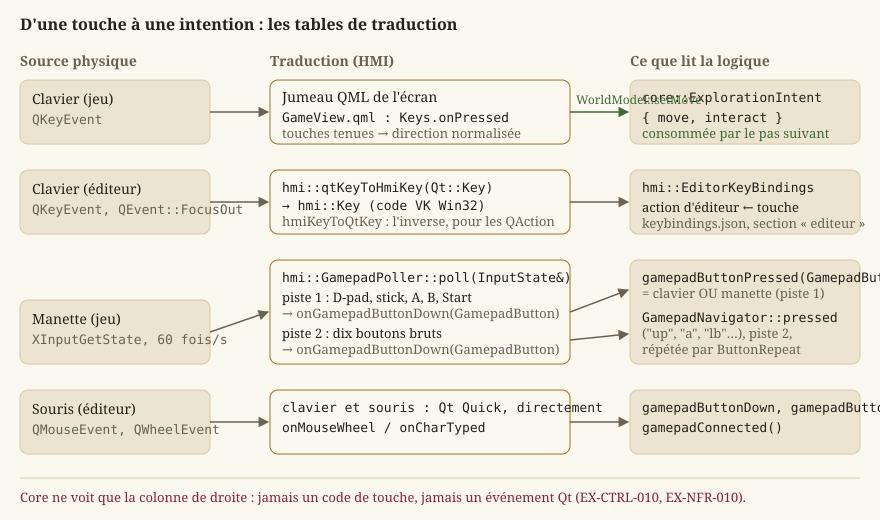
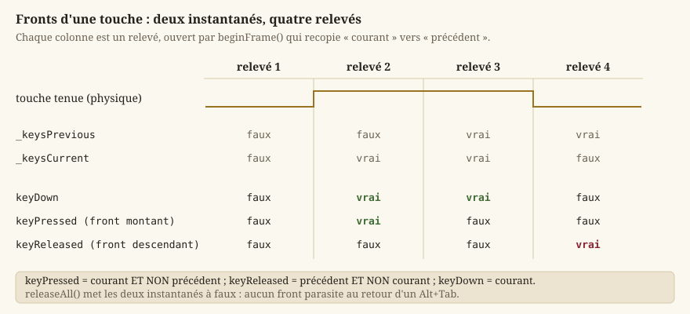

# Entrées et actions logiques

Cette page explique comment une touche physique devient un déplacement du personnage, et pourquoi
ce trajet passe par une étape intermédiaire qui, au premier abord, peut sembler superflue. Elle
couvre tout `Source/HMI/Input` (`InputState.h`, `QtKeyMap.h`, `GamepadButton.h`,
`GamepadPoller.h`, `ButtonRepeat.h`) et le pont manette du jeu Qt Quick
(`Source/HMI/Runtime/GamepadNavigator.h`), puis les deux briques qui s'appuient dessus : les
raccourcis de l'éditeur et la langue de l'interface.

## Le principe : ne jamais coder « en dur » une touche dans le gameplay

Le gameplay ne dépend **jamais** directement d'une touche physique (`EX-CTRL-010`). Autrement dit,
`core::ExplorationSession` ne contient **aucun** test du genre « si la touche flèche gauche est
enfoncée ». À la place, les entrées brutes (clavier, manette) sont d'abord traduites en une
**intention** neutre — « aller vers le nord-ouest », « interagir » — que `Core` consomme sans jamais
savoir **quelle touche** a produit cette intention.

**Pourquoi cette indirection.** Sans elle, chaque logique qui a besoin d'une entrée devrait
connaître les touches physiques, ce qui pose plusieurs problèmes concrets :

- **plusieurs touches, une commande** — les flèches, `ZQSD` et `WASD` déplacent tous le héros, `E`
  et `Espace` interagissent tous deux (`EX-CTRL-022`) ; un seul point de traduction évite de répéter
  cette correspondance dans chaque logique ;
- **tests plus difficiles** — tester l'exploration obligerait à simuler de vrais événements clavier
  plutôt qu'à construire directement une intention `{ .move = {1, 0}, .interact = true }` ;
- **couplage entre `Core` et `HMI`** — `Core` n'a **aucune** dépendance à la fenêtre ni à Qt
  (`EX-NFR-010`) ; lui faire connaître des codes de touche briserait cette frontière
  architecturale.

Le trajet complet est donc : **touche physique → événement Qt → traduction (`HMI` ou jumeau QML) →
`core::ExplorationIntent` (intention) → `Core` (logique de jeu)**. Les premières étapes vivent du
côté de la présentation, la dernière dans `Core`, indépendante.



## L'intention : `core::ExplorationIntent`

`core::ExplorationIntent` est le **contrat** de données entre la présentation et l'exploration :

- `move` : la direction voulue, un `core::Vector2` de longueur **au plus 1** — déjà normalisée, pour
  qu'une diagonale n'aille pas plus vite qu'une ligne droite ([Mathématiques du moteur](guide-maths.md)). Deux touches
  opposées enfoncées ensemble **se neutralisent** plutôt que de privilégier arbitrairement l'une ;
- `interact` : vrai **le pas** où le joueur demande l'interaction — un appui ponctuel, pas un état
  maintenu.

`Core` ne reçoit **que** cette structure : il ignore totalement l'existence des touches et boutons
physiques. Deux traducteurs la construisent, un par application :

- dans le **jeu**, l'écran d'exploration (`Source/App/Game/Qml/Screens/GameView.qml`) tient les
  directions enfoncées (flèches, `Z`/`W`, `Q`/`A`, `S`, `D`), en compose la direction normalisée et
  la pousse à `hmi::WorldModel::setMove` à chaque appui ou relâchement ; `E`/`Espace` appellent
  `hmi::WorldModel::interact`, `Échap` ouvre la pause. `WorldModel` range l'intention et la remet à
  la session au pas suivant ([Boucle de jeu et pas de temps fixe](guide-boucle.md)) ;
- dans l'**essai immédiat** de l'éditeur, `hmi::EditorViewport` retient les touches enfoncées
  (mêmes touches que le jeu) et compose la même direction ; `E`/`Espace` lèvent une demande
  d'interaction, `Échap` arrête l'essai.

Dans les deux cas, la demande d'interaction est **consommée** par le premier pas qui la lit, puis
remise à zéro. Un appui ne se perd donc jamais entre deux pas, et ne se répète pas non plus : la
latence entrée → effet reste bornée à **un pas** (`EX-CTRL-020`).

**Perte de focus.** À un `Alt+Tab` (ou tout basculement de fenêtre), la vue ne reçoit **pas**
d'événement de relâchement pour les touches maintenues. Sans précaution, une direction maintenue
resterait « collée » et le personnage avancerait seul au retour. `hmi::EditorViewport` traite donc
`QEvent::FocusOut` en oubliant toutes les touches tenues ; côté `InputState`, c'est le rôle de
`releaseAll` (plus bas).

## Le vocabulaire : `hmi::Key`, `hmi::MouseButton`, `hmi::GamepadButton`

Trois énumérations nomment ce que la présentation sait observer. Elles sont dans `HMI/Input`,
jamais dans `Core` (`EX-NFR-011`).

### `hmi::Key` : une touche, par son code virtuel Win32

`hmi::Key` identifie une touche du clavier par son **code virtuel Win32** (`VK_*`) : `Escape` vaut
`0x1B`, `Left` `0x25`, `A` `0x41`, `F10` `0x79`… Ce choix, hérité de la fenêtre Win32 d'origine,
est conservé parce qu'il coûte zéro table : un code brut se range dans `InputState` par un simple
`static_cast`, et l'énumération n'a besoin de nommer que les touches **utiles** (menus, `ZQSD`/
`WASD`, `E`, `Ctrl`, `Maj`, `0`, `F1`, `F2`, `F10` et quelques lettres de l'éditeur). Ajouter une
touche revient à ajouter un énumérateur : `InputState` stocke déjà n'importe quel code sur 256
entrées (`KEY_COUNT`). Le fichier des raccourcis de l'éditeur enregistre d'ailleurs ce code brut.

### `hmi::MouseButton`

`Left`, `Right`, `Middle`, et la sentinelle `Count` (3), qui **n'est pas un bouton** : elle
dimensionne les tableaux d'état. C'est le patron classique d'une énumération dont on veut connaître
la taille sans la recompter à la main.

### `hmi::GamepadButton`

Dix boutons ou directions **logiques** de la manette (`EX-CTRL-002`) : `Up`, `Down`, `Left`,
`Right`, `A`, `B`, `X`, `Y`, `LeftShoulder`, `RightShoulder` ; `hmi::GAMEPAD_BUTTON_COUNT` en donne
le nombre. Deux décisions y sont inscrites :

- les quatre directions **fusionnent** le D-pad et le stick gauche : le joueur ne perçoit pas la
  différence, et le sondage les a toujours traités comme équivalents ;
- `Start`/`Back`, les clics de stick et les gâchettes analogiques **ne sont pas représentés** :
  conventions globales (Start ouvre la pause, comme `Échap`) ou hors périmètre.

## La table de traduction Qt : `hmi::qtKeyToHmiKey` et `hmi::hmiKeyToQtKey`

L'éditeur reçoit ses touches par `QKeyEvent`, dont le code est un `Qt::Key`. `HMI/Input/QtKeyMap.h`
fait la correspondance dans les deux sens :

- `hmi::qtKeyToHmiKey(int qtKey)` renvoie `std::optional<hmi::Key>` : la touche suivie, ou
  `nullopt` pour une touche que le moteur n'observe pas. Les lettres, chiffres et l'espace
  **partagent déjà la même valeur** entre Qt et Win32 (`Qt::Key_A == 0x41 == VK 'A'`) ; seules les
  touches spéciales (flèches, `Échap`, `Tab`, `Maj`, `Ctrl`, `F1`/`F2`/`F10`) passent par une
  correspondance explicite ;
- `hmi::hmiKeyToQtKey(hmi::Key)` est l'inverse : il sert à faire **refléter un remappage** de
  `hmi::EditorKeyBindings` sur le raccourci effectif d'un `QAction`
  (`hmi::EditorActions::applyShortcuts`). Comme à l'aller, tout code non nommé explicitement est
  converti tel quel.

**Pourquoi une table plutôt que d'adopter `Qt::Key` partout.** `InputState` et les tests qui le
couvrent sont indépendants de Qt (`EX-NFR-010`) ; la table est la seule ligne de contact, et elle
est testable seule.

## Échantillonner plutôt que réagir : `hmi::InputState`

Deux façons classiques d'observer les entrées existent :

- **piloté par les événements** : le code réagit immédiatement à chaque message du système
  d'exploitation (« touche enfoncée », « touche relâchée ») dès qu'il arrive, à un instant
  arbitraire ;
- **échantillonné** (*polling*) : le code lit un **état courant**, mis à jour à intervalle régulier,
  à un instant **prévisible**.

Le clavier arrive par événements Qt ; la **manette**, elle, n'en produit pas : il faut la sonder.
`hmi::InputState` est l'état échantillonné qui reçoit ces relevés — indépendant de toute fenêtre
(aucune dépendance `<Windows.h>`, `<Xinput.h>` ni Qt dans son en-tête), si bien que les tests
(`Source/Test/Unit/HMI/Input/test_input_state.cpp`) y injectent directement touches et boutons,
sans manette réelle (`EX-NFR-010`).

### Détecter les fronts, pas seulement l'état

Savoir qu'un bouton est enfoncé ne suffit pas : une interface doit distinguer *plusieurs* questions
liées mais différentes (`EX-CTRL-011`) :

- « le bouton **vient-il d'être pressé** ? » (le **front montant**) — valide un choix, une seule fois
  par appui ;
- « le bouton est-il **maintenu** ? » — fait défiler une liste tant qu'on tient la croix ;
- « le bouton **vient-il d'être relâché** ? » (le **front descendant**).

`InputState` calcule ces trois fronts en gardant **deux instantanés** : l'état **courant** et celui
du relevé **précédent**. Un bouton est « pressé » (front montant) précisément quand il est enfoncé
maintenant mais ne l'était **pas** au relevé d'avant ; de même, « relâché » (front descendant) quand
il ne l'est plus mais l'était juste avant. Sans conserver cet historique, on ne pourrait connaître
que l'état courant (`keyDown`), jamais le moment précis de transition (`keyPressed`/`keyReleased`) —
pourtant essentiel aux actions **ponctuelles**, à déclencher une seule fois par appui.



```cpp
// keyDown : vraie si enfoncée maintenant, quelle que soit la source (clavier OU manette).
bool InputState::keyDown(Key key) const noexcept {
    return _keysCurrent[index] || _gamepadCurrent[index];
}

// keyPressed (front montant) : enfoncée maintenant, mais ne l'était sur AUCUNE source
// au relevé précédent.
bool InputState::keyPressed(Key key) const noexcept {
    const bool keyboardEdge = _keysCurrent[index] && !_keysPrevious[index];
    const bool gamepadEdge = _gamepadCurrent[index] && !_gamepadPrevious[index];
    return keyboardEdge || gamepadEdge;
}
```

Remarque sur la fusion manette (détaillée plus bas) : `keyPressed` calcule un front **par source**
puis les combine par OU logique — un bouton manette pressé alors que la touche clavier équivalente
était déjà maintenue produit bien un nouveau front (celui de la manette), sans que le clavier
« masque » cette pression.

### Le cycle d'un relevé

1. `hmi::InputState::beginFrame` recopie l'état **courant** vers l'état **précédent**, remet à zéro
   l'incrément de molette et vide la file des caractères tapés : la fenêtre d'observation du relevé
   s'ouvre ;
2. les sources mettent à jour l'état courant (`onKeyDown`/`onKeyUp`, `onGamepadKeyDown`/…,
   `onGamepadButtonDown`/…, `onMouseMove`/…) ;
3. le lecteur interroge les fronts et l'état (`keyPressed`, `gamepadButtonPressed`, …).

`hmi::InputState::releaseAll` remet à zéro l'état courant **et** précédent de toutes les touches et
de tous les boutons — sans produire de front « relâché » parasite (courant == précédent ==
relâché). C'est ce qu'appelle un lecteur qui cesse d'écouter (perte de focus, `GamepadNavigator`
désactivé).

### L'interface complète, fonction par fonction

| Fonction | Rôle | Invariant |
|---|---|---|
| `hmi::InputState::onKeyDown` / `onKeyUp` | Source **clavier** : marque une `Key` enfoncée ou relâchée dans l'état courant. | N'écrit jamais dans les tableaux manette. |
| `hmi::InputState::onGamepadKeyDown` / `onGamepadKeyUp` | Source **manette**, même espace de `Key` (navigation de menu). | Tableau distinct du clavier : relâcher un bouton n'efface jamais une touche clavier tenue. |
| `hmi::InputState::onGamepadButtonDown` / `onGamepadButtonUp` | Piste **brute** par `GamepadButton`, pour les actions de jeu. | Indépendante de la fusion ci-dessus. |
| `hmi::InputState::setGamepadConnected` / `gamepadConnected` | Déclare et relit la présence d'une manette au dernier relevé. | Posé par `GamepadPoller::poll` à chaque sondage effectif. |
| `hmi::InputState::keyDown` / `keyPressed` / `keyReleased` | État et fronts d'une `Key`, **clavier OU manette**. | Le front se calcule par source puis se combine. |
| `hmi::InputState::gamepadButtonDown` / `gamepadButtonPressed` / `gamepadButtonReleased` | État et fronts d'un `GamepadButton`. | Même règle courant/précédent. |
| `hmi::InputState::onMouseMove` ; `mouseX` / `mouseY` | Position de la souris en pixels de la zone client (origine haut-gauche). | Conservée d'un relevé à l'autre : rien ne la remet à zéro. |
| `hmi::InputState::onMouseButtonDown` / `onMouseButtonUp` ; `mouseButtonDown` / `mouseButtonPressed` / `mouseButtonReleased` | État et fronts d'un `MouseButton`. | Même règle. |
| `hmi::InputState::onMouseWheel` ; `wheelDelta` | Accumule les crans de molette du relevé (unités natives Win32, `WHEEL_DELTA` = 120 par cran, signé : positif vers l'avant). | Somme remise à zéro par `beginFrame` ; l'appelant convertit. |
| `hmi::InputState::onCharTyped` ; `typedCharacters` | File des caractères **déjà traduits** par la disposition clavier (`WM_CHAR`), dans l'ordre de saisie. | Vidée par `beginFrame`. Un champ de texte lit des caractères, jamais des `Key`. |
| `hmi::InputState::beginFrame` / `releaseAll` | Ouvre un relevé ; relâche tout sans front. | Voir ci-dessus. |

La souris et les caractères tapés ne servent aujourd'hui qu'à l'éditeur, et le jeu Qt Quick reçoit
sa souris par les événements de ses éléments ; ils restent dans `InputState` parce que l'état
échantillonné doit être **complet** pour qu'un lecteur n'ait qu'une seule source à interroger.

## La manette : une seconde source, fusionnée en lecture (EX-CTRL-002)

`InputState` ne connaît qu'un seul `hmi::Key` par touche, mais **deux** sources indépendantes qui
peuvent l'enfoncer : le clavier (`onKeyDown`/`onKeyUp`) et la manette (`onGamepadKeyDown`/
`onGamepadKeyUp`), chacune avec sa propre paire courant/précédent. `keyDown`/`keyPressed`/
`keyReleased` **combinent** les deux (OU logique) au moment de la lecture — jamais à l'écriture.

**Pourquoi pas une seule table partagée ?** Parce que la manette est **sondée**, pas événementielle
: `hmi::GamepadPoller::poll` interroge XInput à chaque relevé et doit explicitement relâcher
(`onGamepadKeyUp`) chaque touche dont le bouton correspondant n'est plus enfoncé — y compris quand
la manette est débranchée. Si ce relâchement écrivait dans la **même** table que le clavier, il
effacerait une touche clavier réellement maintenue dès que la manette (absente ou relâchée) ne la
tient plus. Deux tables, combinées seulement en lecture, rendent ce bug structurellement
impossible plutôt que de compter sur la discipline du code appelant.

Chaque direction manette synthétise le **même** `Key` fixe que son équivalent clavier (D-pad et
stick gauche → `Left`/`Right`/`Up`/`Down` ; **A** → `Enter` **et** `Space` ; **B**/**Start** →
`Escape`) — câblage en dur dans `hmi::GamepadPoller::poll`.

**Une seconde piste, brute, par bouton.** À partir du **même** relevé XInput, `GamepadPoller::poll`
alimente aussi un état par `hmi::GamepadButton` (`onGamepadButtonDown`/`onGamepadButtonUp`,
`InputState::gamepadButtonDown`/`gamepadButtonPressed`) — dix boutons et directions. C'est cette
piste que lit le jeu.

> **Note** — Les commentaires de `InputState.h` et `GamepadPoller.h` citent un `GamepadBindings`
> « remappable » : cette classe n'existe pas dans le dépôt. Le remappage des boutons manette n'est
> pas implémenté ; la piste brute est lue telle quelle par `hmi::GamepadNavigator`.

### `hmi::GamepadPoller` : sonder XInput sans fenêtre

`hmi::GamepadPoller` est un objet **à état** (dernier état de connexion, horodatage du dernier
sondage), à appeler **une fois par relevé**, avant que la logique ne consomme les entrées. Sa seule
fonction publique, `hmi::GamepadPoller::poll(InputState&)`, sonde le joueur 0 et alimente les deux
pistes. Le sondage XInput lui-même (`<Xinput.h>`) vit ici, jamais dans `InputState`, extrait de
l'ancienne fenêtre Win32 pour être réutilisable par n'importe quel hôte Qt sans dépendre d'une
fenêtre. Un changement de connexion est journalisé une fois, pas à chaque relevé.

**Sondage espacé quand aucune manette n'est branchée.** `XInputGetState` est notablement
**coûteux** quand le slot interrogé est vide : le pilote énumère les périphériques à chaque appel.
Le sonder à chaque relevé alors qu'aucune manette n'est connectée provoque des micro-saccades chez
un joueur clavier. `hmi::GamepadPoller::poll` ne re-sonde donc un slot resté **déconnecté** qu'une
fois par `hmi::GAMEPAD_DISCONNECTED_PROBE_PERIOD` (2 s) ; entre-temps l'état reste « déconnecté ».
Dès qu'une manette est présente, le sondage redevient systématique — un branchement à chaud est
détecté au plus tard après une période.

La décision est prise par `hmi::gamepadProbeDue(wasConnected, sinceLastProbe)`, une fonction
`constexpr` **pure** : vraie si une manette était présente au dernier sondage, sinon seulement si
la période est écoulée. Elle compte en **temps réel** et non en nombre d'appels, parce que le
sondage est déclenché tantôt par la boucle de rendu (une fois par image), tantôt par un
temporisateur d'interface bien plus lent : un compteur d'appels ferait varier le délai de détection
dans un rapport de plus de cent selon l'appelant. L'horodatage initial du `GamepadPoller` est
l'époque, si bien que le tout premier appel sonde toujours.

### `hmi::ButtonRepeat` : répéter un bouton tenu

Une touche fléchée tenue au clavier se répète, parce que le système le fait pour nous ; XInput ne
répète rien. Un curseur de ciblage qu'on déplace à la croix doit pourtant avancer d'une case par
appui **et** traverser une salle si l'on tient la croix (`LOT-24`). `hmi::ButtonRepeat` est ce
compteur, **sans horloge à lui** : `hmi::ButtonRepeat::update(down, now)` reçoit l'état du bouton
et l'instant courant, et renvoie vrai si le bouton produit un pas maintenant — à l'appui, puis, une
fois `hmi::BUTTON_REPEAT_DELAY` (350 ms) passé, à chaque `hmi::BUTTON_REPEAT_INTERVAL` (110 ms).
Relâcher remet le compteur à zéro. Le temps lui étant donné, un test le fait avancer sans attendre.

## Dans le jeu : `hmi::GamepadNavigator`

Qt 6 n'a plus de module manette, et le jeu Qt Quick du `LOT-86` liait `xinput` sans jamais le lire.
`hmi::GamepadNavigator` (`Source/HMI/Runtime`) est le pont, exposé au QML comme élément
(`QML_ELEMENT`) :

- la propriété `active` (lecture/écriture) dit si l'écran écoute la manette. Tant qu'elle est vraie,
  un `QTimer` sonde soixante fois par seconde : `InputState::beginFrame`, puis
  `GamepadPoller::poll`. Passée à faux, le timer s'arrête et `releaseAll` oublie tout : un écran qui
  n'écoute pas la manette ne la paie pas ;
- la propriété `connected` (lecture seule) reflète `InputState::gamepadConnected` ;
- le signal `pressed(const QString& button)` est émis avec le nom du bouton — `up`, `down`, `left`,
  `right`, `a`, `b`, `x`, `y`, `lb`, `rb`. La croix et le stick passent par quatre `ButtonRepeat`
  (un par direction) et se répètent quand on les tient ; les autres boutons n'émettent qu'au front
  montant (`gamepadButtonPressed`).

Il ne sait rien de ce que l'écran en fait : c'est le jumeau QML de l'écran (le Colisée, la carte du
monde) qui traduit un nom en geste, comme il traduit une touche. Ce partage des rôles reproduit
celui du clavier : la traduction reste dans la présentation, et `Core` ne voit qu'une intention.

## Le menu d'options

La page Options du jeu est en QML (`Source/Ui/Screens/OptionsForm.ui.qml`, câblée par
`Source/App/Game/Qml/Screens/Options.qml`) ; elle lit et écrit `hmi::OptionsModel`, qui persiste
chaque réglage : plein écran, **V-Sync** (`EX-REN-022`), volume, **langue**, journaux de
diagnostic. Le jeu ne propose pas de remappage des touches ([Écrans, navigation et boucle de
jeu](guide-ecrans.md)).

## Les raccourcis de l'éditeur : `hmi::EditorKeyBindings`

Les raccourcis de l'éditeur sont **reconfigurables par fichier** (`EX-CTRL-012`) :
`hmi::EditorKeyBindings` (`Source/Editor/Logic`) associe chaque `hmi::EditorAction` (Sauvegarder,
Annuler, Refaire, Copier, Coller, Essai, Grille, Aide, Renommer — `EDITOR_ACTION_COUNT` = 9) à une
`hmi::Key`, lue au démarrage depuis la section `"editeur"` de `keybindings.json`, à côté de
l'exécutable. `hmi::EditorViewport` la charge ; `hmi::EditorActions::applyShortcuts` en fait les
raccourcis des actions Qt du menu et de la barre d'outils (par `hmi::hmiKeyToQtKey`) — une seule
source, jamais un second traitement dans la vue.

- Le fichier stocke le code VK **brut** de la touche (`hmi::Key` en est déjà un).
- `setKey` **échange** avec toute autre action déjà sur cette touche plutôt que de dupliquer :
  jamais deux actions sur la même touche.
- Le modificateur `Ctrl` de Sauvegarder/Annuler/Refaire/Copier/Coller reste câblé en dur ; seule la
  touche-lettre est remappable. Certains gestes (`Suppr` de l'outil Entité, recadrage `0`) restent
  câblés en dur.
- Un fichier absent, corrompu, ou une entrée invalide retombe sur les valeurs par défaut pour
  l'entrée concernée (`EX-NFR-040`), jamais bloquant, avec un avertissement dans le journal. `save`
  relit le fichier existant pour préserver les autres sections plutôt que de les écraser.

Le détail des gestes de l'éditeur (outils, pinceau, sélection) est dans [Éditeur de
niveaux](guide-editeur.md).

## La langue de l'interface : `hmi::Localization`

Tous les textes d'interface de l'éditeur passent par une **clé** stable (`EX-REN-033`) plutôt que
par un libellé en dur : `hmi::Localization` résout une clé (« action.copy ») vers la chaîne de la
**langue active**, chargée depuis un fichier `<langue>.lang` (format `clé = valeur`, un fichier
par langue dans `Source/Elements/Localization/` : `fr.lang`, `en.lang`). La résolution suit un
**repli déterministe** — langue active, puis langue par défaut, puis la clé elle-même — pour ne
jamais planter ni afficher un vide si une traduction manque (`EX-NFR-040`), au prix, dans ce
dernier cas, d'un texte visiblement « brut » (la clé) plutôt qu'un texte manquant silencieux.

`hmi::MainWindow` détient l'unique `hmi::Localization` de l'éditeur : il charge le français par
défaut, puis la langue enregistrée (`QSettings`, clé `language`) si elle diffère, et propage un
`retranslateUi()` à chaque widget (docks, palette, navigateur, actions). Un échec de chargement
(fichier absent) est **récupérable** : la langue courante est simplement conservée. Le jeu, lui,
traduit ses écrans QML par le mécanisme de Qt (`qsTr`, catalogue `jadg_en.ts`) ; sa langue se
choisit dans Options. Les deux mécanismes sont détaillés dans [Données, corpus et
ressources](guide-donnees.md).

## Voir aussi
- `core::ExplorationIntent`, `hmi::WorldModel`, `hmi::EditorViewport`.
- `hmi::InputState`, `hmi::Key`, `hmi::MouseButton`, `hmi::GamepadButton`,
  `hmi::qtKeyToHmiKey`, `hmi::hmiKeyToQtKey`.
- `hmi::GamepadPoller`, `hmi::gamepadProbeDue`, `hmi::ButtonRepeat`, `hmi::GamepadNavigator`.
- `Source/Ui/Screens/MainMenuForm.ui.qml`, `OptionsForm.ui.qml` — le menu principal et la page
  Options, en QML ; `hmi::OptionsModel`.
- `hmi::EditorKeyBindings`, `hmi::EditorActions` — raccourcis de l'éditeur (`EX-CTRL-012`).
- `hmi::Localization` (`EX-REN-033`).
- [Boucle de jeu et pas de temps fixe](guide-boucle.md) — à quel moment un pas lit l'intention.
- [IHM Qt — deux applications, deux technologies](guide-ihm-qt.md) — les deux applications qui pilotent tout ceci.
- [Écrans, navigation et boucle de jeu](guide-ecrans.md) — la navigation des menus, au clavier et à la manette.
