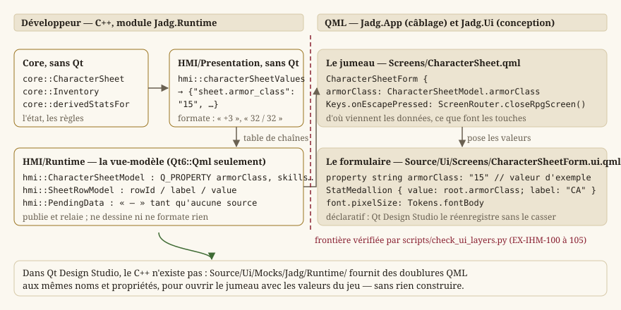
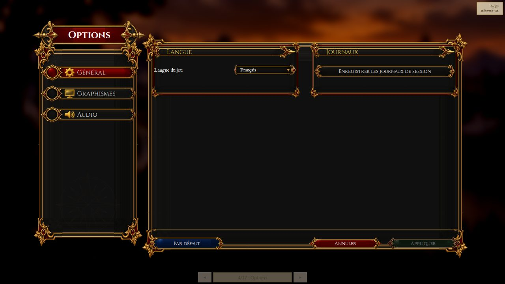
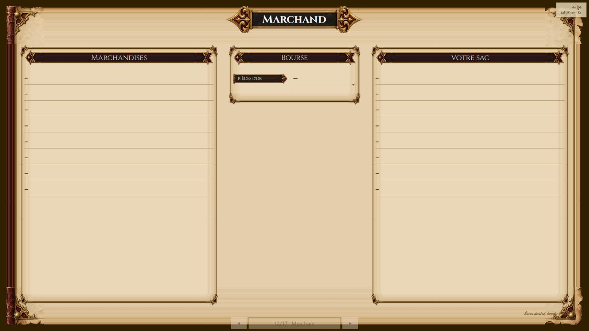
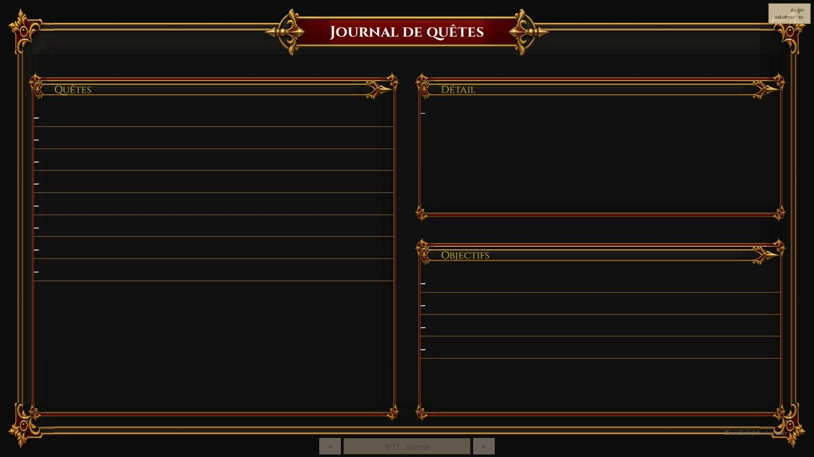
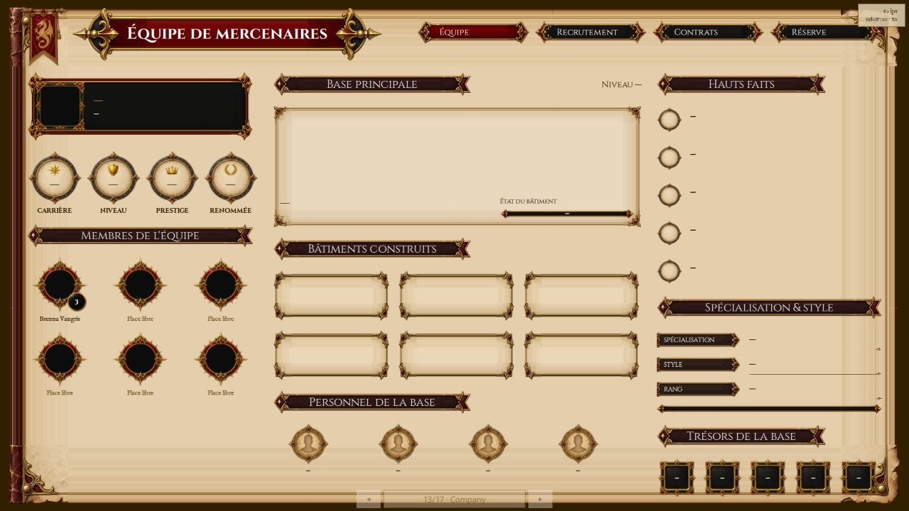
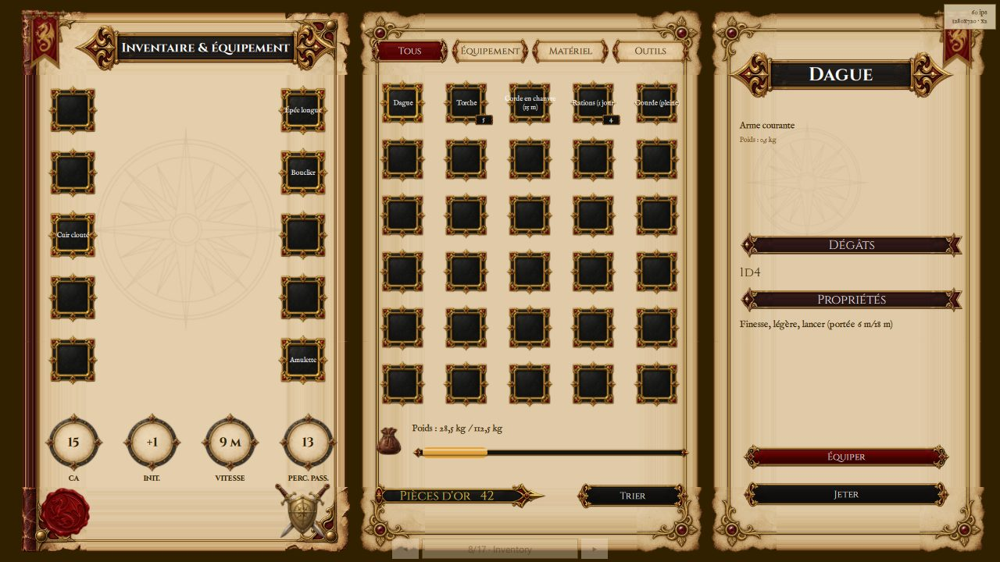
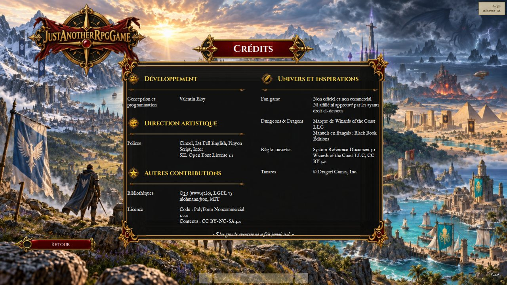

# IHM Qt — deux applications, deux technologies

Le **jeu** est une application **Qt Quick** ; l'**éditeur de niveaux** est en **Qt Widgets**, dans
son propre binaire (`LOT-86`, `LOT-EDITOR-01`). Le rendu de scène passe par **QRhi** — Direct3D 11
par défaut sous Windows — dans le jeu ; l'éditeur peint par `QPainter`. L'apparence des écrans du
jeu et le mode d'emploi de la conception sont en [Concevoir les écrans dans Qt Design
Studio](guide-conception-qds.md), que cette page laisse de côté.

Périmètre de la page : `Source/HMI/Runtime/` (les vues-modèles), `Source/HMI/Presentation/` (la
logique de présentation pure), `Source/HMI/Platform/`, `Source/HMI/Localization/`,
`Source/HMI/HmiLog.h`. La navigation (`ScreenFlow.h`, `RpgScreens.h`, `ScreenRouter.h`) est
détaillée en [Écrans, navigation et boucle de jeu](guide-ecrans.md) ; les surfaces de rendu
(`WorldViewportItem`, `ArenaViewportItem`, `GameViewportItem`, `AssetGalleryItem`,
`CityBlockImageProvider`) en [Rendu 2D](guide-rendu.md) ; `GamepadNavigator` en [Entrées et actions
logiques](guide-entrees.md).

## Pourquoi deux binaires

L'éditeur et le jeu vivaient dans une seule application, et c'est de là que venaient les **2 472
lignes** de `MainWindow.cpp` : une seule technologie d'IHM devait servir deux besoins opposés.

- L'**éditeur** est un outil d'auteur : docks détachables, arbres, disposition persistée
  (`EX-IHM-011`). Qt Widgets y est le bon outil, et QML n'y apporterait rien. Depuis le
  `LOT-EDITOR-01`, c'est un module à part (`Source/Editor`), outil interne : style Fusion, textes
  anglais écrits dans le code, widgets construits en code.
- Le **jeu** est l'inverse : des écrans dessinés pour 1920 × 1080 et rapportés à la fenêtre, dont
  l'apparence doit pouvoir changer **sans compiler** (`EX-IHM-100`).

| Cible | Technologie | Point d'entrée |
|---|---|---|
| `JustAnotherRpgGame` | Qt Quick, `QGuiApplication` | `Source/App/Game/Main.cpp` |
| `LevelEditor` | Qt Widgets, `QApplication` | `Source/App/Editor/Main.cpp` |

Elles partagent `Core`, `HMI/Graphics`, `HMI/Game`, `HMI/Input`, `HMI/Audio`, `HMI/Platform` et
l'amorçage (`App/Common/Bootstrap`) — tout ce qui n'est pas de la présentation. Elles ne partagent
**aucune** technologie d'IHM, et le jeu **ne lie pas `Qt6::Widgets`** (`EX-IHM-102`). Ce n'est pas
une convention : un widget qui y réapparaîtrait ferait échouer l'édition de liens.

## Les trois couches du jeu

```
Core                     règles et état, SANS Qt
  ↑
HMI/Presentation         logique de présentation pure (table de transitions, valeurs formatées)
HMI/Runtime              vues-modèles exposées au QML : ce que le jeu SAIT DIRE (module Jadg.Runtime)
  ↑                      Qt6::Qml seulement — jamais Quick ni Widgets (EX-IHM-101)
Source/Ui (QML)          ce que ça DONNE À VOIR (module Jadg.Ui, sans C++)
Source/App/Game/Qml      le câblage entre les deux (module Jadg.App)
```

`HMI/Runtime` transforme l'état du jeu en propriétés et en modèles de liste, et **ne dessine
rien**. Un écran lui demande *ce que le jeu sait dire*, jamais *comment le montrer*. Un seul en-tête
d'IHM qui y entrerait signalerait que la logique de vue a commencé à redescendre dans la couche de
données — et c'est ainsi que `MainWindow.cpp` s'était épaissi.

`scripts/checks/check_ui_layers.py` vérifie les six règles de cette séparation à chaque *Pull Request*.
Elles sont écrites en `EX-IHM-100` à `EX-IHM-105`. **Une règle qui n'est pas vérifiée n'est pas une
règle : c'est une intention** — le dépôt l'a appris deux fois, avec un défaut de taille d'écran
corrigé *trois* fois et une palette écrite *deux* fois.



## Les trois modules QML

Depuis le `LOT-87`, le jeu est fait de **trois** modules QML, et chacun est déclaré **dans le
répertoire de ses fichiers** :

| Module | Répertoire, et son CMakeLists.txt | Contenu | Cible |
|---|---|---|---|
| `Jadg.Ui` | `Source/Ui` | formulaires, contrôles, jetons, galerie — **QML pur** | bibliothèque statique `JadgUi`, `designersupported` |
| `Jadg.Runtime` | `Source/HMI/Runtime` | les types C++ exposés au QML (`QML_ELEMENT`) | bibliothèque statique `JadgRuntime` |
| `Jadg.App` | `Source/App` (fichiers sous `Game/Qml/`) | la fenêtre, la pile d'écrans, les jumeaux | l'exécutable `JustAnotherRpgGame` |

**Pourquoi trois, et pourquoi là.** Qt Design Studio ne charge aucun plugin C++ du projet : un
module qui mêle formulaires et types C++ est résolvable par le jeu et pas par l'atelier. `Jadg.Ui`
est donc pur, et n'importe jamais `Jadg.Runtime` — seuls les jumeaux le font, et l'atelier le
remplace par les doublures de `Source/Ui/Mocks/`. Quant au « là » : `qt_add_qml_module` calcule le
chemin de ressource de chaque fichier relativement au CMakeLists.txt qui l'appelle. Un module
déclaré depuis un autre répertoire oblige à réécrire ces chemins un par un, par des alias, et c'est
cette plomberie qui a coûté 125 commits à une branche abandonnée. **Aucun alias de ressource dans
ce dépôt**, et `scripts/checks/check_qml_designer_compat.py` le vérifie.

La découverte de Qt et `QT_VERSION_MINIMUM` vivent dans `Source/CMakeLists.txt` : les cibles
importées d'un `find_package` ne sont visibles que sous le répertoire qui l'a appelé, et trois
répertoires frères en dépendent.

Les deux bibliothèques statiques sont liées **avec leurs plugins** (`JadgUiplugin`,
`JadgRuntimeplugin`) : le `qmldir` embarqué de chaque module les désigne (`optional plugin`,
`linktarget`), et c'est le plugin lié qui enregistre les types quand l'engine rencontre l'import.
Aucune macro d'import dans le C++.

Quatre pièges, tous silencieux, tous consignés dans les CMake :

- un **singleton** doit être déclaré (`QT_QML_SINGLETON_TYPE`) : CMake ne déduit pas
  `pragma Singleton`. Non déclaré, le type se charge quand même — mais chaque `import` en construit
  une instance neuve, et le facteur d'agrandissement posé par la fenêtre n'est vu par aucun écran ;
- le fichier d'enregistrement des types est **engendré** et inclut les en-têtes par **nom de base**,
  dans un `__has_include` qui échoue sans bruit : le répertoire doit être dans les chemins
  d'inclusion ;
- `windeployqt` sans `--qmldir` n'embarque **aucun** module QML, et le jeu se lance alors sans
  interface, sans message — il en faut deux, un par répertoire QML ;
- `target_link_libraries` doit **précéder** `qt_add_qml_module` sur l'exécutable : la cible
  `all_qmllint` compose ses chemins d'import depuis les modules déjà liés à cet instant. Après,
  qmllint ne résout ni `Jadg.Ui` ni `Jadg.Runtime` et signale chaque écran en erreur.


La galerie est la preuve que les briques se résolvent au jeu comme à l'atelier : c'est le fichier
que Qt Design Studio ouvre en premier (`DesignStudio/Main.ui.qml`), posé tel quel dans la pile
d'écrans, sans jumeau.

### Éditer un écran sans rien reconstruire

La ressource imposerait une reconstruction à chaque retouche. Un **second `qmldir`** est donc
engendré sous `Source/Ui/Jadg/Ui/`, dont les chemins désignent les **sources** ;
`JADG_QML_FROM_SOURCE=1` le place en tête des chemins d'import.

Il est engendré depuis **la même liste** que la ressource : ajouter un écran ne crée pas un second
endroit à synchroniser. C'est aussi lui qui rend `Source/Ui` importable tel quel, donc ouvrable par
Qt Design Studio. Seul `Jadg.Ui` se relit ainsi : `Jadg.App` et `Jadg.Runtime` restent ceux du
binaire, et c'est voulu — ce qu'un artiste change ne demande jamais de les toucher.

### Ouvrir les écrans pour les dessiner

**Ce n'est pas Qt Designer.** Qt Designer dessine des *widgets* et n'ouvre que des `.ui` (XML) — le
dépôt n'en a plus aucun depuis le `LOT-EDITOR-01`. Les écrans du jeu sont du Qt Quick : ils
s'ouvrent dans **Qt Design Studio**, qui est un programme distinct.

```
D:/Qt/Tools/QtDesignStudio/bin/qtdesignstudio.exe Source/Ui/JadgUi.qmlproject
```

Cinq règles, dont plusieurs se paient par un mode *Design* vide plutôt que par un message :

- **ouvrir le `.qmlproject`, jamais le fichier seul.** Un `.ui.qml` ouvert par « File > Open File »
  n'a pas de chemin d'import : `import Jadg.Ui` échoue, et la vue 2D reste blanche ;
- **le projet doit avoir été configuré une fois par CMake.** Le `qmldir` de `Source/Ui/Jadg/Ui/`
  est *engendré* et ignoré par git : sur un dépôt fraîchement cloné il n'existe pas encore, et
  aucun type du module ne se résout. `scripts/build.ps1` suffit à le poser ;
- **le mode Design reste grisé si `qt6Project: true` manque** du `.qmlproject`. Sans ce booléen,
  Design Studio suppose un projet Qt 5, ne trouve aucun kit Qt 5, et désactive le mode — sans
  message ni trace dans le journal ;
- **on dessine le `*Form.ui.qml`, jamais son jumeau.** Un `.ui.qml` est déclaratif, donc réversible :
  Design Studio le réenregistre sans le casser. Le jumeau `.qml` contient du JavaScript ; Design
  Studio l'ouvre — grâce aux doublures de `Source/Ui/Mocks/` — pour le *voir* avec les valeurs du
  jeu, mais ne l'édite qu'en texte, et c'est voulu ;
- **la bibliothèque de composants reste « (vide) »** pour les dossiers du projet, avec ou sans le
  mot `designersupported` que le `qmldir` engendré porte. Les briques se posent depuis la galerie
  `DesignStudio/Main.ui.qml` ou par le code ; le point reste à instruire.

Aucune version de Qt n'est écrite dans le `.qmlproject`, et c'est délibéré. Le projet se construit
avec la version épinglée par `QT_VERSION_MINIMUM` (`Source/CMakeLists.txt`), que
`scripts/ci/check_qt_version_pin.py` tient identique en CMake et en CI. Design Studio, lui, dessine
toujours avec le Qt qu'il **embarque** (6.8.7 sur le poste de référence, `qmlpuppet-4.8.3.exe`),
quel que soit le Qt installé : un numéro de plus dans le fichier de conception ne commanderait ni
l'un ni l'autre. Tous les imports du module étant sans version, le choix ne se pose pas.

Les types **C++** de `Jadg.Runtime` sont invisibles à Design Studio ; `Source/Ui/Mocks/Jadg/Runtime/`
en porte des doublures QML aux mêmes noms et propriétés, que le `.qmlproject` place dans ses
`importPaths`. Les formulaires de `Source/Ui/Screens/` et leurs jumeaux de
`Source/App/Game/Qml/Screens/` se résolvent ainsi dans l'atelier. Seuls `Main.qml` et
`ScreenStack.qml` restent irrésolus, parce qu'ils importent `Jadg.App` lui-même : ce sont des
fichiers de câblage, et rien ne s'y dessine. `check_qml_designer_compat.py` tient les doublures
alignées sur le C++ : chaque `Q_PROPERTY` et chaque `Q_INVOKABLE` doit y avoir son pendant.

## Les vues-modèles : ce que le jeu sait dire

Toutes sont des `QObject` déclarés `QML_ELEMENT` (ou `QML_SINGLETON`), et suivent la même
discipline : elles **publient** des propriétés et des modèles, elles **relaient** les gestes à
`Core` ou à une fonction pure de `HMI/Presentation`, et elles ne formatent ni ne dessinent rien.
Un signal `changed` unique par vue-modèle plutôt qu'un par propriété : l'état est recalculé d'un
bloc, et prétendre le contraire obligerait à comparer quatorze champs pour n'en notifier que ceux
qui bougent.

### `hmi::OptionsModel` — persister et prévenir

Singleton. `EX-IHM-083` gouverne la classe : **tout réglage exposé doit atteindre le moteur**. Elle
ne fait donc que deux choses : persister (`QSettings`) et prévenir ; c'est `Main.cpp` qui branche
chaque signal sur ce qu'il atteint (voir plus bas).

- Propriétés en écriture : `fullscreen`, `vsync`, `diagnostics`, `volume` (entier, en pour cent),
  `language` (un code, `fr` ou `en`) — chacune avec son signal `…Changed`.
- `hmi::OptionsModel::languages` / `languageNames` — les codes, et les noms **dans leur propre
  langue** (« English » ne se traduit pas : c'est ce qui permet d'en sortir). Constantes : une
  langue s'ajoute avec son catalogue, donc par une construction.
- `hmi::OptionsModel::defaults` — les valeurs d'usine, une seule table lue par le bouton « Par
  défaut » et par le constructeur : recopiées en QML, elles auraient divergé au premier défaut
  changé ici.
- `hmi::OptionsModel::logsAvailable` — `false` en Release, où aucun puits mémoire ne collecte les
  journaux de session ; le bouton se désactive plutôt que d'échouer une fois cliqué.
- `hmi::OptionsModel::saveLogs()` — écrit les journaux de la session (`core::MemoryLogSink`) dans
  un fichier horodaté à côté de l'exécutable et rend un message **destiné à l'écran** : le chemin
  écrit, ou la raison de l'échec, jamais une chaîne vide. C'est ce qui permet à un joueur de
  joindre un fichier exploitable à un rapport de défaut sans terminal (`EX-NFR-040`).
- `hmi::OptionsModel::setSessionLog(sink)` — appelé par l'application au démarrage : la
  présentation ne va pas chercher le puits elle-même, elle ne sait pas qu'il existe.

« Immédiatement » s'entend **à l'écriture** d'une propriété. L'écran des options de la charte v2
n'écrit qu'au bouton « Appliquer » : il tient ses valeurs en attente, et « Annuler » les abandonne
sans que cette classe en ait rien su.



### `hmi::PendingData` — l'ancre de ce qui n'a pas encore de source

Singleton. Plusieurs écrans du RPG — marchand, ATH de combat, l'essentiel de l'équipe de
mercenaires — n'ont aujourd'hui **aucune donnée** : les lots qui les produiront n'existent pas
encore. Leur mise en page, elle, est décidée. Chacun de leurs champs porte donc une **clé
d'attribution** nommée qui aboutit ici ; le jour où le lot fonctionnel arrive, il remplace
`PendingData` par sa vraie vue-modèle dans le jumeau, et **le formulaire ne bouge pas**.

- `hmi::PendingData::value(key)` — le tiret cadratin, quelle que soit la clé. La clé n'est pas
  ignorée pour autant : c'est elle que `scripts/i18n/list_pending_bindings.py` relève dans le QML — un
  inventaire **dérivé du code**, donc toujours exact.
- `hmi::PendingData::image(key)` — une URL **vide**. Distincte de `value`, et ce n'est pas un
  détail : affecter un tiret à la source d'une image fait chercher un fichier nommé « — ».
- `hmi::PendingData::rows(key, count)` — un modèle de `count` lignes vides, **mis en cache par
  clé** : sans cela, chaque réévaluation d'une liaison construirait un modèle neuf, et la position
  de défilement sauterait à chaque image.

Pourquoi un tiret et non de fausses données : un écran rempli de valeurs plausibles se prend pour
un écran fini, passe les relectures, et un jour quelqu'un s'étonne que le marchand vende toujours
les mêmes trois objets.



Le marchand n'est pas seul dans ce cas, et les deux autres montrent bien ce que le tiret permet :
juger une **disposition** avant d'avoir la donnée qui la remplira — puis la garder quand la donnée
arrive.



Le journal a été jugé ainsi, en tirets, sur une question de conception que nulle donnée ne
changeait : la liste des quêtes occupe une colonne entière, et le détail se partage en deux avec
les objectifs. Depuis le `LOT-116`, il n'est plus en attente : `hmi::QuestJournalModel`
(ci-dessous) l'alimente depuis les drapeaux de la partie, et le formulaire n'a pas bougé — c'est
exactement ce que l'ancre promettait. La capture, antérieure, se refait avec une partie en cours.



L'équipe de mercenaires est le cas extrême : presque tout y est en attente, et l'écran reste
pourtant utile — il montre que **six** places de membres tiennent sans que la disposition se
déforme, alors que la décision de cadrage n'en promettait que quatre.

### `hmi::SheetRowModel` — les parties répétitives

`QAbstractListModel` de lignes `hmi::SheetRow` (`id`, `label`, `value`), rôles `rowId`, `label`,
`value`. Les six caractéristiques, les six jets de sauvegarde et les dix-huit compétences sont des
répétitions : la conception veut en décrire **une** et laisser le nombre à la donnée.
`hmi::SheetRowModel::setRows(rows)` remplace tout d'un bloc — la liste est recalculée à chaque
changement de fiche, jamais modifiée par morceaux. Le modèle ne formate rien : la valeur arrive
déjà mise en forme par la couche pure.

Volontairement **pas** déclaré type QML : un modèle ne s'instancie jamais depuis le QML, il est
fourni par la vue-modèle et consommé par son type de base `QAbstractItemModel*`. L'exposer aurait
obligé le registrar à enregistrer aussi sa classe de base, qui appartient à un autre module.

### `hmi::ruleLabel` — le vocabulaire des règles

`Source/HMI/Runtime/RuleLabels.h`. La chrome des écrans (« Nouvelle partie ») s'écrit en français
dans le QML et se traduit par `qsTr`. Les termes de **règle** — caractéristique, emplacement
d'équipement, condition — ne le peuvent pas : leur clé est **calculée** (`rpg.ability.` +
l'identifiant que le modèle rend), et `qsTr` exige une chaîne littérale.

- `hmi::ruleLabel(key, language)` — le libellé traduit ; la **clé elle-même** si le catalogue ne
  la porte pas, jamais une chaîne vide, qui donnerait un écran troué sans dire pourquoi.
- `hmi::activeLanguage()` — la langue de l'IHM telle que les réglages la persistent (`fr` par
  défaut).

Ces termes sont un **lexique** : `Source/Elements/Localization/rpg.glossary.csv` garantit une
seule traduction par terme dans tout le jeu, et `scripts/checks/check_glossary.py` le vérifie.

### `hmi::CharacterSheetModel` et `hmi::InventoryModel` — le personnage

`CharacterSheetModel` publie la fiche : `name`, `species`, `background`, `classAndLevel`, `level`,
`experience`, `hitPoints`, `hitPointsMax`, `hitDice`, `armorClass`, `initiative`, `speed`,
`proficiencyBonus`, `passivePerception`, trois modèles (`abilities`, `savingThrows`, `skills`) et
la table complète `values` (`sheet.ability.strength.score`, `…modifier`…) que la fiche de la
charte v2 pose hors des listes. Ces propriétés nommées ne sont pas une seconde source : une façade
lisible dans le panneau des propriétés de Design Studio, sur la table que `hmi::characterSheetValues`
produit. `hmi::CharacterSheetModel::loadDemonstrationCharacter()` charge le personnage de
démonstration — **échafaudage écrit comme tel** : il n'existe encore ni groupe ni sauvegarde d'où
tirer un personnage réel. Une donnée manquante n'interrompt rien (`EX-CNT-010`) : la fiche
s'affiche partielle, avec ses tirets.

`InventoryModel` publie ce que le personnage porte et **agit** (`LOT-87`) : `equipmentSlots` (les
seize emplacements), `purse`, `gold`, `carried`, `capacity`, `loadRatio`, `backpack`, `equipped`,
la grille filtrée `cells` selon `filter` (`hmi::ItemFamily`), la sélection (`selectedItem`,
`selectedSlot`, `selection` : nom, genre, dégâts, armure, poids, texte, et `canEquip`,
`canUnequip`, `canDrop`) et les quatre statistiques dérivées de la maquette. Les gestes :
`hmi::InventoryModel::selectItem`, `selectSlot`, `equipSelected`, `unequipSelected`,
`dropSelected`, `sortBackpack`. **Aucune statistique n'est stockée ici** (`LOT-14`) : chaque geste
modifie l'inventaire gardé, puis **tout** est recalculé depuis lui par `core::derivedStatsFor`.
Rien n'est ajouté ni retranché à une valeur publiée.



Les deux vues-modèles décrivent le **même** personnage : `Source/HMI/Runtime/DemonstrationCharacter.h`
le charge une fois. `hmi::DemonstrationState` tient la fiche, l'inventaire et les huit catalogues
(`hmi::DemonstrationState::lookup()` en donne la vue `core::ItemLookup`, qui pointe dans l'état :
ne pas copier ensuite) ; `hmi::loadDemonstrationState()` le lit en journalisant chaque manque ;
`hmi::demonstrationValues(state)` en tire les deux tables, statistiques **recalculées** ;
`hmi::loadDemonstrationValues()` enchaîne les deux. Charger deux fois les catalogues aurait permis
aux deux écrans de diverger — la classe d'armure de la fiche vient de ce que l'inventaire contient.

### `hmi::DialogueModel` — une conversation

Tient un `core::DialogueRunner` et rien d'autre ne décide (`LOT-15`). Écrire `dialogueId` ouvre la
conversation ; `speakerName`, `attitude`, `line`, `checkOutcome` (le jet que la dernière réponse
a joué, d'une ligne) et ses morceaux pour que l'écran le **montre** (`LOT-117`) : `checkTitle`
(« Persuasion · DD 15 »), `checkDie` (le d20 tiré, vide s'il ne l'a pas été), `checkDetail`
(« 12 + 4 = 16 »), `checkVerdict`, `checkSucceeded` ; `replies` (modèle : `rowId`, `label`,
`value` = le jet annoncé), `finished`, `status`.
`hmi::DialogueModel::choose(rowId)` donne une réponse, ou quitte si c'est la ligne
`hmi::DIALOGUE_LEAVE_REPLY` ; `chooseAt(index)` sert les touches <kbd>1</kbd> à <kbd>9</kbd> ;
`restart()` rouvre depuis l'entrée, drapeaux conservés. Le signal
`hmi::DialogueModel::combatRequested(arenaId)` dit qu'un PNJ envoie se battre (`LOT-09`),
`encounterRequested(encounterId)` qu'il engage une rencontre sur la carte (`LOT-118`),
`demoEnded(ending)` qu'il clôt la démo (`LOT-119`) : le modèle n'ouvre rien, c'est l'écran qui
décide et le routeur qui navigue.

Le runner écrit dans les drapeaux **de la partie** (`LOT-116`) : ceux de `hmi::WorldModel::current`,
que la carte lit aussi — une porte ouverte par un dialogue s'ouvre sur la carte, un PNJ appelé par
une quête y paraît. Seule leur persistance sur disque attend la sauvegarde (`LOT-150`). Sans
partie (le designer, un test de l'écran seul), un ensemble vit le temps du processus, pour qu'un
héraut n'oublie pas qu'on lui a parlé à chaque ouverture de l'écran. Échafaudage qui demeure :
l'interlocuteur est le personnage de démonstration.


### `hmi::WorldModel` — la partie en cours

Singleton, et c'est le fond du sujet : la session d'exploration est **la partie**, pas un objet de
l'écran de jeu ([Écrans, navigation et boucle de jeu](guide-ecrans.md)). Elle tient un
`hmi::WorldPlay` et fait tourner son pas fixe (`WorldModel::STEP_MILLISECONDS`, 16 ms, sur un
`QTimer` précis).

- Propriétés : `mapId`, `mapName`, `status`, `loaded`, `columns`, `rows`, `heroColumn` /
  `heroRow` (coordonnées **continues**, ce que la caméra suit ; signal `heroMoved`), `heroFigure`
  (en écriture par `hmi::WorldModel::setHeroFigure`, qui la passe à `hmi::WorldPlay` et fait
  recomposer la scène ; `WorldPlay::DEFAULT_HERO_FIGURE` tant que rien ne la nomme, ou
  `--hero-figure=` avec `--map=`), `frozen`, `cityLocation` (la fiche d'atlas de la ville, clé de
  son plan), `districtId`, `visitedDistricts` (`LOT-96`).
- `hmi::WorldModel::startNewGame()` — ouvre le jeu à la porte de départ de la ville
  (`WorldModel::START_CITY`, la Capitale) et oublie les quartiers visités ;
  `hmi::WorldModel::endGame()` — la partie est finie (`LOT-119`, écran de mort ou de fin) : la
  session est refaite, sans carte, drapeaux et quêtes oubliés sauf ceux de `--flags=`, si bien
  que le prochain `startNewGame` ouvre une partie **neuve** ;
  `hmi::WorldModel::enterMap(mapId, arrival)` — entre sur une carte ;
  `hmi::WorldModel::mapOfDistrict(id)` — la carte d'un quartier.
- `hmi::WorldModel::setMove(x, y)` — la direction demandée, de longueur au plus 1, **tenue**
  jusqu'au prochain appel : l'état d'une touche enfoncée, pas un pas ; `hmi::WorldModel::interact()`
  — le prochain pas résoudra l'interaction.
- Options de développement : `setStartOverride` (`--map=`), `setLevelDirectories` (`--levels=`, à
  appeler **avant** la première entrée : la session est refaite), `setStartCell` (`--at=`),
  `setStartFlags` (`--flags=` ; `drapeau=valeur` donne sa valeur à un drapeau qu'une quête
  déclare, et les quêtes avancent aussitôt).
- La partie que les autres vues-modèles lisent (`LOT-116`) : `hmi::WorldModel::current()` (le
  dernier construit — un par moteur QML, un seul dans le jeu), `flags()` (les drapeaux de la
  session, qui survivent au changement de carte) et `quests()` (le catalogue lu au démarrage par
  `hmi::loadGameQuests`).
- Pour la surface de rendu : `hmi::WorldModel::snapshot()` (des **valeurs**, sans pointeur),
  `diamondRatio()`, `sceneRevision()` (avance à chaque pas qui change ce qui se dessine — c'est ce
  qui épargne une recomposition par image).
- Signaux : `changed`, `heroMoved`, `mapEntered(mapId)`, `dialogueRequested(dialogueId)`,
  `encounterRequested(encounterId)`, `portalLocked(flag)`, `portalBroken(mapId)`,
  `portalSealed(mapId)` (un portail condamné, `LOT-126` : il est là, il ne s'ouvre pas) et
  `questAdvanced(quest, step)` (une étape atteinte, `LOT-116` : le journal se relit). Le modèle ne
  navigue jamais : il dit ce qu'il faut ouvrir, l'écran l'ouvre.

### `hmi::QuestJournalModel` — le journal de quêtes

`Source/HMI/Runtime/QuestJournalModel.h` (`LOT-116`, `EX-EXP-010`). Ce que l'écran « Journal de
quêtes » lit — et il ne garde **aucun** état de quête : tout se relit dans les drapeaux de la
partie, à l'ouverture et à chaque étape atteinte. Un journal qui tiendrait sa propre liste
divergerait des drapeaux au premier chargement de sauvegarde ; celui-ci ne peut pas.

- Propriétés : `quests` (les quêtes commencées, un modèle de lignes `rowId`, `label` — le titre —,
  `value` — l'état), `objectives` (les étapes atteintes de la quête choisie), `detail` (l'entrée de
  sa dernière étape, ou « aucune quête »), `selected` (son identifiant, vide si le journal est
  vide).
- `hmi::QuestJournalModel::select(questId)` — choisit une quête ;
  `hmi::QuestJournalModel::selectNeighbour(step)` — la suivante (`1`) ou la précédente (`-1`),
  sans sortir de la liste : les flèches ; `hmi::QuestJournalModel::refresh()` — relit le journal
  dans les drapeaux. Le constructeur relie `refresh` au signal `questAdvanced` de
  `hmi::WorldModel::current()`, s'il y a une partie ; sans partie (le designer), le journal est
  vide et le dit.
- La logique est pure, dans `Source/HMI/Presentation/QuestJournalScreen.h` :
  `hmi::questJournalValues(catalog, flags, selected, text)` rend un `hmi::QuestJournalValues` —
  `quests` et `objectives`, des `hmi::QuestJournalRow` (`id`, `label`, `value`), `selected` (la
  quête choisie ; absente du journal, la première) et `detail` — tout traduit par le
  `hmi::TextLookup` reçu ; `hmi::questStatusKey(status)` donne `journal.status.<active|succeeded|failed>`
  pour un `core::QuestStatus` ; `hmi::neighbourQuest(values, step)` la quête voisine. Le test le
  vérifie sans fenêtre, et le modèle ne fait que verser ces valeurs dans deux `hmi::SheetRowModel`.

### `hmi::WorldMapModel` et `hmi::CityDistrictModel` — l'écran « Carte »

`WorldMapModel` charge l'atlas du `LOT-37` et les positions relevées sur les cartes de l'auteur
(`Maps/world-maps.json`), puis les joint par `hmi::joinWorldMaps` ; chaque écart est journalisé
plutôt que tu (`LOT-94`). `hmi::WorldMapModel::load()` ; `worldImage` ; `regions` (une table par
région : repère, cadre du zoom, régime, faction, population, les sept `grades`, ses `places` et
ses `labels`) ; `placedCount` ; `hmi::WorldMapModel::city(placeId)` — le plan d'une ville, ou une
table vide ; `hmi::WorldMapModel::regionIndex(regionId)`.


`CityDistrictModel` ajoute les deux niveaux sous la ville (`LOT-96`) : `district(mapId)` — le
quartier et ses îlots (`core::cityBlocksOf`), centres **en fractions de la carte** pour les poser
sur l'agrandissement du plan ; `blockImage(mapId, blockId, figure, heroColumn, heroRow)` —
l'adresse que `hmi::CityBlockImageProvider` dessine à la demande, l'image d'un îlot n'étant pas un
fichier ; `blockAt(mapId, column, row)` — l'îlot d'une case.

### `hmi::CreditsModel` — une colonne de crédits

`column` (0 ou 1), `language`, `sections` (liste de tables : `sectionId`, `title`, `iconKey`,
`lines` de `role` et `names`). Le jumeau en pose deux et lie `language` à `OptionsModel` : un
changement de langue relit les titres. Le fichier est embarqué dans la ressource
(`:/jadg/credits/credits.json`) : des attributions obligatoires ne dépendent pas d'un fichier posé
à côté de l'exécutable, qu'un déploiement pourrait oublier.



### `hmi::ArenaModel` — le Colisée

La vue-modèle de l'arène tient une `core::ArenaSession` et les catalogues dont l'écran compose son
affrontement ; elle ne décide **rien** du combat. Composition : `roster`, `allies`, `enemies`,
`marks`, `seed`, `enemyAi`, et les gestes `addAlly`, `addEnemy`, `removeAlly`, `removeEnemy`,
`assignMark`, `launch`, `replay`, `backToSetup`. Jeu : `fighters`, `reachableCells`, `turnOrder`,
`activeName`, `activeResources`, `journal`, et le ciblage du `LOT-24` (`cursorColumn`,
`cursorRow`, `pathCells`, `turnActions`, `preview`, gestes `tapCell`, `moveCursor`, `pointCursor`,
`centerCursor`, `cycleTarget`, `selectAction`, `cycleAction`, `confirm`, `dodge`, `disengage`,
`dash`, `endTurn`, `withdraw`). Trois signaux et non un : `changed` pour tout ce que l'interface
affiche, `cursorChanged` pour ce qui suit le curseur (un pas de curseur ne doit pas reconstruire le
calque de la grille), `combatSceneChanged` pour la surface de rendu seule, émis aux seuls gestes
qui mutent la grille. Le détail des règles est en [Combat tactique](guide-combat.md).

## La logique de présentation pure

`Source/HMI/Presentation/` ne dépend pas de Qt : ce sont des fonctions et des structures que les
vues-modèles appellent, et que les tests unitaires vérifient sans fenêtre (`EX-NFR-010`).

- `hmi::characterSheetValues(context)` — traduit une `core::CharacterSheet` en **valeurs
  affichables**, indexées par l'identifiant que l'ossature de l'écran déclare
  (`hmi::RpgField::valueId`). Le `hmi::CharacterSheetContext` porte la fiche, les catalogues et,
  s'il est **présent**, `core::DerivedStats` — qui remplace alors classe d'armure et vitesse de la
  fiche par celles de l'équipement porté. Un contexte incomplet rend une table **vide**, jamais des
  zéros. Le formatage (signe d'un modificateur, `12 / 18`) est ici, parce que c'est une règle
  d'affichage ; la traduction des noms reste au lexique.
- `hmi::inventoryValues(context)` — même patron pour l'inventaire (`hmi::InventoryContext`) ;
  `hmi::splitPurse(copper, gold, silver, rest)` — répartit une somme en cuivre (la seule unité du
  modèle, `LOT-32`) entre les trois médaillons de monnaie de la feuille.
- `Source/HMI/Presentation/InventoryScreen.h` — ce que l'écran d'inventaire de la charte v2
  **fait** : `hmi::ItemFamily` (`All`, `Equipment`, `Gear`, `Tools`, `Other`, tirées des
  **données** et non de la maquette : un onglet qui ne trierait rien serait inopérant,
  `EX-IHM-072`) ; `hmi::familyOf`, `hmi::backpackCells` (les piles du sac que le filtre retient),
  `hmi::itemSheet` (`hmi::ItemSheet` : nom, genre, dégâts, armure, poids, texte) ;
  `hmi::naturalSlot` (l'emplacement où un objet s'équipe naturellement, `std::nullopt` pour une
  torche : on ne range pas une torche au cou) ; `hmi::equipFromBackpack` (ce que l'emplacement
  portait **revient** au sac : rien ne se perd dans un échange), `hmi::unequipToBackpack`,
  `hmi::dropFromBackpack`, `hmi::sortBackpack` (par nom, puis identifiant : un ordre stable).
- `hmi::dialogueScreenValues(runner, text)` — l'état d'un `core::DialogueRunner` en
  `hmi::DialogueScreenValues` : réplique en attente et ses réponses ; **refus** faute de langue
  commune (`EX-RPG-042`) avec la seule réponse « Quitter » ; **fin** (`finished`). `text` est un
  `hmi::TextLookup`, la fonction de traduction. `hmi::skillLabelKey(skillId)` — la clé de lexique
  d'une compétence (`rpg.skill.animal_handling` pour `animal-handling`).
- `hmi::readCredits(json, language)` — lit `credits.json` en `hmi::CreditsResult` : les sections
  (`hmi::CreditSection`, `hmi::CreditLine`) **ou** l'erreur, jamais les deux. Une section malformée
  fait échouer toute la lecture : une attribution qui disparaîtrait sans erreur est précisément ce
  qu'une licence interdit. Une langue absente d'un libellé retombe sur le français.
- `hmi::readWorldMaps(json)` — lit `world-maps.json` en `hmi::WorldMaps` (`hmi::RegionMap`,
  `hmi::CityMap`, `hmi::MapDistrict`, positions `hmi::MapPoint` et cadres `hmi::MapFrame` en
  fractions de 0 à 1 ; une position hors de [0, 1] fait échouer toute la lecture en nommant
  l'entrée). Pourquoi un fichier à part de l'atlas : la chaîne d'extraction réécrit ses fichiers et
  effacerait un champ qu'elle n'a pas produit. `hmi::joinWorldMaps(atlas, maps, mismatches)` — joint
  les cartes à l'atlas en `hmi::WorldMapViews` (`hmi::MapRegionView`, `hmi::MapCityView`,
  `hmi::MapPlaceView`, `hmi::MapCityPointView`) et écrit **chaque écart** dans `mismatches` : une
  région qui manque en silence ne se corrige jamais.
- `hmi::identityScaleFor`, `hmi::identityScaleForDisplay` — le facteur d'agrandissement entier,
  expliqué en [Système de design et architecture de l'information](guide-design-ihm.md).
- `hmi::resolveTransition`, `hmi::rpgScreens` — en [Écrans, navigation et boucle de jeu](guide-ecrans.md).

## La surface de rendu

Le jeu pose ses surfaces QRhi comme des items Qt Quick (`QQuickRhiItem`, dans `HMI/Runtime`) :
`hmi::WorldViewportItem` (`WorldViewport` en QML) pour la carte explorée,
`hmi::ArenaViewportItem` pour le Colisée, `hmi::GameViewportItem` sous le HUD de combat,
`hmi::AssetGalleryItem` pour la galerie des assets. C'est le jumeau (`GameView.qml`, `Arena.qml`…)
qui les pose, dans l'hôte que le formulaire lui réserve : un type C++ n'a pas sa place dans un
formulaire. Tous rendent dans une **texture d'appui** que leur hôte compose : la cible technique
ne change pas (`EX-ARCH-050`), seul l'hôte change. L'éditeur, lui, ne parle plus au GPU depuis le
`LOT-EDITOR-02` : son canevas est une `QGraphicsView` qui peint par `QPainter` la scène que le jeu
compose.

**La différence qui compte** : `QQuickRhiItem` peint sur le **fil de rendu**, pas sur le fil
graphique. Toute donnée que la simulation produit doit traverser `synchronize()`, appelée pendant
que le fil graphique est **bloqué** — le seul instant où les deux fils peuvent se parler sans
verrou. C'est pour cela que les surfaces n'échangent que des **valeurs** : un instantané de la
scène (`hmi::WorldSceneSnapshot`), repris seulement si `sceneRevision` a avancé — des primitives
pures et sans GPU (`EX-NFR-004`, `EX-NFR-005`), que le fil de rendu soumet par
`hmi::WorldSceneRenderer`. Le détail est en [Rendu 2D : de la scène à l'écran](guide-rendu.md).

## La navigation

`hmi::ScreenRouter` ne **décide rien** : toute la règle vit dans `hmi::resolveTransition`, table
pure couverte par ses tests, et une transition non déclarée est refusée (`EX-GP-041`). Il publie
un **état**, jamais un chemin de fichier ; la correspondance vit dans
`Source/App/Game/Qml/Logic/ScreenStack.qml`. `--screen=<Nom>` et `Logic/ScreenProbe.qml` sont des
outils de vérification, absents d'un binaire livré. Tout cela est détaillé en [Écrans, navigation
et boucle de jeu](guide-ecrans.md).

## Les réglages, et ce qu'ils atteignent

`hmi::OptionsModel` ne fait que **persister et prévenir** ; c'est `connectOptions` dans
`App/Game/Main.cpp` qui branche chaque signal sur ce qu'il atteint. La vue-modèle ignore ainsi le
moteur audio, la fenêtre et les traducteurs.

| Réglage | Atteint | Quand |
|---|---|---|
| plein écran | la fenêtre, par **liaison** sur `visibility` dans `Main.qml` | immédiatement |
| volume | `hmi::AudioEngine::setVolume` (pour cent → `[0, 1]`) | immédiatement |
| langue | le `QTranslator` puis `QQmlEngine::retranslate()` | immédiatement |
| compteur de diagnostic | `Controls/DiagnosticsOverlay.ui.qml`, posé sur la fenêtre | immédiatement |
| synchronisation verticale | `QSurfaceFormat::setDefaultFormat` | **au prochain lancement** |

La dernière ligne est dite **à l'écran** et non tue : `EX-IHM-083` exige qu'un réglage exposé
atteigne le moteur, et il l'atteint — mais l'utilisateur doit savoir quand. Elle se pose sur le
format de surface, donc avant la fenêtre.

Trois pièges consignés là où ils se posent :

- l'**identité de l'application** (`setOrganizationName`) doit précéder toute lecture de `QSettings`,
  sans quoi la synchronisation verticale serait lue dans une portée vide ;
- le changement de langue à chaud **exige** `retranslate()` : sans lui, la nouvelle langue
  n'apparaîtrait qu'aux écrans construits ensuite ;
- le style des contrôles Qt Quick est **imposé** à « Basic » (`QQuickStyle::setStyle`) : sous
  Windows, « FluentWinUI3 » peint avec les couleurs du système et ignore la palette que `Main.qml`
  dérive des jetons.

## La plateforme : `Source/HMI/Platform/`

### Le minidump : `CrashDump.h`

Un plantage vu en jouant ne laissait qu'un journal coupé net. Le minidump garde la pile de chaque
thread et le contexte de l'exception ; ouvert dans Visual Studio avec les symboles de la même
version (`<nom>-symbols.zip` de la release), il montre la ligne fautive. Rien n'est envoyé nulle
part : le fichier reste dans `Crashes/`, à côté de l'exécutable.

- `hmi::installCrashDumpWriter(directory, application, version)` — à appeler une fois, au plus
  tôt dans `main`, après l'installation du journal. Couvre l'exception structurée non attrapée et,
  en les convertissant en exception `hmi::kFatalErrorExceptionCode`, `std::terminate`, l'appel
  virtuel pur et le paramètre invalide de la CRT. Le processus se termine ensuite sans la boîte de
  dialogue de Windows.
- `hmi::writeMiniDump(path, exception)` — écrit le dump, sur un thread dédié. Quatre tentatives
  (`hmi::kMiniDumpAttemptCount`), de la plus riche à la plus réduite ; la dernière n'écrit plus que
  le thread du plantage, une pile illisible d'un autre thread faisant échouer tout le dump, et
  elle est réessayée : l'échec observé en CI est un aléa, pas un refus stable.
- `hmi::lastMiniDumpAttemptErrors()` — le relevé d'erreurs tentative par tentative (0 = non
  faite), parce que `GetLastError()` ne rend que la dernière.
- `hmi::crashDumpFileName(application, version, localTime)` —
  `<application>_<version>_<AAAAMMJJ_HHMMSS>.dmp`, tout caractère hors `[A-Za-z0-9.-]` remplacé
  par `_` ; la version y figure pour retrouver l'archive de symboles sans ouvrir le fichier.
- `hmi::routeCrtReportsToStderr()` — en Debug, une assertion de la bibliothèque standard ouvre une
  boîte modale et **attend un clic** : un programme sans fenêtre (`LevelEditor --check`, un job
  de CI) s'arrête pour toujours, sans un mot. Routées vers `stderr`, les mêmes assertions nomment
  fichier et ligne, puis la CRT poursuit vers `abort`, que le minidump sait conclure. Sans effet
  hors Debug.
- `hmi::triggerCrashForTest()` — une violation d'accès volontaire, derrière `--crash-test`, que le
  test de fumée de la release lance pour prouver que l'archive livrée écrit bien son dump.

### `hmi::executableDirectory()`

Le dossier de l'exécutable en cours, pour localiser ce que CMake copie à côté : niveaux,
catalogues, journaux. Les vues-modèles y lisent `World/`, `Levels/`, `Maps/`.

## La localisation : `hmi::Localization`

`Source/HMI/Localization/Localization.h` est le catalogue de traduction par **clé** des textes qui
ne passent pas par `qsTr` : un fichier par langue (`Source/Elements/Localization/<langue>.lang`,
format `clé = valeur`, UTF-8), résolution avec **repli déterministe** — langue active, puis langue
par défaut, puis la clé elle-même — jamais de plantage (`EX-NFR-040`, `EX-REN-033`). Logique pure,
sans fenêtre ni GPU. C'est ce que `hmi::ruleLabel` interroge, et ce que l'éditeur exige pour chaque
nom de carte (`map.<id>.name`, `EX-EDIT-081`).

- `hmi::Localization::Localization(directory)` — un catalogue vide, avec le dossier des `.lang`.
- `hmi::Localization::parseCatalog(content)` — statique : analyse un contenu `clé = valeur` ;
  lignes vides et `#` ignorées, seul le **premier** `=` sépare, espaces de bordure retirés.
- `hmi::Localization::setDefaultCatalog(language, strings)` / `setActiveCatalog` — injectent une
  table déjà analysée (les tests).
- `hmi::Localization::loadDefaultLanguage(language)` — charge et active la langue de repli ;
  `hmi::Localization::loadLanguage(language)` — charge la langue active ; `false`, récupérable,
  si le fichier est absent ou illisible — la langue précédente est alors conservée.
- `hmi::Localization::text(key)` — la chaîne, avec repli ; `hmi::Localization::activeLanguage()`.

## La journalisation de la couche

`Source/HMI/HmiLog.h` définit `HMI_LOG_TRACE`, `HMI_LOG_INFO`, `HMI_LOG_WARNING`,
`HMI_LOG_ERROR` : la catégorie « HMI » sur les macros de `Core/Diagnostics/Log.h`. Chaque module a
son en-tête de ce type (`AudioLog.h`, `GraphicsLog.h`…). `Source/HMI/Diagnostics/` est un dossier
**vide** : ce que l'application expose du journal à l'utilisateur vit dans `HMI/Runtime/`
(`hmi::OptionsModel::saveLogs`). Le détail est en [Journalisation et
assertions](guide-journalisation.md).

## Vérifier une interface sans la regarder

`--screenshot=<chemin>` capture la fenêtre **par Qt lui-même**. Les API de capture de Windows rendent
une image **noire** d'une fenêtre Qt Quick, dessinée par le GPU : seul Qt sait relire son propre
graphe de scène. `--window-size=<largeur>x<hauteur>` impose la taille de la fenêtre, sans passer
par le plein écran — qui écrirait le réglage du joueur. C'est ainsi que
`Documentation/outils/capture_screens.py` produit les captures de ce guide, à 1280 × 720 :

```
JustAnotherRpgGame --screen=MainMenu --window-size=1280x720 --screenshot=jeu-mainmenu.png
```

## Voir aussi

- `hmi::OptionsModel`, `hmi::PendingData`, `hmi::SheetRowModel`, `hmi::CharacterSheetModel`,
  `hmi::InventoryModel`, `hmi::DialogueModel`, `hmi::WorldModel`, `hmi::QuestJournalModel`,
  `hmi::WorldMapModel`,
  `hmi::CityDistrictModel`, `hmi::CreditsModel`, `hmi::ArenaModel`, `hmi::Localization`.
- [Concevoir les écrans dans Qt Design Studio](guide-conception-qds.md) — le mode d'emploi de la **conception** : ce qu'on modifie sans code.
- [Système de design et architecture de l'information](guide-design-ihm.md) — jetons, échelle, panneaux, barre d'état.
- [Écrans, navigation et boucle de jeu](guide-ecrans.md) — la navigation entre écrans.
- [Rendu 2D : de la scène à l'écran](guide-rendu.md) — le pipeline QRhi et les surfaces.
- [Audio](guide-audio.md) — ce que le réglage de volume atteint.
- [Outils de développement du jeu](guide-outils-developpement.md) — le menu <kbd>F9</kbd>, les captures et
  la ligne de commande, réunis.
- [Spécification IHM](../Specification/interface-ihm.md), section 10 — le *pourquoi* de la frontière
  (`EX-IHM-100` à `EX-IHM-105`).
