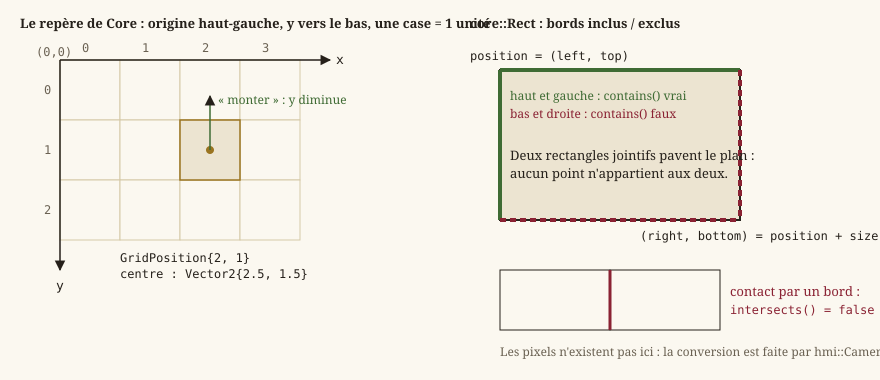

# Mathématiques du moteur

Cette page redéfinit, sans présupposer de bagage en algèbre appliquée aux jeux vidéo, les quelques
outils mathématiques dont dépend tout le reste du moteur : vecteurs, rectangles alignés aux axes,
conventions d'unités, comparaison de nombres flottants, et le générateur de hasard **déterministe**
qui alimente les jets de dés. Tout vit dans `Source/Core/Math`, quatre en-têtes.

Le moteur n'utilise **aucune** bibliothèque mathématique tierce dans `Core` (pas de DirectXMath, pas
de GLM) : un type minimal, écrit à la main, suffit aux besoins du jeu et garde `Core` totalement
indépendant de tout backend graphique (`EX-ARCH-040`) — la conversion vers les types du GPU se fait
uniquement côté `HMI`, au moment du rendu.

## `core::Vector2` : un point ou une direction dans le monde

Un **vecteur 2D** est simplement une paire de nombres `(x, y)`. Il sert à deux usages différents
selon le contexte, qu'il faut garder à l'esprit en lisant le code :

- comme **position** : « où se trouve cette entité dans le monde ? » (`core::Transform::position`) ;
- comme **direction** : « dans quel sens le joueur veut-il aller ? »
  (`core::ExplorationIntent::move`), qu'une vitesse en unités monde **par seconde** transforme en
  déplacement.

`core::Vector2` porte deux `float`, `x` et `y` (nuls par défaut), un constructeur à deux
composantes, et fournit l'algèbre nécessaire :

- **addition/soustraction** (`+`, `-`, et les formes composées `+=`, `-=`) : combiner deux
  positions ou deux déplacements composante par composante — additionner une position et une
  vitesse × temps donne la nouvelle position ;
- **produit par un scalaire** (`*`, `/`, `*=`, `/=` ; le scalaire se place à gauche ou à droite) :
  allonger ou raccourcir un vecteur sans changer sa direction (multiplier une direction par une
  vitesse scalaire donne un vecteur vitesse) ;
- **opposé** (unaire `-`) : inverser un sens (`-v` va exactement à l'opposé de `v`) ;
- **produit scalaire** ([dot product](https://fr.wikipedia.org/wiki/Produit_scalaire) ⧉,
  `core::Vector2::dot`) : `a.dot(b) = a.x*b.x + a.y*b.y`. Géométriquement, ce nombre unique résume
  la relation entre deux directions : positif si elles pointent globalement dans le même sens,
  négatif si elles s'opposent, nul si elles sont perpendiculaires. C'est l'opération fondamentale
  des calculs d'angle et de projection — l'éditeur s'en sert pour mesurer la distance d'un clic à
  un lien du graphe du monde (`Editor/Logic/WorldGraphLayout.cpp`) ;
- **longueur** (`core::Vector2::length`, [norme euclidienne](https://fr.wikipedia.org/wiki/Norme_euclidienne) ⧉) :
  la distance entre l'origine et le point `(x, y)`, calculée par le théorème de Pythagore :
  `sqrt(x*x + y*y)` ;
- **normalisation** (`core::Vector2::normalized`) : produit un vecteur de **même direction** mais de
  longueur exactement **1** (un « vecteur unitaire »), en divisant chaque composante par la
  longueur. Utile pour obtenir une direction pure, indépendante de la distance — par exemple
  normaliser l'intention de déplacement (`core::ExplorationIntent::move`, de longueur au plus 1)
  garantit qu'une diagonale ne va pas plus vite qu'un mouvement cardinal, alors que `(1, 1)` non
  normalisé a une longueur de `√2 ≈ 1,41`, soit 41 % plus rapide qu'attendu sans cette étape. Cas
  particulier : normaliser le vecteur nul (longueur quasi nulle) n'a pas de direction définie —
  `normalized()` renvoie alors le vecteur nul plutôt que de diviser par zéro.

### `core::Vector2::lengthSquared` : éviter la racine carrée

`lengthSquared()` renvoie `x*x + y*y`, **sans** appeler `sqrt`. La racine carrée est une opération
relativement coûteuse comparée à une multiplication ; or, pour de nombreuses questions, on n'a pas
besoin de la longueur exacte, seulement de **comparer** deux longueurs (« ce vecteur est-il plus
long que celui-là ? », « cette distance est-elle inférieure à un seuil ? »). Comme la fonction
racine carrée est **croissante**, comparer `a.lengthSquared() < b.lengthSquared()` donne exactement
le même résultat que comparer `a.length() < b.length()`, sans jamais calculer de racine — une
optimisation classique et systématique en géométrie appliquée aux jeux.

### Égalité approchée

`operator==` sur deux `Vector2` (comme `core::approximatelyEqual` sur deux `float`, voir plus bas)
compare avec une **tolérance**, pas une égalité binaire exacte ; `operator!=` en est la négation.
C'est nécessaire parce que l'arithmétique flottante accumule de minuscules erreurs d'arrondi : deux
calculs mathématiquement équivalents (par exemple `(a + b) + c` et `a + (b + c)`) peuvent produire
des `float` légèrement différents au dernier bit. Comparer de tels résultats avec `==` strict
échouerait de façon imprévisible et intermittente — un piège classique documenté plus bas.

> **Attention** — Une égalité à tolérance n'est **pas transitive** : `a == b` et `b == c`
> n'impliquent pas `a == c`. Un `Vector2` ne doit donc jamais servir de clé d'un conteneur
> ordonné ou haché. Pour désigner une case, le moteur emploie `core::GridPosition`, en entiers.

## `core::Rect` : le rectangle aligné aux axes

Une [AABB](https://en.wikipedia.org/wiki/Bounding_volume) ⧉ (*Axis-Aligned Bounding Box*, « boîte
englobante alignée aux axes ») est la forme géométrique la plus simple pour représenter une zone :
un **rectangle dont les côtés sont toujours parallèles aux axes X et Y** — jamais tourné. C'est un
compromis délibéré : une forme tournée ou complexe (cercle, polygone) serait bien plus chère à
tester, pour un gain inutile dans un monde fait de grilles de tuiles alignées aux axes.

`core::Rect` décrit un tel rectangle par son **coin haut-gauche** (`position`) et sa **taille**
(`size`, dimensions attendues positives ou nulles — rien ne le vérifie, c'est une précondition) ;
le constructeur `Rect(topLeft, dimensions)` les prend dans cet ordre, et `core::Rect::left`,
`core::Rect::right`, `core::Rect::top`, `core::Rect::bottom` en donnent les bords
(`right = left + largeur`, `bottom = top + hauteur`).



Deux tests suffisent aux usages du moteur — la zone visible de la caméra
(`hmi::Camera2D::visibleBounds`), l'emprise d'une tuile projetée (`core::IsoProjection`) :

- `core::Rect::contains(point)` est **inclusif** en haut/à gauche et **exclusif** en bas/à droite,
  pour qu'une grille de rectangles jointifs pave le plan sans recouvrement ni trou : un point posé
  exactement sur la frontière entre deux cases appartient à **une seule** d'entre elles ;
- `core::Rect::intersects(other)` exige une aire commune strictement positive : deux rectangles
  qui se touchent seulement par un bord ne se recouvrent pas. Le test est le classique « séparation
  par un axe » : il n'y a pas d'intersection si l'un est entièrement à gauche, à droite, au-dessus
  ou au-dessous de l'autre.

## Conventions d'unités et de repère

Trois conventions, fixées une fois pour toutes et valables dans **tout** `Core`, expliquent la
plupart des signes rencontrés dans le code de déplacement et de niveau :

- **Une tuile = une unité monde.** Les positions, tailles et vitesses sont exprimées en
  « unités monde » (ou « unités par seconde » pour les vitesses), **jamais en pixels** à l'intérieur
  de `Core`. Une entité large de `1.0` occupe exactement une case de la grille de niveau. La
  conversion vers les pixels affichés à l'écran n'a lieu **qu'au moment du rendu**, côté `HMI` —
  c'est `hmi::Camera2D::PIXELS_PER_UNIT`, multiplié par le zoom, qui la fixe
  ([Rendu 2D : de la scène à l'écran](guide-rendu.md)). `Core` n'a aucune idée de la résolution de
  la fenêtre ni du zoom de la caméra, ce qui le garde testable sans ouvrir de fenêtre.
- **Origine en haut-gauche, `y` vers le bas** (`EX-ARCH-020`) — la convention standard de
  l'affichage écran (héritée du sens de balayage d'un moniteur, ligne du haut en premier), à
  l'opposé de la convention mathématique habituelle où `y` monte. Conséquence directe et
  contre-intuitive pour qui découvre ce domaine : « monter » (aller vers le nord de la carte)
  correspond à une coordonnée `y` qui **diminue** — s'y référer dès qu'un signe surprend. La grille
  d'une carte suit le même repère en entiers : `core::GridPosition{column, row}`, colonne vers la
  droite, ligne vers le bas ([Niveaux : modèle, couches, entités, chargement](guide-niveaux.md)).
- **Angles en radians**, pas en degrés (`core::Transform::rotation`) — la convention native des
  fonctions trigonométriques du C++ standard (`std::sin`, `std::cos`, …), qui évite une conversion à
  chaque appel.

Garder ces trois conventions en tête suffit à expliquer, sans avoir à les redériver, la quasi-
totalité des signes et des sens de déplacement rencontrés dans le moteur.

## Comparaison flottante : pourquoi l'égalité stricte est dangereuse

Les nombres à virgule flottante (`float`) ne représentent pas exactement toutes les valeurs
réelles : ils utilisent une précision finie, et des opérations en apparence anodines (addition
répétée, division) introduisent de minuscules erreurs d'arrondi. Un exemple classique : en C++,
`0.1f + 0.2f == 0.3f` est **faux**, car ni `0.1`, ni `0.2`, ni `0.3` ne sont représentables
exactement en binaire — le résultat de l'addition diffère de `0.3f` de quelques millionièmes.
Comparer deux flottants issus de calculs différents (même mathématiquement équivalents) avec `==`
strict est donc fragile : le test peut échouer de façon imprévisible selon l'ordre des opérations,
l'optimiseur du compilateur, ou l'architecture du processeur.

`core::approximatelyEqual(lhs, rhs, tolerance)` (`Core/Math/MathUtils.h`) résout ce problème en
comparant deux `float` à une tolérance près, à la fois **relative** et **absolue** :

```
|lhs − rhs| ≤ tolerance × max(1, |lhs|, |rhs|)
```

Pour des valeurs de magnitude inférieure à 1, la tolérance est **absolue** (`tolerance` tel quel :
un plancher, utile près de zéro, où une tolérance purement relative deviendrait nulle) ; au-delà,
elle est **relative** (proportionnelle au plus grand opérande : deux positions à `1000.0` qui
diffèrent de `0.001` sont égales, ce qu'une tolérance absolue de `1e-5` refuserait). La tolérance
par défaut est `core::EPSILON`, `1e-5`, adaptée à des coordonnées en unités monde — une case vaut 1,
et un cent-millième de case n'a aucun sens physique. C'est la fonction que `Vector2::operator==`
appelle composante par composante, et celle que les tests du moteur utilisent systématiquement pour
comparer des résultats de calcul flottant plutôt qu'un `==` direct.

## Le hasard déterministe : `core::DeterministicRandom`

Un jeu de rôle tire des dés en permanence : jet d'attaque, dégâts, initiative, jet de compétence.
Mais un tirage qui lirait l'horloge système ou `std::random_device` rendrait la partie
**irreproductible** : un test qui rejoue un combat n'obtiendrait jamais le même résultat, et un bug
observé une fois ne se reproduirait pas. Le moteur exige donc que toute source de hasard soit un
générateur à **graine explicite** (`EX-NFR-002`) : même graine, même suite de valeurs, sur toute
machine. `Core/Math/DeterministicRandom.h` en fournit un, sans dépendance à `<random>` — dont les
distributions ne sont pas garanties identiques d'une bibliothèque standard à l'autre.

### `core::splitMix64` et `core::deriveSeed` : fabriquer des graines

`core::splitMix64(value)` est une fonction **pure** de mélange
([SplitMix64](https://en.wikipedia.org/wiki/Xorshift#Initialization) ⧉) : elle transforme un entier
64 bits en un autre, bien distribué, par trois étapes de décalage-xor-multiplication. Deux valeurs
voisines (`1` et `2`) donnent des résultats sans rapport apparent — c'est ce qu'on attend d'une
graine. Elle est `constexpr` : une graine peut se calculer à la compilation.

`core::deriveSeed(baseSeed, step, entityId)` combine une graine de base, un numéro de pas et un
identifiant reproductible (l'index d'une entité, par exemple) en une graine **propre à ce triplet**,
en enchaînant trois `splitMix64` avec un xor entre chaque. L'intérêt est de ne dépendre d'aucun
compteur partagé : deux tirages faits pour le même triplet donnent la même graine, quel que soit
l'ordre ou le nombre d'appels intercalés — là où un générateur unique consommé par tout le monde
ferait dépendre le résultat d'un tirage de tout ce qui a tiré avant lui.

### La suite de valeurs

`core::DeterministicRandom` se construit avec une graine (`explicit`, jamais par défaut : on ne
peut pas oublier de la donner) et avance son état interne d'une constante à chaque tirage, en
passant l'état par `splitMix64` :

| Fonction | Renvoie | Détail |
|---|---|---|
| `core::DeterministicRandom::nextUInt32` | Le prochain entier 32 bits de la suite. | Les 32 bits **hauts** du mélange : les meilleurs. |
| `core::DeterministicRandom::nextFloat01` | Un `float` dans `[0, 1[`. | `nextUInt32() / 2³²` ; 1 exclu. |
| `core::DeterministicRandom::nextRange(min, max)` | Un `float` dans `[min, max]`. | `min + nextFloat01() × (max − min)` ; `max == min` rend `min` sans discriminer. |
| `core::DeterministicRandom::nextInt(min, max)` | Un entier dans `[min, max]`, **bornes comprises**, sans biais. | Ci-dessous. `max <= min` rend `min` sans tirer : un intervalle vide est une valeur fixe, pas une erreur. |

### `nextInt` : pourquoi pas un modulo

La forme évidente d'un dé, `nextUInt32() % 20 + 1`, est **fausse** : 2³² n'est pas un multiple de
20, si bien que les `2³² mod 20` premières valeurs sortent une fois de plus que les autres. Sur un
d20 le biais est d'environ un dix-millionième — négligeable en jeu —, mais il est *systématique*,
va toujours dans le même sens, et rendrait indéfendable toute mesure de distribution faite sur ce
générateur (par exemple pour vérifier une règle sur mille tirages). La méthode retenue est celle
du **rejet** : on calcule le nombre de valeurs « en trop » (`2³² mod étendue`), on rejette les
tirages qui tombent dans cette queue, et on recommence. Le nombre d'itérations est fini avec
probabilité 1 et sa moyenne est inférieure à 2 pour toute étendue réaliste.

Le détail qui compte : la queue rejetée est la queue **basse**, `[0, reste[`, et non la haute.
Rejeter « au-delà du dernier multiple complet » se lit mieux, mais ce seuil vaut 2³² quand
l'étendue divise 2³² — et 2³² ne tient pas dans un `std::uint32_t` : il retombe à 0, la condition
devient toujours vraie, la boucle ne se termine jamais. Le défaut ne se voit que sur les
**puissances de deux** : un d6 et un d20 passent, un d8 bloque. C'est un test de rejouabilité sur
3d8 qui l'a trouvé, pas une relecture — la raison pour laquelle le générateur a une suite de tests
de distribution et non seulement un test de reproductibilité.

### Qui tire les dés

Le générateur ne sait rien des dés ; ce sont les règles qui l'appellent, toujours en le recevant
en **paramètre** — jamais un générateur global : `core::rollCheck` (jets de compétence),
`core::rollAttack` et les dégâts ([Règles d20 et personnages](guide-regles.md), [Combat tactique](guide-combat.md)),
et `core::Arena` pour l'initiative. Le passer en paramètre est ce qui rend un combat rejouable :
un test construit un `DeterministicRandom{42}`, joue, et compare à un résultat connu.

## Voir aussi
- `core::Vector2`, `core::Rect`, `core::approximatelyEqual`, `core::EPSILON`.
- `core::DeterministicRandom`, `core::splitMix64`, `core::deriveSeed`.
- [ECS : entités, composants, systèmes](guide-ecs.md) — `Transform`, le composant qui porte ces types.
- [Rendu 2D : de la scène à l'écran](guide-rendu.md) — la conversion des unités monde en pixels.
- [Boucle de jeu et pas de temps fixe](guide-boucle.md) — l'autre condition du déterminisme : le pas fixe.
- [`exigences-non-fonctionnelles.md`](../Specification/exigences-non-fonctionnelles.md) — `EX-NFR-002`, le déterminisme exigé.
