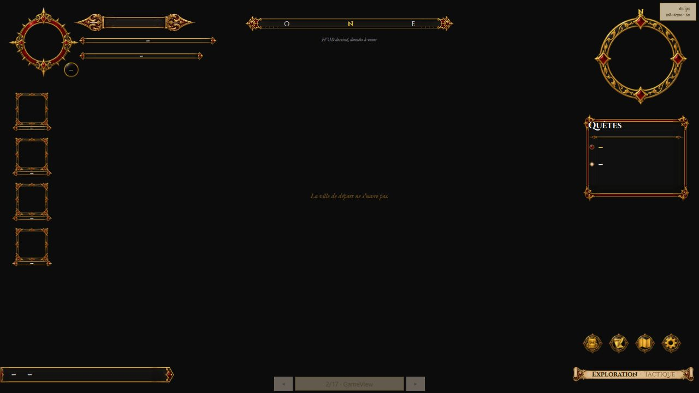
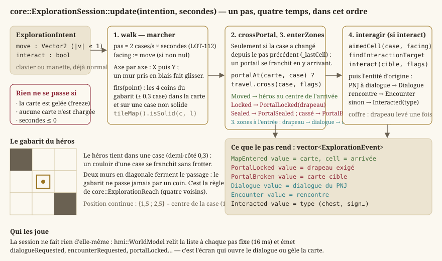
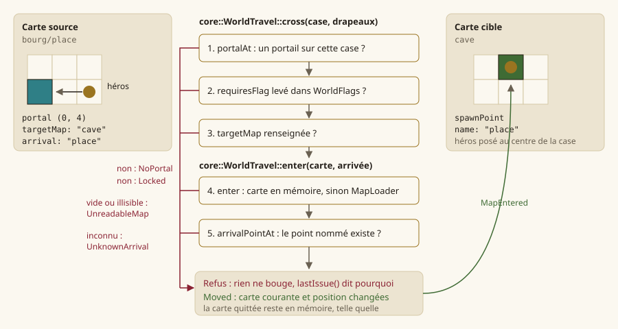
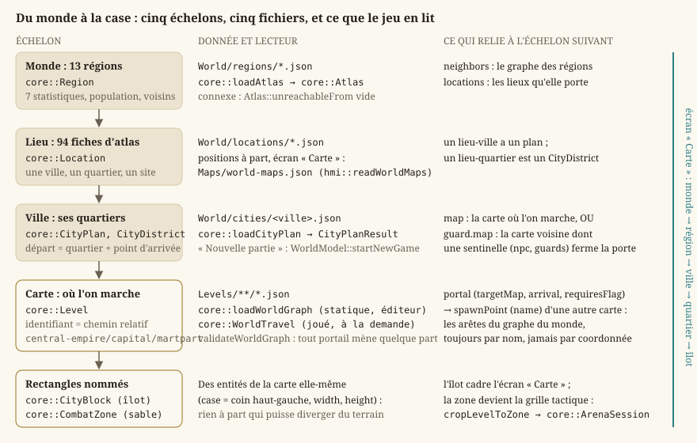
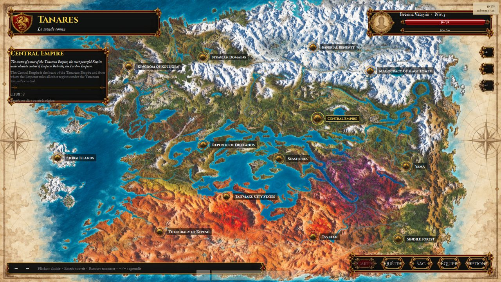
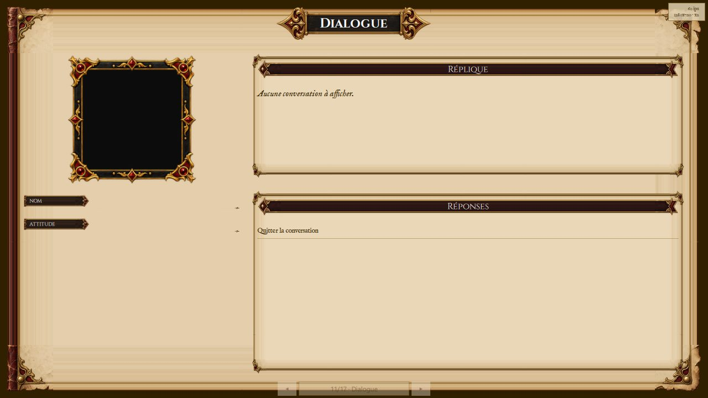
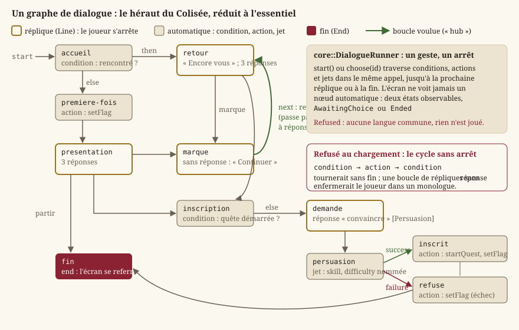

# Monde et exploration

Une carte ([Niveaux : modèle, couches, entités, chargement](guide-niveaux.md)) n'est qu'une donnée :
elle ne bouge pas. Cette page décrit ce qui la **fait vivre** — un héros qui marche, parle à ce
qu'il regarde, franchit des portails et descend sur le sable — et ce qui relie les cartes entre
elles, du monde entier jusqu'à l'îlot d'un quartier. Tout cela vit dans `Source/Core/World/`,
`Source/Core/Gameplay/` et `Source/Core/Rpg/Dialogue.*` : de la simulation **pure**, sans Qt ni
GPU (`EX-NFR-004`), que l'interface met à l'écran et que les tests jouent sans fenêtre.

## Définitions

- **Session d'exploration** — la moitié « temps réel » du jeu (`EX-VIS-001`) : un héros à
  position **continue** sur la grille d'une carte, une orientation, la carte courante, les faits
  acquis de la partie. C'est `core::ExplorationSession`, jumelle de la session de combat
  (`core::ArenaSession`, [Combat tactique](guide-combat.md)) : un lieu et une arène se
  **dessinent** par le même code, ils se **simulent** par deux sessions (décision de l'auteur,
  `LOT-09`).
- **Pas d'exploration** — un appel à `core::ExplorationSession::update` avec une **intention**
  (direction voulue, touche d'interaction) et une durée. Le pas ne connaît ni pixel ni projection :
  il marche en cases par seconde, et rend une liste d'**événements** que l'appelant joue.
- **Portail** et **point d'arrivée** — deux entités de carte. Le portail nomme une carte cible et
  un point d'arrivée **par son nom**, jamais par des coordonnées ; le point d'arrivée est la case
  nommée où l'on apparaît. Un portail peut exiger un **drapeau**.
- **Graphe du monde** — les cartes du dossier des niveaux et les portails qui les relient. Il
  existe deux fois : **statique** (`core::WorldGraph`, ce que l'éditeur montre et valide) et
  **joué** (`core::WorldTravel`, qui charge les cartes à la demande et déplace le héros).
- **Atlas, région, lieu** — le monde de Tanares tel que le corpus le décrit : treize régions et
  quatre-vingt-quatorze lieux (`core::Atlas`, `LOT-37`). Une région est un nœud d'un graphe de
  voisinage ; un lieu est une carte à créer.
- **Ville, quartier, îlot** — une ville jouable nomme ses quartiers (`core::CityPlan`,
  `LOT-96`) ; chaque quartier a **soit** la carte où l'on marche, **soit** la carte voisine où une
  sentinelle garde sa porte. Un îlot (`core::CityBlock`) est un rectangle nommé de la carte d'un
  quartier, que l'écran « Carte » cadre.
- **Fait de partie** — ce qui a eu lieu et ne doit pas avoir lieu deux fois : coffre ouvert,
  ennemi vaincu, quête démarrée, porte déverrouillée. Un ensemble de clés texte
  (`core::WorldFlags`) qui vit **à côté** des entités et survit au changement de carte.
- **Zone de combat** — le rectangle nommé d'une carte où l'on se bat, et lui seul
  (`core::CombatZone`, `EX-LVL-018`) : la session d'arène reçoit une carte **réduite** à la zone.
- **Dialogue** — un graphe de nœuds sans aucun texte (`core::DialogueGraph`) et la machine à
  états pure qui le joue (`core::DialogueRunner`, `LOT-15`).

## Qui appelle qui

Côté interface, `hmi::WorldModel` (un singleton QML) tient la partie : il possède un
`hmi::WorldPlay`, qui possède la session ; toutes les 16 ms, il passe à `update` l'intention que
l'écran a tenue (`setMove`, `interact`) et traduit les événements rendus en signaux
(`dialogueRequested`, `encounterRequested`, `portalLocked`, `portalBroken`, `mapEntered`). C'est
l'**écran** qui ouvre le dialogue ou le Colisée, et qui **gèle** la carte pendant ce temps ; le
modèle ne décide rien du monde. Le singleton n'est pas un détail : la pile d'écrans détruit la vue
de jeu quand un autre écran la recouvre, et une session possédée par l'écran mourrait avec elle —
on reviendrait du sable sur une carte neuve, héros à la porte, exactement ce que le `LOT-09`
interdit. Le détail est dans [Écrans, navigation et boucle de jeu](guide-ecrans.md) ; le dessin de
la scène (composeur, caméra qui suit le héros) dans [Rendu 2D : de la scène à l'écran](guide-rendu.md).

> **Note** — Les premiers lots avaient posé l'exploration dans un orchestrateur `GameSession` et
> des **modes de jeu** (`LOT-05` : exploration, dialogue, combat, chacun avec son ordre de passes ;
> `LOT-06` : le déplacement par balayage continu ; `LOT-18` : le mode combat qui gèle
> déplacement, mécanismes et issue). Le `LOT-09` a remplacé cet orchestrateur par la session pure
> décrite ici, et la table rase du `LOT-102` a retiré ce qui en restait. Les **règles** de ces
> lots demeurent — la diagonale n'est pas plus rapide, un mur pris en biais fait glisser, le
> monde est gelé pendant un dialogue — mais elles vivent désormais dans `ExplorationSession` et
> dans le gel de `hmi::WorldModel`.

## La session d'exploration : `core::ExplorationSession`

Fichier : [`ExplorationSession.h`](../../Source/Core/World/ExplorationSession.h).

### Le repère : `core::CellPoint`

La position du héros est **continue, en cases** : `{1.5, 2.5}` est le centre de la case `(1, 2)`.
`core::cellOf` rend la case qui contient un point (partie entière), `core::cellCenter` le centre
d'une case (`+ 0,5`). Le nom diffère volontairement de `core::centerOf`, qui compte en demi-cases
pour la ligne de vue du combat : deux repères, deux noms. La collision se lit sur la **grille
racine** de la carte (`core::Level::tileMap`), la seule qui porte le masque (`EX-LVL-016`,
`EX-EXP-002`) : repeindre le sol ne change rien à ce qui bloque.

### L'intention et les événements

`core::ExplorationIntent` porte `move` (la direction voulue, de longueur au plus 1, déjà
normalisée par l'entrée : la diagonale ne va pas plus vite, `EX-EXP-001`) et `interact` (vrai le
pas où le joueur presse la touche d'interaction). Un pas rend des `core::ExplorationEvent`, chacun
avec une nature (`core::ExplorationEventKind`), une valeur et une case :

| Nature | `value` | Ce que l'appelant doit faire |
|---|---|---|
| `MapEntered` | l'identifiant de la carte | recomposer la scène, relancer le fondu |
| `PortalLocked` | le drapeau exigé | dire que la porte est fermée |
| `PortalBroken` | la carte cible | signaler un contenu cassé (`EX-NFR-040`) |
| `Dialogue` | l'identifiant du dialogue | ouvrir l'écran de dialogue, geler la carte |
| `Encounter` | l'identifiant de la rencontre | engager le combat, geler la carte |
| `Interacted` | le type de l'entité (`chest`, `sign`…) | jouer l'interaction sans autre suite |

### `start` : entrer sur une carte

`core::ExplorationSession::start(mapId, arrival)` entre sur la carte au point d'arrivée nommé —
vide, c'est l'**entrée** de la carte, ce que fait « Nouvelle partie » — via
`core::WorldTravel::enter`. En cas de succès, la liste des entités interactives est relue, le
héros est posé au **centre** de la case d'arrivée et la case courante est mémorisée ; sinon la
fonction rend faux, et `travel().lastIssue()` dit pourquoi.

### `update` : un pas, trois temps

`core::ExplorationSession::update(intent, seconds)` ne fait rien si la carte est gelée, si aucune
carte n'est chargée ou si la durée n'est pas positive. Sinon, **dans cet ordre** : on marche, on
franchit le portail de la case atteinte, puis on interagit. L'ordre compte : marcher *après* avoir
franchi ferait faire au héros un pas sur la carte d'arrivée avec l'intention qui l'a fait entrer.

**Marcher (`walk`).** Si l'intention est nulle, rien ; sinon l'orientation prend la direction
demandée (`EX-EXP-004` : elle est **conservée à l'arrêt**) et le héros avance de
`WALK_SPEED_CELLS_PER_SECOND × seconds` (2 cases par seconde, soit 3 m/s aux 1,5 m de la case —
une marche vive). La vitesse fixe la cadence de la figurine : un cycle de marche couvre une case,
il dure donc une demi-seconde, et une marche plus rapide que son dessin fait glisser les pieds
(`LOT-112` ; la vitesse était de 4 cases par seconde, une course). Le déplacement est résolu **axe par axe** :
d'abord la composante X, si le gabarit tient à l'arrivée ; puis la composante Y. C'est ce qui fait
qu'un mur pris en biais fait **glisser** le long au lieu d'arrêter net (`EX-EXP-003`,
`EX-GP-014`) — la différence entre un couloir jouable et un couloir où l'on s'accroche.

**Le gabarit (`fits`).** Le héros ne tient pas tout à fait une case : `HERO_HALF_SIZE_CELLS` vaut
0,3. `fits` vérifie que les **quatre coins** du carré `± 0,3` autour du point tombent dans la carte
et sur une case non solide (`core::TileMap::isSolid`, `EX-GP-002`). Quatre coins et non le seul
centre : un héros qui tient dans un couloir d'une case ne doit pas pouvoir couper l'angle d'un mur
par sa demi-case. Corollaire : deux murs en diagonale ferment le passage, le gabarit ne passe jamais
par un coin.

**Franchir (`crossPortal`).** Un portail se franchit **en y arrivant**, pas à chaque pas où l'on
reste dessus : la session compare la case du héros à celle du pas précédent (`_lastCell`), et ne
fait rien si elle n'a pas changé — sans quoi un portail qui ramène sur place bouclerait. Sur une
case neuve, `core::portalAt` cherche un portail ; s'il y en a un, `core::WorldTravel::cross`
décide. `Moved` : la liste des interactifs est relue, le héros est posé au centre de l'arrivée, et
`MapEntered` est rendu avec la carte et la case. `Locked` : `PortalLocked` avec le drapeau exigé.
`UnreadableMap` ou `UnknownArrival` : `PortalBroken` avec la carte cible. `NoPortal` n'arrive pas
ici, puisqu'on a déjà vu le portail.

**Interagir (`resolveInteraction`).** Si `interact` est vrai : la session bâtit un
`core::InteractionCandidate` par entité interactive, et `core::findInteractionTarget` désigne la
cible depuis la case du héros, son orientation, la grille de collision et les drapeaux. Sans cible,
rien. Avec une cible, `core::interact` la résout (et lève son drapeau si elle se consomme). Puis
la session **retrouve l'entité d'origine** sur la carte — par sa case et son type, l'identité même
d'une entité de carte, car la liste des interactifs ne copie pas les propriétés — pour savoir quoi
rendre : `core::dialogueTriggerFor` donne un `Dialogue`, `core::encounterTriggerFor` un
`Encounter`, sinon `Interacted` avec le type.

### Les autres fonctions

- `map()` rend la carte courante (`nullptr` avant une entrée réussie), `mapId()` son identifiant.
- `heroPoint()` la position continue, `heroCell()` sa case, `facing()` la dernière direction non
  nulle prise (initialement vers le bas), `aimedCell()` la case regardée (`core::aimedCell`).
- `placeHero(point)` pose le héros où l'appelant le veut, et met la case mémorisée à jour — c'est
  le retour du sable à la case relevée, et le `--at=` de l'essai de l'éditeur (`LOT-EDITOR-10`).
- `freeze(bool)` / `frozen()` : gelée, la session ne bouge plus et n'interagit plus. C'est l'état
  de la carte pendant un dialogue ou un combat, qui la laisse **telle quelle** sans la détruire :
  la reprendre rend le lieu comme on l'a quitté.
- `flags()` donne accès aux faits de la partie, `travel()` au voyage (lecture seule),
  `interactables()` aux entités interactives de la carte courante, dans l'ordre des entités.

`rebuildInteractables`, privée, relit ces entités à chaque changement de carte avec **la même
table** que le peuplement ECS (`core::knownInteractableKinds`) et la **même fabrique de clé**
(`core::keyForEntity`) : la session du jeu n'a pas d'ECS, mais elle ne peut pas avoir sa propre
idée de ce qui est interactif.

### `core::ExplorationReach` : ce que le héros peut atteindre

Fichier : [`ExplorationReach.h`](../../Source/Core/World/ExplorationReach.h). Le contrôle de
contenu de l'éditeur (`LOT-EDITOR-07`) doit dire si un PNJ, un portail ou un coffre est
**atteignable** depuis l'entrée. La règle découle du gabarit : le héros passe sur toute case non
solide et ne passe d'une case à l'autre que par un côté, jamais par un coin. `core::ExplorationReach`
est donc un parcours en largeur des cases non solides reliées **en quatre voisins** aux départs
donnés ; `reaches(cell)` répond, `count()` compte. Un départ hors carte ou sur une case solide
n'atteint rien, pas même sa case. Un `static_assert` lie la règle au gabarit : si
`HERO_HALF_SIZE_CELLS` dépassait 0,5, un couloir d'une case ne se passerait plus et ce parcours
mentirait. Ce n'est **pas** l'aire atteignable du combat (`core::ReachableArea`, `LOT-19`), qui
coupe les diagonales libres et compte double le terrain difficile : deux questions, deux règles.

## Les faits de la partie : `core::WorldFlags`

Fichier : [`WorldFlags.h`](../../Source/Core/Gameplay/WorldFlags.h) (`LOT-10`).

Le piège fondateur : *ouvrir un coffre deux fois ne doit donner le butin qu'une fois, y compris
après un aller-retour de carte*. Un booléen sur l'entité ne tient pas — l'entité est détruite et
recréée depuis le fichier de niveau à chaque changement de carte, et le drapeau partirait avec
elle. Le coffre redonnerait son butin à chaque passage : un défaut qui ne casse rien, ne lève
aucune alerte, et se confond avec de la générosité de conception. L'état vit donc **à côté** des
entités, dans un ensemble ordonné de clés texte qui survit au chargement de carte et que la
sauvegarde (`LOT-150`) écrira telle
quelle.

- `core::WorldFlags::isSet(key)` — vrai si le fait est acquis.
- `core::WorldFlags::set(key)` — marque le fait acquis et rend **faux s'il l'était déjà**. C'est
  cette valeur qui répond à « le coffre a-t-il déjà été ouvert ? » : demander (`isSet`) puis
  écrire (`set`) laisserait entre les deux une fenêtre où un second appel donnerait le butin deux
  fois.
- `core::WorldFlags::clear(key)` — efface un fait (une quête qu'on rouvre, les tests).
- `size()`, `all()` — le compte, et la liste triée que la sauvegarde écrira.

Les clés sont des chaînes plutôt qu'un type fermé : les quêtes
(`LOT-116`) y écrivent des drapeaux
que ce fichier ne peut pas énumérer. La contrepartie — une faute de frappe passe — est traitée par
`core::keyForEntity(mapName, type, column, row)`, qui **fabrique** la clé d'une entité de carte :
`"<carte>/<type>@<colonne>,<ligne>"`. Deux coffres d'une même carte se distinguent par leur case ;
deux cartes ne se marchent pas dessus parce que le nom de carte ouvre la clé. La **position** sert
d'identité parce que c'est la seule chose qu'une entité possède en propre et qui ne bouge pas ;
corollaire assumé : déplacer un coffre dans l'éditeur le remet à neuf pour une partie commencée.
Les dialogues fabriquent de même `core::questStartedFlag` (`quest/<quête>/started`), pour que deux
lots ne puissent pas écrire le même drapeau différemment.

## Interagir : `Interaction.h`

Fichier : [`Interaction.h`](../../Source/Core/Gameplay/Interaction.h) (`LOT-10`). Trois fonctions
**pures** sur des listes, testables sans ECS ni fenêtre.

**`core::aimedCell(from, facing)`** — la case que vise un personnage : la **voisine dans la
direction dominante**, jamais une diagonale. Un personnage qui regarde à 30° vise la case de
droite ; viser en diagonale rendrait la cible imprévisible à la manette analogique, alors que le
joueur doit savoir ce qu'il désigne **avant** d'appuyer. À égalité exacte, l'horizontale l'emporte
(il faut un départ, et celui-là est écrit). Une orientation nulle rend la case du personnage
lui-même : rendre une voisine arbitraire ferait ouvrir un coffre qu'il ne regarde pas.

**`core::findInteractionTarget(from, facing, map, candidates, flags)`** — désigne la cible parmi
des `core::InteractionCandidate` (un pointeur de `core::Interactable` et un indice libre, rendu tel
quel : la fonction ne connaît pas l'entité, l'appelant la retrouve). Trois règles, une par critère
du lot :

1. la cible est **sur la case visée** ;
2. **l'interaction ne traverse pas un mur** : si la case visée est solide (`core::isSolid`), il n'y
   a pas de cible — la case visée étant adjacente, c'est elle-même qui doit être traversable. Sans
   cette règle, on ouvrirait un coffre à travers une cloison, ce qui se joue et ne se diagnostique
   pas ;
3. à plusieurs candidats, le choix est **déterministe** : le plus proche du **centre** de la case
   visée (au centre, pas au coin, sinon deux candidats symétriques départageraient sur un arrondi),
   et à distance égale le plus petit indice — l'ordre de parcours de l'ECS n'est pas stable.

Une cible dont le drapeau de consommation est déjà levé n'est **pas** retenue : un coffre vidé
n'est plus une cible, et continuer à l'afficher promettrait au joueur quelque chose qui n'arrivera
pas. Le résultat, `core::InteractionTarget`, porte la cible (ou rien : `found()`), son indice et la
**case visée** dans tous les cas — l'invite visuelle en a besoin même quand il n'y a rien.

**`core::interact(target, flags)`** — résout la cible : rend un `core::InteractionOutcome`
(`happened`, `consumed`, `type`, `promptKey`). C'est ici que « deux fois ne donne qu'une fois » se
joue : le drapeau est levé par `WorldFlags::set`, dont la valeur de retour remplit `consumed`.

Le composant `core::Interactable` ([`Interactable.h`](../../Source/Core/Ecs/Components/Interactable.h))
est une donnée pure : le `type` libre, la **case** (portée en plus du `Transform` parce que
l'interaction raisonne en cases, et retrouver la case depuis une position flottante laisserait un
arrondi décider aux frontières), `consumedFlag` (vide pour ce qu'on sollicite indéfiniment) et
`promptKey`, une **clé** de traduction, jamais un texte (`EX-NFR-011`). `isConsumable()` dit si
le drapeau est renseigné.

## Peupler un monde ECS : `core::spawnMapEntities`

Fichier : [`MapEntitySpawner.h`](../../Source/Core/Gameplay/MapEntitySpawner.h). La session
d'exploration n'a pas d'ECS ; les tests d'interaction et les outils qui en ont un peuplent un
`core::World` ([ECS : entités, composants, systèmes](guide-ecs.md)) d'**une entité par objet** de
la carte : un `Transform` à sa case et, si son type est connu, un `Interactable`. Un type
**inconnu** produit tout de même une entité — une erreur de conception tolérée, pas une carte
invalide (`EX-NFR-040`) : la refuser ferait disparaître un objet sans que l'auteur comprenne
pourquoi. Le rappel `onEntity(Entity, const MapEntity&)` laisse la présentation attacher ses
composants sans que `Core` connaisse l'habillage. La fonction rend le nombre d'entités créées.

`core::knownInteractableKinds()` est la **table** des familles interactives — une table et non un
`if` par cas, pour que chaque lot ajoute la sienne sans retoucher la même fonction :

| Type | Se consomme | Invite |
|---|---|---|
| `chest` | oui — le coffre ne se prend qu'une fois | `interaction.chest` |
| `sign` | non — un panneau se relit | `interaction.sign` |
| `npc` | non — ce qu'il dit dépend des drapeaux, pas d'un « déjà fait » | `interaction.npc` |

Un `core::InteractableKind` porte ce **qui ne se prend qu'une fois** : une propriété structurelle,
pas un comportement — `Core` ne connaît toujours aucune sémantique de type.

## Les portails et le voyage : `core::WorldTravel`

Fichier : [`WorldTravel.h`](../../Source/Core/World/WorldTravel.h) (`LOT-09`). Deux règles
tiennent tout le fichier : **une carte chargée n'est pas rechargée** — revenir du sable doit
rendre le lieu tel qu'on l'a laissé, pas un lieu neuf — et **un défaut est un code, pas un
texte** (`EX-NFR-011`) : `Core` n'écrit aucun message, l'interface traduit.

### Lire un portail sur la carte

`core::PortalTarget` est ce qu'un portail nomme : `map`, `arrival`, `requiredFlag` (vide si le
portail s'ouvre toujours). `core::portalAt(level, position)` rend le portail posé sur une case,
s'il y en a un ; `core::arrivalPointAt(level, name)` la case du point d'arrivée nommé. Une
propriété ne vaut que si elle est du **texte** : un entier là où l'on attend un nom de carte est
une saisie fautive, et la traiter comme vide la fait signaler plutôt que deviner. Deux points de
même nom sont un défaut du graphe : le **premier** dans l'ordre des entités l'emporte ici, et
`validateWorldMap` le relève. Les noms de type et de propriété (`portal`, `targetMap`, `arrival`,
`requiresFlag`, `spawnPoint`, `name`) sont les constantes de `EntityKinds.h`.

### `enter` et `cross`

`core::WorldTravel::enter(mapId, arrival)` charge la carte à la demande (`mapFor` : déjà en
mémoire, sinon le chargeur ; illisible, `lastIssue()` reçoit `UnreadableMap` avec le message du
chargeur) puis pose le personnage : sur l'**entrée** de la carte si le nom d'arrivée est vide, sur
le point nommé sinon — inconnu, `UnknownArrival` avec `UnknownArrivalPoint` dans `lastIssue()`. Elle
rend un `core::TravelResult` : `Moved`, `UnreadableMap` ou `UnknownArrival`.

`core::WorldTravel::cross(from, flags)` franchit le portail posé sur une case, dans cet ordre :
pas de carte ou pas de portail, `NoPortal` (le cas ordinaire d'un pas) ; drapeau exigé absent des
`WorldFlags`, `Locked` — le drapeau est exigé **du monde**, pas de la carte : la porte d'Arenarea
s'ouvrira quand la quête l'aura ouverte, et le portail se contente de le lire ; carte cible vide,
`MissingTargetMap` dans `lastIssue()` et `UnreadableMap` ; sinon le résultat de `enter`. Sur un
refus, rien ne bouge.

`currentMap()`, `currentMapId()`, `position()`, `setPosition()` (c'est le déplacement qui décide,
pas ce fichier), `lastIssue()` et `loadedMapCount()` — qui prouve, en test, qu'un retour ne
recharge rien — complètent l'objet.

### Le chargeur injecté

Le chargement est un `core::WorldTravel::MapLoader`, une fonction `mapId → LevelLoadResult`, plutôt
que du code sur `std::filesystem` : les tests décrivent leurs cinq cartes en mémoire, et `Core` ne
connaît qu'un dossier qu'on lui nomme. Deux fabriques :

- `core::WorldTravel::directoryLoader(levelsDir)` — le chargeur du jeu : `<dossier>/<mapId>.json`,
  l'identifiant pouvant contenir des barres obliques (`central-empire/capital/martpart`).
- `core::WorldTravel::directoriesLoader(levelsDirs)` — cherche dans plusieurs dossiers **dans
  l'ordre** : l'essai complet de l'éditeur (`LOT-EDITOR-10`) place les brouillons ouverts devant
  les cartes du binaire. Une carte **absente** d'un dossier est cherchée dans le suivant ; une carte
  **présente mais illisible** arrête la recherche et rend son erreur — passer au dossier suivant
  ferait jouer en silence une version périmée de la carte qu'on vient de casser.

### La validation au chargement

Un portail orphelin est relevé au **chargement**, pas à la traversée (`EX-NFR-040`). Un
`core::WorldIssue` porte la carte, la case (`{0, 0}` pour un défaut de carte entière), un
`core::WorldIssueCode` et la valeur à citer :

| Code | Ce qu'il dit | `value` |
|---|---|---|
| `UnreadableMap` | la carte n'a pas pu être lue | le message du chargeur |
| `MissingTargetMap` | un portail ne nomme aucune carte | — |
| `UnknownTargetMap` | la carte cible n'est pas dans le dossier | la carte |
| `UnreadableTargetMap` | la carte cible existe mais est illisible | la carte |
| `MissingArrivalPoint` | un portail ne nomme aucun point d'arrivée | — |
| `UnknownArrivalPoint` | la carte cible n'offre pas ce point | le point |
| `DuplicateArrivalPoint` | deux points d'une même carte portent le même nom | le nom |
| `CombatZoneDegenerate`, `CombatZoneOutOfBounds`, `CombatZoneBlocked` | une zone de combat n'est pas une grille tactique | la zone |

`core::validateWorldGraph(graph)` relève, sur un `core::WorldGraph`, les cartes illisibles puis
chaque portail dont le statut n'est pas `Resolved` (cartes par identifiant, portails dans l'ordre
des entités). `core::validateWorldMap(mapId, level)` relève ce qu'une carte **lue** porte de
fautif et que le graphe ne peut pas voir : le graphe déduplique les points d'arrivée, si bien que
deux entités du même nom y entrent comme un seul point — le doublon se voit sur la carte elle-même,
et il compte, puisque `arrivalPointAt` prend le premier ; puis les zones de combat, par
`core::validateCombatZones`.

## Le graphe statique : `core::WorldGraph`

Fichier : [`WorldGraph.h`](../../Source/Core/World/WorldGraph.h) (`LOT-11`, étendu au `LOT-09`).
C'est la **lecture** du graphe — ce que la vue « graphe du monde » de l'éditeur montre
([Éditeur de niveaux](guide-editeur.md)) — et son ordre est **déterministe** : cartes par
identifiant, portails par carte source puis dans l'ordre des entités, pour que deux lectures du
même dossier donnent le même graphe et la même vue.

- `core::WorldMapInput` — une carte telle que la construction la reçoit : identifiant, nom,
  entités, ou message d'erreur de lecture.
- `core::WorldMapNode` — un nœud : identifiant, nom, points d'arrivée **triés sans doublon**,
  erreur de lecture éventuelle (une carte illisible **reste** un nœud : la retirer ferait passer
  ses portails entrants pour des cibles inconnues), et les identifiants d'entités (ce qu'un
  `carte#id` peut citer, décision D8 de l'éditeur).
- `core::WorldPortalLink` — une arête : carte source, case, carte cible et point d'arrivée tels
  que le portail les nomme, et son `core::PortalLinkStatus`. Le statut se décide dans cet ordre,
  le premier qui s'applique l'emportant : `MissingTarget` (cible vide), `UnknownMap`,
  `TargetUnreadable` (on ne peut rien dire des points d'une carte qu'on n'a pas lue),
  `MissingArrival`, `UnknownArrival`, sinon `Resolved`. Un portail vers sa propre carte est légal.
- `core::WorldGraph::find(mapId)`, `portalsFrom(mapId)`, `portalsTo(mapId)` (quel que soit le
  statut) — les accès ; `core::WorldGraph::unreachableFrom(mapId)` — les cartes qu'aucun chemin
  de portails **résolus** ne relie au départ, dans le **sens** des portails : une carte d'où l'on
  peut partir mais où rien ne mène est injoignable. Un portail cassé ne rend pas sa cible
  joignable même si elle existe ; un départ inconnu rend toutes les cartes.
- `core::buildWorldGraph(maps)` — construit le graphe en deux passes (un portail peut viser une
  carte triée après la sienne), après un tri stable par identifiant.
- `core::mapIdOf(levelsDir, file)` — l'identifiant d'un fichier : son chemin relatif au dossier,
  sans extension, en barres obliques.
- `core::loadWorldGraph(levelsDir)` — lit chaque `*.json` du dossier **et de ses sous-dossiers**
  (les quartiers vivent sous leur ville, `LOT-96`), en écartant `sequence-*.json` et les annexes
  `*.editor.json` de l'éditeur, comme le fait le navigateur de cartes. Un dossier absent donne un
  graphe vide, sans lever.

## Du monde à la case : atlas, villes, quartiers, îlots

### `core::Atlas` : les régions et les lieux

Fichier : [`Atlas.h`](../../Source/Core/World/Atlas.h) (`LOT-37`, `EX-CNT-010`). Le chapitre des
régions du corpus, extrait vers `Source/Elements/World/regions/` et `locations/` ([Données, corpus
et ressources](guide-donnees.md)), donne au graphe de cartes de vrais nœuds : treize régions (la
feuille de route en comptait dix de mémoire ; le livre en porte treize) et leurs lieux.

- `core::RegionGrade` — les cinq notes de l'encart « Regional Statistics », **ordonnées** du plus
  bas au plus haut (`EX-CNT-060`) : une note se compare, `monsterPresence >= High` veut dire
  quelque chose. Les noms de schéma (`veryLow`… `veryHigh`) passent par `core::regionGradeName` et
  `core::regionGradeFromName` ; un test vérifie qu'ils coïncident avec `region.schema.json`
  (`EX-CNT-011`).
- `core::RegionAppraisal` — une note et sa **portée** (« north », « underground »), vide dans la
  région uniforme. `core::RegionStatistic` — une liste d'appréciations, jamais vide
  (`EX-CNT-061`) : le Benênet impérial est « Low (south), High (north) », et l'aplatir sur une
  note inventerait une donnée. `grade()` rend la première, pour le code qui ne modélise pas les
  portées ; `varies()` dit si la région n'est pas uniforme.
- `core::RegionAxis` — les sept axes, dans l'ordre du livre (liberté des citoyens, crime,
  prospérité, corruption, accès à la magie, présence des monstres, stabilité politique) ;
  `core::regionAxisName` donne le nom de schéma. `core::Region::statistic(axis)` rend l'axe.
- `core::RegionPopulation` et `core::RegionSpeciesShare` — un total **optionnel** (le livre écrit
  parfois une population sans chiffre : distinguer « pas de chiffre » de « zéro habitant » est
  tout l'objet de l'optional), les parts par espèce (clés **en anglais**, qui ne pointent pas vers
  le catalogue d'espèces : une correspondance à moitié vide serait pire qu'un champ dont on sait
  qu'il ne pointe nulle part), la part « others ».
- `core::Region` — identifiant, nom, source, gouvernement, faction, population, les sept
  statistiques, **`neighbors`** (les arêtes) et **`locations`** (les cartes à créer).
  `core::Location` — un lieu nommé : identifiant, nom, source, région porteuse, description.
- `core::Atlas` — régions et lieux triés par identifiant, et `errors` : un atlas dont un lieu sur
  quatre-vingt-quatorze est illisible **reste jouable**, et le refuser en bloc rendrait le monde
  inaccessible pour une virgule. `findRegion`, `findLocation` ; `core::Atlas::unreachableFrom(id)`
  rend les régions qu'aucun chemin de voisins ne relie au départ (`EX-CNT-062`) — vide sur un
  atlas sain, et rien d'autre ne le signalerait : une région injoignable est du contenu que
  personne ne verra jamais.
- `core::loadAtlas(directory)` — balaye `regions/` et `locations/` (jamais une liste écrite en
  code : le premier lieu ajouté en sortirait invisible), ne lève jamais (`EX-NFR-040`). Un
  dossier **absent** produit une erreur, pas un atlas vide : un monde vide se confondrait avec un
  monde non installé ; de même un atlas sans aucune région. Une note inconnue n'est pas rabattue
  sur `normal` — ce serait une région paisible par accident, indiscernable d'une région paisible
  par conception.

### `core::CityPlan` : une ville et ses quartiers

Fichier : [`CityPlan.h`](../../Source/Core/World/CityPlan.h) (`LOT-96`). Une ville jouable
(`Source/Elements/World/cities/<ville>.json`) **relie** sans rien redécrire : ni le quartier (sa
fiche d'atlas), ni sa position (le plan, `world-maps.json`), ni ses rues (sa carte).

- `core::CityDistrict` — la fiche d'atlas du quartier (`id`), l'identifiant de sa carte (`map`)
  **ou** la carte où se tient sa porte gardée (`guardMap`) ; `hasMap()` dit si l'on y marche. La
  porte gardée est une entité `npc` dont la propriété `guards` nomme le quartier fermé ; son
  dialogue est un refus, et une porte fermée n'a pas de point d'arrivée — on n'arrive de nulle
  part par une porte fermée.
- `core::CityPlan` — identifiant, nom, `location` (la fiche d'atlas de la ville, qui est aussi la
  clé de son plan), le quartier et le point d'arrivée de **départ**, les quartiers. `find(id)`,
  `districtOfMap(mapId)` (le quartier dont c'est la carte), `startMap()` (la carte du quartier de
  départ).
- `core::loadCityPlan(file)` rend un `core::CityPlanResult` (`plan`, `error`, `ok()`), sans
  lever. Refusés : un fichier absent ou mal formé, une ville sans quartier, un quartier qui n'a
  **ni** carte **ni** porte gardée — ou les deux : une saisie fautive, pas un cas à interpréter —,
  et un départ dont le quartier n'a pas de carte, car « Nouvelle partie » n'aurait nulle part où
  poser le héros.

C'est ce que lit `hmi::WorldModel::startNewGame` : la ville de départ (`capital`), son quartier de
départ, son point d'arrivée, puis `enter`. Le modèle en tire aussi le quartier courant
(`districtId`) et les quartiers visités, que le plan de la ville montre.

> **Note** — Depuis la table rase du `LOT-102`, `World/cities/` et `Levels/` ne contiennent que
> leur README : les cartes 2D HD reviennent avec le `LOT-107`, le `LOT-109` et le `LOT-111`, et le
> plan de la Capitale avec le `LOT-121`. Sans plan, le jeu le dit sans planter — c'est la capture
> en tête de page. Les tests jouent sur la racine d'essai `Source/Test/Fixtures/GameData/` : la
> ville `bourg`, ses cartes `bourg/place`, `cave` et `donjon`.

### `core::CityBlock` : l'îlot

Fichier : [`CityBlock.h`](../../Source/Core/World/CityBlock.h) (`LOT-96`). Le plan descend de la
ville au quartier, puis à l'îlot — et l'îlot n'a **pas d'image à lui** (décision de l'auteur,
18 septembre 2026) : l'écran « Carte » montre la carte du quartier telle que le jeu la dessine,
cadrée sur ce rectangle. Il se déclare donc **sur la carte**, comme la zone de combat : une entité
`cityBlock` dont la case est le coin haut-gauche et dont `name`, `width`, `height` sont les
propriétés. L'éditeur le pose et le déplace avec la carte ; aucun fichier à part ne peut diverger
du terrain. `core::CityBlock::contains(cell)` teste l'appartenance ; `core::cityBlocksOf(level)`
rend les îlots dans l'ordre des entités, en écartant un îlot sans nom ou de taille nulle — une
saisie fautive, écartée plutôt que montrée vide. Le libellé d'un îlot est la clé
`city_block.<nom>`.

### L'écran « Carte », à trois niveaux et plus

Le `LOT-94` a rendu au jeu son écran « Carte », sur seize cartes **peintes par l'auteur** — jamais
une image du corpus (`EX-IHM-076`) —, à trois niveaux : monde, région, ville ; le `LOT-96` y a
ajouté le quartier et l'îlot. Les positions vivent à part de l'atlas, dans `Maps/world-maps.json`,
parce que l'atlas est extrait du livre qui ne donne aucune coordonnée (`EX-IHM-107`) ; on ne s'y
déplace pas, la carte sert à s'orienter (`EX-IHM-106`). La jointure entre l'atlas et ces positions
est `hmi::readWorldMaps` et `hmi::joinWorldMaps` (`Source/HMI/Presentation/WorldMaps.h`), et
l'écran est décrit dans [Écrans, navigation et boucle de jeu](guide-ecrans.md) et la section 12
de [`interface-ihm.md`](../Specification/interface-ihm.md).

## Les familles d'entités : `EntityKinds.h`

Fichier : [`EntityKinds.h`](../../Source/Core/World/EntityKinds.h) (`LOT-11`). `Core/Levels` ne
connaît aucune sémantique de type d'entité (`EX-LVL-017`) ; ce fichier **rassemble** les familles
que le jeu lit déjà, pour que l'éditeur sache les poser et les contrôler. Il ne les invente pas :
les types et propriétés sont ceux de `knownInteractableKinds`, `dialogueTriggerFor`,
`encounterTriggerFor`, `arenaEntryPoints` et `BattleGrid`. Une seule exception, le **trajet**
(`route`), que l'éditeur demande avant que le jeu ne le lise
(`LOT-171`).

| Type | Forme | Propriétés | Lu par |
|---|---|---|---|
| `chest`, `sign` | point | — | `knownInteractableKinds` |
| `npc` | point | `dialogue`, `figure`, `guards` | `dialogueTriggerFor`, `CityPlan` |
| `encounter` | point | `encounterId` (requis), `respawns` | `encounterTriggerFor` |
| `portal` | point | `targetMap`, `arrival` (requis), `requiresFlag` | `WorldTravel` |
| `spawnPoint` | point | `name` (requis) | `arrivalPointAt` |
| `combatZone` | rectangle | `name`, `width`, `height` (≥ 1) | `combatZonesOf` |
| `cityBlock` | rectangle | `name`, `width`, `height` (≥ 1) | `cityBlocksOf` |
| `zone` | aire | `name`, `difficultTerrain`, `width`, `height` | `BattleGrid` |
| `route` | ligne brisée | `name` (requis), `loop` | personne encore |
| `arenaEntry` | point | `side` (`allies`/`enemies`), `rank` | `arenaEntryPoints` |

- `core::EntityPropertySpec` — une propriété déclarée : clé, nature (`core::EntityPropertyKind` :
  texte, entier, booléen, **choix**), source des choix (`core::EntityChoiceSource` : liste fixe,
  dialogues acceptés, rencontres, cartes, points d'arrivée de la carte nommée par `targetMap` de
  la **même** entité, figurines, drapeaux qu'un dialogue pose, lieux de l'atlas, objets, entités
  `carte#id`), `required`, valeur par défaut, bornes d'un entier.
- `core::EntityKind` — type, propriétés, `core::EntityShape` (point, rectangle, aire, ligne
  brisée : c'est la **forme** que le canevas de l'éditeur connaît, pas le type, `LOT-EDITOR-05`),
  la propriété écrite en libellé à côté, la propriété qui nomme la figurine. `find(key)`.
- `core::knownEntityKinds()` — la table, dans l'ordre de la liste de l'éditeur. **Toute famille
  que le jeu lit doit y être** : un test bloquant le vérifie (`EX-EDIT-073`). Un type absent reste
  **légal** sur une carte (`EX-NFR-040`) : l'éditeur le transporte et en montre les propriétés
  brutes. `core::findEntityKind(type)` cherche ; `core::makeEntity(kind, position)` crée une entité
  neuve, ses propriétés à leur défaut.
- `core::validateMapEntities(entities, context)` — relève, dans un `core::EntityReferenceContext`
  (les catalogues et les points d'arrivée de chaque carte, la carte éditée comprise : un portail
  peut ramener ailleurs sur la même carte), ce que les entités référencent sans l'atteindre.
  **Avertit, ne refuse pas** : une carte s'écrit dans le désordre — le portail vers la forêt avant
  la forêt —, et c'est au chargement du graphe qu'un portail orphelin devient une erreur. Les
  `core::EntityIssue` portent un `core::EntityIssueCode` (type inconnu, propriété manquante,
  mauvais type de valeur, choix invalide, dialogue / rencontre / carte / point d'arrivée / figurine
  / drapeau / lieu / objet / référence inconnus, doublon de point d'arrivée, entier hors bornes),
  la clé et la valeur à citer — `Core` n'écrit pas de texte. Un point d'arrivée ne se juge que
  dans une carte connue : une carte inconnue est déjà signalée, la signaler deux fois n'apprendrait
  rien.
- `core::arrivalPointNames(entities)` — les noms des points d'arrivée, sans doublon.

## Les dialogues : `Dialogue.h`

Fichier : [`Dialogue.h`](../../Source/Core/Rpg/Dialogue.h) (`LOT-15`, `EX-VIS-003`). Parler à un
PNJ, c'est jouer un **graphe** : des répliques à choix, des conditions sur drapeaux, des actions
sur le monde, des jets de compétence, des fins.

### Le graphe ne porte aucun texte

Chaque réplique, chaque réponse et le nom de l'interlocuteur ont une clé de traduction
**fabriquée** depuis les identifiants, résolue dans le catalogue de langue (`EX-REN-033`) :
`core::dialogueSpeakerKey` (`dialogue.<dialogue>.speaker`), `core::dialogueLineKey`
(`dialogue.<dialogue>.<nœud>`), `core::dialogueChoiceKey` (`dialogue.<dialogue>.<nœud>.<réponse>`),
`core::dialogueAttitudeKey` (`dialogue.attitude.<friendly|indifferent|hostile>`, le mot de la
donnée venant de `core::dialogueAttitudeName`). Un texte écrit dans le JSON serait du français en
dur ; une clé écrite à la main pourrait être fausse et ne se verrait qu'à l'écran. Fabriquée, elle
ne peut qu'exister ou manquer — et `core::dialogueTextKeys(graph)` liste toutes celles qu'un graphe
réclame, sans doublon, réponse implicite comprise, pour qu'un test les cherche dans les deux
langues. Une réplique sans réponse propose la réponse implicite `continue`
(`DIALOGUE_CONTINUE_CHOICE`), traduite une fois pour tous (`dialogue.continue`).

### Les nœuds

`core::DialogueNode` est une structure **unique** plutôt qu'une hiérarchie : les cinq natures
partagent l'identifiant et la suite, et un graphe se parcourt, se valide et se sérialise mieux à
plat ; seuls les champs de sa nature sont renseignés. `core::DialogueNodeKind` :

| Nature | Champs | Ce qu'elle fait |
|---|---|---|
| `Line` | `choices` **ou** `next`, `attitude` facultative | l'interlocuteur parle ; le joueur répond ou continue |
| `Condition` | `condition`, `whenTrue`, `whenFalse` | un drapeau de monde oriente la suite |
| `Action` | `actions`, `next` | des effets sur le monde, dans l'ordre |
| `Check` | `skill`, `difficulty`, `onSuccess`, `onFailure` | un jet de compétence contre un degré **nommé** |
| `End` | — | la conversation se termine |

`core::FlagCondition` (« le drapeau est levé », ou ne l'est pas si `expected` est faux) répond par
`holds(flags)`. `core::DialogueChoice` porte un identifiant unique dans sa réplique, le nœud cible
et une condition facultative : absente, la réponse est toujours proposée. `core::DialogueAction`
(`core::DialogueActionKind`) : `SetFlag`, `ClearFlag`, `GiveItem` (avec `quantity`), `StartQuest`
(pose `core::questStartedFlag`) et `StartCombat` (`LOT-09` : le héraut envoie sur le sable — le
dialogue ne sait pas ce qu'est un combat, il le demande à son interlocuteur). Le degré de
difficulté d'un jet est un **nom** de `rules/difficulty.json`, jamais un nombre (`EX-REG-021`) :
un « 15 » ne dit pas ce qu'il vaut, et régler l'équilibre demanderait de relire chaque dialogue.

`core::DialogueGraph` : identifiant, nœud d'entrée `start`, **langues** de l'interlocuteur,
attitude de départ (`core::DialogueAttitude` : amical, indifférent, hostile — le vocabulaire des
règles), les nœuds ; `find(nodeId)`.

### Le chargement, et ce qu'il refuse

`core::readDialogue(json, origin)` lit et **valide** ; `core::loadDialogue(path)` le fait depuis
un fichier. Le résultat, `core::DialogueLoad`, tient un graphe **ou** des erreurs : un graphe mal
formé n'est pas un graphe, et toutes les erreurs sont listées d'un coup, chacune nommant son
fichier et son nœud — un auteur qui corrige une faute pour découvrir la suivante au chargement
d'après perd son après-midi. Refusé au chargement, jamais découvert en jeu :

- un champ manquant, une nature inconnue, deux nœuds de même identifiant, un PNJ sans langue
  (sans langue déclarée, « refusé faute de langue commune » ne se déciderait jamais) ;
- un **nœud cible inconnu** — entrée, réponse, suite, branche de condition ou de jet — et un
  graphe sans aucun nœud `end` ;
- un **choix vide** : `choices: []`, une réponse sans identifiant ou en double, l'identifiant
  réservé `continue`, une réplique à la fois à réponses et à suite, et une réplique dont
  **toutes** les réponses sont conditionnelles — des drapeaux qui les masqueraient toutes
  laisseraient le joueur devant une réplique sans issue, dans l'état de monde précis qui la
  produit ;
- un **cycle non intentionnel** (ci-dessous) ;
- un **nœud orphelin**, que rien n'atteint depuis l'entrée — presque toujours une faute de frappe
  dans une cible ;
- une **impasse** : un nœud atteint d'où aucune fin n'est atteignable.

Les contrôles de graphe (orphelins, cycles, impasses) ne tournent que sur un graphe dont chaque
nœud est lu et chaque cible existe : les faire sur un graphe incomplet produirait des orphelins qui
ne sont que l'ombre d'une cible mal orthographiée.

**Le cycle.** Les dialogues bouclent, et c'est voulu : « Autre chose ? » ramène au menu des
questions. La règle : **une boucle doit passer par une réplique à réponses**, le seul nœud où le
joueur décide (un « arrêt »). Une boucle de conditions et d'actions tournerait sans fin dans un
seul appel ; une boucle de répliques sans réponse enfermerait le joueur dans un monologue. Le
parcours en profondeur qui la détecte s'arrête à chaque arête vers un arrêt, et le message trace
le cycle nœud par nœud.

**Les références.** `core::validateDialogueReferences(graph, references)` confronte à part ce que
le graphe **nomme** aux catalogues d'un `core::DialogueReferences` — compétences, échelle de
difficulté, objets, langues ([Règles d20 et personnages](guide-regles.md)) : une compétence mal
orthographiée ferait un jet contre rien, un objet inconnu un cadeau vide, et cela se joue sans se
voir. Un catalogue absent n'est pas vérifié : le test d'un graphe n'a pas à charger les deux cents
objets du jeu. `core::loadDialogues(directory)` charge un dossier en `core::DialogueCatalog`
(`find(id)`, `errors`) : un fichier refusé n'empêche pas les autres, et l'identifiant d'un dialogue
**doit être le nom du fichier**, sinon une carte qui le nomme ne l'ouvrirait jamais.

### L'interlocuteur : `core::DialogueListener`

Le runner ne voit ni fiche, ni inventaire, ni groupe — trois questions et un geste : `speaks`
(parle-t-il cette langue ?), `skillModifiers` (les modificateurs d'un jet, **avec leur origine**),
`receiveItem` (recevoir un objet) et `startCombat` (sans effet par défaut : un interlocuteur sans
écran — un test, un rejeu — n'a rien à ouvrir, et l'action reste au journal). Le jour où le groupe
existera, « connaît-il cette langue » deviendra « l'un d'eux la connaît-il » dans une autre
implémentation, sans que le runner le sache. `core::CharacterListener` est l'implémentation sur
une fiche : les langues de la fiche, le modificateur de compétence **détaillé** (« +3 (charisma)
+ 2 (maîtrise) » se restitue, « +5 » ne dit pas d'où il vient, `EX-REG-003`) par la règle de la
fiche elle-même, et le sac pour recevoir.

### Le runner : `core::DialogueRunner`

Il consomme un graphe, des `WorldFlags`, un interlocuteur, l'échelle de difficulté et une suite
aléatoire **fournie** — il n'en crée aucune, si bien qu'à graine égale les mêmes réponses donnent
les mêmes jets (`EX-NFR-002`) — et produit une réplique courante et ses réponses. Il est **pur** :
un arbre de vingt nœuds se vérifie en test sans le cliquer. Les références doivent lui survivre.

- `core::DialogueRunner::start()` — ouvre la conversation. **Refusée** (`Refused`) si
  l'interlocuteur ne parle aucune des langues du PNJ (`EX-RPG-042`) — **avant** tout nœud, pour
  qu'un PNJ qu'on ne comprend pas ne pose aucun drapeau. Sinon avance jusqu'à la première
  réplique. Sans effet si déjà ouverte.
- `core::DialogueRunner::choose(choiceId)` — donne une réponse et avance. `NotAwaiting` si aucune
  réplique n'attend ; `Unavailable` si l'identifiant n'est pas proposé **ou si sa condition ne
  tient plus** : elle est réévaluée au geste, pas seulement à l'affichage, pour que l'écran ne
  puisse pas faire passer une réponse que la donnée n'offre plus ; sinon `Advanced`
  (`core::ChoiceResult`).
- **Le joueur ne s'arrête que sur une réplique.** `advanceTo`, privée, traverse conditions,
  actions et jets **dans le même appel** jusqu'à la prochaine réplique ou la fin : l'écran ne voit
  jamais un nœud automatique, et une conversation n'a que deux états observables
  (`core::DialogueState` : `AwaitingChoice`, `Ended`, plus `NotStarted` et `Refused`). Deux gardes
  restent pour un graphe construit à la main sans passer par la validation : un nœud inconnu ou
  plus de pas automatiques que de nœuds forcent la fin, et le journal le dit — mieux vaut finir que
  boucler ou planter.
- `state()`, `currentLine()` (la réplique affichée, ou `nullptr`), `lineKey()`, `attitude()`
  (celle de la réplique si elle en déclare une, sinon celle du graphe), `choices()` — les
  `core::AvailableChoice` proposées **maintenant**, conditions évaluées, chacune avec sa clé de
  texte et, si elle mène à un jet, la compétence jetée : l'écran l'annonce avant qu'on choisisse,
  comme une table l'annonce (« [Persuasion] »).
- Le jet (`runCheck`) passe par `core::rollCheck` contre le degré lu dans l'échelle, avec les
  modificateurs de l'interlocuteur ; `lastCheck()` rend le `core::DialogueCheck` du **dernier
  geste** seulement — l'écran le restitue sur la réplique qui en découle, pas sur les suivantes. Un
  degré inconnu ne se jette pas contre 0, où tout réussirait : c'est la branche d'échec, et le
  journal le dit.
- `journal()` — une ligne par nœud traversé, effet appliqué et jet détaillé ; c'est lui qu'un
  test compare. `graph()` rend le graphe joué.

### Sur la carte

Un PNJ est une entité `npc` (`NPC_ENTITY_TYPE`) dont `dialogue` nomme le dialogue, `figure` la
figurine (`Assets/Npc/<slug>`, ou un dossier depuis `Assets/` avec une barre ; vide, le PNJ n'est
pas dessiné) et `guards` le quartier dont il garde la porte. `core::dialogueTriggerFor(entity)`
lit l'entité comme un PNJ à qui parler : un PNJ **sans** dialogue n'est pas un déclencheur — il se
voit et ne répond pas, et le refuser comme carte invalide ferait disparaître un figurant dont le
dialogue n'est pas encore écrit. Côté interface, `hmi::DialogueModel` tient un runner, le catalogue
des dialogues et l'interlocuteur, et relit ce que l'écran affiche après chaque geste.

## La bascule vers le combat : `core::CombatZone`

Fichier : [`CombatZone.h`](../../Source/Core/World/CombatZone.h) (`LOT-09`, `EX-LVL-018`). Le
Colisée est un lieu : on marche dans le hall, les couloirs, les vestiaires et les tribunes, et
l'on ne s'y bat pas — le livre ne fait combattre que sur le sable. Prendre la carte entière pour
grille tactique donnerait un affrontement de mille cases dont la plupart seraient des gradins. La
zone est donc **déclarée sur la carte** : une entité `combatZone`, sa case au coin haut-gauche,
`name`, `width`, `height` en propriétés.

- `core::CombatZone` — nom, origine, `columns`, `rows` ; `contains(cell)`.
- `core::combatZoneOf(entity)` lit la zone d'une entité dont l'appelant a vérifié le type (taille
  0 si elle manque ou n'est pas un entier : une taille écrite en texte est une saisie fautive, pas
  une taille à deviner) ; `core::combatZonesOf(level)` les rend toutes, dans l'ordre des entités ;
  `core::findCombatZone(zones, name)` cherche par nom — un nom vide rend la **première** : une
  carte à une seule zone n'a pas à se nommer deux fois.
- `core::analyzeCombatZones(collision, entities)` — le **verdict tactique** de chaque zone
  (`core::CombatZoneTerrain`) : ses cases libres et solides triées, les entrées d'arène
  (`arenaEntry`) dedans et dehors (un combat dans cette zone ne voit pas celles du dehors), et le
  défaut éventuel. Elle prend une grille et des entités, non une carte, pour que l'éditeur la
  calcule sur son brouillon à chaque geste (`LOT-EDITOR-05`) — et relève les cases posées même
  d'une zone qui déborde, pour montrer sa partie posée pendant qu'on la ramène.
- `core::validateCombatZones(mapId, level)` — trois défauts, vus au **chargement** et non au
  moment où le héraut lance le combat : une zone **dégénérée** (largeur ou hauteur nulle), une zone
  qui **déborde** de la carte, une zone dont **aucune case n'est libre** — un affrontement dans un
  mur.
- `core::cropLevelToZone(level, zone)` — la carte **réduite** à la zone, que `core::ArenaSession`
  prend pour terrain. Les cases hors zone n'y sont pas, donc **inconnues** de la session : une
  créature ne doit pas pouvoir marcher du sable jusqu'aux tribunes. Les couches visuelles sont
  découpées avec leurs pièces et leurs hauteurs (une arène découpée garde son habillage) ; la
  couche de collision n'est pas redécoupée, la grille racine étant déjà promue en tête des couches
  par le chargeur, sinon la carte réduite porterait deux fois sa collision. Les entités de la zone
  sont **translatées** avec elle — les points d'entrée des deux camps gardent leur place relative
  —, celles du dehors écartées, les cases forcées suivent. L'entrée de la carte réduite est celle
  de la carte si elle est dans la zone, son coin sinon : une grille de combat ne s'en sert pas,
  mais un champ menteur finirait par être lu.

**La bascule elle-même** (`LOT-18`, `EX-CBT-001`) est un aller-retour dont la carte ne sait rien :
un événement `Encounter` de la session, ou l'action `StartCombat` d'un dialogue, arrive à
l'interface ; celle-ci **gèle** la session (`freeze`), ouvre le combat sur la carte réduite à la
zone, et à la fin dégèle : le héros est à la case où il était, l'état de la carte — coffre pris,
drapeaux posés — est conservé parce que la carte n'a jamais été détruite. Un ennemi vaincu est un
fait de partie sous une clé fabriquée (`core::encounterTriggerFor` la calcule ; vide pour une zone
qui se redéclenche), et seule une **victoire** l'acquiert : poser le drapeau à toute sortie ferait
de la fuite un moyen de nettoyer une carte. La grille, l'initiative et les tours sont dans
[Combat tactique](guide-combat.md).

## Voir aussi

- `core::ExplorationSession`, `core::CellPoint`, `core::ExplorationIntent`,
  `core::ExplorationEvent`, `core::ExplorationReach`.
- `core::WorldFlags`, `core::keyForEntity`, `core::Interactable`, `core::findInteractionTarget`,
  `core::interact`, `core::spawnMapEntities`, `core::knownInteractableKinds`.
- `core::WorldTravel`, `core::portalAt`, `core::arrivalPointAt`, `core::validateWorldGraph`,
  `core::validateWorldMap`, `core::WorldGraph`, `core::loadWorldGraph`.
- `core::Atlas`, `core::loadAtlas`, `core::CityPlan`, `core::loadCityPlan`, `core::CityBlock`,
  `core::knownEntityKinds`, `core::validateMapEntities`.
- `core::DialogueGraph`, `core::readDialogue`, `core::loadDialogues`, `core::DialogueRunner`,
  `core::DialogueListener`, `core::dialogueTriggerFor`.
- `core::CombatZone`, `core::analyzeCombatZones`, `core::cropLevelToZone`.
- [Niveaux : modèle, couches, entités, chargement](guide-niveaux.md) — la carte que tout ceci
  fait vivre.
- [Écrans, navigation et boucle de jeu](guide-ecrans.md) — `hmi::WorldModel`, le gel, l'écran
  « Carte » ; [Rendu 2D : de la scène à l'écran](guide-rendu.md) — le composeur et la caméra.
- [Combat tactique](guide-combat.md) — ce qui se joue sur la carte réduite à la zone.
- [Éditeur de niveaux](guide-editeur.md) — où l'on pose portails, PNJ, zones et îlots.
- [`exploration.md`](../Specification/exploration.md), [`gameplay.md`](../Specification/gameplay.md),
  [`niveaux.md`](../Specification/niveaux.md), [`contenu.md`](../Specification/contenu.md),
  [`rpg.md`](../Specification/rpg.md) — les exigences citées ici.
