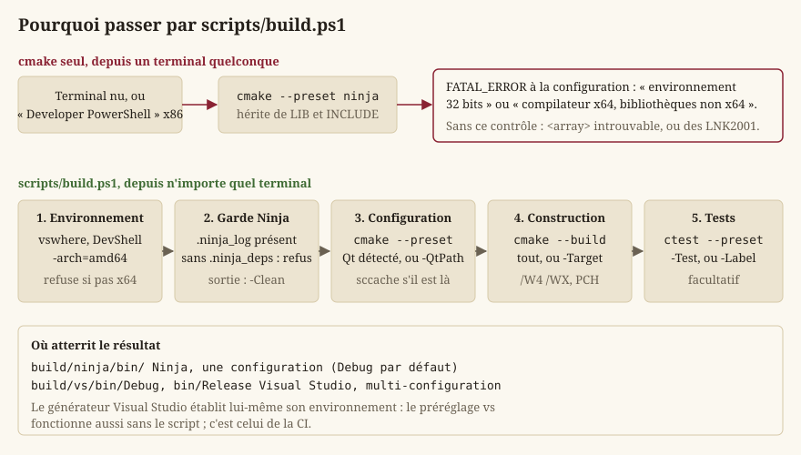
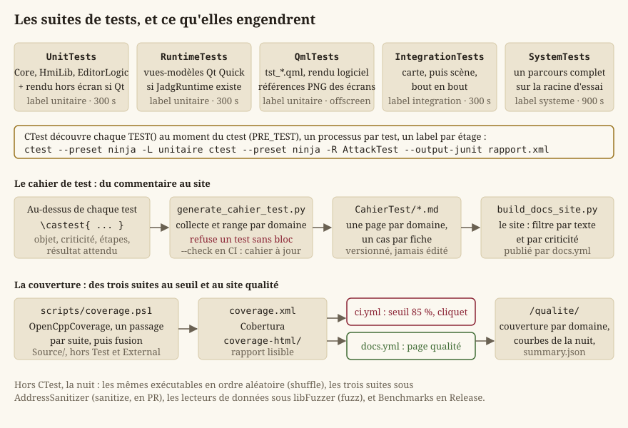
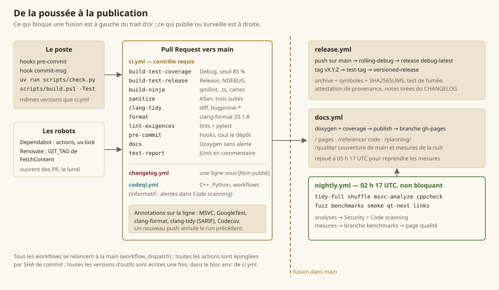
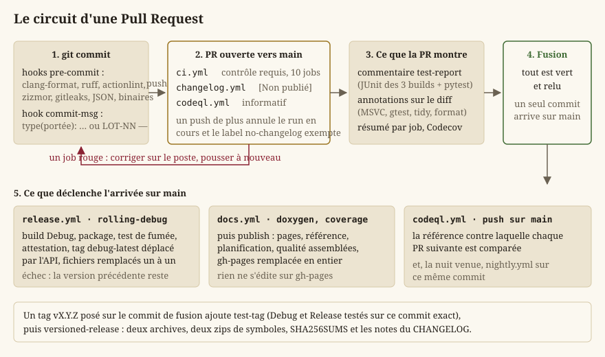

# Build, tests et intégration continue

Cette page décrit **tout ce qui construit, vérifie et publie** le projet : la chaîne CMake et le
script qui l'enveloppe, les suites de tests et le cahier qu'elles engendrent, la trentaine de
scripts de contrôle, les six workflows de GitHub Actions et la page qualité qu'ils alimentent. Le
fil conducteur de toute cette chaîne tient en une phrase, écrite en tête de `ci.yml` : **un
contrôle qui ne prédit pas le résultat local ne sert à rien.** Chaque outil tourne donc à la même
version sur le poste et sur le runner, chaque version est écrite une seule fois, et un contrôle qui
n'a rien vérifié est un échec, pas un succès.

## Les notions de base

Le lecteur connaît C++ ; pas forcément l'outillage d'un dépôt qui compile sous Windows avec Qt.
Quelques définitions, dans l'ordre où la page s'en sert.

- **Générateur CMake.** CMake ne compile pas : il *engendre* les fichiers d'un système de
  construction. Deux sont utilisés ici : **Ninja**, mono-configuration (un dossier de build par
  configuration, une commande `ninja` qui parallélise seule), et **Visual Studio 2022**,
  multi-configuration (Debug et Release dans le même dossier, MSBuild aux commandes). Les deux
  générateurs ne se comportent pas pareil, et c'est pour cela que la CI construit avec les deux.
- **Préréglage CMake** (*preset*). Un nom qui fixe en une fois le générateur, le dossier de build et
  les variables de cache, dans [`CMakePresets.json`](../../CMakePresets.json). `cmake --preset
  ninja` remplace une ligne de commande de six options ; `cmake --build --preset ninja` et `ctest
  --preset ninja` la prolongent pour construire et tester.
- **En-tête précompilé** (PCH). Un fichier d'en-têtes lourds et stables ([`Source/pch.h`](../../Source/pch.h) :
  `<cstdint>`, `<memory>`, `<string>`, `<vector>`), compilé une fois par cible et réutilisé par
  chacune de ses unités de compilation. Il accélère la construction mais rend le fichier objet
  dépendant du compilateur qui l'a produit : clang-tidy ne sait pas le lire, et sccache ne sait pas
  le rejouer.
- **Hook pre-commit.** Un programme que git lance avant d'enregistrer un commit (`pre-commit`) ou
  sur son message (`commit-msg`), et qui peut le refuser. Le dépôt les gère par l'outil
  `pre-commit`, dont [`.pre-commit-config.yaml`](../../.pre-commit-config.yaml) liste les hooks.
- **Intégration continue** (CI). Des machines louées (*runners*) qui rejouent construction, tests
  et contrôles à chaque Pull Request, sur un dépôt propre. Un **contrôle requis** est un workflow
  dont la protection de branche exige le vert avant la fusion ; les autres informent.
- **SARIF.** Un format JSON normalisé pour les résultats d'analyse statique. GitHub l'ingère dans
  *Security > Code scanning* et pose chaque diagnostic en annotation sur la ligne du diff. Les
  outils ne le produisent pas tous, ni sous une forme acceptée telle quelle : deux scripts le
  fabriquent ou le nettoient.
- **Sanitizer.** Une instrumentation du compilateur qui détecte à l'exécution ce qu'un test ne voit
  pas : AddressSanitizer (ASan) attrape une lecture hors bornes ou après libération.
- **Fuzzing.** Un harnais qui passe à une fonction des octets arbitraires, des millions de fois,
  en mutant ceux qui ouvrent un chemin de code nouveau. libFuzzer cherche l'entrée qui fait mentir
  un lecteur de données qui promet de ne jamais lever.
- **Minidump.** Un fichier `.dmp` écrit au moment d'un plantage : la pile de chaque thread et le
  contexte de l'exception. Ouvert dans Visual Studio avec les symboles (`.pdb`) de la **même**
  version, il montre la ligne fautive.
- **Couverture.** La part des lignes de `Source/` exécutées au moins une fois pendant les tests.
  Elle se mesure sur un binaire Debug (les symboles disent quelle ligne est quelle instruction), et
  vaut comme **cliquet** : une chute est refusée, une hausse n'est pas exigée.

## La chaîne de build locale

### Les préréglages et les cibles

[`CMakePresets.json`](../../CMakePresets.json) déclare quatre préréglages, chacun décliné en
configuration, construction et test :

| Préréglage | Générateur | Dossier | Configuration |
|---|---|---|---|
| `ninja` | Ninja | `build/ninja/` | Debug, `compile_commands.json` exporté |
| `ninja-release` | Ninja | `build/ninja-release/` | Release |
| `vs` | Visual Studio 17 2022, x64 | `build/vs/` | Debug |
| `vs-release` | même dossier que `vs` | `build/vs/` | Release |

`ninja` est celui du poste ; `vs` est celui de la CI. Les préréglages Release servent à vérifier ce
qui **disparaît** d'un binaire livré, où `NDEBUG` est défini : une variable lue seulement par une
assertion devient inutilisée, et le `/WX` ci-dessous le refuse. Un tel défaut a déjà été découvert
après un tag public ; le job `build-test-release` existe pour le découvrir en PR (`EX-NFR-023`).

Le [`CMakeLists.txt`](../../CMakeLists.txt) racine porte le `project()` (sa `VERSION` est la
**source unique** du numéro de version : `core::Engine::version` la reçoit par définition de
compilation, `build_docs.py` l'injecte dans Doxygen), le standard C++20 sans extensions, et les
options :

| Option | Défaut | Effet |
|---|---|---|
| `BUILD_TESTING` | ON | les cibles GoogleTest de `Source/Test` |
| `BUILD_EDITOR_QT` | ON | le jeu et l'éditeur ; sans Qt, seuls les tests se construisent |
| `ENABLE_WARNINGS_AS_ERRORS` | ON | `/WX` (`-Werror`) sur les cibles du projet |
| `ENABLE_PCH` | ON | `Source/pch.h` précompilé pour `Core`, `HmiLib`, `SceneComposition`, `EditorLogic`, le jeu |
| `ENABLE_COMPILER_CACHE` | ON | sccache comme lanceur de compilation, s'il est dans le PATH |
| `ENABLE_ASAN` | OFF | AddressSanitizer, portée globale |
| `BUILD_FUZZERS` | OFF | les cibles libFuzzer de `Source/Fuzz` (MSVC seulement) |
| `BUILD_BENCHMARKS` | OFF | `Benchmarks`, les mesures de `Source/Benchmark` |
| `SKIP_MSVC_ENV_CHECK` | OFF | outrepasser le contrôle d'environnement décrit plus bas |

[`Source/CMakeLists.txt`](../../Source/CMakeLists.txt) enchaîne les modules dans l'ordre des
dépendances : `Core` (sans Qt), `HMI` (`HmiLib` sans Qt, puis `SceneComposition`, l'éditeur
`LevelEditor` en Widgets et `JadgRuntime`, les vues-modèles), `Editor` (`EditorLogic`), et, si Qt
est trouvé, `Ui` (le module QML `Jadg.Ui`) et `App` (le jeu `JustAnotherRpgGame`). Trois modules
QML, chacun déclaré dans le répertoire de ses fichiers : `qt_add_qml_module` calcule les chemins de
ressource relativement au `CMakeLists.txt` appelant, et c'est cette plomberie mal placée qui avait
coûté 125 commits à une branche abandonnée (`LOT-86`). Deux cibles engendrées méritent d'être
connues : `all_qmllint`, qui vérifie statiquement tous les `.qml` des trois modules avec les bons
chemins d'import, et `update_translations`, qui relit le code par `lupdate` pour mettre le
catalogue `.ts` à jour (présente seulement si `LinguistTools` est installé).

### Les avertissements : `/W4 /WX`, et seulement chez nous

Deux bibliothèques d'interface, `project_warnings` et `project_options`, portent les drapeaux
transverses ; **chaque cible du projet les lie, aucune dépendance ne les reçoit**. Sous MSVC :
`/W4 /permissive- /external:anglebrackets /external:W0`, plus `/WX` par défaut. La règle
`/external:anglebrackets` traduit une convention du dépôt : un `#include <...>` est externe (STL,
Qt, GoogleTest) et ne produit pas d'avertissement, un `#include "..."` est du projet et en produit.
C'est ainsi que `EX-NFR-013` (« compile sans avertissement ») tient sans qu'on relise jamais un
avertissement de Qt.

Sous Visual Studio, `/MP` est ajouté globalement : MSBuild compile sinon les fichiers d'un projet
un par un, et le préréglage `vs` prenait deux fois le temps du `ninja`. Pas de `jobs` dans les
préréglages en plus : `/m:N` lancerait N projets ayant chacun autant de compilateurs que de cœurs.

### Pourquoi passer par `scripts/build.ps1`



Les générateurs Ninja et Makefiles n'établissent **pas** l'environnement MSVC : ils héritent des
variables `LIB` et `INCLUDE` du terminal qui les appelle. Or une invite « Developer PowerShell »
démarre en **x86**. Deux incohérences en découlent, toutes deux silencieuses jusqu'à l'édition de
liens : un terminal x86 fait choisir un compilateur 32 bits, et la construction, cohérente,
n'atteint jamais Qt (`msvc*_64`), donc ne produit aucun exécutable ; un compilateur x64 imposé par
le cache d'un IDE avec une `LIB` x86 échoue sur des centaines de `LNK2001` sans rapport apparent
avec la cause.

Le `CMakeLists.txt` racine **détecte** l'incohérence à la configuration, seul endroit où le message
peut être compris : `CMAKE_SIZEOF_VOID_P` doit valoir 8, et `LIB` doit contenir un chemin
`lib/x64`. Sinon, `FATAL_ERROR`, avec la marche à suivre. Le générateur Visual Studio est exempt
(MSBuild établit son propre environnement), et `-DSKIP_MSVC_ENV_CHECK=ON` outrepasse.

[`scripts/build.ps1`](../../scripts/build.ps1) **supprime** le problème plutôt que de le signaler :
il entre lui-même dans l'environnement x64 avant d'appeler CMake, et fonctionne donc depuis
n'importe quel terminal, y compris un PowerShell nu. Ses étapes :

1. **Environnement.** `Enter-X64Environment` localise Visual Studio par `vswhere.exe`, présent à
   un emplacement fixe sur tout poste qui l'a (aucun chemin de machine codé en dur), importe le
   module DevShell et entre en `-arch=amd64`. Si `VSCMD_ARG_TGT_ARCH` vaut déjà `x64`, rien à
   faire ; s'il ne bascule pas, le script s'arrête.
2. **Garde Ninja.** `Assert-NinjaDepsIntact` : voir la section suivante.
3. **Configuration.** `cmake --preset <préréglage>` ; `-QtPath` pose `CMAKE_PREFIX_PATH` quand la
   détection automatique ne trouve pas Qt.
4. **Construction.** `cmake --build --preset`, tout ou `-Target <cible>` (par exemple
   `-Target JustAnotherRpgGame_qmllint`, ou `-Target LevelEditor`).
5. **Tests**, facultatifs. `-Test` lance tout CTest ; `-Label unitaire|integration|systeme` ne
   lance qu'un étage, pour la boucle de développement.

`-Clean` supprime le dossier de build avant de configurer. Le script termine en affichant le chemin
de l'exécutable, ou un avertissement s'il manque : c'est la panne muette que toute la chaîne
s'attache à rendre visible.

> **Astuce** — Le poste exécute Windows PowerShell 5.1 : `powershell -File scripts/build.ps1
> -Preset ninja -Test`. Sous pwsh 7, `pwsh scripts/build.ps1` fonctionne aussi ; le lint
> PSScriptAnalyzer garantit qu'aucune syntaxe propre à la 7 ne s'y glisse.

### La garde `.ninja_deps`

Ninja n'apprend les en-têtes qu'un fichier inclut qu'en le compilant, et les garde dans
`.ninja_deps`. Si ce journal est perdu (recompaction refusée, construction interrompue, disque
plein), une modification d'en-tête ne recompile plus ses consommateurs : des objets compilés contre
deux versions d'une même structure se lient ensemble, et **le binaire corrompt sa pile au premier
appel, sans que rien ne l'annonce**. Le symptôme observé ressemblait à une assertion de la CRT dans
`std::string_view`, et a coûté une journée avant d'être élucidé.

`Assert-NinjaDepsIntact` regarde le signe qui trahit cet état : un `.ninja_log` (des objets déjà
construits) sans `.ninja_deps` à côté, ou vide. Elle refuse alors de construire et demande
`-Clean`. Un dossier vierge passe : la première compilation écrira les deux.

### Le cache de compilation et le PCH

Dès que `sccache` est dans le PATH, le CMake racine le pose en `CMAKE_CXX_COMPILER_LAUNCHER` (hors
Visual Studio, qui ignore les lanceurs), et passe MSVC de `/Zi` à `/Z7` : `/Zi` écrit tous les
objets d'une cible dans un même `.pdb`, ce qu'aucun cache ne sait rejouer. Mesuré sur le préréglage
`ninja` : 487 s à froid, 247 s cache plein. Les fichiers compilés sous PCH ne sont pas cachables ;
les autres (tests, dépendances) le sont.

Une limite réelle : avec un **MSVC en français**, le cache n'est **pas** activé. Ninja retrouve les
en-têtes inclus en filtrant `/showIncludes` par un préfixe détecté par CMake, qui contient en
français des espaces insécables ; sccache 0.18 les supprime sur une compilation cachée et les
laisse sur une autre, aucun préfixe ne filtre les deux, et Ninja perdait des dépendances
d'en-têtes (constaté par `ninja -t deps`). Le CMake le dit en `STATUS` et propose `VSLANG=1033`
avec le module linguistique anglais. Les runners ont un MSVC anglais.

### Qt : trouvé sans configuration, épinglé, vérifié

`find_package(Qt6)` ne consulte que `CMAKE_PREFIX_PATH`, et l'installateur officiel range Qt sous
`<racine>/<version>/<compilateur>`, un emplacement que CMake ignore. Sur un poste neuf, la
configuration ne trouvait rien et la cible était ignorée **en silence**.
[`Source/CMakeLists.txt`](../../Source/CMakeLists.txt) complète donc la recherche : `QT_ROOT_DIR`
(exporté par la CI), `Qt6_ROOT`, `QTDIR`, puis `C:/Qt/*/msvc*_64` et `D:/Qt/*/msvc*_64` triés en
ordre naturel décroissant, ajoutés **en fin** de liste pour qu'un choix explicite garde la priorité.
Trois cas d'échec sont distingués parce qu'ils envoient chercher à trois endroits différents : rien
d'installé, une version trop ancienne, ou un **module manquant** (`Multimedia`, `ShaderTools`,
`GuiPrivate` sont exigés, et l'installateur ne les coche pas par défaut). Chacun est un
`WARNING`, pas un `STATUS` : sans Qt, il n'y a aucun exécutable.

`QT_VERSION_MINIMUM` (`6.11.2`) est le **seul** endroit du CMake où la version de Qt s'écrit ;
`ci.yml`, `release.yml`, `nightly.yml` et `docs.yml` installent Qt à `env.QT_VERSION`, et
`check_qt_version_pin.py` exige que toutes ces écritures coïncident (`EX-BUILD-010`). Une version
voisine trouvée sur le poste construit, mais avec un avertissement : le but est qu'un écart soit
visible, pas interdit.

Un détail de construction qui a fait rougir la CI deux fois (`LOT-15`, `LOT-22`) : le jeu et
l'éditeur déploient chacun, en `POST_BUILD`, les DLL Qt **et le runtime MSVC** dans le même `bin/`.
Sous Ninja, les deux éditions de liens tournent en parallèle et l'une ouvre `MSVCP140D.dll`
pendant que l'autre la copie. Une réserve `JOB_POOLS deploiement_qt=1` sérialise les deux
déploiements, et rien d'autre.

### Installer le poste : `scripts/setup_dev.ps1`

[`scripts/setup_dev.ps1`](../../scripts/setup_dev.ps1) ne porte **aucune version**. Il lit le bloc
`env:` de [`ci.yml`](../../.github/workflows/ci.yml) (`LLVM_VERSION`, `DOXYGEN_VERSION`,
`OPENCPPCOVERAGE_VERSION`, `UV_VERSION`, `PSSCRIPTANALYZER_VERSION`, `SCCACHE_VERSION`,
`PRE_COMMIT_VERSION`, `QT_VERSION`) et compare ce qui est installé à ce que le runner installe.
Sans paramètre, il affiche un tableau (outil, version attendue, trouvée, verdict) et échoue sur un
écart. Avec `-Install` (compatible `-WhatIf`), il installe ce qui diverge : winget pour LLVM,
Doxygen et OpenCppCoverage ; l'archive officielle pour sccache ; pip par le lanceur `py` pour
pre-commit, clang-format et uv ; le zip de la PowerShell Gallery pour PSScriptAnalyzer, sans
`Install-Module` (qui exige sous 5.1 le fournisseur NuGet). Puis `uv sync --locked` crée `.venv/`
aux versions de `uv.lock`, et `pre-commit install` pose les hooks **dans le clone courant** : chaque
worktree a son propre `.git/hooks` effectif. Visual Studio et Qt sont vérifiés, jamais installés.

> **Attention** — `python` du PATH peut être n'importe quoi (celui d'Inkscape ou de GIMP s'y glisse
> souvent) : le script n'installe jamais avec lui et l'avertit. Les scripts du dépôt se lancent avec
> `py -3 scripts/…` ou, mieux, `uv run scripts/…`, qui garantit l'environnement de `uv.lock`.

## Les suites de tests



### Cinq exécutables, trois étages

[`Source/Test/CMakeLists.txt`](../../Source/Test/CMakeLists.txt) déclare :

| Cible | Ce qu'elle lie | Étage (label) | Délai |
|---|---|---|---|
| `UnitTests` | `Core`, `HmiLib`, `EditorLogic` ; plus, si Qt est là, les rendus hors écran (`ArenaSceneRenderer`, `WorldSceneRenderer`, `ScenePainter`, `MapRender`) et l'audio | `unitaire` | 300 s |
| `RuntimeTests` | `JadgRuntime`, les vues-modèles Qt Quick ; existe seulement si la cible existe | `unitaire` | 300 s |
| `QmlTests` | `JadgUi` + `Qt6::QuickTest` ; les `tst_*.qml` de `Source/Test/Qml` | `unitaire` | 300 s |
| `IntegrationTests` | `HmiLib` ; une carte devient une scène, bout en bout | `integration` | 300 s |
| `SystemTests` | `Core` ; un parcours d'édition et de règles complet | `systeme` | 900 s |

L'arborescence des tests unitaires reflète celle des sources : le test de `Source/<Module>/<X>` vit
sous `Unit/<Module>/test_<x>.cpp`. Depuis la table rase du `LOT-102`, les tests qui lisaient les
cartes et assets **livrés** lisent la **racine d'essai** `Source/Test/Fixtures/GameData`
(`JADG_TEST_DATA_DIR`, `LOT-123`) : trois cartes reliées, une planche de lieu, un kit d'arène, des
figurines, un dialogue, une rencontre. Elle ne prouve pas du contenu, mais des **mécanismes**. Les
catalogues de règles, eux, restent lus **en vrai** (`JADG_RPG_RULES_DIR`, `JADG_WORLD_DIR`…) : une
copie divergerait, et un test sur une copie cesse de prouver quoi que ce soit le jour où il compte.

Chaque exécutable inclut `Support/CrtReports.cpp` : les assertions de la CRT vont sur `stderr`,
jamais dans une boîte modale ; sans lui, un test qui en lève une attend un clic, sur le poste comme
en CI.

`gtest_discover_tests` enregistre chaque `TEST()` auprès de CTest en **`DISCOVERY_MODE PRE_TEST`** :
la découverte a lieu au `ctest`, pas en fin de build. En mode `POST_BUILD`, Ninja exécutait
l'exécutable de test dans la même fenêtre que le `windeployqt` du jeu, les deux visant `bin/`, et
le lancement tombait en `STATUS_SHARING_VIOLATION` sans rapport avec le code (`LOT-02`). Le
`TIMEOUT` est une borne de **terminaison**, pas un objectif : il n'attrape qu'un emballement.

### Lancer une suite

```
powershell -File scripts/build.ps1 -Label unitaire     # construire, puis un seul étage
ctest --preset ninja                                    # tout
ctest --preset ninja -L integration                     # par label
ctest --preset ninja -R AttackTest                      # par nom (regex)
ctest --preset ninja -E 'Trainer|Comparator'            # tout sauf les lents
build/ninja/bin/UnitTests.exe --gtest_filter='TileMap*' # GoogleTest en direct
```

CTest lance **un processus par test** : l'ordre n'y joue pas. C'est justement pour cela que la nuit
rejoue chaque exécutable **entier** en ordre aléatoire (`--gtest_shuffle --gtest_repeat=3`, job
`shuffle`) : un test qui ne passe que parce que le précédent a préparé quelque chose est une bombe
à retardement, et CTest ne la voit pas.

### Les tests Qt Quick et leurs références PNG

`QmlTests` est le seul exécutable **hors** `bin/` (`build/<préréglage>/qmltests/`) : windeployqt y
dépose les modules du jeu, sans QtTest ; depuis son propre dossier, l'exécutable charge tout Qt
depuis l'installation. Il tourne en `-platform offscreen` et lit ses `tst_*.qml` **dans les
sources** : en ajouter un ne demande pas de reconstruire.
[`QmlTestSetup.cpp`](../../Source/Test/Qml/QmlTestSetup.cpp) fournit deux services au QML :
`jadgUiFiles`, chaque `.ui.qml` du module lu dans sa ressource (un écran ajouté est testé sans être
déclaré), et `referenceImages.compare(fichier, nom)`.

Trois fichiers : `tst_ui_files_load.qml` (chaque formulaire se construit sans avertissement),
`tst_ornate_controls.qml` (les briques se comportent comme la galerie le suppose), et
`tst_screen_references.qml`, la **non-régression visuelle** : chaque écran est rendu à 960 × 540
(échelle 0,5 de la conception 1080p) et comparé à `Source/Test/Qml/References/<Écran>.png`.
Le rendu **logiciel** est imposé : une capture GPU dépend du pilote, et le poste et le runner
(WARP) ne produiraient pas les mêmes pixels ; le moteur logiciel de Qt Quick rastérise par
QPainter, identique partout à version de Qt égale. Seul le lissage des polices peut varier d'un
pixel, d'où la tolérance (24 par composante, 0,2 % des pixels). Sur écart, la capture et une image
des différences sont écrites dans `build/<préréglage>/qml-captures/`, que la CI conserve en
artefact. Une modification **voulue** d'un écran se valide en régénérant sa référence
(`JADG_UPDATE_REFERENCES=1`, puis `ctest -R QmlTests`) et en relisant l'image dans le diff de la PR.

### Le cahier de test, engendré

Le cahier de test (`Documentation/CahierTest/`) **ne s'écrit pas**. Chaque test porte au-dessus de
lui un bloc de commentaire Doxygen `\castest{…}` : l'objet en gras, la catégorie (`\tcat`), la
criticité (`\tcrit`, de Bloquant à Mineur), les étapes (`\tetapes`) et le résultat attendu
(`\tattendu`). [`scripts/generate_cahier_test.py`](../../scripts/generate_cahier_test.py) les
collecte et les range : une page par domaine de `Source/Test/` (`core-combat.md`,
`hmi-graphics.md`, `integration.md`…), un cas par fiche avec son identifiant GoogleTest
(`Suite.Nom`, celui que `ctest` imprime) et son emplacement `fichier:ligne`, et un `README.md` de
synthèse par domaine et par criticité. Le site rend ces pages et les filtre par texte et par
criticité.

Deux refus, dans les deux modes : un test du dépôt **sans bloc** (sans ce contrôle, un test jamais
documenté n'apparaîtrait d'aucun côté de la comparaison, qui le validerait en silence), et, en
`--check` (CI), un dossier qui n'est plus à jour des blocs. Corriger le commentaire du test, relancer
le script, commiter le résultat.

### La couverture : `scripts/coverage.ps1`

OpenCppCoverage n'accepte qu'un exécutable par invocation. Le rapport ne mesurait longtemps que
`UnitTests`, un chiffre faux par construction.
[`scripts/coverage.ps1`](../../scripts/coverage.ps1) exporte chaque suite (`UnitTests`,
`IntegrationTests`, `SystemTests`) au format binaire intermédiaire, puis fusionne les trois en un
`coverage.xml` (Cobertura) et un `coverage-html/`, sur `Source/` hors `Source/Test` et `External`.
Une **seule définition** sert la CI (job `build-test-coverage`, qui applique le seuil), le site
qualité (`docs.yml`, qui publie le HTML) et le poste :

```
powershell -File scripts/coverage.ps1 -BinDir build/vs/bin/Debug -OutDir coverage
```

Le seuil, `COVERAGE_THRESHOLD_PERCENT: 85` dans `ci.yml`, est un **cliquet** (`EX-NFR-022`) :
mesuré à 93,66 % le jour où il fut posé, calé avec une marge explicite pour absorber l'écart entre
le poste et le runner. Codecov, alimenté par OIDC sans secret, montre en plus la couverture des
seules **lignes ajoutées** par la PR ; ses statuts sont informatifs ([`codecov.yml`](../../codecov.yml)),
pour qu'aucun seuil ne soit écrit à deux endroits.

### Sanitizer, fuzzing, mesures, plantage volontaire

- **AddressSanitizer** (`ENABLE_ASAN=ON`) instrumente **globalement** : sous MSVC, `/fsanitize=address`
  annote les conteneurs de la STL, et l'éditeur de liens exige que tous les objets d'un binaire
  partagent la même instrumentation (`LNK2038` sinon), GoogleTest compris, qui vient de
  `FetchContent` et ne lie pas `project_options`. Le job `sanitize` construit et exécute les trois
  suites sans Qt ; c'est ce qui rend `EX-NFR-003` vérifiable.
- **libFuzzer** ([`Source/Fuzz/CMakeLists.txt`](../../Source/Fuzz/CMakeLists.txt),
  `BUILD_FUZZERS=ON`) : quatre cibles, `fuzz_json`, `fuzz_level`, `fuzz_dialogue`,
  `fuzz_localization`, avec le compilateur MSVC lui-même (`/fsanitize=fuzzer`, ASan, couverture de
  branches sur toutes nos cibles, sinon le fuzzer ne mute pas ce dont il ne voit pas les
  branches). clang-cl a été essayé et écarté : sous son ASan, le `catch` d'une exception recevait
  un objet invalide, et chaque lecteur « plantait » sur l'entrée vide. Chaque cible part
  d'**amorces** réelles (`<cible>.seeds` : les JSON des fixtures, les cartes livrées **et** une
  carte de chaque version passée, les dialogues, les catalogues de langue), et la DLL d'ASan est
  copiée à côté de l'exécutable pour qu'il se lance depuis n'importe quel shell. Une entrée fautive
  se rejoue par `fuzz_<cible>.exe <fichier>`.
- **Benchmarks** ([`Source/Benchmark/CMakeLists.txt`](../../Source/Benchmark/CMakeLists.txt),
  `BUILD_BENCHMARKS=ON`, Release obligatoire) : déplacement, ligne de vue, IA, chargement de niveau
  et composition d'un lieu, dont le coût peut doubler sans qu'aucun test ne rougisse.
- **`--crash-test`** : le jeu (et l'éditeur, après sa première sauvegarde) plante volontairement.
  C'est ce que lance le test de fumée d'une archive pour prouver que le filtre d'exception est
  installé et qu'un minidump s'écrit sous `Crashes/` (`hmi::crashDumpFileName` en donne le nom,
  version comprise, pour retrouver l'archive de symboles qui le lit). L'écriture tente quatre dumps
  de plus en plus réduits : une pile illisible d'un autre thread fait échouer tout le dump, la
  dernière tentative n'écrit que le thread du plantage et se réessaie, l'échec vu en CI étant un
  aléa (`ERROR_PARTIAL_COPY`), pas un refus stable. Voir [Journalisation et assertions](guide-journalisation.md)
  et `EX-NFR-042`.

## Les scripts de contrôle

### Un contrôle, un script, un refus

Tous vivent dans [`scripts/`](../../scripts) ; le job `lint-exigences` les enchaîne, et
`check.py` les rejoue sur le poste. La colonne « Refuse » dit ce qui fait passer le code de sortie à
1.

| Script | Refuse | Où il tourne |
|---|---|---|
| `lint_exigences.py` | une `EX-` déclarée deux fois, citée nulle part, citée sans être déclarée, une citation dont la famille n'est déclarée nulle part, une exigence retirée encore citée par le code | CI, poste |
| `Documentation/outils/lint_docs.py` | une commande Doxygen dans une page, un lien ou une ancre morts, une page orpheline, un `LOT-` cité inexistant | CI, poste |
| `Planning/outils/lint_planning.py` | une fiche de lot illisible, un prérequis inconnu ou cyclique, un lot livré avant ses prérequis, une maquette ou un lien qui ne mène nulle part | CI, poste |
| `generate_cahier_test.py --check` | un test sans bloc `\castest`, un cahier périmé | CI, poste |
| `check_qt_version_pin.py` | `QT_VERSION_MINIMUM` différent d'un `env.QT_VERSION` d'un workflow | CI, poste |
| `check_tool_pins.py` | clang-format, Doxygen, LLVM, sccache, aqtinstall ou OpenCppCoverage épinglés à deux versions selon le fichier | CI, poste |
| `check_ui_layers.py` | Qt Quick ou Widgets dans les vues-modèles, Qt dans `Core`, du code impératif dans un `.ui.qml`, une couleur ou une taille en dur hors `Source/Ui/Theme`, un relevé **vide** | CI, poste |
| `check_qml_designer_compat.py` | un formulaire qui nomme un type C++ ou importe `Jadg.Runtime`, un type exposé sans doublure, un jumeau sans formulaire, un alias de ressource, une dépendance QML circulaire | CI, poste |
| `check_translations.py` | une traduction inachevée, disparue, aux marqueurs `%1` différents, à l'espace de bord perdu | CI (deux fois), poste |
| `check_glossary.py` | un lexique mal formé, une clé de règle hors lexique, un corpus non ignoré par git, un auto-test qui échoue | CI, poste |
| `check_corpus_manifest.py` | un manifeste `corpus.toml` mal formé (jamais les empreintes : les PDF ne sont pas sur le runner, `EX-CNT-023`) | CI, poste |
| `check_rpg_data.py` | un schéma invalide, un catalogue hors schéma (fichier et ligne, `EX-CNT-010`), une énumération fermée qui diverge du lexique, une fixture mal classée | CI, poste |
| `check_assets_brief.py` | un jeton absent de `Tokens.qml`, une clé en double, des marges 9-patch sans milieu, une zone hors maquette, une page `.md` périmée | CI, poste |
| `check_ui_assets.py` | une illustration d'une provenance autre que `produced` (`EX-IHM-076`), retouchée sans manifeste, orpheline, citée par le QML sans exister | CI, poste |
| `check_map_assets.py` | une carte hors manifeste ou hors 1920 × 1080, une provenance autre qu'`author`, une région sans carte, un lieu inconnu de l'atlas | CI, poste |
| `check_asset_keys.py` | une clé d'asset orpheline ou malformée (`EX-CNT-040`) ; **liste** sans échouer les clés encore servies par un marqueur (`EX-CNT-041`) | CI, poste |
| `check_powershell.py` | une règle PSScriptAnalyzer (erreur ou avertissement, dont la syntaxe pwsh 7), une autre version du module que celle de `ci.yml` | CI, poste |
| `check_binary_files.py` | un fichier au-delà de la taille maximale, un binaire dont l'extension n'est pas déclarée `binary` dans `.gitattributes` | hook, CI (`--all`) |
| `check_json_files.py` | un JSON invalide, une clé en double, un BOM, un retour à la ligne final absent | hook, CI (`--all`) |
| `check_commit_message.py` | un sujet qui n'est ni `type(portée): …` ni `LOT-NN — …` (fusion, `Revert`, `fixup!` admis) | hook `commit-msg` |
| `check_changelog.py` | une PR sans ligne ajoutée sous `## [Non publié]` | `changelog.yml` |

Plusieurs de ces scripts **s'auto-testent** avant de se prononcer (`--auto-test`, ou un jeu de
fixtures rejoué à chaque appel). La raison est une panne réelle, celle du `LOT-78` : une règle de
lint contenait un caractère invisible qui l'empêchait de jamais correspondre, et le contrôle était
vert parce qu'il ne lisait rien. Un contrôle sans entrée est vert par vacuité ; ceux du dépôt
traitent un relevé vide comme un **échec**. `scripts/tests/test_auto_tests.py` rejoue ces
auto-tests comme des tests nommés, pour qu'ils comptent dans le rapport de la PR.

### `scripts/check.py` : la CI sur le poste, sans liste à tenir

[`scripts/check.py`](../../scripts/check.py) ne porte **pas** sa propre liste de contrôles : il lit
les étapes du job `lint-exigences` dans `ci.yml` et exécute chaque `run: python3 scripts/…`,
`python3 Planning/outils/…` et `python3 -m pytest` avec l'interpréteur courant. Un contrôle ajouté
à la CI est rejoué sur le poste sans qu'on y pense, et les deux ne peuvent pas diverger. Il lance
ensuite `pre-commit run --all-files` s'il est installé (`--sans-hooks` pour l'éviter). Tous les
contrôles s'exécutent même après un échec, comme en CI, et un tableau final donne le verdict de
chacun. Il avertit, sans imposer, quand l'interpréteur n'est pas celui de `.venv/` ou quand la
version de `pre-commit` diffère de `PRE_COMMIT_VERSION` : un verdict obtenu avec un autre
`jsonschema` ne prédit pas celui de la CI. `--auto-test` vérifie seulement la lecture de `ci.yml`,
avec un plancher (au moins dix contrôles lus) contre la vacuité.

Ce qu'il ne rejoue pas : les builds, les tests, clang-tidy, la documentation. Ils demandent MSVC,
Qt, LLVM ou Doxygen, et passent par `build.ps1` et `build_docs.py`.

### Les épinglages : Qt et les outils

Deux écritures d'un même fait finissent par diverger sans que rien ne le signale. Le numéro de
version a divergé pendant quatre jalons entre le `Doxyfile` et CMake, avant que `build_docs.py` ne
lise `project()`. [`check_qt_version_pin.py`](../../scripts/check_qt_version_pin.py) ferme le même
défaut pour Qt (`QT_VERSION_MINIMUM` contre `env.QT_VERSION` de chaque workflow) et
[`check_tool_pins.py`](../../scripts/check_tool_pins.py) pour les outils : clang-format dans
`ci.yml` et dans le tag `mirrors-clang-format` des hooks (deux versions majeures ne formatent pas
pareil : le hook reformaterait un fichier que la CI refuse), Doxygen entre `ci.yml` et `docs.yml`,
LLVM et sccache entre `ci.yml` et `nightly.yml`, aqtinstall et OpenCppCoverage partout où ils
apparaissent.

### Les traductions, vérifiées deux fois

Les écrans écrivent leurs textes en français dans le QML (`qsTr("Nouvelle partie")`) et
`jadg_en.ts` en porte la traduction ; `lupdate` ajoute une chaîne nouvelle en `unfinished`,
`lrelease` la compile quand même, et le jeu en anglais affichait du français sans que personne ne
le voie. [`check_translations.py`](../../scripts/check_translations.py) tourne sur le catalogue
**versionné** (job `lint-exigences`, sans Qt), puis, dans `build-ninja`, **après**
`--target update_translations` : `lupdate` a relu le code, donc une chaîne nouvelle y apparaît
inachevée. Seul ce second passage prouve que le catalogue est à jour du code. Le `.ts` réécrit sur
le runner n'est pas poussé : c'est au poste de le mettre à jour et de le traduire.

### La séparation conception / code

[`check_ui_layers.py`](../../scripts/check_ui_layers.py) et
[`check_qml_designer_compat.py`](../../scripts/check_qml_designer_compat.py) gardent ce que le
`LOT-86` et le `LOT-87` ont séparé : ce qu'un artiste modifie (`Source/Ui`, en QML déclaratif) de
ce qu'un développeur écrit (`Source/HMI`, `Source/App/Game/Qml`). Cette séparation se perd par de
petits gestes défendables un à un : un `include` de Quick « juste » pour lire une propriété, une
couleur en dur « le temps d'essayer ». Le dépôt a payé ce prix : le plancher de taille des écrans
corrigé **trois** fois, la palette écrite **deux** fois sans que rien ne relie les copies. Une
règle qui n'est pas vérifiée est une intention (`EX-IHM-100`). Le second script vérifie un
**contrat** avec Qt Design Studio, pas une structure CMake : tout ce qu'un formulaire nomme doit se
résoudre **sans** le jeu (modules Qt, `Jadg.Ui`, ou les doublures de `Source/Ui/Mocks/`), et chaque
`Q_PROPERTY` d'un type C++ exposé a son pendant dans sa doublure. Voir [Concevoir les écrans dans Qt Design Studio](guide-conception-qds.md).

### Les hooks pre-commit

[`.pre-commit-config.yaml`](../../.pre-commit-config.yaml) est la moitié **poste** de `ci.yml` :
les mêmes outils, aux mêmes versions, avant le commit et dans le job `pre-commit`. La CI confirme ;
elle ne découvre plus. Chaque dépôt de hook est épinglé par **SHA de commit**, le tag en
commentaire, comme les actions : un tag se réécrit, un commit non (`pre-commit autoupdate --freeze`
les monte).

| Hook | Étape | Ce qu'il attrape |
|---|---|---|
| `check-merge-conflict`, `check-case-conflict`, `check-yaml` | pre-commit | un `<<<<<<<` oublié, deux chemins qui ne diffèrent que par la casse (un seul survit sur Windows) |
| `clang-format` (v20.1.8, `Source/**.cpp,h`) | pre-commit | reformate ; le commit s'arrête pour que la correction soit relue |
| `ruff-check` ([`ruff.toml`](../../ruff.toml) : E4, E7, E9, F, B) | pre-commit | un import mort, un nom indéfini, un argument par défaut mutable |
| `actionlint` (+ shellcheck embarqué) | pre-commit | une expression de workflow mal formée, un `needs` inconnu, un `run:` douteux |
| `zizmor` ([`.github/zizmor.yml`](../../.github/zizmor.yml)) | pre-commit | une injection `${{ }}` dans un `run`, des droits trop larges, une action non épinglée |
| `gitleaks` | pre-commit | un jeton ou une clé dans les fichiers indexés (poste seulement) |
| `check-json-files`, `check-binary-files` | pre-commit | voir le tableau des scripts |
| `check-commit-message` | commit-msg | le format du sujet |

Trois hooks ont été **écartés** avec leur raison écrite dans le fichier : `ruff-format`
(10 000 lignes réécrites sans rien corriger), `qmlformat` (Qt 6.11 dé-indente les blocs de
documentation et éclate les `Component` sur 55 fichiers), `pretty-format-json` (les JSON écrits à la
main gardent leurs tableaux sur une ligne). Contourner une fois : `git commit --no-verify` ; le job
`pre-commit` rattrape alors sur tout le dépôt.

### L'environnement Python : `pyproject.toml`, uv, pytest

Les scripts ne sont pas un paquet ; [`pyproject.toml`](../../pyproject.toml) ne sert qu'à épingler
leurs dépendances (`jsonschema`, `pytest`, `pillow`, `numpy`, versions exactes) et `uv.lock` à les
figer. `uv sync --locked` crée `.venv/` à l'identique sur le poste et sur le runner ; uv lui-même
est épinglé par `UV_VERSION` dans `ci.yml`, et Dependabot (écosystème `uv`) propose les montées.
`pytest` cherche ses tests dans `scripts/tests`, `Planning/outils/tests` et
`Documentation/outils/tests`, avec `scripts/` sur le chemin d'import : un test importe
`check_json_files` comme le fait un script voisin, et aucun script n'agit à l'import. Les tests
couvrent les convertisseurs SARIF (qui ne tournent que sur une PR C++ ou la nuit, et casseraient en
silence), les hooks, la lecture de `ci.yml` par `check.py`, chaque fixture des catalogues RPG, la
géométrie de la maquette HD, le site qualité, et le motif de Renovate. Leur rapport JUnit rejoint
ceux des builds dans le job `test-report`.

### Les outils de production, hors CI

Quelques scripts ne contrôlent rien : ils **fabriquent**, sur le poste.

- [`build_docs.py`](../../scripts/build_docs.py) : Doxygen se place dans `Documentation/` (ses
  chemins sont relatifs au répertoire courant, pas au `Doxyfile`), lit la `VERSION` du `project()`
  et l'injecte en `PROJECT_NUMBER` par l'entrée standard. `WARN_AS_ERROR = FAIL_ON_WARNINGS` : un
  `@param` oublié fait échouer la commande, en local comme en CI.
- [`build_hd_mockup.py`](../../scripts/build_hd_mockup.py) (`LOT-101`) monte la maquette de
  validation du standard 2D HD, huit cases sur huit à 1080p et 2160p, depuis une planche de
  référence que `Tools/` ne versionne pas ; `--check` vérifie que les images sont à jour, et le
  test associé n'éprouve que la géométrie et le détourage, sur une planche synthétique.
- [`measure_mockup_palette.py`](../../scripts/measure_mockup_palette.py) (`LOT-87`) : une couleur
  se **relève** sur une maquette, elle ne se choisit pas à vue ; trois mesures (surface, trait,
  lumière) et `--check` échoue si `Tokens.qml` diverge du relevé.
- [`receive_ui_assets.py`](../../scripts/receive_ui_assets.py) (`LOT-87`) réceptionne les images
  produites pour la charte v2 : clé du cahier, dimensions, canal alpha vérifiés, puis installation
  sous `Assets/UI/`, entrée `provenance: "produced"` dans `illustrations.json`, table `Artwork.qml`
  réécrite. Ce qu'il ne juge pas (lettres incrustées, matière) reste une relecture humaine.
- [`seed_translations.py`](../../scripts/seed_translations.py) (`LOT-86`) : outil de migration,
  appelé une fois, qui a amorcé `jadg_en.ts` depuis `en.lang` sans rien deviner.
- [`list_pending_bindings.py`](../../scripts/list_pending_bindings.py) (`LOT-86`) relève dans le
  QML les champs des écrans dessinés avant leurs données (ancre `hmi::PendingData`) : un inventaire
  dérivé, jamais une liste à tenir.
- [`open-arena-editor.ps1`](../../scripts/open-arena-editor.ps1) ouvre l'éditeur sur l'arène de la
  capitale, avec `Source/Elements` pour racine de données (construire `LevelEditor` d'abord).

## Les workflows, job par job



Six workflows sous [`.github/workflows/`](../../.github/workflows). Tous se relancent à la main
(`workflow_dispatch`), tous démarrent avec un jeton en **lecture seule** et n'accordent l'écriture
qu'au job qui publie, toutes les actions sont épinglées par SHA. Les versions d'outils sont écrites
**une fois**, dans le bloc `env:` de `ci.yml`, et recopiées ailleurs sous le contrôle de
`check_tool_pins.py`. Les jobs Windows qui utilisent Ninja appellent `vcvars64.bat` par `vswhere`
**dans le même processus `cmd`** que CMake : l'effet d'un script d'environnement ne survit pas d'une
étape à l'autre.

### `ci.yml` : le contrôle requis, sur chaque PR

Dix jobs, tous sur `pull_request` vers `main`. Un nouveau push sur la branche **annule** le run
précédent (groupe de concurrence) au lieu d'occuper trois runners Windows.

- **`build-test-coverage`** (windows-2022, 60 min). Qt par l'action composite
  [`setup-qt`](../../.github/actions/setup-qt/action.yml) (unique définition des modules :
  `qtmultimedia`, `qtshadertools`, `qtcanvaspainter`), `cmake --preset vs`, build, `ctest
  --output-junit`, puis deux contrôles de **panne muette** : l'exécutable existe, et
  `Qt6Multimediad.dll` a été déployée (windeployqt ne la dépose que s'il détecte l'usage réel).
  Ensuite `coverage.ps1`, le seuil, l'envoi à Codecov, et `ci_summary.py`. Un
  [*problem matcher*](../../.github/problem-matchers/msvc.json) met chaque avertissement MSVC et
  chaque assertion GoogleTest en annotation sur la ligne du diff.
- **`build-test-release`**. Le même préréglage en Release, testé (`EX-NFR-023`).
- **`build-ninja`**. Le préréglage `ninja`, qui hérite de l'environnement du terminal et avait
  silencieusement cessé de fonctionner faute d'être couvert ; sccache par le cache GitHub Actions.
  Puis `all_qmllint` (`EX-IHM-100`), `update_translations` suivi de `check_translations.py`,
  l'existence du jeu **et** de `LevelEditor.exe`, `LevelEditor --check` sur toutes les cartes
  livrées (`LOT-EDITOR-12` : version 4, écriture canonique octet pour octet, références, pièces au
  manifeste, collision égale à la déduction) et, sur une PR, `LevelEditor --render` des cartes que
  la PR change, publiées en artefact `map-renders` (`LOT-EDITOR-13`) : une image dit d'un coup
  d'œil ce qu'un diff de JSON cache.
- **`sanitize`**. `ENABLE_ASAN=ON`, sans Qt, les trois suites exécutées **dans la même étape** que
  `vcvars64.bat` : le dossier de la DLL runtime d'ASan vient de son PATH.
- **`clang-tidy`**. Ninja **sans PCH** (le `.pch` de MSVC n'est pas lisible par clang), un build
  complet d'abord (les en-têtes `ui_*.h` et `moc_*.cpp` engendrés doivent exister), puis
  clang-tidy sur les seuls `Source/*.cpp` **modifiés par la PR** (hors `Test`, `Fuzz`,
  `Benchmark`) : la dette existante ne bloque personne, et le coût ne croît pas avec le dépôt.
  Seule `bugprone-*` est bloquante ([`.clang-tidy`](../../.clang-tidy), `LOT-58`) ;
  `clang_tidy_sarif.py` convertit le journal en SARIF pour que **chaque** diagnostic, bloquant ou
  non, s'affiche sur sa ligne (`EX-NFR-024`).
- **`format`** (ubuntu). `clang-format --dry-run --Werror` sur `Source/`, à la version PyPI de
  `LLVM_VERSION`. Contrôle, jamais réécriture.
- **`lint-exigences`** (ubuntu). L'environnement `uv.lock`, puis les vingt contrôles du tableau,
  **chacun exécuté même si un précédent a échoué** (`if: !cancelled()`) : une PR voit d'un coup
  tout ce qu'elle casse. Puis `pytest`, dont le JUnit part en artefact, et un tableau des verdicts
  en tête du run.
- **`pre-commit`** (ubuntu). Les hooks sur tout le dépôt, sauf `clang-format` (le job `format` le
  fait avec ses annotations) et `gitleaks` (rien n'est indexé).
- **`docs`** (ubuntu). Doxygen à `DOXYGEN_VERSION` (l'archive officielle, pas celle de la
  distribution, dont les règles de liens diffèrent), `build_docs.py` sans avertissement, puis
  `build_docs_site.py` : une page qui ne se rend pas casse la PR, pas le site.
- **`test-report`** (ubuntu, `needs` les trois builds et le lint). Télécharge les artefacts
  `junit-*` et publie un *check run* et un commentaire de PR, mis à jour à chaque push : échecs
  avec leur message, tests ajoutés ou retirés, écart de durée. Un job à part parce que c'est le
  seul à recevoir des droits d'écriture, et il ne compile ni n'exécute rien du dépôt. Il ne
  décide rien (`action_fail: false`) : le verdict appartient aux builds.

### `changelog.yml`

Une PR consigne son apport sous `## [Non publié]` de `CHANGELOG.md`, ou porte le label
`no-changelog` (Dependabot en est exempt). Un workflow à part plutôt qu'un job de `ci.yml` : il
doit se relancer quand on pose ou retire le label, et ces événements relanceraient sinon les quatre
builds Windows. `check_changelog.py` exige une ligne **ajoutée** dans la section, pas seulement un
fichier touché : corriger une coquille dans une version publiée ne consigne rien.
`extract_release_notes.py` échouait déjà quand la section d'une version manquait, mais au tag, des
semaines trop tard ; ce contrôle déplace l'erreur là où elle se corrige en une ligne.

### `codeql.yml`

Analyse sémantique interprocédurale de GitHub, gratuite pour un dépôt public, en `build-mode: none`
pour le C++ (lire les sources sans les compiler : le build MSVC coûterait un quart d'heure par PR
pour une précision marginale). Elle suit une valeur à travers les appels et trouve des familles que
clang-tidy ne voit pas : usage après libération, indice non borné venu d'un fichier de données.
Trois langages (C++ sur Windows, où sont les en-têtes de la STL MSVC ; Python ; les workflows
eux-mêmes), sur chaque PR, sur `main` (la référence de comparaison) et chaque semaine. Requêtes
`security-extended`, sans la suite *quality* : le style est l'affaire de clang-tidy et de ruff. Pas
un contrôle requis.

### `nightly.yml` : ce qui est lent, chaque nuit

À 02 h 17 UTC (hors de l'heure pile, où GitHub retarde toutes les planifications), jamais sur une
PR. Aucun job n'est requis : un job rouge la nuit est un défaut à trier, pas une PR bloquée.

| Job | Ce qu'il fait | Où va le résultat |
|---|---|---|
| `tidy-full` | clang-tidy sur **tout** `Source/` (hors tests), quatre analyses en parallèle, code de sortie ignoré | Code scanning, catégorie `clang-tidy-nightly` : la dette monte ou descend |
| `shuffle` | chaque exécutable de test en ordre aléatoire, graine tirée du numéro de run (unitaires ×3, intégration ×2, système ×1) | résumé du run, graine à rejouer : `--gtest_shuffle --gtest_random_seed=<graine>` |
| `msvc-analyze` | `/analyze /analyze:log:format:sarif` sur `Core` et `HmiLib`, un SARIF par unité de compilation, fusionnés par `merge_sarif.py` | Code scanning `msvc-analyze` |
| `cppcheck` | un second avis sans compilation (warning, performance, portability), depuis `compile_commands.json` | Code scanning `cppcheck` |
| `fuzz` | les quatre cibles libFuzzer, dix minutes chacune ; le corpus grandit d'une nuit à l'autre (cache) | échec + artefact `fuzz-crashes` sur une entrée fautive ; corpus conservé même après un défaut |
| `benchmarks` | `Benchmarks.exe` en Release, historique poussé dans la branche `benchmarks` (`dev/bench`) | alerte commentée sur le commit au-delà de 150 % de la mesure précédente ; page qualité |
| `smoke` | la configuration Release **avec symboles** de `release.yml`, empaquetée et lancée par `smoke_test_release.ps1` | artefact `smoke-screenshot` ; la panne se voit avant le jour de la version |
| `qt-next` | construit et teste contre la version de Qt la plus récente publiée au-dessus de `QT_VERSION` | résumé du run, `continue-on-error` : la nuit reste verte |
| `links` | lychee, hors ligne ([`lychee.toml`](../../lychee.toml)), sur chaque lien relatif de chaque `.md` | résumé du run ; un site externe indisponible ne rougit pas la nuit |

`merge_sarif.py` existe parce que Code scanning n'accepte pas le SARIF natif tel quel : quelques
centaines de *runs* du même outil dans une catégorie, un en-tête signalé cent fois, des URI
absolues du runner dont une partie vise la STL ou `_deps/`. Il regroupe par outil, ne garde que le
dépôt (hors `External/` et dossiers de build), réécrit les chemins, fusionne les doublons et ajoute
un tableau par règle au résumé.

### `release.yml` : la release roulante et la release versionnée

Deux déclencheurs, deux circuits indépendants, décrits dans la section [La publication](#la-publication).

### `docs.yml` : le site, à chaque fusion

Trois jobs sur `push` vers `main` (et à 05 h 17 UTC pour reprendre les mesures de la nuit) :
`doxygen` (ubuntu, la référence du code, artefact `site-api`), `coverage` (windows, le build Debug
et `coverage.ps1`, **sans seuil** : ce job mesure pour publier, la PR a déjà tranché), et `publish`,
le seul avec `contents: write`. Voir [La publication](#la-publication).

### Les robots : Dependabot et Renovate

Les actions sont épinglées par SHA ; le prix est qu'elles ne bougent plus jamais seules.
[`dependabot.yml`](../../.github/dependabot.yml) les fait bouger par PR, groupées (une PR par
semaine plutôt qu'une par action, chacune coûtant un run complet de la CI Windows), après un délai
de sept jours (le temps qu'une publication compromise soit repérée en amont), avec les dépendances
Python de `uv.lock`. [`renovate.json`](../../renovate.json) ne suit **que** ce que Dependabot ne
sait pas lire : les `GIT_TAG` des `FetchContent_Declare` de
[`External/CMakeLists.txt`](../../External/CMakeLists.txt) (GoogleTest 1.15.2, nlohmann/json
3.11.3, benchmark 1.9.5 ; `EX-NFR-031`). Deux robots sur la même dépendance ouvriraient deux PR. Une
montée majeure d'une bibliothèque C++ attend une approbation sur le tableau de bord. Le motif
d'expression régulière de Renovate est éprouvé par `test_renovate_config.py` : Renovate tourne chez
Mend, et un motif qui ne correspond plus à rien n'y produit aucune erreur, seulement plus aucune
PR. Hors de portée des deux robots : les versions du bloc `env:` de `ci.yml`, suivies à la main.

## Le circuit d'une Pull Request



1. **Sur le poste.** Les hooks refusent ce qui se corrige en une seconde ; `uv run scripts/check.py`
   prédit le job `lint-exigences` ; `scripts/build.ps1 -Test` prédit les builds. Une entrée sous
   `## [Non publié]` avant d'ouvrir la PR, et `build_docs.py` si un commentaire de code a bougé.
2. **La PR ouverte.** `ci.yml` est le contrôle requis ; `changelog.yml` et `codeql.yml` tournent
   à côté. Chaque push annule le run précédent.
3. **La lecture.** Le commentaire `test-report`, les annotations sur le diff, le résumé de chaque
   job et le commentaire Codecov disent tout sans ouvrir un log.
4. **La fusion.** Tout vert et relu : un commit arrive sur `main`.
5. **Sur `main`.** `release.yml` reconstruit `debug-latest`, `docs.yml` republie le site, CodeQL
   pose la référence contre laquelle les PR suivantes seront comparées ; la nuit venue,
   `nightly.yml` s'exerce sur ce commit.

## La publication {#la-publication}

### La release roulante `debug-latest`

À chaque push sur `main`, le job `rolling-debug` construit un Debug **autonome** (`BUILD_TESTING=OFF`,
générateur Visual Studio, runtime MSVC dynamique : les DLL Qt officielles sont en `/MD`), puis :

1. [`package_release.ps1`](../../scripts/package_release.ps1) empaquette **tout le dossier de
   l'exécutable** (l'exe, les DLL Qt et `platforms/` déposés par windeployqt, le runtime, les
   assets) en `<Nom>.zip`, et déplace les `.pdb` dans `<Nom>-symbols.zip` : sans le `.pdb` de la
   version **exacte**, un minidump est illisible, et l'archive du joueur n'a pas à les porter. Les
   `.ilk` sont écartés, et surtout `Logs/` et `Crashes/`, qu'un lancement depuis le dossier de
   build y laisse : l'archive livrerait sinon les journaux du poste qui l'a construite. Aucun `.pdb`
   trouvé est une **erreur** : une release sans symboles ne se rattrape pas après coup.
2. [`write_sha256sums.ps1`](../../scripts/write_sha256sums.ps1) écrit `SHA256SUMS` au format de
   `sha256sum` (empreinte, deux espaces, nom seul), en LF sans BOM : `sha256sum -c` refuse un BOM
   et lit mal un CR.
3. [`smoke_test_release.ps1`](../../scripts/smoke_test_release.ps1) décompresse l'archive dans un
   dossier **neuf**, sans Qt ni dossier de build, et lance `JustAnotherRpgGame.exe --screenshot=<png>`
   (le mode qui charge l'interface, rend une image et quitte seul). Il exige un code de sortie 0
   dans le délai, une image écrite qui n'est **pas d'une seule couleur** (une fenêtre noire n'est
   pas un jeu), puis relance avec `--crash-test` et exige une fin par violation d'accès
   (`0xC0000005`) sans boîte de dialogue, **exactement un** minidump sous `Crashes/` à signature
   `MDMP`, cité dans le journal. C'est la seule preuve que windeployqt n'a oublié ni un plugin QML
   ni un module, et que l'archive livrée écrit bien son dump. En échec, la fin du journal du jeu
   est affichée.
4. Une **attestation de provenance** signe `SHA256SUMS` par OIDC : `gh attestation verify
   <fichier> --repo <propriétaire>/JustAnotherRpgGame` prouve que chaque fichier sort de ce
   workflow sur ce commit.
5. La publication est **idempotente** : le tag `debug-latest` est déplacé par l'API (le checkout ne
   garde aucun jeton), puis les fichiers sont remplacés un à un (`--clobber`). L'ancienne séquence
   « supprimer puis créer » laissait le dépôt sans `debug-latest` dès que la création échouait ;
   ici, au pire, la version précédente reste.

### La release versionnée `vX.Y.Z`

Un tag `vX.Y.Z` (posé sur le commit de fusion, après avoir monté `VERSION` dans le `project()` et
transformé `## [Non publié]` en `## [X.Y.Z] - date`) déclenche deux jobs en série :

- **`test-tag`** exige que le tag soit **sur `main`** (`git merge-base --is-ancestor`) et rejoue
  build et tests sur ce commit exact, en Debug et en Release : un build de release est
  `BUILD_TESTING=OFF`, et rien ne garantissait sinon qu'une archive versionnée sorte d'un code
  testé.
- **`versioned-release`** construit un Debug et un Release **avec symboles** (`/Zi` n'écrit que le
  `.pdb` sans changer le code ; `/DEBUG` à l'édition de liens désactiverait `/OPT:REF` et
  `/OPT:ICF`, remis explicitement pour que l'exécutable reste celui d'un Release ordinaire),
  empaquette les deux, teste les deux archives, atteste, puis tire les notes du CHANGELOG par
  [`extract_release_notes.py`](../../scripts/extract_release_notes.py), qui **échoue** si la section
  manque, volontairement **avant** la publication : une release aux notes vides ne se corrige pas
  proprement. `--generate-notes` de GitHub aurait donné une liste brute de messages de commit,
  illisible pour le non-développeur à qui la release est destinée. Sur un tag, le groupe de
  concurrence n'annule jamais : une release à moitié publiée est pire qu'une release en retard.

### Le site : `docs.yml`, job `publish`

Le générateur des pages remplace son dossier de sortie en entier, il passe donc en premier ; les
autres parties viennent se poser dedans.

1. `build_docs_site.py --out site --commit <sha> --tagfile reference/reference.tag` : les pages, et
   le fichier d'étiquettes de Doxygen qui relie chaque `core::X` cité dans le guide à sa page de
   référence ; puis la référence est déplacée sous `site/reference/`.
2. La couverture, si le job `coverage` a réussi ; sinon (la nuit, ou en échec), celle du site en
   place est reprise depuis `gh-pages`, et la page le dit à la place du chiffre.
3. `build_quality_site.py` assemble `qualite/` (section suivante) ; `coverage.xml` suit le site.
4. `build_planning_site.py --out site/planning` : le site de planification, engendré depuis
   `Planning/`, jamais commité.
5. `peaceiris/actions-gh-pages` remplace la branche `gh-pages` **en entier** : rien n'y survit par
   accident, rien ne s'y édite. C'est pour cela que les mesures nocturnes vivent dans leur propre
   branche (`benchmarks`) et sont recopiées.

## La page Qualité

[`scripts/build_quality_site.py`](../../scripts/build_quality_site.py) réunit sous `qualite/` ce
que la chaîne produisait déjà mais qu'il fallait télécharger, artefact par artefact :

| Chemin | Contenu | Source |
|---|---|---|
| `qualite/index.html` | couverture **par domaine** (les deux premiers niveaux sous `Source/` : `Core/Combat`, `HMI/Runtime`…), dernières mesures de performance et leur écart avec la précédente, liens | `coverage.xml`, `dev/bench/data.js` |
| `qualite/couverture/` | le rapport HTML d'OpenCppCoverage, ligne par ligne | job `coverage` de `docs.yml` |
| `qualite/performances/` | la page de courbes de github-action-benchmark | branche `benchmarks` |
| `qualite/summary.json` | les mêmes chiffres, lisibles par un script | |
| `qualite/coverage.xml` | le Cobertura, pour que la publication de la nuit le reprenne sans remesurer | |

Une source absente n'empêche pas la publication : la page le dit. `read_coverage` et
`read_benchmarks` sont testées (`test_build_quality_site.py`) sur des rapports fictifs. Les runners
partagés sont bruités : c'est la **tendance** des courbes qui compte, pas une nuit.

## Voir aussi

- [`CMakeLists.txt`](../../CMakeLists.txt), [`Source/CMakeLists.txt`](../../Source/CMakeLists.txt),
  [`Source/Test/CMakeLists.txt`](../../Source/Test/CMakeLists.txt), [`CMakePresets.json`](../../CMakePresets.json).
- [`scripts/build.ps1`](../../scripts/build.ps1), [`scripts/setup_dev.ps1`](../../scripts/setup_dev.ps1),
  [`scripts/check.py`](../../scripts/check.py), [`scripts/coverage.ps1`](../../scripts/coverage.ps1).
- [`ci.yml`](../../.github/workflows/ci.yml), [`nightly.yml`](../../.github/workflows/nightly.yml),
  [`release.yml`](../../.github/workflows/release.yml), [`docs.yml`](../../.github/workflows/docs.yml),
  [`changelog.yml`](../../.github/workflows/changelog.yml), [`codeql.yml`](../../.github/workflows/codeql.yml).
- [`CONTRIBUTING.md`](../../CONTRIBUTING.md) : la marche à suivre pour une PR et pour une version.
- [Écrire la documentation](guide-documentation.md) : le lint des pages, le générateur du site, la référence Doxygen.
- [Journalisation et assertions](guide-journalisation.md) : le journal et le minidump que le test de fumée éprouve.
- [Éditeur de niveaux](guide-editeur.md) : `--check` et `--render`, que `build-ninja` lance.
- [`exigences-non-fonctionnelles.md`](../Specification/exigences-non-fonctionnelles.md) : `EX-NFR-013`, `EX-NFR-020`, `EX-NFR-022`,
  `EX-NFR-023`, `EX-NFR-024`, `EX-NFR-030`, `EX-NFR-031`, `EX-BUILD-010`.
- [`conventions.md`](../Specification/conventions.md) : le formatage, l'analyse statique et la politique d'erreurs que ces contrôles font respecter.
