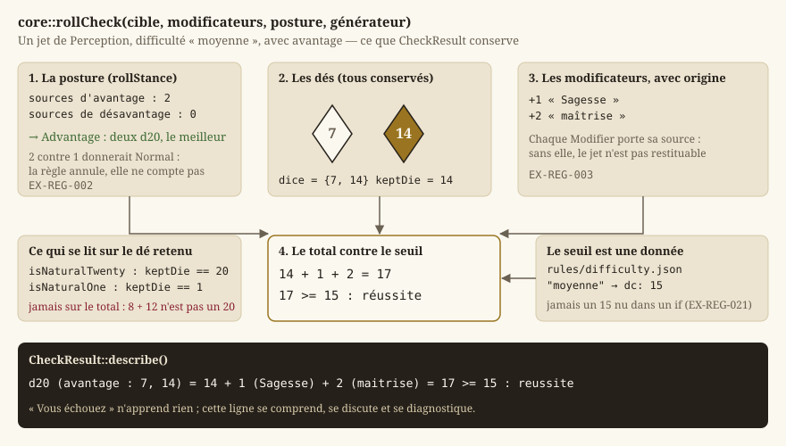
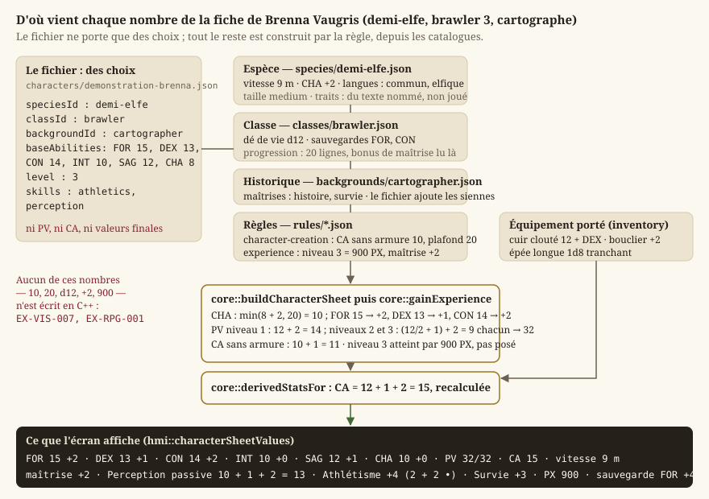
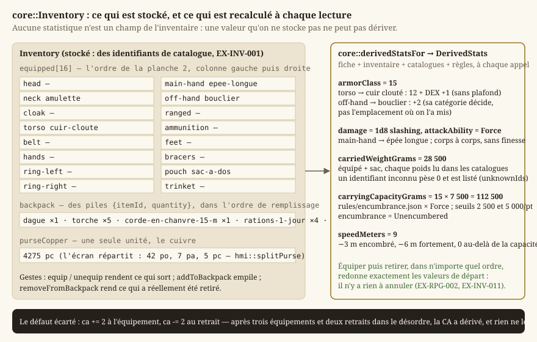
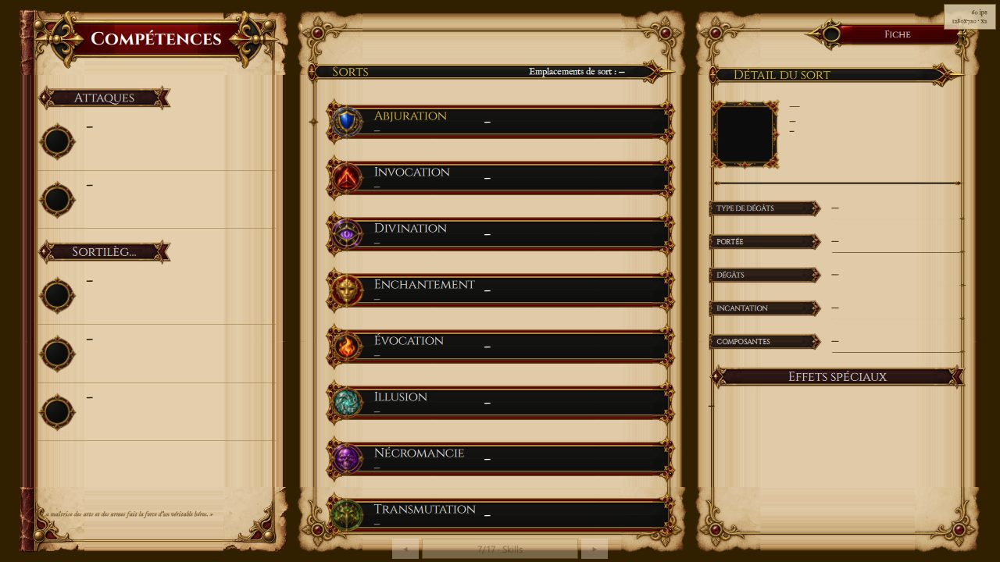

# Règles d20 et personnages

Le jeu est un jeu de rôle **à règles d20** : toute action incertaine se résout en lançant un dé à
vingt faces, en lui ajoutant des modificateurs et en comparant le total à un seuil. Cette page
explique ce vocabulaire depuis le début, puis décrit ce que `Source/Core/Rpg/` en implémente : les
dés, le jet, les caractéristiques, les compétences, la fiche de personnage, le multiclassage,
l'équipement, l'inventaire et le bestiaire. Les dialogues, qui vivent dans le même dossier, sont
traités avec [le monde et l'exploration](guide-monde.md) ; ce que le combat fait d'un jet d'attaque
est dans [le combat](guide-combat.md).

Le principe qui traverse tout le dossier tient en une phrase, posée avant le `LOT-01` et écrite par
le `LOT-77` : **le moteur porte des mécanismes, la donnée porte des valeurs** (`EX-VIS-007`,
[`regles-d20.md`](../Specification/regles-d20.md)). Un dé, un seuil, un modificateur, un
arrondi sont du C++ ; le nombre de faces d'un dé de vie, le seuil d'une difficulté « moyenne », la
classe d'armure sans armure, la table d'expérience sont des fichiers JSON de
`Source/Elements/Rpg/` ([Données, corpus et ressources](guide-donnees.md)). C'est ce qui permet de
régler l'équilibre du jeu sans recompiler, et de charger un catalogue issu du SRD sans que le
moteur ne connaisse le SRD.

## Les définitions de base {#definitions}

Le lecteur connaît le C++ ; il ne connaît pas forcément le jeu de rôle sur table. Voici les mots
que le reste de la page emploie sans les redéfinir.

| Mot | Ce qu'il désigne | Dans le code |
|---|---|---|
| **Système d20** | Une famille de règles où toute résolution incertaine est un d20 plus des modificateurs contre un seuil (`EX-REG-001`). | `core::rollCheck` |
| **Jet** (*check*) | Un lancer de d20 résolu : les dés, les modificateurs, le seuil, l'issue. | `core::CheckResult` |
| **Modificateur** | Un entier, positif ou négatif, ajouté au dé. Il a toujours une **origine** : « +3 de Dextérité », « +2 de maîtrise ». | `core::Modifier` |
| **Degré de difficulté** (DD, *DC*) | Le seuil à atteindre ou dépasser pour réussir. Il est nommé (« moyenne ») et sa valeur (15) est une donnée. | `core::DifficultyScale` |
| **Classe d'armure** (CA) | Le seuil d'un jet d'attaque : ce qu'il faut atteindre pour toucher. | `core::armorClassFor` |
| **Caractéristique** | Une des six valeurs fondamentales d'une créature (Force, Dextérité, Constitution, Intelligence, Sagesse, Charisme), typiquement entre 1 et 20. De chacune dérive un **modificateur** : `(valeur − 10) / 2`, arrondi vers le bas. | `core::Ability`, `core::abilityModifier` |
| **Compétence** | Un domaine d'action nommé (Athlétisme, Discrétion, Perception…), rattaché à une caractéristique. Un personnage peut la **maîtriser**. | `core::SkillDefinition` |
| **Bonus de maîtrise** | Un bonus qui dépend du niveau et de rien d'autre, ajouté en entier à un jet maîtrisé, jamais partiellement (`EX-REG-011`). | `core::proficiencyBonus` |
| **Jet de sauvegarde** | Le jet que fait un personnage qui **subit** quelque chose (un poison, un sort), sur une caractéristique donnée. Certaines sont maîtrisées, selon la classe (`EX-REG-020`). | `core::savingThrowModifier` |
| **Dé de vie** | Le dé propre à une classe (d6 pour un mage, d12 pour un brawler) qui fixe les points de vie gagnés par niveau. | `core::PlayableClass::hitDie` |
| **Espèce** | Ce que le personnage *est* : vitesse, taille, augmentations de caractéristiques, langues, traits. Entièrement une donnée (`EX-RPG-010`). | `core::Species` |
| **Classe** | Ce que le personnage *fait* : dé de vie, sauvegardes maîtrisées, table de progression sur vingt niveaux (`EX-RPG-020`). | `core::PlayableClass` |
| **Historique** | D'où le personnage *vient* : maîtrises de compétences, langues accordées, une capacité (`EX-RPG-011`). | `core::Background` |
| **Niveau, expérience** | Le niveau se gagne en franchissant des **seuils** de points d'expérience ; plusieurs seuils d'un coup font gagner plusieurs niveaux (`EX-RPG-031`). | `core::ExperienceTable`, `core::gainExperience` |
| **Multiclassage** | Prendre des niveaux dans plusieurs classes. La règle la plus délicate est le cumul des emplacements de sorts (`EX-RPG-041`). | `core::multiclassCasterLevel` |
| **Emplacement d'équipement** | Une des seize places où un objet se porte : tête, torse, main directrice, main secondaire… Un emplacement porte au plus un objet (`EX-INV-010`). | `core::EquipmentSlot` |
| **Encombrement** | L'état dérivé du poids porté rapporté à la Force : libre, encombré, fortement encombré, au-delà de la capacité (`EX-INV-020`). | `core::EncumbranceLevel` |

Une **fiche de personnage** est l'agrégat de tout cela pour une créature donnée — héros, PNJ ou
ennemi — et la règle qui la gouverne est qu'elle est **dérivée** : espèce, classe, historique,
niveau et équipement en sont les sources, et toute valeur affichée en est calculée (`EX-RPG-001`).

## Le hasard est déterministe {#hasard-deterministe}

Aucune fonction de ce dossier ne tire un nombre au hasard toute seule. `core::rollDice` et
`core::rollCheck` prennent un `core::DeterministicRandom` **par référence** : l'appelant choisit la
graine, avance dans la suite, et peut rejouer exactement la même partie. Le déterminisme n'est pas un
confort mais une exigence (`EX-NFR-002`) — sans lui, **aucun test de combat n'est écrivable**, et
une sauvegarde rechargée ne redonnerait pas la même partie.

Le générateur lui-même (SplitMix64, `Source/Core/Math/DeterministicRandom.h`) est décrit avec les
[mathématiques du moteur](guide-maths.md). Ce qu'il faut en savoir ici tient à `nextInt(min, max)`,
qui rend un entier dans `[min, max]` **bornes comprises** et **sans biais modulo** : la forme
évidente `tirage % n` favorise les premières valeurs quand 232 n'est pas un multiple de
`n`, et rendrait indéfendable toute mesure de distribution. Le `LOT-12` a vérifié sur 100 000
tirages qu'aucune des vingt faces ne s'écarte de plus de 10 % de la moyenne — et a trouvé au passage
un défaut que la relecture n'aurait pas vu : la version qui rejetait la queue **haute** de
l'intervalle bouclait sans fin pour toute puissance de deux (un d8 bloquait, un d20 passait). La
version retenue rejette la queue basse, vide quand `n` divise 232.

> **Note** — Les points de vie d'une montée de niveau ne sont **pas** tirés au dé, alors que le
> livre le permet : le moteur prend la valeur fixe (`core::maximumHitPointsFor`), parce qu'une
> fiche dépendant d'un tirage rendrait une partie irrejouable.

## Les dés : `core::Dice` {#des}

Un catalogue écrit `"damage": "2d4+2"`, `"hitDice": "4d10+4"`, ou simplement `"4"`. Cette
**notation est une donnée** ; `core::Dice` en est la forme analysée — `count` dés à `faces` faces,
plus `modifier` — et `core::parseDice` la seule porte d'entrée du projet.

- `core::parseDice(notation)` accepte `NdF`, `NdF+M`, `NdF-M` et une valeur fixe (`count` et
  `faces` à zéro). La casse du `d` est indifférente ; aucun espace n'est admis. Elle rend
  `std::nullopt` pour tout le reste — chaîne vide, `ld8` (la faute d'OCR que le `LOT-30` a
  documentée, où un `1` devient un `l`), `1d6+2x` (un résidu après le modificateur n'est pas une
  notation « à moitié valide »), ou une notation aberrante (plus de 100 dés, plus de 100 faces,
  modificateur au-delà de 999). Ces bornes ne brident pas le jeu : elles font qu'un `999d999` issu
  d'une extraction ratée est refusé à l'analyse plutôt que de faire tourner une boucle au milieu
  d'un tour. Une notation illisible est une donnée invalide **à signaler**, jamais une expression
  devinée ; c'est ainsi que le bestiaire et les armes la traitent.
- `core::formatDice(dice)` réécrit la notation canonique (`2d6+3`, `1d8`, `4`, `1d6-1`).
- `core::Dice::minimum` et `core::Dice::maximum` donnent les bornes du total
  (`count + modifier` et `count × faces + modifier`) — utiles à l'IA tactique du `LOT-23`, qui
  raisonne en espérance.
- `core::rollDice(dice, random)` lance chaque dé avec `nextInt(1, faces)` et rend un
  `core::DiceRoll` : l'expression, **chaque face dans l'ordre du tirage**, et le total, modificateur
  compris. `DiceRoll::describe()` restitue `2d6+3 : 4 + 5 + 3 = 12`. Chaque dé est conservé, pas
  seulement le total, parce qu'`EX-REG-003` demande qu'un jet soit reconstituable — et parce que
  c'est le seul outil de diagnostic praticable quand une capacité ne s'applique pas.

## Le jet de d20 : `core::rollCheck` {#jet}

`Source/Core/Rpg/Check.h` est le cœur du système. Une seule fonction résout tout ce qui est
incertain — test de caractéristique, jet de sauvegarde, jet d'attaque — parce que trois résolutions
différentes seraient trois occasions de diverger (`EX-REG-001`). Ce qui les distingue n'est pas le
mécanisme mais les **modificateurs** qu'on lui passe (`EX-REG-020`), et cela se décide chez
l'appelant.

### La posture : `core::RollStance` et `core::rollStance`

L'**avantage** fait lancer deux d20 et garder le meilleur ; le **désavantage**, garder le pire. Les
deux **ne se cumulent pas** (`EX-REG-002`) : plusieurs sources d'avantage donnent un avantage, et une
source de chaque s'annule entièrement. `core::rollStance(avantages, desavantages)` prend le
**nombre de sources** de chaque type et rend `Normal`, `Advantage` ou `Disadvantage` — deux
avantages contre un désavantage donnent `Normal`, pas `Advantage`. La règle annule, elle ne compte
pas ; c'est contre-intuitif la première fois, et c'est précisément pour cela que la décision vit à
un seul endroit plutôt que chez chaque appelant, qui aurait à arbitrer sa pile de bonus contre toutes
les autres à chaque capacité ajoutée. `core::rollStanceName` donne le nom textuel (`normal`,
`avantage`, `desavantage`) pour les journaux.

### Le résultat : `core::CheckResult`

`core::rollCheck(target, modifiers, stance, random)` lance un d20 — deux si la posture n'est pas
`Normal` —, retient le bon, ajoute les modificateurs et compare au seuil. Le `core::CheckResult`
rendu conserve **tout** :

- `dice` : les dés lancés, **les deux** en cas d'avantage ou de désavantage, pas seulement celui qui
  compte — c'est ce que le joueur veut voir pour savoir ce que son avantage lui a rapporté ;
- `keptDie` : le dé retenu (le meilleur, le pire, ou le seul) ;
- `modifiers` : chaque `core::Modifier` avec son `source` et sa `value` ;
- `total`, `target`, `stance` (la posture **effectivement** appliquée, après annulation) ;
- `succeeded()` : vrai si le total **atteint ou dépasse** le seuil ;
- `isNaturalTwenty()` et `isNaturalOne()` : lus sur le **dé retenu**, jamais sur le total. Un 20
  naturel déclenche le coup critique ; un total de 20 obtenu avec un 8 et douze points de bonus
  n'est qu'un total. Les confondre rendrait critique un jet sur deux à haut niveau, et le défaut
  passerait pour de l'équilibrage. Ce que le critique fait aux dégâts est l'affaire du `LOT-21`,
  pas de cette fonction, qui le *signale* seulement.

`CheckResult::describe()` produit la ligne restituable qu'`EX-REG-003` exige :
`d20 (avantage : 7, 14) = 14 + 1 (Sagesse) + 2 (maitrise) = 17 >= 15 : reussite`, suivie de
`(20 naturel)` ou `(1 naturel)` le cas échéant.

Le combat l'emploie pour l'initiative (`core::CombatState`, avec un seuil de 0 : on ne réussit pas
une initiative, on la classe) et pour l'attaque (`core::weaponAttackFor`) ; le dialogue l'emploie
pour un test de compétence face à un PNJ (`core::DialogueRunner`, `LOT-15`).

### Le seuil : `core::DifficultyScale`

`target` n'est **jamais un littéral** dans le code appelant (`EX-REG-021`) : un `15` nu dans un `if`
ne dit pas ce qu'il représente. Un contenu écrit « Persuasion, difficulté *moyenne* », et
`core::loadDifficultyScale(path)` lit `Source/Elements/Rpg/rules/difficulty.json` — six degrés, de
`tres-facile` (5) à `quasi-impossible` (30), extraits de la table « Tâche / DD » du corpus.
`DifficultyScale::find(id)` rend le `core::DifficultyTier` (identifiant, nom, `dc`) ou `nullptr`.
Un degré sans identifiant ou sans nombre est **écarté en le nommant** dans `errors` : gardé à 0, il
ferait réussir tout jet qui le vise, ce qui se joue et ne se voit pas. Le chargeur ne lève jamais
(`EX-NFR-040`). Cette lecture manquait à `rollCheck` depuis le `LOT-12` ; c'est le premier contenu à
jeter un d20 hors combat — le dialogue — qui l'a rendue nécessaire.

## Les six caractéristiques : `core::Ability` {#caracteristiques}

`core::Ability` est un ensemble **fermé** de six valeurs, dans l'ordre de la fiche : `Strength`,
`Dexterity`, `Constitution`, `Intelligence`, `Wisdom`, `Charisma` (`EX-REG-010`). Les fiches et les
créatures les rangent dans un `std::array<int, 6>` indexé par cette énumération. Trois fonctions
l'accompagnent :

- `core::abilityModifier(score)` — le modificateur, `(score − 10) / 2` **arrondi vers le bas**. Le
  piège ne se voit que sur les scores impairs inférieurs à 10 : la division entière du C++ tronque
  vers zéro, si bien que `(7 − 10) / 2` vaut `−1` alors que la règle donne `−2`. Un personnage avec
  7 en Force serait moins pénalisé qu'il ne doit l'être, sur chacun de ses jets, pendant toute la
  partie — et la formule *a l'air* juste. L'implémentation décale de 1 avant de diviser pour les
  écarts négatifs ; le cas `abilityModifier(7) == −2` est un test explicite du `LOT-12`. Le
  modificateur est **calculé**, jamais stocké : deux sources de vérité pour la même valeur finissent
  toujours par se contredire.
- `core::abilityName(ability)` et `core::parseAbility(name)` — l'aller-retour avec les noms que
  les données écrivent (`strength`, `dexterity`…). Un nom inconnu rend `std::nullopt`, jamais une
  valeur devinée : deviner ferait jeter l'Athlétisme en Charisme sans qu'aucun message ne le dise.
- `core::allAbilities()` — les six dans l'ordre, pour balayer une énumération sans coder en dur sa
  dernière valeur.

Les noms sont ceux du lexique du `LOT-30` et de `common.schema.json` ; `scripts/check_rpg_data.py`
vérifie en CI que les trois listes coïncident (`EX-CNT-011`).

## Les compétences : `core::SkillCatalog` {#competences}

**La correspondance compétence → caractéristique est une donnée**, jamais un `switch`
(`EX-REG-012`). C'est elle qui décide que l'Athlétisme se jette en Force et la Discrétion en
Dextérité, et une règle maison qui changerait ce rattachement ne doit pas demander de recompiler.
Les dix-huit fichiers de `Source/Elements/Rpg/skills/` viennent du `LOT-43` ; chacun porte `id`,
`name` et `ability`.

- `core::loadSkills(directory)` balaie le dossier, trie les fichiers par nom puis le catalogue par
  identifiant (pour une sortie déterministe), et rend un `core::SkillCatalog` : les
  `core::SkillDefinition` chargées et les `errors`. Un dossier absent est une **erreur**, pas un
  catalogue vide : sans compétence, tout jet de compétence retomberait sur le modificateur nu, ce
  qui se joue et ne se voit pas. Une caractéristique inconnue (`"ability": "luck"`) est signalée et
  la compétence écartée. Ne lève jamais (`EX-NFR-040`).
- `SkillCatalog::find(id)` rend la définition ou `nullptr`.

Le modificateur d'un jet de compétence pour une fiche donnée est `core::skillModifier`, décrit avec
la fiche plus bas.

## L'échelle du monde : `core::METERS_PER_TILE` {#echelle}

Toutes les portées et vitesses du corpus sont en **mètres** — « allonge 1,50 m », « vitesse 9 m »,
« portée 6 m/18 m » — et la grille tactique compte en **cases**. La conversion existe forcément
quelque part, et le seul choix ouvert était *à un endroit, ou à trente*. À trente, il suffit qu'un
seul emploie 1,52 (les cinq pieds d'origine) pour qu'une portée de six cases en devienne cinq
ailleurs. `Source/Core/Rpg/Scale.h` fige donc **une case = 1,5 m** (`EX-REG-051`), avec
`core::tilesFromMeters` et `core::metersFromTiles` en `constexpr`. C'est ce que la fiche emploie
dans `CharacterSheet::speedInTiles()`, et ce que le déplacement (`LOT-19`) et la portée (`LOT-22`)
consomment.

## Les énumérations fermées : `core::DamageType`, `core::Condition`, `core::MagicSchool`, `core::CreatureSize` {#enumerations}

`Source/Core/Rpg/RpgEnums.h` déclare quatre ensembles fermés, fixés par les règles et non par le
corpus (`EX-CNT-011`) :

| Énumération | Valeurs | Ce qui en dépend |
|---|---|---|
| `core::DamageType` | 13 : contondant, perforant, tranchant (les trois physiques), puis acide, froid, feu, force, foudre, nécrotique, poison, psychique, radiant, tonnerre | les dégâts typés du combat (`EX-CBT-032`), les résistances du bestiaire |
| `core::Condition` | 15, dont `Exhaustion`, la seule non binaire (six niveaux) | les états du combat (`EX-REG-040`) ; l'**effet** d'une condition est dans `conditions/`, jamais dans l'énumération |
| `core::MagicSchool` | 8 : abjuration, invocation (*conjuration* — le faux ami que le lexique fige), divination, enchantement, évocation, illusion, nécromancie, transmutation | l'écran des sorts |
| `core::CreatureSize` | 6 : `Tiny` à `Gargantuan` | l'emprise sur la grille (`LOT-19`), ce qu'une créature peut agripper |

`Source/Core/Rpg/RpgEnumNames.h` est le **point unique** de correspondance valeur ↔ nom, partagé
par les catalogues, leurs schémas et le moteur. Deux tables distinctes divergeraient au premier type
ajouté, et le scénario qu'`EX-CNT-011` décrit se produirait : la donnée déclare un type que le
moteur ne connaît pas, la valeur tombe dans un cas par défaut, et le sort cesse de faire des dégâts
sans que rien ne l'annonce. Trois familles de fonctions, pour chacune des quatre énumérations :

- `core::damageTypeName`, `core::conditionName`, `core::magicSchoolName`, `core::creatureSizeName`
  — un `switch` **exhaustif et sans `default`** : ajouter une valeur sans lui donner de nom est une
  erreur de compilation (`/W4 /WX`), jamais un nom faux ;
- `core::parseDamageType`, `core::parseCondition`, `core::parseMagicSchool`,
  `core::parseCreatureSize` — les inverses exacts, `std::nullopt` pour un nom inconnu. Les tables
  inverses sont **construites à partir** des fonctions de nommage (à la première analyse, une table
  par énumération), jamais saisies à la main : l'aller-retour est exact par construction, pas par
  vigilance ;
- `core::allDamageTypes`, `core::allConditions`, `core::allMagicSchools`,
  `core::allCreatureSizes` — les valeurs dans l'ordre de déclaration, pour qu'un test balaie une
  énumération sans coder en dur sa dernière valeur.

Les noms sont ceux du lexique du `LOT-30` ; `check_rpg_data.py` vérifie la coïncidence pour trois
énumérations contre le lexique, et pour `CreatureSize` contre `common.schema.json` — le glossaire
du corpus omet « Moyenne » de sa catégorie *taille*.

## Espèces, historiques, classes : `core::CharacterOptions` {#options}

`Source/Core/Rpg/CharacterOptions.h` charge les trois catalogues dont une fiche se construit
(`LOT-36`) : 22 espèces, 13 historiques, et les 4 classes **provisoires** — brawler, mage, priest,
scoundrel — qui servent de socle au combat en attendant les seize classes complètes du `LOT-47`.

- `core::Species` — `size`, `speed` (en mètres : les livres de Tanares comptent en pieds, la
  conversion est faite à l'extraction pour qu'un seul système d'unités arrive ici),
  `abilityScoreIncrease` (une **table** indexée par `core::Ability`, jamais une phrase : c'est la
  seule forme que le moteur puisse appliquer ; une case à zéro signifie « pas d'augmentation »),
  `parentSpecies` pour une sous-espèce, `languages`, `traits` (du texte nommé, `core::NamedTrait`,
  non joué) et `requiredMechanisms`. `Species::increase(which)` lit la table.
- `core::Background` — `skillProficiencies` (des identifiants du catalogue du `LOT-43`),
  `languageCount` (un historique accorde un **nombre** de langues au choix, pas une liste), une
  `feature` facultative.
- `core::PlayableClass` — `hitDie`, `primaryAbility`, `savingThrowProficiencies`, et une
  `progression` de vingt `core::ClassLevel` (niveau, bonus de maîtrise, capacités). **La table de
  progression est une donnée, jamais une règle en C++** : le bonus de maîtrise se lit ligne à ligne
  (`PlayableClass::atLevel(level)`), et aucune formule du moteur ne le recalcule. La formule
  générale donnerait le même résultat, et c'est précisément le piège : l'écrire ferait cesser de
  lire la donnée, et une classe à progression inhabituelle n'aurait plus rien à changer dans le code.
  `status` est un `core::ProvisionalStatus` (`EX-CNT-032`) : `provisional`, `reason`, et
  `removalCriterion` — **écrit d'avance**, parce qu'une donnée provisoire non marquée devient
  permanente par accident.
- `core::loadCharacterOptions(speciesDir, backgroundsDir, classesDir)` **balaie** chaque dossier,
  jamais énuméré dans le code (une liste de noms en C++ serait une seconde source de vérité), trie
  par identifiant et rend un `core::CharacterOptions`. Un dossier absent produit une **erreur**, pas
  un catalogue vide. Une espèce sans taille ou sans vitesse, une classe sans dé de vie sont
  écartées en le disant ; une caractéristique inconnue dans `savingThrowProficiencies` ou dans une
  augmentation est signalée, jamais ignorée. Ne lève jamais (`EX-NFR-040`).
- `CharacterOptions::findSpecies`, `findBackground`, `findClass` — par identifiant, `nullptr`
  sinon.
- `CharacterOptions::requiredMechanisms()` — l'union dédupliquée des mécanismes que les espèces
  exigent et que le moteur n'honore pas encore (`EX-CNT-031`) : l'augmentation « au choix du
  joueur » des espèces de Tanares, par exemple. Le moteur la **liste au chargement** plutôt que de
  jouer en silence une espèce qu'il croit complète.
- `CharacterOptions::provisionalClassIds()` — les classes marquées provisoires ; un test balaie
  `Source/Elements/Rpg/` et vérifie qu'aucune donnée définitive ne les cite.
- `core::abilityScoreWith(species, which, baseScore, maximumScore)` — la seule opération que le
  moteur fait sur une espèce : `min(base + augmentation, plafond)`. Le plafond est **un paramètre**,
  lu dans `rules/character-creation.json`, et non un `20` écrit ici (`EX-VIS-007`) — le `LOT-36`
  l'avait codé en dur, le `LOT-13` l'a sorti.

## La fiche : `core::CharacterSheet` {#fiche}

`core::CharacterSheet` (`LOT-13`) est la fiche de **toute** créature jouable ou non — héros, PNJ,
ennemi. Deux décisions de conception la gouvernent.

**Un objet autonome, jamais un singleton joueur.** Le cadrage est « un héros au départ, quatre à
terme » ; le passage au groupe (`LOT-29`) ne doit rien changer à ce type. Aucune fonction du fichier
ne prend « le personnage » implicitement : toutes reçoivent la fiche sur laquelle elles
travaillent, et quatre fiches vivent côte à côte sans se connaître — un test le rend exécutoire.
Le composant ECS `core::RpgActor` ne porte pas la fiche, il la **désigne** par un indice : une fiche
survit à l'entité qui la représente quand le héros change de carte.

**Une fiche se construit, elle ne se déclare pas.** Tous les champs chiffrés partent de zéro, et
aucun ne porte de valeur « raisonnable » par défaut : un `armorClass = 10` dans la structure serait
la règle du livre écrite en C++ (`EX-VIS-007`), et une fiche à demi construite passerait pour une
fiche jouable. La fiche porte des **valeurs**, pas des règles : le bonus de maîtrise ne s'y trouve
pas, il se lit dans la table d'expérience au niveau courant — le stocker le figerait à la
construction, et une montée de niveau laisserait un personnage avec le bonus de l'ancien.

### Les champs

`name` ; les trois identifiants `speciesId`, `classId`, `backgroundId` (vides pour une créature du
bestiaire) ; `abilities`, les six valeurs **finales**, augmentations d'espèce comprises ; `level`,
`experiencePoints`, `maximumHitPoints`, `currentHitPoints`, `armorClass` ; `speedMeters` (en mètres,
l'unité du corpus) ; `skillProficiencies` et `savingThrowProficiencies` (des ensembles) ;
`languages` (`EX-RPG-042`, `LOT-15` : celles de l'espèce, recopiées, plus celles que la fiche
**choisit** — elles ne sont pas décoratives, un dialogue se refuse faute de langue commune). Quatre
accesseurs : `ability(which)`, `modifier(which)` (qui appelle `core::abilityModifier`), `isDown()`
(points de vie courants à zéro ou moins) et `speedInTiles()` (par `core::tilesFromMeters`).

### Les deux tables de règles

- `core::ExperienceTable`, chargée par `core::loadExperienceTable` depuis `rules/experience.json`
  : vingt `core::ExperienceLevel` (niveau, seuil d'expérience, bonus de maîtrise), triés par niveau.
  **Aucune de ces quarante valeurs n'est écrite en C++** — c'est la donnée la plus tentante à coder
  en dur du projet, vingt seuils et vingt bonus tiendraient en trois lignes, et la plus coûteuse à y
  laisser : équilibrer la progression demanderait alors une recompilation à chaque essai.
  `levelFor(px)` rend le plus haut niveau dont le seuil est atteint (0 si la table est vide) ;
  `proficiencyBonusAt(level)` et `thresholdAt(level)` rendent 0 si la table ne porte pas ce niveau ;
  `maximumLevel()` le niveau le plus élevé. Une ligne incomplète est signalée et sautée.
- `core::CharacterCreationRules`, chargées par `core::loadCharacterCreationRules` depuis
  `rules/character-creation.json` : `unarmoredArmorClass` (10) et `maximumAbilityScore` (20),
  chacune accompagnée dans le fichier de **la phrase du livre qui l'atteste**. `ok()` exige que les
  deux aient été lues : une règle absente ne se devine pas, lui donner une valeur par défaut la
  ferait passer pour une règle du jeu.

### Construire : `core::buildCharacterSheet`

`core::buildCharacterSheet(name, baseAbilities, species, playableClass, background, rules, table)`
transforme les trois catalogues en fiche jouable de niveau 1. Les trois pointeurs peuvent être
`nullptr` — une créature sans espèce est légitime, une fiche sans classe n'a ni dé de vie ni
sauvegardes. Dans l'ordre : l'espèce donne la vitesse, ses langues, et ses augmentations appliquées
à chaque valeur de base par `abilityScoreWith` (plafond lu dans `rules`) ; la classe donne les
sauvegardes maîtrisées et les points de vie maximaux par `maximumHitPointsFor` ; les points de vie
courants sont mis au maximum ; l'historique donne ses maîtrises de compétences ; la classe d'armure
vaut `unarmoredArmorClass + modificateur de Dextérité` (l'armure portée la remplacera par
`derivedStatsFor`) ; l'expérience est posée au seuil du niveau 1.

### Les points de vie : `core::maximumHitPointsFor`

`core::maximumHitPointsFor(hitDie, level, constitutionModifier)` applique la règle du livre dans
sa voie **déterministe** : le niveau 1 reçoit le **maximum** du dé (la raison pour laquelle un
mage de niveau 1 n'a pas trois points de vie), chaque niveau suivant sa moyenne arrondie au
supérieur, soit `hitDie / 2 + 1` pour tout dé pair — et tous le sont. Le modificateur de
Constitution s'ajoute **à chaque niveau**, et le gain d'un niveau vaut au minimum 1 : une
Constitution désastreuse fait gagner peu de points de vie, elle n'en fait pas perdre. Un dé ou un
niveau nul ou négatif rend 0. Le dé de vie est **lu dans la donnée** de la classe, jamais passé en
littéral.

### Monter de niveau : `core::gainExperience`

`core::gainExperience(sheet, table, hitDie, amount)` ajoute des points d'expérience et applique la
montée qui en découle, sur place. **Reproductible** : aucune part de hasard, le résultat ne dépend
que de la fiche, de la table et du montant. Trois règles y sont écrites :

- un montant nul ou négatif est **ignoré** — perdre de l'expérience n'est pas une règle de ce jeu,
  et l'accepter en silence ferait *descendre* un personnage de niveau ;
- le franchissement de plusieurs seuils d'un coup donne le niveau que le total accorde, pas le
  suivant (`EX-RPG-031`), borné par `maximumLevel()` ; le seuil **exact** fait monter, un point de
  moins non ;
- **monter de niveau n'est pas un soin** : les points de vie courants montent du **gain**, pas
  jusqu'au maximum — rendre toute sa vie à un personnage blessé ferait de la montée une potion
  gratuite.

Le `core::LevelUpResult` rendu dit ce qui s'est passé — niveaux avant et après, points de vie
gagnés, bonus de maîtrise avant et après, `gainedLevel()` — pour que le joueur puisse le
reconstituer et qu'un test vérifie chaque marche (`EX-REG-003`).

### Les modificateurs d'une fiche

- `core::proficiencyBonus(sheet, table)` — **lu dans la table** au niveau courant (`EX-REG-011`).
- `core::savingThrowModifier(sheet, table, which)` — le modificateur de caractéristique, plus le
  bonus de maîtrise si la fiche maîtrise cette sauvegarde.
- `core::skillModifier(sheet, table, catalog, skillId)` — la caractéristique vient du **catalogue**
  (`SkillCatalog::find`), le bonus de maîtrise s'ajoute si `skillProficiencies` contient
  l'identifiant. Le `core::SkillCheckModifier` rendu porte `value`, `proficient` et `found` : une
  compétence inconnue du catalogue rend un résultat vide **et le signale** par `found == false`,
  plutôt que de laisser croire à une maîtrise absente.

### Charger un personnage : `core::loadCharacterSheet`

`core::loadCharacterSheet(path, options, rules, table)` lit un fichier de
`Source/Elements/Rpg/characters/` (schéma `character.schema.json`, `LOT-38`) et rend un
`core::LoadedCharacterSheet` : la `sheet`, l'`inventory` (ce que le personnage porte, `LOT-14` ;
vide si le fichier n'en déclare pas — un personnage sans inventaire a les mains vides, ce n'est pas
une erreur) et les `errors`, qui voyagent **avec** la donnée et jamais à sa place (`EX-CNT-010`).

Le fichier ne porte que des **choix** — espèce, classe, historique, `baseAbilities` (les six
exigées : une fiche à cinq caractéristiques n'existe pas, et laisser la sixième à zéro donnerait un
modificateur de −5 que rien ne signalerait), niveau visé, compétences, langues choisies, inventaire.
Tout le reste est **dérivé** : la fiche est construite par `buildCharacterSheet`, puis le niveau
s'atteint par `gainExperience` jusqu'au seuil du niveau visé — le même chemin qu'une partie
empruntera, donc les mêmes points de vie et le même bonus de maîtrise qu'un personnage monté en
jouant. Écrire ces valeurs dans le fichier en ferait une seconde source, qui différerait de la
première au premier ajustement de règle. Les trois identifiants sont résolus dans le catalogue et
un identifiant inconnu est **signalé** : une fiche qui référence une espèce absente s'afficherait
sans vitesse ni augmentation, ce qui ressemble à un personnage faible et non à une donnée fausse.
Un emplacement d'équipement inconnu est signalé et ignoré. Ne lève jamais (`EX-NFR-040`).

Le personnage affiché est `demonstration-brenna.json`, déclaré **provisoire** avec son critère de
retrait (`EX-CNT-032`) : il disparaît le jour où une partie fournit un personnage réel. Chaque nombre
de la capture se retrace par la figure précédente ; la classe d'armure de 15 vient de l'équipement
porté, et non de la fiche construite (11).

## Le multiclassage : `core::multiclassCasterLevel` {#multiclassage}

Un personnage qui prend des niveaux dans plusieurs classes lanceuses de sorts cumule un **niveau de
lanceur** qui désigne sa ligne dans la table des emplacements. C'est « la règle qu'il est le plus
facile d'implémenter de travers » (`EX-RPG-041`), parce qu'un lanceur multiclassé mal calculé
**reste jouable, simplement faux**. `Source/Core/Rpg/Multiclassing.h` (`LOT-43`) en porte le
mécanisme ; la correspondance classe → rythme est une donnée (`rules/multiclassing.json`), attestée
sur la phrase du *Manuel des Joueurs* p. 166.

- `core::CasterProgression` — `None` (barbare, moine), `Third` (guerrier et roublard sous
  archétype), `Half` (paladin, rôdeur), `Full` (barde, clerc, druide, ensorceleur, magicien) et
  `Pact` — la magie de pacte de l'occultiste, qui **n'entre pas dans la somme** (`EX-RPG-052`) : ses
  emplacements sont peu nombreux, toujours au niveau maximal, récupérés au repos **court**, et les
  additionner doublerait la puissance du personnage sans que rien ne le signale.
- `core::ClassLevel` (celui de `Multiclassing.h`, distinct de la ligne de progression de
  `CharacterOptions.h`) — un niveau pris dans une classe et le rythme de cette classe.
- `core::multiclassCasterLevel(classes)` — la somme des contributions, bornée à 20. **L'arrondi se
  fait par classe, jamais sur le total** : un paladin 3/rôdeur 3 donne `1 + 1 = 2`, et non
  `⌊6/2⌋ = 3` — sommer d'abord donne un emplacement de trop, à un niveau où c'en est un tiers de
  plus. Un niveau nul ou négatif n'apporte rien. La fonction est vérifiée contre l'exemple travaillé
  du livre lui-même : un rôdeur 4/magicien 3 « est considéré comme un personnage de niveau 5 ».
- `core::casterProgressionName` et `core::parseCasterProgression` — l'aller-retour avec les noms
  de la donnée (`none`, `third`, `half`, `full`, `pact`) ; un nom inconnu rend `std::nullopt`,
  jamais `None`, ce qui ferait taire un lanceur.

> **Note** — Rien dans le moteur ne **consomme** encore ce niveau de lanceur : les sorts et les
> emplacements attendent leurs lots. La fonction existe parce que la donnée existe, et parce que la
> vérifier contre le livre coûte moins que de la retrouver fausse plus tard.

## Armes et armures : `core::EquipmentCatalog` et `core::armorClassFor` {#equipement}

`Source/Core/Rpg/Equipment.h` (`LOT-34`) charge les 37 armes et les 13 armures des tables
d'équipement, et calcule la classe d'armure.

- `core::Weapon` — `category` (`simple` ou `martial`), `ranged`, `damage` et `damageType`
  **facultatifs** (le filet n'inflige rien et entrave ; lui inventer des dés en ferait une arme qui
  touche pour rien), `price` en **pièces de cuivre** (l'unité interne du projet, `LOT-32`),
  `weightGrams`, `text` (les propriétés en toutes lettres) et `properties` — les mêmes,
  **structurées** (`finesse`, `light`, `reach`, `thrown`, `versatile`…), tirées de la colonne des
  propriétés à l'extraction (`LOT-22`) : une règle qui en dépend les lit ici, jamais dans la prose.
  `rangeNormal` et `rangeLong` en mètres pour une arme qui se tire ou se lance.
  `core::hasProperty(weapon, "finesse")` interroge la liste.
- `core::Armor` — `category` (`core::ArmorCategory` : `Light`, `Medium`, `Heavy`, `Shield`),
  `baseArmorClass` (ou le **bonus** du bouclier), `dexterityBonus`, `dexterityBonusMax` (le
  `+2` des armures intermédiaires), `strengthRequired`, `stealthDisadvantage`, prix et poids. Le
  bouclier est dans l'énumération parce que le livre le met dans la même table ; mais il n'est
  **pas** une armure — il *ajoute* à la classe d'armure au lieu de la remplacer, et les confondre
  donnerait un personnage en bouclier seul avec une CA de 2. `core::armorCategoryName` et
  `core::parseArmorCategory` font l'aller-retour avec les noms de la donnée.
- `core::loadEquipment(weaponsDir, armorsDir)` balaie les deux dossiers et rend un
  `core::EquipmentCatalog` (`weapons`, `armors`, `errors`, `findWeapon`, `findArmor`). Une notation
  de dés illisible ou un type de dégâts inconnu sont signalés ; une catégorie d'armure inconnue
  écarte l'armure. Ne lève jamais.
- `core::armorClassFor(sheet, rules, armor, shield)` — **les trois formes de la colonne CA du livre
  disent trois règles différentes**, et les réduire à leur premier nombre est la faute qui ne se
  voit pas :

  | Ce que le livre écrit | Ce que la fonction fait |
  |---|---|
  | `11 + Mod.Dex` | `dexterityBonus` sans plafond : la Dextérité s'ajoute entière (armures légères) |
  | `14 + Mod.Dex (max +2)` | `dexterityBonusMax` : `min(Dex, 2)` (armures intermédiaires) |
  | `18` | pas de `dexterityBonus` : elle ne s'ajoute pas du tout (armures lourdes) |

  Appliquer la Dextérité au harnois rendrait le personnage plus résistant, jamais moins : le défaut
  ne provoque aucune erreur et passe pour de l'équilibrage. Sans armure (`armor == nullptr`, ou un
  bouclier passé à sa place), la base vient de `rules.unarmoredArmorClass` et non d'un `10` écrit
  ici ; le bouclier, s'il en est bien un, ajoute son `baseArmorClass`. Un test vérifie les treize
  armures contre la colonne du livre, avec une Dextérité de 18 choisie pour révéler la faute.
- `core::totalWeightGrams(entries)` — la somme de `core::InventoryEntry` (poids unitaire ×
  quantité, une quantité nulle ou négative ne pesant rien). Sa raison d'être est l'**unité unique**
  : le livre écrit des kilogrammes et des grammes dans la même table, et mêler les deux donnerait un
  sac de cinq cents kilos pour une poignée de fléchettes. La conversion est faite à l'extraction.

## L'inventaire : `core::Inventory` et `core::derivedStatsFor` {#inventaire}

`Source/Core/Rpg/Inventory.h` (`LOT-14`) porte ce qu'un personnage a sur lui, et ce que cela
produit. Le critère d'acceptation du lot disait : *retirer un équipement doit annuler exactement son
effet*. La parade n'est pas un test, c'est une **absence de champ**.

### Ce qui est stocké

- `core::Item` et `core::ItemCatalog` — les 125 objets qui ne sont ni arme ni armure : `category`
  (`gear`, `tool`, `mount`…), prix en cuivre, `weightGrams` (un objet sans poids déclaré ne pèse
  rien : c'est le cas des objets dont le livre ne donne pas la masse, pas un oubli à corriger par une
  valeur inventée), `stackable`, `rarity`, `requiresAttunement` (`EX-INV-041`). `core::loadItems`
  balaie `Rpg/items/` ; un objet sans identifiant est écarté en le disant.
- `core::EquipmentSlot` — les **seize emplacements** de la planche 2 du corpus, dans l'ordre de la
  feuille, colonne gauche puis droite : `Head`, `Neck`, `Cloak`, `Torso`, `Belt`, `Hands`,
  `RingLeft`, `RingRight`, `MainHand`, `OffHand`, `Ranged`, `Ammunition`, `Feet`, `Bracers`,
  `Pouch`, `Trinket`. L'ordre est **relevé**, pas choisi : c'est celui que l'écran suit.
  `core::EQUIPMENT_SLOT_COUNT` vaut 16 ; `core::equipmentSlotName` et `core::parseEquipmentSlot`
  font l'aller-retour avec les noms de la donnée (`main-hand`, `ring-left`…), depuis une table
  unique parcourue dans les deux sens.
- `core::Inventory` — `equipped`, un tableau de seize identifiants de catalogue (chaîne vide pour
  un emplacement libre) ; `backpack`, des `core::InventoryStack` (identifiant, quantité) dans
  l'ordre de remplissage ; `purseCopper`, la bourse dans la même unité que les prix. `at(slot)` et
  `isEquipped(slot)`. L'inventaire est une liste d'**identifiants**, jamais une copie des propriétés
  de l'objet (`EX-INV-001`) : corriger le prix d'une épée corrige toutes les épées du monde. Et
  **aucune statistique n'y est stockée** — ni classe d'armure, ni poids, ni encombrement. Le défaut
  classique consiste à appliquer un bonus à la volée (`ca += 2`) et à le retrancher au retrait ;
  après trois équipements et deux retraits dans le désordre, la classe d'armure a **dérivé**, et
  rien ne le signale. Une valeur qu'on ne stocke pas ne peut pas dériver (`EX-RPG-002`).

### Les gestes

- `core::equip(inventory, slot, itemId)` pose un objet et **rend** ce que l'emplacement portait,
  plutôt que de le perdre. Aucune règle de compatibilité n'est appliquée ici : ranger une armure à
  l'emplacement de tête est une question de donnée et d'interface. Ce que la fonction garantit est
  plus étroit et plus utile : un emplacement ne porte jamais deux choses.
- `core::unequip(inventory, slot)` retire et rend l'identifiant retiré.
- `core::addToBackpack(inventory, itemId, quantity)` empile sur la ligne existante ou en crée une ;
  un identifiant vide ou une quantité nulle ou négative sont sans effet.
- `core::removeFromBackpack(inventory, itemId, quantity)` retire au plus ce qu'il y a, efface la
  ligne à zéro, et rend **ce qui a réellement été retiré**.

### Ce qui est recalculé

- `core::ItemLookup` — les deux catalogues qu'un inventaire consulte (`items`, `equipment`).
  `weightGramsOf(id)` cherche dans les objets, puis les armes, puis les armures ; un identifiant
  inconnu pèse zéro.
- `core::carriedWeightGrams(inventory, lookup)` — le poids de l'équipé et du sac, en grammes.
- `core::unknownIds(inventory, lookup)` — les identifiants que les catalogues ne portent pas, triés
  et dédupliqués : un sac qui en contient ne pèse pas ce qu'il devrait, et le dire vaut mieux que de
  peser faux en silence — c'est ce qui distingue « inconnu » de « réellement sans masse ».
- `core::EncumbranceRules`, chargées par `core::loadEncumbranceRules` depuis
  `rules/encumbrance.json` : la capacité (7 500 g par point de Force), les deux seuils (2 500 et
  5 000 g par point) et les pénalités de vitesse (3 et 6 m), chacun avec la phrase du corpus qui
  l'atteste, page 68. En **grammes par point de Force** et non en kilogrammes, pour la même raison
  que partout. `isLoaded()` est faux si le fichier manque : le calcul de charge se déclare alors
  indisponible plutôt que de se remplacer par des valeurs « raisonnables ».
- `core::weaponAttackAbility(sheet, weapon)` — la caractéristique du jet d'attaque : Force au
  corps à corps, Dextérité à distance ; une arme de **finesse** laisse le choix, et le personnage
  prend la meilleure des deux. Une seule écriture de la règle, que la fiche (`derivedStatsFor`) et
  l'attaque (`core::weaponAttackFor`) lisent toutes deux.
- `core::derivedStatsFor(sheet, inventory, lookup, creation, carrying)` — **le cœur du lot**. Rend
  un `core::DerivedStats` entièrement fonction de l'inventaire et des catalogues au moment de
  l'appel :
  - `armorClass` : l'armure lue au `Torso`, le bouclier à l'`OffHand`, puis `armorClassFor`. Un
    bouclier rangé au torse reste un bouclier — c'est sa **catégorie** qui dit comment il compte,
    pas l'emplacement où on l'a mis (les deux pointeurs sont échangés au besoin) ; une armure à
    l'`OffHand` ne compte pas comme bouclier ;
  - `damage`, `damageType`, `attackAbility` : depuis l'arme en `MainHand` — absents pour une main
    vide ou un filet ;
  - `carriedWeightGrams`, `carryingCapacityGrams` (capacité × Force), `encumbrance`
    (`core::EncumbranceLevel` : `Unencumbered`, `Encumbered`, `HeavilyEncumbered`, `OverCapacity`)
    et `speedMeters` : la vitesse de base moins 3 m encombré, moins 6 m fortement encombré, **zéro**
    au-delà de la capacité — le comportement au dépassement est défini ici plutôt que laissé à
    chaque appelant ; jamais négative. Sans règles de charge chargées, l'encombrement reste
    `Unencumbered` et la capacité vaut zéro : la fiche ne prétend pas connaître une règle qui manque.

  Équiper puis retirer, dans n'importe quel ordre, redonne exactement les valeurs de départ : il n'y
  a rien à annuler, puisqu'il n'y a rien eu à appliquer. Le test
  `LaClasseDArmureNeDerivePasAvecLOrdre` joue six ordres pour que la propriété reste vraie le jour
  où quelqu'un ajoutera un champ « pour aller plus vite ».

> **Attention** — Le désavantage de l'encombrement lourd (aux jets de caractéristique, d'attaque et
> de sauvegarde) est **calculé et nommé**, pas appliqué : c'est au système de jets de le compter
> comme source de désavantage dans `rollStance`. De même, rien ne **consomme** encore un objet ;
> `removeFromBackpack` existe et est testé, mais aucun geste de jeu ne l'appelle.

Deux choses de cette capture sont des règles d'**affichage** et vivent dans l'écran, pas dans le
modèle : la bourse, que le modèle compte en cuivre et que l'écran répartit en or, argent et cuivre
(`hmi::splitPurse`) ; et les poids, comptés en grammes et lus en kilogrammes — un sac de 28 500 g ne
se lit pas.

## Le bestiaire : `core::Bestiary` {#bestiaire}

`Source/Core/Rpg/Bestiary.h` (`LOT-33`) charge les 94 créatures de `Source/Elements/Rpg/creatures/`,
un fichier JSON par créature, décrit par `creature.schema.json`. Une créature n'est pas une
`CharacterSheet` : elle n'a ni espèce, ni classe, ni progression ; ses valeurs sont **nues**, telles
que le bloc de statistiques du livre les donne.

- `core::Creature` — `size` (`core::CreatureSize`), `creatureType` (en français et **ouvert** : le
  Sourcebook en introduira que le SRD ignore), `alignment`, `armorClass`, `hitPoints`, `hitDice`
  (`core::Dice`, facultatif), `speed` (`core::CreatureSpeed` : `walk` toujours renseignée, `fly`,
  `swim`, `climb`, `burrow` facultatives, en mètres), `abilities` (les six, indexées par
  `core::Ability` : aucune n'a de valeur de repli — une caractéristique laissée à 10 par défaut
  masquerait une extraction incomplète), `challengeRating` (le facteur de puissance d'`EX-REG-050`,
  flottant parce que fractionnaire sous 1 : 1/8, 1/4, 1/2), `skills` (bonus par identifiant du
  catalogue), `senses`, `languages`, les listes typées `damageResistances`, `damageImmunities`,
  `damageVulnerabilities` (`core::DamageType`) et `conditionImmunities` (`core::Condition`),
  `traits` (`core::CreatureTrait`), `actions`, `description` (le paragraphe d'ambiance du livre) et
  `requiredMechanisms` (`EX-CNT-030`). `ability(which)` et `action(name)`.
- `core::CreatureAction` — le `text` est **toujours** présent ; les champs typés (`attackBonus`,
  `reach`, `damage`, `damageType`, `rangeNormal`, `rangeLong`) ne le sont pas. Une action qui
  n'inflige aucun dégât — l'invisibilité du diablotin, la toile de l'araignée géante — n'a ni bonus
  ni dés, et ce n'est pas une extraction incomplète : c'est la donnée. D'où les `std::optional`, qui
  distinguent « pas de dégâts » de « zéro dégât ». **Une seule clause de dégâts est typée par
  action** : une morsure qui inflige « 7 (1d10 + 2) dégâts perforants + 5 (1d10) dégâts de poison »
  en porte deux, `damage` ne rend que la première, et `text` fait foi jusqu'à ce que le combat
  sache composer plusieurs clauses. Le champ n'est pas *faux*, il est **partiel**, et c'est écrit
  dans l'en-tête parce que rien dans la donnée ne le dit.
- `core::loadBestiary(directory)` balaie le dossier (jamais une liste de 94 noms écrite en C++ :
  la première créature ajoutée en sortirait invisible), trie les fichiers puis les créatures par
  identifiant, et rend un `core::Bestiary` : `creatures` et `errors`, **ensemble** — un catalogue
  dont une entrée sur quatre-vingt-quatorze est illisible reste utilisable, et le refuser en bloc
  rendrait le jeu injouable pour une virgule (`EX-CNT-010`). Un champ obligatoire absent écarte la
  créature en nommant le fichier et la raison ; une vitesse `walk` absente est une extraction
  incomplète, pas une créature immobile (celle-ci porte `walk: 0`) ; une valeur d'énumération
  inconnue — type de dégâts, condition, taille — est **signalée**, jamais ignorée, sinon l'effet se
  tairait sans qu'aucun message ne le dise (`EX-CNT-011`) ; une notation de dés illisible est
  signalée et le champ reste absent. Un dossier absent produit une erreur, pas un bestiaire vide :
  « pas installé » et « aucune créature » se ressemblent à l'exécution. Ne lève jamais.
- `Bestiary::find(id)` et `Bestiary::requiredMechanisms()` — la seconde rend l'union dédupliquée
  des mécanismes que les créatures exigent et que personne n'a encore honorés (`EX-CNT-031`) : la
  résistance conditionnelle « aux attaques non magiques », par exemple, que mettre dans
  `damageResistances` rendrait le diablotin résistant à une masse d'armes ordinaire. Le moteur la
  liste au chargement plutôt que de la jouer de travers.

Le test du lot rejoue douze profils contre des valeurs **recopiées à la main du PDF**, page
imprimée à l'appui : un test qui comparerait la sortie de la génération à elle-même passerait
quelle que soit la faute d'extraction.

## Ce que les écrans en montrent {#ecrans}

`Core/Rpg/` ne dépend ni de Qt, ni de l'ECS, ni du rendu (`EX-NFR-010`) : il compile et se teste
seul. Ce que le jeu en affiche passe par deux couches décrites avec
[l'IHM Qt](guide-ihm-qt.md) :

- une fonction **pure** `identifiant → texte` par écran, sans Qt ni disque —
  `hmi::characterSheetValues` (`Source/HMI/Presentation/CharacterSheetValues.h`, `LOT-38`) et
  `hmi::inventoryValues` (`InventoryValues.h`, `LOT-14`). C'est là que se prennent les règles
  d'affichage : le signe d'un modificateur (`+3` et non `3`), les points de vie contre leur maximum
  (`27 / 32`), la pastille de maîtrise (`+4 •`), la Perception passive (10 + le modificateur), la
  répartition de la bourse. Elles se vérifient par test sans ouvrir de fenêtre. Un
  `hmi::CharacterSheetContext` reçoit la fiche, les catalogues, la table d'expérience et, s'il y a
  un inventaire, les `core::DerivedStats` qui **remplacent** alors la classe d'armure et la vitesse
  de la fiche ;
- une **vue-modèle** Qt par écran, que le QML lit — `hmi::CharacterSheetModel` et
  `hmi::InventoryModel` (`Source/HMI/Runtime/`, `LOT-86`), qui exposent ces tables en propriétés et
  en listes (`hmi::SheetRowModel` pour les six caractéristiques, les sauvegardes et les dix-huit
  compétences). L'inventaire y ajoute les gestes de l'écran — sélectionner, équiper, retirer,
  jeter, trier — chacun suivi d'un **recalcul complet** par `derivedStatsFor`, jamais d'un
  ajustement. Un signal unique `changed` par vue-modèle : la fiche est recalculée d'un coup à chaque
  changement de source, et prétendre le contraire obligerait à comparer quatorze champs.

Les deux vues-modèles chargent le même personnage de démonstration par
`hmi::loadDemonstrationState`, avec ses catalogues, en journalisant chaque manque. Les écrans
eux-mêmes — leur table, leur navigation, leur place dans la pile — sont décrits avec
[les écrans et la boucle de jeu](guide-ecrans.md).

Trois autres écrans du jeu portent des mots de cette page sans encore en lire les briques. L'écran
**Compétences** (`Skills.qml`) est celui des sorts : il pose les huit écoles de `core::MagicSchool`,
et tout le reste — attaques, sortilèges, emplacements — attend les sorts sur `PendingData`. L'écran
**Compagnie** est la feuille d'équipe (planche 5 du corpus, `LOT-38`) : ses membres viendront du
groupe, ses contrats de la Guilde (`LOT-45`). L'écran **Marchand** (`LOT-26`) affichera un jour les
prix en cuivre des catalogues et la bourse de `core::Inventory`, modulés par la région
(`EX-INV-031`) ; aujourd'hui il ne lit rien.

## Voir aussi

- `core::Dice`, `core::DiceRoll`, `core::parseDice`, `core::formatDice`, `core::rollDice` —
  [`Dice.h`](../../Source/Core/Rpg/Dice.h).
- `core::RollStance`, `core::rollStance`, `core::Modifier`, `core::CheckResult`, `core::rollCheck`,
  `core::DifficultyScale`, `core::loadDifficultyScale` — [`Check.h`](../../Source/Core/Rpg/Check.h).
- `core::Ability`, `core::abilityModifier`, `core::abilityName`, `core::parseAbility`,
  `core::allAbilities` — [`Ability.h`](../../Source/Core/Rpg/Ability.h).
- `core::SkillDefinition`, `core::SkillCatalog`, `core::loadSkills` —
  [`Skill.h`](../../Source/Core/Rpg/Skill.h) ; `core::METERS_PER_TILE`, `core::tilesFromMeters`,
  `core::metersFromTiles` — [`Scale.h`](../../Source/Core/Rpg/Scale.h).
- `core::DamageType`, `core::Condition`, `core::MagicSchool`, `core::CreatureSize` et leurs noms —
  [`RpgEnums.h`](../../Source/Core/Rpg/RpgEnums.h), [`RpgEnumNames.h`](../../Source/Core/Rpg/RpgEnumNames.h).
- `core::Species`, `core::Background`, `core::PlayableClass`, `core::CharacterOptions`,
  `core::loadCharacterOptions`, `core::abilityScoreWith` —
  [`CharacterOptions.h`](../../Source/Core/Rpg/CharacterOptions.h).
- `core::CharacterSheet`, `core::ExperienceTable`, `core::CharacterCreationRules`,
  `core::buildCharacterSheet`, `core::maximumHitPointsFor`, `core::gainExperience`,
  `core::proficiencyBonus`, `core::savingThrowModifier`, `core::skillModifier`,
  `core::loadCharacterSheet` — [`CharacterSheet.h`](../../Source/Core/Rpg/CharacterSheet.h).
- `core::CasterProgression`, `core::multiclassCasterLevel` —
  [`Multiclassing.h`](../../Source/Core/Rpg/Multiclassing.h).
- `core::Weapon`, `core::Armor`, `core::EquipmentCatalog`, `core::loadEquipment`,
  `core::armorClassFor`, `core::totalWeightGrams` — [`Equipment.h`](../../Source/Core/Rpg/Equipment.h).
- `core::Item`, `core::EquipmentSlot`, `core::Inventory`, `core::equip`, `core::unequip`,
  `core::addToBackpack`, `core::removeFromBackpack`, `core::ItemLookup`, `core::EncumbranceRules`,
  `core::DerivedStats`, `core::weaponAttackAbility`, `core::derivedStatsFor` —
  [`Inventory.h`](../../Source/Core/Rpg/Inventory.h).
- `core::Creature`, `core::CreatureAction`, `core::Bestiary`, `core::loadBestiary` —
  [`Bestiary.h`](../../Source/Core/Rpg/Bestiary.h).
- [Mathématiques du moteur](guide-maths.md) — `core::DeterministicRandom`, le générateur que tout
  jet reçoit.
- [Monde et exploration](guide-monde.md) — les dialogues, premier contenu à jeter un d20 hors
  combat, et les langues qui les refusent.
- [Combat](guide-combat.md) — ce que l'initiative, l'attaque et les dégâts font d'un `CheckResult`
  et d'une fiche.
- [Données, corpus et ressources](guide-donnees.md) — les catalogues de `Source/Elements/Rpg/`,
  leurs schémas et la chaîne d'extraction qui les produit.
- [IHM Qt](guide-ihm-qt.md) et [Écrans, navigation et boucle de jeu](guide-ecrans.md) — les
  vues-modèles et les écrans qui montrent la fiche et l'inventaire.
- [`regles-d20.md`](../Specification/regles-d20.md), [`rpg.md`](../Specification/rpg.md),
  [`inventaire.md`](../Specification/inventaire.md), [`contenu.md`](../Specification/contenu.md) —
  les exigences que cette page cite.
- `LOT-12`, `LOT-13`, `LOT-14`, `LOT-33`, `LOT-34`, `LOT-36`, `LOT-38`, `LOT-43`, `LOT-77` — les
  lots qui ont décidé ce que cette page décrit.
