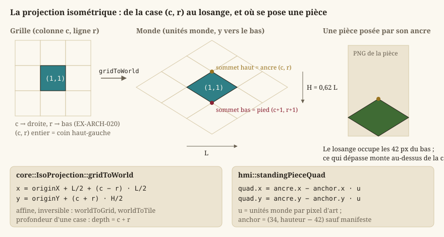
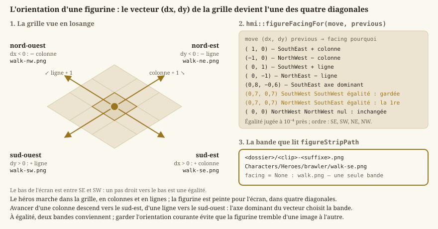
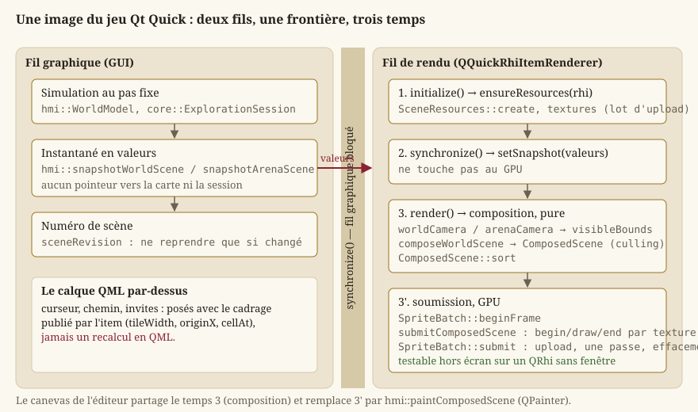

# Rendu 2D : de la scène à l'écran

Cette page explique comment un lieu qu'on parcourt, l'arène du Colisée ou le brouillon de l'éditeur
finissent par apparaître comme une image à l'écran, en partant des notions de base du rendu temps
réel pour qui n'en a jamais écrit. Tout le rendu vit dans `Source/HMI/Graphics`, sur une surface
fournie par Qt (l'éditeur dans `Source/Editor/Ui`, le jeu dans `Source/HMI/Runtime`) ; c'est la
seule partie du moteur qui dépend du GPU, via **QRhi** (voir plus bas — `Core` en reste totalement
indépendant, [Boucle de jeu et pas de temps fixe](guide-boucle.md) et `EX-ARCH-040`).

La page traite chaque en-tête de `Source/HMI/Graphics`, du plus bas niveau (le pipeline) au plus
haut (les scènes, la galerie, le rendu de maquette), puis les éléments Qt Quick de
`Source/HMI/Runtime` qui hébergent ce rendu.

> **Attention** — Depuis le `LOT-103`, le rendu suit le standard 2D HD du `LOT-101` : l'échelle
> de l'art se lit dans le manifeste du lieu (`"tile": [256, 159]`), une figurine se découpe par sa
> cellule entière, l'art peint se filtre en bilinéaire avec mipmaps et en alpha prémultiplié, et la
> caméra cadre une case à la hauteur de la fenêtre divisée par 10,8. Depuis le `LOT-124`, une
> pièce de scène se cherche dans le lieu de la carte **et** dans ses niveaux communs (`Regions/…`,
> `Common/…`) : `hmi::PlaceAppearance::loadForPlace` donne à chaque pièce son chemin sous le niveau
> qui la déclare, et à chaque figurine le dossier `Characters/` qui la range
> (`hmi::PlaceAppearance::figureDirectory`). Une figurine introuvable se dessine par son marqueur.

## Vocabulaire de base : GPU, swap chain, back buffer

Un jeu ne dessine pas directement sur l'écran : il dessine dans une zone mémoire dédiée sur la
carte graphique (le **GPU**, *Graphics Processing Unit*, un processeur spécialisé dans le calcul
massivement parallèle nécessaire pour colorier des millions de pixels par seconde), puis cette
image est transmise à l'écran. Dessiner directement dans l'image **actuellement affichée**
provoquerait un artefact visible (*tearing* : une moitié d'image montre l'ancien contenu, l'autre
le nouveau, si l'écran est en train de la rafraîchir pendant qu'on la modifie). La solution
standard, le **double buffering**, utilise **deux** images en mémoire :

- le **front buffer** : l'image actuellement montrée à l'écran, intouchable ;
- le **back buffer** : une image « en coulisse », sur laquelle le jeu dessine librement la frame
  suivante.

Une fois le back buffer entièrement dessiné, une opération de **présentation** échange les deux
rôles (le back buffer devient le front buffer et inversement) — idéalement au moment précis où
l'écran finit de rafraîchir l'image précédente, ce qui s'appelle la **synchronisation verticale**
(V-Sync) : elle évite le *tearing* en alignant l'échange sur le rythme de rafraîchissement de
l'écran, au prix d'attendre ce moment si le jeu est plus rapide que l'écran. L'ensemble
« back buffer(s) + mécanisme d'échange » s'appelle une **swap chain**.

## QRhi : une couche d'accès au GPU, pas un changement de cible

Le projet ne parle pas à Direct3D 11 directement : il passe par **QRhi**, la couche d'abstraction
de rendu de Qt. La cible technique reste Direct3D 11 — QRhi retient ce backend par défaut sous
Windows (`EX-REN-002`) — mais le device, la *swap chain* et la présentation appartiennent à Qt
(`EX-REN-022`, `EX-ARCH-050`).

Ce que le projet conserve en propre :

- `hmi::SpriteBatch` : le pipeline 2D (tampons de sommets et d'indices, tampon uniforme,
  échantillonneur, états de mélange) et l'émission des lots de dessin ;
- `hmi::TextureLoader` : la création des textures GPU à partir de pixels décodés ;
- les **shaders** (`Source/HMI/Graphics/Shaders/sprite.vert`, `sprite.frag`), écrits une fois en
  GLSL et compilés en `.qsb` par l'outil `qsb` — un `.qsb` contient plusieurs traductions (SPIR-V,
  HLSL, MSL), ce qui permet à QRhi de choisir son backend à l'exécution sans que le projet livre un
  shader par API.

Deux contraintes de QRhi façonnent le code, et méritent d'être connues avant de le lire :

1. **Un téléversement ne se déclare pas pendant une passe de rendu.** Les données (sommets,
   pixels de texture) transitent par un `QRhiResourceUpdateBatch`, soumis **avant** l'ouverture de
   la passe. `hmi::SpriteBatch` enregistre donc toute l'image côté CPU, puis téléverse une fois et
   dessine (`SpriteBatch::submit`) — au lieu de réécrire son tampon entre deux appels de dessin.
2. **L'espace de clip du shader est celui d'OpenGL**, quelle que soit la cible : la matrice de
   projection est multipliée par `QRhi::clipSpaceCorrMatrix()`, qui la ramène à la convention du
   backend retenu.

### `hmi::RhiContext` : le `QRhi` courant et le lot de l'image

`hmi::RhiContext` (`RhiContext.h`) est une petite structure à deux pointeurs, **possédée par la
surface de rendu** et référencée — jamais copiée — par tout ce qui crée des textures :

- `rhi` : l'interface de rendu courante, `nullptr` avant la première initialisation. Elle **peut
  changer** (l'hôte recrée ses ressources quand la fenêtre de haut niveau change) : les
  propriétaires de textures comparent le `QRhi` qu'ils ont servi à celui du contexte plutôt que de
  supposer qu'il ne bouge jamais ;
- `updates` : le lot de mises à jour de l'image en cours, `nullptr` hors d'une image. Les textures
  se chargent paresseusement, en pleine composition ; leurs pixels sont déposés dans ce lot, soumis
  d'un bloc avant l'ouverture de la passe.

`hmi::RhiContext::ready` répond « une texture peut-elle être créée et téléversée maintenant ? » :
les deux pointeurs doivent être posés.

### `hmi::GraphicsLog` : journaliser le cycle de vie, jamais le dessin

`GraphicsLog.h` définit `GRAPHICS_LOG_TRACE/INFO/WARNING/ERROR`, la catégorie « Graphics » des
macros de [Journalisation et assertions](guide-journalisation.md). Elles se réservent aux
événements de cycle de vie (création de ressources, redimensionnement, asset manquant) — jamais aux
chemins exécutés à chaque image, où une ligne de journal coûterait plus que le dessin.

## Les surfaces de dessin : un élément composé avec l'interface

Le rendu n'est jamais présenté dans une fenêtre native embarquée (`EX-REN-050`) : un élément frère
d'une fenêtre native ne se dessine pas de façon fiable par-dessus elle. Les surfaces existantes
sont toutes composées avec le reste de l'interface :

- `hmi::EditorViewport` (`Source/Editor/Ui`) : le canevas de l'éditeur, une **`QGraphicsView`**
  (`LOT-EDITOR-02`). Il ne parle pas au GPU : il peint par `QPainter` la **même** scène composée
  que le jeu soumet (`hmi::paintComposedScene`), en édition comme en essai immédiat
  ([Éditeur de niveaux](guide-editeur.md)), et reçoit les événements clavier/souris **Qt**
  ([Entrées et actions logiques](guide-entrees.md)). Un test
  (`Source/Test/Unit/Editor/test_scene_painter.cpp`) compare son image au rendu QRhi du jeu, cadrage
  pour cadrage ;
- `hmi::WorldViewportItem`, `hmi::ArenaViewportItem` et `hmi::AssetGalleryItem`
  (`Source/HMI/Runtime`) : le lieu qu'on parcourt, l'arène et la galerie de débug, dans le jeu
  Qt Quick. Ce sont des **`QQuickRhiItem`**, exposés au QML ([IHM Qt — deux applications, deux
  technologies](guide-ihm-qt.md)) ; ils sont détaillés en fin de page ;
- `hmi::renderCityBlock` peint **hors écran**, sur un `QRhi` sans fenêtre, l'îlot d'un quartier
  pour l'écran « Carte ».

Toutes possèdent les mêmes ressources graphiques — lot de sprites, atlas, registre de textures —
regroupées dans `hmi::SceneResources`.

### `hmi::SceneResources` : créées ensemble, libérées dans l'ordre

Le regroupement existe pour l'**ordre de libération** : ce qui tient une texture doit mourir avant
la texture, et la texture avant le pipeline qui l'échantillonne. Libérer dans le désordre ne
produit pas une erreur nette mais un plantage à la fermeture, intermittent selon le pilote.
`hmi::SceneResources::release` fixe cet ordre une fois pour toutes ; aucun appelant n'a plus à s'en
souvenir. L'autre raison est la **non-divergence** : deux hôtes (`LOT-86`) créent exactement les
mêmes ressources ; les écrire deux fois aurait suffi à les faire diverger, et cela ne se voit qu'à
l'exécution, sur un seul des deux.

- `hmi::SceneResources::create(rhi, updates)` construit le `SpriteBatch`, le `TextureAtlas` et le
  `TextureCache` sur `rhi`, en déposant les téléversements de la première image dans `updates`, que
  l'appelant soumet ensuite hors de toute passe ;
- `created()` dit si `create` a réussi et que rien n'a été libéré depuis ;
- `setFrameUpdates(updates)` déclare le lot de l'image en cours (`nullptr` en fin d'image) : c'est
  ce que `RhiContext::updates` reflète ;
- `context()`, `sprites()`, `atlas()`, `textures()` donnent accès aux quatre membres.

Ce qui n'y est **pas** — le brouillon d'édition, le `DraftRenderer`, la caméra, la carte jouée —
appartient à un seul des hôtes : le remonter ici ferait payer au jeu ce dont il ne se sert pas.

## Unités monde et pixels : `hmi::Camera2D`

`Core` ne connaît que des **unités monde** ([Mathématiques du moteur](guide-maths.md)) — jamais de
pixels. Le rendu doit donc **convertir** une position monde en position d'écran avant de dessiner
quoi que ce soit ; c'est le rôle de `hmi::Camera2D` (`Camera2D.h`). Deux paramètres gouvernent
cette conversion :

- `hmi::Camera2D::PIXELS_PER_UNIT` = 16 : l'échelle de base, fixée par convention du projet
  (`EX-ARCH-021`) — une unité monde occupe 16 pixels à l'écran avant tout zoom. `Core` en garde une
  copie (`core::ARENA_PIXELS_PER_UNIT`) parce qu'il ne voit pas `HMI` ;
- le **zoom** (`setZoom`, `zoom()`) : un multiplicateur additionnel de cette échelle, strictement
  positif.

La caméra a aussi un **centre** (`setCenter`, `center()`, en unités monde) : le point qui apparaît
au milieu de la surface, dont les dimensions en pixels sont données au constructeur
(`Camera2D(viewportWidth, viewportHeight)`) et mises à jour par `setViewportSize` à chaque
redimensionnement. L'origine écran est en haut à gauche et l'axe Y descend : la convention du
projet, la même que celle des cartes.

- `hmi::Camera2D::projectionMatrix` combine centre, échelle et dimensions de la surface en une
  **matrice de projection orthographique** (ligne-major DirectXMath) : la transformation standard
  qui convertit une position monde en position « clip », l'espace normalisé que le GPU attend en
  sortie du *vertex shader*. C'est cette matrice, et non une conversion manuelle pixel par pixel,
  que le pipeline applique à chaque sommet ;
- `hmi::Camera2D::worldToScreen` et `hmi::Camera2D::screenToWorld` exposent la même conversion
  côté CPU, pour des besoins hors dessin (convertir une position de souris en position monde) ;
- `hmi::Camera2D::visibleBounds` est le rectangle du monde effectivement cadré, dérivé de
  `screenToWorld` : la base du **culling** (plus bas). Aucune notion de cadrage nouvelle n'est
  introduite, la caméra reste la seule source de vérité.

### Cadrer une scène : `fitZoom`, `worldCamera`, `arenaCamera`

`hmi::Camera2D::fitZoom(availableWidth, availableHeight, contentWidth, contentHeight, margin)`
calcule le zoom qui fait tenir un rectangle donné (en unités monde) dans une surface disponible (en
pixels), sans jamais laisser de zone hors champ : le plus petit des deux rapports, multiplié par
`margin` (1 par défaut) pour laisser une marge visuelle, **sans arrondi**. Il s'arrondissait à
l'entier pour la netteté du pixel art ; l'art peint et filtré par mipmaps n'a plus de grille à
protéger (`EX-ARCH-022`, `LOT-103`). Fonction pure, partagée par le canevas de l'éditeur
(`EX-EDIT-013`) et l'arène : aucune règle dupliquée entre les deux.

Les deux scènes du jeu ont chacune **une** fonction de cadrage, qui est la seule géométrie de la
scène à l'écran :

- `hmi::arenaCamera(projection, pixelWidth, pixelHeight)` (`ArenaSceneRenderer.h`) cadre le
  Colisée **entier**, centré, par `fitZoom` ;
- `hmi::worldCamera(projection, focus, pixelWidth, pixelHeight, tilePixels)`
  (`WorldSceneRenderer.h`) **suit** le héros dans le lieu qu'on parcourt (`EX-REN-013`) : une case
  occupe à l'écran la hauteur de la surface divisée par `hmi::WORLD_VIEW_HEIGHT_IN_TILES` = 10,8
  (`hmi::worldTilePixels` : 100 px à 1080p, 200 px à 2160p, donc la même étendue de monde aux deux
  définitions), centrée sur le point suivi, puis ramenée dans la scène — sur un axe où la scène est
  plus petite que la vue, la caméra reste centrée, faute de quoi la carte collerait à un bord.
  `tilePixels`, nul par défaut, impose une autre taille de case : c'est ce que fait l'image d'un
  îlot (`hmi::CITY_BLOCK_TILE_PIXELS`).

L'élément Qt Quick publie ce cadrage à son calque d'interface QML et s'en sert pour traduire le
pointeur en case : deux cadrages recalculés chacun de leur côté ne tombent jamais au même pixel.

## Le pipeline de dessin de sprites : `hmi::SpriteBatch`

### Pourquoi « batcher » plutôt que dessiner un sprite à la fois

Chaque appel de dessin adressé au GPU (un *draw call*) a un coût fixe non négligeable, indépendant
du nombre de pixels dessinés — piloté par la communication CPU → GPU, pas par le travail du GPU
lui-même. Une carte de plusieurs milliers de cases dessinées par des appels **individuels**
saturerait ce coût fixe avant même de saturer le GPU. Le **batching** (« dessin par lots ») regroupe
un grand nombre de sprites partageant la **même texture** en un minimum d'appels de dessin.

L'usage de `hmi::SpriteBatch` (`SpriteBatch.h`), construit sur un `QRhi*` non possédé qui doit lui
survivre (`rhi()` le rend, pour comparer en cas de perte de contexte) :

1. `hmi::SpriteBatch::beginFrame` ouvre l'enregistrement d'une image : sommets et lots de la
   précédente sont vidés (capacité conservée) ;
2. pour chaque lot, `hmi::SpriteBatch::begin(projection, texture)` fixe la texture échantillonnée
   (une `hmi::TextureHandle`, identité opaque, `nullptr` rendant le lot muet) et la projection —
   portée **par lot** et non par image, ce qui permet à une interface en coordonnées écran de se
   dessiner dans la même image que le monde ; puis un ou plusieurs `draw(...)` ; puis
   `hmi::SpriteBatch::end`, qui fige la plage de quads (un lot vide n'émet rien) ;
3. `hmi::SpriteBatch::submit(commandBuffer, target, updates, clear)`, **une fois par image**, hors
   de toute passe : téléverse les sommets et les projections de tous les lots (avec `updates`, le
   lot de téléversements de textures accumulé pendant la composition, éventuellement nul), ouvre sa
   propre passe, efface le fond à `clear` (quatre composantes RGBA dans `[0, 1]`) **même si aucun
   lot n'a été enregistré** — sans quoi une image vide montrerait le résidu de la précédente — et
   émet un appel de dessin par lot.

Le découpage en lots, et donc le nombre d'appels, n'est **pas** décidé ici : c'est
`hmi::ComposedScene` qui le fixe par son tri. Les liaisons de ressources par texture sont gardées
d'une image à l'autre (les recréer à chaque lot allouerait des ressources GPU des centaines de fois
par seconde), le tampon d'indices, immuable, couvre `MAXIMUM_QUADS` = 16 384 quads par appel, et le
pipeline se reconstruit si le descripteur de passe change (redimensionnement, autre fenêtre).

### Trois primitives : `hmi::SpriteQuad`, `hmi::LineQuad`, `hmi::PolyQuad`

Un **quad** est simplement un rectangle (deux triangles, en pratique — un GPU ne sait dessiner que
des triangles). Les trois primitives vivent dans `Quad.h`, **sans dépendance GPU**, pour que la
composition puisse les manipuler sans carte graphique (`EX-NFR-004`) ; elles partagent les
conventions du projet (Y vers le bas, UV normalisées dans `[0, 1]`, teinte RVBA multipliée avec la
texture — une teinte blanche opaque laisse la texture inchangée).

- `hmi::SpriteQuad` : un rectangle **aligné aux axes**, par son coin haut-gauche et sa taille en
  unités monde (`x, y, width, height`), la portion de texture à échantillonner (`u0, v0, u1, v1` —
  la convention universelle pour désigner un point d'une texture indépendamment de sa résolution)
  et sa teinte ; `rotation` (radians, nul par défaut) le tourne autour de son propre centre. C'est
  la primitive des tuiles, des pièces et des figurines ;
- `hmi::LineQuad` : un **segment épais** orienté librement, par ses deux extrémités (`ax, ay, bx,
  by`) et une épaisseur perpendiculaire (`thickness`). `SpriteBatch::draw(const LineQuad&)` calcule
  la normale du segment et pousse quatre sommets décalés d'une demi-épaisseur de part et d'autre ;
  le même tampon d'indices s'applique. Un segment dégénéré (extrémités confondues) ne pousse rien.
  Il sert aux tracés de maquette et aux liens dessinés par l'éditeur ;
- `hmi::PolyQuad` : un quadrilatère à **quatre sommets libres** (`x[4], y[4]`), d'une seule
  teinte — la primitive du **rendu de maquette** (`LOT-128`, décision D1). Un losange isométrique au
  rapport 0,62 n'est ni un rectangle ni un carré tourné, et les faces d'un bloc extrudé sont des
  parallélogrammes : quatre sommets libres couvrent les deux sans rien de neuf pour le GPU. Les
  sommets se donnent dans l'ordre du **pourtour**, sans croisement ; la composition les fournit tels
  quels et la texture liée est l'aplat blanc 1 × 1, de sorte que la teinte seule décide de la
  couleur.

### Sommets, shaders, et échantillonnage

En interne, chaque quad devient 4 **sommets** (position, UV, couleur), envoyés au GPU avec deux
petits programmes qui s'exécutent **sur le GPU** lui-même :

- le **vertex shader** transforme chaque position de sommet (unités monde) vers l'espace clip, via
  la matrice de projection du lot ;
- le **pixel shader** (aussi appelé *fragment shader*) calcule la couleur finale de chaque pixel
  couvert par les triangles, en échantillonnant la texture à la coordonnée UV interpolée et en la
  multipliant par la couleur du sommet.

L'échantillonnage suit la **nature de l'image** (`EX-ARCH-022`, `EX-REN-041`), que la texture
porte depuis sa création (`hmi::TextureFiltering`) :

- l'**art peint**, tout ce qui vient d'un fichier (`hmi::loadTextureFromFile`), est `Smooth` : la
  texture reçoit sa chaîne de **mipmaps** — des copies d'elle-même deux, quatre, huit fois plus
  petites, que le GPU engendre au téléversement — et s'échantillonne en **bilinéaire** entre ses
  niveaux. L'art de scène est toujours réduit à l'écran (256 pixels d'art pour 100 à 1080p) : au
  plus proche, chaque pixel d'écran ne retiendrait qu'un texel sur trois, un autre à la moindre
  fraction de déplacement, et l'image **scintillerait** ;
- une image **engendrée** — damier de repli, aplat blanc, marqueur, atlas procédural — est `Sharp` :
  sans mipmap, au **plus proche**, ses pixels étant voulus un à un.

`SpriteBatch` reconnaît la nature d'une texture à son drapeau `MipMapped` et lui lie l'échantillonneur
qui convient.

Le pipeline gère la **transparence** en alpha **prémultiplié** (mélange `One`/`OneMinusSrcAlpha`) :
toute texture est prémultipliée au téléversement, et le shader prémultiplie la teinte. Sans
prémultiplication, un bord adouci filtré mêlerait la couleur de ses voisins transparents — souvent
noirs — et chaque pièce porterait une frange sombre ; ses mipmaps aussi, moyennées sur de l'alpha
droit, se fonceraient à chaque niveau.

### `hmi::screenProjectionMatrix` : dessiner en pixels

`hmi::screenProjectionMatrix(viewportWidth, viewportHeight)` (`SpriteRenderer.h`) construit la
projection **écran → clip**, indépendante de `Camera2D`, pour ce qui se dessine en pixels d'écran
plutôt qu'en unités monde — la galerie des assets. Même convention (origine haut-gauche, Y vers le
bas) que le reste du rendu.

## Les textures : atlas procédural, fichiers et replis

Un **atlas de texture** (ou *spritesheet*) regroupe **plusieurs** images dans une **seule** grande
texture, à des positions connues. C'est ce qui permet le batching décrit plus haut :
`SpriteBatch::begin` ne prend **qu'une seule** texture par lot, donc dessiner des sprites différents
dans le même appel exige qu'ils proviennent tous du même atlas.

### `hmi::TextureAtlas` : l'atlas des couleurs plates

`hmi::TextureAtlas` (`TextureAtlas.h`) porte une grille de `TILES_PER_SIDE` × `TILES_PER_SIDE` (6 ×
6) régions de `TILE_SIZE` = 16 pixels de côté, **générée en code** à la construction
(`TextureAtlas(const RhiContext&)`) : une couleur distincte par type de tuile, et une case à zones
transparentes pour valider le rendu alpha. Aucun fichier n'est lu, donc aucun échec de chargement
possible (`EX-NFR-040`). Les cases ne bougent pas quand un type disparaît : la couleur d'un type
déjà posé ne change jamais.

- `hmi::TextureAtlas::tile(column, row)` renvoie la **région** (rectangle en pixels,
  `core::AtlasRegion`) d'une case de la grille — pure arithmétique, `static`, testable sans GPU ;
- `textureHandle()`, `width()`, `height()` : l'identité opaque de la texture et ses dimensions,
  pour normaliser les UV.

Les pixels eux-mêmes viennent de `hmi::buildProceduralAtlasImage` (`ProceduralAtlas.h`), fonction
**pure** et déterministe qui renvoie une `hmi::ProceduralAtlasImage` (largeur, hauteur, pixels
`R8G8B8A8` ligne par ligne) : l'unique source des pixels de l'atlas **et** des vignettes de la
palette de l'éditeur.

`hmi::regionForTile(core::TileType)` (`TileVisuals.h`) est l'**unique** correspondance type de
tuile → région, partagée par `hmi::DraftRenderer` et la palette de l'éditeur (`hmi::PalettePanel`),
si bien que la vignette de la palette et la case peinte ont toujours la même couleur. Elle ne
dépend que de la géométrie de grille, jamais d'une texture chargée : la palette peut l'appeler sans
contexte GPU — ce qu'un widget Qt ne doit de toute façon jamais exiger. `Empty` renvoie une région
arbitraire, jamais dessinée.

### Les textures depuis fichiers : `hmi::TextureLoader`

Les scènes du jeu se dessinent à partir de **fichiers image** (`EX-REN-041`, `EX-REN-042`) : les
pièces d'un lieu et les bandes d'animation des figurines. Le chargement (`TextureLoader.h`) se
déroule en deux étapes :

1. **Décodage** — `hmi::decodeImageFile(path)` renvoie `std::optional<hmi::DecodedImage>`
   (largeur, hauteur, pixels `RGBA8` à alpha **droit**, l'image telle que le fichier la porte) ou
   `nullopt` si le fichier est absent, illisible ou d'un format non supporté (erreur récupérable,
   `EX-NFR-040`, jamais d'exception) ;
2. **Upload GPU** — `hmi::createTexture(context, width, height, pixels, filtering)` crée la texture
   par `QRhi::newTexture`, **prémultiplie** ses pixels et les dépose dans `RhiContext::updates` ;
   une texture `hmi::TextureFiltering::Smooth` y reçoit en plus sa chaîne de mipmaps, engendrée par
   le GPU dans le même lot. Le téléversement est **différé** jusqu'à la soumission du lot,
   contrainte de QRhi et non choix d'optimisation. Elle renvoie `std::optional<hmi::LoadedTexture>`,
   texture RAII au pointeur **partagé** (le cache range ses entrées dans un registre qui les copie,
   et une même texture peut servir plusieurs consommateurs le temps d'une image) ;
   `hmi::LoadedTexture::handle` en donne l'identité opaque. L'atlas procédural, les marqueurs et les
   jetons passent par la même fonction, en `Sharp` par défaut : il n'existe qu'un seul endroit qui
   crée une texture sur le GPU.

`hmi::loadTextureFromFile(context, path)` enchaîne les deux, en `Smooth` : tout fichier que le
rendu charge est de l'art peint. `hmi::encodeImageFile(path, image)`
est le symétrique du décodage : il écrit un PNG depuis une `DecodedImage`, de façon **atomique**
(fichier temporaire du même dossier puis `rename`) pour qu'une interruption ne laisse jamais un
fichier tronqué — décoder puis réencoder restitue exactement les mêmes pixels, alpha compris. Il
sert aux captures de test et aux rendus de l'éditeur sans fenêtre.

### Ce qui manque se voit

Un asset absent ou illisible n'interrompt jamais le rendu (`EX-REN-007`, `EX-NFR-040`) :

- `hmi::buildMissingTextureImage(size)` (`MissingTexture.h`) génère un **damier magenta/noir**
  opaque et déterministe de `hmi::MISSING_TEXTURE_SIZE` = 16 pixels par défaut, à carreaux de
  `MISSING_TEXTURE_CHECKER_SIZE` = 4 — impossible à confondre avec un asset réel (aucune palette du
  jeu n'emploie le magenta) ni avec un trou de rendu (une zone transparente passerait inaperçue).
  `hmi::missingTextureWarning(fileName)` compose le message d'avertissement correspondant, **pure**
  et séparée de la journalisation pour être assertable : le message doit nommer l'asset attendu,
  seule information qui dise à l'auteur quoi créer ;
- une entité de carte sans illustration est dessinée par son **marqueur généré** (`LOT-39`,
  `EX-CNT-041`) : `hmi::entityMarkerKey(entityType)` (`EntityMarkers.h`) convertit un type
  d'entité libre en `camelCase` (`spawnPoint`, `NPCGuard`) en clé d'asset valide
  (`marker/spawn-point`, `marker/npc-guard`) selon une règle nommée — une majuscule ouvre un mot,
  `-`, `_` et l'espace séparent, tout autre caractère est ignoré, un résultat vide donne
  `marker/inconnu` (`hmi::ENTITY_MARKER_UNKNOWN_ID`). La clé rendue est donc **toujours** valide :
  un type mal écrit se voit avec un marqueur plutôt que de disparaître. `hmi::markerPixelsRgba8`
  convertit l'image du marqueur (`core::MarkerImage`, peinte par `core::assetMarker`) au format que
  `createTexture` attend ; un marqueur mesure `hmi::ENTITY_MARKER_SIZE_PIXELS` = 16 pixels, une
  case ;
- `hmi::AnimationCatalog::validateAgainstTexture` confronte une description d'animation (voir
  plus bas) aux dimensions du PNG décodé : une bande qui n'y correspond pas est refusée avec un
  verdict (`hmi::AssetValidation`, `AssetContract.h` : `valid`, et un `message` vide si conforme,
  sinon nommant le fichier, le trouvé et l'attendu), plutôt que de produire des artefacts
  silencieux.

### `hmi::CacheRegistry` et `hmi::TextureCache` : mémoïser, échec compris

`hmi::CacheRegistry<Resource>` (`CacheRegistry.h`) est un registre générique clé → ressource,
**pur** et sans dépendance : `hmi::CacheRegistry::getOrLoad(key, loader)` appelle `loader` au
premier accès et **mémorise aussi un échec** (`nullopt`), si bien qu'un asset manquant ne relit pas
le disque à chaque image ; `invalidate(key)` et `invalidateAll` forcent un rechargement ; `size()`
compte les entrées, succès et échecs. Factoriser cette logique hors de tout détail GPU est ce qui
la rend vérifiable sans carte (`EX-NFR-004`).

`hmi::TextureCache` (`TextureCache.h`) compose ce registre pour les **marqueurs d'entité** :
`hmi::TextureCache::markerTexture(key)` crée à la demande, puis conserve, la texture du marqueur
d'une clé d'asset, peinte à une case de côté ; elle renvoie `nullptr` — jamais une exception — si la
clé est malformée ou si la création GPU a échoué. `invalidateAll` retire toutes les entrées, qui
seront recréées au prochain accès. Les ressources sont détenues en RAII et libérées à la
destruction (`EX-NFR-041`).

## L'animation : des clips en données

Une figurine s'anime par **bandes d'images** (`EX-REN-012`), décrites par des **données** plutôt
que codées en dur (`EX-REN-005`). Un clip (`core::AnimationClip`, `Core/Ecs/AnimationClip.h`) est
une donnée pure : un nom, une suite d'indices d'images, une durée par image, bouclé ou joué une
fois (`core::ClipEndMode`). Plusieurs clips forment un `core::ClipSet`, adressable par nom
([ECS : entités, composants, systèmes](guide-ecs.md)).

### `hmi::AnimationCatalog` : lire et valider `nom-asset.anim.json`

La description vit à côté de l'image, dans un fichier `nom-asset.anim.json` — le nom est calculé
par `hmi::AnimationCatalog::descriptorFileName("water.png")` → `water.anim.json`. Elle est lue par
`hmi::AnimationCatalog::loadFromFile` ou `loadFromString`, qui renvoient une
`hmi::AnimationDescriptionResult` : soit une `hmi::AnimationDescription` (largeur et hauteur d'une
image, `core::ClipSet` des clips, bande supposée **horizontale**), soit une erreur décrite par un
`hmi::AnimationCatalogError` — `FileNotFound` (cas **légitime** : l'asset est une image fixe, aucun
avertissement ne doit en résulter), `ParseError`, `UnsupportedVersion` (au-delà de
`FORMAT_VERSION` = 1), `MalformedStructure`, `IncoherentFrameSize`. La durée d'image par défaut est
`DEFAULT_FRAME_DURATION_SECONDS` = 0,1 s. L'enveloppe JSON (racine objet, version) est vérifiée par
la brique partagée du `LOT-79` ([Données, corpus et ressources](guide-donnees.md)).

Trois fonctions **pures** traduisent une description en région de texture :

- `hmi::AnimationCatalog::validateAgainstTexture(description, fileName, width, height)` : la
  hauteur du PNG doit égaler `frameHeight`, sa largeur être un multiple positif de `frameWidth`, et
  chaque indice cité par un clip exister dans le rang. Séparée de la lecture parce que les
  dimensions réelles ne sont connues qu'après décodage (`EX-REN-007`) ;
- `hmi::AnimationCatalog::frameRegion(description, frameSheetIndex)` : le rectangle
  `[indice × frameWidth, 0, frameWidth, frameHeight]`. Elle ne borne pas l'indice : c'est le rôle de
  la validation, en amont ;
- `hmi::AnimationCatalog::currentFrameRegion(description, animation)` : la région de l'image
  courante d'un `core::Animation` (composant ECS), en passant par `AnimationClip::frames` ; repli sur
  la première image si l'animation n'a pas de jeu de clips valide.

Le catalogue ne charge ni ne met en cache aucun PNG : ses appelants (`hmi::ArenaAnimationDriver`,
`hmi::WorldSceneRenderer`, la galerie) le composent avec `hmi::TextureLoader`.

### Au Colisée : `hmi::ArenaAnimationDriver`

Contrairement au personnage exploré (plusieurs clips dans **une** bande), une figurine du Colisée a
**un fichier par action** — `idle.png`, `walk.png`, `attack.png`, `hit.png`, `death.png` —, chacun
décrit par son propre `.anim.json` à un seul clip (`hmi::ArenaFigureAction` : `Idle`, `Walk`,
`Attack`, `Hit`, `Death`).

- `hmi::ArenaFigureAnimationSet` porte ces cinq jeux de clips (`shared_ptr` nuls pour une action
  sans fichier : les ennemis n'ont que `idle.png`, `LOT-50`) ; `forAction(action)` en rend un ;
- `hmi::loadArenaFigureAnimations(sheetDirectory)` lit les cinq fichiers possibles par
  `AnimationCatalog::loadFromFile` et renvoie une `hmi::ArenaFigureAnimationLoad` : les clips, les
  largeurs d'image des bandes dessinées (`idleFrameWidth`, `deathFrameWidth`, 0 si le fichier
  manque) et `errors` — qui ne porte que les fichiers **présents mais invalides**, jamais les
  absents ;
- `hmi::ArenaCombatantAnimation` est l'état d'**un** combattant (planche, action, clips, indice
  d'image **dans le clip**, temps écoulé) ; `frame()` traduit cet indice en indice dans la bande ;
- `hmi::advanceArenaAnimation(state, realDeltaSeconds)` le fait avancer, fonction pure sur le
  patron de `core::advanceAnimation` : une pose unique n'avance jamais (aucune dérive de `elapsed`),
  un clip bouclé revient au début, un clip ponctuel s'arrête net sur sa dernière image ;
- `hmi::ArenaAnimationDriver` pilote tous les combattants au **temps réel du rendu**, sans ECS ni
  pas fixe : `setFigureAnimations(sheet, clips)` déclare une planche ; `play(combatant, sheet,
  action)` démarre une action — `Idle`/`Walk` ne relancent pas s'ils sont déjà en cours,
  `Attack`/`Hit` relancent toujours, `Death` ne se relance **jamais** une fois atteint (pas de
  résurrection par un appel erroné), une action sans fichier retombe sur `Idle` ; `remove` retire un
  combattant sorti ; `advance(realDeltaSeconds)` fait avancer tout le monde et ramène sur `Idle`
  toute action ponctuelle terminée ; `snapshot()` rend un `hmi::ArenaAnimationState` ;
  `actionOf(combatant)` dit l'action en cours.

Le pilote ne lit **jamais** `core::ArenaSession` (`EX-ARCH-012`) : c'est l'appelant qui décide,
d'après les événements de combat, quand appeler `play`. `hmi::ArenaAnimationState`
(`ArenaAnimationState.h`) est la donnée seule que lit la composition : une table combattant →
`hmi::ArenaFigureAnimation` (indice d'image dans la bande) ; `frameOf(combatant)` rend 0 pour un
combattant absent, si bien qu'un état vide compose une scène figée — ce qui suffit aux tests et aux
captures. La composition ne fait jamais avancer cet état : composer deux fois la même scène donne
deux fois les mêmes quads.

## La géométrie des pièces : `core::IsoProjection` et `hmi::ScenePieces`

Le lieu et l'arène se dessinent en **projection isométrique**, la même : `core::IsoProjection`
(`Core/Combat/IsoProjection.h`, détaillée dans [Combat tactique](guide-combat.md)) projette une
case (c, r) en un losange de largeur L et de hauteur H = 0,62 L (`core::ARENA_DIAMOND_RATIO`,
l'angle des tuiles de la planche, pas le 2:1 classique) par une transformation **affine** :
`x = originX + L/2 + (c − r) · L/2`, `y = originY + (c + r) · H/2`. Le coin de grille (c, r) tombe
sur le **sommet haut** du losange, (c + 1, r + 1) sur son sommet bas. `gridToWorld`/`worldToGrid`
sont inverses exacts, `tileToWorld` donne le centre d'une case, `worldToTile` la case sous un
point, `tileBounds` la boîte du losange, et `depth(tile)` = c + r la profondeur d'une case. Une
bande de `wallRise · L` est réservée en haut de la scène pour les murs du fond.



`ScenePieces.h` fixe la géométrie des **pièces de scène**, commune au Colisée (`LOT-50`) et aux
lieux qu'on parcourt (`LOT-09`) — la garder en deux copies ferait de leur égalité une coïncidence.
Elle n'écrit **aucune taille d'art** (`LOT-103`) : l'échelle d'une pièce est une donnée de son lieu.

- `hmi::SceneTexture` : une texture liable et ses dimensions, plus ce que ses fichiers voisins
  disent d'elle — `frameWidth` et `frameHeight` (la cellule d'une bande, 0 pour une image fixe),
  `artTile` (le losange de sol que déclare le manifeste de son dossier, `"tile": [256, 159]`), et
  deux valeurs optionnelles : `anchor` (origine de la pièce, en pixels d'art) et `depthOffset`
  (décalage du pied de tri, en cases). `hmi::ArenaTexture` en est un simple alias ;
- `hmi::artTileWidth(texture)` : les pixels d'art d'une largeur de case — le losange déclaré, à
  défaut la hauteur de la cellule d'une bande, à défaut la largeur de l'image (une pièce sans
  échelle se suppose d'une case de large). C'est lui qui ramène l'art à la projection : une pièce
  dont le lieu déclare 256 pixels occupe exactement une case, et un lieu livré deux fois plus fin
  se dessine à la même taille ;
- `hmi::ScenePieceTextures` : les textures d'un lieu adressées par leur **chemin** tel que la
  composition l'écrit, avec un comparateur transparent (recherche sans chaîne temporaire).
  `resolve(path)` rend la texture ou le damier `missing` ; `find(path)` rend `nullptr` **sans**
  repli, pour ce qui n'a de sens que dessiné juste (un jeton de maquette : un damier à sa place se
  ferait passer pour une pièce manquante) ; `solid` est l'aplat blanc 1 × 1 des primitives de
  couleur (`LOT-128`) ;
- `hmi::standingPieceQuad(texture, topVertex, tileWidth, ratio)` pose une pièce **debout** par
  son ancre, à l'échelle de son lieu : le quad a la taille de la texture ramenée par
  `artTileWidth`, décalé pour que l'ancre — celle du manifeste, à défaut le milieu du losange du bas
  de l'image — tombe sur le sommet haut du losange de la case ;
- `hmi::figureQuad(texture, frame, centerX, bottomY, tileWidth)` pose une **figurine** : l'image
  `frame` de sa bande, sa cellule **entière** (une figurine de 192 × 256 comme une créature de
  384 × 384), sans agrandissement — l'art est livré à sa taille finale (`EX-VIS-008`) ;
- `hmi::floorQuad(bounds)` : la boîte du losange d'une dalle, élargie de `FLOOR_SEAM_OVERLAP`
  (1/256 de case de chaque côté). Une dalle HD a le bord adouci : deux losanges jointifs à l'arête
  près laisseraient passer le fond sous la couture, un treillis sombre sur tout le sol.

`SceneTextureTraits.h` lit ce que les fichiers voisins d'une image disent d'elle, une fois, pour le
jeu, l'arène et l'éditeur : `hmi::readSceneTextureTraits(assets, path)` rend la cellule de son
`.anim.json`, le losange (`hmi::manifestArtTile`) du manifeste de son dossier — ou de celui du
dossier parent pour une figurine (`Characters/<pnj>/idle.png`) —, son ancre
(`hmi::scenePieceAnchor`) et son décalage de profondeur (`hmi::scenePieceDepthOffset`), qui rendent
`nullopt` pour toute valeur absente, non numérique ou non finie ; `hmi::applySceneTextureTraits`
les reporte sur une `SceneTexture`. L'ancre se lit **sans condition** depuis le `LOT-103` : l'opt-in
`placementVersion` protégeait des cartes que la table rase du `LOT-102` a emportées.

## Composer, puis soumettre

C'est ici que les fils se rejoignent. Le rendu se fait en **deux temps distincts**, et cette
séparation est le point le plus important de la page :

1. la **composition** produit une `hmi::ComposedScene` : une liste ordonnée de quads en unités
   monde, chacun avec son calque et sa texture. C'est de la logique **pure** : aucun appel GPU. Trois
   compositeurs existent — `hmi::composeWorldScene` (lieu qu'on parcourt), `hmi::composeArenaScene`
   (Colisée) et `hmi::DraftRenderer` (brouillon de l'éditeur) ;
2. la **soumission** (`hmi::submitComposedScene(batch, projection, scene)`, `SpriteRenderer.h`)
   parcourt cette liste **déjà triée** et l'envoie au `SpriteBatch`, une passe `begin`/`end` par
   groupe **contigu** de même texture, dans l'ordre de la scène. C'est le seul endroit du rendu qui
   reconvertit une `hmi::TextureHandle` (identité opaque, `void*`, `RenderLayer.h`) en ressource
   GPU.

Pourquoi couper en deux ? Parce que la première moitié devient **testable sans GPU**
(`EX-NFR-004`) : `hmi::QuadRecorder` capture la liste composée et permet d'**asserter** l'ordre des
calques, le regroupement par texture ou l'effet du culling, là où il faudrait sinon regarder
l'écran et juger à l'œil. Un critère d'acceptation du type « le rendu n'a pas changé » cesse d'être
une impression pour devenir un test. La composition vit dans la cible CMake `SceneComposition`,
sans GPU ni Qt, que `HmiLib` et l'éditeur lient.

### `hmi::ComposedScene` : la liste ordonnée

Chaque entrée est un `hmi::ComposedQuad` : son calque (`layer`), sa texture (`texture`, `nullptr` =
non dessinable), le **rang de première apparition** de cette texture dans la scène (`textureRank`),
un tri fin (`sortOrder`), et la primitive elle-même — `kind` (`hmi::QuadKind::Sprite`, `Line` ou
`Poly`) dit lequel des trois champs `sprite`, `line`, `poly` est valide. Les trois sont stockés côte
à côte plutôt que dans un `std::variant` : la composition doit rester une simple liste parcourue en
séquence, et quelques dizaines d'octets par primitive dans un tampon réutilisé ne pèsent rien face
à un accès polymorphe sur le chemin de dessin.

L'interface :

- `hmi::ComposedScene::clear` vide la scène (capacité conservée : après les premières images, la
  composition n'alloue plus) et remet les compteurs à zéro ; le cadrage est conservé ;
- `hmi::ComposedScene::setVisibleBounds(worldBounds)` active le **culling** sur le rectangle cadré
  par la caméra ; `clearVisibleBounds` le désactive ; `isCullingEnabled` et `cullingBounds` (le
  cadrage élargi de la marge) l'interrogent ;
- `hmi::ComposedScene::addSprite`, `addLine`, `addPoly` (calque, texture, tri fin, primitive)
  ajoutent une primitive **si elle est visible** et renvoient vrai si elle a été conservée ;
- `hmi::ComposedScene::sort` ordonne la scène, de façon **stable** ;
- `quads()`, `size()`, `batchCount()` (le nombre de passes : groupes contigus de même texture) et
  `statistics()` lisent le résultat.

Trois fonctions libres donnent la **boîte englobante** d'une primitive : `hmi::spriteQuadBounds`,
`hmi::lineQuadBounds` (qui englobe les extrémités **et** l'épaisseur — un segment horizontal aurait
sinon une boîte d'aire nulle, toujours écartée) et `hmi::polyQuadBounds`.

### Les calques : un ordonnancement unique

L'ordre de dessin est d'abord celui des **calques**, `hmi::RenderLayer` (`EX-REN-014`), un jeu
**nommé** et unique dont aucun code ne doit inventer un concurrent :

    Background · Shadow · Tile · Object · Player · UI · EditorOverlay

L'ordre de déclaration **est** l'ordre de dessin. Dans les scènes du jeu, le sol va sur `Tile`, le
relief (murs, torches, bancs…) sur `Object`, les figurines sur `Player` ; le canevas de l'éditeur
pose ses aides (grille, sélection, voile d'aperçu) sur `EditorOverlay`, ce qui les place au-dessus
du reste par construction. `Core` ignore complètement l'existence des calques : c'est une notion de
présentation ; il ne connaît que `core::Sprite::layer`, entier de tri **fin** à l'intérieur d'un
calque. `hmi::renderLayerName` donne le nom lisible d'un calque, pour les journaux et les messages
d'échec de test.

### La profondeur : trier par le pied (`LOT-07`)

En vue de dessus, un calque ne suffit pas : un mur plus bas à l'écran doit passer **devant** une
figurine, un mur plus haut **derrière** (`EX-REN-018`). `Object` et `Player` forment donc une
**bande de profondeur** commune — `hmi::sortsByDepth(layer)` dit si un calque en fait partie,
`hmi::renderBand(layer)` rend la bande de tri, la même pour les deux —, à l'intérieur de laquelle
l'ordre vient de la profondeur et non du calque. Un personnage et un arbre n'ayant jamais la même
texture, aucun ordre de calque ne rendrait les deux cas justes : seule la profondeur le peut, au
prix de passes de dessin supplémentaires.


La profondeur se lit au **pied** du quad — le point de contact avec le sol —, pas à son coin haut :
deux sprites de hauteurs différentes posés sur la même case doivent s'ordonner de la même façon.
`hmi::depthSortOrder(footWorldY)` la quantifie au pixel (`hmi::DEPTH_SUBDIVISIONS_PER_UNIT` = 16) :
départager deux pieds distants de moins d'un pixel ne ferait que les faire scintiller au gré des
arrondis flottants. Un Y plus grand (plus bas à l'écran) donne un ordre plus grand, donc un dessin
plus tard, donc devant. Les compositeurs y ajoutent un **rang** qui départage les pièces d'une même
case (`hmi::arenaDepthSortOrder`, `hmi::worldDepthSortOrder` : `depthSortOrder(pied) × rangs +
rang`) — le relief, puis la figurine posée dessus, puis les étages de la case ; laissé à égalité,
le tri trancherait par rang de texture, qui dépend de la première case composée.

Le tri de la scène composée (`ComposedScene::sort`) est donc d'abord la **bande de calque**. Dans
la bande de profondeur, la **profondeur** tranche, puis la **texture** (regroupement, dans l'ordre
de première apparition) ; dans les autres calques, la texture d'abord, puis l'ordre fin. Regrouper
par texture ne doit sous aucun prétexte faire passer une primitive devant une primitive d'un calque
inférieur. Le regroupement se fait sur le rang de première apparition et non sur la valeur du
pointeur : l'ordre de deux textures d'un même calque reste déterministe d'une exécution à l'autre.
Le tri est **stable** : à clé égale, l'ordre de composition est préservé d'une image à l'autre.

### Ne dessiner que ce qui se voit : le culling

La composition écarte toute primitive dont la boîte englobante n'intersecte pas le cadrage de la
caméra (`hmi::Camera2D::visibleBounds`, transmis par `ComposedScene::setVisibleBounds`), élargi
d'une **marge d'une case** (`hmi::ComposedScene::CULLING_MARGIN_UNITS`) pour qu'une entité à
cheval sur la frontière ne disparaisse pas prématurément. Le rectangle marge comprise est calculé
une fois par `setVisibleBounds`, sur un chemin parcouru des centaines de fois par image. Le test
porte sur la boîte englobante **réelle** et non sur la position d'ancrage : un mur haut dont la case
est hors champ mais dont le sommet dépasse dans l'écran reste composé. Le culling est purement
visuel — une entité écartée continue d'être simulée normalement (`EX-ARCH-012`).

Les compteurs de l'image sont exposés par `hmi::ComposedScene::statistics` (`EX-NFR-005`) dans
une `hmi::SceneStatistics` — `considered` (examinées), `culled` (écartées), `submitted`
(conservées), `batches` (passes) — que `hmi::formatSceneStatistics` met en une ligne lisible pour
le journal de diagnostic.

### `hmi::QuadRecorder` : asserter des listes, jamais des pixels

`hmi::QuadRecorder` (`QuadRecorder.h`) est un outil de **vérification**, hors du chemin de dessin :
la production compose et soumet directement ; le recorder ne fait qu'en **copier** le résultat à la
demande (`record(scene)`), donc sans coût en production. Ses prédicats sont la formulation
assertable des critères d'acceptation du rendu :

- `hmi::QuadRecorder::isLayerOrderRespected` : aucune primitive n'est soumise avant une primitive
  d'un calque inférieur (`EX-REN-014`) ;
- `hmi::QuadRecorder::areTextureGroupsContiguous` : chaque texture forme un seul groupe contigu
  **par calque** (`EX-REN-043`) — une texture qui réapparaîtrait dans le même calque imposerait une
  passe de plus et signalerait un tri instable ; la même texture sur deux calques produit
  légitimement deux passes ;
- `layerSequence()` et `textureSequence()` : les calques et les textures rencontrés, sans
  répétition consécutive (une entrée par passe) ;
- `countOnLayer(layer)`, `countWithTexture(texture)`, `containsSpriteAt(x, y, tolerance)` :
  dénombrements et présence d'un rectangle à une position ;
- `describe()` : une ligne par passe (calque, texture, nombre), à joindre au message d'échec ;
  `quads()`, `size()`, `statistics()`, `clear()`.

### Lecture seule

La composition **lit** l'état du jeu mais ne le modifie **jamais** (`EX-ARCH-012`) — le rendu est
un simple observateur, jamais une source de vérité. L'arène n'est vue que par
`const core::ArenaSession&`, et n'est lue qu'une fois, par `hmi::snapshotArenaScene` ; le lieu, par
`hmi::snapshotWorldScene`. Le rendu est aussi **découplé** de la simulation au pas fixe
(`EX-REN-021`), cohérent avec la séparation décrite en [Boucle de jeu et pas de temps
fixe](guide-boucle.md) : la simulation avance par pas fixes, discrets ; le rendu, lui, redessine le
dernier instantané une fois par **frame** réelle, qu'un pas ait eu lieu ou non entre deux frames.

## Le lieu qu'on parcourt : `hmi::WorldSceneComposer`

La composition d'un lieu (`WorldSceneComposer.h`, `LOT-09`) ne lit qu'un **instantané en valeurs**,
`hmi::WorldSceneSnapshot` : aucun pointeur vers la carte ni vers la session, ce qui lui permet de
tourner sur le fil de rendu de Qt Quick. Ce qui va où : le sol sur `Tile` (profondeur de case), le
relief sur `Object` (pied de la case, rang `hmi::WorldDepthSlot::Relief`), les figurines sur
`Player` (pied de leur case, rang `Figure`), les pièces d'étage sur `Object` encore, au rang de leur
étage (`Storey`, `Storey2`, `Storey3`, `Storey4` — le rang de l'étage `n` est `Storey + n − 1`).

`hmi::WorldDepthSlot` compte donc **six** rangs, et `hmi::WORLD_DEPTH_SLOTS` = 6 est le
multiplicateur de `hmi::worldDepthSortOrder(footWorldY, slot)` :

```
clé = depthSortOrder(pied) × WORLD_DEPTH_SLOTS + rang        WORLD_DEPTH_SLOTS = 2 + MAX_STOREY_FLOOR = 6
      Relief = 0 · Figure = 1 · Storey = 2 · Storey2 = 3 · Storey3 = 4 · Storey4 = 5
```

Un `static_assert` tient l'énumération et `core::MAX_STOREY_FLOOR` d'accord : ajouter un étage au
format sans lui donner un rang ne compile pas. À profondeur égale — la même case —, le relief passe
sous la figurine, qui passe sous l'étage 1, qui passe sous l'étage 2 : c'est ce qui fait qu'un toit
recouvre le héros qui marche derrière l'îlot, et qu'un étage recouvre le mur du rez qui le porte.
Une pièce élevée au-delà du dernier étage nommé se range avec lui.

Les **jetons** de maquette (`LOT-128`) ne sont pas dans cette bande. Posés d'abord au rang de la
figurine qu'ils remplacent, ils se faisaient couper en deux par le premier mur d'en face — un point
d'apparition contre le bord de la carte devenait illisible. Depuis la décision D7 du `LOT-128`, un
jeton est une **marque sur un plan**, pas un objet du monde : il se compose sur `RenderLayer::UI`,
comme les tracés, où il ne peut être caché par rien de la scène. Il garde une clé de profondeur
(celle de sa case, au rang `Figure`), mais elle ne sert qu'à l'ordonner parmi les jetons.

### L'instantané et sa source

`hmi::WorldSceneSnapshot` porte, une entrée par case ligne par ligne : `floors` et `relief` (le
**nom** de la pièce de la planche, vide si la case ne dessine rien), `types` et `reliefTypes` (le
type de chaque case du sol et du décor, ce que la maquette dessine là où aucune pièce n'est nommée),
`footprints` (emprises des pièces de relief plus grandes qu'une case, triées au pied de leur
emprise), `storeys` (les couches d'étage, des `hmi::WorldStoreySnapshot`, de la plus basse à la
plus haute), `figures` (les `hmi::WorldFigureSnapshot`), `marks` (jetons et tracés de maquette),
plus `place` (le lieu, qui nomme le dossier de planches), `diamondRatio` et `maximumRise` (la plus
haute élévation d'une pièce du lieu au-dessus du losange de sa case, en largeurs de case : ce qu'un
cadrage doit réserver au-dessus de la dernière rangée, `hmi::PlaceAppearance::maximumRise`).
`floorAt`, `reliefAt`, `typeAt`, `reliefTypeAt` répondent pour une case, hors grille compris (vide
ou `Empty`).

Deux tables disent **où sont les fichiers**, pour que la composition ne touche jamais au disque :
`pieceFiles` donne, pour chaque pièce citée, son fichier relatif au dossier des assets sous le
niveau qui la déclare (`hmi::PlaceAppearance::pieceFile`, `LOT-124`) — une pièce absente de la
table se cherche en `<nom>.png` dans le dossier propre du lieu (`core::fallbackScenePiecePath`) ;
`figureDirectories` donne, pour chaque figurine posée, le dossier `Characters/` qui la range
(`hmi::PlaceAppearance::figureDirectory`), à défaut la figurine elle-même.

`hmi::WorldStoreySnapshot` est une couche de décor à l'étage `floor` (1 à 4), à la taille de la
carte : `relief`, la pièce nommée par case, et `types`, le type de chaque case — sans pièce nommée,
un mur d'étage s'extrude en maquette comme au rez. Un étage ne se **déduit** pas de la table du lieu
: seule une pièce nommée s'y pose. `snapshotWorldScene` ne retient que les couches de décor dont
`floor` est dans `1..MAX_STOREY_FLOOR` et aux dimensions de la carte, puis les trie par étage.

`hmi::WorldFigureSnapshot` décrit une figurine : `figure` (un slug cherché dans les `Characters/`
du lieu et de ses niveaux communs — `citizen`, `Heroes/brawler` —, à défaut un dossier relatif aux
assets s'il contient une barre, ou un PNJ de l'atelier à plat, `Npc/<slug>`), `clip` (`idle`,
`walk`), `point` (position **continue** en cases : `{1.5, 2.5}` est le centre de la case (1, 2)),
`frame` (image de la bande, ramenée dans la bande par la composition), `facing` (l'orientation,
`hmi::FigureFacing`, voir plus bas ; `None` pour une figurine qui n'a qu'une bande par animation),
`seconds` (le temps écoulé : s'il est connu — positif ou nul — et que la bande dit la durée de ses
images dans son `.anim.json`, c'est lui qui choisit l'image et non `frame`, la cadence étant une
donnée de l'art, `EX-REN-005`) et `hero` (vrai pour le héros, et lui seul : c'est devant lui qu'un
étage s'efface).

L'instantané se tire d'une `hmi::WorldSceneSource` — trois références : la grille racine (`root`,
collision et sol d'une carte sans couche visuelle), les couches (`layers` : la première de sol donne
le sol, la première de décor le relief ; la pièce qu'une case nomme l'emporte sur la table du lieu)
et les entités. `hmi::worldSceneSource(map)` la construit indifféremment d'une `core::Level`
validée (le jeu) ou d'une `core::LevelDraft` (l'éditeur, dont le brouillon est rarement valide) :
la composition n'a qu'**un** chemin (`LOT-EDITOR-02`). Puis :

- `hmi::snapshotWorldScene(source, appearance, figures)` (et sa surcharge pour une `core::Level`)
  produit l'instantané : sol depuis la couche visuelle de sol (`core::LayerKind::Ground`, à défaut
  la grille racine), relief depuis la couche décor — la pièce que la case nomme, sous son nom courant
  (`hmi::PlaceAppearance::canonicalPiece`), à défaut celle que la table du lieu donne à son type ;
- `hmi::scenePlaceOf(layers)` / `scenePlaceOf(level)` lit le lieu déclaré par la propriété de couche
  `scene` (`hmi::SCENE_PLACE_PROPERTY`), vide sinon ;
- `hmi::npcFigures(entities, frame)` : les figurines des PNJ, dans l'ordre des entités ; un PNJ
  sans propriété `figure` ne se dessine pas. Le jeu y ajoute le héros (`hmi::WorldPlay::figures`),
  l'éditeur les montre telles quelles ;
- `hmi::figureStripPath(figure, clip, facing)` : le chemin d'une bande, `<dossier>/<clip>.png`
  pour un dossier relatif aux assets, `Npc/<slug>/<clip>.png` pour un slug seul (cherché à plat,
  `core::figureDirectory`), et `<clip>-se.png`, `<clip>-sw.png`, `<clip>-ne.png` ou `<clip>-nw.png`
  dès que `facing` n'est pas `None` (`hmi::figureFacingSuffix`) ; `hmi::figureMarkerKey(path)` en
  tire la clé du marqueur (`npc/<slug>`, `monsters/<slug>`, `characters/<dossier>`) d'une figurine
  qui n'a pas encore d'image (`EX-CNT-041`) : on la voit, on lui parle, et on ne la prend pas pour
  une illustration ;
- `hmi::worldTexturePaths(snapshot)` : tous les chemins que l'instantané demandera, sans doublon,
  triés — ce que le rendu doit charger, ni une pièce oubliée, ni une de trop : les pièces du sol, du
  relief et de chaque étage, les bandes `idle` **et** `walk` de chaque figurine dans son orientation
  (le rendu ne doit pas charger une texture au milieu d'une image), et les chemins de jeton.

### L'orientation des figurines : quatre diagonales

Une figurine du standard 2D HD est peinte dans **quatre** orientations (`LOT-112`), et le moteur
doit choisir laquelle montrer. `core::ExplorationSession::facing` garde la dernière direction non
nulle que le héros a prise, en cases : `(dx, dy)`, `dx` le long des colonnes, `dy` le long des
lignes. Or une case de la grille se voit en losange : avancer d'une **colonne** descend vers le
**sud-est** de l'écran, avancer d'une **ligne** vers le **sud-ouest**. Les quatre directions de la
grille sont donc les quatre diagonales de l'écran, et c'est ce que nomme `hmi::FigureFacing` :
`SouthEast`, `SouthWest`, `NorthEast`, `NorthWest`, plus `None` pour une figurine qui n'a qu'une
bande par animation (`walk.png`).



`hmi::figureFacingFor(move, previous)` fait la conversion : l'**axe dominant** l'emporte — `dx > 0`
donne `SouthEast`, `dx < 0` `NorthWest`, `dy > 0` `SouthWest`, `dy < 0` `NorthEast`. À égalité
des deux axes — deux touches enfoncées, un pas droit vers le bas de l'écran —, deux diagonales
conviennent aussi bien, et basculer de l'une à l'autre à chaque pas ferait trembler la figurine :
elle **garde** `previous` si c'est l'une des deux, sinon prend la première des deux dans l'ordre de
l'énumération (sud-est, sud-ouest, nord-est, nord-ouest). L'égalité se juge à 10<sup>−4</sup> près,
parce qu'une diagonale normalisée n'a pas deux composantes rigoureusement égales après division
par sa longueur. Un déplacement nul rend `previous`. `hmi::WorldPlay` l'appelle à chaque pas où le
héros marche, avec l'intention de déplacement, et ne signale la scène changée que si l'orientation
a changé ; il ne le fait que si la figurine est **orientée**, ce qu'il décide une fois pour toutes en
cherchant sa bande `idle-se.png` (la première que l'atelier produit ; `check_hd_assets.py` exige
les quatre). `hmi::figureFacingSuffix(facing)` rend `se`, `sw`, `ne`, `nw` — vide pour `None` —,
le suffixe que `figureStripPath` colle au nom de la bande.

### Composer

`hmi::composeWorldScene(scene, snapshot, projection, textures, options)` compose dans un tampon
réutilisé, **ni vidé ni trié** : l'appelant enchaîne `clear()`, les compositions, puis `sort()`. La
surcharge sans tampon rend une scène neuve triée, commodité des tests et des captures.
`hmi::WorldComposeOptions::flatBlocks` dessine les blocs de maquette **à plat** — le vocabulaire des
plans de principe (`LevelEditor --render --plan`, `LOT-128`) : un plan dit ce que la carte contient
et comment on y circule, et l'extrusion, faite pour jouer, y cacherait ce qu'on vient lire. La
marge basse d'une figurine, `hmi::WORLD_FIGURE_BOTTOM_MARGIN` = 0,42 hauteur de losange, est la
même qu'à l'arène.

La composition parcourt la carte ligne par ligne : le sol et le relief du rez de chaque case, puis
les étages du plus bas au plus haut, puis les figurines, puis les jetons et les tracés. Une bande de
figurine se lit par ses propres traits (`hmi::SceneTexture`) : `frameWidth` et `frameHeight`, sa
cellule, viennent de son `.anim.json`, et `hmi::frameWidthOf`, `hmi::frameHeightOf` (la texture
entière pour une image fixe) et `hmi::frameCountOf` (largeur totale divisée par la cellule, au
moins 1) en tirent la découpe — une image demandée hors bande est ramenée dedans plutôt que lue à
côté de la texture. `hmi::artTileWidth` et `hmi::artTileHeight(texture, ratio)` donnent le losange
de l'art (`"tile"` du manifeste, à défaut mesuré sur l'image), l'échelle à laquelle toute pièce se
ramène à la largeur d'une case de la projection.

### Les étages : élevés, triés au-dessus, effacés devant le héros

Une pièce d'une couche d'étage se pose comme une pièce de relief, à deux différences près
(`LOT-129`). Son **sommet** est remonté de `n` hauteurs d'étage : `SceneTexture::storeyHeight`, le
`"storey"` du manifeste du lieu en pixels d'art (224 pour la Capitale), converti à l'échelle de la
projection par `storey × tileWidth / artTileWidth` ; un lieu qui n'en déclare pas s'élève de
`hmi::DEFAULT_STOREY_TILES` = 1 largeur de case par étage. Son **pied**, lui, reste celui de sa
case : elle se trie avec elle, au rang de son étage — et jamais avant le pied de ce qui la porte.
Un mur de deux cases se trie au pied de sa seconde case ; le toit posé sur sa première, trié au
pied de la première, passait avant lui et le mur en recouvrait l'égout. La composition tient donc,
case par case, le pied le plus avancé de ce qui couvre la case (`coverCells`, sur l'emprise de la
pièce), et chaque étage s'y trie au plus tôt. En maquette, une case d'étage sans pièce nommée
s'extrude en bloc élevé d'autant de hauteurs de bloc (`hmi::maquetteShape` du mur), pour que les
blocs s'empilent.

L'**effacement** : le héros derrière un îlot doit rester visible. Avant de composer quoi que ce
soit, la composition **place le héros** (`hero == true` dans l'instantané) et retient deux choses :
la boîte englobante de son quad (`hmi::spriteQuadBounds`) et sa clé de tri. Ensuite, chaque pièce
d'étage — jamais une pièce du rez — dont la clé est **plus grande** que celle du héros (elle se
dessine après lui, donc devant) et dont la boîte **intersecte** la sienne prend l'opacité
`hmi::STOREY_SEE_THROUGH_OPACITY` = 0,35 : on le voit à travers le toit. Un bloc de maquette
d'étage fait de même, avec la boîte de son bloc élevé. Le test porte sur la **pièce entière** et
non sur la seule case du héros, question ouverte du lot tranchée à l'essai : un disque découpé
autour du héros se lit moins bien qu'une pièce translucide, et coûte un masque de plus, là que
multiplier l'alpha d'un quad ne coûte rien. Le rez ne s'efface pas : un mur devant le héros le cache
pour de bon, c'est le sens d'un mur. Un PNJ n'efface rien non plus, et c'est voulu — le test de
rendu du lot montre le héros à travers sur 37 500 pixels, un PNJ au même endroit sur 2 779. Chaque
quad porte son étage (`hmi::ComposedQuad::storey`) : le jeu s'en sert pour cet effacement,
l'éditeur pour l'opacité et la visibilité de la couche d'étage.

### La table du lieu : `hmi::PlaceAppearance`

`hmi::PlaceAppearance` (`PlaceAppearance.h`, `EX-REN-010`) traduit un **type de tuile** en pièce de
la planche, pour le sol et pour le relief. La règle, décidée par l'auteur le 17 septembre 2026 : le
**sol** vient du type (dense — sept mille cases au Colisée —, le nommer à la case rendrait la carte
illisible), le **relief** nomme sa pièce à la case (rare et voulu) et retombe sur la table à défaut.
Depuis le format v4 (`LOT-EDITOR-12`), toute case peut nommer sa pièce, et la table n'est plus que le
**défaut** — celui des cartes générées, et d'une case sans pièce. Logique pure, aucune lecture ne
lève : un fichier absent donne une table vide, et une case sans pièce ne dessine rien plutôt que de
tomber sur un damier sur sept mille cases.

- `hmi::PlaceAppearance::loadFromFile` / `loadFromString` rendent une `hmi::PlaceAppearanceResult`
  (la table, un `hmi::PlaceAppearanceError` — `None`, `FileNotFound`, `ParseError`,
  `UnsupportedVersion`, `MalformedStructure` — et un message technique ; `ok()`). `loadFromFile`
  lit aussi le **manifeste** voisin (`manifest.json`) par `adoptManifest(core::ScenePieceManifest)` :
  les anciens noms des pièces (`aliases`) et leurs emprises ;
- `hmi::PlaceAppearance::loadForPlace(assetsDirectory, place)` est ce que le jeu et l'éditeur
  lisent réellement depuis le `LOT-124` : la table du lieu **et de ses niveaux communs**. Un lieu
  est un chemin (`central-empire/capital/arenarea`), et `core::sceneLevelCandidates(place)` en
  énumère les niveaux du plus propre au plus commun — la zone, la ville, la région, le monde ; ce
  que chaque niveau range est décrit dans [Données, corpus et ressources](guide-donnees.md).
  `loadForPlace` lit la table `appearance.json` de **chaque** niveau et les empile par
  `fillFrom` : pour un type de tuile, la table **la plus propre** qui le traduit l'emporte, et un
  niveau plus commun ne fournit que les types que les niveaux au-dessus ignorent. Les pièces sont
  celles du catalogue résolu (`core::ScenePieceManifest::resolve`), chacune sous son dossier
  d'origine ; les figurines, celles des `Characters/` de ses niveaux (`core::resolveFigures`).
  `FileNotFound` n'est rendu que si **aucun** niveau n'a ni table, ni manifeste, ni figurine — un
  lieu vide a encore celles du monde, et c'est ainsi qu'une carte de maquette pose ses PNJ ;
- `hmi::PlaceAppearance::pieceFile(name)` rend le fichier d'une pièce, **relatif à `Assets/`**,
  sous le niveau qui la déclare (`Regions/…/Common/Scene/floors/floor-01.png`) ; à défaut
  `<nom>.png` dans le dossier propre du lieu, vide sans lieu. `figureDirectory(figure)` rend de
  même le dossier d'une figurine, par slug, à défaut par `core::figureDirectory`. C'est de ces deux
  méthodes que l'instantané remplit `pieceFiles` et `figureDirectories`, une fois, pour que la
  composition n'ait plus qu'à consulter une table ; `maximumRise()` est l'élévation maximale des
  pièces du manifeste, 0 sans manifeste ou pour un lieu de pièces plates ; `pieceManifest()` rend le
  catalogue adopté, partagé entre les copies de la table ;
- `hmi::PlaceAppearance::floorPiece(type, cell)` et `reliefPiece(type, cell)` rendent le nom de la
  pièce (`sand-2`), vide si le type n'a aucune pièce dans ce lieu. La variante est choisie par la
  case : `(colonne × 7 + ligne × 13) % nombre de variantes` — un tirage aléatoire ferait scintiller
  le sol d'une image à l'autre, un compteur le ferait dépendre de l'ordre de parcours ;
- `hmi::PlaceAppearance::typeOfPiece(piece, floor)` est la réciproque (`LOT-EDITOR-03`) : une
  pièce posée à la main garde le type dont la table la tirerait, le type restant le sens de règle de
  la case ; `nullopt` si aucun type ne la cite ;
- `canonicalPiece(name)` (le nom courant d'un ancien nom), `pieceFootprint(name)` (1 × 1 si
  inconnue), `pieces()` (tous les noms, triés, sans doublon — ce que le rendu charge), `place()`,
  `diamondRatio()`, `empty()`.

## Le Colisée : `hmi::ArenaSceneComposer` et `hmi::ArenaAppearanceCatalog`

La scène de combat (`ArenaSceneComposer.h`, `LOT-86` phase 3) suit les mêmes règles avec une autre
source : une grille de combat. Le sol va sur `Tile`, l'enceinte (pan, angle, pilier, bannière,
torche, arche) sur `Object`, les figurines sur `Player` ; `hmi::ArenaDepthSlot` (`Wall`,
`WallDecoration`, `Gate`, `Figure`, `hmi::ARENA_DEPTH_SLOTS` = 4) départage les pièces d'une même
case dans l'ordre où l'ancienne brique QML les empilait, et `hmi::arenaDepthSortOrder(footWorldY,
slot)` compose la clé. Le pied est le **sommet bas** du losange de la case (de l'emprise, pour une
figurine), pas le bord bas du quad : une bannière posée plus haut que son mur doit rester devant
lui.

- `hmi::ArenaSceneSnapshot` : la grille en valeurs — `columns`, `rows`, `obstructed` (une entrée
  par case : la case obstrue-t-elle le sol, ce que l'enceinte habille ; `isObstructed(cell)`), et
  `figures`, les `hmi::ArenaFigureSnapshot` (identifiant, nom — qui choisit la planche —, côté, à
  terre ou non, coin de l'emprise, côté de l'emprise). Les combattants sortis (`Withdrawn`) n'y sont
  pas ;
- `hmi::snapshotArenaScene(session)` le tire d'une `const core::ArenaSession&` en une seule
  lecture ; `core::CombatState` n'est pas copiable, l'instantané ne copie que ce qui se dessine ;
- `hmi::ArenaTexture` et `hmi::ArenaSceneTextures` : le pendant de `SceneTexture`/
  `ScenePieceTextures` pour le Colisée, adressé par chemin relatif au dossier de la planche
  (`resolve` retombe sur le damier) ;
- `hmi::arenaTexturePaths(catalog)` : tous les chemins que la composition peut demander pour un
  catalogue (sols, enceinte, dalles claires, bandes des figurines) ;
- `hmi::composeArenaScene` existe en trois formes : dans un tampon depuis un instantané (avec
  `scenery` : composer le décor historique, faux quand la carte fournit le décor), dans un tampon
  depuis la session (équivaut à composer `snapshotArenaScene(session)`), ou dans une scène neuve
  triée.

Les combattants : `Standing` dessine une figurine à l'image que donne `ArenaAnimationState` ;
`Down` dessine **quand même** une figurine (le combattant garde sa case et sa place dans l'ordre) —
un allié montre la dernière image de `death.png`, un ennemi la dernière d'`idle.png` estompée
(`hmi::ARENA_DOWN_ENEMY_ALPHA` = 0,45) ; `Withdrawn` ne produit aucun quad. Une créature de plus
d'une case a **une** figurine, centrée sur son emprise et agrandie à sa taille. Les surbrillances de
case, la jauge, les points de vie et le curseur de ciblage ne sont pas des pièces : ils restent en
QML par-dessus (`LOT-24`).

`hmi::ArenaAppearanceCatalog` (`ArenaAppearanceCatalog.h`) dit le **rôle** de chaque case et la
**figurine** de chaque combattant, lus dans le manifeste de la planche du Colisée (`heroes`,
`gladiators`, `heroFrames`, `enemyFrames`, `paleSlabs`, `scene`) — logique pure, aucune lecture ne
lève :

- `hmi::ArenaAppearanceCatalog::tileAppearance(cell, columns, rows, wall)` rend une
  `hmi::ArenaTileAppearance` : `wall` (donnée d'entrée, reçue de `BattleGrid::isObstructed`, jamais
  recalculée), `wallFeature` (`hmi::WallFeature` : `Plain` partout, `Corner` aux quatre angles,
  `BannerSpot` tous les cinq pas sur les bords haut et bas, `TorchSpot` tous les quatre pas sur les
  bords gauche et droit), `gateSpot` (case franchissable du bord : l'arche s'y dessine), `slab` et
  `slabVariant` (dalle claire plutôt que sable) ;
- `hmi::ArenaAppearanceCatalog::figureFor(name, side)` rend une `hmi::FigureAppearance` (`sheet`,
  `directory`, `frameCount`), choisie d'après le **nom** pour rester la même d'un tour à l'autre
  sans état à tenir ; `sheetDirectory(sheet, side)` donne `characters/<sheet>` ou
  `enemies/<sheet>` sauf remplacement ;
- `hmi::ArenaAppearanceCatalog::replaceHero(hero, directory)` fait lire les bandes d'un héros dans
  un autre dossier — la figurine d'un PNJ de l'atelier (`LOT-91`) à la place d'un héros de la
  planche —, le nom du héros ne changeant pas ; `applyNpcManifest(path)` applique les
  remplacements déclarés par le manifeste des PNJ (champ `replaces`), fichier absent = rien,
  entrée invalide = avertissement et ignorée ;
- `scene()` : le lieu dont l'arène emprunte ses pièces — le kit dit lui-même de quelle planche il
  se sert, rien n'est écrit en dur (`LOT-102`) ; `heroes()`, `gladiators()`, `paleSlabs()`,
  `heroFrames()`, `enemyFrames()` ;
- `loadFromFile` / `loadFromString` rendent une `hmi::ArenaAppearanceCatalogResult` (catalogue
  optionnel, `error`, `hmi::ArenaAppearanceError` ; `ok()`).

## Le rendu de maquette : `hmi::MaquettePalette` et `hmi::MaquetteTokens`

Une carte doit se dessiner quand **aucun** fichier d'asset n'est présent (`EX-EXP-005`) : c'est la
situation du dépôt depuis la table rase, et la raison d'être du rendu de maquette (`LOT-128`). Là
où une case ne nomme aucune pièce, la composition dessine son **type** en couleur plate.

- `hmi::MaquetteColor` (`MaquettePalette.h`) est une teinte en composantes `[0, 1]` ;
  `hmi::maquetteColorOf(0x3f6b34)` la construit depuis l'écriture hexadécimale ;
- `hmi::maquetteColor(type)` donne la teinte de chaque `core::TileType` par un `switch`
  **exhaustif sans `default`** : ajouter un type au vocabulaire du terrain fait désigner ce point
  par le compilateur, plutôt que de laisser la case nouvelle se peindre en blanc. La palette vit en
  code, pas dans un fichier (décision D5) : une palette chargée du disque réintroduirait la
  dépendance que le lot supprime, et ses teintes sont celles des plans de principe du planning,
  sourdes et accordées — pas les teintes vives de `regionForTile`, faites pour un canevas de
  travail ;
- `hmi::maquetteExtrudes(type)` : `Wall`, `Solid` et `Cliff` se dessinent en **bloc extrudé**
  (matière pleine, qui masque ce qui est derrière) ; `DeepWater` bloque le pas mais reste un losange
  plat, plus sombre, qu'on voit par-dessus ;
- `hmi::maquetteShape(type)` rend la **forme** d'un type en maquette, un `hmi::MaquetteShape` :
  `height`, la hauteur du bloc en hauteurs de losange (`0` : un losange plat, sans bloc), et
  `footprint`, la fraction du losange qu'occupe la base du bloc, centrée (`1` : toute la case). Un
  bloc d'une case de côté et d'une case de haut dit « mur » ; il ne dit ni une colonne, ni une
  palissade, ni un arbre — la hauteur et l'emprise sont ce qui les distingue d'un coup d'œil, sans
  texture. Un mur, une matière pleine et une falaise font `1` de haut sur toute la case ; un arbre
  `2` sur 0,6 ; une colonne `2` sur 0,45 ; un toit et un gradin `1,5` sur toute la case ; un étal
  `0,7` sur 0,9 ; un rocher `0,6` sur 0,75 ; une caisse `0,5` sur 0,7 ; une palissade `0,45` et un
  muret `0,4` sur toute la case ; un buisson `0,35` sur 0,85 ; les sols restent plats. Le bloc se
  dessine en trois faces — dessus, gauche, droite — éclairées différemment, sans quoi trois quads de
  la même teinte redonneraient une tache plate, et un bloc étroit reçoit un socle au sol. C'est
  aussi la hauteur du mur (`1`) qui sert d'élévation à un étage de maquette.

Les **jetons** (`MaquetteTokens.h`, décision D2) tiennent lieu de figurine : un disque de couleur
cerné, sa lettre au centre. Il n'existe aucun rendu de texte en scène côté jeu ; plutôt que d'en
introduire un pour trente-six caractères, le jeton est **peint en code pur** puis téléversé comme
n'importe quelle texture — parité par construction entre le jeu (QRhi) et l'éditeur (`QPainter`),
qui montrent la même image et non deux dessins qui se ressemblent.

- `hmi::MaquetteTokenKind` : `Player` (entrée de carte, point d'apparition, entrée d'arène alliée),
  `Talker` (PNJ qui porte un dialogue), `Neutral`, `Hostile` (rencontre, entrée d'arène adverse),
  `Object` (coffre, panneau), `Portal`. La couleur se déduit de ce que le format dit déjà : aucune
  propriété n'est ajoutée pour elle (décision D3) ; `hmi::maquetteTokenColor(kind)` et
  `hmi::maquetteTokenKindKey(kind)` (`player`, `talker`…) ;
- `hmi::maquetteTokenLetter(name)` : le premier caractère alphanumérique du nom, en majuscule
  (`market-mother` → `M`), `?` à défaut ;
- `hmi::maquetteTokenPath(kind, letter)` écrit `Token/<nature>/<lettre>.png`, et
  `hmi::parseMaquetteTokenPath` le relit en `hmi::MaquetteTokenRequest` : un jeton s'adresse
  **comme une planche**, si bien que les deux rendus voient un chemin de plus dans
  `worldTexturePaths` et savent qu'un chemin de jeton se peint au lieu de se charger ;
- `hmi::maquetteTokenImage(request, size)` (ou depuis un chemin) peint le jeton, déterministe sur
  toute plateforme — ce qui permet au test de comparer le jeu et l'éditeur pixel à pixel ;
  `hmi::MAQUETTE_TOKEN_SIZE_PIXELS` = 44 ;
- `hmi::maquetteTextImage(text, scale, color)` peint un libellé avec la **même table de glyphes** :
  `LevelEditor --render` tourne sans `QApplication` (`LOT-EDITOR-13`) et n'a aucune police, si bien
  que la légende du plan de principe s'écrit avec les glyphes des jetons.

Côté composition, `hmi::maquetteMarks(entities, maquette)` choisit les marques d'une carte
(`hmi::MaquetteMarks` : `tokens`, des `hmi::MaquetteTokenSnapshot` — nature, lettre, case, flèche
de portail — et `traces`, des `hmi::MaquetteTraceSnapshot` de forme `hmi::MaquetteTraceShape::
Outline` (le contour du losange de chaque case citée : une zone) ou `Path` (une ligne brisée par les
centres : un trajet)). Les jetons se posent **toujours** — une entité sans figurine est invisible
autrement ; les tracés et les flèches ne paraissent qu'en maquette : une carte finie ne montre pas
ses déclencheurs.

## Assembler la frame complète

Les deux rendus de scène du jeu, `hmi::WorldSceneRenderer` et `hmi::ArenaSceneRenderer`, suivent
les trois mêmes temps, que l'élément Qt Quick ne fait que relayer :

1. `ensureResources(rhi)`, sur le fil de rendu : crée les `SceneResources` et les textures, ou les
   **libère puis recrée** si l'interface QRhi a changé — une ressource de l'ancienne interface ne
   doit plus servir ; rend faux si `rhi` est nul ;
2. `setSnapshot(...)`, depuis `synchronize()` : remplace la scène à dessiner, **en valeurs**, sans
   toucher au GPU — appelable avant les ressources ;
3. `render(commandBuffer, target, ...)`, sur le fil de rendu : `SpriteBatch::beginFrame`, cadrage
   (`worldCamera`/`arenaCamera`, la taille de la cible fixant le cadrage), composition,
   `submitComposedScene`, puis `SpriteBatch::submit`, qui téléverse les sommets et les textures
   accumulés et émet l'unique passe de l'image.



C'est ce découpage qui rend le rendu testable hors écran : tout ce qui peut casser — l'ordre de
création, l'ordre de libération, la recréation sur une autre interface QRhi — vit dans ces classes,
qu'un test (`Source/Test/Unit/HMI/Graphics/test_arena_scene_renderer.cpp`) fait tourner sur un vrai
`QRhi` Direct3D 11 sans fenêtre. Les textures meurent **avant** `SceneResources`, qui libère
ensuite sa grappe dans l'ordre qu'elle fixe ; les membres sont déclarés dans cet ordre pour que le
destructeur implicite fasse la même chose que `release()`.

### `hmi::WorldSceneRenderer`

Construit sur le dossier des assets (`Source/Elements/Assets`, copié à côté de l'exécutable), où
les chemins de l'instantané se résolvent ; absent, rien à dessiner que le fond, jamais une erreur
bloquante. Une différence avec l'arène, et une seule : **les textures ne sont pas connues
d'avance**. Un lieu a les pièces de sa carte, et la carte change au passage d'un portail. Elles se
chargent donc **à la demande**, sur le fil de rendu, quand l'instantané réclame un chemin que le
rendu n'a pas ; `requested()` liste les chemins déjà tentés, réussis ou non — une pièce absente
n'est pas redemandée à chaque image, et un test vérifie qu'une carte ne redemande pas ce qu'elle a
déjà. Un chemin de jeton est peint (`maquetteTokenImage`) au lieu d'être lu ; une bande de
figurine absente reçoit son marqueur (`figureMarkerKey`).

- `setFocus(focusCells)` / `focus()` : le point suivi par la caméra, en cases (position continue
  du héros) ;
- `setSnapshot(snapshot)` / `snapshot()`, `render(commandBuffer, target, clear)` : efface à
  `clear`, puis dessine le lieu cadré sur le héros ;
- `composed()`, `textures()`, `created()`, `rhi()`, `release()`.

### `hmi::ArenaSceneRenderer`

Construit sur le dossier de la planche du Colisée (manifeste, pièces, `.anim.json` ; absent =
catalogue vide, rien que le fond) et un drapeau `productionMap` (utiliser la carte du catalogue
comme décor de combat, auquel cas le décor historique de la composition n'est plus composé). Le
manifeste des PNJ voisin peut mettre un PNJ à la place d'un héros (`applyNpcManifest`).

- `setSnapshot(snapshot)` : un combattant qui apparaît commence son repos (`Idle`), un combattant
  qui disparaît quitte le pilotage d'animation ;
- `render(commandBuffer, target, realDeltaSeconds, clear)` : **avance l'animation** du temps réel
  écoulé (`ArenaAnimationDriver::advance`), compose, trie, soumet ;
- `animating()` : vrai si une figurine est à l'écran — l'image suivante doit être demandée ;
- `catalog()`, `textures()`, `composed()`, `created()`, `rhi()`, `release()`.

> **Note** — Depuis le `LOT-102`, ni la planche du Colisée ni les bandes de figurines n'existent
> dans le dépôt : le catalogue est vide et le renderer ne dessine que le fond. La capture
> `jeu-arena.jpg` (plus bas) le montre. L'Arena of Fate HD arrive avec les `LOT-106` et `LOT-107`.

### `hmi::renderCityBlock` : l'îlot d'un quartier, hors écran

Décision de l'auteur du 18 septembre 2026 (`LOT-96`) : l'îlot n'a pas d'image à lui ; l'écran
« Carte » le montre par le **même** rendu que le lieu, hors écran, sur un `QRhi` sans fenêtre —
rien à peindre, et un plan qui ne peut pas diverger du terrain. `hmi::cityBlockFraming(projection,
block, maximumRise, tilePixels)` (`CityBlockRender.h`) rend un `hmi::CityBlockFraming` (point suivi,
taille d'image) : le losange englobant de l'îlot à `hmi::CITY_BLOCK_TILE_PIXELS` = 100 pixels par
case, plus, en haut, l'élévation de la pièce la plus haute du lieu — un mur au fond de l'îlot se
dresse au-dessus de sa case, et le couper ferait un plan décapité. Cette élévation se **lit** dans
le manifeste (`hmi::PlaceAppearance::maximumRise`, reportée dans `WorldSceneSnapshot::maximumRise`,
en largeurs de case) : elle ne vaut plus les 135 pixels de la plus haute pièce de l'ancienne planche
(`LOT-103`). L'écran « Carte » réduit l'image lissée (`smooth` et `mipmap` de `BlockMapForm`). `hmi::renderCityBlock(assetsDirectory, snapshot, block)` peint et rend une `QImage`,
nulle si aucune interface QRhi n'est disponible : l'écran le dit plutôt que de planter.

### Le canevas de l'éditeur : composition partagée, peinture `QPainter`

Le canevas de l'éditeur partage la **composition**, pas la soumission : `hmi::composeWorldScene`
compose le brouillon (vue iso) ou la carte jouée par `hmi::WorldPlay` (essai), puis
`hmi::paintComposedScene` (`Source/Editor/Ui/ScenePainter.h`) la peint par `QPainter` —
échantillonnage au plus proche, remplissage texturé qui prend le centre des pixels comme le GPU ;
`hmi::SceneImages` tient les `QImage` correspondantes, `solid` compris. En essai, c'est la boucle
décrite en [Boucle de jeu et pas de temps fixe](guide-boucle.md) : des pas de simulation fixes,
puis **une** peinture. Le détail est dans [Éditeur de niveaux](guide-editeur.md).

## La galerie des assets : `hmi::AssetGallery`

La galerie (`--screen=AssetGallery`) est un **outil de débug**, pas un écran du jeu (décision du
16 septembre 2026) : un banc pour voir d'un coup d'œil tous les modèles, toutes leurs formes et
toutes leurs animations. Tout asset livré doit y paraître (`EX-CNT-042`), et un test l'exige.
`AssetGallery.h` en porte l'inventaire, la disposition et la visibilité, **sans GPU** :

- `hmi::AssetGalleryEntry` : une **forme** d'un modèle (un clip d'une figure, une variante de
  texture, une pièce) — famille, modèle (une ligne), forme (une colonne), chemin, taille d'image,
  indices d'images, durée, bouclé ou non, emprise au sol, ancre du manifeste, et `tilePixels`, le
  losange que déclare le manifeste (`tileWidthPixels()` en donne un à défaut) ; `frameCount()`. Tout
  ce qui sert à disposer un asset est lu dans les manifestes : la galerie place sans charger, ce
  qui lui permet de ne charger que ce qui est à l'écran ;
- `hmi::AssetGalleryFamily` et `hmi::AssetGalleryCatalog::load(assetsRoot)` : l'inventaire, lu
  dans les manifestes existants (PNJ, monstres, Colisée, scènes), chacun seulement s'il existe,
  puis dans l'**arborescence par niveaux** où la chaîne HD installe (`LOT-104`) : chaque
  `manifest.json` sous `Common/` et `Regions/`, un dossier `Scene/` en une famille
  `Scène · <lieu>`, un dossier `Characters/` en `Figurines · <dossier>` ; un manifeste illisible
  est une erreur **nommée** dans `errors`, jamais un arrêt ; `entryCount()` ;
- `hmi::assetGalleryExcludes(path)` : les images livrées qui ne sont pas des assets à montrer, par
  règle nommée — l'interface (`UI/`), les cartes plein écran (`Maps/`, que l'écran « Carte » montre
  déjà), les polices (`Fonts/`) ; `hmi::assetGalleryUnlisted(assetsRoot, catalog)` : les images
  livrées que ni la galerie ni une exclusion ne couvrent — ce que `EX-CNT-042` interdit, vide quand
  la galerie est complète ;
- `hmi::AssetGalleryBloc` (l'emprise d'une forme plus une case de marge, agrandie si le dessin
  déborde — une attaque de 96 px, un mur de 100 px de haut), `hmi::assetGalleryBlocShape(entry)`,
  `hmi::AssetGalleryBand` (l'en-tête d'une famille), `hmi::AssetGalleryLayout` et
  `hmi::layoutAssetGallery(catalog, maximumColumns)` : une bande par famille, une ligne par modèle,
  et au-delà de 40 cases une ligne continue la suivante ;
- `hmi::AssetGalleryVisibility` (`Drawn` : texture chargée, quads émis ; `Preloaded` : dans
  l'anneau autour de la vue, texture gardée ; `Unloaded` : libérable), `hmi::AssetGalleryView` (un
  rectangle en cases) et `hmi::assetGalleryVisibility(bloc, view, ringCells)` ;
  `hmi::ASSET_GALLERY_RING_CELLS` = 3 ;
- `hmi::assetGalleryFrameRank(entry, seconds)` : l'image jouée au temps donné, en boucle ou jouée
  une fois puis tenue `hmi::ASSET_GALLERY_ONE_SHOT_HOLD_SECONDS` = 0,6 s ;
  `hmi::ASSET_GALLERY_CELL_PIXELS` = 100, la case à l'écran au zoom 1 — une taille d'écran, pas
  d'art : chaque forme s'y ramène par le losange de **son** lieu, si bien qu'une figurine HD et une
  planche de l'ancien style tiennent dans le même bloc (`LOT-103`).

`hmi::AssetGalleryRenderer` (`AssetGalleryRenderer.h`) est le pendant GPU, même cycle de vie que
les autres renderers (`ensureResources`, `setFrame`, `render`). Il reçoit une `hmi::AssetGalleryFrame`
**en valeurs** — les `hmi::AssetGalleryDrawnBloc` déjà placés en pixels de la cible, la liste des
textures `wanted`, `cellPixels`, `pixelScale` (l'épaisseur d'un trait), grille et emprises, et pour
chaque bloc le losange de son art (`tilePixels`) — et ne fait que charger ce qu'on
lui demande de garder et dessiner ce qu'on lui demande de dessiner. Son cache charge au plus
`UPLOADS_PER_FRAME` = 24 textures par image (un grand saut de caméra étale ses chargements au lieu
de figer une image), libère une texture qui n'est plus voulue après `EVICTION_SECONDS` = 2 s (un
aller-retour ne la recharge pas) et retient un fichier illisible comme tel, dessiné en damier ;
`cachedTextureCount()`, `loading()`, `composed()`.

## Les éléments Qt Quick : `Source/HMI/Runtime`

Côté Qt Quick, le modèle et sa session vivent sur le **fil graphique**, le dessin sur le **fil de
rendu**. Le seul instant où les deux se parlent est `synchronize()`, pendant que le fil graphique
est bloqué : n'y traversent que des **valeurs** — jamais un pointeur vers la carte ou la session.
La composition, structure pure et sans GPU, est exactement le bon objet de transfert : la frontière
que le projet s'était donnée pour tester le rendu sert ici une seconde fois.

### `hmi::WorldViewportItem` (`WorldViewport`)

La surface de la carte courante (`GameView.qml`). Propriétés : `model` (la `hmi::WorldModel` dont
la session est dessinée ; nulle, seul le fond) et `clearColor` (qui vient de `Tokens.qml` comme le
reste de l'identité du jeu). « A changé » se compte : chaque pas qui modifie ce qui se dessine
avance `hmi::WorldModel::sceneRevision`, et le peintre ne reprend un instantané que si le numéro
diffère du sien. Le cadrage est **publié** — `tileWidth`, `tileHeight`, `originX`, `originY`, en
unités d'élément, la case (c, r) ayant sa boîte en `originX + (c − r) · tileWidth / 2`,
`originY + (c + r) · tileHeight / 2` — et deux invocables le traduisent : `cellAt(x, y)` (la case
sous un point, (−1, −1) hors carte : le geste de la souris) et `pointAt(column, row)` (le centre
d'une case, pour poser une invite). Le calque QML posé par-dessus lit **ce** cadrage, jamais un
recalcul.


### `hmi::ArenaViewportItem` (`ArenaViewport`)

La surface du Colisée (`Arena.qml`), à part parce que sessions et projections n'ont rien en commun
avec le monde : `model` (une `hmi::ArenaModel`), `clearColor`, le même cadrage publié (celui de
`hmi::arenaCamera`) et `cellAt(x, y)`. Chaque `ArenaModel::combatSceneChanged` avance
`sceneRevision()` ; ni un pas de curseur ni un geste de composition n'en provoquent — le curseur
reste dessiné en QML (`LOT-24`), et la composition du roster ne touche à aucune grille. Le peintre
relaie `hmi::ArenaSceneRenderer` : `initialize()` → `ensureResources`, `synchronize()` →
`setSnapshot`, `render()` → `render`.


### `hmi::GameViewportItem` (`GameViewport`)

Le premier item du portage (`LOT-86`), qui a établi la plomberie — création du `QRhi`, passe de
rendu, couleur d'effacement (`clearColor`) — sans afficher de scène. Il reste employé par
`CombatHud.qml` comme surface de fond ; le monde et l'arène sont dessinés par les deux items
ci-dessus.

### `hmi::AssetGalleryItem` (`AssetGalleryViewport`)

L'item de la galerie (`Tools/AssetGallery.qml`) tient, sur le fil graphique, la caméra (`zoom`,
`offsetX`, `offsetY`, `cellSize`), la disposition, l'horloge d'animation (`playing`, `speed`) et la
sélection (`selectedIndex`, `selected`, `selectedFrame`, `siblings`) ; il classe chaque bloc et
publie au QML ce que le calque d'étiquettes (`labels`), la minicarte (`minimap`, `bands`,
`layoutColumns`, `layoutRows`, `viewColumn`…) et l'inspecteur lisent, en unités d'élément, ainsi
que les compteurs (`blocCount`, `drawnCount`, `preloadedCount`, `unloadedCount`) et les manifestes
illisibles (`errors`). Ses invocables sont les gestes : `panBy`, `zoomAt` (garde fixe le point sous
le pointeur), `blocAt`, `select`, `centerOn`, `centerOnCell` (clic sur la minicarte), `showBand`,
`step` (pause et avance d'images). `frameFor(pixelsPerItem)` construit l'`AssetGalleryFrame` que
le peintre remet au renderer. La galerie est décrite du point de vue de l'outil dans [IHM Qt — deux
applications, deux technologies](guide-ihm-qt.md).

### `hmi::CityBlockImageProvider`

Un `QQuickImageProvider` enregistré sous `image://cityblock/` : l'adresse
`<carte>|<îlot>|<figurine>|<col>|<lig>` (composée par `hmi::CityDistrictModel::blockImage`)
désigne un îlot, et `requestImage` le dessine par `hmi::renderCityBlock` — la carte du quartier, sa
table d'apparence, ses PNJ et le héros s'il y est. Une adresse qui ne mène à rien rend une image
nulle ; l'écran affiche alors son fond, pas une erreur.

## Voir aussi
- `hmi::SpriteBatch`, `hmi::SpriteQuad`, `hmi::LineQuad`, `hmi::PolyQuad`, `hmi::RhiContext`,
  `hmi::SceneResources`, `hmi::Camera2D`, `hmi::screenProjectionMatrix`.
- `hmi::EditorViewport`, `hmi::WorldViewportItem`, `hmi::ArenaViewportItem`,
  `hmi::GameViewportItem`, `hmi::AssetGalleryItem`, `hmi::CityBlockImageProvider` — les surfaces
  de dessin (`EX-REN-050`).
- `hmi::RenderLayer`, `hmi::sortsByDepth`, `hmi::renderBand`, `hmi::ComposedScene`,
  `hmi::ComposedQuad`, `hmi::SceneStatistics`, `hmi::QuadRecorder`, `hmi::submitComposedScene`,
  `hmi::depthSortOrder` — composition, calques, profondeur et culling (`EX-REN-014`,
  `EX-REN-018`, `EX-REN-043`, `EX-NFR-004`, `EX-NFR-005`).
- `core::IsoProjection`, `hmi::standingPieceQuad`, `hmi::ScenePieceTextures`,
  `hmi::scenePieceAnchor` — la géométrie des pièces.
- `hmi::composeWorldScene`, `hmi::WorldSceneSnapshot`, `hmi::WorldStoreySnapshot`,
  `hmi::WorldFigureSnapshot`, `hmi::snapshotWorldScene`, `hmi::WorldDepthSlot`,
  `hmi::WORLD_DEPTH_SLOTS`, `hmi::worldDepthSortOrder`, `hmi::STOREY_SEE_THROUGH_OPACITY`,
  `hmi::DEFAULT_STOREY_TILES`, `hmi::FigureFacing`, `hmi::figureFacingFor`,
  `hmi::figureFacingSuffix`, `hmi::figureStripPath`, `hmi::WorldSceneRenderer`,
  `hmi::worldCamera`, `hmi::PlaceAppearance` — le lieu qu'on parcourt (`EX-REN-010`,
  `EX-REN-011`, `EX-REN-013`, `EX-LVL-025`).
- `hmi::SceneTexture`, `hmi::artTileWidth`, `hmi::artTileHeight`, `hmi::frameCountOf`,
  `hmi::frameWidthOf`, `hmi::frameHeightOf`, `hmi::figureQuad` — les traits d'une texture de scène.
- `hmi::composeArenaScene`, `hmi::ArenaSceneSnapshot`, `hmi::ArenaSceneRenderer`,
  `hmi::arenaCamera`, `hmi::ArenaAppearanceCatalog` — le Colisée.
- `hmi::maquetteColor`, `hmi::maquetteExtrudes`, `hmi::maquetteShape`, `hmi::MaquetteShape`,
  `hmi::maquetteTokenImage`, `hmi::maquetteMarks` — le rendu de maquette (`LOT-128`,
  `EX-EXP-005`).
- `hmi::paintComposedScene`, `hmi::SceneImages`, `hmi::DraftRenderer`, `hmi::regionForTile`,
  `hmi::buildProceduralAtlasImage` — le canevas de l'éditeur, peint par `QPainter`.
- `hmi::decodeImageFile`, `hmi::encodeImageFile`, `hmi::createTexture`, `hmi::loadTextureFromFile`,
  `hmi::CacheRegistry`, `hmi::TextureCache`, `hmi::AssetValidation`,
  `hmi::buildMissingTextureImage`, `hmi::entityMarkerKey` — textures depuis fichiers et replis
  (`EX-REN-041`, `EX-REN-042`, `EX-REN-007`, `EX-CNT-041`).
- `core::AnimationClip`, `core::ClipSet`, `hmi::AnimationCatalog`, `hmi::ArenaAnimationDriver`,
  `hmi::ArenaAnimationState` — l'animation par données (`EX-REN-005`, `EX-REN-012`).
- `hmi::AssetGalleryCatalog`, `hmi::layoutAssetGallery`, `hmi::AssetGalleryRenderer` — la galerie
  de débug (`EX-CNT-042`).
- [Boucle de jeu et pas de temps fixe](guide-boucle.md) — où le rendu s'insère dans la boucle de jeu.
- [Mathématiques du moteur](guide-maths.md) — les unités monde converties en pixels par la caméra.
- [Combat tactique](guide-combat.md) — la grille et la projection isométrique côté `Core`.
- [Données, corpus et ressources](guide-donnees.md) — les manifestes, l'arborescence des assets et les clés d'asset.
