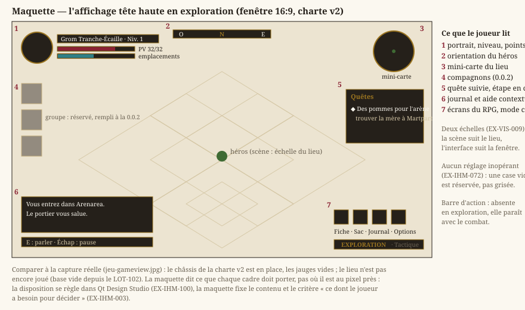
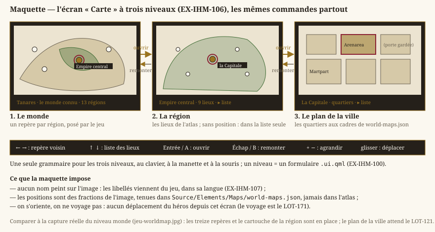

# Interface utilisateur (IHM)

> Statut : **livré**. Écrans du jeu en Qt Quick, éditeur de cartes en Qt Widgets, charte v2 des
> écrans du jeu.
>
> **Révisée au `LOT-EDITOR-01`** (décision D7 de la [feuille de route de l'éditeur](../../Planning/vision/archives/feuille-de-route-editeur.md)). L'éditeur est un **outil interne** : style Fusion de Qt, textes anglais écrits
> dans le code, widgets construits en code, sans charte ni thème. Les exigences qui ne visaient que
> son habillage et l'agencement de ses panneaux sont retirées ; son agencement se décide lot par lot
> dans sa feuille de route. Ce qui reste ici de l'éditeur : un binaire Qt Widgets à part
> (`EX-IHM-041`), une disposition persistée (`EX-IHM-011`), la gestion des cartes sans perte
> (`EX-IHM-021`) et l'unicité des commandes (`EX-IHM-062`).
> Dépend de [`rendu-technique.md`](rendu-technique.md) et [`editeur-niveaux.md`](editeur-niveaux.md).

L'**interface** — écrans du jeu, éditeur de cartes — est distincte de la **scène** : celle-ci est
dessinée sur QRhi (`EX-REN-002`) ; l'interface, elle, repose sur **Qt**, pour une application
maintenable, à fenêtres réglables. `Core` demeure indépendant de la présentation (`EX-NFR-010`).

## 1. Socle applicatif
- **EX-IHM-001** — Toute l'**interface** (écrans du jeu, éditeur) doit reposer
  sur le framework **Qt** ; seule la **scène** se dessine par le pipeline 2D du projet, sur QRhi.
- **EX-IHM-002** — La **scène** doit être **embarquée dans un élément Qt**
  (`EX-REN-050`), sans processus séparé ni duplication du pipeline de rendu ; le déterminisme de la
  simulation (`EX-NFR-002`) et la latence d'entrée (`EX-CTRL-020`) sont préservés.
- **EX-IHM-003** — Le jeu doit afficher, **dans la scène rendue**, un
  **affichage tête haute** minimal indiquant l'état dont le joueur a besoin pour décider, et lui
  seul. L'affichage passe par le catalogue de traduction (`EX-REN-033`) et n'a aucun effet sur le
  gameplay (`EX-ARCH-012`).
  > **Refondue au `LOT-67`.** Elle **énumérait** ce contenu, et la liste ne convenait plus. Ce que
  > doit y lire un joueur de RPG (points de vie, initiative, actions restantes) est le sujet de l'IHM de combat du
  > `LOT-24` ; l'exigence garde donc son critère — *ce dont le joueur a besoin pour décider* — et
  > cesse d'en fixer la liste, que chaque lot ajusterait sinon en la contredisant.

Le critère d'`EX-IHM-003` — *ce dont le joueur a besoin pour décider* — se juge sur pièces, et les
deux maquettes ci-dessous sont ces pièces. Elles ne **réintroduisent pas** la liste que l'exigence a
retirée : elles montrent, pour chacun des deux modes, ce qu'un joueur doit pouvoir lire sans ouvrir
d'écran. Ce qu'elles fixent est le **contenu**, jamais la position au pixel près.

En exploration, la **barre d'action est absente** : elle n'apparaît qu'avec le combat. Et la case du
groupe, que la version `0.0.2` remplira, est **réservée** plutôt que grisée — un réglage inopérant
coûte plus de confiance qu'il n'apporte d'information (`EX-IHM-072`).

En combat s'ajoute exactement ce que le tour rend décidable : l'ordre stable (`EX-CBT-010`), les
quatre ressources consommables une fois (`EX-CBT-011`), la fin de tour explicite (`EX-CBT-012`), et
les aides de grille (`EX-CBT-020`, `EX-CBT-021`). La cible montre ce que le joueur **sait** d'elle —
« ensanglanté », pas un nombre de points de vie que rien ne lui a appris.

- **EX-IHM-004** — Le jeu doit offrir un **écran de pause** suspendant
  réellement la simulation, sans consommer de pas de temps fixe, navigable au clavier, à la souris
  et à la manette comme le reste de l'interface, et passant par le catalogue de traduction
  (`EX-REN-033`). Détaille `EX-REN-031` du côté de l'interface.
  > **Refondue au `LOT-67`.** Elle exigeait aussi un **écran de fin de niveau**, qui n'a plus
  > d'objet : un bac à sable n'a pas de tableau à terminer. L'écran de pause, lui, reste — et
  > s'étoffera des entrées du RPG (fiche, inventaire, journal, carte) avec le châssis du `LOT-68`,
  > pas avant : une entrée de menu qui ne mène nulle part coûte plus de confiance qu'elle
  > n'apporte d'information (`EX-IHM-072`).

## 2. Éditeur
- **EX-IHM-011** — La **disposition** des panneaux de l'éditeur doit être
  **persistée** (sauvegardée et restaurée entre deux sessions), et réinitialisable à une disposition
  par défaut.

## 3. Gestion des cartes
- **EX-IHM-021** — L'éditeur doit permettre de **créer, renommer, dupliquer et
  supprimer** une carte, avec **validation de nom** (`EX-EDIT-006`) et **confirmation** des actions
  destructrices ; aucune modification non enregistrée ne doit être perdue silencieusement.

## 4. Menus, options, unification
- **EX-IHM-040** — Le **menu principal** et l'écran **Options** (plein écran,
  volume, langue `EX-REN-033`) doivent être fournis en Qt Quick, navigables au clavier, à la souris
  et à la manette.
- **EX-IHM-041** — Chaque exécutable doit reposer sur **une seule technologie
  d'UI** — Qt Quick pour le jeu, Qt Widgets pour l'éditeur — et aucun écran ne se dessine à la main
  au `SpriteBatch`.

## 5. Système de design et habillage
La première interface Qt était **fonctionnelle**, sans jamais traiter son apparence pour
elle-même. L'application n'a jamais choisi de style Qt : elle s'exécute donc sur le
style **natif** de la plate-forme, qui dessine la plupart des contrôles hors du contrôle de
l'application et ignore une large part de toute feuille de style posée par-dessus. C'est la raison
pour laquelle le thème existant a dû être **restreint** au menu principal et à la page Options
(portée par `objectName`) au lieu d'être étendu : l'étendre ne produisait pas un résultat homogène.
Il en résulte deux apparences dans la même fenêtre — écrans thématisés d'un côté, panneaux de
l'éditeur au rendu natif de l'autre — et des grandeurs d'habillage (couleurs, marges, tailles de
vignettes, largeurs) éparpillées entre la feuille de style, les fichiers de description d'interface
et des constantes locales à chaque widget.

- **EX-IHM-050** — L'interface hors-jeu doit reposer sur un **style d'interface
  maîtrisé par l'application** (et non sur le style natif de la plate-forme), assorti d'un **thème
  unique externalisé** couvrant **l'ensemble** des widgets — fenêtre, panneaux dockables, barres de
  menus et d'état, onglets, arbres et tables, champs de saisie, barres de défilement, infobulles,
  boîtes de dialogue standard — et non un sous-ensemble d'écrans. Ce thème distingue deux portées :
  une part **invariante**, qui porte l'identité visuelle du jeu (menu principal, Options, jeu), et une
  part **variable**, le châssis d'édition. L'état de **focus** doit rester visible en toute
  circonstance : la navigation à la manette dans les menus repose sur le parcours de focus
  (`EX-IHM-040`), qu'un focus invisible rend inutilisable.
  > **Précisée au `LOT-EDITOR-01`.** L'éditeur n'est plus dans sa portée : outil interne, il prend
  > le style Fusion de Qt tel quel. `EX-IHM-051` à `053` et `EX-IHM-082` ne visent plus, eux aussi,
  > que les écrans du jeu.
- **EX-IHM-051** — Les grandeurs d'habillage (couleurs, espacements, tailles
  d'icônes et de vignettes, largeurs de contrôles) doivent provenir d'une **source unique**, dont
  dérivent à la fois la palette de l'application, la feuille de style et la **couleur d'effacement du
  viewport** — cette dernière étant aujourd'hui définie indépendamment, d'où une couture visible entre
  le canevas Direct3D 11 et les widgets qui l'entourent. Aucune constante de style ne doit subsister
  en dur dans le code des widgets.
- **EX-IHM-052** — La **typographie** doit avoir une source de vérité unique (et
  non partagée entre feuille de style et fichiers de description d'interface), et reposer sur une
  **police embarquée avec l'application**, avec **repli** sur une famille générique si elle est
  absente — l'interface ne doit dépendre d'aucune police installée sur le système hôte.
- **EX-IHM-053** — Les **icônes et vignettes** de l'interface doivent rester
  **nettes à toute échelle d'affichage** (facteur de mise à l'échelle du système). Une **icône des écrans
  du jeu** est une image **produite** comme les ornements (`EX-IHM-075`), depuis une entrée du cahier
  des assets du [LOT-87](../../Planning/versions/v0.0.0/v0.0.0-fondation/annexes/LOT-87-charte-v2/assets-brief.md), à **deux fois sa plus grande taille d'affichage
  à 1080p**, et réduite avec lissage. Une **vignette** d'asset est agrandie selon la nature de l'image
  qu'elle représente (`EX-ARCH-022`) — au plus proche voisin pour une tuile pixellisée, interpolée
  pour une illustration peinte.
  > **Refondue au `LOT-66`.** Elle imposait l'absence de lissage *pour toutes* les vignettes, au
  > motif qu'elles représentent du pixel art. Une vignette de panneau peint ([LOT-76](../../Planning/versions/v0.0.0/v0.0.0-fondation/lots/LOT-76-habillage-interface.md))
  > agrandie au plus proche voisin serait crénelée, et la bibliothèque d'assets montrerait alors
  > une image que le jeu ne rend pas ainsi — la vignette cesserait d'être un aperçu.
  >
  > **Refondue au `LOT-87`.** Elle voulait *toutes* les icônes vectorielles. Les icônes de la
  > charte v2 sont des émaux et des gravures d'or en relief : tracées, elles formeraient une
  > troisième direction graphique, la faute que `EX-IHM-075` écarte déjà pour les ornements. La
  > netteté reste l'objet de l'exigence ; elle est tenue autrement — une icône est la plus petite
  > pièce d'un écran, donc la première qu'un agrandissement au-delà de 1080p abîme, et c'est pourquoi
  > elle seule est produite au double de sa taille d'affichage.

## 6. Architecture de l'information
Depuis le `LOT-EDITOR-01`, l'agencement de l'éditeur (panneaux, barre d'état, barre d'outils) se
décide lot par lot, dans la filière `editeur` du [planning](../../Planning/README.md) ; une seule
règle reste commune.

- **EX-IHM-062** — Un même **état** ou une même **commande** ne doit être exposé
  qu'à **un seul endroit** de l'interface, **raccourci clavier compris** : deux contrôles pilotant la
  même valeur peuvent diverger et obligent l'utilisateur à deviner lequel fait autorité. Un raccourci
  clavier reste un second chemin **légitime** vers une commande, à condition d'être affiché par la
  commande elle-même plutôt que dupliqué en contrôle distinct.

## 7. Identité visuelle des écrans du jeu
Le système de design a donné à l'interface un habillage cohérent, mais **générique** : la portée identité et
le châssis d'édition partagent la même police et la même échelle typographique, si bien que rien, à
l'écran, ne distingue le menu d'un jeu du panneau d'un outil de travail.
Les titres sont fixés à 32 pt et les entrées de menu à 16 pt quelle que soit la taille de la
fenêtre, ce qui donne une interface visiblement petite dès qu'on dépasse la définition d'un
ordinateur portable. Et le focus n'est signalé que par un changement de teinte — suffisant à la
souris, insuffisant à la manette, qui n'a pas de pointeur pour dire où elle en est.

- **EX-IHM-070** — Les écrans du **jeu** doivent porter la **charte v2** du
  [LOT-87](../../Planning/versions/v0.0.0/v0.0.0-fondation/lots/LOT-87-charte-v2.md), qui tient en **deux matières** : des **panneaux sombres** cerclés d'un filet
  d'or (menu principal, options, crédits, carte, HUD) et le **parchemin de Tanares** (fiche de
  personnage, inventaire, équipe, compétences, dialogue, marchand). Le **grenat** et l'**or** en sont
  les accents communs. Les titres se composent en `Cinzel`, le corps et les citations en
  `IM Fell English` — deux polices **embarquées** avec l'application (repli sur une famille générique
  si elle est absente, `EX-IHM-052`).
  Les **teintes sont relevées, jamais choisies à vue** : une couleur inventée ressemble à la source
  sans en venir, et rien ne le dit jamais. Le parchemin, l'encre, l'or et le grenat restent relevés
  sur le **corpus** (`LOT-66`) ; les rôles propres à la v2 — panneaux sombres, texte sur panneau,
  plaques d'action — ont été relevés sur les **maquettes de référence** du lot, rôle par rôle, la
  maquette et la zone mesurée consignées dans la fiche du `LOT-87`.
  Les grandeurs de l'habillage suivent un facteur d'agrandissement **réel**, rapport de la fenêtre à
  la définition de conception de 1920 × 1080. Le viewport de la scène suit sa propre règle, lui
  aussi à facteur réel (`EX-REN-013`).
  Cette identité est **bornée aux écrans du jeu** — le châssis d'édition conserve son apparence
  d'outil de travail, et ni parchemin ni panneau doré ne se
  répand dans ses tables et ses arbres denses.
  > **Précisée au `LOT-101`.** La scène quitte le pixel art à son tour : elle est **peinte en haute
  > définition** (`EX-VIS-008`). La frontière que trace `EX-VIS-009` ne sépare donc plus deux
  > factures mais deux **échelles** — une pièce de scène se mesure au lieu, une image d'interface à
  > la fenêtre — et le facteur **entier** du viewport disparaît avec le pixel art (`EX-REN-013`).
  >
  > **Refondue au `LOT-87`.** Elle décrivait le seul parchemin, en polices pixel (`Pixelify Sans`,
  > `Press Start 2P`), agrandi d'un facteur **entier** : à 1,5×, le trait et le filet d'un
  > encadrement tracé s'arrondissaient tous deux à la même épaisseur et la réserve de parchemin qui
  > les sépare disparaissait. Cette raison tombe avec la v2, dont les cadres sont des **images
  > 9-patch** produites à 1080p (`EX-IHM-075`) : aucun filet d'un pixel n'est plus tracé, et une
  > image s'échantillonne à tout facteur. Les polices pixel sont écartées pour la raison que le
  > `LOT-66` donnait déjà contre le pixel art — une police bitmap et une illustration peinte ne
  > cohabitent pas —, et que les maquettes rendent visible. La v1 et la v2 coexistent le temps de la
  > phase 3 du lot ; les jetons de la v1 y sont marqués obsolètes.
  >
  > **Refondue au `LOT-66`.** Elle imposait une identité **pixel art** — police bitmap, bordures
  > franches, aucun lissage — héritée des premiers lots du moteur. Elle entrait en
  > contradiction frontale avec les références du jeu visé : une police bitmap non lissée et une
  > illustration peinte à 300 ppp ne cohabitent pas. Le [LOT-01](../../Planning/versions/v0.0.0/v0.0.0-fondation/lots/LOT-01-fork-purge.md) avait délibérément
  > conservé l'atelier pixel art ; ce renversement est assumé, pas subi.
- **EX-IHM-071** — L'élément **focalisé** d'un écran du jeu doit être signalé par
  une **marque explicite** (curseur), et non par la seule teinte : la navigation à la manette
  (`EX-IHM-040`) repose entièrement sur le parcours de focus, qu'une simple nuance de couleur rend
  difficile à suivre — et impossible pour un joueur qui distingue mal les couleurs. Une feuille de
  style ne sachant pas ajouter de contenu, cette marque est nécessairement peinte par le contrôle.
- **EX-IHM-072** — Aucun écran ne doit exposer de réglage **inopérant**. Un
  contrôle grisé et non branché coûte plus de confiance qu'il n'apporte d'information : il se retire,
  ou il se branche. Symétriquement, une capacité qui existe déjà (comptage de cadence, bascule de
  rendu) s'expose comme réglage plutôt que de rester derrière une touche non documentée — sans jamais
  en faire un **second** état (`EX-IHM-062`).

- **EX-IHM-075** — L'habillage ornemental des écrans du jeu — cadres, plaques,
  bandeaux, boutons, médaillons — est livré en **images produites** à la définition de conception
  (1920 × 1080), chacune décrite par une entrée du **cahier des assets** du [LOT-87](../../Planning/versions/v0.0.0/v0.0.0-fondation/lots/LOT-87-charte-v2.md) :
  dimensions, marges, états, prompt de génération, et la maquette qui la montre. Jamais découpé des
  maquettes elles-mêmes, qui restent des relevés de cotes. Les trois raisons qui imposaient autrefois
  le tracé deviennent trois **conditions** que chaque pièce doit tenir :
  - **elle s'étire honnêtement.** Une pièce étirable (cadre, plaque, bandeau, jauge) déclare ses
    **marges 9-patch**, et seule sa partie centrale et ses bords s'étirent — jamais ses coins. Une
    pièce qui ne le peut pas (médaillon, sceau, cabochon) a une **taille fixe** multipliée par le
    facteur, et ne se déforme pas : un médaillon ne s'ovalise pas pour tenir dans une case basse ;
  - **ses couleurs sont celles des jetons.** Le prompt de chaque pièce impose la palette relevée
    (`EX-IHM-070`), la réception d'une image la vérifie, et tout ce qui n'est pas image — texte,
    remplissage de jauge, état de focus — prend sa couleur dans `Tokens.qml` (`EX-IHM-051`) ;
  - **elle reste nette au facteur de conception et en deçà.** Produite à 1080p, elle est réduite
    avec lissage sur une fenêtre plus petite ; au-delà de 1080p, elle est agrandie, et c'est la
    limite assumée de la v2.

  Un écran ne **dépend** d'aucune de ces images pour être utilisable : une pièce absente retombe
  sur un aplat des jetons (`EX-NFR-040`), jamais sur un vide.
  > **Refondue au `LOT-87`.** Elle imposait le **tracé par le code**, jamais l'image. Les
  > géométries relevées sur le corpus (`hmi::parchmentFrameStrokes`, `hmi::cabochonShapes`,
  > `hmi::titleBannerShapes`) et leurs portages en `Shape` ont tenu ce contrat pour la v1. La v2
  > montre des filigranes d'or en relief, des plaques à grain et des éclats qu'aucun tracé ne rend
  > de façon crédible : les tracer aurait produit une troisième direction graphique, ni la v1 ni les
  > maquettes. Les trois raisons de la version précédente, ci-dessous, n'ont pas été jugées fausses —
  > elles sont gardées comme conditions. Le tracé v1 disparaît au T5.2 du lot, avec les écrans qui
  > l'emploient.
  >
  > *Texte de la version précédente* — l'habillage ornemental des écrans du jeu — encadrements,
  > cabochons, bandeaux de titre — doit être **tracé par le code**, jamais livré en image. C'est le
  > prolongement d'`EX-IHM-070`, et la raison n'est pas la place que prendraient ces fichiers.
  > (1) **Une image ne s'étire pas honnêtement.** Un cabochon posé sur un panneau bas s'ovalise ou
  > mange le tiers de sa hauteur ; un bandeau étiré déforme ses ailes. Un ornement tracé se
  > *redessine* à la taille demandée, et ses ailes peuvent suivre la **hauteur** quand sa plaque
  > suit la **largeur** — ce qu'aucun découpage en tranches ne sait faire. (2) **Une image fige ses
  > couleurs hors des jetons** (`EX-IHM-051`) et devrait être réexportée à chaque retouche de
  > palette. Une forme tracée porte un **rôle**, jamais une teinte. (3) **Une image ne suit pas le
  > facteur d'agrandissement** (`EX-IHM-081`) : elle est nette à un seul facteur, un tracé l'est à
  > tous.
  >
  > Ce que le corpus apporte n'est donc pas de la matière mais de la **mesure** : les proportions et
  > les teintes de ces ornements sont **relevées** sur `Documentation/SourceBook/`, jamais choisies
  > à vue — même règle qu'`EX-IHM-070` pour la palette, et même raison.
  >
  > **Ajoutée au `LOT-76`.** `EX-IHM-070` imposait déjà de relever les couleurs sur le corpus, mais
  > rien n'était écrit des **formes** : le `LOT-66` avait donc pu conclure, à juste titre pour son
  > périmètre mais sans que rien ne le garantisse au-delà, qu'aucun fichier d'image ne serait livré.
  > Cette exigence tranche l'autre moitié de la question, et écarte explicitement la voie du
  > découpage d'images — essayée, puis abandonnée au `LOT-76`.

- **EX-IHM-076** — Une **illustration** d'interface — fond d'écran, carte,
  portrait — est **produite**, jamais extraite : elle vient d'une entrée du cahier des assets du
  [LOT-87](../../Planning/versions/v0.0.0/v0.0.0-fondation/lots/LOT-87-charte-v2.md), comme les ornements (`EX-IHM-075`). Le plan de la ville, la carte du monde
  et les planches du corpus sont des **œuvres** : le jeu ne les affiche pas, et ses écrans ne les
  recopient pas — une carte est **produite ou peinte pour le jeu**, jamais reprise du livre. Ce qui est
  interdit, c'est l'image **extraite du corpus** et l'image **sans provenance** — venue d'ailleurs,
  retouchée à la main, ou produite hors du cahier.
  Les **cartes** de l'écran « Carte » (`EX-IHM-106`) sont **peintes par l'auteur**, hors du cahier :
  elles ont leur dossier (`Source/Elements/Assets/Maps/`), leur manifeste — provenance `author`,
  fichier d'origine, date, dimensions, empreinte — et leur contrôle (`check_map_assets.py`), qui
  refuse de même toute autre provenance.
  Trois obligations en découlent :
  - une illustration **produite** déclare l'entrée du cahier, le prompt tel qu'envoyé et la date ;
    toute autre provenance, `tanares` en tête, est **refusée** par l'intégration continue
    (`check_ui_assets.py`, depuis le `LOT-94`) ;
  - ce qui est livré est décrit par un **manifeste** — dimensions, empreinte, provenance — que
    l'intégration continue recoupe avec les fichiers **et avec le code qui les nomme** ;
  - une illustration **absente** est un cas attendu (`EX-NFR-040`) : l'écran retombe sur un aplat
    des jetons. Aucun écran ne doit dépendre d'un binaire pour s'afficher.
  Un **filigrane** ou un folio présent sur la page source se **recadre**, jamais ne s'efface :
  l'effacer demanderait de repeindre ce qu'il recouvre, c'est-à-dire d'inventer des pixels.
  > **Refondue au `LOT-87`.** Elle n'admettait que l'extraction du corpus, et opposait l'illustration
  > à l'ornement tracé. L'ornement étant désormais produit (`EX-IHM-075`), la frontière ne passe plus
  > entre « tracé » et « image » mais entre **image avec provenance** et **image sans**. La
  > provenance `produced` du manifeste et son contrôle sont le T2.5 du lot.

## 8. Taille, réactivité et réglages effectifs

Les sections précédentes ont donné à l'interface son châssis, son habillage et sa répartition de
l'information. Aucune n'a jamais dit **qui décide de la taille de la fenêtre**. La réponse, de fait,
était : le plus dense des écrans. `QStackedWidget::minimumSizeHint` valant le maximum sur *toutes*
ses pages — y compris celles qu'on ne regarde pas — un seul écran chargé fixait le plancher de la
fenêtre entière ; et ce plancher était multiplié par le facteur d'agrandissement d'`EX-IHM-070`,
lui-même dérivé de la hauteur de la fenêtre. La boucle se refermait sur elle-même, sans que rien ne
la borne : la fenêtre grandissait, le facteur montait, le plancher montait, la fenêtre grandissait.
Windows finissait par refuser la géométrie, et l'interface débordait sous la barre des tâches en
rognant son contenu, sans rien dire. Le défaut s'est produit trois fois, et a été corrigé deux fois
écran par écran.

Symétriquement, une préoccupation vivait à une portée plus large que la sienne. Le facteur
d'agrandissement, qui ne concerne que les écrans du jeu, était substitué dans la feuille de style de
l'**application** : en changer repolissait ses 862 widgets, cinq secondes durant en configuration
Debug. Et un écran exposait des réglages que rien ne transmettait au moteur.

- **EX-IHM-080** — Aucun écran ne doit **contraindre la taille de la fenêtre** :
  il s'y adapte, au besoin en **défilant**, et ne rogne jamais son contenu sans recours. Cette
  garantie doit être portée par le **chemin d'ajout commun** des écrans, et non par une convention à
  réappliquer dans chaque fichier de description d'interface : une règle qu'il faut se rappeler
  d'appliquer se reperd au premier écran ajouté — c'est déjà arrivé deux fois.
- **EX-IHM-081** — Les **facteurs d'agrandissement** (`EX-IHM-070`) — l'entier
  du viewport comme le réel de la charte v2 — doivent être bornés par la **zone d'affichage
  disponible**, et non par la seule hauteur de la fenêtre ; la géométrie **restaurée** d'une session
  précédente doit être ramenée dans cette même zone, position et taille. Un facteur dérivé d'une
  hauteur que lui-même fait croître n'a pas de point fixe : la borne doit venir d'une grandeur dont
  l'application ne décide pas.
  > **Précisée au `LOT-87`**, qui ajoute le facteur réel : dérivé de la fenêtre, lui-même bornée par
  > l'écran, et d'aucun contenu (`EX-IHM-080`), il n'ouvre pas de nouvelle boucle.
- **EX-IHM-082** — Une préoccupation limitée à une **portée** ne doit jamais
  provoquer un rejeu de style d'une portée **plus large** : un habillage s'applique là où il porte,
  et nulle part ailleurs. (Le châssis d'édition, seconde portée d'`EX-IHM-050`, n'a plus de feuille
  depuis le `LOT-EDITOR-01`.) Le coût d'un changement
  d'habillage doit rester proportionnel à ce qui change réellement.
- **EX-IHM-083** — Tout **réglage exposé** par un écran doit **atteindre** le
  moteur, ou ne pas être exposé ; et l'écran doit **ouvrir sur les valeurs par défaut du moteur**,
  jamais sur une seconde liste de valeurs inscrite dans sa description. Un réglage inerte est pire
  qu'un réglage absent : il se règle, il s'enregistre, et il ment.

## 9. Le châssis des écrans du RPG (LOT-68)

Huit écrans manquent au jeu — fiche de personnage, inventaire et équipement, journal de quêtes,
carte du monde, dialogue, marchand, tableau de la Guilde, affichage tête haute de combat — et
quatre lots à venir les remplissent chacun de leur côté (`LOT-38`, `LOT-42`, `LOT-45`,
`LOT-24`). Sans règle commune, ces quatre lots produiraient quatre écrans qui s'ouvrent
différemment, se ferment différemment et se naviguent différemment : le défaut ne se voit sur aucun
d'eux pris isolément, et sur les quatre ensemble il n'est plus rattrapable sans les refaire.

La maquette fixe ce que le châssis **garantit** — un titre, un contenu, un pied d'actions, le même
va-et-vient entre écrans, une règle de superposition déclarée — et non la position au pixel près,
qui se règle dans Qt Design Studio.

- **EX-IHM-090** — Les écrans du **RPG** doivent partager un **châssis** unique :
  le même cadre (panneau, titre, zone de contenu, pied d'actions), la même ouverture et la même
  fermeture, le même passage d'un écran à l'autre **sans repasser par le menu**, et le même parcours
  de focus à la manette (`EX-IHM-071`). L'**ossature** de chaque écran — ses blocs, leurs genres,
  leurs libellés — doit être portée par une **description en données**, non par du code d'interface
  écrit écran par écran : ajouter un écran ne doit demander de toucher à **aucun** des autres, ni
  dans le code, ni dans la feuille de style. Une convention à réappliquer à chaque écran se reperd
  au premier ajout — c'est la leçon qu'`EX-IHM-080` a déjà tirée pour la taille des écrans.
  Corollaire : les libellés de cette description passent par le catalogue de traduction
  (`EX-REN-033`) comme tout autre texte, et rien ne les y rattachant qu'une table, leur présence
  dans **les deux** catalogues doit être vérifiée automatiquement.
- **EX-IHM-091** — Chaque écran du RPG doit déclarer sa **règle de
  superposition** : suspend-il la simulation, ou se consulte-t-il en marchant ? Cette règle
  appartient à la **description** de l'écran, jamais au code qui l'ouvre : ouvert depuis la pause,
  depuis le jeu ou depuis une touche, un même écran doit se comporter de la même façon, et une règle
  décidée au point d'appel se contredit d'un appel à l'autre sans que rien ne le signale.

### Le journal de quêtes {#ihm-journal}

Premier écran du châssis à être **alimenté** par la partie (`LOT-116`), le journal montre ce que
le châssis promet quand une donnée réelle le remplit.

Ce que la maquette engage : l'écran se tire des **seuls drapeaux** (`EX-EXP-010`, `EX-EXP-012`),
il n'a pas d'état à lui, et il se relit à chaque avancement — une quête qui progresse pendant
qu'on lit le journal s'y voit sans le fermer.

## 10. La conception séparée du code (LOT-86) {#ihm-conception}

> Statut : **en cours** (`LOT-86`). Cette section remplace, pour les écrans du **jeu**, ce que la
> section 9 confiait à une description en données. Le
> châssis d'édition (sections 5, 6 et 8) n'est pas concerné : il reste en Qt Widgets, dans son
> propre binaire.

### Ce qui a changé, et pourquoi

Les écrans du jeu étaient en Qt Widgets, décrits par une table C++ (`EX-IHM-090`). Une tentative
de les porter sur des fichiers Qt Designer a été menée puis **abandonnée** : elle demandait
1 268 lignes d'outillage — plugin de widgets promus, résolveur de feuille de style, générateur de
`.ui` — dont l'unique fonction était de rendre ces fichiers visualisables dans le designer. Les
deux formes partageaient le même défaut : **la mise en page vivait du côté du code**. Une retouche d'apparence demandait un développeur, une compilation, et
une relecture — pour déplacer un bloc de huit pixels.

Le prix s'est vu deux fois. Le défaut du plancher de taille des écrans s'est produit **trois fois**
avant qu'`EX-IHM-080` ne le déplace sur un chemin commun. Et la palette d'identité a été écrite
**deux fois** — en CSS dans les maquettes, en C++ dans les jetons — tenue par un contrôle dont le
commentaire disait qu'auparavant *« rien ne les reliait »*.

Les écrans du jeu passent donc à **Qt Quick**, et leur mise en page à des fichiers que Qt Design
Studio ouvre, modifie et réenregistre. Ce n'est pas un changement de bibliothèque : c'est un
déplacement de la frontière entre deux métiers.

### La frontière, telle qu'elle est tenue

- **EX-IHM-100** — Une modification **purement visuelle** d'un écran du jeu —
  mise en page, couleurs, typographie, ornements, animations, textes — doit être réalisable **sans
  modifier ni recompiler une ligne de C++**, depuis Qt Design Studio ouvrant
  `Source/Ui/JadgUi.qmlproject`. Ce projet ne décrit que `Source/Ui`, les jumeaux de câblage et
  les assets : ni CMake, ni `Source/HMI`, ni code. La frontière n'est pas une consigne de
  relecture, c'est le périmètre d'un fichier. Depuis le `LOT-87`, `Source/Ui` est un module QML
  **sans C++** (`Jadg.Ui`) : c'est ce qui le rend résolvable par l'atelier, dont le marionnettiste
  ne charge aucun plugin du projet ; les types C++ forment un module à part (`Jadg.Runtime`) que
  seuls les jumeaux importent, et que l'atelier remplace par des doublures QML (`Source/Ui/Mocks`).
- **EX-IHM-101** — La couche de **présentation** (`Source/HMI/Presentation`,
  et les vues-modèles de `Source/HMI/Runtime` exposées au QML) transforme l'état du jeu en données
  affichables et **ne dessine rien** : elle ne connaît ni Qt Quick, ni Qt Widgets. Seule exception,
  nommée : la surface de rendu (`GameViewportItem`), qui est un item de scène et non un modèle. Un écran lui demande *ce que le jeu sait dire*, jamais *comment le
  montrer*. Un seul en-tête d'IHM qui y entrerait signalerait que la logique de vue a commencé à
  redescendre dans la couche de données — et c'est ainsi que les 2 472 lignes de `MainWindow.cpp`
  se sont accumulées.
- **EX-IHM-102** — L'exécutable du **jeu** ne lie pas `Qt6::Widgets`. Ce n'est
  pas une convention mais une impossibilité : un widget qui y réapparaîtrait ferait échouer
  l'édition de liens. Les widgets n'appartiennent qu'à l'éditeur de cartes, binaire séparé.
- **EX-IHM-103** — Tout écran et tout contrôle du jeu est un **formulaire
  `.ui.qml`** — le sous-ensemble **déclaratif** de QML — et ne contient aucun code impératif.
  Qt Design Studio relit et **réenregistre** ces fichiers : ce qu'il n'y comprend pas, il le perd,
  sans avertir. La logique vit dans un fichier jumeau `.qml`, côté développeur. La règle ne vise
  donc pas le style, mais ce que l'outil détruirait.
- **EX-IHM-104** — Un formulaire n'importe que des modules connus **à la fois**
  de l'installation Qt et de Qt Design Studio. Le designer livre les siens (`QtQuick.Studio.*`),
  absents d'une installation ordinaire : un formulaire qui en importerait s'ouvrirait parfaitement
  chez la conception et casserait le jeu — le pire des deux mondes, découvert le plus tard
  possible.
- **EX-IHM-105** — Aucune couleur, famille de police ni taille de texte n'est
  écrite en dur hors de `Source/Ui/Theme`. C'est ce qui donne son sens aux jetons : une valeur
  écrite dans un écran survit à un changement de palette, ne suit plus rien, et personne ne
  remarque qu'un seul écran a cessé de ressembler aux autres (`EX-IHM-051`).

### Les ornements restent tracés, et `EX-IHM-075` avec eux

> Section du `LOT-86`, conservée telle quelle : elle décrit la v1. Au `LOT-87`, `EX-IHM-075` est
> refondue — les ornements de la charte v2 sont des images produites, sous trois conditions.

Le passage à Qt Quick a d'abord semblé condamner `EX-IHM-075` — *« l'habillage ornemental se trace,
il ne se livre pas en image »* —, puisqu'une règle qui place le dessin dans du code place aussi
l'apparence hors de portée de la conception.

**C'est faux, et l'erreur méritait d'être corrigée plutôt que suivie.** Les trois raisons que cette
exigence invoque tiennent toujours : une image ne s'étire pas honnêtement (un cabochon posé sur un
panneau bas s'ovalise), elle fige ses couleurs hors des jetons (`EX-IHM-051`), et elle ne suit pas
le facteur d'agrandissement entier (`EX-IHM-081`) — nette à un seul facteur, floue aux deux autres.

Or **Qt Quick Shapes** honore les trois : une forme s'y redessine à la taille demandée, prend ses
couleurs de `Tokens.qml`, et reste nette à tous les facteurs. Et une `Shape` déclarative s'édite
dans Qt Design Studio comme le reste.

Ce qui change n'est donc pas « tracé par du code » mais « tracé par du **C++** ». La géométrie pure
relevée sur le corpus (`hmi::parchmentFrameStrokes`, `hmi::cabochonShapes`, `hmi::titleBannerShapes`)
reste la **source** de ce portage, et n'est pas jetée en attendant : la redessiner plus tard, sans
se souvenir de ce qui avait été relevé, coûterait bien plus que de la conserver.

### Ce qui rend ces exigences autre chose que des intentions

`scripts/checks/check_ui_layers.py` les vérifie toutes à chaque *Pull Request*, et vérifie en outre
qu'`EX-ARCH-001` et `EX-NFR-010` restent vraies — `Core` sans un seul en-tête Qt. Il ne **crée** pas
cette dernière règle, il la **verrouille** : elle est tenue depuis le `LOT-01`, et un seul `QString`
suffirait à la rendre fausse sans que rien d'autre ne le signale.

Le contrôle s'auto-vérifie contre la vacuité : un relevé vide est un **échec**, jamais un succès.
C'est la panne du `LOT-78`, où un contrôle vert ne lisait rien.

### Ce que la conception ne peut pas faire seule

Aucune chaîne ne met la totalité d'une interface entre les mains d'un artiste, et le prétendre
serait un mensonge utile à personne. Exposer une **donnée** que le jeu ne calculait pas, ajouter une
**interaction** qui change l'état du jeu, écrire une **règle de navigation** ou faire exister un
**écran** demandent un développeur : ce sont des notions de jeu, pas d'apparence. La conception
dispose librement de tout ce que le jeu sait déjà dire. C'est la même frontière que dans les moteurs
du commerce, et c'est la bonne.

## 11. L'écran « Carte » : le monde, une région, une ville (LOT-94) {#ihm-carte}

Le `LOT-94` avait retiré la carte du monde avec les deux images du corpus qui la portaient. Elle
revient sur des cartes **peintes par l'auteur** — le monde, les treize régions de l'atlas, les plans
de la Capitale impériale et de Fisherman's Wharf —, en 1 920 × 1 080 et **sans lettrage**.

- **EX-IHM-106** — L'écran « Carte » a **trois niveaux** — le monde, une région,
  le plan d'une ville — et l'on passe de l'un à l'autre par un **repère** : une région sur le monde,
  une ville à plan sur sa région. On ne s'y **déplace** pas et l'on n'y voyage pas : la carte sert à
  s'orienter, le déplacement se fait sur les cartes de niveau. Les **mêmes commandes** valent aux
  trois niveaux, au clavier, à la manette et à la souris : choisir le repère voisin, parcourir la
  liste des lieux, ouvrir, remonter, agrandir, déplacer la carte. Chaque niveau est un formulaire
  (`EX-IHM-100`) et a sa capture de référence.
- **EX-IHM-107** — Une carte ne porte **aucun nom peint** : tout nom est posé
  par le jeu, dans sa police et dans sa langue. Les positions — repère et cadre d'une région, lieux
  de l'atlas, quartiers, noms de géographie — sont des **fractions** de l'image, relevées sur la
  carte et tenues dans un fichier **à part de l'atlas** (`Source/Elements/Maps/world-maps.json`) :
  l'atlas est extrait du livre, qui ne donne aucune coordonnée, et sa chaîne d'extraction effacerait
  un champ qu'elle n'a pas produit. Un lieu que le livre ne situe pas, ou qui sort du cadre peint,
  reste dans la **liste** de sa région, sans repère : le jeu n'**invente** pas une position. Une
  entrée de l'atlas qui n'est pas un lieu (une règle, un objet, un personnage) est **écartée**
  nommément. L'intégration continue recoupe le fichier avec l'atlas et avec le manifeste des cartes :
  une région sans carte, une position qui désigne un lieu inconnu, une ville à plan sans repère sur
  sa région sont des échecs, pas des silences.

## Exigences retirées {#ihm-retirees}

> Ancres conservées, jamais renumérotées : les lots livrés s'y réfèrent.

- **EX-IHM-005** *(retirée en `LOT-67`)* — reprendre, commencer ou choisir un
  niveau : il n'y a plus de séquence de niveaux ; « Reprendre » reviendra avec la sauvegarde du
  `LOT-17`.
- **EX-IHM-030** *(retirée au `LOT-88`)* — tracé des liaisons de mécanismes.
- **EX-IHM-031** *(retirée au `LOT-88`)* — panneau « Liens ».
- **EX-IHM-073** *(retirée au `LOT-88`)* — espaces de travail exclusifs : l'éditeur
  n'a plus qu'une activité.
- **EX-IHM-010** *(retirée au `LOT-EDITOR-01`)* — fenêtre de l'éditeur à panneaux
  dockables ; son agencement se décide dans la feuille de route de l'éditeur.
- **EX-IHM-020** *(retirée au `LOT-EDITOR-01`)* — panneau de gestion des cartes
  avec recherche ; la gestion elle-même reste (`EX-IHM-021`).
- **EX-IHM-054** *(retirée au `LOT-EDITOR-01`)* — thème clair et sombre de
  l'éditeur : Fusion suit le réglage du système.
- **EX-IHM-055** *(retirée au `LOT-EDITOR-01`)* — commandes de l'éditeur à icônes
  tracées, depuis un catalogue d'actions.
- **EX-IHM-060** *(retirée au `LOT-EDITOR-01`)* — barre d'état permanente de
  l'éditeur (elle reste, sans être exigée).
- **EX-IHM-061** *(retirée au `LOT-EDITOR-01`)* — panneaux groupés et mis en
  avant selon l'outil actif.
- **EX-IHM-074** *(retirée au `LOT-EDITOR-01`)* — hiérarchie des surfaces de
  commande de l'éditeur.

## Traçabilité
Tout ceci relève de `Source/HMI` — les types que voient les écrans du jeu (`Runtime/`) — de
`Source/Editor` pour l'éditeur (`LevelEditor`, Qt Widgets, `LOT-EDITOR-01`), et de `Source/Ui`,
`Source/App` pour les formulaires et le câblage QML du jeu ; les assets Qt déclaratifs vivent dans `Source/Elements`. La logique testable (édition,
validation, présentation) reste découplée de l'UI et couverte par des tests (`EX-NFR-010`,
`EX-NFR-020`). Séquencement : `LOT-66` et `LOT-87` pour la charte (section 7) ; `LOT-68` (section
9) pour le châssis des écrans du RPG ; `LOT-86` (section 10) pour la séparation de la conception et
du code — les écrans du **jeu** passent à Qt Quick dans un binaire propre, l'**éditeur** reste en
Qt Widgets dans le sien ; `LOT-94` pour `EX-IHM-076` — une illustration est produite, jamais
extraite — et (section 11) pour l'écran « Carte » à trois niveaux, sur les cartes peintes par
l'auteur.
