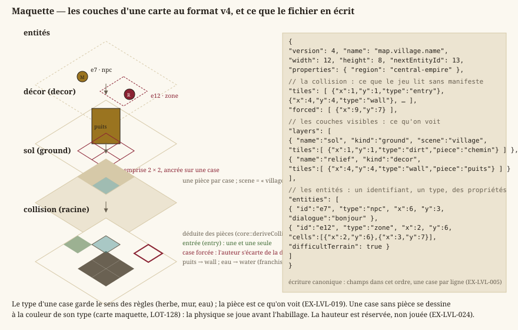

# Cartes & format

> Statut : **livré**. Format JSON versionné (version 4 depuis le `LOT-EDITOR-12`), chargement,
> validation, couches à pièces nommées, collision déduite et cases forcées, entités à identifiant,
> zones peintes, variantes ; le Colisée et deux quartiers de la Capitale sont livrés dans ce format.
> Dépend de [`gameplay.md`](gameplay.md). Schéma publié :
> `Documentation/Specification/level.schema.json`.

## 1. Représentation des cartes

Une carte est faite de **couches empilées** et d'une **collision** qui, elle, n'est pas une couche
comme les autres : elle se déduit des pièces posées, et l'auteur ne la corrige qu'au cas par cas.
La maquette montre cet empilement et, en regard, ce que le fichier en écrit.



Deux idées de ce dessin commandent tout le reste du document : le **type** d'une case porte le sens
des règles — herbe, mur, eau —, tandis que la **pièce** ne porte que ce qu'on voit ; et la collision
se **déduit**, si bien qu'une carte reste jouable avant d'être habillée.

- **EX-LVL-001** — Une carte doit être décrite par un **fichier de données**
  externe (pas en dur dans le code), placé dans `Source/Elements/Levels`.
- **EX-LVL-002** — Le format doit décrire au minimum : dimensions de la grille,
  type de chaque tuile, position d'entrée, couches visibles et entités.
- **EX-LVL-003** — Le format retenu est un **JSON structuré orienté objets** : une
  carte est un objet JSON portant ses **métadonnées** (nom, dimensions) et une **liste de tuiles**,
  chaque tuile étant un **objet** `{x, y, type, …}` (les cases vides sont omises) pouvant porter des
  **champs propres** (la pièce nommée par une case de couche, `"piece"`, `EX-LVL-019`). Choisi pour un
  format
  **extensible** (données riches par tuile, *round-trip* d'éditeur direct), au prix d'une lisibilité
  « à l'œil » moindre qu'une grille ASCII — l'édition passe par l'**éditeur**, pas par le texte brut.
- **EX-LVL-005** — Le fichier de carte doit porter un **numéro de version de
  format**, afin qu'une évolution non rétrocompatible soit **détectée** plutôt que subie. Un fichier
  **sans** numéro de version est lu comme la version initiale, sans erreur ni avertissement ; une
  version supérieure à celle gérée est refusée avec un message explicite. **Toute version passée se
  lit pour toujours** (une fixture par version reste dans les tests) ; la conversion est un acte
  explicite (`LevelEditor --migrate`, `EX-EDIT-062`), jamais l'effet de bord d'un enregistrement ;
  l'écriture est **canonique** : charger puis enregistrer une carte intacte rend le même fichier,
  octet pour octet.
- **EX-LVL-004** — Le chargement d'une carte doit **valider** les données
  (positions des tuiles et des entités **dans les bornes** `width × height`, une seule tuile par case,
  **une et une seule entrée**, types de tuile connus) et signaler une erreur exploitable en cas de
  fichier invalide (cf. politique d'erreurs des conventions).
- **EX-LVL-016** — Une carte doit porter **N couches de tuiles typées** plutôt
  qu'une grille unique : un RPG en vue de dessus superpose un **sol** (herbe, dalle, eau), un
  **décor** (arbre, tonneau, tapis) et une **collision** — masque indépendant du visuel, un tapis se
  traverse et un tonneau non. La grille de **collision** d'une carte est son tableau racine `tiles`,
  celui qui porte déjà l'entrée — **déduite** des couches visibles depuis la v4 (`EX-LVL-020`) : le
  tableau `layers` ne décrit que les couches **visibles**, et une
  couche de rôle `collision` qui y serait déclarée est **refusée** — deux grilles à tenir d'accord se
  désynchronisent, et c'est celle qu'on ne voit pas qui gagne. Au chargement, la grille racine est
  **promue** en couche de tête, pour que tout consommateur boucle sur les couches sans cas
  particulier. Un fichier **sans** tableau `layers` se charge, sa grille promue en couche unique dite
  *legacy*, à la fois décor et collision. Concrétisé en `LOT-04`.
- **EX-LVL-017** — Une carte doit porter une **liste d'entités** — PNJ, coffres,
  panneaux, portails, rencontres — distincte de ses grilles : une entité est un **objet** à type
  libre, placé sur une case et porteur de ses propres données, là où une grille ne retient qu'un
  type par case. Le type n'est **pas** interprété au chargement — c'est le gameplay qui lui donne un
  sens — mais la position est validée comme celle d'une tuile (`EX-LVL-004`). Concrétisé en
  `LOT-04`.
- **EX-LVL-018** — Une couche et une entité doivent pouvoir porter un
  **dictionnaire de propriétés libres**, et tout champ **inconnu** du chargeur doit y être rangé :
  ignoré sans erreur à la lecture, et **réémis** à l'écriture. Sans quoi le moindre besoin découvert
  plus tard — terrain difficile, couverture, hauteur, dialogue d'un PNJ — imposerait une nouvelle
  version de format et la migration de tout le contenu déjà produit. Concrétisé en `LOT-04`.

### Format v4 (`LOT-EDITOR-12`)

La seule révision de format du module éditeur, faite tant qu'il n'y avait que trois cartes.

- **EX-LVL-019** — Chaque case d'une couche visible porte son **type** et une
  **pièce** facultative de la planche du lieu (`"piece"`). Le type ne garde qu'un sens, celui des
  règles et du générateur ; la pièce est ce qu'on voit, et la table d'apparence du lieu n'en est que
  le **défaut** (cartes générées, case sans pièce). Une pièce **large** est ancrée sur une case et
  occupe son emprise vers les colonnes et lignes croissantes ; elle se trie au pied de son emprise
  (`core::footprintCells`, une seule règle, lue par la composition du jeu et par la déduction de
  collision). Une pièce se cite par son nom courant ou par un ancien nom (`aliases` du manifeste) ;
  une pièce introuvable reste dans le fichier.
- **EX-LVL-020** — La grille de collision est **écrite** dans le fichier — le
  jeu la lit sans manifeste — et **égale à sa déduction** (`core::deriveCollision`) hors des cases
  que l'auteur a **forcées** (`"forced"`). La déduction prend, case par case, la contribution la plus
  forte du **type tactique** de chaque pièce qui la couvre (`tactical` au manifeste : `open`,
  `difficult`, `cover`, `obstacle`, `solid`), de la règle du type d'une case sans pièce, et fait
  d'une case que rien ne couvre un mur. Gêne et abri ne sont pas encore joués depuis une pièce :
  déduits franchissables, signalés par le contrôle.
- **EX-LVL-021** — Chaque entité porte un **identifiant** court (`"id"`), unique
  dans la carte, donné par l'éditeur et **jamais réemployé** (compteur `"nextEntityId"`) : quêtes,
  drapeaux et sauvegardes citent une entité par `carte#id`, pas par sa case. Deux entités du même
  identifiant sont refusées au chargement.
- **EX-LVL-022** — Une zone (`"type": "zone"`) est un **rectangle** (`width` ×
  `height` depuis sa case) **ou** un ensemble de cases **peint** (`"cells"`) ; ses propriétés
  s'appliquent à chaque case couverte, et `core::BattleGrid::zonesAt` lit les deux formes.
- **EX-LVL-023** — Une carte peut être la **variante** d'une autre (`"base"`) :
  elle ne porte aucune case, reprend celles de sa base, change de planche (`"scene"`) et porte ses
  propres entités. Sa base se cherche du dossier de la variante vers la racine ; une base elle-même
  variante est refusée.
- **EX-LVL-024** — La **hauteur par case** est réservée : `"elevation"` par case de couche et par
  entité, lue, gardée et réécrite ; ni le jeu ni l'éditeur ne s'en servent, et le contrôle signale
  toute valeur non nulle. `"floor"` par couche, réservé jusqu'au `LOT-129`, est joué par
  `EX-LVL-025`.
- **EX-LVL-025** — Une couche de **décor** à l'étage `"floor"` n (1 à 4) est un **étage** : ses
  pièces se dessinent élevées de n hauteurs d'étage, que déclare le manifeste de leur lieu
  (`"storey"`, en pixels d'art), triées au-dessus du rez de leur case ; un étage qui masque le héros
  se dessine translucide. Un étage ne compte pas dans la collision, qui ne dit que le rez. Un étage
  sur une couche de sol, ou hors de 0 à 4, est gardé mais ignoré, et le contrôle le signale
  (`LOT-129`).

### Format retenu (JSON, liste de tuiles-objets)

Types de tuiles : `entry` (entrée, point d'arrivée par défaut), `solid` (matière pleine), et le
terrain du RPG (`EX-EXP-005`) — `grass`, `dirt`, `sand`, `water`, `deepWater` (sols ; l'eau profonde
bloque), `wall`, `cliff` (obstacles), `bridge`, `stairs` (passages). Le vocabulaire de la
maquette les étoffe, pour qu'une carte sans texture se dessine avec précision :

| Famille | Types | Pas |
|---|---|---|
| Sols | `pavement`, `alley`, `planks`, `flagstone`, `snow` | traversables |
| Terrain difficile | `mud`, `rubble`, `bush` | traversables (la gêne n'est pas encore jouée ; `--check` avertit) |
| Abri | `lowWall` | traversable (l'abri n'est pas encore joué ; `--check` avertit) |
| Passage | `door` | traversable |
| Arrêtent le pas, pas la vue | `rock`, `fence`, `stall`, `crate`, `pit`, `lava` | déduits en `cliff` |
| Arrêtent le pas et la vue | `tree`, `column`, `roof`, `tiers` | déduits en `wall` |

Une case **vide** n'est pas listée (absence = vide).

Une case de couche peut nommer sa **pièce** (`"piece"`, `EX-LVL-019`), la pièce de la planche du
lieu (`EX-VIS-008`) dessinée sur cette case. Une carte v3 portait cette pièce sur la grille racine
(`"texture"`) : le chargeur la range sur la couche de décor, et une v4 qui en porte encore une est
refusée. Écriture canonique : champs dans cet ordre, une case par ligne.

```json
{
  "version": 4,
  "name": "Village",
  "width": 12,
  "height": 8,
  "nextEntityId": 3,
  "tiles": [
    {"x": 1, "y": 1, "type": "entry"},
    {"x": 4, "y": 4, "type": "wall"}
  ],
  "forced": [
    {"x": 9, "y": 7}
  ],
  "layers": [
    {
      "name": "sol",
      "kind": "ground",
      "scene": "village",
      "tiles": [
        {"x": 1, "y": 1, "type": "dirt", "piece": "chemin"}
      ]
    },
    {
      "name": "relief",
      "kind": "decor",
      "tiles": [
        {"x": 4, "y": 4, "type": "wall", "piece": "puits"}
      ]
    }
  ],
  "entities": [
    {
      "id": "e1",
      "type": "npc",
      "x": 6,
      "y": 3,
      "dialogue": "bonjour"
    },
    {
      "id": "e2",
      "type": "zone",
      "x": 2,
      "y": 6,
      "cells": [
        {"x": 2, "y": 6},
        {"x": 3, "y": 7}
      ],
      "difficultTerrain": true
    }
  ]
}
```
Une **variante** ne porte que `version`, `name`, `base`, `scene`, `nextEntityId` et `entities`
(`EX-LVL-023`).
Rôles de couche reconnus : `ground`, `decor`, et `legacy` (rôle de la grille racine promue, jamais
écrit) ; un rôle inconnu retombe sur `ground` plutôt que de faire échouer la carte (`EX-NFR-040`),
et `collision` déclaré est refusé (`EX-LVL-016`). La propriété de couche `scene` nomme le **lieu**
dont la carte porte les planches (`Assets/Scene/<lieu>/`).

**Familles d'entités posées par l'éditeur** (`LOT-11`, `EX-EDIT-050`). Le chargeur ne connaît aucun
type d'entité (`EX-NFR-040`) ; l'éditeur, lui, sait poser et renseigner ceux que le gameplay lit,
rassemblés dans `core::knownEntityKinds` (`Source/Core/World/EntityKinds.h`) :

| `type` | Propriétés | Lue par |
|---|---|---|
| `chest` | — | `core::knownInteractableKinds` (`LOT-10`) |
| `sign` | — | `core::knownInteractableKinds` (`LOT-10`) |
| `npc` | `dialogue`, `figure` (figurine de l'atelier), `guards` (fiche de lieu du quartier gardé) | `core::dialogueTriggerFor` (`LOT-15`), rendu du lieu |
| `encounter` | `encounterId` (requis), `respawns` (booléen) | `core::encounterTriggerFor` (`LOT-18`) |
| `portal` | `targetMap`, `arrival` — requis ; `requiresFlag` | graphe du monde (`LOT-09`) |
| `spawnPoint` | `name` (requis, unique dans la carte) | graphe du monde (`LOT-09`) |
| `combatZone` | `name`, `width`, `height` — requis | découpe de la grille de combat (`LOT-09`) |
| `cityBlock` | `name`, `width`, `height` — requis | plan de ville (`LOT-96`) |
| `arenaEntry` | `side` (`allies` ou `enemies`), `rank` (entier, au moins 1) | `core::arenaEntryPoints` (`LOT-50`) |
| *toute famille* | `presenceFlag`, `presenceTest` (`set`, `unset`, `equals`, `notEquals`), `presenceValue` (`a\|b`) — la **condition de présence** | `core::isEntityPresent` (`LOT-116`, `EX-EXP-009`) ; déclarée à l'inspecteur au `LOT-126` |
| `zone` | `width`, `height` (rectangle) ou `cells` (peinte) ; `name`, `difficultTerrain` | `core::BattleGrid::zonesAt` (`LOT-EDITOR-12`) |
| `route` | `name` (requis), `loop` (booléen, une ronde) ; ses points dans `cells`, **dans l'ordre** | personne encore : le `LOT-70` et le `LOT-82` (`LOT-EDITOR-05`) |

Chaque famille déclare aussi sa **forme** sur la carte — point, rectangle (`width` × `height`,
au moins 1), zone rectangle ou peinte, trajet —, la propriété que l'éditeur écrit à côté d'elle et
celle qui nomme sa figurine : l'éditeur les dessine et les manipule par là, sans code par famille
(`EX-EDIT-070`). Toute famille que le jeu lit doit être dans la table ; un test bloquant le vérifie
(`EX-EDIT-073`).

L'**identifiant d'une carte** est le chemin de son fichier sous `Source/Elements/Levels/`, sans
extension (`coliseum`, `capital/martpart`). Un portail désigne sa destination par `(carte, point
d'arrivée nommé)`, jamais par des coordonnées, qui se désynchroniseraient au premier
redimensionnement de la carte cible (`EX-EDIT-052`) :
```json
{ "type": "portal", "x": 11, "y": 4, "targetMap": "foret", "arrival": "lisiere-est" }
{ "type": "spawnPoint", "x": 1, "y": 4, "name": "porte-ouest" }
```

Coordonnées `x` = colonne, `y` = ligne, origine **haut-gauche** ; toute tuile hors des bornes
`width × height` est invalide.

## 2. Conception (lignes directrices)
- Chaque carte doit être **franchissable** : aucune zone jouable ne doit être inatteignable.
- Aucune situation sans issue : un portail mène toujours quelque part, et l'on peut revenir.
- Toute carte doit être un **terrain tactique valide** (`EX-EDIT-054`) : le combat se joue dessus.

## Exigences retirées {#lvl-retirees}

> Ancres conservées, jamais renumérotées : les lots livrés s'y réfèrent. Les six premières
> décrivaient une **campagne** de tableaux ordonnés ; le jeu est un bac à sable, relié par le
> **graphe de cartes** du `LOT-09` et retenu par la **sauvegarde** du `LOT-17`.

- **EX-LVL-010** *(retirée en `LOT-67`)* — ordre de chargement des niveaux.
- **EX-LVL-011** *(retirée en `LOT-67`)* — enchaînement automatique des niveaux.
- **EX-LVL-012** *(retirée en `LOT-67`)* — niveaux de démonstration à difficulté
  croissante.
- **EX-LVL-013** *(retirée en `LOT-67`)* — séquence de niveaux en donnée de
  contenu.
- **EX-LVL-014** *(retirée en `LOT-67`, remplacée par la sauvegarde du `LOT-17`)*
  — progression par tableau.
- **EX-LVL-015** *(retirée en `LOT-67`, reprise par le `LOT-49`)* — couverture de
  toutes les mécaniques par le contenu livré.
- **EX-LVL-006** *(retirée au `LOT-88`)* — mode de cadrage de caméra par niveau.
- **EX-LVL-007** *(retirée au `LOT-88`)* — zones de caméra dessinées à la main.
- **EX-LVL-008** *(retirée au `LOT-88`)* — route des plateformes mobiles et
  capacités par niveau.
- **EX-LVL-009** *(retirée au `LOT-88`)* — liste des plans picturaux et
  parallaxe.

## Traçabilité
Le chargement et la validation relèvent de `Source/Core` (`core::LevelLoader`,
`core::LevelWriter`, `core::deriveCollision`) ; la migration et le contrôle de toutes les cartes,
de l'éditeur (`LevelEditor --migrate`, `--check`, `EX-EDIT-062`) ; les fichiers de cartes sont dans
`Source/Elements/Levels`. Types de tuiles :
[`gameplay.md`](gameplay.md) ; exploration : [`exploration.md`](exploration.md).
