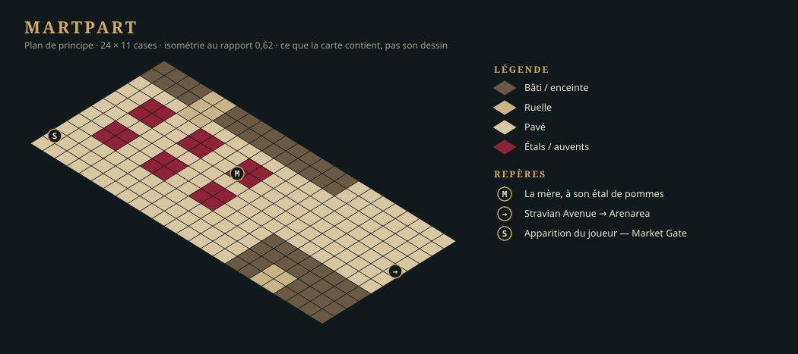
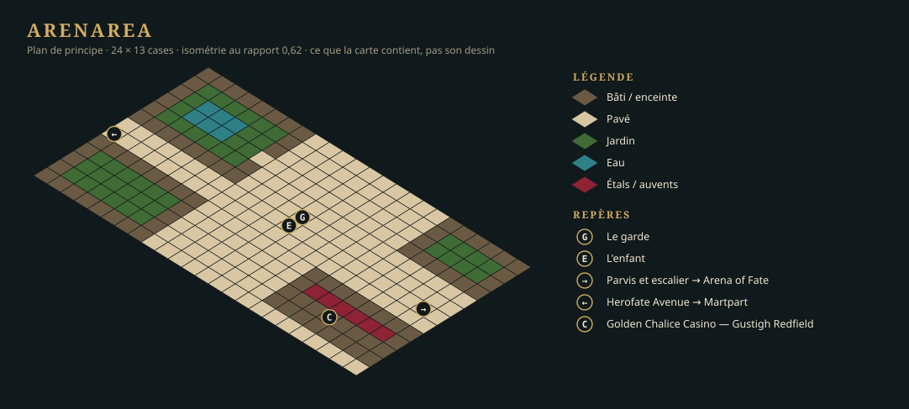

# Version 0.0.1 — démo basique

## Quatre filières en parallèle

La démo se construit sur quatre pistes qui ne se rejoignent qu'à la quête :

| Piste | Lots | Ce qui la bloque |
|---|---|---|
| **Le standard et les assets** | LOT-101 → LOT-102, LOT-103 → LOT-104 → LOT-105 → assets des trois zones → cartes, PNJ | l'approbation de la maquette de style par l'auteur |
| **Le moteur de la quête** | LOT-116 (drapeaux), LOT-117 (jet en dialogue), LOT-119 (écrans de fin) — prêts dès aujourd'hui | rien |
| **Le combat sur la carte** | LOT-118 | le rendu HD (LOT-103) |
| **L'éditeur** | LOT-123 → LOT-102 ; LOT-124, LOT-125 → LOT-127 ; LOT-126 | rien pour le LOT-123, prêt dès aujourd'hui ; il **précède** la table rase |

Tant que les assets ne sont pas là, le moteur de la quête avance sur des **cartes de test** et des
marqueurs : le jeu sait déjà afficher un damier et un jeton à la place d'un asset manquant.

## Ce que la démo contient

Trois cartes — deux quartiers et un donjon, l'Arena of Fate, sous-zone d'Arenarea —, cinq PNJ à rôle, une foule, un adversaire, quatre dialogues, un drapeau de quête,
deux écrans de fin. Le détail est dans [la fiche de la quête](quete-demo.md).

### Martpart

### Arenarea

### Arena of Fate — donjon d'Arenarea

## Ce que la démo ne contient pas

Ni sauvegarde, ni groupe, ni classes, ni expérience, ni marchand, ni audio, ni création de
personnage. L'Illu Die Arena, le casino et l'hippodrome sont des **façades**.

## La pré-carte de l'Arena of Fate

`Tools/AssetsHD/Colisee/` contient déjà de quoi monter une arène fermée : deux planches de sols,
quatre murs, deux angles, deux gardiens. Le [LOT-107](lots/LOT-107-carte-arena-of-fate.md) commence
par là : c'est la première carte HD du jeu, et l'épreuve de la chaîne (LOT-104) et du rendu
(LOT-103) avant que le reste des pièces existe. Voir [l'audit](../../../standards/audit-passage-hd.md).
