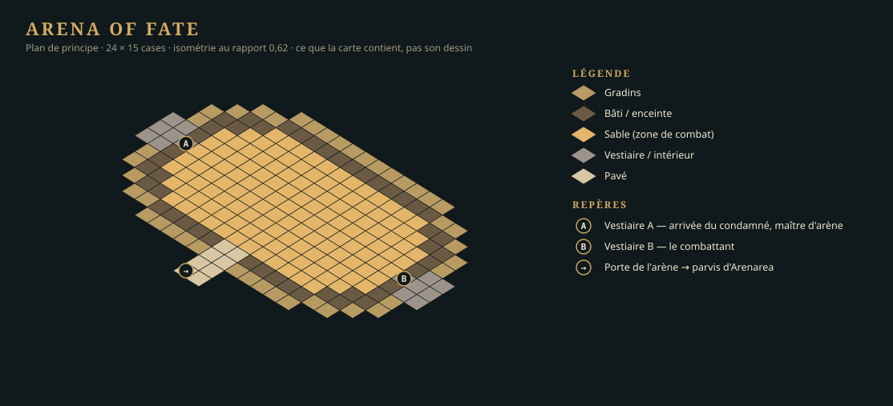

+++
id = "LOT-107"
titre = "Carte — Arena of Fate (donjon d'Arenarea)"
version = "0.0.1"
filiere = "cartes"
statut = "a-faire"
taille = "M"
resume = "L'Arena of Fate se parcourt, et figure dans l'onglet « Carte » **à l'intérieur d'Arenarea**."
prerequis = ["LOT-106", "LOT-103"]
livrables = [
  "`Levels/central-empire/capital/arenarea/arena-of-fate.json`, dessinée **dans l'éditeur**.",
  "`capital/arenarea/arena-of-fate/Map/` : l'image de la zone pour l'onglet « Carte », et son entrée dans `world-maps.json`.",
  "Portails, points d'apparition nommés, zones (combat, déclencheurs de quête).",
]
criteres = [
  "`LevelEditor --check` passe : aucune case inatteignable, aucun portail sans arrivée, aucune référence morte.",
  "La carte tient 60 images par seconde à 1080p sur le poste de référence.",
  "L'onglet « Carte » montre la zone et la position du joueur.",
  "Les 18 statues et les 5 tribunes d'honneur sont posées et nommées ; `--check` ne relève aucune référence morte vers elles.",
]
maquettes = ["../maquettes/plan-arena-of-fate.svg"]
+++

## Une sous-zone, pas un quartier

L'Arena of Fate est un **donjon d'Arenarea** (décision D-16) : un lieu clos, à plusieurs salles —
vestiaire A, vestiaire B, couloir, sable —, où l'on entre **depuis le quartier**, par la porte de
l'arène au bout du parvis. Elle n'a pas d'entrée sur le plan de la Capitale : l'onglet « Carte »
la montre **dans** Arenarea. Ses assets et sa carte se rangent sous `capital/arenarea/arena-of-fate/`,
et elle puise d'abord dans le kit d'Arenarea, puis dans celui de la Capitale.

## Conception

La carte comprend une **pré-carte** d'abord, montée avec les pièces déjà présentes dans `Tools/AssetsHD/Colisee/` (sols, murs, angles, gardiens) : elle éprouve la chaîne et le rendu HD avant que le reste des pièces existe. Puis la carte finale : le sable (zone de combat), l'enceinte, le vestiaire A où arrive le condamné, le vestiaire B, le couloir, la porte vers Arenarea.

### Le tracé, d'après la DA

L'arène est dessinée **à la manière du Colisée de Rome** ([DA complète au référentiel](../../../../referentiels/central-empire/capitale.md#larena-of-fate--architecture-et-iconographie-da-de-lauteur-21-sept-2026)).
La carte fait **34 × 24 cases**, mais **seul le sable et l'hypogée se parcourent** : les trois
anneaux qui les entourent sont du décor en hauteur, posé une fois, et ne coûtent aucune case
d'atteignabilité.

| Anneau | Cases | Parcouru ? | Ce qu'il porte |
|---|---|---|---|
| Sable | ovale de **22 × 14** | **oui** — c'est la zone de combat | dalle de fond en 3 variantes, marques au sol |
| Podium | 1 case, 2 de haut | non | mur de marbre, balustrade ; infranchissable des deux côtés |
| Coursive des dieux | 1 case | non | **18 socles à statue** répartis régulièrement, braseros entre eux |
| Gradins | 3 à 5 cases | non | **5 secteurs de peuple**, chacun percé d'une **tribune d'honneur** avec son **drapeau** devant ; enceinte à arcades et attique en fond |

Les **18 statues** se répartissent sur la coursive, régulièrement, face au sable ; les **5 tribunes**
sont dans l'anneau suivant et ne se disputent donc aucune place avec elles. L'ordre autour de
l'ovale est fixé par la DA : la **loge impériale** sur le grand axe côté parvis — celle que le
combattant voit en levant les yeux —, les **Forces alliées** en face, **Arcanum** et **Forces de
Darkall** sur le petit axe, le **Culte de l'Aile d'Ombre** entre deux, close et grillagée.

Sous le sable, l'**hypogée** se parcourt : vestiaire A (arrivée du condamné, maître d'arène),
vestiaire B (le combattant), le couloir, l'escalier qui débouche sur le sable par la **porte du
triomphe**, et la **porte des morts** en face. Le portail vers le parvis d'Arenarea est au bout du
couloir.

Le plan ci-dessus est un **schéma de principe** : il fixe ce que la carte contient et comment on y
circule, pas son dessin.
