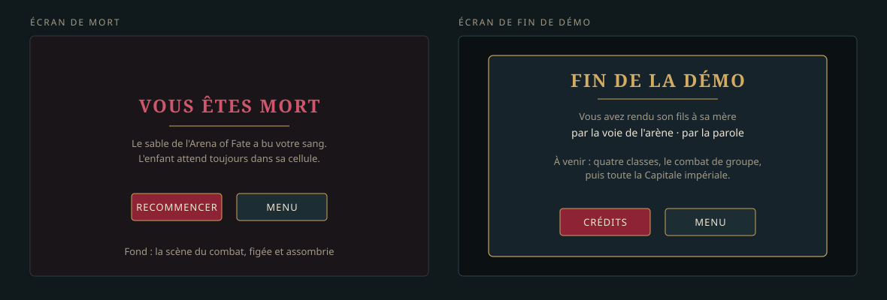

+++
id = "LOT-119"
titre = "Les écrans de fin : mort et fin de démo"
version = "0.0.1"
filiere = "interface"
statut = "en-cours"
taille = "S"
resume = "La démo se termine proprement : un écran de mort, un écran « Fin de la démo », tous deux à la charte v2."
prerequis = ["LOT-100"]
livrables = [
  "L'écran de mort : « Vous êtes mort dans l'arène », recommencer ou quitter.",
  "L'écran de fin : ce que le joueur a fait (voie pacifique ou voie de l'arène), ce qui vient dans la version suivante, les crédits.",
]
criteres = [
  "Les deux écrans ont leur capture de référence QML.",
  "Tous leurs textes sont traduits en français et en anglais.",
]
maquettes = ["../maquettes/ecrans-de-fin.svg"]
+++

## Décisions de réalisation

### D1 — Deux écrans de premier niveau, qui ferment la partie

`ScreenId::Death` et `ScreenId::DemoEnd` entrent dans la table des transitions : ils s'ouvrent
depuis un écran du RPG (le HUD de combat, le dialogue) ou depuis la carte, et n'en sortent que
vers une partie neuve, le menu ou les crédits. Aucun retour à la partie : la pause, les options
et la fermeture d'un écran du RPG y sont refusées (`ScreenFlowTest.LesEcransDeFinFermentLaPartie`).

### D2 — La mort s'ouvre d'elle-même, par-dessus la scène du combat

Dès que la défaite est publiée (la file a fini de montrer la chute), le HUD de combat ouvre
l'écran de mort **sans quitter la rencontre** : la surface de rendu de la carte dessine encore
les combattants là où ils sont tombés, sous un voile grenat — le « fond : la scène du combat,
figée et assombrie » de la maquette. Le panneau d'issue du HUD ne sert plus que la victoire et la
fuite.

### D3 — Une partie finie ne laisse rien derrière elle

`WorldModel.endGame()` refait la session : aucune carte ouverte, drapeaux et quêtes oubliés, sauf
ceux que le lancement a posés (`--flags=`), réglages du lancement gardés (`--map=`, `--at=`,
`--levels=`). « Recommencer » quitte la rencontre, finit la partie et rouvre le jeu à la porte de
la ville ; « Menu » fait de même vers le menu. Jusqu'ici, une défaite ramenait au menu et
« Nouvelle partie » **reprenait** la partie où l'on venait de mourir. L'écran de fin de la démo
finit la partie à son ouverture.

### D4 — Un dialogue clôt la démo : l'action `endDemo`

La fin de la démo est un geste du récit : la mère, au dernier dialogue de la quête (`LOT-120`),
exécute `{"type": "endDemo", "ending": "<voie>"}`. Le runner le transmet à l'interlocuteur
(`core::DialogueListener::endDemo`), le modèle de l'écran l'émet (`DialogueModel.demoEnded`), et
le routeur transporte la voie jusqu'à l'écran de fin (`ScreenRouter.ending`, `endingText`) — comme
il transporte le dialogue ouvert. La voie se dit par la clé `ending.<voie>`, que le dialogue
réclame (`core::dialogueTextKeys`) : le test de traduction des dialogues la vérifie en français
et en anglais. Les deux voies de la démo, `arene` et `parole`, sont écrites dès ce lot ; le
`LOT-120` choisira, par une condition, laquelle son dialogue nomme.

### D5 — Les textes

Les textes fixes des deux écrans sont des `qsTr` des formulaires, traduits dans `jadg_en.ts`
(contrôlés par `check_translations.py`). Les deux lignes de l'écran de mort sont celles de la
maquette, écrites pour l'Arena of Fate : c'est le seul combat létal de la démo. Le jour où un
autre combat pourra tuer, elles deviendront une donnée de la rencontre.

### D6 — Au clavier et à la manette

Gauche et droite changent de bouton, `Entrée` (A) valide, `Échap` (B) choisit « Menu ». La marque
du focus signale le bouton désigné, jamais la seule teinte.

## Tenue des critères

| Critère | Où |
|---|---|
| Capture de référence QML des deux écrans | `QmlTests` : `References/DeathForm.png`, `References/DemoEndForm.png` |
| Textes en français et en anglais | `jadg_en.ts` (`check_translations.py`) ; `ending.*` dans `fr.lang` et `en.lang` (`DialogueTest.LesDialoguesSontTraduitsEnFrancaisEtEnAnglais`) |
