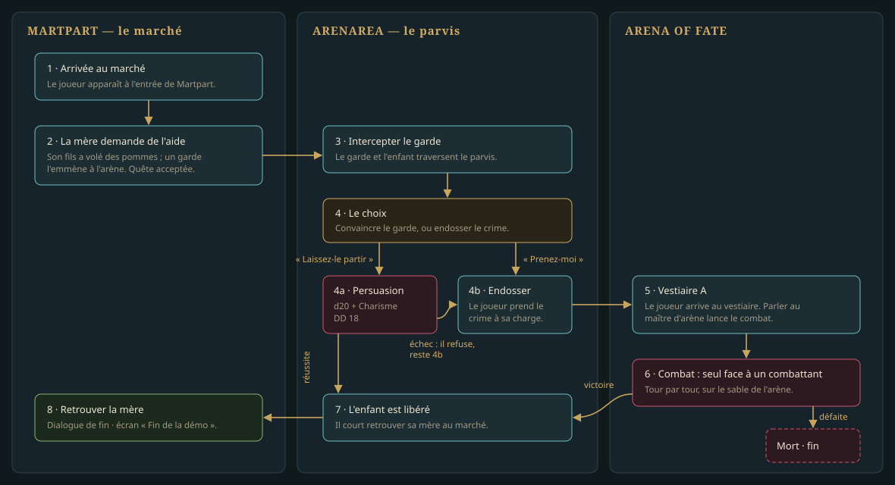

# La quête de démonstration — « Des pommes pour l'arène »

La `0.0.1` tient en **une quête**, jouée sur **trois cartes** : deux quartiers, Martpart et Arenarea,
et un donjon, l'Arena of Fate, qui est une **sous-zone d'Arenarea**. Elle sert de banc d'essai : tout ce
qu'elle traverse — dialogue, jet de compétence, drapeaux de quête, changement de carte, combat,
écran de fin — doit exister en version finale pour que la démo se termine. Rien de plus n'entre
dans la version.

> L'Arena of Fate tient en **deux cartes** (décision D-21) : le sable, et le niveau −1 des vestiaires et de
> la prison. Le vestiaire A est sur la seconde ; le combat se joue sur la première.

> Dans la démo, les trois cartes sont des **cartes de principe** ([LOT-146](lots/LOT-146-cartes-de-principe-de-la-demo.md)),
> jouées en maquette, et les PNJ y sont des mannequins ([LOT-145](../v0.0.2-combat/lots/LOT-145-mannequins-de-remplacement.md))
> ou des jetons. Les cartes et les PNJ définitifs sont à la `0.0.3` ([D-25](../../../vision/decisions.md)).

## Déroulé

| # | Carte | Étape | Ce que le moteur doit savoir faire |
|---|---|---|---|
| 1 | Martpart | Le joueur apparaît à l'entrée du marché. | point d'apparition, exploration |
| 2 | Martpart | Une **mère** l'interpelle : son fils a volé des pommes, un garde l'emmène à l'arène. Accepter ouvre la quête. | dialogue à réponses, drapeau `quete.pommes = acceptee`, journal |
| 3 | Arenarea | Le **garde** et l'**enfant** traversent le parvis. Le joueur les intercepte. | portail Martpart → Arenarea, PNJ présents **selon un drapeau** |
| 4 | Arenarea | Le choix : **convaincre** le garde, ou **endosser** le crime. | dialogue à embranchement |
| 4a | Arenarea | Persuasion, **DD 18**. Réussite : l'enfant est libéré → étape 7. Échec : le garde refuse, il ne reste que 4b. | jet de compétence **dans** un dialogue, résultat montré au joueur, option retirée après échec |
| 4b | Arenarea | Le joueur prend le crime à sa charge ; il est conduit à l'arène. | transfert scénarisé vers une autre carte |
| 5 | Arena of Fate | Arrivée au **vestiaire A**. Parler au **maître d'arène** lance le combat. | apparition nommée, dialogue qui déclenche une rencontre |
| 6 | Arena of Fate | Combat : **seul contre un** combattant de l'arène. Défaite : mort, fin de la démo. Victoire : l'enfant est libéré. | bascule exploration → combat **sur la carte**, fin de combat, écran de mort |
| 7 | — | L'enfant est libéré ; il retourne auprès de sa mère. | drapeau `quete.pommes = enfant-libere`, PNJ déplacé selon le drapeau |
| 8 | Martpart | Retrouver la mère : dialogue de fin, puis l'écran **« Fin de la démo »**. | retour libre par les portails, clôture de quête, écran de fin |

## Les drapeaux

Un seul drapeau de quête, à cinq valeurs — c'est toute la mémoire de la démo :

| Valeur | Posée par | Effet sur le monde |
|---|---|---|
| `inconnue` | — | la mère interpelle le joueur ; le garde et l'enfant ne sont pas sur le parvis |
| `acceptee` | étape 2 | le garde et l'enfant paraissent sur le parvis d'Arenarea |
| `persuasion-echouee` | étape 4a | l'option « Laissez-le partir » disparaît |
| `condamne` | étape 4b | le joueur est au vestiaire A ; les portes de l'arène sont closes |
| `enfant-libere` | étape 4a ou 6 | l'enfant est auprès de sa mère ; le garde a quitté le parvis ; les portes sont ouvertes |

## Les PNJ de la quête

| PNJ | Carte | Famille | Rôle |
|---|---|---|---|
| La mère | Martpart | neutre, avec dialogue | donne et clôt la quête |
| L'enfant | Arenarea, puis Martpart | neutre | suit le garde, puis rejoint sa mère |
| Le garde | Arenarea | neutre, avec dialogue | porte le choix et le jet de Persuasion |
| Le maître d'arène | Arena of Fate, vestiaire A | **nommé** (à tirer du compendium) | lance le combat |
| Le combattant | Arena of Fate, sable | **hostile** | l'unique adversaire |

Les trois premiers n'ont pas de nom dans le livre : la quête est une invention de la démo, posée
sur des lieux qui, eux, sont du livre. Leurs noms se choisissent au lot des dialogues.

## Équilibrage du combat

Le joueur est **seul** et la défaite est **définitive** : le combat doit se gagner sans chance
insolente, et se perdre si l'on joue mal. Cible : un personnage de niveau 1 l'emporte **deux fois
sur trois** en jouant correctement. Le réglage se fait à graine fixée, par le rejeu déterministe
que le combat sait déjà faire, sur cent combats simulés.

Le DD 18 de la Persuasion est voulu haut : avec +5, un joueur réussit **deux fois sur cinq**. La
voie pacifique est une chance, la voie de l'arène est le chemin attendu.

> **À rééquilibrer au [LOT-120](lots/LOT-120-quete-des-pommes-pour-l-arene.md).** Le héros de la démo
> est devenu la fiche pré-tirée du Brawler ([LOT-112](lots/LOT-112-heros-de-la-demo.md), décision de
> l'auteur) : Charisme 8, Persuasion −1, donc **une fois sur dix** à DD 18. Le « +5 » ci-dessus
> supposait une fiche bâtie pour la quête ; le DD, ou la voie pacifique, se reprend avec la quête.

## Ce que la quête ne contient pas

Pas de récompense en objets, pas d'expérience, pas de marchand, pas de sauvegarde en cours de
quête, pas de second combat, pas de groupe. Chacun a sa version.
