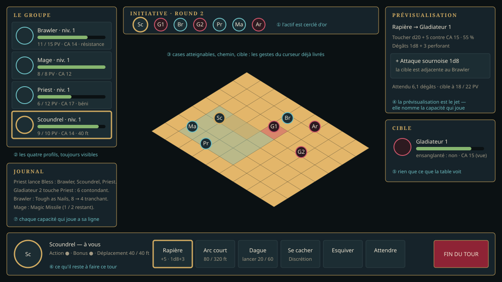

+++
id = "LOT-140"
titre = "L'interface de combat, à jour"
version = "0.0.2"
filiere = "interface"
statut = "a-faire"
taille = "M"
resume = "Le combat montre qui joue, qui suit, ce que chacun peut faire : profils, capacités, ressources."
prerequis = ["LOT-139"]
reprend = ["LOT-24"]
livrables = [
  "La **piste d'initiative** aux jetons des personnages.",
  "Le **panneau du personnage actif** : portrait, PV, CA, états, capacités et sorts avec leurs lancers restants.",
  "Les **profils** des adversaires, limités à ce que la table voit (règle du `LOT-23`).",
  "La prévisualisation d'une capacité : portée, zone, jet, dégâts attendus.",
]
criteres = [
  "Tout ce qu'un personnage peut faire à son tour est accessible sans souris.",
  "Les captures de référence QML sont à jour.",
]
maquettes = ["../maquettes/combat-de-groupe.svg"]
+++

