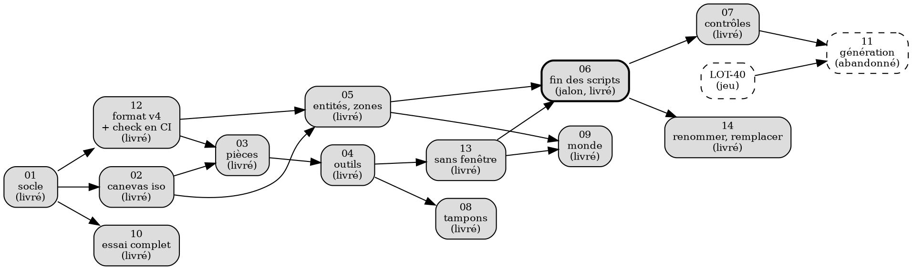

# Feuille de route de l'éditeur de cartes

Le programme du **module éditeur**, et l'unique source de vérité de ses lots : `LOT-EDITOR-01` à
`LOT-EDITOR-14`. L'éditeur est un **outil interne**, fait pour l'auteur seul, qui sert à fabriquer
les cartes du jeu. Il a sa piste à part : cette page ne dépend pas de la
[feuille de route du jeu](feuille-de-route-jeu.md), et aucun lot du jeu ne déclare de prérequis vers elle.

> **Décidé le 18 septembre 2026.** L'éditeur du [LOT-11](../../versions/v0.0.0/v0.0.0-fondation/lots/LOT-11-editeur-multicouches.md) peint des types de tuiles en
> couleurs à plat ; le jeu affiche des lieux en isométrie 0,62, faits de pièces de planche. Entre
> les deux, rien ne se voit ni ne se pose : les trois cartes livrées (le Colisée, Martpart,
> Arenarea) sont écrites par script. Le module refait l'outil à neuf **et révise le format de
> carte une fois** (version 4), tant qu'il n'y a que trois cartes à migrer. Un audit du code a
> précédé cette page ; ses constats sont en §2, les décisions de l'auteur en §3.

> **Close le 21 septembre 2026.** Treize lots sur quatorze sont livrés ; le quatorzième,
> `LOT-EDITOR-11`, est abandonné (voir sa rubrique). Un audit de l'éditeur face au planning du jeu
> (`Planning/standards/audit-editeur.md`) a montré que l'outil ne peut plus « avancer à part » : la
> 2D HD, l'arborescence d'assets par niveaux et la quête de la démo lui demandent des lots dont les
> cartes dépendent. **Ces lots vivent dans `Planning/`, filière `editeur`** (`LOT-123` à `LOT-128`,
> `LOT-143`, `LOT-158`, `LOT-159`, `LOT-166` à `LOT-169`). Cette page reste l'histoire du module,
> ses décisions D1 à D13 et ses cinq règles, qui valent toujours.

Comme pour le jeu, un dossier de lot se crée **au démarrage** du lot, et un lot livré quitte cette
page pour son dossier. Les dossiers vivent dans `Documentation/Editeur/LOT-EDITOR-NN-…/`, **pas**
dans `Documentation/Lot/` : `lint_lots.py` y prend tout dossier `LOT-*` pour un lot du jeu. Ce lint
ne lit que les numéros `LOT-NN` ; il ignore les `LOT-EDITOR-NN`, ce qui est voulu.

---

## 1. Cadre du module {#roadmap-editeur-cadre}

L'éditeur est un outil d'atelier, pas un produit. On le juge sur une seule question : **une carte
se fait-elle vite et juste ?** Tout ce qui ne sert pas à ça sort de son périmètre d'exigences.

| Règle | Jeu | Éditeur |
|---|---|---|
| Charte v2, design tokens, icônes tracées (`DesignTokens`, `ThemeIcons`, `theme-editor.qss`) | obligatoire | non : style Qt Fusion, icônes standard de Qt ou libellés texte |
| Assets d'interface | produits par ateliers | aucun ; l'éditeur ne montre que les assets du jeu (planches, figurines) |
| Traduction (`qsTr`, `lupdate`) | obligatoire | non : **anglais en dur**, sortie des contrôles de traduction |
| Thème clair/sombre, architecture des panneaux (`EX-IHM-010`, `020`, `054`, `055`, `060`, `061`, `074`) | — | retirées pour l'éditeur ; l'agencement se décide lot par lot |
| Formulaires `.ui` dans `Source/Ui` | — | non : **widgets construits en code** |
| Tests | logique, QML, références PNG | logique pure (gestes, collision, contrôles, format), un test de lancement, un scénario sans fenêtre par outil ; aucun test d'IHM |
| Qualité C++ (format, clang-tidy, build sans avertissement) | oui | oui : même code, même CI, coût nul |
| Doxygen | complet | **complet** |
| Guide | complet | README du module, un guide d'usage court |
| Performance | 60 i/s, budget | une taille de carte maximale déclarée et mesurée (§5, règle 5) |

**Ce qui ne se négocie pas.** Une carte enregistrée est lue par le jeu sans conversion
(`EX-EDIT-011`). Rien de ce que l'éditeur ne comprend pas n'est perdu. Le modèle et la validation
de carte restent ceux de `Core`, sans doublon (`EX-EDIT-010`).

**Hors du module** : dessiner les planches et les figurines (ateliers du [LOT-91](../../versions/v0.0.0/v0.0.0-fondation/lots/LOT-91-atelier-pnj.md) et
du [LOT-92](../../versions/v0.0.0/v0.0.0-fondation/lots/LOT-92-atelier-textures.md)), écrire les dialogues ([LOT-15](../../versions/v0.0.0/v0.0.0-fondation/lots/LOT-15-pnj-dialogues.md)), l'économie et les quêtes.

---

## 2. Ce que l'audit a trouvé {#roadmap-editeur-audit}

Le défaut de fond n'est pas l'outil, c'est le **format de carte** : les limites qui gênent
l'éditeur y sont écrites. Chaque constat a été vérifié dans le code le 18 septembre 2026.

| # | Constat | Preuve | Conséquence |
|---|---|---|---|
| A1 | Une seule pièce nommée par case, et seulement pour le relief | `snapshotWorldScene` écrit `textureOverrides` dans `snapshot.relief` uniquement ; le sol sort de `PlaceAppearance::floorPiece` | impossible de choisir une pièce de sol sur une case |
| A2 | L'assignation vit sur la grille de collision | `"texture"` est un champ des `tiles` racine ; d'où un `dirt` de collision sous chaque pièce | poser une pièce en un geste automatiserait une astuce au lieu de la retirer |
| A3 | Le type de tuile porte trois sens | fente d'apparence (`appearance.json`), règle tactique (`BattleGrid`), biome du générateur (`LOT-81`) | `bridge` vaut « ruelle » à Martpart et « pont » pour le [LOT-40](feuille-de-route-jeu.md#lot-40) |
| A4 | L'emprise des pièces larges n'est lue par personne | `footprint` n'apparaît que dans `AssetGallery.cpp` ; huit pièces `wide` livrées | occupation, tri de profondeur et collision de la deuxième case ne sont définis nulle part |
| A5 | La collision n'est pas binaire | `BattleGrid` distingue `Solid` (arrête la vue) et `GroundObstacle` (arrête le pas) ; le [LOT-22](../../versions/v0.0.0/v0.0.0-fondation/lots/LOT-22-portee-ligne-de-vue.md) ajoute l'abri | la collision déduite d'une pièce est un **type tactique**, pas un booléen |
| A6 | Les entités n'ont pas d'identifiant | `MapEntity` = type, position, propriétés ; les liens passent par `name` ou par la case | déplacer un coffre casse quêtes et sauvegardes sans que rien le dise |
| A7 | L'identifiant d'une carte est son chemin | `capital/martpart` est cité par les portails, `world-maps.json`, `cities/capital.json` | renommer une carte casse le monde ; il faut un renommage propagé |
| A8 | Le composeur est pur, mais logé dans `HmiLib` | `TextureHandle = void*`, aucune dépendance GPU dans `WorldSceneComposer` | le canevas peut dessiner les primitives du jeu, à condition de sortir la composition dans une cible sans GPU |
| A9 | Déduire la collision dans `Core` demande le manifeste | le manifeste et `PlaceAppearance` sont lus dans `HMI/Graphics` | la lecture du manifeste descend dans `Core` ; `HMI` n'en garde que les images |
| A10 | L'historique d'annulation n'a pas de plafond | `LevelDraft::_undoHistory` : instantanés complets, jamais purgés | à plafonner ; stocker les pièces par indice |
| A11 | Retirer les scripts retire ce qu'ils apportaient | `carte_colisee.py`, `carte_quartiers.py` : édition en masse, rejouable, relue en diff | l'éditeur doit se piloter **sans fenêtre** |
| A12 | Les scripts portent la seule garde des cartes en CI | leur `--check` | le contrôle de l'éditeur tourne en CI **avant** que les scripts ne partent |

---

## 3. Décisions {#roadmap-editeur-decisions}

Toutes tranchées par l'auteur le 18 septembre 2026.

| # | Question | Décision |
|---|---|---|
| D1 | Dans quelle vue édite-t-on ? | Les deux, en bascule ; **iso par défaut**, la vue à plat sert à lire les types et la collision |
| D2 | Avec quoi dessine-t-on le canevas ? | `QGraphicsView` et `QPainter` : **un seul élément peint** parcourt la `ComposedScene` triée du jeu ; des `QGraphicsItem` seulement pour les entités, les zones et les poignées. L'ordre de dessin est celui du jeu par construction, et le même code rend hors écran (D9) |
| D3 | Que porte une case de couche ? | **Format v4** : chaque case de chaque couche porte `type` et une `piece` facultative ; l'assignation quitte la grille de collision. Le `type` ne garde qu'un sens, celui des règles et du générateur ; `appearance.json` devient le défaut des cartes générées. La v3 reste lue pour toujours |
| D4 | Qui fait foi, le script ou l'éditeur ? | L'éditeur ; les scripts des cartes faites à la main sont retirés au `LOT-EDITOR-06` |
| D5 | Où vit le code ? | `Source/Editor/{Logic,Ui}`, cible et tests à lui ; il dépend de `Core` et de la composition, et rien ne dépend de lui |
| D6 | Le jeu attend-il l'éditeur ? | Aucune dépendance déclarée, **mais un ordre** : les lots 01 à 06 passent avant les cartes du [LOT-27](feuille-de-route-jeu.md#lot-27). Les [LOT-16](feuille-de-route-jeu.md#lot-16) et [LOT-17](feuille-de-route-jeu.md#lot-17) avancent en parallèle. Pas de troisième script pour le repaire |
| D7 | Que deviennent les exigences ? | `editeur-niveaux.md` reste la spécification du module ; les `EX-IHM` propres à l'éditeur passent au registre des retirées |
| D8 | Les entités ont-elles un identifiant ? | Oui : `id` court, unique dans la carte, donné par l'éditeur, jamais réemployé ; quêtes, drapeaux et sauvegardes citent `carte#id` |
| D9 | L'éditeur se pilote-t-il sans fenêtre ? | Oui : `--check`, `--migrate`, `--render carte.png`, `--apply gestes.json`. La souris et `--apply` appellent les mêmes fonctions pures |
| D10 | Où vit la collision ? | **Écrite dans le fichier** par l'éditeur, avec la liste des cases forcées à la main : le jeu lit la carte sans manifeste, et `--check` vérifie que fichier = déduction + cases forcées. Le manifeste déclare un type tactique par pièce |
| D11 | Hauteur et étages ? | **Pas prévus aujourd'hui, mais la porte reste ouverte** : le format v4 réserve la place (voir ci-dessous), sans que ni le jeu ni l'éditeur ne s'en servent. D'ici là, un intérieur ou un sous-sol est une carte à part, reliée par portail |
| D12 | Comment fait-on une variante de carte ? | La variante déclare `base`, change de planche (`scene`) et porte ses propres entités, sans toucher aux cases : l'Arène du Destin du [LOT-27](feuille-de-route-jeu.md#lot-27), puis le plan pénombral du [LOT-90](feuille-de-route-jeu.md#lot-90) |
| D13 | Une zone est-elle toujours un rectangle ? | Non : rectangle **ou** ensemble de cases peint ; `BattleGrid::zonesAt` lit les deux formes |

**Le format v4, en une fois.** Des couches dont chaque case porte `type` et `piece` ; une pièce
large ancrée sur une case et occupant son `footprint`, par une règle unique dans `Core` ; la
collision écrite avec ses cases forcées ; des entités à `id` ; des zones à forme ; des variantes
par `base`. **Réserve de hauteur (D11)** : une couche accepte un champ `floor` (étage, 0 par
défaut), une case et une entité un champ `elevation` (0 par défaut). Le chargeur les lit, les
garde et les réécrit ; une valeur non nulle est admise par le format et signalée par `--check`
tant que le jeu ne la joue pas. Le pointage du canevas prend la hauteur en paramètre dès le
`LOT-EDITOR-02`, et ne connaît que 0. C'est la seule révision de format prévue.

**Reste ouvert.** Une carte sans lieu (le terrain des régions, [LOT-40](feuille-de-route-jeu.md#lot-40)) n'a pas de
planche : planche « terrain » générique faite par l'atelier du [LOT-92](../../versions/v0.0.0/v0.0.0-fondation/lots/LOT-92-atelier-textures.md), ou repli
sur les types en couleurs ? Le repli est acquis (`LOT-EDITOR-03`) ; la planche se décide avec le
`LOT-40`.

---

## 4. Architecture {#roadmap-editeur-architecture}

Le module ne crée aucun moteur. Il lit ce que le jeu sait déjà (modèle de carte, composition iso,
manifestes de pièces), et tout ce qui a une règle vit en fonctions pures testées. L'IHM est libre
et jetable. Le brouillon `LevelDraft` reste la seule source : tout geste passe par lui, en un pas
d'annulation.

| Partie | Où | Ce qu'elle fait |
|---|---|---|
| Format, migration, contrôles | `Core` | charge toutes les versions, écrit la v4 de façon canonique, déduit la collision (`deriveCollision`), contrôle références, pièces et atteignabilité |
| Manifeste de pièces | `Core` | classe, emprise, type tactique, `aliases` d'une pièce ; `HMI` n'en garde que les images |
| Composition | cible sans GPU, partagée avec le jeu | `ComposedScene`, `WorldSceneComposer`, `ScenePieces`, sortis de `HmiLib` |
| Projet | `Editor/Logic` | la racine `Source/Elements` : cartes, planches, catalogues ; relu à chaud, avec garde de fichier modifié sur disque |
| Document de carte | `Editor/Logic` | un `LevelDraft`, sa sélection, son état de vue ; plusieurs ouverts en onglets |
| Pointage | `Editor/Logic` | inverse de `core::IsoProjection` (écran vers case, hauteur en paramètre) ; un relief haut se désigne par son pied |
| Outils et pinceau | `Editor/Logic` | chaque outil = une fonction pure (grille, geste, pinceau) qui rend une modification ; l'IHM ne fait que l'aperçu |
| Entrée sans fenêtre | `Editor/Logic` + `App/Editor` | `--check`, `--migrate`, `--render`, `--apply` |
| Canevas | `Editor/Ui` | une `QGraphicsView` : un élément peint pour la scène, des éléments pour entités, zones et poignées ; vue à plat par les couleurs de `DraftRenderer` |
| Inspecteur et zones | `Editor/Ui` | dérivés du schéma typé de `core::knownEntityKinds`, sans code par famille |
| Fichier annexe | à côté de la carte | `<carte>.editor.json` : notes d'auteur, régions verrouillées, état de la carte, dernière vue ; le jeu ne le lit jamais |
| Préfabriqués | `Source/Elements/Editor/Prefabs/<lieu>/` | tampons enregistrés, que seul l'éditeur lit |
| Essai | `Editor/Ui` | l'essai immédiat garde `WorldPlay` ; l'essai complet lance `JustAnotherRpgGame --map=… --at=x,y` |
| Reprise | poste | sauvegarde automatique dans `%LOCALAPPDATA%`, proposée au redémarrage après un plantage |

Ce qui disparaît de l'éditeur : son usage de `DesignTokens`, `ThemeIcons`, `IconGeometry`,
`theme-editor.qss` et `ActionCatalog`, ses formulaires `.ui` (tous retirés au `LOT-EDITOR-01`), le
rendu `QRhiWidget` (au `LOT-EDITOR-02`), et les panneaux actuels, reconstruits plus simples.

---

## 5. Cinq règles pour durer {#roadmap-editeur-perennite}

Un éditeur dure si son **format** dure et si chaque nouveau lot du jeu y entre sans code d'éditeur.

1. **Une politique de format, écrite une fois.** Toute version passée se lit pour toujours, et une
   fixture par version reste dans les tests. La conversion est un acte explicite (`--migrate`),
   jamais l'effet de bord d'un enregistrement. L'écriture est canonique : un geste = un diff git
   lisible, et charger puis enregistrer une carte intacte rend le même fichier, octet pour octet,
   vérifié en CI sur toutes les cartes. Le format a un **schéma JSON** publié
   (`Documentation/Editeur/level.schema.json`), lu par les outils Python et par l'éditeur de texte.
2. **Un contrat d'extension avec les lots du jeu.** Un lot qui ajoute une famille d'entité, une
   propriété ou une forme de zone la déclare dans `EntityKinds` avec son type ; l'inspecteur, les
   poignées et le contrôle la reçoivent sans code. Un test bloquant le garantit, sur le modèle de
   `EX-CNT-042` pour la galerie des assets.
3. **Les assets bougent, les cartes survivent.** Une planche réextraite renomme ou retire des
   pièces : le manifeste accepte des `aliases`, une pièce introuvable reste dans le fichier et
   s'affiche en damier, et le `LOT-EDITOR-14` remplace en masse.
4. **Deux façons d'éditer, un seul chemin de code.** La souris et `--apply` appellent les mêmes
   fonctions pures ; un scénario `--apply` par outil, comparé à un fichier attendu, tient lieu de
   test d'IHM.
5. **Une taille maximale déclarée et mesurée.** Borne proposée : 128 × 128 cases, refusée
   au-delà par le chargeur ; composition et dessin mesurés dans `Source/Benchmark`.

**Ce que les lots du jeu demanderont aux cartes.** Aucune ligne ne demande un lot d'éditeur de
plus si la règle 2 est tenue.

| Lot du jeu | Ce que la carte portera | Couvert par |
|---|---|---|
| [LOT-16](feuille-de-route-jeu.md#lot-16), quêtes et drapeaux | entités et portails conditionnés par un drapeau ; quêtes qui citent `carte#id` | D8, référence « drapeau » (05), contrôle (07), essai sous drapeaux (10) |
| [LOT-17](feuille-de-route-jeu.md#lot-17), sauvegarde riche | l'état d'un coffre retrouvé après une retouche de carte | D8 : l'état se range par `id`, pas par case |
| [LOT-26](feuille-de-route-jeu.md#lot-26), butin et marchands | contenu de coffre, étal de marchand | références au catalogue d'objets (05) |
| [LOT-27](feuille-de-route-jeu.md#lot-27), la Capitale | le repaire (intérieur), l'Arène du Destin en variante du Colisée | D11, D12 |
| [LOT-28](feuille-de-route-jeu.md#lot-28), audio | ambiance de carte, zones sonores | propriétés de carte (09), zones à forme (D13) |
| `LOT-41`, peuplement | zones de rencontre et leurs tables | zones peintes (05) |
| `LOT-42`, voyage | position d'une carte sur `world-maps.json` | vue du monde (09) |
| `LOT-70` et `LOT-82`, horloge et PNJ civils | trajets et horaires ; beaucoup de PNJ par carte | famille « trajet », liste filtrable, multi-sélection (05) |
| `LOT-75`, campement | lieux où camper | une famille d'entité de plus, sans code |
| [LOT-81](feuille-de-route-jeu.md#lot-81), règles de zone | zones sans soin, sans combat, à dégâts de froid | D13, propriétés typées (05) |
| [LOT-90](feuille-de-route-jeu.md#lot-90), plan pénombral | la même carte sous une autre planche | D12 |
| textes de carte (panneaux, noms) | des clés de traduction, pas du texte | le contrôle vérifie que la clé existe (07) |

---

## 6. Les lots {#roadmap-editeur-lots}

Quatorze lots ; chacun livre une chose qu'on utilise le jour même. Ils se vérifient sur Martpart,
la carte la plus chargée (48 × 40, 429 pièces). **Premier jalon : `LOT-EDITOR-06`**, après lequel
les cartes du jeu se font dans l'éditeur ; les lots suivants se prennent au besoin. Les numéros
sont des noms, pas un ordre : l'ordre vient des prérequis.

| Lot | Titre | Prérequis | Taille |
|---|---|---|---|
| `LOT-EDITOR-01` | Le socle du module — **livré** | — | M |
| `LOT-EDITOR-02` | Le canevas montre le lieu — **livré** | 01 | L |
| `LOT-EDITOR-12` | Le format v4 et sa garde en CI — **livré** | 01 | M |
| `LOT-EDITOR-03` | Peindre avec les pièces du lieu — **livré** | 02, 12 | M |
| `LOT-EDITOR-04` | Les outils du peintre — **livré** | 03 | M |
| `LOT-EDITOR-05` | Entités et zones sur le canevas — **livré** | 02, 12 | M |
| `LOT-EDITOR-13` | L'éditeur sans fenêtre — **livré** | 04 | S |
| `LOT-EDITOR-06` | Les cartes quittent leurs scripts — **livré** | 05, 13 | S |
| `LOT-EDITOR-07` | Contrôle du contenu — **livré** | 06 | M |
| `LOT-EDITOR-14` | Renommer et remplacer — **livré** | 06 | M |
| `LOT-EDITOR-08` | Tampons et préfabriqués (livré) | 04 | S |
| `LOT-EDITOR-09` | Le monde : onglets, portails, ville — **livré** | 05, 13 | M |
| `LOT-EDITOR-10` | Essai complet dans le jeu — **livré** | 01 | S |
| `LOT-EDITOR-11` | Génération assistée — **abandonné** | — | — |

Tailles relatives : S tient en une séance, M en quelques-unes, L demande un découpage en phases.

Le jalon est atteint : 01, 02, 12, 03, 04, 05, 13 et 06 sont livrés, et 07, 14, 08, 09 et 10
après lui. Le graphe est donné en source
Graphviz, comme celui du jeu (la chaîne Doxygen tourne sans `HAVE_DOT`).

### LOT-EDITOR-01 — Le socle du module

> Statut : **livré le 18 septembre 2026**. Le lot a quitté cette page pour son dossier :
> [LOT-EDITOR-01 — Le socle du module](../../versions/v0.0.0/v0.0.0-fondation/lots/LOT-EDITOR-01-socle.md).

L'éditeur vit dans `Source/Editor/{Logic,Ui}` (bibliothèque `EditorLogic`, exécutable
`LevelEditor`) ; il prend le style Fusion, écrit ses textes en anglais et construit ses widgets en
code. Un brouillon modifié est sauvegardé automatiquement et proposé à la reprise après un plantage
(`EX-EDIT-056`), une carte changée sur disque n'est jamais écrasée en silence (`EX-EDIT-057`), et
l'historique d'annulation est plafonné, « modifié » suivant le contenu (`EX-EDIT-058`).

### LOT-EDITOR-02 — Le canevas montre le lieu

> Statut : **livré le 18 septembre 2026**. Le lot a quitté cette page pour son dossier :
> [LOT-EDITOR-02 — Le canevas montre le lieu](../../versions/v0.0.0/v0.0.0-fondation/lots/LOT-EDITOR-02-canevas.md).

Le canevas est une `QGraphicsView` dont l'élément unique peint, par `QPainter`, la liste de
primitives que compose le jeu ; son image égale celle du GPU à 0,06 % des pixels près
(`EX-EDIT-059`). Vue iso par défaut, vue à plat en bascule ; le pointage désigne la case par son
losange, hauteur en paramètre (`EX-EDIT-060`) ; calques grisés ou verrouillés, reliefs en
transparence, mini-carte (`EX-EDIT-061`). La composition vit dans la cible `SceneComposition`, le
manifeste des pièces dans `Core` ; l'éditeur ne parle plus au GPU.

### LOT-EDITOR-12 — Le format v4 et sa garde en CI

> Statut : **livré le 19 septembre 2026**. Le lot a quitté cette page pour son dossier :
> [LOT-EDITOR-12 — Le format v4 et sa garde en CI](../../versions/v0.0.0/v0.0.0-fondation/lots/LOT-EDITOR-12-format-v4.md).

Chaque case de couche porte son type et sa pièce ; la grille de collision est déduite des pièces et
écrite, avec ses cases forcées (`EX-LVL-019`, `EX-LVL-020`). Les entités ont un identifiant jamais
réemployé, les zones une forme peinte, les cartes des variantes, la hauteur une place réservée
(`EX-LVL-021` à `EX-LVL-024`). `LevelEditor --migrate` a converti les trois cartes sans changer ce
que le jeu joue ; `LevelEditor --check` les garde en CI (`EX-EDIT-062`). Schéma publié :
`Documentation/Editeur/level.schema.json`. Le Colisée gardait 540 cases forcées, libérées au
`LOT-EDITOR-03`.

### LOT-EDITOR-03 — Peindre avec les pièces du lieu

> Statut : **livré le 19 septembre 2026**. Le lot a quitté cette page pour son dossier :
> [LOT-EDITOR-03 — Peindre avec les pièces du lieu](../../versions/v0.0.0/v0.0.0-fondation/lots/LOT-EDITOR-03-pieces.md).

La palette est la planche du lieu : vignettes groupées par classe, recherche, et à part les pièces
que la carte cite sans que la planche les ait, en damier (`EX-EDIT-063`). Une pièce va sur sa
couche et écrit, en un geste, sa pièce, le type de sa case et la collision de son emprise ; la
gomme retire une pièce entière (`EX-EDIT-064`). La collision suit chaque geste sur ses seules
cases ; peindre la collision force la case, la gomme la libère, et le masque montre les cases
forcées (`EX-EDIT-065`). Les 540 cases forcées du Colisée — le vide autour de l'amphithéâtre, que
le héros atteignait par la porte, et deux piliers qui se traversaient — sont libérées : sa collision
est la déduction.

### LOT-EDITOR-04 — Les outils du peintre

> Statut : **livré le 19 septembre 2026**. Le lot a quitté cette page pour son dossier :
> [LOT-EDITOR-04 — Les outils du peintre](../../versions/v0.0.0/v0.0.0-fondation/lots/LOT-EDITOR-04-outils.md).

Ligne, seau, gomme en outil et pipette (`Alt` + clic depuis tout outil), chacun à sa touche ; un
geste, du clic au relâchement, est un pas d'annulation (`EX-EDIT-066`). Le miroir reflète chaque
geste de l'autre côté d'un axe vertical de l'écran et pose la jumelle des pièces (`EX-EDIT-067`).
Les notes d'auteur vivent dans `<carte>.editor.json` (`EX-EDIT-068`) ; la mesure dit cases et
pieds, et l'essai part de la case survolée (`EX-EDIT-069`). Une maison de Martpart — sol, deux
façades, portes, seuils — se trace en cinq gestes, sans la couche collision.

### LOT-EDITOR-05 — Entités et zones sur le canevas

> Statut : **livré le 19 septembre 2026**. Le lot a quitté cette page pour son dossier :
> [LOT-EDITOR-05 — Entités et zones sur le canevas](../../versions/v0.0.0/v0.0.0-fondation/lots/LOT-EDITOR-05-entites-zones.md).

Une entité se dessine et se manipule par la **forme** que sa famille déclare — point, rectangle,
zone rectangle ou peinte, trajet — : les zones se tirent, se redimensionnent par huit poignées et se
peignent case par case (outil Forme, `Z`), les trajets se tracent point par point (`EX-EDIT-070`).
Le canevas montre la figurine à la place du marqueur, l'étiquette de chaque famille, la formation
d'une rencontre et le verdict tactique d'une zone de combat, recalculé pendant qu'on la tire
(`EX-EDIT-071`). Les entités se sélectionnent à plusieurs, se déplacent en groupe, et la liste se
filtre (`EX-EDIT-072`). L'inspecteur est tiré d'un schéma typé — entiers bornés, figurines,
drapeaux, lieux, objets, `carte#id` —, et un test bloque toute famille lue par le jeu et absente de
la table : il a trouvé `zone` (`EX-EDIT-073`).

### LOT-EDITOR-13 — L'éditeur sans fenêtre

> Statut : **livré le 19 septembre 2026**. Le lot a quitté cette page pour son dossier :
> [LOT-EDITOR-13 — L'éditeur sans fenêtre](../../versions/v0.0.0/v0.0.0-fondation/lots/LOT-EDITOR-13-sans-fenetre.md).

`LevelEditor --apply gestes.json` rejoue sur une carte ce que ferait la main — un outil, un appui,
un glisser, et ce qu'on arme entre deux gestes — par les fonctions mêmes que le canevas appelle ; un
geste refusé nomme le geste et n'écrit rien (`EX-EDIT-074`). `LevelEditor --render` rend une carte
en PNG, en isométrie et sans fenêtre, et la CI publie le rendu des cartes qu'une PR change
(`EX-EDIT-075`). Chaque outil a son scénario, comparé à un fichier attendu (`EX-EDIT-076`). La rue
d'Arenarea, à Martpart, gommée puis retracée en dix gestes, rend la carte livrée octet pour octet.

### LOT-EDITOR-06 — Les cartes quittent leurs scripts

> Statut : **livré le 19 septembre 2026**. **Premier jalon.** Le lot a quitté cette page pour son
> dossier : [LOT-EDITOR-06 — Les cartes quittent leurs scripts](../../versions/v0.0.0/v0.0.0-fondation/lots/LOT-EDITOR-06-fin-des-scripts.md).

L'éditeur est la source des cartes faites à la main (D4). Les scripts du Colisée et des quartiers
restent dans leurs dossiers de lot, comme trace, et refusent d'écrire dans `Levels/`. Chaque carte
livrée s'ouvre et s'enregistre dans l'éditeur sans changer d'un octet (`EX-EDIT-078`), et a reçu
sa retouche par `--apply` : la porte sud et la loge du Colisée (plus aucun chevauchement), les
boutiques du marché de Martpart, un angle de mur égaré sur le parvis d'Arenarea. La fenêtre ouvre
enfin l'arbre des sources, et non la copie de la construction ; une nouvelle carte choisit son lieu
et passe le contrôle telle quelle (`EX-EDIT-077`). Guide : [Faire une carte dans l'éditeur](../../../Documentation/Guide/Manuel/utiliser-l-editeur.md).

### LOT-EDITOR-07 — Contrôle du contenu

> Statut : **livré le 19 septembre 2026**. Le lot a quitté cette page pour son dossier :
> [LOT-EDITOR-07 — Contrôle du contenu](../../versions/v0.0.0/v0.0.0-fondation/lots/LOT-EDITOR-07-controle-contenu.md).

`LevelEditor --check` ne dit plus seulement qu'une carte est bien écrite, mais qu'elle se joue, sur
toutes les cartes : références des entités et drapeaux de monde, terrain des rencontres,
atteignabilité de chaque case utile depuis l'entrée ou un point d'arrivée nommé d'ailleurs,
portails sans retour, points d'arrivée orphelins ; une variante se contrôle sur les cases de sa
base (`EX-EDIT-079`). Le nom d'une carte devient une clé de traduction, que le jeu traduit et que
chaque catalogue doit porter (`EX-EDIT-081`). Un dock « Problems » montre les constats de toutes
les cartes ; un double-clic mène à la case (`EX-EDIT-080`).

### LOT-EDITOR-14 — Renommer et remplacer

> Statut : **livré le 19 septembre 2026**. Le lot a quitté cette page pour son dossier :
> [LOT-EDITOR-14 — Renommer et remplacer](../../versions/v0.0.0/v0.0.0-fondation/lots/LOT-EDITOR-14-renommer-remplacer.md).

Un renommage suit tout ce qui cite : une carte (son chemin, dossier compris) récrit les portails,
variantes, villes et la clé de son nom, son annexe la suit ; un point d'arrivée récrit les portails
et la porte de départ d'une ville ; un identifiant d'entité, les `carte#id`. « Qui cite ceci ? »
les montre avant. Un renommage impossible n'écrit rien (`EX-EDIT-082`). Une pièce se remplace sur
la carte ouverte, en un pas, ou sur toutes les cartes (`EX-EDIT-083`). Une carte change de planche
par une table de correspondance, sans être repeinte (`EX-EDIT-084`) ; la planche d'Arenarea reste
à produire par l'atelier du [LOT-92](../../versions/v0.0.0/v0.0.0-fondation/lots/LOT-92-atelier-textures.md), sa commande est prête.

### LOT-EDITOR-08 — Tampons et préfabriqués

> Statut : **livré le 20 septembre 2026**. Le lot a quitté cette page pour son dossier :
> [LOT-EDITOR-08 — Tampons et préfabriqués](../../versions/v0.0.0/v0.0.0-fondation/lots/LOT-EDITOR-08-tampons-prefabriques.md).

Une sélection se copie **entière** — les types de chaque couche, les pièces ancrées, les entités,
les cases forcées — et se repose au curseur en un pas d'annulation, chaque entité recevant un
identifiant neuf ; `Ctrl+Maj+V` pose son reflet, jumelles comprises (`EX-EDIT-085`). Un tampon
s'enregistre comme préfabriqué du lieu, que la palette montre avec une vignette générée de son
propre contenu, et que `--list-prefabs` et `--save-prefab` servent sans fenêtre (`EX-EDIT-086`).
Une carte neuve part d'un modèle — intérieur, rue, arène —, qui donne ses couches, sa taille et son
entrée sans nommer aucune pièce (`EX-EDIT-087`).

### LOT-EDITOR-09 — Le monde : onglets, portails, ville

> Statut : **livré le 21 septembre 2026**. Le lot a quitté cette page pour son dossier :
> [LOT-EDITOR-09 — Le monde : onglets, portails, ville](../../versions/v0.0.0/v0.0.0-fondation/lots/LOT-EDITOR-09-monde.md).

Plusieurs cartes sont ouvertes en onglets, chacune avec son brouillon, son historique et sa
sauvegarde automatique (`EX-EDIT-088`) ; tirer un lien entre deux cartes du graphe pose la paire
portail / point d'arrivée **des deux côtés** (`EX-EDIT-089`) ; la ville se voit par quartiers sur
son plan (`EX-EDIT-090`). Une carte porte sa région et son ambiance (`EX-EDIT-091`), et son annexe
dit où elle en est — générée, retouchée, finie —, que le navigateur montre, filtre et illustre
d'une vignette (`EX-EDIT-092`).

### LOT-EDITOR-10 — Essai complet dans le jeu

> Statut : **livré le 21 septembre 2026**. Le lot a quitté cette page pour son dossier :
> [LOT-EDITOR-10 — L'essai complet dans le jeu](../../versions/v0.0.0/v0.0.0-fondation/lots/LOT-EDITOR-10-essai-jeu.md).

Un bouton lance le **vrai jeu** sur la carte ouverte, à la case voulue et dans l'état de partie
voulu (`EX-EDIT-093`, `EX-EDIT-094`) : les brouillons de tous les onglets sont posés dans un
dossier temporaire, que le jeu sert **avant** ses propres cartes (`EX-EDIT-095`). Côté jeu, rien
d'autre n'a changé que sa ligne de commande — `--at=`, `--flags=`, `--levels=`, et l'entrée
directe dans la vue de jeu. L'essai immédiat du canevas reste ce qu'il est : la marche et les
portails, sans quitter la fenêtre.

Le critère d'acceptation du module n'est atteint qu'à moitié, et c'est dit : le dialogue s'ouvre,
la **rencontre** attend le [LOT-27](feuille-de-route-jeu.md#lot-27), qui branchera le combat depuis une carte
d'exploration.

### LOT-EDITOR-11 — Génération assistée {#lot-editor-11}

> Statut : **abandonné le 21 septembre 2026.** Le [LOT-40](feuille-de-route-jeu.md#lot-40), dont il pilotait le
> générateur, a été écarté du planning le 20 septembre : les cartes se dessinent, zone par zone, et
> aucun générateur de terrain n'existe dans `Core`. Ce qui reste du besoin — semer une forêt à
> graine notée, et que les retouches survivent à un nouveau semis — est le `LOT-168` du planning,
> un outil de dessin de l'éditeur. Le texte d'origine est gardé ci-dessous.

Le générateur se pilote depuis l'éditeur, et ce qui a été retouché survit à une nouvelle
génération.

- Nouvelle carte : région, lieu, graine ; régénérer une zone sélectionnée.
- Régions verrouillées dans `<carte>.editor.json`, respectées par le générateur.
- La carte générée note sa **provenance** (descripteur, graine, version du générateur) ; une
  version de générateur qui change ne régénère rien sans demande.

*Acceptation* — générer, retoucher une place, régénérer avec une autre graine : la place est
intacte et le contrôle du 07 reste vert.

---

## 7. Points de contact avec le jeu {#roadmap-editeur-contacts}

Les deux feuilles de route avancent en parallèle. Les points de contact sont peu nombreux, et
chacun est nommé.

| Lot du jeu | Contact avec l'éditeur |
|---|---|
| [LOT-11](../../versions/v0.0.0/v0.0.0-fondation/lots/LOT-11-editeur-multicouches.md) (livré) | reste livré ; ses `EX-EDIT` passent sous la responsabilité du module |
| [LOT-27](feuille-de-route-jeu.md#lot-27) | ses cartes se tracent dans l'éditeur refait : les lots 01 à 06 passent avant elles (D6), sans prérequis déclaré |
| [LOT-40](feuille-de-route-jeu.md#lot-40) | le générateur écrit la v4, appelle `core::deriveCollision` et respecte les régions verrouillées ; `LOT-EDITOR-11` vient après lui |
| [LOT-92](../../versions/v0.0.0/v0.0.0-fondation/lots/LOT-92-atelier-textures.md) (ateliers) | le manifeste d'un lieu déclare le type tactique et les `aliases` de ses pièces |
| [LOT-91](../../versions/v0.0.0/v0.0.0-fondation/lots/LOT-91-atelier-pnj.md) (figurines) | le canevas montre les figurines livrées, sans rien demander de plus |
| tout lot qui ajoute une famille d'entité | la déclare dans `EntityKinds` (§5, règle 2) |

---

## 8. Risques et pistes écartées {#roadmap-editeur-risques}

| Risque | Parade |
|---|---|
| Le canevas `QPainter` s'écarte du rendu du jeu | mêmes primitives, et comparaison d'image à la référence du jeu (`LOT-EDITOR-02`) |
| Le pointage iso se trompe sous un relief haut | pointer par le pied ; reliefs en transparence ; vue à plat en secours |
| La migration v4 change ce que le jeu joue | acceptation du `LOT-EDITOR-12` : même instantané de scène, même `BattleGrid` sur les trois cartes |
| Un « outil interne » qui laisse filer la qualité du format | les règles non négociables, le schéma, et `--check` en CI dès le 12 |
| La piste éditeur prend le pas sur le jeu | premier jalon limité au 06 ; les lots suivants se prennent au besoin |
| La réserve de hauteur devient une demi-fonction | le `--check` signale toute valeur non nulle tant que le jeu ne la joue pas |

Écarté :

- **Passer l'éditeur en Qt Quick** : il faudrait refaire panneaux et formulaires, sans rien gagner
  côté rendu.
- **Éditer dans le jeu** : tranché au [LOT-11](../../versions/v0.0.0/v0.0.0-fondation/lots/LOT-11-editeur-multicouches.md) (`EX-EDIT-030`).
- **Un éditeur externe (Tiled) avec un convertisseur** : il ne connaît ni l'iso 0,62, ni les
  entités, ni les contrôles, et il ferait deux formats à tenir.
- **Raccords automatiques de tuiles** : retirés au [LOT-88](../../versions/v0.0.0/v0.0.0-fondation/lots/LOT-88-retrait-heritage.md) ; à revoir pour le terrain
  généré, pas pour des lieux faits de pièces.
- **Annuler par différences** : les instantanés restent adaptés, une fois l'historique plafonné.
- **Un système de greffons ou un langage de script dans les cartes** : le contrat d'extension par
  `EntityKinds` suffit à un auteur seul.
- **L'édition à plusieurs** : git et la garde de fichier modifié couvrent le cas réel, qui est
  Claude ou un script à côté de l'auteur.
